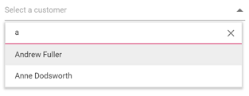
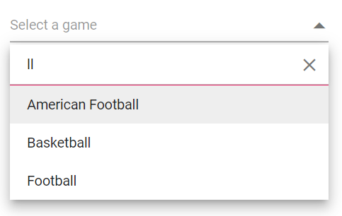
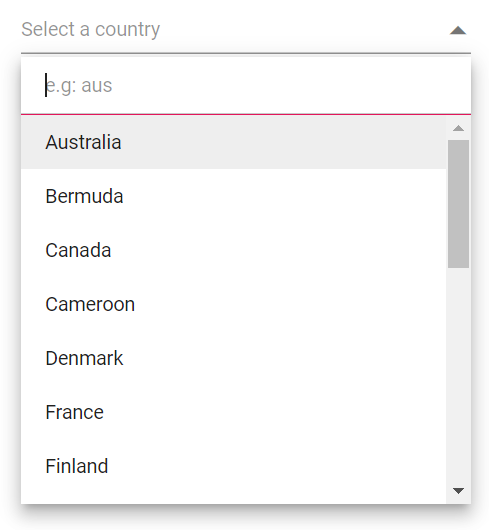
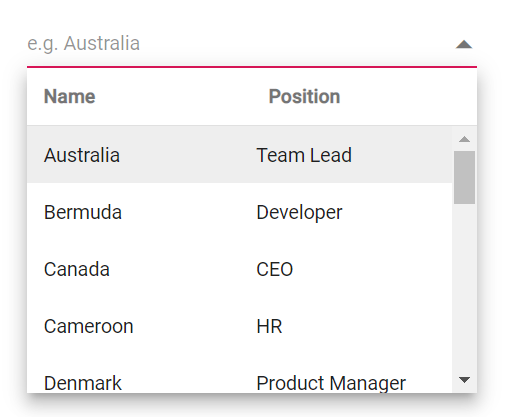

# Filtering in Blazor DropDown List Component

The DropDownList has built-in support to filter data items when [AllowFiltering](https://help.syncfusion.com/cr/blazor/Syncfusion.Blazor.DropDowns.SfDropDownList-2.html#Syncfusion_Blazor_DropDowns_SfDropDownList_2_AllowFiltering) is enabled. The filter operation starts as soon as you start typing characters in the search box.

## Local Data

Here, we have demonstrated the filtering functionality with local data in the DropDownList component.

```cshtml
@using Syncfusion.Blazor.DropDowns

<SfDropDownList TValue="string" TItem="Countries" Placeholder="Select a country" AllowFiltering="true" DataSource="@Country">
    <DropDownListFieldSettings Text="Name" Value="Code"></DropDownListFieldSettings>
</SfDropDownList>

@code{
    public class Countries
    {
        public string Name { get; set; }
        public string Code { get; set; }
    }
    
    private List<Countries> Country = new List<Countries>
    {
        new Countries() { Name = "Australia", Code = "AU" },
        new Countries() { Name = "Bermuda", Code = "BM" },
        new Countries() { Name = "Canada", Code = "CA" },
        new Countries() { Name = "Cameroon", Code = "CM" },
        new Countries() { Name = "Denmark", Code = "DK" },
        new Countries() { Name = "France", Code = "FR" },
        new Countries() { Name = "Finland", Code = "FI" },
        new Countries() { Name = "Germany", Code = "DE" },
        new Countries() { Name = "Greenland", Code = "GL" },
        new Countries() { Name = "Hong Kong", Code = "HK" },
        new Countries() { Name = "India", Code = "IN" },
        new Countries() { Name = "Italy", Code = "IT" },
        new Countries() { Name = "Japan", Code = "JP" },
        new Countries() { Name = "Mexico", Code = "MX" },
        new Countries() { Name = "Norway", Code = "NO" },
        new Countries() { Name = "Poland", Code = "PL" },
        new Countries() { Name = "Switzerland", Code = "CH" },
        new Countries() { Name = "United Kingdom", Code = "GB" },
        new Countries() { Name = "United States", Code = "US" },
    };
}
```

The output will be as follows.



## Remote Data

Here, we have demonstrated the filtering functionality with ODataAdaptor in the DropDownList component with help of [Query](https://help.syncfusion.com/cr/blazor/Syncfusion.Blazor.Data.Query.html) property.



@using Syncfusion.Blazor.DropDowns
@using Syncfusion.Blazor.Data
    <SfDropDownList TValue="string" TItem="OrderDetails" PopupHeight="230px" Placeholder="Select a name" Query="@RemoteDataQuery" AllowFiltering=true>
                    <SfDataManager Url="https://js.syncfusion.com/demos/ejServices/Wcf/Northwind.svc/Orders" CrossDomain="true" Adaptor="Syncfusion.Blazor.Adaptors.ODataAdaptor"/>
                    <DropDownListFieldSettings Text="CustomerID" Value="CustomerID"/>
                </SfDropDownList>

@code{
     public Query RemoteDataQuery = new Query().Select(new List<string> { "CustomerID" }).Take(6).RequiresCount();
    public class OrderDetails
    {
        public int? OrderID { get; set; }
        public string CustomerID { get; set; }
        public int? EmployeeID { get; set; }
        public double? Freight { get; set; }
        public string ShipCity { get; set; }
        public bool Verified { get; set; }
        public DateTime? OrderDate { get; set; }
        public string ShipName { get; set; }
        public string ShipCountry { get; set; }
        public DateTime? ShippedDate { get; set; }
        public string ShipAddress { get; set; }
    }
}



## Filter Type

The [FilterType](https://help.syncfusion.com/cr/blazor/Syncfusion.Blazor.DropDowns.SfDropDownBase-1.html#Syncfusion_Blazor_DropDowns_SfDropDownBase_1_FilterType) property used to determines on which filter type, the component needs to be considered on search action and its supported data types are,

FilterType     | Description
------------ | -------------
  StartsWith       | Checks whether a value begins with the specified value.
  EndsWith     | Checks whether a value ends with specified value.
  Contains      | Checks whether a value contains with specified value.

In the following example, `EndsWith` filter type has been mapped to the `FilterType` property.



@using Syncfusion.Blazor.DropDowns

<SfDropDownList TValue="string" TItem="Games" Width="300px" FilterType="FilterType.EndsWith" AllowFiltering=true Placeholder="Select a game" DataSource="@LocalData">
  <DropDownListFieldSettings Value="ID" Text="Game"></DropDownListFieldSettings>
</SfDropDownList>

@code{
  public class Games
    {  
        public string ID { get; set; }
        public string Game { get; set; }
    }
    List<Games> LocalData = new List<Games> {
    new Games() { ID= "Game1", Game= "American Football" },
    new Games() { ID= "Game2", Game= "Badminton" },
    new Games() { ID= "Game3", Game= "Basketball" },
    new Games() { ID= "Game4", Game= "Cricket" },
    new Games() { ID= "Game5", Game= "Football" },
    new Games() { ID= "Game6", Game= "Golf" },
    new Games() { ID= "Game7", Game= "Hockey" },
    new Games() { ID= "Game8", Game= "Rugby"},
    new Games() { ID= "Game9", Game= "Snooker" },
  };
}



The output will be as follows.



## Case Sensitive Filtering

Data items can be filtered either with or without case sensitivity using the [DataManager](https://help.syncfusion.com/cr/blazor/Syncfusion.Blazor.Data.SfDataManager.html). This can be done by passing the fourth optional parameter [IgnoreCase](https://help.syncfusion.com/cr/blazor/Syncfusion.Blazor.Data.WhereFilter.html#Syncfusion_Blazor_Data_WhereFilter_IgnoreCase) of the [Where clause](https://help.syncfusion.com/cr/blazor/Syncfusion.Blazor.Data.Query.html#Syncfusion_Blazor_Data_Query_Where_Syncfusion_Blazor_Data_WhereFilter_).

The following example shows how to perform case-sensitive filter.



@using Syncfusion.Blazor.Data
@using Syncfusion.Blazor.DropDowns

<SfDropDownList TValue="string" @ref="ddlObj" TItem="OrderDetails" Placeholder="Select a customer" Query="@Query" AllowFiltering=true>
    <SfDataManager Url="https://services.odata.org/V4/Northwind/Northwind.svc/Employees" Adaptor="Syncfusion.Blazor.Adaptors.ODataV4Adaptor" CrossDomain=true></SfDataManager>
    <DropDownListFieldSettings Text="FirstName" Value="LastName"></DropDownListFieldSettings>
    <DropDownListEvents TValue=string TItem="OrderDetails" Filtering="OnFiltering"></DropDownListEvents>
</SfDropDownList>

@code {
    SfDropDownList<string, OrderDetails> ddlObj;
    public Query Query = new Query().Select(new List<string> { "FirstName", "LastName" }).Take(7).RequiresCount();

    public class OrderDetails
    {
        public int? EmployeeID { get; set; }
        public string LastName { get; set; }
        public string FirstName { get; set; }
        public string Title { get; set; }
        public string TitleOfCourtesy { get; set; }
        public DateTime? BirthDate { get; set; }
        public DateTime? HireDate { get; set; }
        public string Address { get; set; }
        public int? Extension { get; set; }
        public int? Phone { get; set; }
    }
    public async Task OnFiltering(FilteringEventArgs args)
    {
        args.PreventDefaultAction = true;
        var query = new Query().Where(new WhereFilter() { Field = "LastName", value = args.Text, Operator = "contains", IgnoreAccent = true, IgnoreCase = true });
        query = !string.IsNullOrEmpty(args.Text) ? query : new Query();
        await ddlObj.FilterAsync(ddlObj.DataSource, query);
    }
}



## Filter Textbox Placeholder 

The [FilterBarPlaceholder](https://help.syncfusion.com/cr/blazor/Syncfusion.Blazor.DropDowns.SfDropDownList-2.html#Syncfusion_Blazor_DropDowns_SfDropDownList_2_FilterBarPlaceholder) accepts the value to be displayed as a watermark text on the filter bar.



@using Syncfusion.Blazor.DropDowns

<SfDropDownList TValue="string" TItem="Countries" AllowFiltering=true FilterBarPlaceholder="e.g: aus" Placeholder="Select a country" Width="300px" DataSource="@Country">
    <DropDownListFieldSettings Text="Name" Value="Code"></DropDownListFieldSettings>
</SfDropDownList>

@code {

    public class Countries
    {
        public string Name { get; set; }

        public string Code { get; set; }
    }

    List<Countries>Country = new List<Countries>
    {
        new Countries() { Name = "Australia", Code = "AU" },
        new Countries() { Name = "Bermuda", Code = "BM" },
        new Countries() { Name = "Canada", Code = "CA" },
        new Countries() { Name = "Cameroon", Code = "CM" },
        new Countries() { Name = "Denmark", Code = "DK" },
        new Countries() { Name = "France", Code = "FR" },
        new Countries() { Name = "Finland", Code = "FI" },
        new Countries() { Name = "Germany", Code = "DE" },
        new Countries() { Name = "Greenland", Code = "GL" },
        new Countries() { Name = "Hong Kong", Code = "HK" },
        new Countries() { Name = "India", Code = "IN" },
        new Countries() { Name = "Italy", Code = "IT" },
        new Countries() { Name = "Japan", Code = "JP" },
        new Countries() { Name = "Mexico", Code = "MX" },
        new Countries() { Name = "Norway", Code = "NO" },
        new Countries() { Name = "Poland", Code = "PL" },
        new Countries() { Name = "Switzerland", Code = "CH" },
        new Countries() { Name = "United Kingdom", Code = "GB" },
        new Countries() { Name = "United States", Code = "US" },
    };
}



The output will be as follows.



## Custom Filtering

The DropDownList component filter queries can be customized. You can also use your own filter libraries to filter data like Fuzzy search.

In the below sample demonstration, We can filter the data either using its `FirstName` or `LastName` field. Hence in the Filtering event, [Predicate](https://help.syncfusion.com/cr/blazor/Syncfusion.Blazor.Data.WhereFilter.html#Syncfusion_Blazor_Data_WhereFilter_Condition) is used with `or` condition for filtering both the fields. 

For instance , the data source item consist of `FirstName` as `Nancy` and `LastName` as `Davalio`. But you can filter the data either by typing `N` or `D` character and it will showcase the `Nancy` (FirstName field) in the popup.

```cshtml
@using Syncfusion.Blazor.Data
@using Syncfusion.Blazor.DropDowns

<SfDropDownList TValue="string" @ref="ddlObj" TItem="OrderDetails" Placeholder="Select a customer" Query="@Query" AllowFiltering=true>
    <SfDataManager Url="https://services.odata.org/V4/Northwind/Northwind.svc/Employees" Adaptor="Syncfusion.Blazor.Adaptors.ODataV4Adaptor" CrossDomain=true></SfDataManager>
    <DropDownListFieldSettings Text="FirstName" Value="LastName"></DropDownListFieldSettings>
    <DropDownListEvents TValue=string TItem="OrderDetails" Filtering="OnFiltering"></DropDownListEvents>
</SfDropDownList>

@code {
    SfDropDownList<string, OrderDetails> ddlObj;
    public Query Query = new Query().Select(new List<string> { "FirstName", "LastName" }).Take(7).RequiresCount();

    public class OrderDetails
    {
        public int? EmployeeID { get; set; }
        public string LastName { get; set; }
        public string FirstName { get; set; }
        public string Title { get; set; }
        public string TitleOfCourtesy { get; set; }
        public DateTime? BirthDate { get; set; }
        public DateTime? HireDate { get; set; }
        public string Address { get; set; }
        public int? Extension { get; set; }
        public int? Phone { get; set; }
    }
    public async Task OnFiltering(FilteringEventArgs args)
    {
        args.PreventDefaultAction = true;
        var pre = new WhereFilter();
        var predicate = new List<WhereFilter>();
        predicate.Add(new WhereFilter() { Condition = "or", Field = "FirstName", value = args.Text, Operator = "contains", IgnoreAccent = true, IgnoreCase = true });
        predicate.Add(new WhereFilter() { Condition = "or", Field = "LastName", value = args.Text, Operator = "contains", IgnoreAccent = true, IgnoreCase = true });
        pre = WhereFilter.Or(predicate);
        var query = new Query().Where(pre);
        await ddlObj.FilterAsync(ddlObj.DataSource, query);
    }
}
```

## Multi Column Filtering 

We have provided a multi column style class in the built-in Syncfusion Blazor theme files. So, we need to provide the multicolumn root class API name as `e-multi-column` in the CssClass property.





@using Syncfusion.Blazor.DropDowns

<SfDropDownList TValue="string" Width="300px" TItem="Countries" Placeholder="e.g. Australia" PopupHeight="200px" CssClass="e-multi-column" DataSource="@Country">
    <DropDownListFieldSettings Value="Code" Text="Name"></DropDownListFieldSettings>
    <DropDownListTemplates TItem="Countries">
        <HeaderTemplate>
            <table><tr><th>Name</th><th>Position</th></tr></table>
        </HeaderTemplate>
        <ItemTemplate>
            <table><tbody><tr>
    <td>@((context as Countries).Name)</td>
    <td >@((context as Countries).Job)</td>
</tr> </tbody></table>
        </ItemTemplate>
    </DropDownListTemplates>
</SfDropDownList>
@code{
    public class Countries
    {
        public string Name { get; set; }
        public string Code { get; set; }
        public string Job { get; set; }

    }
    List<Countries> Country = new List<Countries>
{
       new Countries() { Name = "Australia", Code = "AU",Job= "Team Lead" },
        new Countries() { Name = "Bermuda", Code = "BM",Job="Developer"  },
        new Countries() { Name = "Canada", Code = "CA",Job="CEO"  },
        new Countries() { Name = "Cameroon", Code = "CM" ,Job="HR" },
        new Countries() { Name = "Denmark", Code = "DK",Job="Product Manager"  },
        new Countries() { Name = "France", Code = "FR",Job="Developer"  },
        new Countries() { Name = "Finland", Code = "FI",Job="Team Lead"  },
        new Countries() { Name = "Germany", Code = "DE",Job="Product Manager"  },
        new Countries() { Name = "Greenland", Code = "GL",Job="Developer"  },
        new Countries() { Name = "Hong Kong", Code = "HK",Job="CEO"  },
        new Countries() { Name = "India", Code = "IN",Job="HR"  },
        new Countries() { Name = "Italy", Code = "IT",Job="Team Lead"  },
        new Countries() { Name = "Japan", Code = "JP",Job="Developer"  },
        new Countries() { Name = "Mexico", Code = "MX",Job="Product Manager"  },
        new Countries() { Name = "Norway", Code = "NO",Job="HR"  },
        new Countries() { Name = "Poland", Code = "PL",Job="Team Lead"  },
        new Countries() { Name = "Switzerland", Code = "CH",Job="Product Manager"  },
        new Countries() { Name = "United Kingdom", Code = "GB",Job="CEO"  },
        new Countries() { Name = "United States", Code = "US",Job="Developer"  },
        };

}



The output will be as follows.



## Minimum Filter Length

When filtering the list items, you can set the limit for character count to raise remote request and fetch filtered data on the DropDownList. This can be done by manual validation by using the [Filtering event arguments](https://help.syncfusion.com/cr/blazor/Syncfusion.Blazor.DropDowns.FilteringEventArgs.html#Syncfusion_Blazor_DropDowns_FilteringEventArgs_Text) within the [Filtering](https://help.syncfusion.com/cr/blazor/Syncfusion.Blazor.DropDowns.DropDownListEvents-2.html#Syncfusion_Blazor_DropDowns_DropDownListEvents_2_Filtering) event handler.

In the following example, the remote request does not fetch the search data until the search key contains three characters.



@using Syncfusion.Blazor.Data
@using Syncfusion.Blazor.DropDowns

<SfDropDownList TValue="string" @ref="ddlObj" TItem="OrderDetails" Placeholder="Select a customer" Query="@Query" AllowFiltering=true>
    <SfDataManager Url="https://services.odata.org/V4/Northwind/Northwind.svc/Employees" Adaptor="Syncfusion.Blazor.Adaptors.ODataV4Adaptor" CrossDomain=true></SfDataManager>
    <DropDownListFieldSettings Text="FirstName" Value="LastName"></DropDownListFieldSettings>
    <DropDownListEvents TValue=string TItem="OrderDetails" Filtering="OnFiltering"></DropDownListEvents>
</SfDropDownList>

@code {
    SfDropDownList<string, OrderDetails> ddlObj;
    public Query Query = new Query().Select(new List<string> { "FirstName", "LastName" }).Take(7).RequiresCount();

    public class OrderDetails
    {
        public int? EmployeeID { get; set; }
        public string LastName { get; set; }
        public string FirstName { get; set; }
        public string Title { get; set; }
        public string TitleOfCourtesy { get; set; }
        public DateTime? BirthDate { get; set; }
        public DateTime? HireDate { get; set; }
        public string Address { get; set; }
        public int? Extension { get; set; }
        public int? Phone { get; set; }
    }
    public async Task OnFiltering(FilteringEventArgs args)
    {
        args.PreventDefaultAction = true;
        // load overall data when search key empty.
        if (args.Text == "") await ddlObj.FilterAsync(ddlObj.DataSource);
        // restrict the remote request until search key contains 3 characters.
        else if (args.Text.Length < 3) { return; }
        else
        {
            var query = new Query().Where(new WhereFilter() { Field = "FirstName", value = args.Text, Operator = "contains", IgnoreAccent = true, IgnoreCase = true });
            query = !string.IsNullOrEmpty(args.Text) ? query : new Query();
            await ddlObj.FilterAsync(ddlObj.DataSource, query);
        }
    }
}


