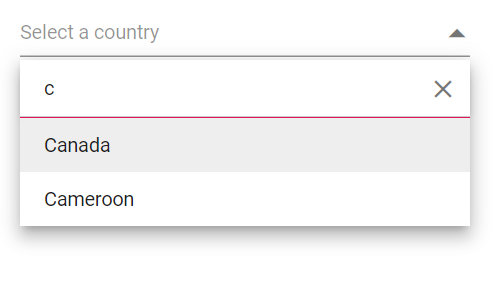
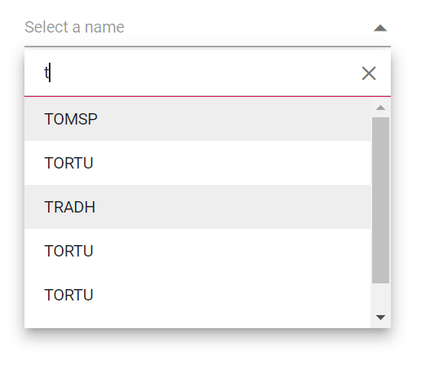
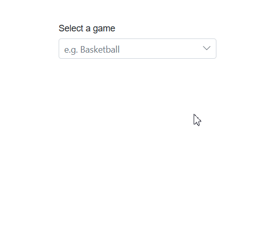
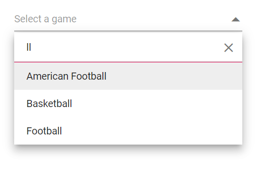
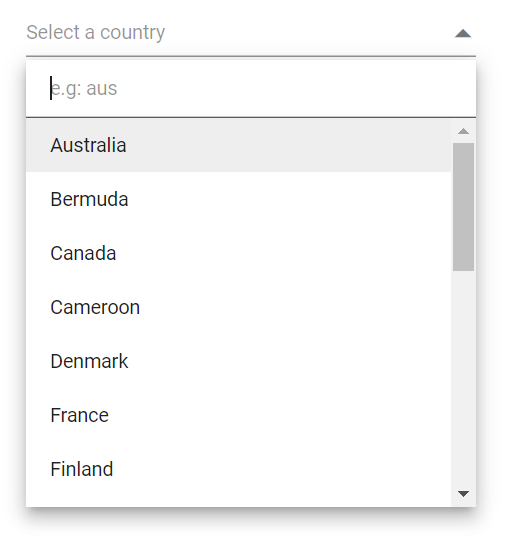
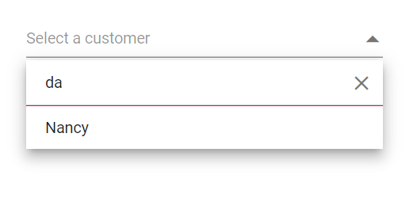
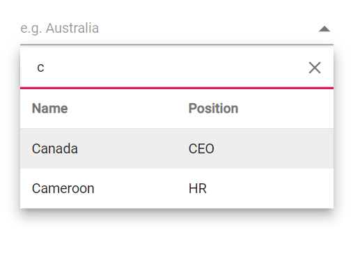
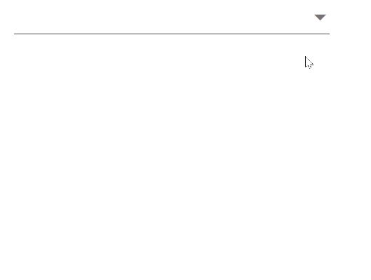
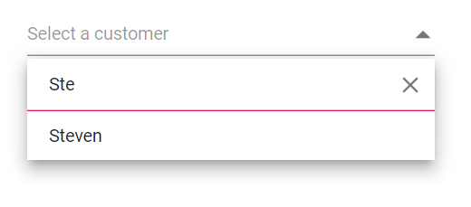

# Filtering in Dropdown List

The DropDown List component supports built-in filtering when [AllowFiltering](https://help.syncfusion.com/cr/blazor/Syncfusion.Blazor.DropDowns.SfDropDownList-2.html#Syncfusion_Blazor_DropDowns_SfDropDownList_2_AllowFiltering) is enabled. Filtering begins as the user types in the search box. The default value of AllowFiltering is `false`.

## Local data

The following example demonstrates filtering with local data in the DropDown List component.







## Remote data

For remote data, a filter request is sent to the server for each keystroke. Shape the query on the server side to return the filtered results.

The following example demonstrates filtering with [ODataAdaptor](https://blazor.syncfusion.com/documentation/data/adaptors#odata-adaptor) using the [Query](https://help.syncfusion.com/cr/blazor/Syncfusion.Blazor.Data.Query.html) property.







## Debounce delay

Use the [DebounceDelay](https://help.syncfusion.com/cr/blazor/Syncfusion.Blazor.DropDowns.SfDropDownList-2.html#Syncfusion_Blazor_DropDowns_SfDropDownList_2_DebounceDelay) property to control the delay (in milliseconds) before filtering is applied as the user types. Debouching reduces the frequency of requests and improves responsiveness. By default, DebounceDelay is 300 ms. To disable debouching, set this property to 0.







## Filter type

Use the [FilterType](https://help.syncfusion.com/cr/blazor/Syncfusion.Blazor.DropDowns.SfDropDownBase-1.html#Syncfusion_Blazor_DropDowns_SfDropDownBase_1_FilterType) property to specify the match behavior for search text. The available options are:

FilterType     | Description
------------ | -------------
  [StartsWith](https://help.syncfusion.com/cr/blazor/Syncfusion.Blazor.DropDowns.FilterType.html#Syncfusion_Blazor_DropDowns_FilterType_StartsWith)       | Checks whether a value begins with the specified text.
  [EndsWith](https://help.syncfusion.com/cr/blazor/Syncfusion.Blazor.DropDowns.FilterType.html#Syncfusion_Blazor_DropDowns_FilterType_EndsWith)     | Checks whether a value ends with the specified text.
  [Contains](https://help.syncfusion.com/cr/blazor/Syncfusion.Blazor.DropDowns.FilterType.html#Syncfusion_Blazor_DropDowns_FilterType_Contains)      | Checks whether a value contains the specified text.

In the following example, `EndsWith` is assigned to `FilterType`.







## Case sensitive filtering

Data can be filtered with or without case sensitivity by configuring the [DataManager](https://help.syncfusion.com/cr/blazor/Syncfusion.Blazor.Data.SfDataManager.html) query. Pass the `IgnoreCase` optional parameter (fourth argument) to the [Where clause](https://help.syncfusion.com/cr/blazor/Syncfusion.Blazor.Data.Query.html#Syncfusion_Blazor_Data_Query_Where_Syncfusion_Blazor_Data_WhereFilter_) to control case behavior.

The following example shows a case-sensitive filter.







## Filter textbox placeholder 

Use [FilterBarPlaceholder](https://help.syncfusion.com/cr/blazor/Syncfusion.Blazor.DropDowns.SfDropDownList-2.html#Syncfusion_Blazor_DropDowns_SfDropDownList_2_FilterBarPlaceholder) to display watermark text in the filter bar textbox. This property applies when [AllowFiltering](https://help.syncfusion.com/cr/blazor/Syncfusion.Blazor.DropDowns.SfDropDownList-2.html#Syncfusion_Blazor_DropDowns_SfDropDownList_2_AllowFiltering) is set to `true`.







## Custom filtering

Customize filter queries using the [Filtering](https://help.syncfusion.com/cr/blazor/Syncfusion.Blazor.DropDowns.DropDownListEvents-2.html#Syncfusion_Blazor_DropDowns_DropDownListEvents_2_Filtering) event. This enables scenarios such as filtering across multiple fields.

In the following example, the data is filtered by matching text in both the `FirstName` and `LastName` fields using a predicate with an OR condition. For instance, if a record has `FirstName` as `Nancy` and `LastName` as `Davalio`, typing `N` or `D` will match and display the item in the popup.







## Multi column filtering 

To enable multi-column layout in the built-in Syncfusion&reg; Blazor themes, add the `e-multi-column` class via the [CssClass](https://help.syncfusion.com/cr/blazor/Syncfusion.Blazor.DropDowns.DropDownListModel-2.html#Syncfusion_Blazor_DropDowns_DropDownListModel_2_CssClass) property.







To filter by multiple fields, pass a list of [predicates](https://help.syncfusion.com/cr/blazor/Syncfusion.Blazor.Data.WhereFilter.html#Syncfusion_Blazor_Data_WhereFilter_predicates) to the [And](https://help.syncfusion.com/cr/blazor/Syncfusion.Blazor.Data.WhereFilter.html#Syncfusion_Blazor_Data_WhereFilter_And_Syncfusion_Blazor_Data_WhereFilter_) or [Or](https://help.syncfusion.com/cr/blazor/Syncfusion.Blazor.Data.WhereFilter.html#Syncfusion_Blazor_Data_WhereFilter_Or_Syncfusion_Blazor_Data_WhereFilter_) methods of [WhereFilters](https://help.syncfusion.com/cr/blazor/Syncfusion.Blazor.Data.WhereFilter.html#Syncfusion_Blazor_Data_WhereFilter__ctor).







## Minimum filter length

When filtering with remote data, you can require a minimum number of characters before issuing a request. Validate the input length using the [Filtering event arguments](https://help.syncfusion.com/cr/blazor/Syncfusion.Blazor.DropDowns.FilteringEventArgs.html#Syncfusion_Blazor_DropDowns_FilteringEventArgs_Text) within the [Filtering](https://help.syncfusion.com/cr/blazor/Syncfusion.Blazor.DropDowns.DropDownListEvents-2.html#Syncfusion_Blazor_DropDowns_DropDownListEvents_2_Filtering) event handler.

In the following example, the remote request is not made until at least three characters are entered.







