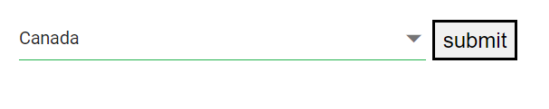

# Form Validation in Dropdown List

This article explains how to use the Syncfusion Blazor DropDownList component in a validated form. It shows how to bind to a model, apply data annotations, and display validation errors so the form can be submitted only when required fields are valid.

## Dropdown List inside edit form

The `DropDownList` component can be placed inside an `EditForm` to enable data annotation–based validation through the `DataAnnotationsValidator` component. When the input is valid, the form can be submitted; if invalid, the corresponding validation message is shown until a valid value is selected.

- The `EditForm` component wraps the form, sets the `Model` to an instance of the model type (for example, `Countries`), and invokes the form’s submit handler on submission.
- The `DataAnnotationsValidator` component enables validation based on the data annotation attributes applied to the model’s properties (for example, `[Required]` on the bound field).
- The `ValidationSummary` component displays a summary of all validation errors in the form.
- The `ValidationMessage` component displays a validation error message for the specific bound property associated with the `DropDownList`.
- The submit button triggers form submission and executes the configured submit handler when clicked.







