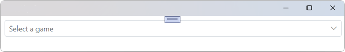

# Getting Started with Blazor DropDownList Component

This section guides through integrating the Syncfusion<sup style="font-size:70%">&reg;</sup> Blazor DropDownList component into a .NET MAUI Blazor application using both Visual Studio and Visual Studio Code.





## Prerequisites

Install the Mobile development with .NET workload for Visual Studio to use .NET MAUI project templates. For details, refer to the .NET MAUI installation guide and the Syncfusion Blazor extension documentation:
- https://learn.microsoft.com/en-us/dotnet/MAUI/get-started/installation?tabs=vswin
- https://blazor.syncfusion.com/documentation/visual-studio-integration/template-studio

## Create a new Blazor MAUI App in Visual Studio

Create a Blazor MAUI App using Visual Studio via [Microsoft Templates](https://learn.microsoft.com/en-us/dotnet/maui/get-started/first-app?pivots=devices-windows&view=net-maui-9.0&tabs=vswin). For detailed instructions, refer to [this Blazor MAUI App Getting Started](https://blazor.syncfusion.com/documentation/getting-started/maui-blazor-app) documentation.

## Install Syncfusion<sup style="font-size:70%">&reg;</sup> Blazor DropDowns and Themes NuGet in the app

To add the Blazor DropDownList component, open the NuGet Package Manager (Tools → NuGet Package Manager → Manage NuGet Packages for Solution), then install Syncfusion.Blazor.DropDowns and Syncfusion.Blazor.Themes:
- https://www.nuget.org/packages/Syncfusion.Blazor.DropDowns
- https://www.nuget.org/packages/Syncfusion.Blazor.Themes




Install-Package Syncfusion.Blazor.DropDowns -Version {{ site.releaseversion }}
Install-Package Syncfusion.Blazor.Themes -Version {{ site.releaseversion }}




N> Syncfusion<sup style="font-size:70%">&reg;</sup> Blazor components are available on NuGet. See the NuGet packages list for available components and details:
- https://www.nuget.org/packages?q=syncfusion.blazor
- https://blazor.syncfusion.com/documentation/nuget-packages





## Prerequisites

Ensure the .NET SDK is installed and the .NET MAUI workloads are added via the .NET CLI. For setup guidance, refer to:
- https://learn.microsoft.com/en-us/dotnet/maui/get-started/installation?view=net-maui-9.0&tabs=visual-studio-code
- https://blazor.syncfusion.com/documentation/visual-studio-code-integration/create-project

## Create a new Blazor MAUI App in Visual Studio Code

Create a Blazor MAUI App using Visual Studio Code via [Microsoft Templates](https://learn.microsoft.com/en-us/dotnet/maui/get-started/first-app?pivots=devices-windows&view=net-maui-9.0&tabs=visual-studio-code) or the [Syncfusion® Blazor Extension](https://blazor.syncfusion.com/documentation/visual-studio-code-integration/create-project). For detailed instructions, refer to [this Blazor MAUI App Getting Started](https://blazor.syncfusion.com/documentation/getting-started/maui-blazor-app) documentation.

## Install Blazor DropDowns and Themes NuGet in the App

To add **Blazor DropDownList**  component in the app, open the NuGet package manager in Visual Studio (Tools → NuGet Package Manager → Manage NuGet Packages for Solution), search and install [Syncfusion.Blazor.DropDowns](https://www.nuget.org/packages/Syncfusion.Blazor.DropDowns) and [Syncfusion.Blazor.Themes](https://www.nuget.org/packages/Syncfusion.Blazor.Themes/).





dotnet add package Syncfusion.Blazor.DropDowns -v {{ site.releaseversion }}
dotnet add package Syncfusion.Blazor.Themes -v {{ site.releaseversion }}
dotnet restore





N> Syncfusion<sup style="font-size:70%">&reg;</sup> Blazor components are available on NuGet. See the NuGet packages list for available components and details:
- https://www.nuget.org/packages?q=syncfusion.blazor
- https://blazor.syncfusion.com/documentation/nuget-packages





## Add Import Namespaces

Open the **~/_Imports.razor** file and import the `Syncfusion.Blazor` and `Syncfusion.Blazor.DropDowns` namespaces.




@using Syncfusion.Blazor 
@using Syncfusion.Blazor.DropDowns




## Register Syncfusion<sup style="font-size:70%">&reg;</sup> Blazor Service

Register the Syncfusion<sup style="font-size:70%">&reg;</sup> Blazor Service in the **~/MauiProgram.cs** file.




using Microsoft.Extensions.Logging;
using Syncfusion.Blazor;

namespace MauiBlazorWindow;

    public static class MauiProgram
    {
        public static MauiApp CreateMauiApp()
        {
            var builder = MauiApp.CreateBuilder();
            builder
                .UseMauiApp<App>()
                .ConfigureFonts(fonts =>
                {
                    fonts.AddFont("OpenSans-Regular.ttf", "OpenSansRegular");
                });

            builder.Services.AddMauiBlazorWebView();
            builder.Services.AddSyncfusionBlazor();
#if DEBUG
            builder.Services.AddBlazorWebViewDeveloperTools();
            builder.Logging.AddDebug();
#endif

            return builder.Build();
        }
    }




## Add stylesheet and script resources

The theme stylesheet and script can be accessed from NuGet through [Static Web Assets](https://blazor.syncfusion.com/documentation/appearance/themes#static-web-assets). Include the stylesheet and script references in the `<head>` section of the **~/index.html** file.

```html
<head>
    ....
    <link href="_content/Syncfusion.Blazor.Themes/bootstrap5.css" rel="stylesheet" />
    <script src="_content/Syncfusion.Blazor.Core/scripts/syncfusion-blazor.min.js" type="text/javascript"></script>

    //Blazor DropDown List Component script reference.
    <!-- <script src="_content/Syncfusion.Blazor.DropDowns/scripts/sf-dropdownlist.min.js" type="text/javascript"></script> -->
</head>
```
N> Check out the [Blazor Themes](https://blazor.syncfusion.com/documentation/appearance/themes) topic to discover various methods ([Static Web Assets](https://blazor.syncfusion.com/documentation/appearance/themes#static-web-assets), [CDN](https://blazor.syncfusion.com/documentation/appearance/themes#cdn-reference), and [CRG](https://blazor.syncfusion.com/documentation/common/custom-resource-generator)) for referencing themes in your Blazor application. Also, check out the [Adding Script Reference](https://blazor.syncfusion.com/documentation/common/adding-script-references) topic to learn different approaches for adding script references in your Blazor application.

## Add Blazor DropDown List component

Add the Syncfusion<sup style="font-size:70%">&reg;</sup> Blazor DropDown List component in the ~/Pages/Index.razor file.




<SfDropDownList TValue="string" TItem="string" Placeholder="Select a game"></SfDropDownList>




### How to Run the Sample on Windows

Run the sample in Windows Machine mode to launch the .NET MAUI Blazor app on Windows.



### How to Run the Sample on Android

To run the Blazor DataGrid in a Blazor Android MAUI application using the Android emulator, follow these steps:

Refer [here](https://learn.microsoft.com/en-us/dotnet/maui/android/emulator/device-manager#android-device-manager-on-windows) to install and launch Android emulator.

N> If you encounter any errors while using the Android Emulator, refer to the following link for troubleshooting guidance[Troubleshooting Android Emulator](https://learn.microsoft.com/en-us/dotnet/maui/android/emulator/troubleshooting).


## Binding data source

After initialization, populate the DropDownList with data using the [DataSource](https://help.syncfusion.com/cr/blazor/Syncfusion.Blazor.DropDowns.SfDropDownBase-1.html#Syncfusion_Blazor_DropDowns_SfDropDownBase_1_DataSource) property.




<SfDropDownList TValue="string" TItem="Games" Placeholder="Select a game" DataSource="@LocalData">
  <DropDownListFieldSettings Value="ID" Text="Text"></DropDownListFieldSettings>
</SfDropDownList>

@code {
  public class Games
  {
    public string ID { get; set; }
    public string Text { get; set; }
  }
  List<Games> LocalData = new List<Games> {
    new Games() { ID= "Game1", Text= "American Football" },
    new Games() { ID= "Game2", Text= "Badminton" },
    new Games() { ID= "Game3", Text= "Basketball" },
    new Games() { ID= "Game4", Text= "Cricket" },
    new Games() { ID= "Game5", Text= "Football" },
    new Games() { ID= "Game6", Text= "Golf" },
    new Games() { ID= "Game7", Text= "Hockey" },
    new Games() { ID= "Game8", Text= "Rugby"},
    new Games() { ID= "Game9", Text= "Snooker" },
    new Games() { ID= "Game10", Text= "Tennis"},
  };
}






## Configure the popup list

By default, the width of the popup list automatically adjusts according to the DropDownList input element's width, and the height of the popup list has `350px`. The height and width of the popup list can also be customized using the [PopupHeight](https://help.syncfusion.com/cr/blazor/Syncfusion.Blazor.DropDowns.SfDropDownList-2.html#Syncfusion_Blazor_DropDowns_SfDropDownList_2_PopupHeight) and [PopupWidth](https://help.syncfusion.com/cr/blazor/Syncfusion.Blazor.DropDowns.SfDropDownList-2.html#Syncfusion_Blazor_DropDowns_SfDropDownList_2_PopupWidth) properties respectively.




<SfDropDownList TValue="string" TItem="Games" PopupHeight="350px" PopupWidth="350px" Placeholder="Select a game" DataSource="@LocalData">
  <DropDownListFieldSettings Value="ID" Text="Text"></DropDownListFieldSettings>
</SfDropDownList>

@code{
  public class Games
  {
    public string ID { get; set; }
    public string Text { get; set; }
  }
  List<Games> LocalData = new List<Games> {
    new Games() { ID= "Game1", Text= "American Football" },
    new Games() { ID= "Game2", Text= "Badminton" },
    new Games() { ID= "Game3", Text= "Basketball" },
    new Games() { ID= "Game4", Text= "Cricket" },
    new Games() { ID= "Game5", Text= "Football" },
    new Games() { ID= "Game6", Text= "Golf" },
    new Games() { ID= "Game7", Text= "Hockey" },
    new Games() { ID= "Game8", Text= "Rugby"},
    new Games() { ID= "Game9", Text= "Snooker" },
    new Games() { ID= "Game10", Text= "Tennis"},
  };
}






## Get selected value

Get the selected value of the DropDownList component in the [ValueChange](https://help.syncfusion.com/cr/blazor/Syncfusion.Blazor.DropDowns.DropDownListEvents-2.html#Syncfusion_Blazor_DropDowns_DropDownListEvents_2_ValueChange) event using [ChangeEventArgs.Value](https://help.syncfusion.com/cr/blazor/Syncfusion.Blazor.DropDowns.ChangeEventArgs-2.html#Syncfusion_Blazor_DropDowns_ChangeEventArgs_2_Value) property.








Get the complete object list of the selected value in the [ValueChange](https://help.syncfusion.com/cr/blazor/Syncfusion.Blazor.DropDowns.DropDownListEvents-2.html#Syncfusion_Blazor_DropDowns_DropDownListEvents_2_ValueChange) event using the [ChangeEventArgs.ItemData](https://help.syncfusion.com/cr/blazor/Syncfusion.Blazor.DropDowns.ChangeEventArgs-2.html#Syncfusion_Blazor_DropDowns_ChangeEventArgs_2_ItemData) property.








N> [View Sample in GitHub](https://github.com/SyncfusionExamples/Blazor-Getting-Started-Examples/tree/main/DropDownList).

## See also

1. [Getting Started with Syncfusion<sup style="font-size:70%">&reg;</sup> Blazor Web Assembly App in Visual Studio or .NET CLI](https://blazor.syncfusion.com/documentation/getting-started/blazor-webassembly-app)
2. [Getting Started with Syncfusion<sup style="font-size:70%">&reg;</sup> Blazor Web App in Visual Studio or .NET CLI](https://blazor.syncfusion.com/documentation/getting-started/blazor-web-app)