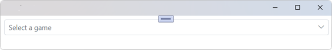
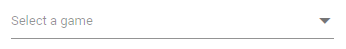

# Getting Started with Blazor Dropdown List Component in Blazor MAUI App

This section explains the step-by-step process of integrating the [Blazor Dropdown List](https://www.syncfusion.com/blazor-components/blazor-dropdown-list) component in your Blazor MAUI App using both [Visual Studio](https://visualstudio.microsoft.com/vs/) and [Visual Studio Code](https://code.visualstudio.com/), and the [.NET CLI](https://learn.microsoft.com/en-us/dotnet/core/tools/).

## Create a new Blazor MAUI App in Visual Studio





Create a Blazor MAUI App using Visual Studio via [Microsoft Templates](https://learn.microsoft.com/en-us/dotnet/maui/get-started/first-app?pivots=devices-windows&view=net-maui-9.0&tabs=vswin). For detailed instructions, refer to the [Blazor MAUI App Getting Started](https://blazor.syncfusion.com/documentation/getting-started/maui-blazor-app) documentation.





Run the following command to create a new Blazor MAUI App.




dotnet new maui-blazor -o MauiBlazorApp
cd MauiBlazorApp




Alternatively, create a **Blazor MAUI App** using Visual Studio Code via [Microsoft Templates](https://learn.microsoft.com/en-us/dotnet/maui/get-started/first-app?pivots=devices-windows&view=net-maui-9.0&tabs=visual-studio-code) or the [Blazor Extension](https://blazor.syncfusion.com/documentation/visual-studio-code-integration/create-project). For detailed instructions, refer to the [Blazor MAUI App Getting Started](https://blazor.syncfusion.com/documentation/getting-started/maui-blazor-app) documentation.





Run the following command to create a new Blazor MAUI App.




dotnet new maui-blazor -o MauiBlazorApp
cd MauiBlazorApp








## Install the required Blazor packages

Install the [Syncfusion.Blazor.DropDowns](https://www.nuget.org/packages/Syncfusion.Blazor.DropDowns) and [Syncfusion.Blazor.Themes](https://www.nuget.org/packages/Syncfusion.Blazor.Themes/) NuGet packages. All Syncfusion Blazor packages are available on [nuget.org](https://www.nuget.org/packages?q=syncfusion.blazor). See the [NuGet packages](https://blazor.syncfusion.com/documentation/nuget-packages) topic for details.





1. Go to *Tools → NuGet Package Manager → Manage NuGet Packages for Solution*.
2. Search the required NuGet packages (`Syncfusion.Blazor.DropDowns` and `Syncfusion.Blazor.Themes`) and install them.

Alternatively, you can install the same packages using the Package Manager Console with the following command.




Install-Package Syncfusion.Blazor.DropDowns -Version {{ site.releaseversion }}
Install-Package Syncfusion.Blazor.Themes -Version {{ site.releaseversion }}








Open the terminal and run the following command.




dotnet add package Syncfusion.Blazor.DropDowns -v {{ site.releaseversion }}
dotnet add package Syncfusion.Blazor.Themes -v {{ site.releaseversion }}








Open the command prompt and run the following command.




dotnet add package Syncfusion.Blazor.DropDowns -v {{ site.releaseversion }}
dotnet add package Syncfusion.Blazor.Themes -v {{ site.releaseversion }}








## Add import namespaces

After the packages are installed, open the **~/Components/_Imports.razor** file and import the `Syncfusion.Blazor` and `Syncfusion.Blazor.DropDowns` namespaces.




@using Syncfusion.Blazor 
@using Syncfusion.Blazor.DropDowns




## Register the Blazor service

Open the **MauiProgram.cs** file in Blazor MAUI App and register the Blazor service.




....
using Syncfusion.Blazor;
....

public static class MauiProgram
{
    public static MauiApp CreateMauiApp()
    {
        ....
        builder.Services.AddSyncfusionBlazor();
        ....
    }
}




## Add stylesheet and script resources

The theme stylesheet and script can be accessed from NuGet through [Static Web Assets](https://blazor.syncfusion.com/documentation/appearance/themes#static-web-assets). Include the [stylesheet](https://blazor.syncfusion.com/documentation/appearance/themes) and the [script references](https://blazor.syncfusion.com/documentation/common/adding-script-references) in the **~wwwroot/index.html** file.




....
<link href="_content/Syncfusion.Blazor.Themes/fluent2.css" rel="stylesheet" />
....




## Add Blazor Dropdown List component

Open a Razor file located in the **~/Components/Pages/*.razor** (for example, **Home.razor**) and add the [Blazor Dropdown List](https://www.syncfusion.com/blazor-components/blazor-dropdown-list) component inside the razor file.




<SfDropDownList TValue="string" TItem="string" Placeholder="Select a game"></SfDropDownList>




## Run the application on Windows





Press <kbd>Ctrl</kbd>+<kbd>F5</kbd> (Windows) or <kbd>⌘</kbd>+<kbd>F5</kbd> (macOS) to launch the application. The Blazor Dropdown List component will render in your default web browser.





Open the terminal and run the following command.




dotnet run








Open the command prompt and run the following command.




dotnet run








## Run the application on Android

To run the Blazor Dropdown List in a Blazor Android MAUI application using the Android emulator, follow these steps:

Refer [here](https://learn.microsoft.com/en-us/dotnet/maui/android/emulator/device-manager#android-device-manager-on-windows) to install and launch Android emulator.

N> If you encounter any errors while using the Android Emulator, refer to [Troubleshooting Android Emulator](https://learn.microsoft.com/en-us/dotnet/maui/android/emulator/troubleshooting) for guidance.

## Binding data source

After initialization, populate the Dropdown List with data using the [DataSource](https://help.syncfusion.com/cr/blazor/Syncfusion.Blazor.DropDowns.SfDropDownBase-1.html#Syncfusion_Blazor_DropDowns_SfDropDownBase_1_DataSource) property.




<SfDropDownList TValue="string" TItem="Games" Placeholder="Select a game" DataSource="@LocalData">
  <DropDownListFieldSettings Value="ID" Text="Text"></DropDownListFieldSettings>
</SfDropDownList>

@code 
{
  public class Games
  {
    public string ID { get; set; }
    public string Text { get; set; }
  }
  List<Games> LocalData = new List<Games> {
    new Games() { ID= "Game1", Text= "American Football" },
    new Games() { ID= "Game2", Text= "Badminton" },
    new Games() { ID= "Game3", Text= "Basketball" },
    new Games() { ID= "Game4", Text= "Cricket" },
    new Games() { ID= "Game5", Text= "Football" },
    new Games() { ID= "Game6", Text= "Golf" },
    new Games() { ID= "Game7", Text= "Hockey" },
    new Games() { ID= "Game8", Text= "Rugby"},
    new Games() { ID= "Game9", Text= "Snooker" },
    new Games() { ID= "Game10", Text= "Tennis"},
  };
}






## Configure the popup list

By default, the width of the popup list automatically adjusts according to the Dropdown List input element's width, and the height of the popup list has `350px`. The height and width of the popup list can also be customized using the [PopupHeight](https://help.syncfusion.com/cr/blazor/Syncfusion.Blazor.DropDowns.SfDropDownList-2.html#Syncfusion_Blazor_DropDowns_SfDropDownList_2_PopupHeight) and [PopupWidth](https://help.syncfusion.com/cr/blazor/Syncfusion.Blazor.DropDowns.SfDropDownList-2.html#Syncfusion_Blazor_DropDowns_SfDropDownList_2_PopupWidth) properties respectively.




<SfDropDownList TValue="string" TItem="Games" PopupHeight="350px" PopupWidth="350px" Placeholder="Select a game" DataSource="@LocalData">
  <DropDownListFieldSettings Value="ID" Text="Text"></DropDownListFieldSettings>
</SfDropDownList>

@code
{
  public class Games
  {
    public string ID { get; set; }
    public string Text { get; set; }
  }
  List<Games> LocalData = new List<Games> {
    new Games() { ID= "Game1", Text= "American Football" },
    new Games() { ID= "Game2", Text= "Badminton" },
    new Games() { ID= "Game3", Text= "Basketball" },
    new Games() { ID= "Game4", Text= "Cricket" },
    new Games() { ID= "Game5", Text= "Football" },
    new Games() { ID= "Game6", Text= "Golf" },
    new Games() { ID= "Game7", Text= "Hockey" },
    new Games() { ID= "Game8", Text= "Rugby"},
    new Games() { ID= "Game9", Text= "Snooker" },
    new Games() { ID= "Game10", Text= "Tennis"},
  };
}






## Get selected value

Get the selected value of the Dropdown List component in the [ValueChange](https://help.syncfusion.com/cr/blazor/Syncfusion.Blazor.DropDowns.DropDownListEvents-2.html#Syncfusion_Blazor_DropDowns_DropDownListEvents_2_ValueChange) event using [ChangeEventArgs.Value](https://help.syncfusion.com/cr/blazor/Syncfusion.Blazor.DropDowns.ChangeEventArgs-2.html#Syncfusion_Blazor_DropDowns_ChangeEventArgs_2_Value) property.







Get the complete object list of the selected value in the [ValueChange](https://help.syncfusion.com/cr/blazor/Syncfusion.Blazor.DropDowns.DropDownListEvents-2.html#Syncfusion_Blazor_DropDowns_DropDownListEvents_2_ValueChange) event using the [ChangeEventArgs.ItemData](https://help.syncfusion.com/cr/blazor/Syncfusion.Blazor.DropDowns.ChangeEventArgs-2.html#Syncfusion_Blazor_DropDowns_ChangeEventArgs_2_ItemData) property.







N> [View Sample in GitHub](https://github.com/SyncfusionExamples/Blazor-Getting-Started-Examples/tree/main/DropDownList).

## See also

1. [Getting Started with Blazor Dropdown List Data Binding](https://blazor.syncfusion.com/documentation/dropdown-list/data-binding)
