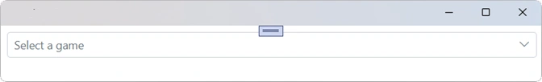
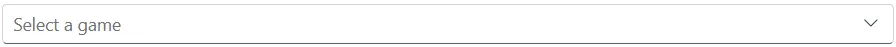

# Getting Started with Blazor DropDownList Component

This section guides through integrating the [Syncfusion<sup style="font-size:70%">&reg;</sup> Blazor DropDownList](https://www.syncfusion.com/blazor-components/blazor-dropdown-list) component into a .NET MAUI Blazor application using both [Visual Studio](https://visualstudio.microsoft.com/vs/) and [Visual Studio Code](https://code.visualstudio.com/).





## Prerequisites

To use the MAUI project templates, install the Mobile development with the .NET extension for Visual Studio. For more details, refer to [here](https://learn.microsoft.com/en-us/dotnet/MAUI/get-started/installation?tabs=vswin) or the [Syncfusion® Blazor Extension](https://blazor.syncfusion.com/documentation/visual-studio-integration/template-studio).

## Create a new Blazor MAUI App in Visual Studio

Create a Blazor MAUI App using Visual Studio via [Microsoft Templates](https://learn.microsoft.com/en-us/dotnet/maui/get-started/first-app?pivots=devices-windows&view=net-maui-9.0&tabs=vswin). For detailed instructions, refer to the [Blazor MAUI App Getting Started](https://blazor.syncfusion.com/documentation/getting-started/maui-blazor-app) documentation.





## Prerequisites

To use the MAUI project templates, install the Mobile development with the .NET extension for Visual Studio Code. For more details, refer to [here](https://learn.microsoft.com/en-us/dotnet/maui/get-started/installation?view=net-maui-9.0&tabs=visual-studio-code) or the [Syncfusion® Blazor Extension](https://blazor.syncfusion.com/documentation/visual-studio-code-integration/create-project).

## Create a new Blazor MAUI App in Visual Studio Code

Create a Blazor MAUI App using Visual Studio Code via [Microsoft Templates](https://learn.microsoft.com/en-us/dotnet/maui/get-started/first-app?pivots=devices-windows&view=net-maui-9.0&tabs=visual-studio-code) or the [Syncfusion® Blazor Extension](https://blazor.syncfusion.com/documentation/visual-studio-code-integration/create-project). For detailed instructions, refer to the [Blazor MAUI App Getting Started](https://blazor.syncfusion.com/documentation/getting-started/maui-blazor-app) documentation.

Alternatively, create a MAUI application by using the following command in the integrated terminal (<kbd>Ctrl</kbd>+<kbd>`</kbd>).




dotnet new maui-blazor -o MauiBlazorApp
cd MauiBlazorApp








## Install Syncfusion<sup style="font-size:70%">&reg;</sup> Blazor packages

Install [Syncfusion.Blazor.DropDowns](https://www.nuget.org/packages/Syncfusion.Blazor.DropDowns) and [Syncfusion.Blazor.Themes](https://www.nuget.org/packages/Syncfusion.Blazor.Themes/) NuGet packages in your project using the NuGet Package Manager in Visual Studio (*Tools → NuGet Package Manager → Manage NuGet Packages for Solution*), or the integrated terminal in Visual Studio Code (`dotnet add package`).

Alternatively, run the following commands in the Package Manager Console to achieve the same.




Install-Package Syncfusion.Blazor.DropDowns -Version {{ site.releaseversion }}
Install-Package Syncfusion.Blazor.Themes -Version {{ site.releaseversion }}




N> All Syncfusion Blazor packages are available on [nuget.org](https://www.nuget.org/packages?q=syncfusion.blazor). See the [NuGet packages](https://blazor.syncfusion.com/documentation/nuget-packages) topic for details.

## Add import namespaces

After the packages are installed, open the **~/_Imports.razor** file and import the `Syncfusion.Blazor` and `Syncfusion.Blazor.DropDowns` namespaces.




@using Syncfusion.Blazor 
@using Syncfusion.Blazor.DropDowns




## Register Syncfusion<sup style="font-size:70%">&reg;</sup> Blazor service

Register the Syncfusion<sup style="font-size:70%">&reg;</sup> Blazor service in the **~/MauiProgram.cs** file.




....
using Syncfusion.Blazor;

....

public static class MauiProgram
{
    public static MauiApp CreateMauiApp()
    {
        ....
        builder.Services.AddSyncfusionBlazor();
        ....
    }
}




## Add stylesheet and script resources

The theme stylesheet and script can be accessed from NuGet through [Static Web Assets](https://blazor.syncfusion.com/documentation/appearance/themes#static-web-assets). Include the stylesheet and script references in the **~/index.html** file.

```html

<link href="_content/Syncfusion.Blazor.Themes/fluent2.css" rel="stylesheet" />
<script src="_content/Syncfusion.Blazor.Core/scripts/syncfusion-blazor.min.js" type="text/javascript"></script>

```

N> Check out the [Blazor Themes](https://blazor.syncfusion.com/documentation/appearance/themes) topic to discover various methods ([Static Web Assets](https://blazor.syncfusion.com/documentation/appearance/themes#static-web-assets), [CDN](https://blazor.syncfusion.com/documentation/appearance/themes#cdn-reference), and [CRG](https://blazor.syncfusion.com/documentation/common/custom-resource-generator)) for referencing themes in your Blazor application. Also, check out the [Adding Script Reference](https://blazor.syncfusion.com/documentation/common/adding-script-references) topic to learn different approaches for adding script references in your Blazor application.

## Add Syncfusion<sup style="font-size:70%">&reg;</sup> Blazor DropDown List component

Add the Syncfusion<sup style="font-size:70%">&reg;</sup> Blazor DropDown List component in the **~/Pages/Home.razor** file.




@using Syncfusion.Blazor.DropDowns

<SfDropDownList TValue="string" TItem="string" Placeholder="Select a game"></SfDropDownList>




### How to run the sample on Windows

Run the sample in Windows Machine mode to launch the .NET MAUI Blazor app on Windows.



### How to run the sample on Android

To run the Blazor DropDownList in a Blazor Android MAUI application using the Android emulator, follow these steps:

Refer [here](https://learn.microsoft.com/en-us/dotnet/maui/android/emulator/device-manager#android-device-manager-on-windows) to install and launch Android emulator.

N> If encounter any errors while using the Android Emulator, refer to the following link for troubleshooting guidance [Troubleshooting Android Emulator](https://learn.microsoft.com/en-us/dotnet/maui/android/emulator/troubleshooting).



## Binding data source

After initialization, populate the DropDownList with data using the [DataSource](https://help.syncfusion.com/cr/blazor/Syncfusion.Blazor.DropDowns.SfDropDownBase-1.html#Syncfusion_Blazor_DropDowns_SfDropDownBase_1_DataSource) property.




@using Syncfusion.Blazor.DropDowns

<SfDropDownList TValue="string" TItem="Games" Placeholder="Select a game" DataSource="@LocalData">
  <DropDownListFieldSettings Value="ID" Text="Text"></DropDownListFieldSettings>
</SfDropDownList>

@code {
  public class Games
  {
    public string ID { get; set; }
    public string Text { get; set; }
  }
  List<Games> LocalData = new List<Games> {
    new Games() { ID= "Game1", Text= "American Football" },
    new Games() { ID= "Game2", Text= "Badminton" },
    new Games() { ID= "Game3", Text= "Basketball" },
    new Games() { ID= "Game4", Text= "Cricket" },
    new Games() { ID= "Game5", Text= "Football" },
    new Games() { ID= "Game6", Text= "Golf" },
    new Games() { ID= "Game7", Text= "Hockey" },
    new Games() { ID= "Game8", Text= "Rugby"},
    new Games() { ID= "Game9", Text= "Snooker" },
    new Games() { ID= "Game10", Text= "Tennis"},
  };
}






## Configure the popup list

By default, the width of the popup list automatically adjusts according to the DropDownList input element's width, and the height of the popup list has `350px`. The height and width of the popup list can also be customized using the [PopupHeight](https://help.syncfusion.com/cr/blazor/Syncfusion.Blazor.DropDowns.SfDropDownList-2.html#Syncfusion_Blazor_DropDowns_SfDropDownList_2_PopupHeight) and [PopupWidth](https://help.syncfusion.com/cr/blazor/Syncfusion.Blazor.DropDowns.SfDropDownList-2.html#Syncfusion_Blazor_DropDowns_SfDropDownList_2_PopupWidth) properties respectively.




@using Syncfusion.Blazor.DropDowns

<SfDropDownList TValue="string" TItem="Games" PopupHeight="350px" PopupWidth="350px" Placeholder="Select a game" DataSource="@LocalData">
  <DropDownListFieldSettings Value="ID" Text="Text"></DropDownListFieldSettings>
</SfDropDownList>

@code{
  public class Games
  {
    public string ID { get; set; }
    public string Text { get; set; }
  }
  List<Games> LocalData = new List<Games> {
    new Games() { ID= "Game1", Text= "American Football" },
    new Games() { ID= "Game2", Text= "Badminton" },
    new Games() { ID= "Game3", Text= "Basketball" },
    new Games() { ID= "Game4", Text= "Cricket" },
    new Games() { ID= "Game5", Text= "Football" },
    new Games() { ID= "Game6", Text= "Golf" },
    new Games() { ID= "Game7", Text= "Hockey" },
    new Games() { ID= "Game8", Text= "Rugby"},
    new Games() { ID= "Game9", Text= "Snooker" },
    new Games() { ID= "Game10", Text= "Tennis"},
  };
}






## Get selected value

Get the selected value of the DropDownList component in the [ValueChange](https://help.syncfusion.com/cr/blazor/Syncfusion.Blazor.DropDowns.DropDownListEvents-2.html#Syncfusion_Blazor_DropDowns_DropDownListEvents_2_ValueChange) event using [ChangeEventArgs.Value](https://help.syncfusion.com/cr/blazor/Syncfusion.Blazor.DropDowns.ChangeEventArgs-2.html#Syncfusion_Blazor_DropDowns_ChangeEventArgs_2_Value) property.








Get the complete object list of the selected value in the [ValueChange](https://help.syncfusion.com/cr/blazor/Syncfusion.Blazor.DropDowns.DropDownListEvents-2.html#Syncfusion_Blazor_DropDowns_DropDownListEvents_2_ValueChange) event using the [ChangeEventArgs.ItemData](https://help.syncfusion.com/cr/blazor/Syncfusion.Blazor.DropDowns.ChangeEventArgs-2.html#Syncfusion_Blazor_DropDowns_ChangeEventArgs_2_ItemData) property.








N> [View Sample in GitHub](https://github.com/SyncfusionExamples/Blazor-Getting-Started-Examples/tree/main/DropDownList).

## See also

1. [Getting Started with Syncfusion<sup style="font-size:70%">&reg;</sup> Blazor Web Assembly App in Visual Studio or .NET CLI](https://blazor.syncfusion.com/documentation/getting-started/blazor-webassembly-app)
2. [Getting Started with Syncfusion<sup style="font-size:70%">&reg;</sup> Blazor Web App in Visual Studio or .NET CLI](https://blazor.syncfusion.com/documentation/getting-started/blazor-web-app)