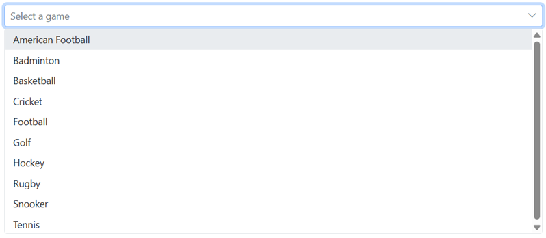
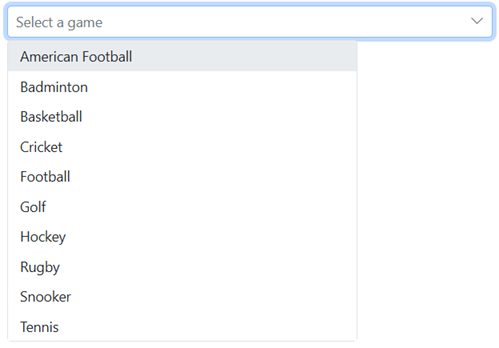

# Getting Started with Blazor DropDown List Component in Web App

This section briefly explains about how to include [Blazor DropDown List](https://www.syncfusion.com/blazor-components/blazor-dropdown-list) component in your Blazor Web App using [Visual Studio](https://visualstudio.microsoft.com/vs/).

## Prerequisites

* [System requirements for Blazor components](https://blazor.syncfusion.com/documentation/system-requirements)

## Create a new Blazor Web App

You can create a **Blazor Web App** using Visual Studio 2022 via [Microsoft Templates](https://learn.microsoft.com/en-us/aspnet/core/blazor/tooling?view=aspnetcore-8.0) or the [Syncfusion Blazor Extension](https://blazor.syncfusion.com/documentation/visual-studio-integration/template-studio).

You need to configure the corresponding [Interactive render mode](https://learn.microsoft.com/en-us/aspnet/core/blazor/components/render-modes?view=aspnetcore-8.0#render-modes) and [Interactivity location](https://learn.microsoft.com/en-us/aspnet/core/blazor/tooling?view=aspnetcore-8.0&pivots=windows) while creating a Blazor Web Application.

## Install Syncfusion Blazor DropDowns and Themes NuGet in the Blazor Web App

To add **Blazor DropDown List** component in the app, open the NuGet package manager in Visual Studio (*Tools → NuGet Package Manager → Manage NuGet Packages for Solution*), search and install [Syncfusion.Blazor.DropDowns](https://www.nuget.org/packages/Syncfusion.Blazor.DropDowns/) and [Syncfusion.Blazor.Themes](https://www.nuget.org/packages/Syncfusion.Blazor.Themes/).

If you utilize `WebAssembly or Auto` render modes in the Blazor Web App need to be install Syncfusion Blazor components NuGet packages within the client project.

Alternatively, you can utilize the following package manager command to achieve the same.




Install-Package Syncfusion.Blazor.DropDowns -Version {{ site.releaseversion }}
Install-Package Syncfusion.Blazor.Themes -Version {{ site.releaseversion }}




N> Syncfusion Blazor components are available in [nuget.org](https://www.nuget.org/packages?q=syncfusion.blazor). Refer to [NuGet packages](https://blazor.syncfusion.com/documentation/nuget-packages) topic for available NuGet packages list with component details.

## Register Syncfusion Blazor Service

Open **~/_Imports.razor** file and import the `Syncfusion.Blazor` and `Syncfusion.Blazor.DropDowns` namespace.

```cshtml

@using Syncfusion.Blazor
@using Syncfusion.Blazor.DropDowns
```

Now, register the Syncfusion Blazor Service in the **~/Program.cs** file of your Blazor Web App. For a app with `WebAssembly` or `Auto (Server and WebAssembly)` interactive render mode, register the Syncfusion Blazor service in both **~/Program.cs** files of your web app.
```cshtml

....
using Syncfusion.Blazor;
....
builder.Services.AddSyncfusionBlazor();
....

```

## Add stylesheet and script resources

The theme stylesheet and script can be accessed from NuGet through [Static Web Assets](https://blazor.syncfusion.com/documentation/appearance/themes#static-web-assets). Include the stylesheet reference in the `<head>` section and the script reference at the end of the `<body>` in the **~/Components/App.razor** file as shown below:

```html
<head>
    ....
    <link href="_content/Syncfusion.Blazor.Themes/material.css" rel="stylesheet" />
</head>
....
<body>
    ....
    <script src="_content/Syncfusion.Blazor.Core/scripts/syncfusion-blazor.min.js" type="text/javascript"></script>
</body>
```

N> Check out the [Blazor Themes](https://blazor.syncfusion.com/documentation/appearance/themes) topic to discover various methods ([Static Web Assets](https://blazor.syncfusion.com/documentation/appearance/themes#static-web-assets), [CDN](https://blazor.syncfusion.com/documentation/appearance/themes#cdn-reference), and [CRG](https://blazor.syncfusion.com/documentation/common/custom-resource-generator)) for referencing themes in your Blazor application. Also, check out the [Adding Script Reference](https://blazor.syncfusion.com/documentation/common/adding-script-references) topic to learn different approaches for adding script references in your Blazor application.

## Add Syncfusion Blazor DropDown List component

Add the Syncfusion Blazor DropDown List component in `.razor` file inside the `Pages` folder. If an interactivity location as `Per page/component` in the web app, define a render mode at top of the component, as follows:




@* desired render mode define here *@
@rendermode InteractiveAuto







<SfDropDownList TValue="string" TItem="string" Placeholder="Select a game"></SfDropDownList>




* Press <kbd>Ctrl</kbd>+<kbd>F5</kbd> (Windows) or <kbd>⌘</kbd>+<kbd>F5</kbd> (macOS) to launch the application. This will render the Syncfusion Blazor DropDown List component in your default web browser.


## Binding data source

After initialization, populate the DropDownList with data using the [DataSource](https://help.syncfusion.com/cr/blazor/Syncfusion.Blazor.DropDowns.SfDropDownBase-1.html#Syncfusion_Blazor_DropDowns_SfDropDownBase_1_DataSource) property.




<SfDropDownList TValue="string" TItem="Games" Placeholder="Select a game" DataSource="@LocalData">
  <DropDownListFieldSettings Value="ID" Text="Text"></DropDownListFieldSettings>
</SfDropDownList>

@code {
  public class Games
  {
    public string ID { get; set; }
    public string Text { get; set; }
  }
  List<Games> LocalData = new List<Games> {
    new Games() { ID= "Game1", Text= "American Football" },
    new Games() { ID= "Game2", Text= "Badminton" },
    new Games() { ID= "Game3", Text= "Basketball" },
    new Games() { ID= "Game4", Text= "Cricket" },
    new Games() { ID= "Game5", Text= "Football" },
    new Games() { ID= "Game6", Text= "Golf" },
    new Games() { ID= "Game7", Text= "Hockey" },
    new Games() { ID= "Game8", Text= "Rugby"},
    new Games() { ID= "Game9", Text= "Snooker" },
    new Games() { ID= "Game10", Text= "Tennis"},
  };
}






## Configure the popup list

By default, the width of the popup list automatically adjusts according to the DropDownList input element's width, and the height of the popup list has `350px`. The height and width of the popup list can also be customized using the [PopupHeight](https://help.syncfusion.com/cr/blazor/Syncfusion.Blazor.DropDowns.SfDropDownList-2.html#Syncfusion_Blazor_DropDowns_SfDropDownList_2_PopupHeight) and [PopupWidth](https://help.syncfusion.com/cr/blazor/Syncfusion.Blazor.DropDowns.SfDropDownList-2.html#Syncfusion_Blazor_DropDowns_SfDropDownList_2_PopupWidth) properties respectively.




<SfDropDownList TValue="string" TItem="Games" PopupHeight="350px" PopupWidth="350px" Placeholder="Select a game" DataSource="@LocalData">
  <DropDownListFieldSettings Value="ID" Text="Text"></DropDownListFieldSettings>
</SfDropDownList>

@code{
  public class Games
  {
    public string ID { get; set; }
    public string Text { get; set; }
  }
  List<Games> LocalData = new List<Games> {
    new Games() { ID= "Game1", Text= "American Football" },
    new Games() { ID= "Game2", Text= "Badminton" },
    new Games() { ID= "Game3", Text= "Basketball" },
    new Games() { ID= "Game4", Text= "Cricket" },
    new Games() { ID= "Game5", Text= "Football" },
    new Games() { ID= "Game6", Text= "Golf" },
    new Games() { ID= "Game7", Text= "Hockey" },
    new Games() { ID= "Game8", Text= "Rugby"},
    new Games() { ID= "Game9", Text= "Snooker" },
    new Games() { ID= "Game10", Text= "Tennis"},
  };
}






## Get selected value

Get the selected value of the DropDownList component in the [ValueChange](https://help.syncfusion.com/cr/blazor/Syncfusion.Blazor.DropDowns.DropDownListEvents-2.html#Syncfusion_Blazor_DropDowns_DropDownListEvents_2_ValueChange) event using [ChangeEventArgs.Value](https://help.syncfusion.com/cr/blazor/Syncfusion.Blazor.DropDowns.ChangeEventArgs-2.html#Syncfusion_Blazor_DropDowns_ChangeEventArgs_2_Value) property.








Get the complete object list of the selected value in the [ValueChange](https://help.syncfusion.com/cr/blazor/Syncfusion.Blazor.DropDowns.DropDownListEvents-2.html#Syncfusion_Blazor_DropDowns_DropDownListEvents_2_ValueChange) event using the [ChangeEventArgs.ItemData](https://help.syncfusion.com/cr/blazor/Syncfusion.Blazor.DropDowns.ChangeEventArgs-2.html#Syncfusion_Blazor_DropDowns_ChangeEventArgs_2_ItemData) property.








N> [View Sample in GitHub](https://github.com/SyncfusionExamples/Blazor-Getting-Started-Examples/tree/main/DropDownList).

## See also

1. [Getting Started with Syncfusion Blazor for client-side in .NET Core CLI](https://blazor.syncfusion.com/documentation/getting-started/blazor-webassembly-dotnet-cli)
2. [Getting Started with Syncfusion Blazor for client-side in Visual Studio](https://blazor.syncfusion.com/documentation/getting-started/blazor-webassembly-visual-studio)
3. [Getting Started with Syncfusion Blazor for server-side in .NET Core CLI](https://blazor.syncfusion.com/documentation/getting-started/blazor-server-side-dotnet-cli)

