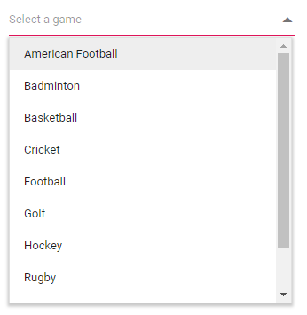

# Getting Started with Blazor DropDown List Component

This section briefly explains how to include a **DropDownList** Component in your Blazor client-side application. You can refer to the [Getting Started with Syncfusion Blazor for Client-side in Visual Studio 2019](../getting-started/blazor-webassembly-visual-studio-2019/) page for introduction and configure the common specifications.

To get start quickly with Blazor DropDownList component, you can check on this video.



## Importing Syncfusion Blazor component in the application

* Install `Syncfusion.Blazor.DropDowns` NuGet package to the application by using the `NuGet Package Manager`.

> Please ensure to check the `Include prerelease` option for our Beta release.

* You can add the client-side resources through CDN or from NuGet package in the  **HEAD** element of the **~/Pages/_Host.cshtml** page.

 ```html
    <head>
            <link href="_content/Syncfusion.Blazor.Themes/bootstrap4.css" rel="stylesheet" />
            @*<link href="https://cdn.syncfusion.com/blazor/{{version}}/styles/{{theme}}.css" rel="stylesheet" />*@
    </head>
```

> For Internet Explorer 11 kindly refer the polyfills. Refer the [documentation](https://ej2.syncfusion.com/blazor/documentation/common/how-to/render-blazor-server-app-in-ie/) for more information.

 ```html
    <head>
        <link href="_content/Syncfusion.Blazor.Themes/bootstrap4.css" rel="stylesheet" />
        <script src="https://github.com/Daddoon/Blazor.Polyfill/releases/download/3.0.1/blazor.polyfill.min.js"></script>
    </head>
```

## Adding component package to the application

Open `~/_Imports.razor` file and import the `Syncfusion.Blazor.DropDowns` package.

```cshtml
@using Syncfusion.Blazor.DropDowns
```

## Add SyncfusionBlazor service in Startup.cs

Open the **Startup.cs** file and add services required by Syncfusion components using  **services.AddSyncfusionBlazor()** method. Add this method in the **ConfigureServices** function as follows.

```csharp
using Syncfusion.Blazor;

namespace BlazorApplication
{
    public class Startup
    {
        ....
        ....
        public void ConfigureServices(IServiceCollection services)
        {
            ....
            ....
            services.AddSyncfusionBlazor();
        }
    }
}
```

> To enable custom client side resource loading from CRG or CDN. You need to disable resource loading by `AddSyncfusionBlazor(true)` and load the scripts in the **HEAD** element of the **~/Pages/_Host.cshtml** page.

 ```html
    <head>
            <script src="https://cdn.syncfusion.com/blazor/{:version:}/syncfusion-blazor.min.js"></script>
    </head>
```

## Adding DropDownList component to the application

To initialize the DropDownList component add the below code to your `Index.razor` view page which is present under `~/Pages` folder.

```csharp
<SfDropDownList TValue="string" TItem="string" Placeholder="Select a game"></SfDropDownList>
```

Output be like below


## Binding data source

After initialization, populate the DropDownList with data using the [DataSource](https://help.syncfusion.com/cr/blazor/Syncfusion.Blazor.DropDowns.SfDropDownBase-1.html#Syncfusion_Blazor_DropDowns_SfDropDownBase_1_DataSource) property.
Here, an array of object values is passed to the DropDownList component. `TItem` specifies the type of the Datasource in DropDownList.

```csharp
<SfDropDownList TValue="string" TItem="Games" Placeholder="Select a game" DataSource="@LocalData">
<DropDownListFieldSettings Value="ID" Text="Text"></DropDownListFieldSettings>
</SfDropDownList>

@code {
  public class Games
  {  
    public string ID { get; set; }
    public string Text { get; set; }
  }
  List<Games> LocalData = new List<Games> {
    new Games() { ID= "Game1", Text= "American Football" },
    new Games() { ID= "Game2", Text= "Badminton" },
    new Games() { ID= "Game3", Text= "Basketball" },
    new Games() { ID= "Game4", Text= "Cricket" },
    new Games() { ID= "Game5", Text= "Football" },
    new Games() { ID= "Game6", Text= "Golf" },
    new Games() { ID= "Game7", Text= "Hockey" },
    new Games() { ID= "Game8", Text= "Rugby"},
    new Games() { ID= "Game9", Text= "Snooker" },
    new Games() { ID= "Game10", Text= "Tennis"},
  };
}
```

The output will be as follows.



## Configure the popup list

By default, the width of the popup list automatically adjusts according to the DropDownList input element's width, and the height of the popup list has `350px`.

The height and width of the popup list can also be customized using the [PopupHeight](https://help.syncfusion.com/cr/blazor/Syncfusion.Blazor.DropDowns.SfDropDownList-2.html#Syncfusion_Blazor_DropDowns_SfDropDownList_2_PopupHeight) and [PopupWidth](https://help.syncfusion.com/cr/blazor/Syncfusion.Blazor.DropDowns.SfDropDownList-2.html#Syncfusion_Blazor_DropDowns_SfDropDownList_2_PopupWidth) properties respectively.

In the following sample, popup list's width and height are configured.

```csharp
<SfDropDownList TValue="string" TItem="Games" PopupHeight="350px" PopupWidth="350px" Placeholder="Select a game" DataSource="@LocalData">
<DropDownListFieldSettings Value="ID" Text="Text"></DropDownListFieldSettings>
</SfDropDownList>

@code{
  public class Games
  {  
    public string ID { get; set; }
    public string Text { get; set; }
  }
  List<Games> LocalData = new List<Games> {
    new Games() { ID= "Game1", Text= "American Football" },
    new Games() { ID= "Game2", Text= "Badminton" },
    new Games() { ID= "Game3", Text= "Basketball" },
    new Games() { ID= "Game4", Text= "Cricket" },
    new Games() { ID= "Game5", Text= "Football" },
    new Games() { ID= "Game6", Text= "Golf" },
    new Games() { ID= "Game7", Text= "Hockey" },
    new Games() { ID= "Game8", Text= "Rugby"},
    new Games() { ID= "Game9", Text= "Snooker" },
    new Games() { ID= "Game10", Text= "Tennis"},
  };
}
```

The output will be as follows.


## See Also

* [Getting Started with Syncfusion Blazor for Client-Side in .NET Core CLI](../getting-started/blazor-webassembly-dotnet-cli/)
* [Getting Started with Syncfusion Blazor for Server-side in Visual Studio 2019](../getting-started/blazor-server-side-visual-studio-2019/)
* [Getting Started with Syncfusion Blazor for Server-Side in .NET Core CLI](../getting-started/blazor-server-side-dotnet-cli/)