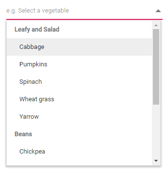

# Grouping in Dropdown List

The DropDownList supports wrapping of the nested elements into a group based on different categories. The category of each list item can be mapped through the [DropDownListFieldSettings.GroupBy](https://help.syncfusion.com/cr/blazor/Syncfusion.Blazor.DropDowns.DropDownListFieldSettings.html#Syncfusion_Blazor_DropDowns_DropDownListFieldSettings_GroupBy) field in the data table. The group header is displayed both as inline and fixed headers. The fixed group header content is updated dynamically on scrolling the popup list with its category value.

To get started quickly with grouping in the Blazor DropDown List component, you can check the video below.



In the following sample, vegetables are grouped according to their category using the `DropDownListFieldSettings.GroupBy` field.







## Fixed group header

Classify the items based on the [DropDownListFieldSettings.GroupBy](https://help.syncfusion.com/cr/blazor/Syncfusion.Blazor.DropDowns.DropDownListFieldSettings.html#Syncfusion_Blazor_DropDowns_DropDownListFieldSettings_GroupBy) field mapped to the control. The headers of group items will be fixed at the top till their belonging items ends up on scrolling.

## Group header template

The group header title under which appropriate sub-items are categorized is customize with the help of the [GroupTemplate](https://help.syncfusion.com/cr/blazor/Syncfusion.Blazor.DropDowns.SfDropDownBase-1.html#Syncfusion_Blazor_DropDowns_SfDropDownBase_1_GroupTemplate) property. This template is common for both inline and floating group [HeaderTemplate](https://help.syncfusion.com/cr/blazor/Syncfusion.Blazor.DropDowns.SfDropDownList-2.html#Syncfusion_Blazor_DropDowns_SfDropDownList_2_HeaderTemplate).

## Limitations of grouping

Grouping feature has some limitations. These are:

* The component will support only single level of grouping, and you cannot specify it as like TreeView component.