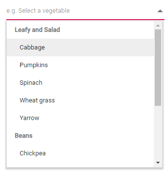

# Grouping in Blazor DropDown List Component

The DropDownList supports wrapping nested elements into a group based on different categories. The category of each list item can be mapped through the [GroupBy](https://help.syncfusion.com/cr/blazor/Syncfusion.Blazor.DropDowns.DropDownListFieldSettings.html#Syncfusion_Blazor_DropDowns_DropDownListFieldSettings_GroupBy) field in the data table. The group header is displayed both as inline and fixed headers. The fixed group header content is updated dynamically on scrolling the popup list with its category value.

To get started quickly with grouping in the Blazor DropDown List component, you can check the video below.



In the following sample, vegetables are grouped according on its category using `GroupBy` field.

```cshtml
@using Syncfusion.Blazor.DropDowns

<SfDropDownList TValue="string" TItem="Vegetables" Placeholder="e.g. Select a vegetable" DataSource="@LocalData">
    <DropDownListFieldSettings GroupBy="Category" Value="Vegetable"></DropDownListFieldSettings>
</SfDropDownList>

@code {

    public IEnumerable<Vegetables> LocalData { get; set; } = new Vegetables().VegetablesList();

    public class Vegetables
    {
        public string Vegetable { get; set; }
        public string Category { get; set; }
        public string ID { get; set; }

        public List<Vegetables> VegetablesList()
        {
            List<Vegetables> Veg = new List<Vegetables>();
            Veg.Add(new Vegetables { Vegetable = "Cabbage", Category = "Leafy and Salad", ID = "item1" });
            Veg.Add(new Vegetables { Vegetable = "Chickpea", Category = "Beans", ID = "item2" });
            Veg.Add(new Vegetables { Vegetable = "Garlic", Category = "Bulb and Stem", ID = "item3" });
            Veg.Add(new Vegetables { Vegetable = "Green bean", Category = "Beans", ID = "item4" });
            Veg.Add(new Vegetables { Vegetable = "Horse gram", Category = "Beans", ID = "item5" });
            Veg.Add(new Vegetables { Vegetable = "Nopal", Category = "Bulb and Stem", ID = "item6" });
            Veg.Add(new Vegetables { Vegetable = "Onion", Category = "Bulb and Stem", ID = "item7" });
            Veg.Add(new Vegetables { Vegetable = "Pumpkins", Category = "Leafy and Salad", ID = "item8" });
            Veg.Add(new Vegetables { Vegetable = "Spinach", Category = "Leafy and Salad", ID = "item9" });
            Veg.Add(new Vegetables { Vegetable = "Wheat grass", Category = "Leafy and Salad", ID = "item10" });
            Veg.Add(new Vegetables { Vegetable = "Yarrow", Category = "Leafy and Salad", ID = "item11" });
            return Veg;
        }
    }
}
```

The output will be as follows.

