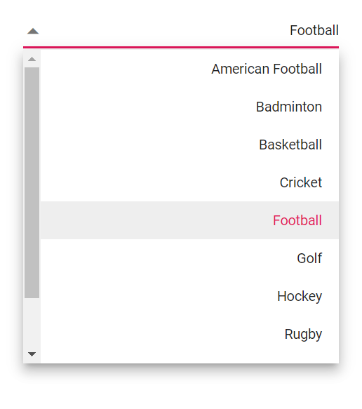

# Globalization and Localization in Dropdown List

## Localization

The [Blazor DropDownList](https://www.syncfusion.com/blazor-components/blazor-dropdown-list) component supports localization of UI text and messages. Refer to the [Blazor Localization](https://blazor.syncfusion.com/documentation/common/localization) documentation for configuring culture, resource files, and translations across Syncfusion components.

## Globalization

### Enable RTL mode

The direction can be switched to right to left when specifies the [EnableRtl](https://help.syncfusion.com/cr/blazor/Syncfusion.Blazor.DropDowns.DropDownListModel-2.html#Syncfusion_Blazor_DropDowns_DropDownListModel_2_EnableRtl) as `true`. Writing systems like Arabic, Hebrew, and more will require `EnableRtl` property.

Specifies the [EnableRtl](https://help.syncfusion.com/cr/blazor/Syncfusion.Blazor.DropDowns.DropDownListModel-2.html#Syncfusion_Blazor_DropDowns_DropDownListModel_2_EnableRtl) as a boolean value that indicates to enable or disable rendering component in the right to left direction. Writing systems will require Arabic, Hebrew, and more. The direction can be switched to right-to-left.







