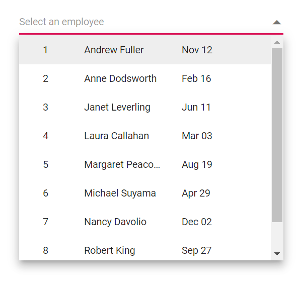

# Multicolumn in Dropdown List 

Render two or more columns in the popup by applying the `e-multi-column` CSS class through the [CssClass](https://help.syncfusion.com/cr/blazor/Syncfusion.Blazor.DropDowns.SfDropDownList-2.html#Syncfusion_Blazor_DropDowns_SfDropDownList_2_CssClass) property, and structure the content using templates so items align in a grid-like layout.

* [ItemTemplate](https://blazor.syncfusion.com/documentation/dropdown-list/templates#item-template) – Use `ItemTemplate` to define the columns and layout of each item in the popup.
* [ValueTemplate](https://blazor.syncfusion.com/documentation/dropdown-list/templates#value-template) – Use `ValueTemplate` to customize how the selected item’s value is displayed in the input.

Apply built-in text alignment classes to control alignment in each column:

* `e-text-center`: Centers the text within the column.
* `e-text-right`: Aligns the text to the right within the column.
* `e-text-left`: Aligns the text to the left within the column.







## Limitation of multicolumn dropdownlist

The component does not support built-in column filtering or sorting, and the columns are aligned using templates and CSS rather than a data grid feature set.