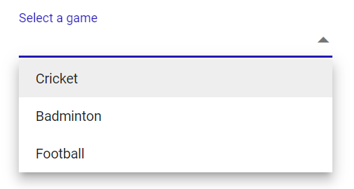

# Placeholder in the Blazor DropDownList component

The [Placeholder](https://help.syncfusion.com/cr/blazor/Syncfusion.Blazor.DropDowns.SfDropDownList-2.html#Syncfusion_Blazor_DropDowns_SfDropDownList_2_Placeholder) property is used display small description of the expected value in the input. In the below sample demonstration, We have set **Select a game** as Placeholder property value, which will set respective value to the placeholder attribute of the input element in the DOM.




@using Syncfusion.Blazor.DropDowns

<SfDropDownList TValue="string" TItem="string" Placeholder="Select a game" DataSource="@data" Width="300px"></SfDropDownList>

@code{
    List<string> data = new List<string>() { "Cricket", "Badminton","Football" };
}



The output will be as follows.

## Color of the placeholder text

We can customize the color of the placeholder text by overriding the existing styles of the component. The following sample demonstrates the font color customization of placeholder attribute.




@using Syncfusion.Blazor.DropDowns

<SfDropDownList TValue="string" TItem="string" Placeholder="Select a game" DataSource="@data" Width="300px"></SfDropDownList>

@code{
    List<string> data = new List<string>() { "Cricket", "Badminton","Football" };
}




The output will be as follows.

## Float Label in the DropDownList component

The [FloatLabelType](https://help.syncfusion.com/cr/blazor/Syncfusion.Blazor.DropDowns.SfDropDownList-2.html#Syncfusion_Blazor_DropDowns_SfDropDownList_2_FloatLabelType) property specifies the floating label behavior of the DropDownList that the placeholder text floats above the TextBox based on the following values.

Floating label supports the types of actions as given below.

Type     | Description
------------ | -------------
  Auto       | The floating label will float above the input after focusing, or entering a value in the input.
  Always     | The floating label will always float above the input.
  Never      | By default, never float the label in the input when the placeholder is available.




@using Syncfusion.Blazor.DropDowns
@using Syncfusion.Blazor.Inputs

<SfDropDownList TValue="string" TItem="string" Placeholder="Select a game" FloatLabelType="FloatLabelType.Auto" DataSource="@data" Width="300px"></SfDropDownList>

@code{
    List<string> data = new List<string>() { "Cricket", "Badminton","Football" };
}



The output will be as follows.

// Need to Gif image

## Customizing the float label element’s focusing color

We can customize the FloatLabel text color when focusing the component by overriding the existing styles of the DropDownList component.

The below sample demonstration explains how to customise the flotlabel text color.




@using Syncfusion.Blazor.DropDowns
@using Syncfusion.Blazor.Inputs

<SfDropDownList TValue="string" TItem="string" Placeholder="Select a game" FloatLabelType="FloatLabelType.Auto" DataSource="@data" Width="300px"></SfDropDownList>

@code{
    List<string> data = new List<string>() { "Cricket", "Badminton","Football" };
}




The output will be as follows.

