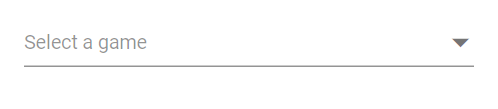
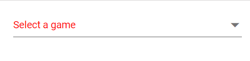
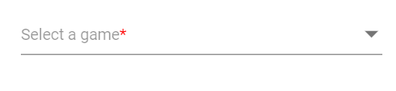
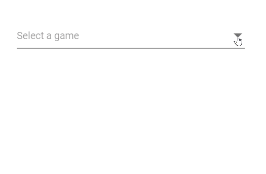
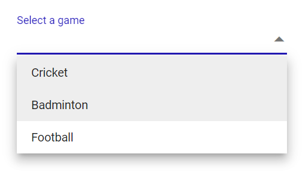

# Placeholder and Float Label in DropDownList

## Placeholder

Use the [Placeholder](https://help.syncfusion.com/cr/blazor/Syncfusion.Blazor.DropDowns.SfDropDownList-2.html#Syncfusion_Blazor_DropDowns_SfDropDownList_2_Placeholder) property to show a short hint describing the expected value. In the following example, “Select a game” is set as the placeholder and displayed in the input when no value is selected.







## Color of the placeholder text

Change the placeholder color by targeting the placeholder selector (for example, `input.e-input::placeholder`) and applying the desired `color` value.







## Add mandatory indicator using placeholder

Add a visual required indicator (such as `*`) to the floating label by targeting `.e-float-text::after` and setting the `content` style. This is a visual cue only; pair it with form validation to enforce required input.







## FloatLabel

Use the [FloatLabelType](https://help.syncfusion.com/cr/blazor/Syncfusion.Blazor.DropDowns.SfDropDownList-2.html#Syncfusion_Blazor_DropDowns_SfDropDownList_2_FloatLabelType) property to control floating label behavior, where the `Placeholder` text moves above the input. `FloatLabelType` works only when a `Placeholder` is set. The default value is `Never`.

The floating label supports the following behaviors:

Type     | Description
------------ | -------------
  [Auto](https://help.syncfusion.com/cr/blazor/Syncfusion.Blazor.Inputs.FloatLabelType.html#Syncfusion_Blazor_Inputs_FloatLabelType_Auto)       | Floats the label after focus or when a value is selected.
  [Always](https://help.syncfusion.com/cr/blazor/Syncfusion.Blazor.Inputs.FloatLabelType.html#Syncfusion_Blazor_Inputs_FloatLabelType_Always)     | Always displays the label above the input.
  [Never](https://help.syncfusion.com/cr/blazor/Syncfusion.Blazor.Inputs.FloatLabelType.html#Syncfusion_Blazor_Inputs_FloatLabelType_Never)      | Never floats the label when the placeholder is available.

The `FloatLabelType` set to `Auto` is demonstrated in the following example.







## Customizing the float label element’s focusing color

Customize the floating label color on focus by targeting `.e-input-focus .e-float-text.e-label-top` and setting the `color` property.







