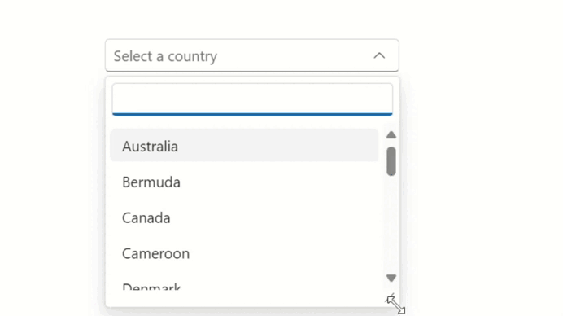
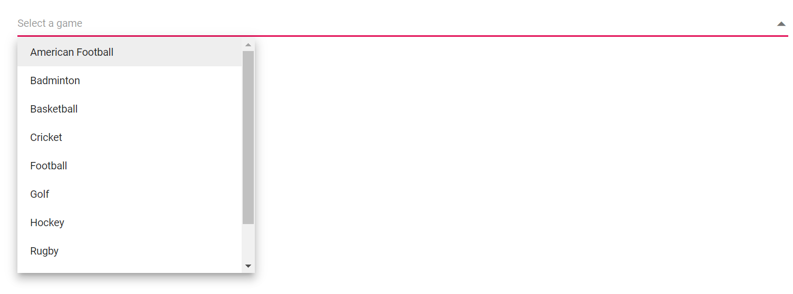
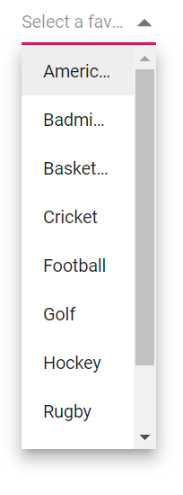
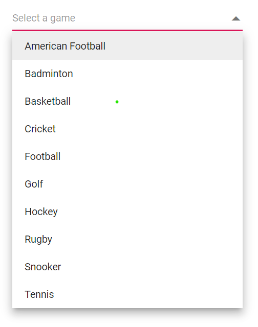
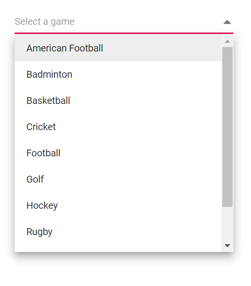
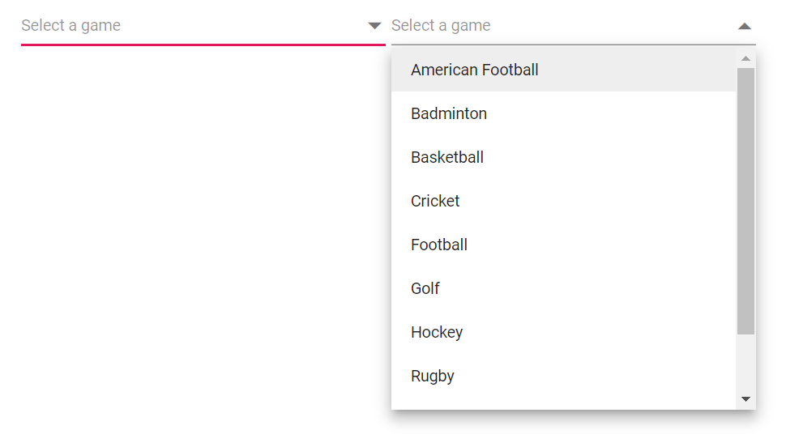
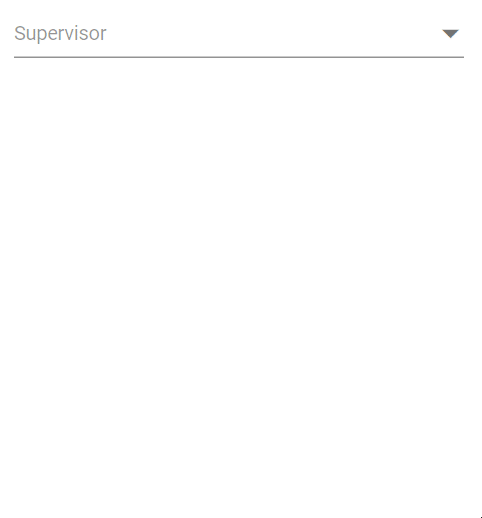
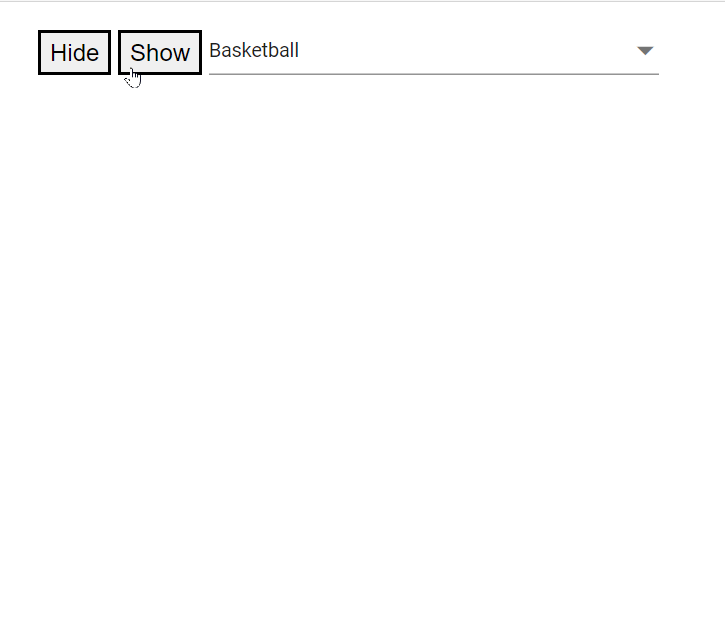

# Popup Setting in Dropdown List

## Popup resize

You can dynamically adjust the size of the popup in the Dropdown List component by using the [AllowResize](https://help.syncfusion.com/cr/blazor/Syncfusion.Blazor.DropDowns.SfComboBox-2.html#Syncfusion_Blazor_DropDowns_SfComboBox_2_AllowResize) property. When enabled, users can resize the popup, improving visibility and control, with the resized dimensions being retained across sessions for a consistent user experience.





 

## Change the popup width

Customize the width of the popup using the [PopupWidth](https://help.syncfusion.com/cr/blazor/Syncfusion.Blazor.DropDowns.SfDropDownList-2.html#Syncfusion_Blazor_DropDowns_SfDropDownList_2_PopupWidth) property. The default value of the `PopupWidth` is `100%`. If popup width unspecified, it sets based on the width of the DropdownList component.

In the following sample, the `PopupWidth` is set as `300px`.







## Handling TextOverflow 

When the width of the popup is less than text's width, then the `text-overflow:ellipsis` style will be added automatically.

In the following sample, the `PopupWidth` is set as `100px` then the `text-overflow:ellipsis` is automatically applied







## Change the popup height

Customize the height of the popup using the [PopupHeight](https://help.syncfusion.com/cr/blazor/Syncfusion.Blazor.DropDowns.SfDropDownList-2.html#Syncfusion_Blazor_DropDowns_SfDropDownList_2_PopupHeight). The default value of the `PopupHeight` is `300px`.







## Change the popup z-index

Customize the [z-index](https://help.syncfusion.com/cr/blazor/Syncfusion.Blazor.DropDowns.SfDropDownBase-1.html#Syncfusion_Blazor_DropDowns_SfDropDownBase_1_ZIndex) value of the component popup element.

Defaults to `1000`

## Show popup on initial loading

You can achieve this by using [ShowPopupAsync()](https://help.syncfusion.com/cr/blazor/Syncfusion.Blazor.DropDowns.SfDropDownList-2.html#Syncfusion_Blazor_DropDowns_SfDropDownList_2_ShowPopupAsync) in the [Created](https://help.syncfusion.com/cr/blazor/Syncfusion.Blazor.DropDowns.DropDownListEvents-2.html#Syncfusion_Blazor_DropDowns_DropDownListEvents_2_Created) Event.







## Preventing opening and closing

Prevent the popup open and close in the event argument like [BeforeOpenEventArgs.cancel](https://help.syncfusion.com/cr/blazor/Syncfusion.Blazor.DropDowns.BeforeOpenEventArgs.html#Syncfusion_Blazor_DropDowns_BeforeOpenEventArgs_Cancel) and [PopupEventArgs.cancel](https://help.syncfusion.com/cr/blazor/Syncfusion.Blazor.DropDowns.PopupEventArgs.html#Syncfusion_Blazor_DropDowns_PopupEventArgs_Cancel) as `true`. It is achieved by the [OnOpen](https://help.syncfusion.com/cr/blazor/Syncfusion.Blazor.DropDowns.DropDownListEvents-2.html#Syncfusion_Blazor_DropDowns_DropDownListEvents_2_OnOpen) and [OnClose](https://help.syncfusion.com/cr/blazor/Syncfusion.Blazor.DropDowns.DropDownListEvents-2.html#Syncfusion_Blazor_DropDowns_DropDownListEvents_2_OnClose) events. 







The following events are used to trigger when opening and closing popup.

### OnOpen event

The [OnOpen](https://help.syncfusion.com/cr/blazor/Syncfusion.Blazor.DropDowns.DropDownListEvents-2.html#Syncfusion_Blazor_DropDowns_DropDownListEvents_2_OnOpen) event triggers when the popup is opened. If you cancel this event, the popup remains closed.







### Opened event

The [Opened](https://help.syncfusion.com/cr/blazor/Syncfusion.Blazor.DropDowns.DropDownListEvents-2.html#Syncfusion_Blazor_DropDowns_DropDownListEvents_2_Opened) event triggers when the popup opens.







### OnClose event

The [OnClose](https://help.syncfusion.com/cr/blazor/Syncfusion.Blazor.DropDowns.DropDownListEvents-2.html#Syncfusion_Blazor_DropDowns_DropDownListEvents_2_OnClose) event triggers before the popup is closed. If you cancel this event, the popup will remain open.







### Closed event

The [Closed](https://help.syncfusion.com/cr/blazor/Syncfusion.Blazor.DropDowns.DropDownListEvents-2.html#Syncfusion_Blazor_DropDowns_DropDownListEvents_2_OnClose) event triggers after the popup has been closed.







## Popup height based on available space

You can achieve this by binding the `resize` event in window and update the height of the popup based on the window height.













## Programmatically opening and closing popup

You can programmatically open and close the popup by accessing the `ShowPopupAsync()` and `HidePopupAsync()` methods through an instance of the dropdown list. Bind the click event of a button to these methods. When the button is clicked, it will trigger the respective method and open or close the popup.





 

