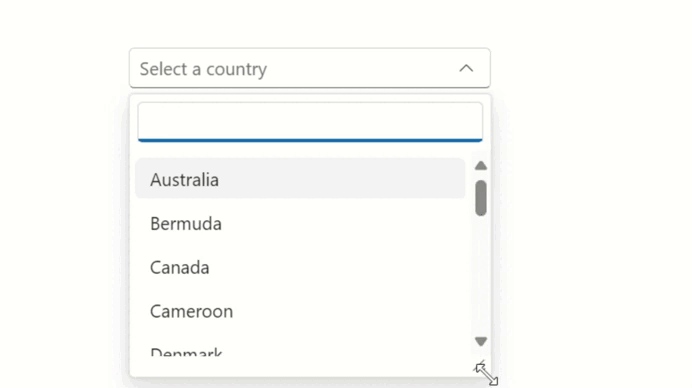
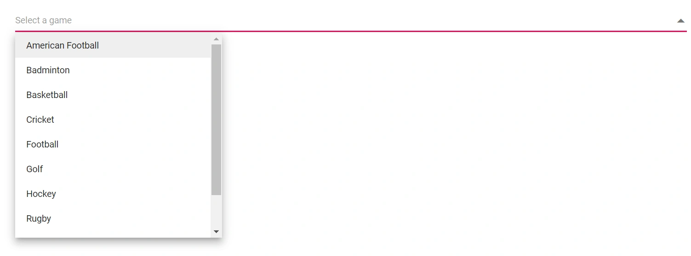
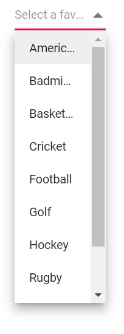
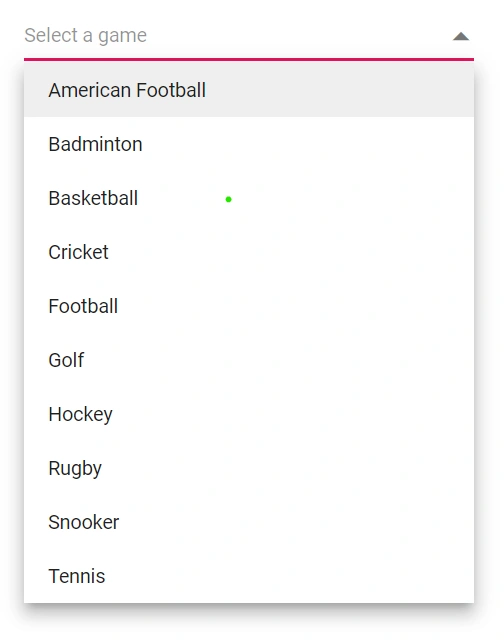
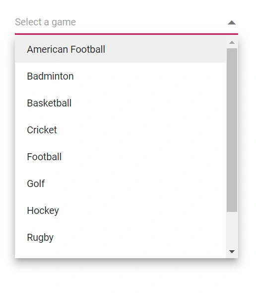
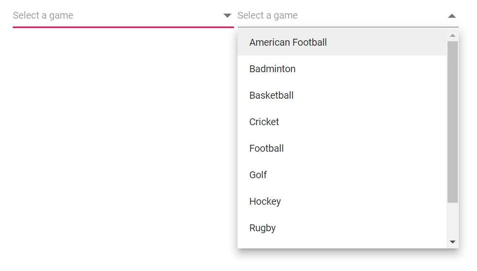
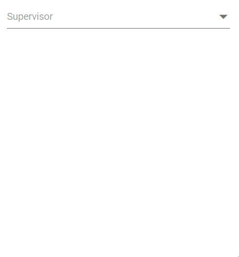
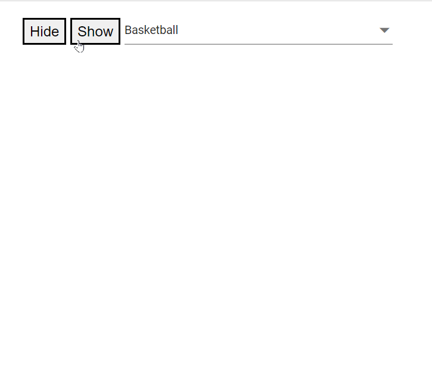

# Popup Setting in Blazor Dropdown List

## Popup resize

Dynamically resize the popup in the DropDownList component by using the [AllowResize](https://help.syncfusion.com/cr/blazor/Syncfusion.Blazor.DropDowns.SfDropDownList-2.html#Syncfusion_Blazor_DropDowns_SfDropDownList_2_AllowResize) property. When enabled, users can drag to resize the popup for better visibility and control. The resized dimensions are retained across sessions for a consistent user experience.





 

## Change the popup width

Customize the width of the popup using the [PopupWidth](https://help.syncfusion.com/cr/blazor/Syncfusion.Blazor.DropDowns.SfDropDownList-2.html#Syncfusion_Blazor_DropDowns_SfDropDownList_2_PopupWidth) property. The default value is `100%`. If the popup width is not specified, it adapts to the width of the DropDownList component.

In the following sample, `PopupWidth` is set to `300px`.







## Handling text overflow

When the popup width is smaller than the item text, the `text-overflow: ellipsis` style is applied automatically to truncate long text with an ellipsis.

In the following sample, `PopupWidth` is set to `100px`, so ellipsis is automatically applied.







## Change the popup height

Customize the height of the popup using the [PopupHeight](https://help.syncfusion.com/cr/blazor/Syncfusion.Blazor.DropDowns.SfDropDownList-2.html#Syncfusion_Blazor_DropDowns_SfDropDownList_2_PopupHeight) property. The default value of `PopupHeight` is `300px`.







## Change the popup z-index

Customize the [ZIndex](https://help.syncfusion.com/cr/blazor/Syncfusion.Blazor.DropDowns.SfDropDownBase-1.html#Syncfusion_Blazor_DropDowns_SfDropDownBase_1_ZIndex) value of the component’s popup element to control its stacking order relative to other UI elements. The default value is `1000`.

## Show popup on initial loading

Show the popup on initial render by invoking [ShowPopupAsync()](https://help.syncfusion.com/cr/blazor/Syncfusion.Blazor.DropDowns.SfDropDownList-2.html#Syncfusion_Blazor_DropDowns_SfDropDownList_2_ShowPopupAsync) in the [Created](https://help.syncfusion.com/cr/blazor/Syncfusion.Blazor.DropDowns.DropDownListEvents-2.html#Syncfusion_Blazor_DropDowns_DropDownListEvents_2_Created) event.







## Preventing opening and closing

Prevent the popup from opening or closing by setting the event argument’s cancel property to `true` in the corresponding handlers: [BeforeOpenEventArgs.Cancel](https://help.syncfusion.com/cr/blazor/Syncfusion.Blazor.DropDowns.BeforeOpenEventArgs.html#Syncfusion_Blazor_DropDowns_BeforeOpenEventArgs_Cancel) and [PopupEventArgs.Cancel](https://help.syncfusion.com/cr/blazor/Syncfusion.Blazor.DropDowns.PopupEventArgs.html#Syncfusion_Blazor_DropDowns_PopupEventArgs_Cancel). Use the [OnOpen](https://help.syncfusion.com/cr/blazor/Syncfusion.Blazor.DropDowns.DropDownListEvents-2.html#Syncfusion_Blazor_DropDowns_DropDownListEvents_2_OnOpen) and [OnClose](https://help.syncfusion.com/cr/blazor/Syncfusion.Blazor.DropDowns.DropDownListEvents-2.html#Syncfusion_Blazor_DropDowns_DropDownListEvents_2_OnClose) events to apply this behavior.







The following events are used to trigger when opening and closing popup.

### OnOpen event

The [OnOpen](https://help.syncfusion.com/cr/blazor/Syncfusion.Blazor.DropDowns.DropDownListEvents-2.html#Syncfusion_Blazor_DropDowns_DropDownListEvents_2_OnOpen) event triggers when the popup is about to open. If this event is canceled, the popup remains closed.







### Opened event

The [Opened](https://help.syncfusion.com/cr/blazor/Syncfusion.Blazor.DropDowns.DropDownListEvents-2.html#Syncfusion_Blazor_DropDowns_DropDownListEvents_2_Opened) event triggers after the popup has opened.







### OnClose event

The [OnClose](https://help.syncfusion.com/cr/blazor/Syncfusion.Blazor.DropDowns.DropDownListEvents-2.html#Syncfusion_Blazor_DropDowns_DropDownListEvents_2_OnClose) event triggers before the popup is closed. If this event is canceled, the popup remains open.







### Closed event

The [Closed](https://help.syncfusion.com/cr/blazor/Syncfusion.Blazor.DropDowns.DropDownListEvents-2.html#Syncfusion_Blazor_DropDowns_DropDownListEvents_2_Closed) event triggers after the popup has been closed.







## Popup height based on available space

Adjust the popup height based on available viewport space by handling the window’s `resize` event and updating the popup’s height dynamically.













## Programmatically opening and closing popup

You can programmatically open and close the popup by accessing the `ShowPopupAsync()` and `HidePopupAsync()` methods through an instance of the dropdown list. Bind the click event of a button to these methods. When the button is clicked, it will trigger the respective method and open or close the popup.





 

## Render popup in a custom container

Use the `AppendTo` property to render the DropDownList popup inside a specific container instead of the default `document.body`. This is useful when the component is placed inside dialogs, side panels, containers with overflow restrictions, or custom stacking contexts.

Specify a valid CSS selector in the `AppendTo` property. When the selector matches an element, the popup is appended to that element. If the selector is null, empty, or no matching element is found, the popup is rendered in the default location.



@using Syncfusion.Blazor.DropDowns

    <SfDropDownList TValue="string"
                    TItem="GameFields"
                    DataSource="@Games"
                    AppendTo="@AppendTarget"
                    Placeholder="Select a game">
        <DropDownListFieldSettings Text="Text" Value="ID"></DropDownListFieldSettings>
    </SfDropDownList>

@code {
    private string AppendTarget = "#popupHost";

    public class GameFields
    {
        public string ID { get; set; }
        public string Text { get; set; }
    }

    private List<GameFields> Games = new()
    {
        new() { ID = "Game1", Text = "American Football" },
        new() { ID = "Game2", Text = "Badminton" },
        new() { ID = "Game3", Text = "Basketball" },
        new() { ID = "Game4", Text = "Cricket" }
    };
}



N> The `AppendTo` property accepts a CSS selector such as `#elementId` or `.container`. If the specified element is not found, the popup is rendered in `document.body`.