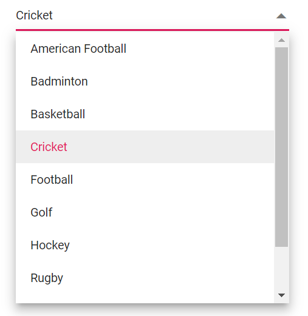
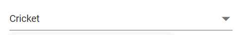
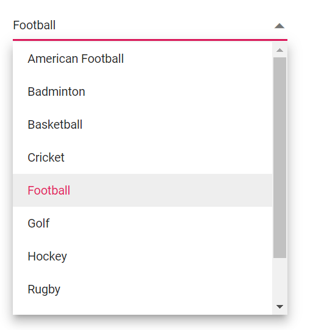

# Selection in Blazor DropDown List Component

## Get Selected Value


* You can get the selected value of the DropDownList component from the **Value** property in the [ValueChange event argument](https://help.syncfusion.com/cr/blazor/Syncfusion.Blazor.DropDowns.ChangeEventArgs-2.html#Syncfusion_Blazor_DropDowns_ChangeEventArgs_2_Value). 

```csharp

@using Syncfusion.Blazor.DropDowns

<SfDropDownList TValue="string" TItem="Games" Placeholder="Select a game" DataSource="@LocalData">
  <DropDownListFieldSettings Value="ID" Text="Text"></DropDownListFieldSettings>
  <DropDownListEvents TValue="string" TItem="Games" ValueChange="OnValueChange"></DropDownListEvents>
</SfDropDownList>

@code {
    public class Games
    {  
        public string ID { get; set; }
        public string Text { get; set; }
    }
    List<Games> LocalData = new List<Games> {
    new Games() { ID= "Game1", Text= "American Football" },
    new Games() { ID= "Game2", Text= "Badminton" },
    new Games() { ID= "Game3", Text= "Basketball" },
    new Games() { ID= "Game4", Text= "Cricket" },
    new Games() { ID= "Game5", Text= "Football" },
    new Games() { ID= "Game6", Text= "Golf" },
    new Games() { ID= "Game7", Text= "Hockey" },
    new Games() { ID= "Game8", Text= "Rugby"},
    new Games() { ID= "Game9", Text= "Snooker" },
    new Games() { ID= "Game10", Text= "Tennis"},
  };
    public void OnValueChange(ChangeEventArgs<string, Games> args)
    {
        Console.WriteLine("The DropDownList Value is: ", args.Value);
    }
}
```

* You can get the complete object list of the selected value from the **ItemData** property in the [ValueChange event argument](https://help.syncfusion.com/cr/blazor/Syncfusion.Blazor.DropDowns.ChangeEventArgs-2.html#Syncfusion_Blazor_DropDowns_ChangeEventArgs_2_ItemData).

```csharp

@using Syncfusion.Blazor.DropDowns

<SfDropDownList TValue="string" TItem="Games" Placeholder="Select a game" DataSource="@LocalData">
  <DropDownListFieldSettings Value="ID" Text="Text"></DropDownListFieldSettings>
  <DropDownListEvents TValue="string" TItem="Games" ValueChange="OnValueChange"></DropDownListEvents>
</SfDropDownList>

@code {
    public class Games
    {  
        public string ID { get; set; }
        public string Text { get; set; }
    }
    List<Games> LocalData = new List<Games> {
    new Games() { ID= "Game1", Text= "American Football" },
    new Games() { ID= "Game2", Text= "Badminton" },
    new Games() { ID= "Game3", Text= "Basketball" },
    new Games() { ID= "Game4", Text= "Cricket" },
    new Games() { ID= "Game5", Text= "Football" },
    new Games() { ID= "Game6", Text= "Golf" },
    new Games() { ID= "Game7", Text= "Hockey" },
    new Games() { ID= "Game8", Text= "Rugby"},
    new Games() { ID= "Game9", Text= "Snooker" },
    new Games() { ID= "Game10", Text= "Tennis"},
  };
    public void OnValueChange(ChangeEventArgs<string, Games> args)
    {
        Console.WriteLine("The complete data of the selected value is: ", args.ItemData);
    }
}

```

## Preselected Value on OnInitializedAsync

You can bind pre-selected value to the DropDownList component using `@bind-Value` property. We can assign the value property inside `OnInitializedAsync` lifecycle. The below sample demonstrates how to bind the value on initial rendering of the component.

```csharp
@using Syncfusion.Blazor.DropDowns

<SfDropDownList TValue="string" TItem="Games" Width="300px" Placeholder="Select a game" DataSource="@LocalData" @bind-Value="ddlValue">
  <DropDownListFieldSettings Value="ID" Text="Game"></DropDownListFieldSettings>
</SfDropDownList>

@code {
    public string ddlValue { get; set; }
    public class Games
    {  
        public string ID { get; set; }
        public string Game { get; set; }
    }
    List<Games> LocalData = new List<Games> {
    new Games() { ID= "Game1", Game= "American Football" },
    new Games() { ID= "Game2", Game= "Badminton" },
    new Games() { ID= "Game3", Game= "Basketball" },
    new Games() { ID= "Game4", Game= "Cricket" },
    new Games() { ID= "Game5", Game= "Football" },
    new Games() { ID= "Game6", Game= "Golf" },
    new Games() { ID= "Game7", Game= "Hockey" },
    new Games() { ID= "Game8", Game= "Rugby"},
    new Games() { ID= "Game9", Game= "Snooker" },
    new Games() { ID= "Game10", Game= "Tennis"},
  };
    protected override async Task OnInitializedAsync()
    {
        ddlValue = "Game4";
    }
}
```

The output will be as follows,



## Programmatically Change the Selected Value

You can change the component value programmatically or externally by the component instance using `@ref` property of the component. The below sample demonstrates how to change the value of the component using click event of the button component.

```csharp
@using Syncfusion.Blazor.DropDowns
@using Syncfusion.Blazor.Buttons

<div>
<SfDropDownList TValue="string" TItem="Games" Width="300px" Placeholder="Select a game" DataSource="@LocalData" @bind-Value="ddlValue">
  <DropDownListFieldSettings Value="ID" Text="Game"></DropDownListFieldSettings>
</SfDropDownList>
</div>
<div>
<SfButton Content="Click to change the value" OnClick="OnBtnClick"></SfButton>
</div>

@code {
    public string ddlValue { get; set; } = "Game10";
    public class Games
    {  
        public string ID { get; set; }
        public string Game { get; set; }
    }
    List<Games> LocalData = new List<Games> {
    new Games() { ID= "Game1", Game= "American Football" },
    new Games() { ID= "Game2", Game= "Badminton" },
    new Games() { ID= "Game3", Game= "Basketball" },
    new Games() { ID= "Game4", Game= "Cricket" },
    new Games() { ID= "Game5", Game= "Football" },
    new Games() { ID= "Game6", Game= "Golf" },
    new Games() { ID= "Game7", Game= "Hockey" },
    new Games() { ID= "Game8", Game= "Rugby"},
    new Games() { ID= "Game9", Game= "Snooker" },
    new Games() { ID= "Game10", Game= "Tennis"},
  };
    public void OnBtnClick()
    {
        ddlValue = "Game4";
    }
}
```

*Before changing the value:*


*After changing the value:*



## Preselect Value with Index

You can bind pre-selected value to the component also using [@bind-Index](https://help.syncfusion.com/cr/blazor/Syncfusion.Blazor.DropDowns.SfDropDownList-2.html#Syncfusion_Blazor_DropDowns_SfDropDownList_2_Index) property. It binds the respective value present in the binded index.

> It will dependent on [SortOrder](https://help.syncfusion.com/cr/blazor/Syncfusion.Blazor.DropDowns.SortOrder.html) type. It will bind the value to the component with sorted data if the corresponding property is defined.

The below sample demonstrates how to bind the index on initial rendering.

```csharp
@using Syncfusion.Blazor.DropDowns

<SfDropDownList TValue="string" TItem="Games" Width="300px" Placeholder="Select a game" DataSource="@LocalData" @bind-Index="ddlIndex">
  <DropDownListFieldSettings Value="ID" Text="Game"></DropDownListFieldSettings>
</SfDropDownList>

@code {
    public int? ddlIndex { get; set; } = 4;
    public class Games
    {  
        public string ID { get; set; }
        public string Game { get; set; }
    }
    List<Games> LocalData = new List<Games> {
    new Games() { ID= "Game1", Game= "American Football" },
    new Games() { ID= "Game2", Game= "Badminton" },
    new Games() { ID= "Game3", Game= "Basketball" },
    new Games() { ID= "Game4", Game= "Cricket" },
    new Games() { ID= "Game5", Game= "Football" },
    new Games() { ID= "Game6", Game= "Golf" },
    new Games() { ID= "Game7", Game= "Hockey" },
    new Games() { ID= "Game8", Game= "Rugby"},
    new Games() { ID= "Game9", Game= "Snooker" },
    new Games() { ID= "Game10", Game= "Tennis"},
  };
}
```

The output will be as follows,



## Get Selected Item by Value

We can get all the datasource items belongs to the value selected in the component by using [GetDataByValue](https://help.syncfusion.com/cr/blazor/Syncfusion.Blazor.DropDowns.SfDropDownList-2.html#Syncfusion_Blazor_DropDowns_SfDropDownList_2_GetDataByValue__0_) method. It will returns the items with the return type of TValue mapped to the component. 

The below sample demonstrates usage `GetDataByValue` method,

```csharp
@using Syncfusion.Blazor.DropDowns
@using Syncfusion.Blazor.Buttons

<div>
<SfDropDownList @ref="ddlObj" TValue="string" TItem="Games" Width="300px" Placeholder="Select a game" @bind-Value="@ddlValue" DataSource="@LocalData">
  <DropDownListFieldSettings Value="ID" Text="Game"></DropDownListFieldSettings>
</SfDropDownList>
</div>
<div>
<SfButton Content="Click to get the value" OnClick="OnBtnClick"></SfButton>
</div>

@code {
    public string ddlValue { get; set; }
    SfDropDownList<string, Games> ddlObj;
    public class Games
    {  
        public string ID { get; set; }
        public string Game { get; set; }
    }
    List<Games> LocalData = new List<Games> {
    new Games() { ID= "Game1", Game= "American Football" },
    new Games() { ID= "Game2", Game= "Badminton" },
    new Games() { ID= "Game3", Game= "Basketball" },
    new Games() { ID= "Game4", Game= "Cricket" },
    new Games() { ID= "Game5", Game= "Football" },
    new Games() { ID= "Game6", Game= "Golf" },
    new Games() { ID= "Game7", Game= "Hockey" },
    new Games() { ID= "Game8", Game= "Rugby"},
    new Games() { ID= "Game9", Game= "Snooker" },
    new Games() { ID= "Game10", Game= "Tennis"},
  };
    public void OnBtnClick()
    {
        var DropDownValue = ddlObj.GetDataByValue(ddlValue);
        Console.WriteLine(DropDownValue);
    }
}
```

## Focus the Next Component on Selection

We can focus the component programmatically using [FocusAsync](https://help.syncfusion.com/cr/blazor/Syncfusion.Blazor.DropDowns.SfDropDownList-2.html#Syncfusion_Blazor_DropDowns_SfDropDownList_2_FocusAsync) public method. It will set focus instantly to the DropDownList component when invoking it. 

You can also switch focus from one component to another using action based events. In the below sample demonstration, the focus will move from dropdown A to dropdown B if the value is selected in the dropdown A. Hence we have invoked the respective focusing method of B component inside A component's Closed event.

```csharp

@using Syncfusion.Blazor.DropDowns
@using System.Threading

<h4>DropDown A</h4>
<SfDropDownList ID="dropdown" TValue="string" TItem="Countries" Placeholder="e.g. Australia" DataSource="@Country"> 
    <DropDownListFieldSettings Text="Name" Value="Code"></DropDownListFieldSettings> 
    <DropDownListEvents TValue="string" TItem="Countries" Closed="@(e => OnClose(e, DropObj2))"></DropDownListEvents> 
</SfDropDownList> 
<h4>DropDown B</h4>
<SfDropDownList @ref="DropObj2" ID="dropdown2" TValue="string" TItem="Countries" Placeholder="e.g. Australia" DataSource="@Country"> 
    <DropDownListFieldSettings Text="Name" Value="Code"></DropDownListFieldSettings> 
</SfDropDownList> 
@code { 
   SfDropDownList<string, Countries> DropObj2; 
    public class Countries 
    { 
        public string Name { get; set; } 
 
        public string Code { get; set; } 
    } 
 
    List<Countries> Country = new List<Countries> 
{ 
        new Countries() { Name = "Australia", Code = "AU" }, 
        new Countries() { Name = "Bermuda", Code = "BM" }, 
        new Countries() { Name = "Canada", Code = "CA" }, 
        new Countries() { Name = "Cameroon", Code = "CM" }, 
        new Countries() { Name = "Denmark", Code = "DK" }, 
        new Countries() { Name = "France", Code = "FR" }, 
        new Countries() { Name = "Finland", Code = "FI" }, 
        new Countries() { Name = "Germany", Code = "DE" }, 
        new Countries() { Name = "Greenland", Code = "GL" }, 
        new Countries() { Name = "Hong Kong", Code = "HK" }, 
        new Countries() { Name = "India", Code = "IN" }, 
        new Countries() { Name = "Italy", Code = "IT" }, 
        new Countries() { Name = "Japan", Code = "JP" }, 
        new Countries() { Name = "Mexico", Code = "MX" }, 
        new Countries() { Name = "Norway", Code = "NO" }, 
        new Countries() { Name = "Poland", Code = "PL" }, 
        new Countries() { Name = "Switzerland", Code = "CH" }, 
        new Countries() { Name = "United Kingdom", Code = "GB" }, 
        new Countries() { Name = "United States", Code = "US" }, 
    }; 
 
    public async Task OnClose(ClosedEventArgs args, SfDropDownList<string, Countries> componentRef) 
    { 
        Thread tread = new Thread( 
             async () => 
             { 
                 Thread.Sleep(5); 
                 await componentRef.FocusAsync(); 
             } 
          ); 
        tread.Start(); 
        await Task.CompletedTask; 
    } 
} 
```

## Programmatically Trigger onChange Event

You can trigger the ValueChange event manually by using the instance (taken from @ref property) of the **DropDownListEvents** tag helper. In the below example, we have invoked the ValueChange event inside **Created** event handle. As per the below code it will trigger once the component is created/rendered in the page.

```csharp
@using Syncfusion.Blazor.DropDowns

<SfDropDownList ID="dropdown" TValue="string" TItem="Countries" Placeholder="e.g. Australia" DataSource="@Country"> 
    <DropDownListFieldSettings Text="Name" Value="Code"></DropDownListFieldSettings> 
    <DropDownListEvents @ref="dropObj" TValue="string" TItem="Countries" Created="onCreate" ValueChange="ChangeCountry"></DropDownListEvents>
</SfDropDownList> 

@code {
    public class Countries 
    { 
        public string Name { get; set; } 

        public string Code { get; set; } 
    } 

    List<Countries> Country = new List<Countries> 
{ 
        new Countries() { Name = "Australia", Code = "AU" }, 
        new Countries() { Name = "Bermuda", Code = "BM" }, 
        new Countries() { Name = "Canada", Code = "CA" }, 
        new Countries() { Name = "Cameroon", Code = "CM" }, 
        new Countries() { Name = "Denmark", Code = "DK" }, 
        new Countries() { Name = "France", Code = "FR" }, 
        new Countries() { Name = "Finland", Code = "FI" }, 
        new Countries() { Name = "Germany", Code = "DE" }, 
        new Countries() { Name = "Greenland", Code = "GL" }, 
        new Countries() { Name = "Hong Kong", Code = "HK" }, 
        new Countries() { Name = "India", Code = "IN" }, 
        new Countries() { Name = "Italy", Code = "IT" }, 
        new Countries() { Name = "Japan", Code = "JP" }, 
        new Countries() { Name = "Mexico", Code = "MX" }, 
        new Countries() { Name = "Norway", Code = "NO" }, 
        new Countries() { Name = "Poland", Code = "PL" }, 
        new Countries() { Name = "Switzerland", Code = "CH" }, 
        new Countries() { Name = "United Kingdom", Code = "GB" }, 
        new Countries() { Name = "United States", Code = "US" }, 
    };
    public DropDownListEvents<string, Countries> dropObj { get; set; } 

    public void onCreate() 
    { 
        var args = new Syncfusion.Blazor.DropDowns.ChangeEventArgs<string, Countries>() { Value = "CM", IsInteracted = false }; 
        this.dropObj.ValueChange.InvokeAsync(args); 
    } 
    public void ChangeCountry(ChangeEventArgs<string, Countries> args)
    {
        Console.WriteLine("Value has been changed!!");
    }
} 
```

## ValueChange Event

The [ValueChange](https://help.syncfusion.com/cr/blazor/Syncfusion.Blazor.DropDowns.DropDownListEvents-2.html#Syncfusion_Blazor_DropDowns_DropDownListEvents_2_ValueChange) event is triggered when the value of the DropDownList component get changed or modified. Also it will return the necessary arguments including the current and previously selected/changed value.

```csharp
@using Syncfusion.Blazor.DropDowns

<SfDropDownList ID="dropdown" TValue="string" TItem="Countries" Placeholder="e.g. Australia" DataSource="@Country"> 
    <DropDownListFieldSettings Text="Name" Value="Code"></DropDownListFieldSettings> 
    <DropDownListEvents TValue="string" TItem="Countries" ValueChange="ChangeCountry"></DropDownListEvents>
</SfDropDownList> 

@code {
    public class Countries 
    { 
        public string Name { get; set; } 

        public string Code { get; set; } 
    } 

    List<Countries> Country = new List<Countries> 
{ 
        new Countries() { Name = "Australia", Code = "AU" }, 
        new Countries() { Name = "Bermuda", Code = "BM" }, 
        new Countries() { Name = "Canada", Code = "CA" }, 
        new Countries() { Name = "Cameroon", Code = "CM" }, 
        new Countries() { Name = "Denmark", Code = "DK" }, 
        new Countries() { Name = "France", Code = "FR" }, 
        new Countries() { Name = "Finland", Code = "FI" }, 
        new Countries() { Name = "Germany", Code = "DE" }, 
        new Countries() { Name = "Greenland", Code = "GL" }, 
        new Countries() { Name = "Hong Kong", Code = "HK" }, 
        new Countries() { Name = "India", Code = "IN" }, 
        new Countries() { Name = "Italy", Code = "IT" }, 
        new Countries() { Name = "Japan", Code = "JP" }, 
        new Countries() { Name = "Mexico", Code = "MX" }, 
        new Countries() { Name = "Norway", Code = "NO" }, 
        new Countries() { Name = "Poland", Code = "PL" }, 
        new Countries() { Name = "Switzerland", Code = "CH" }, 
        new Countries() { Name = "United Kingdom", Code = "GB" }, 
        new Countries() { Name = "United States", Code = "US" }, 
    };

    public void ChangeCountry(ChangeEventArgs<string, Countries> args)
    {
        Console.WriteLine("ValueChange event has been triggered !!");
    }
} 
```

## OnValueSelect Event

The [OnValueSelect](https://help.syncfusion.com/cr/blazor/Syncfusion.Blazor.DropDowns.DropDownListEvents-2.html#Syncfusion_Blazor_DropDowns_DropDownListEvents_2_OnValueSelect) event is triggered when the user selects any value in the DropDownList component. You can get the necessary arguments including `ItemData` (datasource items related to the selected value). Also you can prevent the selection of items by setting the `Cancel` property as `true` provided by the event arguments. 

The below example demonstrates the usage of OnValueSelect event.

```csharp
@using Syncfusion.Blazor.DropDowns

<SfDropDownList ID="dropdown" TValue="string" TItem="Countries" Placeholder="e.g. Australia" DataSource="@Country"> 
    <DropDownListFieldSettings Text="Name" Value="Code"></DropDownListFieldSettings> 
    <DropDownListEvents TValue="string" TItem="Countries" OnValueSelect="SelectCountry"></DropDownListEvents>
</SfDropDownList> 

@code {
    public class Countries 
    { 
        public string Name { get; set; } 

        public string Code { get; set; } 
    } 

    List<Countries> Country = new List<Countries> 
{ 
        new Countries() { Name = "Australia", Code = "AU" }, 
        new Countries() { Name = "Bermuda", Code = "BM" }, 
        new Countries() { Name = "Canada", Code = "CA" }, 
        new Countries() { Name = "Cameroon", Code = "CM" }, 
        new Countries() { Name = "Denmark", Code = "DK" }, 
        new Countries() { Name = "France", Code = "FR" }, 
        new Countries() { Name = "Finland", Code = "FI" }, 
        new Countries() { Name = "Germany", Code = "DE" }, 
        new Countries() { Name = "Greenland", Code = "GL" }, 
        new Countries() { Name = "Hong Kong", Code = "HK" }, 
        new Countries() { Name = "India", Code = "IN" }, 
        new Countries() { Name = "Italy", Code = "IT" }, 
        new Countries() { Name = "Japan", Code = "JP" }, 
        new Countries() { Name = "Mexico", Code = "MX" }, 
        new Countries() { Name = "Norway", Code = "NO" }, 
        new Countries() { Name = "Poland", Code = "PL" }, 
        new Countries() { Name = "Switzerland", Code = "CH" }, 
        new Countries() { Name = "United Kingdom", Code = "GB" }, 
        new Countries() { Name = "United States", Code = "US" }, 
    };

    public void SelectCountry(SelectEventArgs<Countries> args)
    {
        Console.WriteLine("Select event has been triggered !!");
    }
} 
```

## Focus Event

The [Focus](https://help.syncfusion.com/cr/blazor/Syncfusion.Blazor.DropDowns.DropDownListEvents-2.html#Syncfusion_Blazor_DropDowns_DropDownListEvents_2_Focus) event will trigger when the component gets focused. By using the respective event we can perform required things when the component get focused. The below code example demonstrates the usage of Focus event.

```csharp
@using Syncfusion.Blazor.DropDowns

<SfDropDownList ID="dropdown" TValue="string" TItem="Countries" Placeholder="e.g. Australia" DataSource="@Country"> 
    <DropDownListFieldSettings Text="Name" Value="Code"></DropDownListFieldSettings> 
    <DropDownListEvents TValue="string" TItem="Countries" Focus="OnFocus"></DropDownListEvents>
</SfDropDownList> 

@code {
    public class Countries 
    { 
        public string Name { get; set; } 

        public string Code { get; set; } 
    } 

    List<Countries> Country = new List<Countries> 
{ 
        new Countries() { Name = "Australia", Code = "AU" }, 
        new Countries() { Name = "Bermuda", Code = "BM" }, 
        new Countries() { Name = "Canada", Code = "CA" }, 
        new Countries() { Name = "Cameroon", Code = "CM" }, 
        new Countries() { Name = "Denmark", Code = "DK" }, 
        new Countries() { Name = "France", Code = "FR" }, 
        new Countries() { Name = "Finland", Code = "FI" }, 
        new Countries() { Name = "Germany", Code = "DE" }, 
        new Countries() { Name = "Greenland", Code = "GL" }, 
        new Countries() { Name = "Hong Kong", Code = "HK" }, 
        new Countries() { Name = "India", Code = "IN" }, 
        new Countries() { Name = "Italy", Code = "IT" }, 
        new Countries() { Name = "Japan", Code = "JP" }, 
        new Countries() { Name = "Mexico", Code = "MX" }, 
        new Countries() { Name = "Norway", Code = "NO" }, 
        new Countries() { Name = "Poland", Code = "PL" }, 
        new Countries() { Name = "Switzerland", Code = "CH" }, 
        new Countries() { Name = "United Kingdom", Code = "GB" }, 
        new Countries() { Name = "United States", Code = "US" }, 
    };

    public void OnFocus()
    {
        Console.WriteLine("Focus event has been triggered !!");
    }
} 
```

## Blur Event

The [Blur](https://help.syncfusion.com/cr/blazor/Syncfusion.Blazor.DropDowns.DropDownListEvents-2.html#Syncfusion_Blazor_DropDowns_DropDownListEvents_2_Blur) event will trigger when focus moves out from the component. By using the respective event we can perform required things when the component get focused out.The below code example demonstrates the usage of Blur event.

```csharp
@using Syncfusion.Blazor.DropDowns

<SfDropDownList ID="dropdown" TValue="string" TItem="Countries" Placeholder="e.g. Australia" DataSource="@Country"> 
    <DropDownListFieldSettings Text="Name" Value="Code"></DropDownListFieldSettings> 
    <DropDownListEvents TValue="string" TItem="Countries" Blur="OnBlur"></DropDownListEvents>
</SfDropDownList> 

@code {
    public class Countries 
    { 
        public string Name { get; set; } 

        public string Code { get; set; } 
    } 

    List<Countries> Country = new List<Countries> 
{ 
        new Countries() { Name = "Australia", Code = "AU" }, 
        new Countries() { Name = "Bermuda", Code = "BM" }, 
        new Countries() { Name = "Canada", Code = "CA" }, 
        new Countries() { Name = "Cameroon", Code = "CM" }, 
        new Countries() { Name = "Denmark", Code = "DK" }, 
        new Countries() { Name = "France", Code = "FR" }, 
        new Countries() { Name = "Finland", Code = "FI" }, 
        new Countries() { Name = "Germany", Code = "DE" }, 
        new Countries() { Name = "Greenland", Code = "GL" }, 
        new Countries() { Name = "Hong Kong", Code = "HK" }, 
        new Countries() { Name = "India", Code = "IN" }, 
        new Countries() { Name = "Italy", Code = "IT" }, 
        new Countries() { Name = "Japan", Code = "JP" }, 
        new Countries() { Name = "Mexico", Code = "MX" }, 
        new Countries() { Name = "Norway", Code = "NO" }, 
        new Countries() { Name = "Poland", Code = "PL" }, 
        new Countries() { Name = "Switzerland", Code = "CH" }, 
        new Countries() { Name = "United Kingdom", Code = "GB" }, 
        new Countries() { Name = "United States", Code = "US" }, 
    };

    public void OnBlur()
    {
        Console.WriteLine("Blur event has been triggered !!");
    }
}
```

