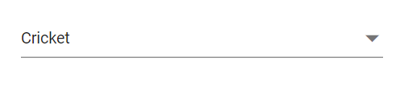
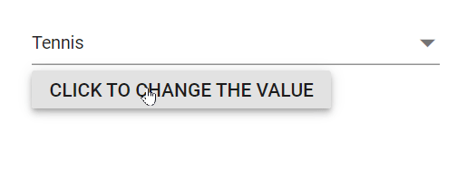
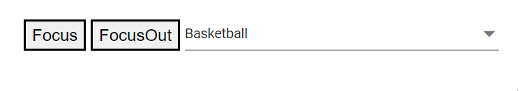

# Selection in Dropdown List

## Get selected value

Get the selected value of the `DropDownList` component in the [ValueChange](https://help.syncfusion.com/cr/blazor/Syncfusion.Blazor.DropDowns.DropDownListEvents-2.html#Syncfusion_Blazor_DropDowns_DropDownListEvents_2_ValueChange) event using the [ChangeEventArgs.Value](https://help.syncfusion.com/cr/blazor/Syncfusion.Blazor.DropDowns.ChangeEventArgs-2.html#Syncfusion_Blazor_DropDowns_ChangeEventArgs_2_Value) property.







Get the complete object list of the selected value in the [ValueChange](https://help.syncfusion.com/cr/blazor/Syncfusion.Blazor.DropDowns.DropDownListEvents-2.html#Syncfusion_Blazor_DropDowns_DropDownListEvents_2_ValueChange) event using the [ChangeEventArgs.ItemData](https://help.syncfusion.com/cr/blazor/Syncfusion.Blazor.DropDowns.ChangeEventArgs-2.html#Syncfusion_Blazor_DropDowns_ChangeEventArgs_2_ItemData) property.







## Preselected value on OnInitializedAsync

Bind a preselected value to the `DropDownList` using the [`@bind-Value`](https://help.syncfusion.com/cr/blazor/Syncfusion.Blazor.DropDowns.SfDropDownList-2.html#Syncfusion_Blazor_DropDowns_SfDropDownList_2_Value) attribute. Assign the value in the [`OnInitializedAsync`](https://learn.microsoft.com/en-us/aspnet/core/blazor/components/lifecycle?view=aspnetcore-6.0#component-initialization-oninitializedasync) lifecycle method. The following sample binds the value during initial rendering.







## Programmatically change the selected value

Change the component value programmatically by referencing the component instance via the [`@ref`](https://learn.microsoft.com/en-us/aspnet/core/mvc/views/razor?view=aspnetcore-7.0#ref) attribute. The following sample changes the value from a button click handler.







When the value changes through user action or programmatically, the following events are raised.

### ValueChange event

The [ValueChange](https://help.syncfusion.com/cr/blazor/Syncfusion.Blazor.DropDowns.DropDownListEvents-2.html#Syncfusion_Blazor_DropDowns_DropDownListEvents_2_ValueChange) event occurs whenever the value is modified and provides details including the current and previous values.







### OnValueSelect event

The [OnValueSelect](https://help.syncfusion.com/cr/blazor/Syncfusion.Blazor.DropDowns.DropDownListEvents-2.html#Syncfusion_Blazor_DropDowns_DropDownListEvents_2_OnValueSelect) event occurs when an item is selected in the popup. Access the selected item via [ChangeEventArgs.ItemData](https://help.syncfusion.com/cr/blazor/Syncfusion.Blazor.DropDowns.ChangeEventArgs-2.html#Syncfusion_Blazor_DropDowns_ChangeEventArgs_2_ItemData). To prevent selection, set [ChangeEventArgs.Cancel](https://help.syncfusion.com/cr/blazor/Syncfusion.Blazor.DropDowns.ChangeEventArgs-2.html#Syncfusion_Blazor_DropDowns_ChangeEventArgs_2_Cancel) to `true` in the handler.







## Preselect value with index

Bind a preselected value by index using the [`@bind-Index`](https://help.syncfusion.com/cr/blazor/Syncfusion.Blazor.DropDowns.SfDropDownList-2.html#Syncfusion_Blazor_DropDowns_SfDropDownList_2_Index) attribute. This selects the item at the specified position in the data source.

N> Selection by index is affected by the [SortOrder](https://help.syncfusion.com/cr/blazor/Syncfusion.Blazor.DropDowns.SortOrder.html). If sorting is applied, the index corresponds to the sorted data.

The following sample binds the index during initial rendering.







## Get selected item by value

Retrieve the entire data object for a selected value using the [GetDataByValue](https://help.syncfusion.com/cr/blazor/Syncfusion.Blazor.DropDowns.SfDropDownList-2.html#Syncfusion_Blazor_DropDowns_SfDropDownList_2_GetDataByValue__0_) method.







## Focus the next component on selection

Programmatically move focus using the [FocusAsync](https://help.syncfusion.com/cr/blazor/Syncfusion.Blazor.DropDowns.SfDropDownList-2.html#Syncfusion_Blazor_DropDowns_SfDropDownList_2_FocusAsync) method on a `DropDownList` instance, for example after selection, to maintain a logical tab order.







## Programmatically trigger onChange event

The [ValueChange](https://help.syncfusion.com/cr/blazor/Syncfusion.Blazor.DropDowns.DropDownListEvents-2.html#Syncfusion_Blazor_DropDowns_DropDownListEvents_2_ValueChange) event can be invoked manually using the `DropDownListEvents` instance (obtained via `@ref`). In the following example, `ValueChange` is invoked inside the `Created` event handler to demonstrate manual triggering.







## Programmatically focus in and focus out the component

In order to trigger the `FocusAsync()` and `FocusOutAsync()` methods using the instance of the dropdownlist, you can use buttons. You can bind the click event of the button to the `FocusAsync()` and `FocusOutAsync()` methods. When the button is clicked, it triggers the corresponding method on the dropdownlist.







When focusing and blurring, the following events are raised.

### Focus event

The [Focus](https://help.syncfusion.com/cr/blazor/Syncfusion.Blazor.DropDowns.DropDownListEvents-2.html#Syncfusion_Blazor_DropDowns_DropDownListEvents_2_Focus) event triggers when the component receives focus.







### Blur event

The [Blur](https://help.syncfusion.com/cr/blazor/Syncfusion.Blazor.DropDowns.DropDownListEvents-2.html#Syncfusion_Blazor_DropDowns_DropDownListEvents_2_Blur) event triggers when focus moves away from the component.







## Get Data by value

Retrieve the selected data by invoking the `GetDataByValue(TValue)` method on the `DropDownList` instance (accessed via `@ref`). For example, bind a button click to call `GetDataByValue(TValue)` and process the returned item.





 

## Get List Item

Retrieve the list items by calling the `GetItemsAsync()` method on the `DropDownList` instance. For example, bind a button click to invoke `GetItemsAsync()` and use the returned items for further processing.





