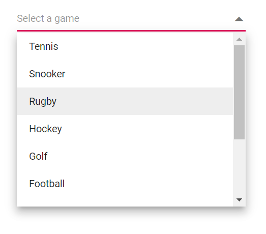

# Sorting in Dropdown List

Sorting enables you to arrange items in `Ascending` or `Descending` order. To enable sorting in the `DropDownList`, set the [SortOrder](https://help.syncfusion.com/cr/blazor/Syncfusion.Blazor.DropDowns.SfDropDownBase-1.html#Syncfusion_Blazor_DropDowns_SfDropDownBase_1_SortOrder) property to the required value. 

The available sort orders are:

SortOrder     | Description
------------ | -------------
  [None](https://help.syncfusion.com/cr/blazor/Syncfusion.Blazor.DropDowns.SortOrder.html#Syncfusion_Blazor_DropDowns_SortOrder_None)       | No sorting is applied; items appear in their original data source order.
  [Ascending](https://help.syncfusion.com/cr/blazor/Syncfusion.Blazor.DropDowns.SortOrder.html#Syncfusion_Blazor_DropDowns_SortOrder_Ascending)     | Items are sorted in ascending order.
  [Descending](https://help.syncfusion.com/cr/blazor/Syncfusion.Blazor.DropDowns.SortOrder.html#Syncfusion_Blazor_DropDowns_SortOrder_Descending)      | Items are sorted in descending order.

In the following example, items in the data source are shuffled randomly, and the popup lists them alphanumerically in ascending or descending order based on the configured `SortOrder`.







