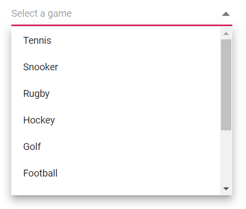

# Sorting in Blazor DropDown List Component

[Sorting](https://help.syncfusion.com/cr/blazor/Syncfusion.Blazor.DropDowns.SfDropDownBase-1.html#Syncfusion_Blazor_DropDowns_SfDropDownBase_1_SortOrder) enables you to sort data in the `Ascending` or `Descending` order. To enable sorting in the DropDownList, set the `SortOrder` property to required value. 

The available type of sort orders are.

SortOrder     | Description
------------ | -------------
  None       | The data source is not sorting.
  Ascending     | The data source is sorting with ascending order.
  Descending      | The data source is sorting with descending order.

In the below sample demonstration the items in the datasource are shuffled in random order, But we can decide whether the items to be listed in ascending or descending order alphanumerically in the popup. 



@using Syncfusion.Blazor.DropDowns

 <SfDropDownList TValue="string" TItem="GameFields" PopupHeight="230px" Width="300px" SortOrder="SortOrder.Descending" Placeholder="Select a game" DataSource="@Games">
   <DropDownListFieldSettings Text="Text" Value="ID"/>
 </SfDropDownList>
@code{
 public class GameFields
    {
        public string ID { get; set; }
        public string Text { get; set; }
    }
    public List<GameFields> Games = new List<GameFields>()
    {
        new GameFields(){ ID= "Game1", Text= "Rugby" },
        new GameFields(){ ID= "Game2", Text= "Snooker" },
        new GameFields(){ ID= "Game3", Text= "Basketball" },
        new GameFields(){ ID= "Game4", Text= "Cricket" },
        new GameFields(){ ID= "Game5", Text= "Football" },
        new GameFields(){ ID= "Game6", Text= "Tennis" },
        new GameFields(){ ID= "Game7", Text= "Hockey" },
        new GameFields(){ ID= "Game8", Text= "American Football"},
        new GameFields(){ ID= "Game9", Text= "Badminton" },
        new GameFields(){ ID= "Game10",Text= "Golf"}
    };
}



The output will be as follows.

