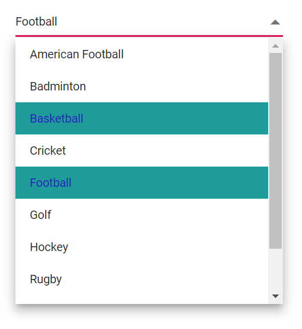
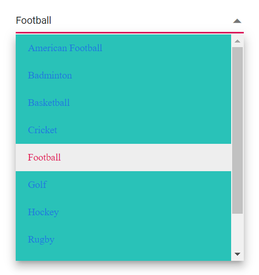

# Style and Appearance in Dropdown List

The following content provides the exact CSS structure that can be used to modify the control's appearance based on the user preference.

## Read-only mode

Specify the boolean value to the [Readonly](https://help.syncfusion.com/cr/blazor/Syncfusion.Blazor.DropDowns.SfDropDownList-2.html#Syncfusion_Blazor_DropDowns_SfDropDownList_2_Readonly) whether the DropDownList allows the user to change the value or not.







## Disabled state

Specify the boolean value to the [Enabled](https://help.syncfusion.com/cr/blazor/Syncfusion.Blazor.DropDowns.SfDropDownBase-1.html#Syncfusion_Blazor_DropDowns_SfDropDownBase_1_Enabled) property that indicates whether the component is enabled or not.







## CssClass  

Specifies the CSS class name that can be appended with the root element of the DropDownList. One or more custom CSS classes can be added to a DropDownList.

Some of the possible values are

* `e-success`, which denotes the component in success state that is added green color to the dropdownlist's input field.
* `e-warning`, which denotes the component in warning state that is added orange color to the dropdownlist's input field.
* `e-error`, which denotes the component in error state that is added red color to the dropdownlist's input field.
* `e-outline`, which supports only in material theme.
* `e-multi-column`, which provides two or more columns in the popup and the column will be aligned like grid.





 

## Customizing the disabled component’s text color

You can customize the disabled component’s text color by using the following CSS selector. This selector targets the input element when it is in a disabled state and sets the desired color to the `-webkit-text-fill-color` property.







## Show the custom icon in dropdown icon

You can customize the dropdown [icon](https://ej2.syncfusion.com/documentation/appearance/icons/#material) using the following CSS selector. This selector targets the icon element that is displayed within the dropdown list component and set the desired icon to the `content` property.







You can customize the dropdown icon for the particular component using the [CssClass](https://help.syncfusion.com/cr/blazor/Syncfusion.Blazor.DropDowns.SfDropDownList-2.html#Syncfusion_Blazor_DropDowns_SfDropDownList_2_CssClass) property and add style to the custom class which is mapped to `CssClass`.







## Customizing the appearance of container element

You can customize the appearance of the container element within the dropdown list component using the following CSS selector. This selector targets the parent element of the input and allows you to apply any desired styles to the component.







## Customizing the dropdown icon’s color

You can customize the dropdown [icon](https://ej2.syncfusion.com/documentation/appearance/icons/#material) using the following CSS selector. This selector targets the icon element that is displayed within the dropdown list component and you can  set the desired color to the `color` property.







## Customizing the focus color

You can customize the component color while focusing using the following CSS selector. This selector targets the input element when it is focused and you can set the desired color to the `background` property.







## Customizing the outline theme's focus color

You can customize the color of the dropdown list component when it is in a focused state and rendered with an outline theme, by using the `e-outline` class in the CSS selector. This selector targets the input element when it is focused, and allows you to set the desired color to the color property.







Use the `e-outline` to the [CssClass](https://help.syncfusion.com/cr/blazor/Syncfusion.Blazor.DropDowns.SfDropDownList-2.html#Syncfusion_Blazor_DropDowns_SfDropDownList_2_CssClass) property to achieve the outline theme.







## Customizing the background color of focus, hover, and active items

You can customize the background color and text color of the list items within the dropdown list component when they are in a focused, active, or hovered state using the following CSS selectors. This selector targets the list item element when it is focused, active, and hovered, and allows you to set the desired background color to the `background-color` property and desired text color to the `color` property.







## Customizing the appearance of pop-up element

You can customize the appearance of the popup element within the dropdown list component by using the following CSS selector. This selector targets the list item element when it is focused and allows you to apply any desired styles to the component.







## Change the HTML attributes

Add the additional html attributes such as styles, class, and more to the root element using the [HTMLAttributes](https://help.syncfusion.com/cr/blazor/Syncfusion.Blazor.DropDowns.SfDropDownList-2.html#Syncfusion_Blazor_DropDowns_SfDropDownList_2_HtmlAttributes) property and accepts n number of attributes in a key-value pair format..







## Change the InputAttributes

You can add the additional input attributes such as disabled, value, and more to the root element.

If you configured both the property and equivalent input attribute, then the component considers the property value.





 

## Set the various font family for dropdown list elements

The font-family of the dropdown list can be changed by overriding using the following selector. The overridden can be applied to specific component by adding a class name through the [CssClass](https://help.syncfusion.com/cr/blazor/Syncfusion.Blazor.DropDowns.SfDropDownList-2.html#Syncfusion_Blazor_DropDowns_SfDropDownList_2_CssClass) property.

In the following sample, the font family of the Dropdownlist, ListItem text in dropdownlist and filterInput text are changed.







## Show tooltip on list item

You can achieve this behavior by integrating the tooltip component. When the mouse hovers over the DropDownList option, a tooltip appears with information about the hovered list item.

The following code demonstrates how to display a tooltip when hovering over the DropDownList option.







## Customize selected item opacity

Set the opacity to the selected item using the following selector.







## Customizing the height

### Height of dropdownlist

Use the [PopupHeight](https://help.syncfusion.com/cr/blazor/Syncfusion.Blazor.DropDowns.SfDropDownList-2.html#Syncfusion_Blazor_DropDowns_SfDropDownList_2_PopupHeight) property to change the height of the popup.







### Width of dropdownlist

To customize the width of the popup alone, use the [PopupWidth](https://help.syncfusion.com/cr/blazor/Syncfusion.Blazor.DropDowns.SfDropDownList-2.html#Syncfusion_Blazor_DropDowns_SfDropDownList_2_PopupWidth) property. By default, the popup width is set based on the component's width. Use the [Width](https://help.syncfusion.com/cr/blazor/Syncfusion.Blazor.DropDowns.SfDropDownList-2.html#Syncfusion_Blazor_DropDowns_SfDropDownList_2_Width) to change the width of the component.You can also set the Width in pixel values. Default value of `Width` is `100%`.







## Disable specfic items in dropdown list

Prevent some items in the popup list from selecting. This can be achieved by disabling the item for a specific dropdownlist component by adding the custom class for the popup element using the [CssClass](https://help.syncfusion.com/cr/blazor/Syncfusion.Blazor.DropDowns.SfDropDownList-2.html#Syncfusion_Blazor_DropDowns_SfDropDownList_2_CssClass) property.

In the following code, a single list Item is hidden using jsinterop.










 




