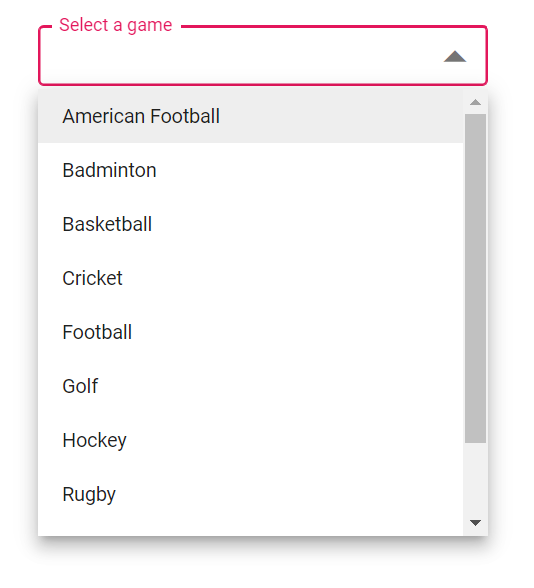

# Style and Appearance

The following content provides the exact CSS structure that can be used to modify the control's appearance based on the user preference.

## Read-only Mode

You can specify the boolean value to [Readonly](https://help.syncfusion.com/cr/blazor/Syncfusion.Blazor.DropDowns.SfDropDownList-2.html#Syncfusion_Blazor_DropDowns_SfDropDownList_2_Readonly) whether the DropDownList allows the user to change the value.








## Disabled state

You can specifies the boolean value to `Enabled` property that indicates whether the component is enabled or not.








### Difference between Readonly and Disable

* `Readonly` - 
* `Enabled` -

## Customizing the Disabled Component’s Text color

Use the following CSS to customize the text color when the component is disabled.

```css
.e-input-group.e-control-wrapper .e-input[disabled] {
    -webkit-text-fill-color: #0d9133;
}
```

## Show the custom Icon in dropdown Icon

You can change the dropdown [icon](https://ej2.syncfusion.com/documentation/appearance/icons/#material) by overriding the below style “content”.








You can also change the dropdown icon for the particular component using [CssClass](https://help.syncfusion.com/cr/blazor/Syncfusion.Blazor.DropDowns.SfDropDownList-2.html#Syncfusion_Blazor_DropDowns_SfDropDownList_2_CssClass) property and add style to the custom class which is mapped to CssClass.








## Adding Icon in Popup Items


## Customizing the appearance of container element

Use the following CSS to customize the appearance of container element.

```css
.e-ddl.e-input-group.e-control-wrapper .e-input {
    font-size: 20px;
    font-family: emoji;
    color: #ab3243;
    background: #32a5ab;
}
```

## Customizing the Dropdown Icon’s Color

Use the following CSS to customize the dropdown icon’s color.

```css
.e-ddl .e-input-group-icon.e-ddl-icon.e-icons, .e-ddl .e-input-group-icon.e-ddl-icon.e-icons:hover {
    color: #bb233d;
    font-size: 13px;
}
```

## Customizing the Focus Color

Use the following CSS to customize the focusing color of input element.

```css
.e-ddl.e-input-group.e-control-wrapper.e-input-focus::before, .e-ddl.e-input-group.e-control-wrapper.e-input-focus::after {
    background: #c000ff;
}
```

## Customizing the outline theme's focus color

Use the following CSS to customize the focusing color of outline theme.

```css
.e-outline.e-input-group.e-input-focus:hover:not(.e-success):not(.e-warning):not(.e-error):not(.e-disabled):not(.e-float-icon-left),.e-outline.e-input-group.e-input-focus.e-control-wrapper:hover:not(.e-success):not(.e-warning):not(.e-error):not(.e-disabled):not(.e-float-icon-left),.e-outline.e-input-group.e-input-focus:not(.e-success):not(.e-warning):not(.e-error):not(.e-disabled),.e-outline.e-input-group.e-control-wrapper.e-input-focus:not(.e-success):not(.e-warning):not(.e-error):not(.e-disabled) {
    border-color: #b1bd15;
    box-shadow: inset 1px 1px #b1bd15, inset -1px 0 #b1bd15, inset 0 -1px #b1bd15;
}
```

You can use `e-outline` to the [CssClass]() to achieve outline theme










## Customizing the background color of focus, hover, and active items

Use the following CSS to customize the background color of focus, hover, and active items.

```css
.e-dropdownbase .e-list-item.e-item-focus, .e-dropdownbase .e-list-item.e-active, .e-dropdownbase .e-list-item.e-active.e-hover, .e-dropdownbase .e-list-item.e-hover {
    background-color: #1f9c99;
    color: #2319b8;
}
```

## Customizing the appearance of pop-up element

Use the following CSS to customize the appearance of popup element.

```css
.e-dropdownbase .e-list-item, .e-dropdownbase .e-list-item.e-item-focus {
    background-color: #29c2b8;
    color: #207cd9;
    font-family: emoji;
    min-height: 29px;
}
```

## Change the HTML Attributes

You can add the additional html attributes such as styles, class, and more to the root element using [HTMLAttributes](https://help.syncfusion.com/cr/blazor/Syncfusion.Blazor.DropDowns.SfDropDownList-2.html#Syncfusion_Blazor_DropDowns_SfDropDownList_2_HtmlAttributes) property








## Set the various Font family for Dropdown List Elements

You can override using the selector for changing the font-family of dropdown list. Also, you can override using the specific class name through [CssClass](https://help.syncfusion.com/cr/blazor/Syncfusion.Blazor.DropDowns.SfDropDownList-2.html#Syncfusion_Blazor_DropDowns_SfDropDownList_2_CssClass) property.

In the below sample changed the font family of Dropdownlist, ListItem in dropdownlist and filterInput text.








## Show Tooltip on List Item

You can achieve this behavior by using tooltip component. When the mouse is hovered over the DropDownList option, a tooltip appears with information about the hovered list item.

The following code demonstrates how to display a tooltip when hovering over the DropDownList option.








## Customize selected item opacity

You can set opacity to the selected item using below selector.








## Customizing the height

### Height of dropdown list

You can use [PopupHeight](https://help.syncfusion.com/cr/blazor/Syncfusion.Blazor.DropDowns.SfDropDownList-2.html#Syncfusion_Blazor_DropDowns_SfDropDownList_2_PopupHeight) property to change the height of the popup.

% highlight cshtml %}






### Width of dropdown list

You can use [PopupWidth](https://help.syncfusion.com/cr/blazor/Syncfusion.Blazor.DropDowns.SfDropDownList-2.html#Syncfusion_Blazor_DropDowns_SfDropDownList_2_PopupWidth) property to change the width of the popup. By default, the popup width sets based on the width of the component. and use [Width](https://help.syncfusion.com/cr/blazor/Syncfusion.Blazor.DropDowns.SfDropDownList-2.html#Syncfusion_Blazor_DropDowns_SfDropDownList_2_Width) to change the width of the component.

% highlight cshtml %}






## Disable Specfic Items in Dropdown List

You can prevent some items in the popup list from selecting and it can be achieved by disable the item for specific dropdownlist component by adding the custom class for popup element using CssClass property

In below code single list Item is hidden using jsinterop.

% highlight cshtml %}








 <script>
        window.disable = function (id) { 
    setTimeout(function (e) { 
        var liCollections = document.querySelectorAll('.e-popup.e-custom-class .e-list-item') 
        if (liCollections && liCollections.length > 0) 
        liCollections[1].classList.add('e-disabled'); 
        liCollections[1].classList.add('e-overlay'); 
    }, 30); 
 } 
</script>





