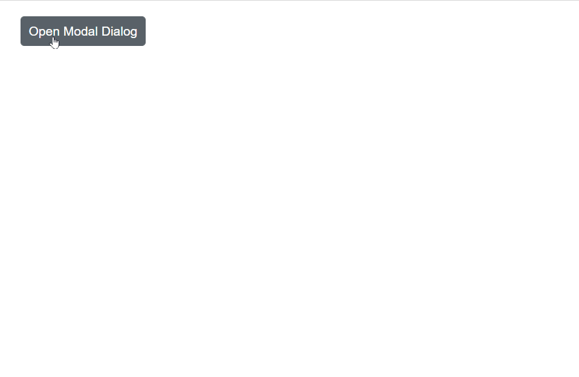

# Style and Appearance in Dropdown List

The following sections outline the CSS hooks and component properties that can be used to customize the DropDownList appearance.

## Read-only mode

Set the boolean [Readonly](https://help.syncfusion.com/cr/blazor/Syncfusion.Blazor.DropDowns.SfDropDownList-2.html#Syncfusion_Blazor_DropDowns_SfDropDownList_2_Readonly) property to make the `DropDownList` non-editable while still allowing focus and interaction that doesn’t change its value.







## Disabled state

Set the boolean [Enabled](https://help.syncfusion.com/cr/blazor/Syncfusion.Blazor.DropDowns.SfDropDownBase-1.html#Syncfusion_Blazor_DropDowns_SfDropDownBase_1_Enabled) property to enable or disable the component entirely.







## CssClass  

Use the [CssClass](https://help.syncfusion.com/cr/blazor/Syncfusion.Blazor.DropDowns.SfDropDownList-2.html#Syncfusion_Blazor_DropDowns_SfDropDownList_2_CssClass) property to append one or more custom CSS class names to the root element and style the component.

Some common class names:

* `e-success`: Applies a success visual style (for example, green accent) to the input.
* `e-warning`: Applies a warning visual style (for example, orange accent) to the input.
* `e-error`: Applies an error visual style (for example, red accent) to the input.
* `e-outline`: Applies the outline style (Material theme support).
* `e-multi-column`: Creates a multi-column popup layout using templates (columns are aligned with custom CSS). 





 

## Customizing the disabled component’s text color

Target the disabled input selector (for example, `.e-input[disabled]`) and set `-webkit-text-fill-color` (and other color properties as needed) to change disabled text color.







## Show the custom icon in dropdown icon

Customize the dropdown [icon](https://ej2.syncfusion.com/documentation/appearance/icons#material) by targeting its CSS class `.e-ddl-icon::before`, which indicates the icon element displayed within the dropdown list component, and set the desired icon to the `content` property.







Customize the dropdown icon for a specific component by adding a custom class through [CssClass](https://help.syncfusion.com/cr/blazor/Syncfusion.Blazor.DropDowns.SfDropDownList-2.html#Syncfusion_Blazor_DropDowns_SfDropDownList_2_CssClass) and scoping the icon style to that class.







## Customizing the appearance of container element

Customize the appearance of the container element within the dropdown list component by targeting its CSS class `.e-input`, which indicates the parent element of the input, and allows you to apply any desired styles to the component.







## Customizing the dropdown icon’s color

Customize the dropdown [icon](https://ej2.syncfusion.com/documentation/appearance/icons#material) by targeting its CSS class `.e-ddl-icon.e-icons`, which indicates the icon element displayed within the dropdown list component, and setting the desired color to the `color` property.







## Customizing the focus color

Customize the focus indicator by targeting `.e-input-focus::after` and setting the `background` (or other) properties to match the desired focus style.







## Customizing the outline theme's focus color

When using the outline variant, target the `e-outline` style to adjust focus color specifically for outline-themed inputs.







Use `e-outline` in the [CssClass](https://help.syncfusion.com/cr/blazor/Syncfusion.Blazor.DropDowns.SfDropDownList-2.html#Syncfusion_Blazor_DropDowns_SfDropDownList_2_CssClass) property to enable the outline theme.







## Customizing the background color of focus, hover, and active items

Adjust list item background and text colors for focused, active, and hovered states by targeting `.e-list-item.e-item-focus`, `.e-list-item.e-active`, and `.e-list-item.e-hover`.







## Customizing the appearance of pop-up element

Customize popup appearance by targeting popup and list item selectors (for example, `.e-list-item.e-item-focus`) and applying styles such as background and borders.







## Change the HTML attributes

Add additional attributes (for example, `style`, `class`, `title`) to the root element using the [HtmlAttributes](https://help.syncfusion.com/cr/blazor/Syncfusion.Blazor.DropDowns.SfDropDownList-2.html#Syncfusion_Blazor_DropDowns_SfDropDownList_2_HtmlAttributes) property, which accepts a key-value dictionary.







## Change the InputAttributes

Add the additional input attributes such as disabled, value, and more to the root element.If you configured both the property and equivalent input attribute, then the component considers the property value.





 

## Set the various font family for dropdown list elements

The font-family of the dropdown list can be changed by overriding using the following selector. The overridden can be applied to specific component by adding a class name through the [CssClass](https://help.syncfusion.com/cr/blazor/Syncfusion.Blazor.DropDowns.SfDropDownList-2.html#Syncfusion_Blazor_DropDowns_SfDropDownList_2_CssClass) property.

In the following sample, the font family of the DropDownList, ListItem text in DropDownList and filterInput text are changed.







## Show tooltip on list item

Achieve this behavior by integrating the tooltip component. When the mouse hovers over the DropDownList option, a tooltip appears with information about the hovered list item.

The following code demonstrates how to display a tooltip when hovering over the DropDownList option.







### Tooltip using HTMLAttribute in dropdown component

To display the tooltip in the dropdown component not for individual popup items, add the `Title` attribute through the [HTMLAttributes](https://help.syncfusion.com/cr/blazor/Syncfusion.Blazor.DropDowns.SfDropDownList-2.html#Syncfusion_Blazor_DropDowns_SfDropDownList_2_HtmlAttributes) property. This updates the attribute on the root input element.

In the following example, the `HtmlAttributes` property is used to add the title attribute to the root input element of the DropDownList with the value `DropDownList Component`. This will display a tooltip with the text `DropDownList Component` when the user hovers over the input element.







## Customize selected item opacity

Adjust the opacity of selected (and selected + hovered) items by targeting `.e-dropdownbase .e-list-item.e-active` and related states to achieve a transparent or subdued look.







## Customizing the height

### Height of DropDownList

Use [PopupHeight](https://help.syncfusion.com/cr/blazor/Syncfusion.Blazor.DropDowns.SfDropDownList-2.html#Syncfusion_Blazor_DropDowns_SfDropDownList_2_PopupHeight) to change the popup height.







### Width of DropDownList

To change only the popup width, use [PopupWidth](https://help.syncfusion.com/cr/blazor/Syncfusion.Blazor.DropDowns.SfDropDownList-2.html#Syncfusion_Blazor_DropDowns_SfDropDownList_2_PopupWidth). By default, the popup width matches the component width. Use [Width](https://help.syncfusion.com/cr/blazor/Syncfusion.Blazor.DropDowns.SfDropDownList-2.html#Syncfusion_Blazor_DropDowns_SfDropDownList_2_Width) to change the component width.







## Disable specific items in DropDownList

Prevent selection of specific items by applying custom CSS classes to the popup via [CssClass](https://help.syncfusion.com/cr/blazor/Syncfusion.Blazor.DropDowns.SfDropDownList-2.html#Syncfusion_Blazor_DropDowns_SfDropDownList_2_CssClass) and marking list items as disabled (for example, adding `e-disabled` and `e-overlay` via JS interop).












## Adding conditional HTML attribute to list item

This is achieved by adding attributes to the li items based on the data source value with the help of the JSInterop. In the [Opened](https://help.syncfusion.com/cr/blazor/Syncfusion.Blazor.DropDowns.DropDownListEvents-2.html#Syncfusion_Blazor_DropDowns_DropDownListEvents_2_Opened) event, call the client-side script by passing the required arguments (data source and id) and adding the attributes based on the data source value obtained from the server.

In the following example, the `Opened` event is used to call the `AddAttribute` method when the DropDownList is opened. The `AddAttribute` method gets the data source from the component instance and calls a JavaScript function using the JavaScript Interop. The JavaScript function receives the data source and the ID of the DropDownList as arguments, and adds the attributes to the li elements based on the data source values.












## Displaying DropDownList in Tab

The DropDownList component can be used within a tab view to enable users to select an option from a list. This can be achieved by placing the DropDownList within the SfTab component. Each tab includes a DropDownList that allows the user to choose from a list of options.

In the following example, the SfTab component is used to display a tab view with three tab items. Each tab item contains a DropDownList component with a different data source. When the user selects a different tab, the corresponding DropDownList is displayed.







## DropDownList inside Dialog

A modal dialog box that contains a dropdown list can be created to allow users to select an option from the list. This can be achieved by placing the dropdown list within an SfDialog component. The dialog box is opened when the user clicks the "Open Modal Dialog" button, and the dropdown list is present inside the dialog box. The dialog box is closed when the user clicks outside of the dialog box.

In the following example, the SfDialog component is used to display a dialog popup with a DropDownList component inside the dialog content. When the user clicks the `Open Dialog` button, the dialog is displayed.







## Programmatically show and hide spinner

Call `ShowSpinnerAsync()` and `HideSpinnerAsync()` on the DropDownList instance (for example, from button clicks) to display or hide the built-in loading spinner.





 

