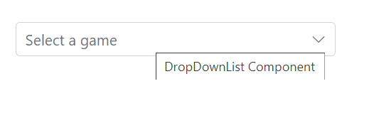
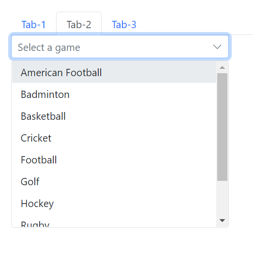

# Style and Appearance in Blazor DropDown List Component

The following content provides the exact CSS structure that can be used to modify the control's appearance based on the user preference.

## Customizing the appearance of container element

Use the following CSS to customize the appearance of container element.

```css
.e-ddl.e-input-group.e-control-wrapper .e-input {
    font-size: 20px;
    font-family: emoji;
    color: #ab3243;
    background: #32a5ab;
}
```

## Customizing the dropdown icon’s color

Use the following CSS to customize the dropdown icon’s color.

```css
.e-ddl .e-input-group-icon.e-ddl-icon.e-icons, .e-ddl .e-input-group-icon.e-ddl-icon.e-icons:hover {
    color: #bb233d;
    font-size: 13px;
}
```

## Customizing the focus color

Use the following CSS to customize the focusing color of input element.

```css
.e-ddl.e-input-group.e-control-wrapper.e-input-focus::before, .e-ddl.e-input-group.e-control-wrapper.e-input-focus::after {
    background: #c000ff;
}
```

## Customizing the outline theme's focus color

Use the following CSS to customize the focusing color of outline theme.

```css
.e-outline.e-input-group.e-input-focus:hover:not(.e-success):not(.e-warning):not(.e-error):not(.e-disabled):not(.e-float-icon-left),.e-outline.e-input-group.e-input-focus.e-control-wrapper:hover:not(.e-success):not(.e-warning):not(.e-error):not(.e-disabled):not(.e-float-icon-left),.e-outline.e-input-group.e-input-focus:not(.e-success):not(.e-warning):not(.e-error):not(.e-disabled),.e-outline.e-input-group.e-control-wrapper.e-input-focus:not(.e-success):not(.e-warning):not(.e-error):not(.e-disabled) {
    border-color: #b1bd15;
    box-shadow: inset 1px 1px #b1bd15, inset -1px 0 #b1bd15, inset 0 -1px #b1bd15;
}
```

## Customizing the disabled component’s text color

Use the following CSS to customize the text color when the component is disabled.

```css
.e-input-group.e-control-wrapper .e-input[disabled] {
    -webkit-text-fill-color: #0d9133;
}
```

## Customizing the float label element's focusing color

Use the following CSS to customize the focusing color of float label element.

```css
.e-float-input.e-input-group:not(.e-float-icon-left) .e-float-line::before,.e-float-input.e-control-wrapper.e-input-group:not(.e-float-icon-left) .e-float-line::before,.e-float-input.e-input-group:not(.e-float-icon-left) .e-float-line::after,.e-float-input.e-control-wrapper.e-input-group:not(.e-float-icon-left) .e-float-line::after {
    background-color: #2319b8;
}

.e-ddl.e-lib.e-input-group.e-control-wrapper.e-control-container.e-float-input.e-input-focus .e-float-text.e-label-top {
    color: #2319b8;
}
```

## Customizing the color of the placeholder text

Use the following CSS to customize the text color of placeholder.

```css
.e-ddl.e-input-group input.e-input::placeholder {
    color: red;
}
```

## Customizing the placeholder to add mandatory indicator(*)

Use the following CSS to add the mandatory indicator * to the float label element.

```css
.e-input-group.e-control-wrapper.e-control-container.e-float-input .e-float-text::after {
    content: "*";
    color: red;
}
```

## Customizing the background color of focus, hover, and active items

Use the following CSS to customize the background color of focus, hover, and active items.

```css
.e-dropdownbase .e-list-item.e-item-focus, .e-dropdownbase .e-list-item.e-active, .e-dropdownbase .e-list-item.e-active.e-hover, .e-dropdownbase .e-list-item.e-hover {
    background-color: #1f9c99;
    color: #2319b8;
}
```

## Customizing the appearance of pop-up element

Use the following CSS to customize the appearance of popup element.

```css
.e-dropdownbase .e-list-item, .e-dropdownbase .e-list-item.e-item-focus {
    background-color: #29c2b8;
    color: #207cd9;
    font-family: emoji;
    min-height: 29px;
}
```

## Adding conditional HTML attribute to list item

You can achieve adding attributes to the li items based on datasource value with the help of JSInterop. In the, Opened event need to call the client side script by passing the required arguments (datasource and id) and add the attributes based on the datasource value obtained from the server.

% highlight cshtml %}








    <script> 
        function OnCreated(datasource, id) { 
            setTimeout(() => { 
                //Here popup element is uniquely identified with id. 
                //Classes added via CssClass property will be added to the popup element also. 
                //You can also uniquely identify the popup element with the help of added class. 
                console.log(document.getElementById(id + "_popup")); 
                var listItems = document.getElementById(id + "_popup").querySelectorAll('li'); 
                for (var i = 0; i < listItems.length; i++) { 
                    listItems[i].setAttribute(Object.keys(datasource[i])[2], datasource[i].isAvailable) 
                } 
            }, 100) 
 
        } 
    </script>





## Show Tooltip

The OnAfterRenderAsync method will called every time the popup gets opened. In open event use the Global variable isOpen and set as false. In all the open event update the variable isOpen as true. So, while click on any of the Dropdownlist component, the OnAfterRenderAsync method will be triggered and refresh the tooltip in order to get the specific target element.

### Tooltip using HTMLAttribute in dropdown component

TO display the  tooltip in dropdown component, you need to add the title attribute through HtmlAttributes property, which update the attribute to the root element “input”









## Disabled component

Tabindex is not present in disable component or focus is not added when tabindex as -1.

## Displaying dropdown List in Tab

You can achieve this by rendering the dropdown list inside the SfTab









## Dropdownlist inside Dialog

You can achieve this by rendering dropdownlist inside the SfDialog








