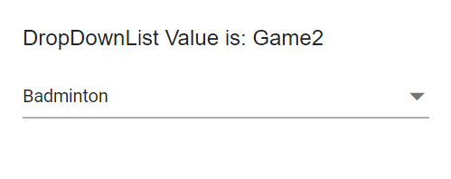
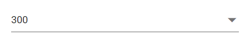
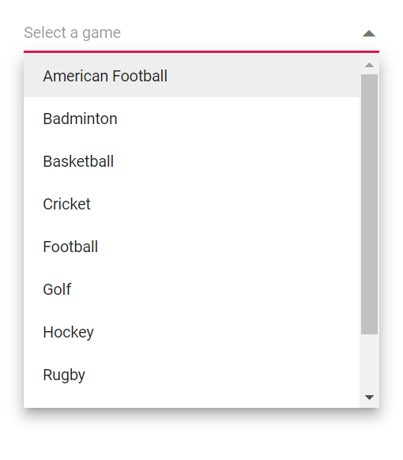
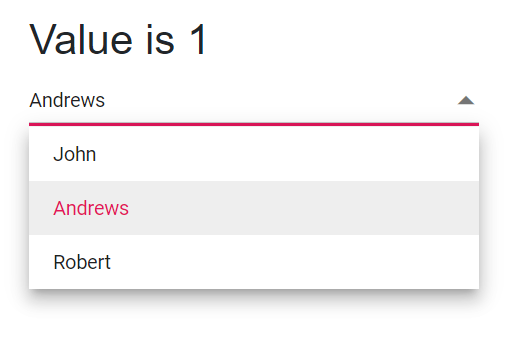
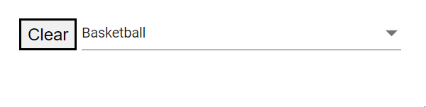

# Value Binding in Dropdown List

Value binding synchronizes a component’s value with a parent or model. The DropDownList supports two binding approaches:
- Value binding with `@bind-Value`.
- Index binding with `@bind-Index`.

## Bind value binding

Use the [`@bind-Value`](https://help.syncfusion.com/cr/blazor/Syncfusion.Blazor.DropDowns.SfDropDownList-2.html#Syncfusion_Blazor_DropDowns_SfDropDownList_2_Value) attribute to bind the selected value. Supported types include `string`, `int`, `enum`, `bool`, and complex types. When the component value changes, all references bound via `@bind-Value` update automatically. Ensure the bound value corresponds to the field mapped to [DropDownListFieldSettings.Value](https://help.syncfusion.com/cr/blazor/Syncfusion.Blazor.DropDowns.FieldSettingsModel.html#Syncfusion_Blazor_DropDowns_FieldSettingsModel_Value).

- `TValue`: Specifies the type of the bound value for the DropDownList component.







## Index value binding

Bind by index using the [`@bind-Index`](https://help.syncfusion.com/cr/blazor/Syncfusion.Blazor.DropDowns.SfDropDownList-2.html#Syncfusion_Blazor_DropDowns_SfDropDownList_2_Index) attribute. This supports `int` and nullable `int` types and selects the item at the specified position in the data source.







## Text and value

The [DropDownListFieldSettings.Value](https://help.syncfusion.com/cr/blazor/Syncfusion.Blazor.DropDowns.FieldSettingsModel.html#Syncfusion_Blazor_DropDowns_FieldSettingsModel_Value) and [DropDownListFieldSettings.Text](https://help.syncfusion.com/cr/blazor/Syncfusion.Blazor.DropDowns.FieldSettingsModel.html#Syncfusion_Blazor_DropDowns_FieldSettingsModel_Text) properties map to fields in the data model. The `Value` field holds the unique item value used for binding, and the `Text` field provides the display text in the popup list.

In the following example, the selected item text is “Badminton” (Text field), while the value is “Game2” (Value field).







## Primitive type binding

Bind arrays of primitive data (for example, strings or numbers) by assigning the data source and using [`@bind-Value`](https://help.syncfusion.com/cr/blazor/Syncfusion.Blazor.DropDowns.SfDropDownList-2.html#Syncfusion_Blazor_DropDowns_SfDropDownList_2_Value).

The following example uses an array of strings:







The following example uses an array of integers:







## Object binding

Bind complex objects to [`@bind-Value`](https://help.syncfusion.com/cr/blazor/Syncfusion.Blazor.DropDowns.SfDropDownList-2.html#Syncfusion_Blazor_DropDowns_SfDropDownList_2_Value) by setting `TValue` to the object type and mapping `DropDownListFieldSettings.Value` to a unique field.

In the following example, the `Name` field is mapped to the `Value` property.







## Enum binding

Bind enum values using [`@bind-Value`](https://help.syncfusion.com/cr/blazor/Syncfusion.Blazor.DropDowns.SfDropDownList-2.html#Syncfusion_Blazor_DropDowns_SfDropDownList_2_Value). The component binds to the enum value; configure `Text`/`Value` mappings to control how enum items display.







## Show or hide clear button

Use the [ShowClearButton](https://help.syncfusion.com/cr/blazor/Syncfusion.Blazor.DropDowns.SfDropDownList-2.html#Syncfusion_Blazor_DropDowns_SfDropDownList_2_ShowClearButton) property to show or hide the clear button. Clicking the clear button resets `Value`, `Text`, and `Index`.

N> For non-nullable `TValue`, the clear action sets the default value of the type (for example, `0` for `int`). For nullable `TValue` (for example, `int?`), the clear action sets `null`.

The following example uses `string` as `TValue`, so clearing sets the value to `null`.







## Dynamically change TItem

Change `TItem` dynamically by defining a generic DropDownList using the `@typeparam` directive and passing different data source types.

### Creating generic dropdownList component

Create a reusable `DropDownList.razor` component that exposes `customData` (`List<TItem>`) and `DDLValue` (`TValue`) as parameters.




@using Syncfusion.Blazor.DropDowns;
@typeparam TValue;
@typeparam TItem;

<SfDropDownList TValue="TValue" Width="300px" TItem="TItem" @bind-Value="@DDLValue" Placeholder="Please select a value" DataSource="@customData">
    <DropDownListFieldSettings Text="Text" Value="ID"></DropDownListFieldSettings>
</SfDropDownList>

@code {
    [Parameter]
    public List<TItem> customData { get; set; }
    [Parameter]
    public TValue DDLValue { get; set; }
    [Parameter]
    public EventCallback<TValue> DDLValueChanged { get; set; }
}




### Usage of generic component with different type

Use the generic component with different `TValue` and `TItem` types in pages as needed.

In the example below, `TValue` is `string` in `Index.razor`, and `TValue` is `int?` in `Counter.razor`.

**[Index.razor]**




<DropDownList TValue="string" TItem="Games" @bind-DDLValue="@value" customData="@LocalData">
</DropDownList>

@code{
    public string value { get; set; } = "Game1";
    public class Games
    {
        public string ID { get; set; }
        public string Text { get; set; }
    }
    List<Games> LocalData = new List<Games> {
        new Games() { ID= "Game1", Text= "American Football" },
        new Games() { ID= "Game2", Text= "Badminton" },
        new Games() { ID= "Game3", Text= "Basketball" },
        new Games() { ID= "Game4", Text= "Cricket" },
        new Games() { ID= "Game5", Text= "Football" },
        new Games() { ID= "Game6", Text= "Golf" },
        new Games() { ID= "Game7", Text= "Hockey" },
        new Games() { ID= "Game8", Text= "Rugby"},
        new Games() { ID= "Game9", Text= "Snooker" },
        new Games() { ID= "Game10", Text= "Tennis"},
    };
}




**[Counter.razor]**



<DropDownList TValue="int?" TItem="Games" @bind-DDLValue="@value" customData="@LocalData">
</DropDownList>

@code{
    public int? value { get; set; } = 3;
    public class Games
    {
        public int? ID { get; set; }
        public string Text { get; set; }
    }
    List<Games> LocalData = new List<Games> {
        new Games() { ID= 1, Text= "American Football" },
        new Games() { ID= 2, Text= "Badminton" },
        new Games() { ID= 3, Text= "Basketball" },
        new Games() { ID= 4, Text= "Cricket" },
        new Games() { ID= 5, Text= "Football" },
        new Games() { ID= 6, Text= "Golf" },
        new Games() { ID= 7, Text= "Hockey" },
        new Games() { ID= 8, Text= "Rugby"},
        new Games() { ID= 9, Text= "Snooker" },
        new Games() { ID= 10, Text= "Tennis"},
    };
}




## Two way binding

Two-way binding synchronizes data between the UI and the model using the Blazor `@bind-Value` directive. Use `@bind-Value` on the DropDownList to enable two-way binding.







## Programmatically clearing value

Clear the value programmatically by calling `ClearAsync()` on the DropDownList instance (obtained via `@ref`). For example, bind a button click to invoke `ClearAsync()`.





 

