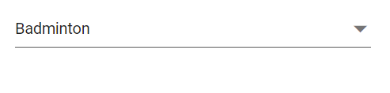

# Value Binding in Dropdown List

The value binding as the process of passing values between a component and its parent. There are two methods for binding values, as shown below.

    * bind-Value Binding 
    * bind-Index Binding

## Bind value binding

The value binding can be achieved by using [@bind-Value](https://help.syncfusion.com/cr/blazor/Syncfusion.Blazor.DropDowns.SfDropDownList-2.html#Syncfusion_Blazor_DropDowns_SfDropDownList_2_Value) attribute and it supports string, int, Enum, bool and complex types. If component value has been changed, it will affect all places where you bind the variable for the `@bind-value` attribute.







## Index value binding

The Index value binding can be achieved by using [@bind-Index](https://help.syncfusion.com/cr/blazor/Syncfusion.Blazor.DropDowns.SfDropDownList-2.html#Syncfusion_Blazor_DropDowns_SfDropDownList_2_Index) attribute and it supports int and int nullable types. By using this attribute you can bind the values respective to its index.







## Text and value

The DropdownList [DropDownListFieldSettings.Value](https://help.syncfusion.com/cr/blazor/Syncfusion.Blazor.DropDowns.FieldSettingsModel.html#Syncfusion_Blazor_DropDowns_FieldSettingsModel_Value) and [DropDownListFieldSettings.Text](https://help.syncfusion.com/cr/blazor/Syncfusion.Blazor.DropDowns.FieldSettingsModel.html#Syncfusion_Blazor_DropDowns_FieldSettingsModel_Text) properties point to the corresponding names of the model. The `DropDownListFieldSettings.Value` mapped to the component maintains the unique value of the item in the data source, and the `DropDownListFieldSettings.Text` is mapped to display the text in the popup list items for the respective text value.

The following code demonstrates, Value and Text field of the DropDownList component For instance, the selected item is `Badminton` (Text Field i.e., Game) but the value field holds `Game2` (Value Field i.e., ID).







## Primitive type binding

The DropDownList has support to load array of primitive data such as strings and numbers. You can bind value of primitive data to [@bind-Value](https://help.syncfusion.com/cr/blazor/Syncfusion.Blazor.DropDowns.SfDropDownList-2.html#Syncfusion_Blazor_DropDowns_SfDropDownList_2_Value) attribute of DropDownList 

The following code demonstrates array of string as datasource to the DropDownList component.







The following code demonstrates array of int as datasource to the DropDownList component.







## Object binding

You can bind Object data to the [@bind-Value](https://help.syncfusion.com/cr/blazor/Syncfusion.Blazor.DropDowns.SfDropDownList-2.html#Syncfusion_Blazor_DropDowns_SfDropDownList_2_Value) attribute of the DropdownList component, You can map the class name to both `TValue` and `TItem`. 

In the following example, `Name` column has been mapped to the [`DropDownListFieldSettings.Value`](https://help.syncfusion.com/cr/blazor/Syncfusion.Blazor.DropDowns.FieldSettingsModel.html#Syncfusion_Blazor_DropDowns_FieldSettingsModel_Value).







## Enum binding

You can bind enum data to [@bind-Value](https://help.syncfusion.com/cr/blazor/Syncfusion.Blazor.DropDowns.SfDropDownList-2.html#Syncfusion_Blazor_DropDowns_SfDropDownList_2_Value) attribute of DropDownList component. The following code helps you get a string value from the enumeration data.







## Show or hide clear button

You can use [ShowClearButton](https://help.syncfusion.com/cr/blazor/Syncfusion.Blazor.DropDowns.SfDropDownList-2.html#Syncfusion_Blazor_DropDowns_SfDropDownList_2_ShowClearButton) property to specify whether to show or hide the clear button. When the clear button is clicked, `Value`, `Text`, and `Index` properties are reset to null.

> If the TValue is non nullable type, then while using clear button, it will set the default value of the data type and TValue is set as nullable type while using clear button it will set to null value(eg: If TValue is int while clearing 0 is set to the component and if TValue is int? while clearing null is set to the component)

The below sample demonstrates `string` is used as `TValue`. So, if we clear the value using clear button, it will set to null as it's the default value of the respective type.







## Dynamically change TItem

You can change the `TItem` property dynamically which defines the datasource type of the DropDownList component with help of `@typeparam` directive. The below sample demonstration explains how  to change  the TItem dynamically with different type of datasource.

### Creating generic dropdownList component

First, you need to create a `DropDownList.razor` file in the `/Pages` folder as a parent component. Also add a Parameter property for a List as `<TItem>` and `TValue`.




@using Syncfusion.Blazor.DropDowns;
@typeparam TValue;
@typeparam TItem;

<SfDropDownList TValue="TValue" Width="300px" TItem="TItem" @bind-Value="@DDLValue" Placeholder="Please select a value" DataSource="@customData">
    <DropDownListFieldSettings Text="Text" Value="ID"></DropDownListFieldSettings>
</SfDropDownList>

@code {
    [Parameter]
    public List<TItem> customData { get; set; }
    [Parameter]
    public TValue DDLValue { get; set; }
    [Parameter]
    public EventCallback<TValue> DDLValueChanged { get; set; }
}



### Usage of generic component with different type

Then you can render the Generic DropDownList component with required `TValue` and `TItem` in the respective razor components. 

Here, we have rendered the DropDownList component with TValue as string type in the `/Index.razor` file and DropDownList component with TValue as int? type in the `/Counter.razor` file.

**[Index.razor]**




<DropDownList TValue="string" TItem="Games" @bind-DDLValue="@value" customData="@LocalData">
</DropDownList>

@code{
    public string value { get; set; } = "Game1";
    public class Games
    {
        public string ID { get; set; }
        public string Text { get; set; }
    }
    List<Games> LocalData = new List<Games> {
        new Games() { ID= "Game1", Text= "American Football" },
        new Games() { ID= "Game2", Text= "Badminton" },
        new Games() { ID= "Game3", Text= "Basketball" },
        new Games() { ID= "Game4", Text= "Cricket" },
        new Games() { ID= "Game5", Text= "Football" },
        new Games() { ID= "Game6", Text= "Golf" },
        new Games() { ID= "Game7", Text= "Hockey" },
        new Games() { ID= "Game8", Text= "Rugby"},
        new Games() { ID= "Game9", Text= "Snooker" },
        new Games() { ID= "Game10", Text= "Tennis"},
    };
}



**[Counter.razor]**



<DropDownList TValue="int?" TItem="Games" @bind-DDLValue="@value" customData="@LocalData">
</DropDownList>

@code{
    public int? value { get; set; } = 3;
    public class Games
    {
        public int? ID { get; set; }
        public string Text { get; set; }
    }
    List<Games> LocalData = new List<Games> {
        new Games() { ID= 1, Text= "American Football" },
        new Games() { ID= 2, Text= "Badminton" },
        new Games() { ID= 3, Text= "Basketball" },
        new Games() { ID= 4, Text= "Cricket" },
        new Games() { ID= 5, Text= "Football" },
        new Games() { ID= 6, Text= "Golf" },
        new Games() { ID= 7, Text= "Hockey" },
        new Games() { ID= 8, Text= "Rugby"},
        new Games() { ID= 9, Text= "Snooker" },
        new Games() { ID= 10, Text= "Tennis"},
    };
}


