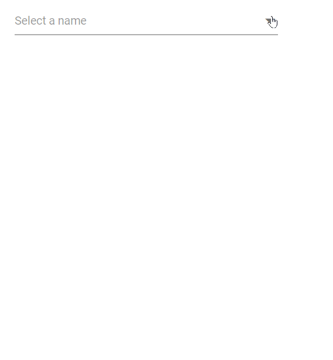

# Virtualization in DropDown List

The DropDownList has been provided virtualization to improve the UI performance for a large amount of data when [`EnableVirtualization`](https://help.syncfusion.com/cr/blazor/Syncfusion.Blazor.DropDowns.SfDropDownList-2.html#Syncfusion_Blazor_DropDowns_SfDropDownList_2_EnableVirtualization) is true. 
This feature doesn’t render out the entire data source on initial component rendering. It loads the N number of items in the popup on initial rendering and the remaining set number of items will load on each scrolling action in the popup. It can work with both local and remote data.

You can specify the count of the items to be appended  in the popup element using [`ItemsCount`](https://help.syncfusion.com/cr/blazor/Syncfusion.Blazor.DropDowns.SfDropDownList-2.html#Syncfusion_Blazor_DropDowns_SfDropDownList_2_ItemsCount) property when [`EnableVirtualization`]((https://help.syncfusion.com/cr/blazor/Syncfusion.Blazor.DropDowns.SfDropDownList-2.html#Syncfusion_Blazor_DropDowns_SfDropDownList_2_EnableVirtualization)) is enabled. 

In the below sample demo, if the scroll action takes place, it will append 20 more items to the popup element.







## Local data

In the following code 150 local data items bound to the component, but only 6 items will load to the popup when you open the popup. Remaining set number of items will load on each scrolling action in the popup.







## Remote data 

In the following code, remote data bound to the DropDownList component, but only 10 items will load to the popup when you open the popup. Remaining set number of items will load on each scrolling action in the popup.







## Limitation of virtualization

* virtualization is not supported in the Grouping feature.