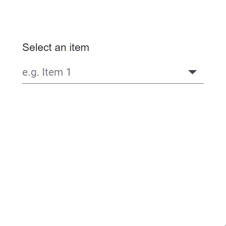

# Virtualization in DropDown List

To get started quickly with virtualization in the Blazor DropDownList component, watch the video below.



The DropDownList component includes a virtual scrolling feature designed to enhance UI performance, particularly for handling large datasets. By enabling the [EnableVirtualization](https://help.syncfusion.com/cr/blazor/Syncfusion.Blazor.DropDowns.SfDropDownList-2.html#Syncfusion_Blazor_DropDowns_SfDropDownList_2_EnableVirtualization) option, the DropDownList intelligently manages data rendering, ensuring only a subset of items is initially loaded when the component is rendered. As you interact with the dropdown, additional items are dynamically loaded as you scroll, creating a smooth and efficient user experience.

This feature is applicable to both local and remote data scenarios, providing flexibility in its implementation. For instance, consider a case where the DropDownList is bound to a dataset containing 150 items. Upon opening the dropdown, only a few items are loaded initially, based on the height of the popup. As you scroll through the list, additional items are fetched and loaded on-demand, allowing you to effortlessly explore the complete dataset.







## Grouping with virtualization

The DropDownList supports grouping together with virtualization. Use [DropDownListFieldSettings.GroupBy](https://help.syncfusion.com/cr/blazor/Syncfusion.Blazor.DropDowns.DropDownListFieldSettings.html#Syncfusion_Blazor_DropDowns_DropDownListFieldSettings_GroupBy) to categorize items by a field in the data source. After grouping is applied, virtualization behaves similarly to local data binding: group headers and items are rendered on demand as the user scrolls. When using a remote data source, an initial request may retrieve the necessary data to perform grouping; thereafter, the grouped content is virtualized during display.

The following sample demonstrates grouping with virtualization.







## Keyboard interaction

Users can navigate virtualized content using keyboard actions. The following keys load items or pages on demand as needed:

| Key | Action |
|-----|-----|
| `ArrowDown` | Loads the next virtual item when the selection reaches the last item of the current page. |
| `ArrowUp` | Loads the previous virtual item when the selection reaches the first item of the current page. |
| `PageDown` | Loads the next page and selects the last item. |
| `PageUp` | Loads the previous page and selects the first item. |
| `Home` | Loads the initial page and selects the first item. |
| `End` | Loads the last page and selects the last item. |