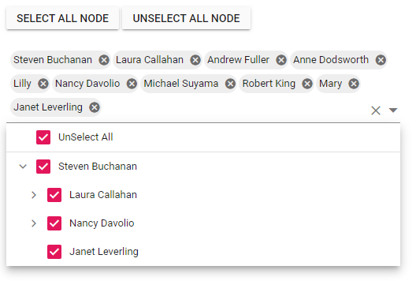

# Checkbox Functionality in Blazor Dropdown Tree Component

The Dropdown Tree component allows users to select multiple items from the tree structure using checkboxes. This functionality is enabled via the [`ShowCheckBox`](https://help.syncfusion.com/cr/blazor/Syncfusion.Blazor.Navigations.SfDropDownTree-2.html#Syncfusion_Blazor_Navigations_SfDropDownTree_2_ShowCheckBox) property. When `ShowCheckBox` is set to `true`, a checkbox appears before each item's text within the popup.

## Auto Check 

By default, the checkbox state of parent and child items in the Dropdown Tree `TreeView` is independent. To establish a dependent relationship, enable the [`AutoUpdateCheckState`](https://help.syncfusion.com/cr/blazor/Syncfusion.Blazor.Navigations.SfDropDownTree-2.html#Syncfusion_Blazor_Navigations_SfDropDownTree_2_AutoUpdateCheckState) property.

When `AutoUpdateCheckState` is enabled:

*   If one or more child items are unchecked, the parent item will display an intermediate (partially checked) state.
*   If all child items are checked, the parent item will also transition to the checked state.
*   Checking a parent item will automatically check all its child items.

In the following example, the [AutoUpdateCheckState](https://help.syncfusion.com/cr/blazor/Syncfusion.Blazor.Navigations.SfDropDownTree-2.html#Syncfusion_Blazor_Navigations_SfDropDownTree_2_AutoUpdateCheckState) property is enabled.

```cshtml
@using Syncfusion.Blazor.Navigations

<SfDropDownTree TItem="EmployeeData" TValue="string" Placeholder="Select an employee" Width="500px" ShowCheckBox="true" AutoUpdateCheckState="true">
        <DropDownTreeField TItem="EmployeeData" DataSource="Data" ID="Id" Text="Name" HasChildren="HasChild" ParentID="PId"></DropDownTreeField>
</SfDropDownTree>

@code {
    List<EmployeeData> Data = new List<EmployeeData>
    {
        new EmployeeData() { Id = "1", Name = "Steven Buchanan", Job = "General Manager", HasChild = true, Expanded = true },
        new EmployeeData() { Id = "2", PId = "1", Name = "Laura Callahan", Job = "Product Manager", HasChild = true },
        new EmployeeData() { Id = "3", PId = "2", Name = "Andrew Fuller", Job = "Team Lead", HasChild = true },
        new EmployeeData() { Id = "4", PId = "3", Name = "Anne Dodsworth", Job = "Developer" },
        new EmployeeData() { Id = "10", PId = "3", Name = "Lilly", Job = "Developer" },
        new EmployeeData() { Id = "5", PId = "1", Name = "Nancy Davolio", Job = "Product Manager", HasChild = true },
        new EmployeeData() { Id = "6", PId = "5", Name = "Michael Suyama", Job = "Team Lead", HasChild = true },
        new EmployeeData() { Id = "7", PId = "6", Name = "Robert King", Job = "Developer" },
        new EmployeeData() { Id = "11", PId = "6", Name = "Mary", Job = "Developer" },
        new EmployeeData() { Id = "9", PId = "1", Name = "Janet Leverling", Job = "HR"}
    };

    class EmployeeData
    {
        public string? Id { get; set; }
        public string? Name { get; set; }
        public string? Job { get; set; }
        public bool HasChild { get; set; }
        public bool Expanded { get; set; }
        public string? PId { get; set; }
    }
}
```


## Select/Unselect All

The Dropdown Tree component offers built-in support to select or unselect all tree items using a single checkbox in the header.

Setting the [ShowSelectAll](https://help.syncfusion.com/cr/blazor/Syncfusion.Blazor.Navigations.SfDropDownTree-2.html#Syncfusion_Blazor_Navigations_SfDropDownTree_2_ShowSelectAll) property to `true` displays a "Select All" checkbox in the popup header. This checkbox allows users to toggle the checked state of all visible tree items.

Additionally, programmatic control over the "Select All" functionality is available:

*   Use the [`SelectAllAsync()`](https://help.syncfusion.com/cr/blazor/Syncfusion.Blazor.Navigations.SfDropDownTree-2.html#Syncfusion_Blazor_Navigations_SfDropDownTree_2_SelectAllAsync_System_Boolean_) method without parameters (or with `true`) to programmatically check all tree items.
*   Use the `SelectAllAsync(false)` method to programmatically uncheck all tree items.

In the following example, the [ShowSelectAll](https://help.syncfusion.com/cr/blazor/Syncfusion.Blazor.Navigations.SfDropDownTree-2.html#Syncfusion_Blazor_Navigations_SfDropDownTree_2_ShowSelectAll) property is enabled and [SelectAllAsync](https://help.syncfusion.com/cr/blazor/Syncfusion.Blazor.Navigations.SfDropDownTree-2.html#Syncfusion_Blazor_Navigations_SfDropDownTree_2_SelectAllAsync_System_Boolean_) method is used.

```cshtml
@using Syncfusion.Blazor.Navigations
@using Syncfusion.Blazor.Buttons
 
<SfButton OnClick="SelectAllNode">Select all node</SfButton>
<SfButton OnClick="UnSelectAllNode">UnSelect all node</SfButton>

<div style="padding-top:20px">
    <SfDropDownTree @ref="sfDropDownTree" TItem="EmployeeData" TValue="string" Placeholder="Select an employee" Width="500px"  ShowCheckBox ShowSelectAll>
        <DropDownTreeField TItem="EmployeeData" DataSource="Data" ID="Id" Text="Name" HasChildren="HasChild" ParentID="PId"></DropDownTreeField>
    </SfDropDownTree>
</div>

 
@code {
    SfDropDownTree<string, EmployeeData>? sfDropDownTree;
    List<string> SelectedNode = new List<string>();
    List<EmployeeData> Data = new List<EmployeeData>
    {
        new EmployeeData() { Id = "1", Name = "Steven Buchanan", Job = "General Manager", HasChild = true, Expanded = true },
        new EmployeeData() { Id = "2", PId = "1", Name = "Laura Callahan", Job = "Product Manager", HasChild = true },
        new EmployeeData() { Id = "3", PId = "2", Name = "Andrew Fuller", Job = "Team Lead", HasChild = true },
        new EmployeeData() { Id = "4", PId = "3", Name = "Anne Dodsworth", Job = "Developer" },
        new EmployeeData() { Id = "10", PId = "3", Name = "Lilly", Job = "Developer" },
        new EmployeeData() { Id = "5", PId = "1", Name = "Nancy Davolio", Job = "Product Manager", HasChild = true },
        new EmployeeData() { Id = "6", PId = "5", Name = "Michael Suyama", Job = "Team Lead", HasChild = true },
        new EmployeeData() { Id = "7", PId = "6", Name = "Robert King", Job = "Developer" },
        new EmployeeData() { Id = "11", PId = "6", Name = "Mary", Job = "Developer" },
        new EmployeeData() { Id = "9", PId = "1", Name = "Janet Leverling", Job = "HR"}
    };
 
    async Task SelectAllNode()
    {
        await sfDropDownTree.SelectAllAsync();
    }

    async Task UnSelectAllNode()
    {
        await sfDropDownTree.SelectAllAsync(false);
    }
 
    class EmployeeData
    {
        public string? Id { get; set; }
        public string? Name { get; set; }
        public string? Job { get; set; }
        public bool HasChild { get; set; }
        public bool Expanded { get; set; }
        public string? PId { get; set; }
    }
}
```


