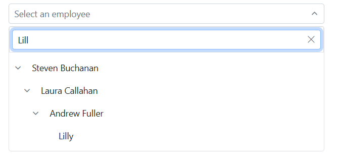

# Filtering in Blazor Dropdown Tree Component

The Blazor Dropdown Tree offers built-in support for filtering data items, allowing users to quickly find specific entries within the tree structure. Filtering is enabled by setting the [`AllowFiltering`](https://help.syncfusion.com/cr/blazor/Syncfusion.Blazor.Navigations.SfDropDownTree-2.html#Syncfusion_Blazor_Navigations_SfDropDownTree_2_AllowFiltering) property to `true`. The filter operation typically begins as soon as characters are typed into the component's search box. By default, `AllowFiltering` is `false`.

## Filtering Local Data

The following example demonstrates how to enable and utilize the filtering functionality with local data in the Dropdown Tree component.

```cshtml
@using Syncfusion.Blazor.Navigations

<SfDropDownTree TItem="EmployeeData" TValue="string" Placeholder="Select an employee" Width="500px" AllowFiltering="true">
    <DropDownTreeField TItem="EmployeeData" DataSource="Data" ID="Id" Text="Name" HasChildren="HasChild" ParentID="PId"></DropDownTreeField>
</SfDropDownTree>

@code {
    List<EmployeeData> Data = new List<EmployeeData>
    {
        new EmployeeData() { Id = "1", Name = "Steven Buchanan", Job = "General Manager", HasChild = true, Expanded = true },
        new EmployeeData() { Id = "2", PId = "1", Name = "Laura Callahan", Job = "Product Manager", HasChild = true },
        new EmployeeData() { Id = "3", PId = "2", Name = "Andrew Fuller", Job = "Team Lead", HasChild = true },
        new EmployeeData() { Id = "4", PId = "3", Name = "Anne Dodsworth", Job = "Developer" },
        new EmployeeData() { Id = "10", PId = "3", Name = "Lilly", Job = "Developer" },
        new EmployeeData() { Id = "5", PId = "1", Name = "Nancy Davolio", Job = "Product Manager", HasChild = true },
        new EmployeeData() { Id = "6", PId = "5", Name = "Michael Suyama", Job = "Team Lead", HasChild = true },
        new EmployeeData() { Id = "7", PId = "6", Name = "Robert King", Job = "Developer" },
        new EmployeeData() { Id = "11", PId = "6", Name = "Mary", Job = "Developer" },
        new EmployeeData() { Id = "9", PId = "1", Name = "Janet Leverling", Job = "HR"}
    };

    class EmployeeData
    {
        public string? Id { get; set; }
        public string? Name { get; set; }
        public string? Job { get; set; }
        public bool HasChild { get; set; }
        public bool Expanded { get; set; }
        public string? PId { get; set; }
    }
}
```



## Filtering Remote Data

The Dropdown Tree component also supports filtering with remote data sources. This involves configuring `SfDataManager` and `Query` objects to fetch filtered data from a service, similar to how data binding works.

The following example demonstrates filtering functionality with remote data in the Dropdown Tree component:

```cshtml

@using Syncfusion.Blazor.Navigations
@using Syncfusion.Blazor.Data

<SfDropDownTree TValue="int?" TItem="TreeData" Placeholder="Select an employee" Width="500px" AllowFiltering="true">
    <DropDownTreeField TItem="TreeData" Query="@Query" ID="EmployeeID" Text="FirstName" HasChildren="EmployeeID">
        <SfDataManager Url="http://services.odata.org/V4/Northwind/Northwind.svc" Adaptor="@Syncfusion.Blazor.Adaptors.ODataV4Adaptor" CrossDomain="true"></SfDataManager>
    </DropDownTreeField>
    <DropDownTreeField TItem="TreeData" Query="@SubQuery" ID="OrderID" Text="ShipName" ParentID="EmployeeID">
        <SfDataManager Url="http://services.odata.org/V4/Northwind/Northwind.svc" Adaptor="@Syncfusion.Blazor.Adaptors.ODataV4Adaptor" CrossDomain="true"></SfDataManager>
    </DropDownTreeField>
</SfDropDownTree>

@code {
    public Query Query = new Query().From("Employees").Select(new List<string> { "EmployeeID", "FirstName" }).Take(5).RequiresCount();
    public Query SubQuery = new Query().From("Orders").Select(new List<string> { "OrderID", "EmployeeID", "ShipName" }).Take(5).RequiresCount();
    public class TreeData
    {
        public int? EmployeeID { get; set; }
        public int OrderID { get; set; }
        public string ShipName { get; set; }
        public string FirstName { get; set; }
    }
}
```

## Filter Type

The [FilterType](https://help.syncfusion.com/cr/blazor/Syncfusion.Blazor.Navigations.SfDropDownTree-2.html#Syncfusion_Blazor_Navigations_SfDropDownTree_2_FilterType) property specifies the type of filter operation performed during the component's search action. The available `FilterType` options and their descriptions are:

FilterType     | Description
------------ | -------------
  [StartsWith](https://help.syncfusion.com/cr/blazor/Syncfusion.Blazor.DropDowns.FilterType.html#Syncfusion_Blazor_DropDowns_FilterType_StartsWith)       | Checks whether a value begins with the specified value.
  [EndsWith](https://help.syncfusion.com/cr/blazor/Syncfusion.Blazor.DropDowns.FilterType.html#Syncfusion_Blazor_DropDowns_FilterType_EndsWith)     | Checks whether a value ends with specified value.
  [Contains](https://help.syncfusion.com/cr/blazor/Syncfusion.Blazor.DropDowns.FilterType.html#Syncfusion_Blazor_DropDowns_FilterType_Contains)      | Checks whether a value contained with specified value.

In the following example, `Contains` filter type has been mapped to the [FilterType](https://help.syncfusion.com/cr/blazor/Syncfusion.Blazor.Navigations.SfDropDownTree-2.html#Syncfusion_Blazor_Navigations_SfDropDownTree_2_FilterType) property.

```cshtml
@using Syncfusion.Blazor.Navigations
@using Syncfusion.Blazor.DropDowns

<SfDropDownTree TItem="EmployeeData" TValue="string" Placeholder="Select an employee" Width="500px" AllowFiltering="true" FilterType="FilterType.Contains">
    <DropDownTreeField TItem="EmployeeData" DataSource="Data" ID="Id" Text="Name" HasChildren="HasChild" ParentID="PId"></DropDownTreeField>
</SfDropDownTree>

@code {
    List<EmployeeData> Data = new List<EmployeeData>
    {
        new EmployeeData() { Id = "1", Name = "Steven Buchanan", Job = "General Manager", HasChild = true, Expanded = true },
        new EmployeeData() { Id = "2", PId = "1", Name = "Laura Callahan", Job = "Product Manager", HasChild = true },
        new EmployeeData() { Id = "3", PId = "2", Name = "Andrew Fuller", Job = "Team Lead", HasChild = true },
        new EmployeeData() { Id = "4", PId = "3", Name = "Anne Dodsworth", Job = "Developer" },
        new EmployeeData() { Id = "10", PId = "3", Name = "Lilly", Job = "Developer" },
        new EmployeeData() { Id = "5", PId = "1", Name = "Nancy Davolio", Job = "Product Manager", HasChild = true },
        new EmployeeData() { Id = "6", PId = "5", Name = "Michael Suyama", Job = "Team Lead", HasChild = true },
        new EmployeeData() { Id = "7", PId = "6", Name = "Robert King", Job = "Developer" },
        new EmployeeData() { Id = "11", PId = "6", Name = "Mary", Job = "Developer" },
        new EmployeeData() { Id = "9", PId = "1", Name = "Janet Leverling", Job = "HR"}
    };

    class EmployeeData
    {
        public string? Id { get; set; }
        public string? Name { get; set; }
        public string? Job { get; set; }
        public bool HasChild { get; set; }
        public bool Expanded { get; set; }
        public string? PId { get; set; }
    }
}
```



## Case sensitive filtering

Data items can be filtered with or without case sensitivity using the [`IgnoreCase`](https://help.syncfusion.com/cr/blazor/Syncfusion.Blazor.Navigations.SfDropDownTree-2.html#Syncfusion_Blazor_Navigations_SfDropDownTree_2_IgnoreCase) property. By default, `IgnoreCase` is set to `true`, meaning filtering is not case-sensitive. To enforce case-sensitive filtering, set this property to `false`.

```cshtml
@using Syncfusion.Blazor.Navigations

<SfDropDownTree TItem="EmployeeData" TValue="string" Placeholder="Filter case-sensitively" Width="500px" AllowFiltering="true" FilterType="FilterType.Contains" IgnoreCase="false">
    <DropDownTreeField TItem="EmployeeData" DataSource="Data" ID="Id" Text="Name" HasChildren="HasChild" ParentID="PId"></DropDownTreeField>
</SfDropDownTree>

@code {
    public List<EmployeeData> Data = new List<EmployeeData>
    {
        new EmployeeData() { Id = "1", Name = "Steven Buchanan", Job = "General Manager", HasChild = true, Expanded = true },
        new EmployeeData() { Id = "2", PId = "1", Name = "Laura Callahan", Job = "Product Manager", HasChild = true },
        new EmployeeData() { Id = "3", PId = "2", Name = "Andrew Fuller", Job = "Team Lead", HasChild = true },
        new EmployeeData() { Id = "4", PId = "3", Name = "Anne Dodsworth", Job = "Developer" },
        new EmployeeData() { Id = "10", PId = "3", Name = "Lilly", Job = "Developer" },
        new EmployeeData() { Id = "5", PId = "1", Name = "Nancy Davolio", Job = "Product Manager", HasChild = true },
        new EmployeeData() { Id = "6", PId = "5", Name = "Michael Suyama", Job = "Team Lead", HasChild = true },
        new EmployeeData() { Id = "7", PId = "6", Name = "Robert King", Job = "Developer" },
        new EmployeeData() { Id = "11", PId = "6", Name = "Mary", Job = "Developer" },
        new EmployeeData() { Id = "9", PId = "1", Name = "Janet Leverling", Job = "HR"}
    };

    public class EmployeeData
    {
        public string? Id { get; set; }
        public string? Name { get; set; }
        public string? Job { get; set; }
        public bool HasChild { get; set; }
        public bool Expanded { get; set; }
        public string? PId { get; set; }
    }
}
```



## Filter Textbox Placeholder

Use the [`FilterBarPlaceholder`](https://help.syncfusion.com/cr/blazor/Syncfusion.Blazor.Navigations.SfDropDownTree-2.html#Syncfusion_Blazor_Navigations_SfDropDownTree_2_FilterBarPlaceholder) property to display watermark text in the filter bar textbox. This property is applicable only when [`AllowFiltering`](https://help.syncfusion.com/cr/blazor/Syncfusion.Blazor.Navigations.SfDropDownTree-2.html#Syncfusion_Blazor_Navigations_SfDropDownTree_2_AllowFiltering) is set to `true`.

```cshtml
@using Syncfusion.Blazor.Navigations

<SfDropDownTree TItem="EmployeeData" TValue="string" Placeholder="Select an employee" Width="500px" AllowFiltering="true" FilterBarPlaceholder="Search employees...">
    <DropDownTreeField TItem="EmployeeData" DataSource="Data" ID="Id" Text="Name" HasChildren="HasChild" ParentID="PId"></DropDownTreeField>
</SfDropDownTree>

@code {
    public List<EmployeeData> Data = new List<EmployeeData>
    {
        new EmployeeData() { Id = "1", Name = "Steven Buchanan", Job = "General Manager", HasChild = true, Expanded = true },
        new EmployeeData() { Id = "2", PId = "1", Name = "Laura Callahan", Job = "Product Manager", HasChild = true },
        new EmployeeData() { Id = "3", PId = "2", Name = "Andrew Fuller", Job = "Team Lead", HasChild = true },
        new EmployeeData() { Id = "4", PId = "3", Name = "Anne Dodsworth", Job = "Developer" },
        new EmployeeData() { Id = "10", PId = "3", Name = "Lilly", Job = "Developer" },
        new EmployeeData() { Id = "5", PId = "1", Name = "Nancy Davolio", Job = "Product Manager", HasChild = true },
        new EmployeeData() { Id = "6", PId = "5", Name = "Michael Suyama", Job = "Team Lead", HasChild = true },
        new EmployeeData() { Id = "7", PId = "6", Name = "Robert King", Job = "Developer" },
        new EmployeeData() { Id = "11", PId = "6", Name = "Mary", Job = "Developer" },
        new EmployeeData() { Id = "9", PId = "1", Name = "Janet Leverling", Job = "HR"}
    };

    public class EmployeeData
    {
        public string? Id { get; set; }
        public string? Name { get; set; }
        public string? Job { get; set; }
        public bool HasChild { get; set; }
        public bool Expanded { get; set; }
        public string? PId { get; set; }
    }
}
```



## Minimum Filter Length

When filtering tree items, can able to specify the minimum number of characters that must be typed before the filtering operation is triggered.  This can be done by checking the text length using the [Filtering event arguments](https://help.syncfusion.com/cr/blazor/Syncfusion.Blazor.Navigations.DdtFilteringEventArgs.html#Syncfusion_Blazor_Navigations_DdtFilteringEventArgs_Text) within the [Filtering](https://help.syncfusion.com/cr/blazor/Syncfusion.Blazor.Navigations.SfDropDownTree-2.html#Syncfusion_Blazor_Navigations_SfDropDownTree_2_Filtering) event handler.

In the following example, the limit is set to 2.

```cshtml
@using Syncfusion.Blazor.Navigations

<SfDropDownTree TItem="Listdata" TValue="string" ID="filter" Placeholder="Select a country" PopupHeight="230px" AllowFiltering="true" FilterBarPlaceholder="Search" Filtering="OnFiltering">
    <DropDownTreeField TItem="Listdata" DataSource="@ListDataSource" ID="Id" ParentID="Pid" Text="Name" HasChildren="HasChild" Expanded="Expanded"></DropDownTreeField>
</SfDropDownTree>

@code {
    List<Listdata> ListDataSource = new List<Listdata>
    {
        new Listdata { Id = "1", Name = "Australia", HasChild = true, Expanded = true },
        new Listdata { Id = "2", Pid = "1", Name = "New South Wales" },
        new Listdata { Id = "3", Pid = "1", Name = "Victoria" },
        new Listdata { Id = "4", Pid = "1", Name = "South Australia" },
        new Listdata { Id = "6", Pid = "1", Name = "Western Australia" },
        new Listdata { Id = "7", Name = "Brazil", HasChild = true },
        new Listdata { Id = "8", Pid = "7", Name = "Parana" },
        new Listdata { Id = "9", Pid = "7", Name = "Ceara" },
        new Listdata { Id = "10", Pid = "7", Name = "Acre" },
        new Listdata { Id = "11", Name = "China", HasChild = true },
        new Listdata { Id = "12", Pid = "11", Name = "Guangzhou" },
        new Listdata { Id = "13", Pid = "11", Name = "Shanghai" },
        new Listdata { Id = "14", Pid = "11", Name = "Beijing" },
        new Listdata { Id = "15", Pid = "11", Name = "Shantou" },
        new Listdata { Id = "16", Name = "France", HasChild = true },
        new Listdata { Id = "17", Pid = "16", Name = "Pays de la Loire" },
        new Listdata { Id = "18", Pid = "16", Name = "Aquitaine" },
        new Listdata { Id = "19", Pid = "16", Name = "Brittany" },
        new Listdata { Id = "20", Pid = "16", Name = "Lorraine" },
        new Listdata { Id = "21", Name = "India", HasChild = true },
        new Listdata { Id = "22", Pid = "21", Name = "Assam" },
        new Listdata { Id = "23", Pid = "21", Name = "Bihar" },
        new Listdata { Id = "24", Pid = "21", Name = "Tamil Nadu" }
    };

    void OnFiltering(DdtFilteringEventArgs args)
    {
        if(args.Text?.Length < 2 && args.Text?.Length != 0)
        {
            args.Cancel = true;
        }
    }

    class Listdata
    {
        public string? Id { get; set; }
        public string? Pid { get; set; }
        public string? Name { get; set; }
        public bool HasChild { get; set; }
        public bool Expanded { get; set; }
    }
}
```

