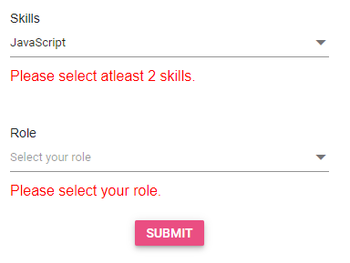

# Form Validation in Blazor Dropdown Tree Component

This section demonstrates the creation of a form that incorporates a Dropdown Tree for user selection, complete with validation to ensure all required fields are correctly filled before submission.

## Dropdown Tree Inside EditForm

The Dropdown Tree component seamlessly integrates within a Blazor `EditForm`, enabling the creation of forms where users can select options from hierarchical lists. The `EditForm` component, in conjunction with `DataAnnotationsValidator`, validates input fields against defined data annotation rules.

When the Dropdown Tree's input (selection) is valid, the form is ready for submission. If the input is invalid, an error message appears, which remains visible until a valid selection is made.

* The EditForm component wraps the entire form, has the Model attribute set to the treeModel variable of type Countries, and triggers the **handleSubmit()** method when the form is submitted.
* The DataAnnotationsValidator component enables validation based on the Data Annotations attributes applied on the treeModel properties.
* The ValidationMessage component displays a validation error message for the Name property of the treeModel variable.
* The submit button submits the form and triggers the **OnValidSubmit()** method when clicked.

```cshtml
@using System.ComponentModel.DataAnnotations;
@using Syncfusion.Blazor.DropDowns
@using Syncfusion.Blazor.Buttons
@using Syncfusion.Blazor.Navigations
@inject Microsoft.AspNetCore.Components.NavigationManager UriHelper
<div class="col-lg-12 control-section">
    <div class="control-wrapper">
        @if (string.IsNullOrEmpty(Message))
        {
            <EditForm Model="@treeModel" OnValidSubmit="@OnValidSubmit" OnInvalidSubmit="@OnInvalidSubmit">
                <DataAnnotationsValidator />
                <div class="form-group">
                    <label class="validation-label" for="skills">Skills</label>
                    <SfDropDownTree TItem="Skills" TValue="string" ID="skills" Placeholder="Select your skills" @bind-Value=@treeModel.Skills ShowCheckBox="true" AutoUpdateCheckState="true" PopupHeight="200px">
                        <DropDownTreeField TItem="Skills" DataSource="@skillCategories" ID="Id" ParentID="ParentId" Text="Name" HasChildren="HasChildren" Expanded="Expanded"></DropDownTreeField>
                    </SfDropDownTree>
                    <ValidationMessage For="@(() => treeModel.Skills)" TValue="List<string>"></ValidationMessage>
                    <label class="validation-label" for="role">Role</label>
                    <SfDropDownTree TItem="Roles" TValue="string" ID="role" Placeholder="Select your role" @bind-Value=@treeModel.Role PopupHeight="200px" ValueChanging="OnValueChanging" ExpandOn="ExpandAction.Click">
                        <DropDownTreeField TItem="Roles" DataSource="@RoleList" ID="Id" Text="Name" ParentID="ParentId" HasChildren="HasChild" Expanded="Expanded"></DropDownTreeField>
                    </SfDropDownTree>
                    <ValidationMessage For="@(() => treeModel.Role)" TValue="List<string>"></ValidationMessage>
                </div>
                <div class="submit-btn">
                    <SfButton type="submit" IsPrimary="true">Submit</SfButton>
                </div>
            </EditForm>
        }
        else
        {
            <div class="alert alert-success">
                @Message
            </div>
        }
    </div>
</div>
<style>
    .control-section {
        min-height: 370px;
    }
    .control-wrapper {
        max-width: 350px;
        margin: 0 auto;
        padding: 20px 0px 0px;
    }
    .validation-message {
        color: red;
        padding: 5px 0px 0px;
    }
    .submit-btn {
        display: flex;
        justify-content: center;
        padding: 20px 0px 0px;
    }
    .validation-label {
        font-size: 14px;
        margin-top: 40px;
    }
    .control-wrapper {
            padding: 30px 0px 0px;
    }
       
    
</style>
@code {
    private string Message = string.Empty;
    private TreeModel treeModel = new TreeModel();
    private List<Skills> skillCategories = new List<Skills>
    {
        new Skills { Id = "1", Name = "Programming Languages", HasChildren = true, Expanded = true },
        new Skills { Id = "2", Name = "General-purpose Languages", ParentId = "1", HasChildren = true },
        new Skills { Id = "3", Name = "C#", ParentId = "2" },
        new Skills { Id = "4", Name = "Java", ParentId = "2" },
        new Skills { Id = "8", Name = "Web Development Languages", ParentId = "1", HasChildren = true, Expanded = true },
        new Skills { Id = "9", Name = "JavaScript", ParentId = "8" },
        new Skills { Id = "10", Name = "HTML/CSS", ParentId = "8" },
        new Skills { Id = "14", Name = "Database Management", HasChildren = true },
        new Skills { Id = "15", Name = "Relational Databases", ParentId = "14", HasChildren = true },
        new Skills { Id = "16", Name = "MySQL", ParentId = "15" },
        new Skills { Id = "17", Name = "PostgreSQL", ParentId = "15" },
        new Skills { Id = "21", Name = "NoSQL Databases", ParentId = "14", HasChildren = true, Expanded = true },
        new Skills { Id = "22", Name = "MongoDB", ParentId = "21" },
        new Skills { Id = "23", Name = "Cassandra", ParentId = "21" }
    };
    private List<Roles> RoleList = new List<Roles>
    {
        new Roles { Id = "1", Name = "HR Department", HasChild = true },
        new Roles { Id = "2", Name = "HR Manager", ParentId = "1" },
        new Roles { Id = "3", Name = "HR Specialist", ParentId = "1" },
        new Roles { Id = "7", Name = "Product Development", HasChild = true },
        new Roles { Id = "8", Name = "Team Lead", ParentId = "7" },
        new Roles { Id = "9", Name = "Developer", ParentId = "7" },
        new Roles { Id = "10", Name = "Marketing Department", HasChild = true },
        new Roles { Id = "11", Name = "Marketing Manager", ParentId = "10" },
        new Roles { Id = "12", Name = "Marketing Specialist", ParentId = "10" }
    };
    private async void OnValidSubmit()
    {
        Message = "Form Submitted Successfully!";
        await Task.Delay(2000);
        Message = string.Empty;
        treeModel.Role = null;
        treeModel.Skills = null;
        StateHasChanged();
    }
    private void OnInvalidSubmit()
    {
        Message = string.Empty;
    }
    private void OnValueChanging(DdtChangeEventArgs<string> args)
    {
        if (args.NodeData.HasChildren)
        {
            args.Cancel = true;
        }
    }
    private class TreeModel
    {
        [Required(ErrorMessage = "Please select your role.")]
        [MinLength(1, ErrorMessage = "Please select your role.")]
        public List<string>? Role { get; set; }
        [Required(ErrorMessage = "Please select your skill.")]
        [MinLength(2, ErrorMessage = "Please select atleast 2 skills.")]
        public List<string>? Skills { get; set; }
    }
    class Skills
    {
        public string? Id { get; set; }
        public string? Name { get; set; }
        public string? ParentId { get; set; }
        public bool HasChildren { get; set; }
        public bool Expanded { get; set; }
    }
    class Roles
    {
        public string? Id { get; set; }
        public string? Name { get; set; }
        public string? ParentId { get; set; }
        public bool Expanded { get; set; }
        public bool HasChild { get; set; }
    }
}
```

