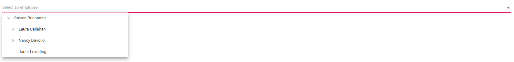
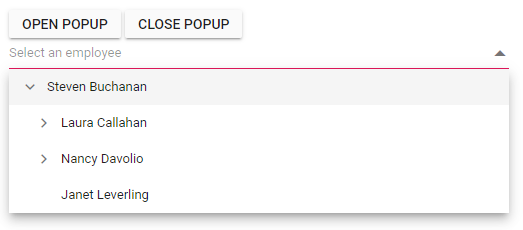
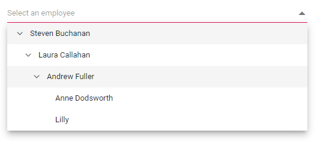

# Popup Settings in Blazor Dropdown Tree Component

The Blazor Dropdown Tree component provides various properties to customize the appearance and behavior of its popup element. These settings allow for precise control over the popup's dimensions, layering, and interaction.

## Change the Popup Width

Customize the width of the popup using the [`PopupWidth`](https://help.syncfusion.com/cr/blazor/Syncfusion.Blazor.Navigations.SfDropDownTree-2.html#Syncfusion_Blazor_Navigations_SfDropDownTree_2_PopupWidth) property. The default value `PopupWidth` is `100%`, meaning it matches the width of the Dropdown Tree component itself. If left unspecified, the popup width automatically adjusts to the component's width.

In the following sample, the `PopupWidth` is explicitly set to `400px`:

```cshtml
@using Syncfusion.Blazor.Navigations

<SfDropDownTree TItem="EmployeeData" TValue="string" Placeholder="Select an employee" PopupWidth="400px">
    <DropDownTreeField TItem="EmployeeData" DataSource="Data" ID="Id" Text="Name" HasChildren="HasChild" ParentID="PId"></DropDownTreeField>
</SfDropDownTree>

@code {
    List<EmployeeData> Data = new List<EmployeeData>
    {
        new EmployeeData() { Id = "1", Name = "Steven Buchanan", Job = "General Manager", HasChild = true, Expanded = true },
        new EmployeeData() { Id = "2", PId = "1", Name = "Laura Callahan", Job = "Product Manager", HasChild = true },
        new EmployeeData() { Id = "3", PId = "2", Name = "Andrew Fuller", Job = "Team Lead", HasChild = true },
        new EmployeeData() { Id = "4", PId = "3", Name = "Anne Dodsworth", Job = "Developer" },
        new EmployeeData() { Id = "10", PId = "3", Name = "Lilly", Job = "Developer" },
        new EmployeeData() { Id = "5", PId = "1", Name = "Nancy Davolio", Job = "Product Manager", HasChild = true },
        new EmployeeData() { Id = "6", PId = "5", Name = "Michael Suyama", Job = "Team Lead", HasChild = true },
        new EmployeeData() { Id = "7", PId = "6", Name = "Robert King", Job = "Developer" },
        new EmployeeData() { Id = "11", PId = "6", Name = "Mary", Job = "Developer" },
        new EmployeeData() { Id = "9", PId = "1", Name = "Janet Leverling", Job = "HR"}
    };
    
    class EmployeeData
    {
        public string? Id { get; set; }
        public string? Name { get; set; }
        public string? Job { get; set; }
        public bool HasChild { get; set; }
        public bool Expanded { get; set; }
        public string? PId { get; set; }
    }
}
```



## Change the Popup Height

Customize the height of the popup using the [`PopupHeight`](https://help.syncfusion.com/cr/blazor/Syncfusion.Blazor.Navigations.SfDropDownTree-2.html#Syncfusion_Blazor_Navigations_SfDropDownTree_2_PopupHeight) property. The default value for `PopupHeight` is `300px`.

```cshtml
@using Syncfusion.Blazor.Navigations

<SfDropDownTree TItem="EmployeeData" TValue="string" Placeholder="Select an employee" Width="500px" PopupHeight="200px">
    <DropDownTreeField TItem="EmployeeData" DataSource="Data" ID="Id" Text="Name" HasChildren="HasChild" ParentID="PId"></DropDownTreeField>
</SfDropDownTree>

@code {
    List<EmployeeData> Data = new List<EmployeeData>
    {
        new EmployeeData() { Id = "1", Name = "Steven Buchanan", Job = "General Manager", HasChild = true, Expanded = true },
        new EmployeeData() { Id = "2", PId = "1", Name = "Laura Callahan", Job = "Product Manager", HasChild = true },
        new EmployeeData() { Id = "3", PId = "2", Name = "Andrew Fuller", Job = "Team Lead", HasChild = true },
        new EmployeeData() { Id = "4", PId = "3", Name = "Anne Dodsworth", Job = "Developer" },
        new EmployeeData() { Id = "10", PId = "3", Name = "Lilly", Job = "Developer" },
        new EmployeeData() { Id = "5", PId = "1", Name = "Nancy Davolio", Job = "Product Manager", HasChild = true },
        new EmployeeData() { Id = "6", PId = "5", Name = "Michael Suyama", Job = "Team Lead", HasChild = true },
        new EmployeeData() { Id = "7", PId = "6", Name = "Robert King", Job = "Developer" },
        new EmployeeData() { Id = "11", PId = "6", Name = "Mary", Job = "Developer" },
        new EmployeeData() { Id = "9", PId = "1", Name = "Janet Leverling", Job = "HR"}
    };
    
    class EmployeeData
    {
        public string? Id { get; set; }
        public string? Name { get; set; }
        public string? Job { get; set; }
        public bool HasChild { get; set; }
        public bool Expanded { get; set; }
        public string? PId { get; set; }
    }
}
```



## Change the Popup Z-Index

Customize the [ZIndex](https://help.syncfusion.com/cr/blazor/Syncfusion.Blazor.Navigations.SfDropDownTree-2.html#Syncfusion_Blazor_Navigations_SfDropDownTree_2_ZIndex) value of the component's popup element. The default value is `1000`. A higher Z-Index ensures the popup appears above other elements on the page.

```cshtml
@using Syncfusion.Blazor.Navigations

<SfDropDownTree TItem="EmployeeData" TValue="string" Placeholder="Select an employee" Width="500px" ZIndex="1050">
    <DropDownTreeField TItem="EmployeeData" DataSource="Data" ID="Id" Text="Name" HasChildren="HasChild" ParentID="PId"></DropDownTreeField>
</SfDropDownTree>

@code {
    public List<EmployeeData> Data = new List<EmployeeData>
    {
        new EmployeeData() { Id = "1", Name = "Steven Buchanan", Job = "General Manager", HasChild = true, Expanded = true },
        new EmployeeData() { Id = "2", PId = "1", Name = "Laura Callahan", Job = "Product Manager", HasChild = true },
        new EmployeeData() { Id = "3", PId = "2", Name = "Andrew Fuller", Job = "Team Lead", HasChild = true },
        new EmployeeData() { Id = "4", PId = "3", Name = "Anne Dodsworth", Job = "Developer" },
        new EmployeeData() { Id = "10", PId = "3", Name = "Lilly", Job = "Developer" },
        new EmployeeData() { Id = "5", PId = "1", Name = "Nancy Davolio", Job = "Product Manager", HasChild = true },
        new EmployeeData() { Id = "6", PId = "5", Name = "Michael Suyama", Job = "Team Lead", HasChild = true },
        new EmployeeData() { Id = "7", PId = "6", Name = "Robert King", Job = "Developer" },
        new EmployeeData() { Id = "11", PId = "6", Name = "Mary", Job = "Developer" },
        new EmployeeData() { Id = "9", PId = "1", Name = "Janet Leverling", Job = "HR"}
    };
    
    public class EmployeeData
    {
        public string? Id { get; set; }
        public string? Name { get; set; }
        public string? Job { get; set; }
        public bool HasChild { get; set; }
        public bool Expanded { get; set; }
        public string? PId { get; set; }
    }
}
```

## Popup Height Based on Available Space

Dynamically adjust the popup's height based on the available window space by handling the browser's `resize` event. This ensures the popup remains fully visible without being cut off.

```cshtml
@using Syncfusion.Blazor.Navigations

<SfDropDownTree TItem="EmployeeData" TValue="string" Placeholder="Select an employee" Width="500px" ID="dropdowntree">
    <DropDownTreeField TItem="EmployeeData" DataSource="Data" ID="Id" Text="Name" HasChildren="HasChild" ParentID="PId"></DropDownTreeField>
</SfDropDownTree>

@code {
    List<EmployeeData> Data = new List<EmployeeData>
    {
        new EmployeeData() { Id = "1", Name = "Steven Buchanan", Job = "General Manager", HasChild = true, Expanded = true },
        new EmployeeData() { Id = "2", PId = "1", Name = "Laura Callahan", Job = "Product Manager", HasChild = true },
        new EmployeeData() { Id = "3", PId = "2", Name = "Andrew Fuller", Job = "Team Lead", HasChild = true },
        new EmployeeData() { Id = "4", PId = "3", Name = "Anne Dodsworth", Job = "Developer" },
        new EmployeeData() { Id = "10", PId = "3", Name = "Lilly", Job = "Developer" },
        new EmployeeData() { Id = "5", PId = "1", Name = "Nancy Davolio", Job = "Product Manager", HasChild = true },
        new EmployeeData() { Id = "6", PId = "5", Name = "Michael Suyama", Job = "Team Lead", HasChild = true },
        new EmployeeData() { Id = "7", PId = "6", Name = "Robert King", Job = "Developer" },
        new EmployeeData() { Id = "11", PId = "6", Name = "Mary", Job = "Developer" },
        new EmployeeData() { Id = "9", PId = "1", Name = "Janet Leverling", Job = "HR"}
    };
    
    class EmployeeData
    {
        public string? Id { get; set; }
        public string? Name { get; set; }
        public string? Job { get; set; }
        public bool HasChild { get; set; }
        public bool Expanded { get; set; }
        public string? PId { get; set; }
    }
}
```



<script>
    window.addEventListener("resize", function (e) {
        var wrapper = document.getElementById("dropdowntree").parentElement;
        var popupEle = document.querySelector(".e-ddt.e-popup");
        var popupContent = document.querySelector(".e-ddt .e-popup-content");
        var topVal = wrapper.getBoundingClientRect().top;
        
        if (popupEle && popupContent) {
            popupEle.style.maxHeight = (window.innerHeight - topVal - 50) + "px";
            popupContent.style.maxHeight = (window.innerHeight - topVal - 50) + "px";
        }
    })
</script>




## Programmatically Opening and Closing Popup

Programmatically open and close the popup using the [`ShowPopupAsync()`](https://help.syncfusion.com/cr/blazor/Syncfusion.Blazor.Navigations.SfDropDownTree-2.html#Syncfusion_Blazor_Navigations_SfDropDownTree_2_ShowPopupAsync) and [`HidePopupAsync()`](https://help.syncfusion.com/cr/blazor/Syncfusion.Blazor.Navigations.SfDropDownTree-2.html#Syncfusion_Blazor_Navigations_SfDropDownTree_2_HidePopupAsync) methods. These methods are accessed through an instance of the Dropdown Tree component.

```cshtml
@using Syncfusion.Blazor.Navigations
@using Syncfusion.Blazor.Buttons

<SfButton OnClick="Open">Open Popup</SfButton>
<SfButton OnClick="Close">Close Popup</SfButton>

<div>
    <SfDropDownTree @ref="sfDropDownTree" TItem="EmployeeData" TValue="string" Placeholder="Select an employee" Width="500px" ID="dropdowntree">
    <DropDownTreeField TItem="EmployeeData" DataSource="Data" ID="Id" Text="Name" HasChildren="HasChild" ParentID="PId"></DropDownTreeField>
</SfDropDownTree>
</div>

@code {
    SfDropDownTree<string, EmployeeData>? sfDropDownTree;
    List<EmployeeData> Data = new List<EmployeeData>
    {
        new EmployeeData() { Id = "1", Name = "Steven Buchanan", Job = "General Manager", HasChild = true, Expanded = true },
        new EmployeeData() { Id = "2", PId = "1", Name = "Laura Callahan", Job = "Product Manager", HasChild = true },
        new EmployeeData() { Id = "3", PId = "2", Name = "Andrew Fuller", Job = "Team Lead", HasChild = true },
        new EmployeeData() { Id = "4", PId = "3", Name = "Anne Dodsworth", Job = "Developer" },
        new EmployeeData() { Id = "10", PId = "3", Name = "Lilly", Job = "Developer" },
        new EmployeeData() { Id = "5", PId = "1", Name = "Nancy Davolio", Job = "Product Manager", HasChild = true },
        new EmployeeData() { Id = "6", PId = "5", Name = "Michael Suyama", Job = "Team Lead", HasChild = true },
        new EmployeeData() { Id = "7", PId = "6", Name = "Robert King", Job = "Developer" },
        new EmployeeData() { Id = "11", PId = "6", Name = "Mary", Job = "Developer" },
        new EmployeeData() { Id = "9", PId = "1", Name = "Janet Leverling", Job = "HR"}
    };

    async Task Open()
    {
       await sfDropDownTree.ShowPopupAsync();
    } 
    async Task Close()
    {
       await sfDropDownTree.HidePopupAsync();
        
    }
    class EmployeeData
    {
        public string? Id { get; set; }
        public string? Name { get; set; }
        public string? Job { get; set; }
        public bool HasChild { get; set; }
        public bool Expanded { get; set; }
        public string? PId { get; set; }
    }
}
```



## Show Popup on Initial Loading

To display the popup immediately upon component rendering, invoke the [`ShowPopupAsync()`](https://help.syncfusion.com/cr/blazor/Syncfusion.Blazor.Navigations.SfDropDownTree-2.html#Syncfusion_Blazor_Navigations_SfDropDownTree_2_ShowPopupAsync) method within the [`Created`](https://help.syncfusion.com/cr/blazor/Syncfusion.Blazor.Navigations.SfDropDownTree-2.html#Syncfusion_Blazor_Navigations_SfDropDownTree_2_Created) event handler.

```cshtml
@using Syncfusion.Blazor.Navigations

<SfDropDownTree @ref="sfDropDownTree" TItem="EmployeeData" TValue="string" Placeholder="Select an employee" Width="500px" Created="OnCreated">
    <DropDownTreeField TItem="EmployeeData" DataSource="Data" ID="Id" Text="Name" HasChildren="HasChild" ParentID="PId"></DropDownTreeField>
</SfDropDownTree>

@code {
    SfDropDownTree<string, EmployeeData>? sfDropDownTree;
    List<EmployeeData> Data = new List<EmployeeData>
    {
        new EmployeeData() { Id = "1", Name = "Steven Buchanan", Job = "General Manager", HasChild = true, Expanded = true },
        new EmployeeData() { Id = "2", PId = "1", Name = "Laura Callahan", Job = "Product Manager", HasChild = true },
        new EmployeeData() { Id = "3", PId = "2", Name = "Andrew Fuller", Job = "Team Lead", HasChild = true },
        new EmployeeData() { Id = "4", PId = "3", Name = "Anne Dodsworth", Job = "Developer" },
        new EmployeeData() { Id = "10", PId = "3", Name = "Lilly", Job = "Developer" },
        new EmployeeData() { Id = "5", PId = "1", Name = "Nancy Davolio", Job = "Product Manager", HasChild = true },
        new EmployeeData() { Id = "6", PId = "5", Name = "Michael Suyama", Job = "Team Lead", HasChild = true },
        new EmployeeData() { Id = "7", PId = "6", Name = "Robert King", Job = "Developer" },
        new EmployeeData() { Id = "11", PId = "6", Name = "Mary", Job = "Developer" },
        new EmployeeData() { Id = "9", PId = "1", Name = "Janet Leverling", Job = "HR"}
    };

    class EmployeeData
    {
        public string? Id { get; set; }
        public string? Name { get; set; }
        public string? Job { get; set; }
        public bool HasChild { get; set; }
        public bool Expanded { get; set; }
        public string? PId { get; set; }
    }
    async Task OnCreated(){
        await  sfDropDownTree.ShowPopupAsync();
    }
}
```



## Preventing Opening and Closing

Prevent the popup open and close in the event argument [PopupEventArgs.cancel](https://help.syncfusion.com/cr/blazor/Syncfusion.Blazor.DropDowns.PopupEventArgs.html#Syncfusion_Blazor_DropDowns_PopupEventArgs_Cancel) as `true`. It is achieved by the [OnPopupOpen](https://help.syncfusion.com/cr/blazor/Syncfusion.Blazor.Navigations.SfDropDownTree-2.html#Syncfusion_Blazor_Navigations_SfDropDownTree_2_OnPopupOpen) and [OnPopupClose](https://help.syncfusion.com/cr/blazor/Syncfusion.Blazor.Navigations.SfDropDownTree-2.html#Syncfusion_Blazor_Navigations_SfDropDownTree_2_OnPopupClose) events, respectively. 

```cshtml
@using Syncfusion.Blazor.Navigations
@using Syncfusion.Blazor.DropDowns

<SfDropDownTree @ref="sfDropDownTree" TItem="EmployeeData" TValue="string" ID="open" Placeholder="Select an employee" Width="500px" OnPopupOpen="OnOpen">
    <DropDownTreeField TItem="EmployeeData" DataSource="Data" ID="Id" Text="Name" HasChildren="HasChild" ParentID="PId"></DropDownTreeField>
</SfDropDownTree>

<SfDropDownTree @ref="sfDropDownTree" TItem="EmployeeData" TValue="string" ID="Close" Placeholder="Select an employee" Width="500px" OnPopupClose="OnOpen">
    <DropDownTreeField TItem="EmployeeData" DataSource="Data" ID="Id" Text="Name" HasChildren="HasChild" ParentID="PId"></DropDownTreeField>
</SfDropDownTree>

@code {
    SfDropDownTree<string, EmployeeData>? sfDropDownTree;
    List<EmployeeData> Data = new List<EmployeeData>
    {
        new EmployeeData() { Id = "1", Name = "Steven Buchanan", Job = "General Manager", HasChild = true, Expanded = true },
        new EmployeeData() { Id = "2", PId = "1", Name = "Laura Callahan", Job = "Product Manager", HasChild = true },
        new EmployeeData() { Id = "3", PId = "2", Name = "Andrew Fuller", Job = "Team Lead", HasChild = true },
        new EmployeeData() { Id = "4", PId = "3", Name = "Anne Dodsworth", Job = "Developer" },
        new EmployeeData() { Id = "10", PId = "3", Name = "Lilly", Job = "Developer" },
        new EmployeeData() { Id = "5", PId = "1", Name = "Nancy Davolio", Job = "Product Manager", HasChild = true },
        new EmployeeData() { Id = "6", PId = "5", Name = "Michael Suyama", Job = "Team Lead", HasChild = true },
        new EmployeeData() { Id = "7", PId = "6", Name = "Robert King", Job = "Developer" },
        new EmployeeData() { Id = "11", PId = "6", Name = "Mary", Job = "Developer" },
        new EmployeeData() { Id = "9", PId = "1", Name = "Janet Leverling", Job = "HR"}
    };

    class EmployeeData
    {
        public string Id { get; set; }
        public string Name { get; set; }
        public string Job { get; set; }
        public bool HasChild { get; set; }
        public bool Expanded { get; set; }
        public string PId { get; set; }
    }
    void  OnOpen(PopupEventArgs args)
    {
        args.Cancel = true;
    }
}
```

