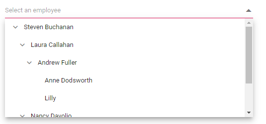

# Popup Setting in Dropdown Tree

## Change the popup width

Customize the width of the popup using the [PopupWidth](https://help.syncfusion.com/cr/blazor/Syncfusion.Blazor.Navigations.SfDropDownTree-2.html#Syncfusion_Blazor_Navigations_SfDropDownTree_2_PopupWidth) property. The default value of the `PopupWidth` is `100%`. If popup width unspecified, it sets based on the width of the Dropdown Tree component.

In the following sample, the `PopupWidth` is set as `300px`.

```cshtml
@using Syncfusion.Blazor.Navigations

<SfDropDownTree TItem="EmployeeData" TValue="string" Placeholder="Select an employee" PopupWidth="400px">
    <DropDownTreeField TItem="EmployeeData" DataSource="Data" ID="Id" Text="Name" HasChildren="HasChild" ParentID="PId"></DropDownTreeField>
</SfDropDownTree>

@code {
    List<EmployeeData> Data = new List<EmployeeData>
    {
        new EmployeeData() { Id = "1", Name = "Steven Buchanan", Job = "General Manager", HasChild = true, Expanded = true },
        new EmployeeData() { Id = "2", PId = "1", Name = "Laura Callahan", Job = "Product Manager", HasChild = true },
        new EmployeeData() { Id = "3", PId = "2", Name = "Andrew Fuller", Job = "Team Lead", HasChild = true },
        new EmployeeData() { Id = "4", PId = "3", Name = "Anne Dodsworth", Job = "Developer" },
        new EmployeeData() { Id = "10", PId = "3", Name = "Lilly", Job = "Developer" },
        new EmployeeData() { Id = "5", PId = "1", Name = "Nancy Davolio", Job = "Product Manager", HasChild = true },
        new EmployeeData() { Id = "6", PId = "5", Name = "Michael Suyama", Job = "Team Lead", HasChild = true },
        new EmployeeData() { Id = "7", PId = "6", Name = "Robert King", Job = "Developer" },
        new EmployeeData() { Id = "11", PId = "6", Name = "Mary", Job = "Developer" },
        new EmployeeData() { Id = "9", PId = "1", Name = "Janet Leverling", Job = "HR"}
    };
    
    class EmployeeData
    {
        public string? Id { get; set; }
        public string? Name { get; set; }
        public string? Job { get; set; }
        public bool HasChild { get; set; }
        public bool Expanded { get; set; }
        public string? PId { get; set; }
    }
}
```


## Change the popup height

Customize the height of the popup using the [PopupHeight](https://help.syncfusion.com/cr/blazor/Syncfusion.Blazor.Navigations.SfDropDownTree-2.html#Syncfusion_Blazor_Navigations_SfDropDownTree_2_PopupHeight). The default value of the `PopupHeight` is `300px`.

```cshtml
@using Syncfusion.Blazor.Navigations

<SfDropDownTree TItem="EmployeeData" TValue="string" Placeholder="Select an employee" Width="500px" PopupHeight="200px">
    <DropDownTreeField TItem="EmployeeData" DataSource="Data" ID="Id" Text="Name" HasChildren="HasChild" ParentID="PId"></DropDownTreeField>
</SfDropDownTree>

@code {
    List<EmployeeData> Data = new List<EmployeeData>
    {
        new EmployeeData() { Id = "1", Name = "Steven Buchanan", Job = "General Manager", HasChild = true, Expanded = true },
        new EmployeeData() { Id = "2", PId = "1", Name = "Laura Callahan", Job = "Product Manager", HasChild = true },
        new EmployeeData() { Id = "3", PId = "2", Name = "Andrew Fuller", Job = "Team Lead", HasChild = true },
        new EmployeeData() { Id = "4", PId = "3", Name = "Anne Dodsworth", Job = "Developer" },
        new EmployeeData() { Id = "10", PId = "3", Name = "Lilly", Job = "Developer" },
        new EmployeeData() { Id = "5", PId = "1", Name = "Nancy Davolio", Job = "Product Manager", HasChild = true },
        new EmployeeData() { Id = "6", PId = "5", Name = "Michael Suyama", Job = "Team Lead", HasChild = true },
        new EmployeeData() { Id = "7", PId = "6", Name = "Robert King", Job = "Developer" },
        new EmployeeData() { Id = "11", PId = "6", Name = "Mary", Job = "Developer" },
        new EmployeeData() { Id = "9", PId = "1", Name = "Janet Leverling", Job = "HR"}
    };
    
    class EmployeeData
    {
        public string? Id { get; set; }
        public string? Name { get; set; }
        public string? Job { get; set; }
        public bool HasChild { get; set; }
        public bool Expanded { get; set; }
        public string? PId { get; set; }
    }
}
```



## Change the popup ZIndex

Customize the [ZIndex](https://help.syncfusion.com/cr/blazor/Syncfusion.Blazor.Navigations.SfDropDownTree-2.html#Syncfusion_Blazor_Navigations_SfDropDownTree_2_ZIndex) value of the component popup element.

Defaults to `1000`

## Popup height based on available space

You can achieve this by binding the `resize` event in window and update the height of the popup based on the window height.

```cshtml
@using Syncfusion.Blazor.Navigations

<SfDropDownTree TItem="EmployeeData" TValue="string" Placeholder="Select an employee" Width="500px" ID="dropdowntree">
    <DropDownTreeField TItem="EmployeeData" DataSource="Data" ID="Id" Text="Name" HasChildren="HasChild" ParentID="PId"></DropDownTreeField>
</SfDropDownTree>

@code {
    List<EmployeeData> Data = new List<EmployeeData>
    {
        new EmployeeData() { Id = "1", Name = "Steven Buchanan", Job = "General Manager", HasChild = true, Expanded = true },
        new EmployeeData() { Id = "2", PId = "1", Name = "Laura Callahan", Job = "Product Manager", HasChild = true },
        new EmployeeData() { Id = "3", PId = "2", Name = "Andrew Fuller", Job = "Team Lead", HasChild = true },
        new EmployeeData() { Id = "4", PId = "3", Name = "Anne Dodsworth", Job = "Developer" },
        new EmployeeData() { Id = "10", PId = "3", Name = "Lilly", Job = "Developer" },
        new EmployeeData() { Id = "5", PId = "1", Name = "Nancy Davolio", Job = "Product Manager", HasChild = true },
        new EmployeeData() { Id = "6", PId = "5", Name = "Michael Suyama", Job = "Team Lead", HasChild = true },
        new EmployeeData() { Id = "7", PId = "6", Name = "Robert King", Job = "Developer" },
        new EmployeeData() { Id = "11", PId = "6", Name = "Mary", Job = "Developer" },
        new EmployeeData() { Id = "9", PId = "1", Name = "Janet Leverling", Job = "HR"}
    };
    
    class EmployeeData
    {
        public string? Id { get; set; }
        public string? Name { get; set; }
        public string? Job { get; set; }
        public bool HasChild { get; set; }
        public bool Expanded { get; set; }
        public string? PId { get; set; }
    }
}
```



<script>
    window.addEventListener("resize", function (e) {
        var wrapper = document.getElementById("dropdowntree").parentElement;
        var popupEle = document.querySelector(".e-ddt.e-popup");
        var popupContent = document.querySelector(".e-ddt .e-popup-content");
        var topVal = wrapper.getBoundingClientRect().top;
        
        if (popupEle && popupContent) {
            popupEle.style.maxHeight = (window.innerHeight - topVal - 50) + "px";
            popupContent.style.maxHeight = (window.innerHeight - topVal - 50) + "px";
        }
    })
</script>




## Programmatically opening and closing popup

You can programmatically open and close the popup by accessing the [`ShowPopupAsync()`](https://help.syncfusion.com/cr/blazor/Syncfusion.Blazor.Navigations.SfDropDownTree-2.html#Syncfusion_Blazor_Navigations_SfDropDownTree_2_ShowPopupAsync) and [`HidePopupAsync()`](https://help.syncfusion.com/cr/blazor/Syncfusion.Blazor.Navigations.SfDropDownTree-2.html#Syncfusion_Blazor_Navigations_SfDropDownTree_2_HidePopupAsync) methods through an instance of the Dropdown Tree. Bind the click event of a button to these methods. When the button is clicked, it will trigger the respective method and open or close the popup.

```cshtml
@using Syncfusion.Blazor.Navigations
@using Syncfusion.Blazor.Buttons

<SfButton OnClick="Open">Open Popup</SfButton>
<SfButton OnClick="Close">Close Popup</SfButton>

<div>
    <SfDropDownTree @ref="sfDropDownTree" TItem="EmployeeData" TValue="string" Placeholder="Select an employee" Width="500px" ID="dropdowntree">
    <DropDownTreeField TItem="EmployeeData" DataSource="Data" ID="Id" Text="Name" HasChildren="HasChild" ParentID="PId"></DropDownTreeField>
</SfDropDownTree>
</div>

@code {
    SfDropDownTree<string, EmployeeData>? sfDropDownTree;
    List<EmployeeData> Data = new List<EmployeeData>
    {
        new EmployeeData() { Id = "1", Name = "Steven Buchanan", Job = "General Manager", HasChild = true, Expanded = true },
        new EmployeeData() { Id = "2", PId = "1", Name = "Laura Callahan", Job = "Product Manager", HasChild = true },
        new EmployeeData() { Id = "3", PId = "2", Name = "Andrew Fuller", Job = "Team Lead", HasChild = true },
        new EmployeeData() { Id = "4", PId = "3", Name = "Anne Dodsworth", Job = "Developer" },
        new EmployeeData() { Id = "10", PId = "3", Name = "Lilly", Job = "Developer" },
        new EmployeeData() { Id = "5", PId = "1", Name = "Nancy Davolio", Job = "Product Manager", HasChild = true },
        new EmployeeData() { Id = "6", PId = "5", Name = "Michael Suyama", Job = "Team Lead", HasChild = true },
        new EmployeeData() { Id = "7", PId = "6", Name = "Robert King", Job = "Developer" },
        new EmployeeData() { Id = "11", PId = "6", Name = "Mary", Job = "Developer" },
        new EmployeeData() { Id = "9", PId = "1", Name = "Janet Leverling", Job = "HR"}
    };

    async Task Open()
    {
       await sfDropDownTree.ShowPopupAsync();
    } 
    async Task Close()
    {
       await sfDropDownTree.HidePopupAsync();
        
    }
    class EmployeeData
    {
        public string? Id { get; set; }
        public string? Name { get; set; }
        public string? Job { get; set; }
        public bool HasChild { get; set; }
        public bool Expanded { get; set; }
        public string? PId { get; set; }
    }
}
```


## Show popup on initial loading

You can achieve this by using [ShowPopupAsync()](https://help.syncfusion.com/cr/blazor/Syncfusion.Blazor.Navigations.SfDropDownTree-2.html#Syncfusion_Blazor_Navigations_SfDropDownTree_2_ShowPopupAsync) in the [Created](https://help.syncfusion.com/cr/blazor/Syncfusion.Blazor.Navigations.SfDropDownTree-2.html#Syncfusion_Blazor_Navigations_SfDropDownTree_2_Created) Event.

```cshtml
@using Syncfusion.Blazor.Navigations

<SfDropDownTree @ref="sfDropDownTree" TItem="EmployeeData" TValue="string" Placeholder="Select an employee" Width="500px" Created="OnCreated">
    <DropDownTreeField TItem="EmployeeData" DataSource="Data" ID="Id" Text="Name" HasChildren="HasChild" ParentID="PId"></DropDownTreeField>
</SfDropDownTree>

@code {
    SfDropDownTree<string, EmployeeData>? sfDropDownTree;
    List<EmployeeData> Data = new List<EmployeeData>
    {
        new EmployeeData() { Id = "1", Name = "Steven Buchanan", Job = "General Manager", HasChild = true, Expanded = true },
        new EmployeeData() { Id = "2", PId = "1", Name = "Laura Callahan", Job = "Product Manager", HasChild = true },
        new EmployeeData() { Id = "3", PId = "2", Name = "Andrew Fuller", Job = "Team Lead", HasChild = true },
        new EmployeeData() { Id = "4", PId = "3", Name = "Anne Dodsworth", Job = "Developer" },
        new EmployeeData() { Id = "10", PId = "3", Name = "Lilly", Job = "Developer" },
        new EmployeeData() { Id = "5", PId = "1", Name = "Nancy Davolio", Job = "Product Manager", HasChild = true },
        new EmployeeData() { Id = "6", PId = "5", Name = "Michael Suyama", Job = "Team Lead", HasChild = true },
        new EmployeeData() { Id = "7", PId = "6", Name = "Robert King", Job = "Developer" },
        new EmployeeData() { Id = "11", PId = "6", Name = "Mary", Job = "Developer" },
        new EmployeeData() { Id = "9", PId = "1", Name = "Janet Leverling", Job = "HR"}
    };

    class EmployeeData
    {
        public string? Id { get; set; }
        public string? Name { get; set; }
        public string? Job { get; set; }
        public bool HasChild { get; set; }
        public bool Expanded { get; set; }
        public string? PId { get; set; }
    }
    async Task OnCreated(){
        await  sfDropDownTree.ShowPopupAsync();
    }
}
```


## Preventing opening and closing

Prevent the popup open and close in the event argument [PopupEventArgs.cancel](https://help.syncfusion.com/cr/blazor/Syncfusion.Blazor.DropDowns.PopupEventArgs.html#Syncfusion_Blazor_DropDowns_PopupEventArgs_Cancel) as `true`. It is achieved by the [OnPopupOpen](https://help.syncfusion.com/cr/blazor/Syncfusion.Blazor.Navigations.SfDropDownTree-2.html#Syncfusion_Blazor_Navigations_SfDropDownTree_2_OnPopupOpen) and [OnPopupClose](https://help.syncfusion.com/cr/blazor/Syncfusion.Blazor.Navigations.SfDropDownTree-2.html#Syncfusion_Blazor_Navigations_SfDropDownTree_2_OnPopupClose) events. 

```cshtml
@using Syncfusion.Blazor.Navigations
@using Syncfusion.Blazor.DropDowns

<SfDropDownTree @ref="sfDropDownTree" TItem="EmployeeData" TValue="string" ID="open" Placeholder="Select an employee" Width="500px" OnPopupOpen="OnOpen">
    <DropDownTreeField TItem="EmployeeData" DataSource="Data" ID="Id" Text="Name" HasChildren="HasChild" ParentID="PId"></DropDownTreeField>
</SfDropDownTree>

<SfDropDownTree @ref="sfDropDownTree" TItem="EmployeeData" TValue="string" ID="Close" Placeholder="Select an employee" Width="500px" OnPopupClose="OnOpen">
    <DropDownTreeField TItem="EmployeeData" DataSource="Data" ID="Id" Text="Name" HasChildren="HasChild" ParentID="PId"></DropDownTreeField>
</SfDropDownTree>

@code {
    SfDropDownTree<string, EmployeeData>? sfDropDownTree;
    List<EmployeeData> Data = new List<EmployeeData>
    {
        new EmployeeData() { Id = "1", Name = "Steven Buchanan", Job = "General Manager", HasChild = true, Expanded = true },
        new EmployeeData() { Id = "2", PId = "1", Name = "Laura Callahan", Job = "Product Manager", HasChild = true },
        new EmployeeData() { Id = "3", PId = "2", Name = "Andrew Fuller", Job = "Team Lead", HasChild = true },
        new EmployeeData() { Id = "4", PId = "3", Name = "Anne Dodsworth", Job = "Developer" },
        new EmployeeData() { Id = "10", PId = "3", Name = "Lilly", Job = "Developer" },
        new EmployeeData() { Id = "5", PId = "1", Name = "Nancy Davolio", Job = "Product Manager", HasChild = true },
        new EmployeeData() { Id = "6", PId = "5", Name = "Michael Suyama", Job = "Team Lead", HasChild = true },
        new EmployeeData() { Id = "7", PId = "6", Name = "Robert King", Job = "Developer" },
        new EmployeeData() { Id = "11", PId = "6", Name = "Mary", Job = "Developer" },
        new EmployeeData() { Id = "9", PId = "1", Name = "Janet Leverling", Job = "HR"}
    };

    class EmployeeData
    {
        public string Id { get; set; }
        public string Name { get; set; }
        public string Job { get; set; }
        public bool HasChild { get; set; }
        public bool Expanded { get; set; }
        public string PId { get; set; }
    }
    void  OnOpen(PopupEventArgs args)
    {
        args.Cancel = true;
    }
}
```

