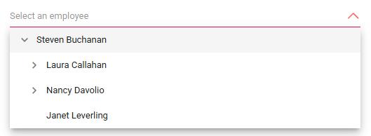
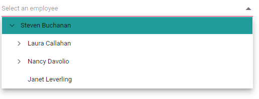
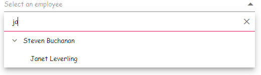
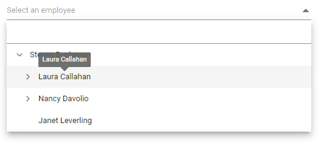
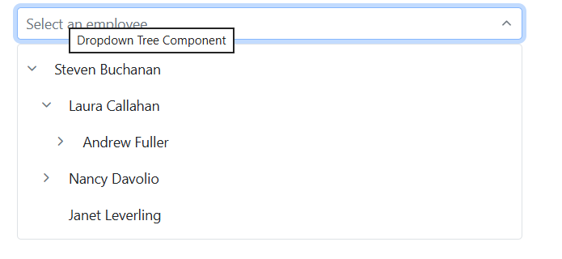
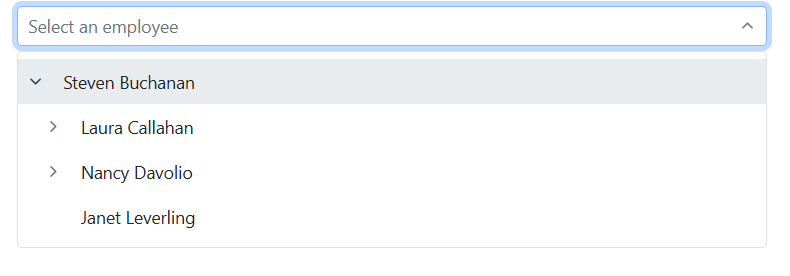
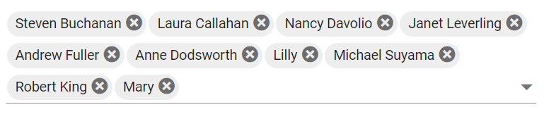

# Style and Appearance in Dropdown Tree Component

The following content provides the exact CSS structure that can be used to modify the component's appearance based on the user preference.

## Disabled State

Specify the boolean value to the [Disabled](https://help.syncfusion.com/cr/blazor/Syncfusion.Blazor.Navigations.SfDropDownTree-2.html#Syncfusion_Blazor_Navigations_SfDropDownTree_2_Disabled) property that indicates whether the component is Disabled or not.

```cshtml
@using Syncfusion.Blazor.Navigations

<SfDropDownTree TItem="EmployeeData" TValue="string" Placeholder="Select an employee" Width="500px" Disabled="true">
    <DropDownTreeField TItem="EmployeeData" DataSource="Data" ID="Id" Text="Name" HasChildren="HasChild" ParentID="PId"></DropDownTreeField>
</SfDropDownTree>

@code {
    List<EmployeeData> Data = new List<EmployeeData>
    {
        new EmployeeData() { Id = "1", Name = "Steven Buchanan", Job = "General Manager", HasChild = true, Expanded = true },
        new EmployeeData() { Id = "2", PId = "1", Name = "Laura Callahan", Job = "Product Manager", HasChild = true },
        new EmployeeData() { Id = "3", PId = "2", Name = "Andrew Fuller", Job = "Team Lead", HasChild = true },
        new EmployeeData() { Id = "4", PId = "3", Name = "Anne Dodsworth", Job = "Developer" },
        new EmployeeData() { Id = "10", PId = "3", Name = "Lilly", Job = "Developer" },
        new EmployeeData() { Id = "5", PId = "1", Name = "Nancy Davolio", Job = "Product Manager", HasChild = true },
        new EmployeeData() { Id = "6", PId = "5", Name = "Michael Suyama", Job = "Team Lead", HasChild = true },
        new EmployeeData() { Id = "7", PId = "6", Name = "Robert King", Job = "Developer" },
        new EmployeeData() { Id = "11", PId = "6", Name = "Mary", Job = "Developer" },
        new EmployeeData() { Id = "9", PId = "1", Name = "Janet Leverling", Job = "HR"}
    };

    class EmployeeData
    {
        public string? Id { get; set; }
        public string? Name { get; set; }
        public string? Job { get; set; }
        public bool HasChild { get; set; }
        public bool Expanded { get; set; }
        public string? PId { get; set; }
    }
}
```



## CssClass

The `CssClass` property appends custom CSS class names to the root element of the Dropdown Tree. This enables targeted styling for specific custom classes.

Syncfusion provides predefined CSS classes for common states:

* `e-success`, which denotes the component in success state that is added green color to the Dropdown Tree's input field.
* `e-warning`, which denotes the component in warning state that is added orange color to the Dropdown Tree's input field.
* `e-error`, which denotes the component in error state that is added red color to the Dropdown Tree's input field.
* `e-outline`, which supports only in material theme.

```cshtml
@using Syncfusion.Blazor.Navigations

<SfDropDownTree TItem="EmployeeData" TValue="string" Placeholder="Select an employee" Width="500px" CssClass="@CssClass">
    <DropDownTreeField TItem="EmployeeData" DataSource="Data" ID="Id" Text="Name" HasChildren="HasChild" ParentID="PId"></DropDownTreeField>
</SfDropDownTree>

@code {
    string CssClass = "e-success";
    List<EmployeeData> Data = new List<EmployeeData>
    {
        new EmployeeData() { Id = "1", Name = "Steven Buchanan", Job = "General Manager", HasChild = true, Expanded = true },
        new EmployeeData() { Id = "2", PId = "1", Name = "Laura Callahan", Job = "Product Manager", HasChild = true },
        new EmployeeData() { Id = "3", PId = "2", Name = "Andrew Fuller", Job = "Team Lead", HasChild = true },
        new EmployeeData() { Id = "4", PId = "3", Name = "Anne Dodsworth", Job = "Developer" },
        new EmployeeData() { Id = "10", PId = "3", Name = "Lilly", Job = "Developer" },
        new EmployeeData() { Id = "5", PId = "1", Name = "Nancy Davolio", Job = "Product Manager", HasChild = true },
        new EmployeeData() { Id = "6", PId = "5", Name = "Michael Suyama", Job = "Team Lead", HasChild = true },
        new EmployeeData() { Id = "7", PId = "6", Name = "Robert King", Job = "Developer" },
        new EmployeeData() { Id = "11", PId = "6", Name = "Mary", Job = "Developer" },
        new EmployeeData() { Id = "9", PId = "1", Name = "Janet Leverling", Job = "HR"}
    };

    class EmployeeData
    {
        public string? Id { get; set; }
        public string? Name { get; set; }
        public string? Job { get; set; }
        public bool HasChild { get; set; }
        public bool Expanded { get; set; }
        public string? PId { get; set; }
    }
}
```



## Customizing the Dropdown Icon

### Global Icon Customization

The default dropdown icon can be changed globally by targeting its CSS class `.e-ddt-icon::before`. Setting the `content` property to a Unicode character from an icon font (like Syncfusion's built-in icon font or Material Icons) replaces the default icon. Refer to the [Syncfusion Icons documentation](https://ej2.syncfusion.com/documentation/appearance/icons/#material) for available icons.

```cshtml
.e-ddt.e-input-group.e-control-wrapper .e-ddt-icon::before {
    content: '\e665';
}
```


### Component-Specific Icon Customization

To apply a custom icon to a particular Dropdown Tree component, use the `CssClass` property to add a unique class name and then define the custom icon style within a `<style>` block.

```cshtml
@using Syncfusion.Blazor.Navigations

<SfDropDownTree TItem="EmployeeData" TValue="string" Placeholder="Select an employee" Width="500px" CssClass="e-custom">
    <DropDownTreeField TItem="EmployeeData" DataSource="Data" ID="Id" Text="Name" HasChildren="HasChild" ParentID="PId"></DropDownTreeField>
</SfDropDownTree>

@code {
    List<EmployeeData> Data = new List<EmployeeData>
    {
        new EmployeeData() { Id = "1", Name = "Steven Buchanan", Job = "General Manager", HasChild = true, Expanded = true },
        new EmployeeData() { Id = "2", PId = "1", Name = "Laura Callahan", Job = "Product Manager", HasChild = true },
        new EmployeeData() { Id = "3", PId = "2", Name = "Andrew Fuller", Job = "Team Lead", HasChild = true },
        new EmployeeData() { Id = "4", PId = "3", Name = "Anne Dodsworth", Job = "Developer" },
        new EmployeeData() { Id = "10", PId = "3", Name = "Lilly", Job = "Developer" },
        new EmployeeData() { Id = "5", PId = "1", Name = "Nancy Davolio", Job = "Product Manager", HasChild = true },
        new EmployeeData() { Id = "6", PId = "5", Name = "Michael Suyama", Job = "Team Lead", HasChild = true },
        new EmployeeData() { Id = "7", PId = "6", Name = "Robert King", Job = "Developer" },
        new EmployeeData() { Id = "11", PId = "6", Name = "Mary", Job = "Developer" },
        new EmployeeData() { Id = "9", PId = "1", Name = "Janet Leverling", Job = "HR"}
    };

    class EmployeeData
    {
        public string? Id { get; set; }
        public string? Name { get; set; }
        public string? Job { get; set; }
        public bool HasChild { get; set; }
        public bool Expanded { get; set; }
        public string? PId { get; set; }
    }
}

<style>
    .e-custom.e-ddt.e-input-group.e-control-wrapper .e-ddt-icon::before {
        content: '\e665';
    }
</style>
```

## Customizing the Dropdown Icon's Color

Customize the dropdown [icon](https://ej2.syncfusion.com/documentation/appearance/icons/#material) by targeting its CSS class `.e-ddl-icon.e-icons`, which indicates the icon element displayed within the Dropdown Tree component, and setting the desired color to the `color` property.

```cshtml
.e-ddt .e-input-group-icon.e-ddt-icon.e-icons, 
.e-ddt .e-input-group-icon.e-ddt-icon.e-icons:hover {
    color: #3566c5;
    font-size: 13px;
}
```


## Replacing the Dropdown Icon with an SVG

To replace the default dropdown icon in the Dropdown Tree component with an SVG, use the [CssClass](https://help.syncfusion.com/cr/blazor/Syncfusion.Blazor.Navigations.SfDropDownTree-2.html#Syncfusion_Blazor_Navigations_SfDropDownTree_2_CssClass) property to assign a unique class name and then apply custom styles to the `.e-custom .e-ddt-icon::before` selector. Set the `content` property to `url()` that points to the SVG file.

```cshtml
@using Syncfusion.Blazor.Navigations
<SfDropDownTree TItem="EmployeeData" TValue="string" Placeholder="Select an employee" Width="500px" CssClass="e-custom">
    <DropDownTreeField TItem="EmployeeData" DataSource="Data" ID="Id" Text="Name" HasChildren="HasChild" ParentID="PId"></DropDownTreeField>
</SfDropDownTree>
@code {
    List<EmployeeData> Data = new List<EmployeeData>
    {
        new EmployeeData() { Id = "1", Name = "Steven Buchanan", Job = "General Manager", HasChild = true, Expanded = true },
        new EmployeeData() { Id = "2", PId = "1", Name = "Laura Callahan", Job = "Product Manager", HasChild = true },
        new EmployeeData() { Id = "3", PId = "2", Name = "Andrew Fuller", Job = "Team Lead", HasChild = true },
        new EmployeeData() { Id = "4", PId = "3", Name = "Anne Dodsworth", Job = "Developer" },
        new EmployeeData() { Id = "10", PId = "3", Name = "Lilly", Job = "Developer" },
        new EmployeeData() { Id = "5", PId = "1", Name = "Nancy Davolio", Job = "Product Manager", HasChild = true },
        new EmployeeData() { Id = "6", PId = "5", Name = "Michael Suyama", Job = "Team Lead", HasChild = true },
        new EmployeeData() { Id = "7", PId = "6", Name = "Robert King", Job = "Developer" },
        new EmployeeData() { Id = "11", PId = "6", Name = "Mary", Job = "Developer" },
        new EmployeeData() { Id = "9", PId = "1", Name = "Janet Leverling", Job = "HR"}
    };

    class EmployeeData
    {
        public string? Id { get; set; }
        public string? Name { get; set; }
        public string? Job { get; set; }
        public bool HasChild { get; set; }
        public bool Expanded { get; set; }
        public string? PId { get; set; }
    }
}
<style>
.e-custom .e-ddt-icon::before {
    content: url("/icons/chevron_down.svg");
}
</style>
```



## Customizing the appearance of container element

The appearance of the input element within the Dropdown Tree component can be customized by targeting its CSS class `.e-input.` This class applies to the input field, allowing for the application of desired styles to the component's input.

```cshtml
.e-ddt.e-input-group.e-control-wrapper .e-input {
    font-size: 18px;
    font-family: emoji;
    color: #000000;
    background: #29c2b8;
}
```


## Customizing the Focus Color

To customize the component color when focused, target its CSS class `.e-input-focus::after`, which indicates the focused input element, and set the desired background property.

```cshtml
.e-ddt.e-input-group.e-control-wrapper.e-input-focus::before, .e-ddt.e-input-group.e-control-wrapper.e-input-focus::after {
    background: #0cb3d9;
}
```


## Customizing the Outline Theme's Focus Color

Customize the color of the Dropdown Tree component when in a focused state and rendered with an outline theme by targeting its CSS class `e-outline`. This class indicates the input element when focused, allowing the desired color to be set to the `color` property.

```cshtml
@using Syncfusion.Blazor.Navigations

<SfDropDownTree TItem="EmployeeData" TValue="string" Placeholder="Select an employee" Width="500px" CssClass="e-outline">
    <DropDownTreeField TItem="EmployeeData" DataSource="Data" ID="Id" Text="Name" HasChildren="HasChild" ParentID="PId"></DropDownTreeField>
</SfDropDownTree>

@code {
    List<EmployeeData> Data = new List<EmployeeData>
    {
        new EmployeeData() { Id = "1", Name = "Steven Buchanan", Job = "General Manager", HasChild = true, Expanded = true },
        new EmployeeData() { Id = "2", PId = "1", Name = "Laura Callahan", Job = "Product Manager", HasChild = true },
        new EmployeeData() { Id = "3", PId = "2", Name = "Andrew Fuller", Job = "Team Lead", HasChild = true },
        new EmployeeData() { Id = "4", PId = "3", Name = "Anne Dodsworth", Job = "Developer" },
        new EmployeeData() { Id = "10", PId = "3", Name = "Lilly", Job = "Developer" },
        new EmployeeData() { Id = "5", PId = "1", Name = "Nancy Davolio", Job = "Product Manager", HasChild = true },
        new EmployeeData() { Id = "6", PId = "5", Name = "Michael Suyama", Job = "Team Lead", HasChild = true },
        new EmployeeData() { Id = "7", PId = "6", Name = "Robert King", Job = "Developer" },
        new EmployeeData() { Id = "11", PId = "6", Name = "Mary", Job = "Developer" },
        new EmployeeData() { Id = "9", PId = "1", Name = "Janet Leverling", Job = "HR"}
    };

    class EmployeeData
    {
        public string? Id { get; set; }
        public string? Name { get; set; }
        public string? Job { get; set; }
        public bool HasChild { get; set; }
        public bool Expanded { get; set; }
        public string? PId { get; set; }
    }
}

<style>
    .e-outline.e-input-group.e-input-focus:hover:not(.e-success):not(.e-warning):not(.e-error):not(.e-disabled):not(.e-float-icon-left), 
    .e-outline.e-input-group.e-input-focus.e-control-wrapper:hover:not(.e-success):not(.e-warning):not(.e-error):not(.e-disabled):not(.e-float-icon-left), 
    .e-outline.e-input-group.e-input-focus:not(.e-success):not(.e-warning):not(.e-error):not(.e-disabled),
    .e-outline.e-input-group.e-control-wrapper.e-input-focus:not(.e-success):not(.e-warning):not(.e-error):not(.e-disabled) {
        border-color: #b1bd15;
        box-shadow: inset 1px 1px #b1bd15, inset -1px 0 #b1bd15, inset 0 -1px #b1bd15;
    }
</style>
```


## Customizing the Background Color of Focused, Hovered, and Active Items

Modify the background and text color of list items within the Dropdown Tree's popup when they are in a focused, active, or hovered state. Target the specific CSS classes `.e-ddt .e-treeview .e-list-item.e-active > .e-fullrow`, `.e-ddt .e-treeview .e-list-item.e-hover > .e-fullrow`, and `.e-ddt .e-treeview .e-list-item.e-node-focus > .e-fullrow` to apply custom styles.

```cshtml
.e-ddt .e-treeview .e-list-item.e-active > .e-fullrow,
.e-ddt .e-treeview .e-list-item.e-hover > .e-fullrow,
.e-ddt .e-treeview .e-list-item.e-node-focus > .e-fullrow {
    background: #29c2b8;
}
```



## Customizing the Appearance of the Popup Element

Customize  the appearance of the popup element within the Dropdown Tree component by targeting the CSS class `.e-ddt.e-popup`.

```cshtml
 .e-ddt.e-popup {
     background-color: #29c2b8;
     border-radius: 15px;
 }
```


## Changing HTML Attributes

The [HtmlAttributes](https://help.syncfusion.com/cr/blazor/Syncfusion.Blazor.Navigations.SfDropDownTree-2.html#Syncfusion_Blazor_Navigations_SfDropDownTree_2_HtmlAttributes) propertyprovides a mechanism to apply additional HTML attributes, such as `class, style, title,` and others, to the root element of the Dropdown Tree component. This property accepts attributes in a dictionary format, consisting of key-value pairs.

```cshtml
@using Syncfusion.Blazor.Navigations

<SfDropDownTree TItem="EmployeeData" TValue="string" Placeholder="Select an employee" Width="500px" HtmlAttributes="@htmlAttribute">
    <DropDownTreeField TItem="EmployeeData" DataSource="Data" ID="Id" Text="Name" HasChildren="HasChild" ParentID="PId"></DropDownTreeField>
</SfDropDownTree>

@code {
    List<EmployeeData> Data = new List<EmployeeData>
    {
        new EmployeeData() { Id = "1", Name = "Steven Buchanan", Job = "General Manager", HasChild = true, Expanded = true },
        new EmployeeData() { Id = "2", PId = "1", Name = "Laura Callahan", Job = "Product Manager", HasChild = true },
        new EmployeeData() { Id = "3", PId = "2", Name = "Andrew Fuller", Job = "Team Lead", HasChild = true },
        new EmployeeData() { Id = "4", PId = "3", Name = "Anne Dodsworth", Job = "Developer" },
        new EmployeeData() { Id = "10", PId = "3", Name = "Lilly", Job = "Developer" },
        new EmployeeData() { Id = "5", PId = "1", Name = "Nancy Davolio", Job = "Product Manager", HasChild = true },
        new EmployeeData() { Id = "6", PId = "5", Name = "Michael Suyama", Job = "Team Lead", HasChild = true },
        new EmployeeData() { Id = "7", PId = "6", Name = "Robert King", Job = "Developer" },
        new EmployeeData() { Id = "11", PId = "6", Name = "Mary", Job = "Developer" },
        new EmployeeData() { Id = "9", PId = "1", Name = "Janet Leverling", Job = "HR"}
    };
     Dictionary<string, object> htmlAttribute = new Dictionary<string, object>()
    {
        {"class", "e-employee" },
        {"style", "background-color: #0bebd6; text-align: right" },
        {"title", "Syncfusion DropDownTree" }
    };
    
    class EmployeeData
    {
        public string? Id { get; set; }
        public string? Name { get; set; }
        public string? Job { get; set; }
        public bool HasChild { get; set; }
        public bool Expanded { get; set; }
        public string? PId { get; set; }
    }
}
```


## Setting Various Font Families for Dropdown Tree Elements

The font-family of the Dropdown tree can be changed by overriding using the following selector. The overridden can be applied to specific component by adding a class name through the [CssClass](https://help.syncfusion.com/cr/blazor/Syncfusion.Blazor.Navigations.SfDropDownTree-2.html#Syncfusion_Blazor_Navigations_SfDropDownTree_2_CssClass) property.

The following sample demonstrates changing the font family for the Dropdown Tree's input text, list item text, and filter input text.

```cshtml
@using Syncfusion.Blazor.Navigations

<SfDropDownTree TItem="EmployeeData" TValue="string" Placeholder="Select an employee" Width="500px"  AllowFiltering CssClass="e-custom">
    <DropDownTreeField TItem="EmployeeData" DataSource="Data" ID="Id" Text="Name" HasChildren="HasChild" ParentID="PId"></DropDownTreeField>
</SfDropDownTree>

@code {
    List<EmployeeData> Data = new List<EmployeeData>
    {
        new EmployeeData() { Id = "1", Name = "Steven Buchanan", Job = "General Manager", HasChild = true, Expanded = true },
        new EmployeeData() { Id = "2", PId = "1", Name = "Laura Callahan", Job = "Product Manager", HasChild = true },
        new EmployeeData() { Id = "3", PId = "2", Name = "Andrew Fuller", Job = "Team Lead", HasChild = true },
        new EmployeeData() { Id = "4", PId = "3", Name = "Anne Dodsworth", Job = "Developer" },
        new EmployeeData() { Id = "10", PId = "3", Name = "Lilly", Job = "Developer" },
        new EmployeeData() { Id = "5", PId = "1", Name = "Nancy Davolio", Job = "Product Manager", HasChild = true },
        new EmployeeData() { Id = "6", PId = "5", Name = "Michael Suyama", Job = "Team Lead", HasChild = true },
        new EmployeeData() { Id = "7", PId = "6", Name = "Robert King", Job = "Developer" },
        new EmployeeData() { Id = "11", PId = "6", Name = "Mary", Job = "Developer" },
        new EmployeeData() { Id = "9", PId = "1", Name = "Janet Leverling", Job = "HR"}
    };
    
    class EmployeeData
    {
        public string? Id { get; set; }
        public string? Name { get; set; }
        public string? Job { get; set; }
        public bool HasChild { get; set; }
        public bool Expanded { get; set; }
        public string? PId { get; set; }
    }
}

<style>
    /* Text in DropDownTree */
    .e-custom.e-input-group input.e-dropdowntree {
        font-family: cursive;
    }
    
    /* Item Text in DropDownTree */
    .e-custom.e-popup,
    .e-custom .e-treeview {
        font-family: cursive;
    }
    
    /* Dropdown Tree filterInput font-family */
    .e-custom span.e-input-group.e-control-container.e-control-wrapper {
        font-family: cursive;
    }
</style>
```



## Displaying Tooltips on List Items

Integrate the Syncfusion Tooltip component to display information when a user hovers over individual list items in the Dropdown Tree. This enhances the user experience by providing contextual details.


The following code demonstrates how to display a tooltip when hovering over a Dropdown Tree option using `ItemTemplate` and `SfTooltip`.

```cshtml
@using Syncfusion.Blazor.Navigations
@using Syncfusion.Blazor.Popups
@using Syncfusion.Blazor.DropDowns

<SfTooltip @ref="TooltipObj" ID="Tooltip" Target=".e-list-item .name[title]">
</SfTooltip>

<SfDropDownTree TItem="EmployeeData" TValue="string" Placeholder="Select an employee" Width="500px"  AllowFiltering CssClass="e-custom" OnPopupOpen="OnOpen" OnPopupClose="OnClose">
    <ChildContent>
        <DropDownTreeField TItem="EmployeeData" DataSource="Data" ID="Id" Text="Name" HasChildren="HasChild" ParentID="PId"></DropDownTreeField>
    </ChildContent>
    <ItemTemplate>
        <span class="name" title="@((context as EmployeeData).Name)">@((context as EmployeeData).Name) </span>
    </ItemTemplate>
</SfDropDownTree>

@code {
    SfTooltip? TooltipObj;
    public bool isOpen { get; set; } = false;
    List<EmployeeData> Data = new List<EmployeeData>
    {
        new EmployeeData() { Id = "1", Name = "Steven Buchanan", Job = "General Manager", HasChild = true, Expanded = true },
        new EmployeeData() { Id = "2", PId = "1", Name = "Laura Callahan", Job = "Product Manager", HasChild = true },
        new EmployeeData() { Id = "3", PId = "2", Name = "Andrew Fuller", Job = "Team Lead", HasChild = true },
        new EmployeeData() { Id = "4", PId = "3", Name = "Anne Dodsworth", Job = "Developer" },
        new EmployeeData() { Id = "10", PId = "3", Name = "Lilly", Job = "Developer" },
        new EmployeeData() { Id = "5", PId = "1", Name = "Nancy Davolio", Job = "Product Manager", HasChild = true },
        new EmployeeData() { Id = "6", PId = "5", Name = "Michael Suyama", Job = "Team Lead", HasChild = true },
        new EmployeeData() { Id = "7", PId = "6", Name = "Robert King", Job = "Developer" },
        new EmployeeData() { Id = "11", PId = "6", Name = "Mary", Job = "Developer" },
        new EmployeeData() { Id = "9", PId = "1", Name = "Janet Leverling", Job = "HR"}
    };

    public void OnOpen(PopupEventArgs args)
    {
        isOpen = true;
    }

    public void OnClose(PopupEventArgs args)
    {
        if (TooltipObj != null)
        {
            TooltipObj.CloseAsync();
        }
    }
    
    protected override async Task OnAfterRenderAsync(bool firstRender)
    {
        if (firstRender && isOpen && TooltipObj != null)
        {
            await TooltipObj.RefreshAsync();
        }
    }
    
    class EmployeeData
    {
        public string? Id { get; set; }
        public string? Name { get; set; }
        public string? Job { get; set; }
        public bool HasChild { get; set; }
        public bool Expanded { get; set; }
        public string? PId { get; set; }
    }
}
```



### Tooltip using HtmlAttributes in Dropdown Tree Component

To display the tooltip in the Dropdown Tree component, add the `Title` attribute through the [HTMLAttributes](https://help.syncfusion.com/cr/blazor/Syncfusion.Blazor.Navigations.SfDropDownTree-2.html#Syncfusion_Blazor_Navigations_SfDropDownTree_2_HtmlAttributes) property.

In the following example, the `HtmlAttributes` property is used to add the title attribute to the root input element of the Dropdown Tree with the value `Dropdown Tree Component`. This will display a tooltip with the text `Dropdown Tree Component` when the user hovers over the input element.

```cshtml
@using Syncfusion.Blazor.Navigations

<SfDropDownTree TItem="EmployeeData" TValue="string" Placeholder="Select an employee" Width="500px"  HtmlAttributes="htmlAttribute">
    <DropDownTreeField TItem="EmployeeData" DataSource="Data" ID="Id" Text="Name" HasChildren="HasChild" ParentID="PId"></DropDownTreeField>
</SfDropDownTree>

@code {
    private Dictionary<string, object> htmlAttribute = new Dictionary<string, object>()
    {
        {"title", "Dropdown Tree Component" }
    };

    List<EmployeeData> Data = new List<EmployeeData>
    {
        new EmployeeData() { Id = "1", Name = "Steven Buchanan", Job = "General Manager", HasChild = true, Expanded = true },
        new EmployeeData() { Id = "2", PId = "1", Name = "Laura Callahan", Job = "Product Manager", HasChild = true },
        new EmployeeData() { Id = "3", PId = "2", Name = "Andrew Fuller", Job = "Team Lead", HasChild = true },
        new EmployeeData() { Id = "4", PId = "3", Name = "Anne Dodsworth", Job = "Developer" },
        new EmployeeData() { Id = "10", PId = "3", Name = "Lilly", Job = "Developer" },
        new EmployeeData() { Id = "5", PId = "1", Name = "Nancy Davolio", Job = "Product Manager", HasChild = true },
        new EmployeeData() { Id = "6", PId = "5", Name = "Michael Suyama", Job = "Team Lead", HasChild = true },
        new EmployeeData() { Id = "7", PId = "6", Name = "Robert King", Job = "Developer" },
        new EmployeeData() { Id = "11", PId = "6", Name = "Mary", Job = "Developer" },
        new EmployeeData() { Id = "9", PId = "1", Name = "Janet Leverling", Job = "HR"}
    };
    
    class EmployeeData
    {
        public string? Id { get; set; }
        public string? Name { get; set; }
        public string? Job { get; set; }
        public bool HasChild { get; set; }
        public bool Expanded { get; set; }
        public string? PId { get; set; }
    }
}
```



## Customizing the Width of the Component

Adjust the overall width of the Dropdown Tree component using the [Width](https://help.syncfusion.com/cr/blazor/Syncfusion.Blazor.Navigations.SfDropDownTree-2.html#Syncfusion_Blazor_Navigations_SfDropDownTree_2_Width) property. The default value for this property is `100%`, which makes the component take up the full width of its parent container.

```cshtml
@using Syncfusion.Blazor.Navigations

<SfDropDownTree TItem="EmployeeData" TValue="string" Placeholder="Select an employee" Width="600px">
    <DropDownTreeField TItem="EmployeeData" DataSource="Data" ID="Id" Text="Name" HasChildren="HasChild" ParentID="PId"></DropDownTreeField>
</SfDropDownTree>

@code {
    List<EmployeeData> Data = new List<EmployeeData>
    {
        new EmployeeData() { Id = "1", Name = "Steven Buchanan", Job = "General Manager", HasChild = true, Expanded = true },
        new EmployeeData() { Id = "2", PId = "1", Name = "Laura Callahan", Job = "Product Manager", HasChild = true },
        new EmployeeData() { Id = "3", PId = "2", Name = "Andrew Fuller", Job = "Team Lead", HasChild = true },
        new EmployeeData() { Id = "4", PId = "3", Name = "Anne Dodsworth", Job = "Developer" },
        new EmployeeData() { Id = "10", PId = "3", Name = "Lilly", Job = "Developer" },
        new EmployeeData() { Id = "5", PId = "1", Name = "Nancy Davolio", Job = "Product Manager", HasChild = true },
        new EmployeeData() { Id = "6", PId = "5", Name = "Michael Suyama", Job = "Team Lead", HasChild = true },
        new EmployeeData() { Id = "7", PId = "6", Name = "Robert King", Job = "Developer" },
        new EmployeeData() { Id = "11", PId = "6", Name = "Mary", Job = "Developer" },
        new EmployeeData() { Id = "9", PId = "1", Name = "Janet Leverling", Job = "HR"}
    };
    
    class EmployeeData
    {
        public string? Id { get; set; }
        public string? Name { get; set; }
        public string? Job { get; set; }
        public bool HasChild { get; set; }
        public bool Expanded { get; set; }
        public string? PId { get; set; }
    }
}
```



## Text Wrapping for Selected Items

Set the [TextWrap](https://help.syncfusion.com/cr/blazor/Syncfusion.Blazor.Navigations.SfDropDownTree-2.html#Syncfusion_Blazor_Navigations_SfDropDownTree_2_TextWrap) property to `true` to enable text wrapping for selected items within the Dropdown Tree's input field. This ensures that long text content for selected items displays across multiple lines if it exceeds the input's width.

In the following example, by enabling the `TextWrap` the selected items will appear on multiple lines within the input. 

```cshtml

@using Syncfusion.Blazor.Navigations

<SfDropDownTree TItem="EmployeeData" TValue="string" Placeholder="Select an employee" Width="500px" ShowCheckBox="true" TextWrap="true">
    <DropDownTreeField TItem="EmployeeData" DataSource="Data" ID="Id" Text="Name" HasChildren="HasChild" ParentID="PId" Selected="Selected" IsChecked="IsChecked"></DropDownTreeField>

</SfDropDownTree>

@code {
    List<EmployeeData> Data = new List<EmployeeData>
    {
        new EmployeeData() { Id = "1", Name = "Steven Buchanan", Job = "General Manager", HasChild = true, Expanded = true},
        new EmployeeData() { Id = "2", PId = "1", Name = "Laura Callahan", Job = "Product Manager", HasChild = true },
        new EmployeeData() { Id = "3", PId = "2", Name = "Andrew Fuller", Job = "Team Lead", HasChild = true },
        new EmployeeData() { Id = "4", PId = "3", Name = "Anne Dodsworth", Job = "Developer" },
        new EmployeeData() { Id = "10", PId = "3", Name = "Lilly", Job = "Developer" },
        new EmployeeData() { Id = "5", PId = "1", Name = "Nancy Davolio", Job = "Product Manager", HasChild = true },
        new EmployeeData() { Id = "6", PId = "5", Name = "Michael Suyama", Job = "Team Lead", HasChild = true },
        new EmployeeData() { Id = "7", PId = "6", Name = "Robert King", Job = "Developer" },
        new EmployeeData() { Id = "11", PId = "6", Name = "Mary", Job = "Developer" },
        new EmployeeData() { Id = "9", PId = "1", Name = "Janet Leverling", Job = "HR"}
    };
    
    class EmployeeData
    {
        public string? Id { get; set; }
        public string? Name { get; set; }
        public string? Job { get; set; }
        public bool HasChild { get; set; }
        public bool Expanded { get; set; }
        public bool Selected { get; set; }
        public bool IsChecked { get; set; }
        public string? PId { get; set; }
    }
}
```



