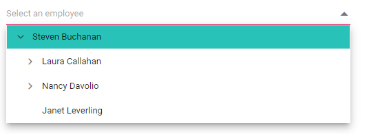

# Style and Appearance in Dropdown Tree

The following content provides the exact CSS structure that can be used to modify the control's appearance based on the user preference.

## Disabled state

Specify the boolean value to the `Disabled` property that indicates whether the component is Disabled or not.

```cshtml
@using Syncfusion.Blazor.Navigations

<SfDropDownTree TItem="EmployeeData" TValue="string" Placeholder="Select an employee" Width="500px" Disabled="true">
    <DropDownTreeField TItem="EmployeeData" DataSource="Data" ID="Id" Text="Name" HasChildren="HasChild" ParentID="PId"></DropDownTreeField>
</SfDropDownTree>

@code {
    List<EmployeeData> Data = new List<EmployeeData>
    {
        new EmployeeData() { Id = "1", Name = "Steven Buchanan", Job = "General Manager", HasChild = true, Expanded = true },
        new EmployeeData() { Id = "2", PId = "1", Name = "Laura Callahan", Job = "Product Manager", HasChild = true },
        new EmployeeData() { Id = "3", PId = "2", Name = "Andrew Fuller", Job = "Team Lead", HasChild = true },
        new EmployeeData() { Id = "4", PId = "3", Name = "Anne Dodsworth", Job = "Developer" },
        new EmployeeData() { Id = "10", PId = "3", Name = "Lilly", Job = "Developer" },
        new EmployeeData() { Id = "5", PId = "1", Name = "Nancy Davolio", Job = "Product Manager", HasChild = true },
        new EmployeeData() { Id = "6", PId = "5", Name = "Michael Suyama", Job = "Team Lead", HasChild = true },
        new EmployeeData() { Id = "7", PId = "6", Name = "Robert King", Job = "Developer" },
        new EmployeeData() { Id = "11", PId = "6", Name = "Mary", Job = "Developer" },
        new EmployeeData() { Id = "9", PId = "1", Name = "Janet Leverling", Job = "HR"}
    };

    class EmployeeData
    {
        public string Id { get; set; }
        public string Name { get; set; }
        public string Job { get; set; }
        public bool HasChild { get; set; }
        public bool Expanded { get; set; }
        public string PId { get; set; }
    }
}
```


## CssClass  

Specifies the CSS class name that can be appended with the root element of the Dropdown Tree. One or more custom CSS classes can be added to a Dropdown Tree.

Some of the possible values are

* `e-success`, which denotes the component in success state that is added green color to the Dropdown Tree's input field.
* `e-warning`, which denotes the component in warning state that is added orange color to the Dropdown Tree's input field.
* `e-error`, which denotes the component in error state that is added red color to the Dropdown Tree's input field.
* `e-outline`, which supports only in material theme.

```cshtml
@using Syncfusion.Blazor.Navigations

<SfDropDownTree TItem="EmployeeData" TValue="string" Placeholder="Select an employee" Width="500px" CssClass="@CssClass">
    <DropDownTreeField TItem="EmployeeData" DataSource="Data" ID="Id" Text="Name" HasChildren="HasChild" ParentID="PId"></DropDownTreeField>
</SfDropDownTree>

@code {
    string CssClass = "e-success";
    List<EmployeeData> Data = new List<EmployeeData>
    {
        new EmployeeData() { Id = "1", Name = "Steven Buchanan", Job = "General Manager", HasChild = true, Expanded = true },
        new EmployeeData() { Id = "2", PId = "1", Name = "Laura Callahan", Job = "Product Manager", HasChild = true },
        new EmployeeData() { Id = "3", PId = "2", Name = "Andrew Fuller", Job = "Team Lead", HasChild = true },
        new EmployeeData() { Id = "4", PId = "3", Name = "Anne Dodsworth", Job = "Developer" },
        new EmployeeData() { Id = "10", PId = "3", Name = "Lilly", Job = "Developer" },
        new EmployeeData() { Id = "5", PId = "1", Name = "Nancy Davolio", Job = "Product Manager", HasChild = true },
        new EmployeeData() { Id = "6", PId = "5", Name = "Michael Suyama", Job = "Team Lead", HasChild = true },
        new EmployeeData() { Id = "7", PId = "6", Name = "Robert King", Job = "Developer" },
        new EmployeeData() { Id = "11", PId = "6", Name = "Mary", Job = "Developer" },
        new EmployeeData() { Id = "9", PId = "1", Name = "Janet Leverling", Job = "HR"}
    };

    class EmployeeData
    {
        public string Id { get; set; }
        public string Name { get; set; }
        public string Job { get; set; }
        public bool HasChild { get; set; }
        public bool Expanded { get; set; }
        public string PId { get; set; }
    }
}
```


## Show the custom icon in dropdown icon

You can customize the dropdown [icon](https://ej2.syncfusion.com/documentation/appearance/icons/#material) by targeting its CSS class `.e-ddt-icon::before`, which indicates the icon element displayed within the Dropdown Tree component, and set the desired icon to the `content` property.

```cshtml
.e-ddt.e-input-group.e-control-wrapper .e-ddt-icon::before {
    content: '\e665';
}
```


You can customize the dropdown icon for the particular component using the `CssClass` property and add style to the custom class which is mapped to `CssClass`.

```cshtml
@using Syncfusion.Blazor.Navigations

<SfDropDownTree TItem="EmployeeData" TValue="string" Placeholder="Select an employee" Width="500px" CssClass="e-custom">
    <DropDownTreeField TItem="EmployeeData" DataSource="Data" ID="Id" Text="Name" HasChildren="HasChild" ParentID="PId"></DropDownTreeField>
</SfDropDownTree>

@code {
    List<EmployeeData> Data = new List<EmployeeData>
    {
        new EmployeeData() { Id = "1", Name = "Steven Buchanan", Job = "General Manager", HasChild = true, Expanded = true },
        new EmployeeData() { Id = "2", PId = "1", Name = "Laura Callahan", Job = "Product Manager", HasChild = true },
        new EmployeeData() { Id = "3", PId = "2", Name = "Andrew Fuller", Job = "Team Lead", HasChild = true },
        new EmployeeData() { Id = "4", PId = "3", Name = "Anne Dodsworth", Job = "Developer" },
        new EmployeeData() { Id = "10", PId = "3", Name = "Lilly", Job = "Developer" },
        new EmployeeData() { Id = "5", PId = "1", Name = "Nancy Davolio", Job = "Product Manager", HasChild = true },
        new EmployeeData() { Id = "6", PId = "5", Name = "Michael Suyama", Job = "Team Lead", HasChild = true },
        new EmployeeData() { Id = "7", PId = "6", Name = "Robert King", Job = "Developer" },
        new EmployeeData() { Id = "11", PId = "6", Name = "Mary", Job = "Developer" },
        new EmployeeData() { Id = "9", PId = "1", Name = "Janet Leverling", Job = "HR"}
    };

    class EmployeeData
    {
        public string Id { get; set; }
        public string Name { get; set; }
        public string Job { get; set; }
        public bool HasChild { get; set; }
        public bool Expanded { get; set; }
        public string PId { get; set; }
    }
}

<style>
    .e-custom.e-ddt.e-input-group.e-control-wrapper .e-ddt-icon::before {
        content: '\e665';
    }
</style>
```

## Customizing the appearance of container element

You can customize the appearance of the container element within the Dropdown Tree component by targeting its CSS class `.e-input`, which indicates the parent element of the input, and allows you to apply any desired styles to the component.

```cshtml
.e-ddt.e-input-group.e-control-wrapper .e-input {
    font-size: 18px;
    font-family: emoji;
    color: #000000;
    background: #539a9d;
}
```


## Customizing the dropdown icon’s color

You can customize the dropdown [icon](https://ej2.syncfusion.com/documentation/appearance/icons/#material) by targeting its CSS class `.e-ddl-icon.e-icons`, which indicates the icon element displayed within the Dropdown Tree component, and setting the desired color to the `color` property.

```cshtml
.e-ddt .e-input-group-icon.e-ddt-icon.e-icons, 
.e-ddt .e-input-group-icon.e-ddt-icon.e-icons:hover {
    color: #3566c5;
    font-size: 13px;
}
```


## Customizing the focus color

You can customize the component color when it is focused by targeting its CSS class `.e-input-focus::after`, which indicates the input element when it is focused, and set the desired color to the `background` property.

```cshtml
.e-ddt.e-input-group.e-control-wrapper.e-input-focus::before, .e-ddt.e-input-group.e-control-wrapper.e-input-focus::after {
    background: #0cb3d9;
}
```


## Customizing the outline theme's focus color

You can customize the color of the Dropdown Tree component when it is in a focused state and rendered with an outline theme,  by targeting its CSS class `e-outline` which indicates the input element when it is focused, and allows you to set the desired color to the `color` property.

```cshtml
@using Syncfusion.Blazor.Navigations

<SfDropDownTree TItem="EmployeeData" TValue="string" Placeholder="Select an employee" Width="500px" CssClass="e-outline">
    <DropDownTreeField TItem="EmployeeData" DataSource="Data" ID="Id" Text="Name" HasChildren="HasChild" ParentID="PId"></DropDownTreeField>
</SfDropDownTree>

@code {
    List<EmployeeData> Data = new List<EmployeeData>
    {
        new EmployeeData() { Id = "1", Name = "Steven Buchanan", Job = "General Manager", HasChild = true, Expanded = true },
        new EmployeeData() { Id = "2", PId = "1", Name = "Laura Callahan", Job = "Product Manager", HasChild = true },
        new EmployeeData() { Id = "3", PId = "2", Name = "Andrew Fuller", Job = "Team Lead", HasChild = true },
        new EmployeeData() { Id = "4", PId = "3", Name = "Anne Dodsworth", Job = "Developer" },
        new EmployeeData() { Id = "10", PId = "3", Name = "Lilly", Job = "Developer" },
        new EmployeeData() { Id = "5", PId = "1", Name = "Nancy Davolio", Job = "Product Manager", HasChild = true },
        new EmployeeData() { Id = "6", PId = "5", Name = "Michael Suyama", Job = "Team Lead", HasChild = true },
        new EmployeeData() { Id = "7", PId = "6", Name = "Robert King", Job = "Developer" },
        new EmployeeData() { Id = "11", PId = "6", Name = "Mary", Job = "Developer" },
        new EmployeeData() { Id = "9", PId = "1", Name = "Janet Leverling", Job = "HR"}
    };

    class EmployeeData
    {
        public string Id { get; set; }
        public string Name { get; set; }
        public string Job { get; set; }
        public bool HasChild { get; set; }
        public bool Expanded { get; set; }
        public string PId { get; set; }
    }
}

<style>
    .e-outline.e-input-group.e-input-focus:hover:not(.e-success):not(.e-warning):not(.e-error):not(.e-disabled):not(.e-float-icon-left), 
    .e-outline.e-input-group.e-input-focus.e-control-wrapper:hover:not(.e-success):not(.e-warning):not(.e-error):not(.e-disabled):not(.e-float-icon-left), 
    .e-outline.e-input-group.e-input-focus:not(.e-success):not(.e-warning):not(.e-error):not(.e-disabled),
    .e-outline.e-input-group.e-control-wrapper.e-input-focus:not(.e-success):not(.e-warning):not(.e-error):not(.e-disabled) {
        border-color: #b1bd15;
        box-shadow: inset 1px 1px #b1bd15, inset -1px 0 #b1bd15, inset 0 -1px #b1bd15;
    }
</style>
```


## Customizing the background color of focus, hover, and active items

You can customize the background color and text color of list items within the Dropdown Tree component when they are in a focused, active, or hovered state by targeting the CSS classes `.e-ddt .e-treeview .e-list-item.e-active > .e-fullrow`, `.e-ddt .e-treeview .e-list-item.e-hover > .e-fullrow`, and `.e-ddt .e-treeview .e-list-item.e-node-focus > .e-fullrow`, and set the desired color to the background-color and color properties.

```cshtml
.e-ddt .e-treeview .e-list-item.e-active > .e-fullrow,
.e-ddt .e-treeview .e-list-item.e-hover > .e-fullrow,
.e-ddt .e-treeview .e-list-item.e-node-focus > .e-fullrow {
    background-color: #1f9c99;
}
```



## Customizing the appearance of pop-up element

You can customize the appearance of the popup element within the Dropdown Tree component by targeting the CSS class `.e-list-item.e-item-focus`, which indicates the list item element when it is focused, and and allows you to apply any desired styles to the component.

```cshtml
 .e-ddt.e-popup {
     background-color: #29c2b8;
     border-radius: 15px;
 }
```

