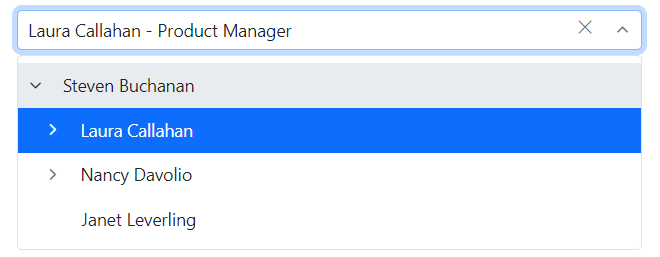
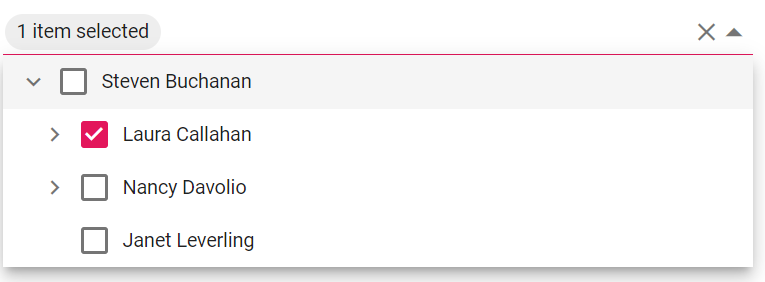

# Templates in Blazor Dropdown Tree Component

The Dropdown Tree has been provided with several options to customize each list item, header, and footer elements.

## Item template

The content of each list item within the Dropdown Tree can be customized with the help of the [`ItemTemplate`](https://help.syncfusion.com/cr/blazor/Syncfusion.Blazor.Navigations.SfDropDownTree-2.html#Syncfusion_Blazor_Navigations_SfDropDownTree_2_ItemTemplate) property.

In the following sample, the Dropdown Tree list items are customized with employee information such as **name** and **job** using the [**ItemTemplate**](https://help.syncfusion.com/cr/blazor/Syncfusion.Blazor.Navigations.SfDropDownTree-2.html#Syncfusion_Blazor_Navigations_SfDropDownTree_2_ItemTemplate) property. 

The variable `context` holds the data of the current node.

```cshtml
@using Syncfusion.Blazor.Navigations

<SfDropDownTree TItem="EmployeeData" TValue="string" Placeholder="Select an employee" Width="500px">
    <ChildContent>
        <DropDownTreeField TItem="EmployeeData" DataSource="Data" ID="Id" Text="Name" HasChildren="HasChild" ParentID="PId"></DropDownTreeField>
    </ChildContent>
    <ItemTemplate>
        <div>
            <span class="ename">@((context as EmployeeData).Name) - </span>
            <span class="ejob" style="opacity: .60">@((context as EmployeeData).Job)</span>
        </div>
    </ItemTemplate>
</SfDropDownTree>

@code {
    List<EmployeeData> Data = new List<EmployeeData>
    {
        new EmployeeData() { Id = "1", Name = "Steven Buchanan", Job = "General Manager", HasChild = true, Expanded = true },
        new EmployeeData() { Id = "2", PId = "1", Name = "Laura Callahan", Job = "Product Manager", HasChild = true },
        new EmployeeData() { Id = "3", PId = "2", Name = "Andrew Fuller", Job = "Team Lead", HasChild = true },
        new EmployeeData() { Id = "4", PId = "3", Name = "Anne Dodsworth", Job = "Developer" },
        new EmployeeData() { Id = "10", PId = "3", Name = "Lilly", Job = "Developer" },
        new EmployeeData() { Id = "5", PId = "1", Name = "Nancy Davolio", Job = "Product Manager", HasChild = true },
        new EmployeeData() { Id = "6", PId = "5", Name = "Michael Suyama", Job = "Team Lead", HasChild = true },
        new EmployeeData() { Id = "7", PId = "6", Name = "Robert King", Job = "Developer" },
        new EmployeeData() { Id = "11", PId = "6", Name = "Mary", Job = "Developer" },
        new EmployeeData() { Id = "9", PId = "1", Name = "Janet Leverling", Job = "HR"}
    };

    class EmployeeData
    {
        public string? Id { get; set; }
        public string? Name { get; set; }
        public string? Job { get; set; }
        public bool HasChild { get; set; }
        public bool Expanded { get; set; }
        public string? PId { get; set; }
    }
}
```


## Value template

The currently selected value that is displayed by default on the Dropdown Tree input element can be customized using the [ValueTemplate](https://help.syncfusion.com/cr/blazor/Syncfusion.Blazor.Navigations.SfDropDownTree-2.html#Syncfusion_Blazor_Navigations_SfDropDownTree_2_ValueTemplate) property. The variable `context` holds the data of the current node.

In the following sample, the selected value is displayed as a combined text of both `Name` and `Job` in the Dropdown Tree input, which is separated by a hyphen.

The template expression can be provided directly inside the `ValueTemplate`, as shown in the code below.

```cshtml
@using Syncfusion.Blazor.Navigations

<SfDropDownTree TItem="EmployeeData" TValue="string" Placeholder="Select an employee" Width="500px">
    <ChildContent>
        <DropDownTreeField TItem="EmployeeData" DataSource="Data" ID="Id"  Text="Name" HasChildren="HasChild" ParentID="PId" Expanded="Expanded"></DropDownTreeField>
    </ChildContent>
    <ValueTemplate>
        <span>@((context as EmployeeData).Name) - @((context as EmployeeData).Job)</span>
    </ValueTemplate>
</SfDropDownTree>

@code {
    List<EmployeeData> Data = new List<EmployeeData>
    {
        new EmployeeData() { Id = "1", Name = "Steven Buchanan", Job = "General Manager", HasChild = true, Expanded = true },
        new EmployeeData() { Id = "2", PId = "1", Name = "Laura Callahan", Job = "Product Manager", HasChild = true },
        new EmployeeData() { Id = "3", PId = "2", Name = "Andrew Fuller", Job = "Team Lead", HasChild = true },
        new EmployeeData() { Id = "4", PId = "3", Name = "Anne Dodsworth", Job = "Developer" },
        new EmployeeData() { Id = "10", PId = "3", Name = "Lilly", Job = "Developer" },
        new EmployeeData() { Id = "5", PId = "1", Name = "Nancy Davolio", Job = "Product Manager", HasChild = true },
        new EmployeeData() { Id = "6", PId = "5", Name = "Michael Suyama", Job = "Team Lead", HasChild = true },
        new EmployeeData() { Id = "7", PId = "6", Name = "Robert King", Job = "Developer" },
        new EmployeeData() { Id = "11", PId = "6", Name = "Mary", Job = "Developer" },
        new EmployeeData() { Id = "9", PId = "1", Name = "Janet Leverling", Job = "HR"}
    };

    class EmployeeData
    {
        public string? Id { get; set; }
        public string? Name { get; set; }
        public string? Job { get; set; }
        public bool HasChild { get; set; }
        public bool Expanded { get; set; }
        public string? PId { get; set; }
    }
}

```



## Header template

The header element is shown statically at the top of the popup list items within Dropdown Tree, and any custom element can be placed as a header element using the [`HeaderTemplate`](https://help.syncfusion.com/cr/blazor/Syncfusion.Blazor.Navigations.SfDropDownTree-2.html#Syncfusion_Blazor_Navigations_SfDropDownTree_2_HeaderTemplate) property.

In the following sample, the header is customized with the custom element.

```cshtml
@using Syncfusion.Blazor.Navigations

<SfDropDownTree TItem="EmployeeData" TValue="string" Placeholder="Select an employee" Width="500px" CssClass="custom">
    <ChildContent>
        <DropDownTreeField TItem="EmployeeData" DataSource="Data" ID="Id" Text="Name" HasChildren="HasChild" ParentID="PId"></DropDownTreeField>
    </ChildContent>
    <HeaderTemplate>
        <div class="head"> Employee List </div>
    </HeaderTemplate>
</SfDropDownTree>

@code {
    List<EmployeeData> Data = new List<EmployeeData>
    {
        new EmployeeData() { Id = "1", Name = "Steven Buchanan", Job = "General Manager", HasChild = true, Expanded = true },
        new EmployeeData() { Id = "2", PId = "1", Name = "Laura Callahan", Job = "Product Manager", HasChild = true },
        new EmployeeData() { Id = "3", PId = "2", Name = "Andrew Fuller", Job = "Team Lead", HasChild = true },
        new EmployeeData() { Id = "4", PId = "3", Name = "Anne Dodsworth", Job = "Developer" },
        new EmployeeData() { Id = "10", PId = "3", Name = "Lilly", Job = "Developer" },
        new EmployeeData() { Id = "5", PId = "1", Name = "Nancy Davolio", Job = "Product Manager", HasChild = true },
        new EmployeeData() { Id = "6", PId = "5", Name = "Michael Suyama", Job = "Team Lead", HasChild = true },
        new EmployeeData() { Id = "7", PId = "6", Name = "Robert King", Job = "Developer" },
        new EmployeeData() { Id = "11", PId = "6", Name = "Mary", Job = "Developer" },
        new EmployeeData() { Id = "9", PId = "1", Name = "Janet Leverling", Job = "HR"}
    };

    class EmployeeData
    {
        public string? Id { get; set; }
        public string? Name { get; set; }
        public string? Job { get; set; }
        public bool HasChild { get; set; }
        public bool Expanded { get; set; }
        public string? PId { get; set; }
    }
}

<style>
    .custom .head {
        height: 40px;
        line-height: 40px;
        font-size: 14px;
        margin: 0 auto;
        width: 100%;
        padding: 0 20px;
        font-weight: bold;
        border-bottom: 1px solid #e0e0e0;
    }
</style>
```


## Footer template

The Dropdown Tree has options to show a footer element at the bottom of the list items in the popup list. Here, you can place any custom element as a footer element using the [`FooterTemplate`](https://help.syncfusion.com/cr/blazor/Syncfusion.Blazor.Navigations.SfDropDownTree-2.html#Syncfusion_Blazor_Navigations_SfDropDownTree_2_FooterTemplate) property.

In the following sample, the footer element displays the total number of employees present in the Dropdown Tree.

```cshtml
@using Syncfusion.Blazor.Navigations

<SfDropDownTree TItem="EmployeeData" TValue="string" Placeholder="Select an employee" Width="500px" CssClass="custom">
    <ChildContent>
        <DropDownTreeField TItem="EmployeeData" DataSource="Data" ID="Id" Text="Name" HasChildren="HasChild" ParentID="PId"></DropDownTreeField>
    </ChildContent>
    <FooterTemplate>
        <span class='foot'> Total number of employees:  @Data?.Count.ToString()</span>
    </FooterTemplate>
</SfDropDownTree>

@code {
    List<EmployeeData> Data = new List<EmployeeData>
    {
        new EmployeeData() { Id = "1", Name = "Steven Buchanan", Job = "General Manager", HasChild = true, Expanded = true },
        new EmployeeData() { Id = "2", PId = "1", Name = "Laura Callahan", Job = "Product Manager", HasChild = true },
        new EmployeeData() { Id = "3", PId = "2", Name = "Andrew Fuller", Job = "Team Lead", HasChild = true },
        new EmployeeData() { Id = "4", PId = "3", Name = "Anne Dodsworth", Job = "Developer" },
        new EmployeeData() { Id = "10", PId = "3", Name = "Lilly", Job = "Developer" },
        new EmployeeData() { Id = "5", PId = "1", Name = "Nancy Davolio", Job = "Product Manager", HasChild = true },
        new EmployeeData() { Id = "6", PId = "5", Name = "Michael Suyama", Job = "Team Lead", HasChild = true },
        new EmployeeData() { Id = "7", PId = "6", Name = "Robert King", Job = "Developer" },
        new EmployeeData() { Id = "11", PId = "6", Name = "Mary", Job = "Developer" },
        new EmployeeData() { Id = "9", PId = "1", Name = "Janet Leverling", Job = "HR"}
    };

    class EmployeeData
    {
        public string? Id { get; set; }
        public string? Name { get; set; }
        public string? Job { get; set; }
        public bool HasChild { get; set; }
        public bool Expanded { get; set; }
        public string? PId { get; set; }
    }
}

<style>
    .custom .foot {
        line-height: 40px;
        font-size: 14px;
        margin: 0 auto;
        padding: 0 20px;
        font-weight: bold;
    }

    .custom .e-ddt-footer {
        border-top: 1px solid #e0e0e0;
    }
</style>
```


## No records template

The Dropdown Tree is provided with support to custom design the popup list content when no data is found and no matches found on search with the help of [`NoRecordsTemplate`](https://help.syncfusion.com/cr/blazor/Syncfusion.Blazor.Navigations.SfDropDownTree-2.html#Syncfusion_Blazor_Navigations_SfDropDownTree_2_NoRecordsTemplate) property.

In the following sample, popup list content displays the notification of no data available.

```cshtml
@using Syncfusion.Blazor.Navigations

<SfDropDownTree TItem="EmployeeData" TValue="string" Placeholder="Select an employee" Width="500px" CssClass="custom">
    <ChildContent>
        <DropDownTreeField TItem="EmployeeData" DataSource="Data" ID="Id" Text="Name" HasChildren="HasChild" ParentID="PId"></DropDownTreeField>
    </ChildContent>
    <NoRecordsTemplate>
        <span > NO DATA AVAILABLE</span>
    </NoRecordsTemplate>
</SfDropDownTree>

@code {
    List<EmployeeData> Data = new List<EmployeeData> { };

    class EmployeeData
    {
        public string Id { get; set; }
        public string Name { get; set; }
        public string Job { get; set; }
        public bool HasChild { get; set; }
        public bool Expanded { get; set; }
        public string PId { get; set; }
    }
}
```


## Action failure template

There is also an option to custom design the popup list content when the data fetch request fails at the remote server. This can be achieved using the [`ActionFailureTemplate`](https://help.syncfusion.com/cr/blazor/Syncfusion.Blazor.Navigations.SfDropDownTree-2.html#Syncfusion_Blazor_Navigations_SfDropDownTree_2_ActionFailureTemplate) property.

In the following sample, when the data fetch request fails, the Dropdown Tree displays the notification.

```cshtml
@using Syncfusion.Blazor.Navigations
@using Syncfusion.Blazor.Data

<SfDropDownTree TValue="int?" TItem="TreeData" ID="remote" Placeholder="Select a name" Width="500px">
    <ChildContent>
        <DropDownTreeField TItem="TreeData" Query="@employeeQuery" ID="EmployeeID" Text="FirstName" HasChildren="EmployeeID">
            <SfDataManager Url="https://services.odata.org/V4/Northwind/Northwind.svc" Adaptor="Syncfusion.Blazor.Adaptors.ODataV4Adaptor" CrossDomain="true"></SfDataManager>
        </DropDownTreeField>
        <DropDownTreeField TItem="TreeData" Query="@orderQuery" Id="OrderID" Text="ShipName" ParentID="EmployeeID">
            <SfDataManager Url="https://services.odata.org/V4/Northwind/Northwind.svs" Adaptor="Syncfusion.Blazor.Adaptors.ODataV4Adaptor" CrossDomain="true"></SfDataManager>
        </DropDownTreeField>
    </ChildContent>
    <ActionFailureTemplate>
        <span>A request to fetch data is failed.</span>
    </ActionFailureTemplate>
</SfDropDownTree>

@code {
    List<string> EmployeeDetails { get; set; } = new List<string>() { "EmployeeID", "FirstName", "Title" };
    List<string> OrderDetails { get; set; } = new List<string>() { "OrderID", "EmployeeID", "ShipName" };
    Query employeeQuery;
    Query orderQuery;

    protected override void OnInitialized()
    {
        base.OnInitialized();
        employeeQuery = new Query().From("Employees").Select(EmployeeDetails).Take(5);
        orderQuery = new Query().From("Orders").Select(OrderDetails).Take(5);
    }
    
    class TreeData
    {
        public int? EmployeeID { get; set; }
        public int OrderID { get; set; }
        public string ShipName { get; set; }
        public string FirstName { get; set; }
    }
}
```


## Placeholder

Use the [Placeholder](https://help.syncfusion.com/cr/blazor/Syncfusion.Blazor.Navigations.SfDropDownTree-2.html#Syncfusion_Blazor_Navigations_SfDropDownTree_2_Placeholder) property to display a small description of the expected value in the input. In the following sample demonstration, set the `Select an Employee` as the `Placeholder` property value, which will set the respective value to the `Placeholder` attribute of the input element in the DOM.

```cshtml
@using Syncfusion.Blazor.Navigations
<SfDropDownTree TItem="EmployeeData" TValue="string" Placeholder="Select an Employee" Width="500px">
    <DropDownTreeField TItem="EmployeeData" DataSource="Data" ID="Id" Text="Name" HasChildren="HasChild" ParentID="PId"></DropDownTreeField>
</SfDropDownTree>
@code {
    List<EmployeeData> Data = new List<EmployeeData>
    {
        new EmployeeData() { Id = "1", Name = "Steven Buchanan", Job = "General Manager", HasChild = true, Expanded = true },
        new EmployeeData() { Id = "2", PId = "1", Name = "Laura Callahan", Job = "Product Manager", HasChild = true },
        new EmployeeData() { Id = "3", PId = "2", Name = "Andrew Fuller", Job = "Team Lead", HasChild = true },
        new EmployeeData() { Id = "4", PId = "3", Name = "Anne Dodsworth", Job = "Developer" },
        new EmployeeData() { Id = "10", PId = "3", Name = "Lilly", Job = "Developer" },
        new EmployeeData() { Id = "5", PId = "1", Name = "Nancy Davolio", Job = "Product Manager", HasChild = true },
        new EmployeeData() { Id = "6", PId = "5", Name = "Michael Suyama", Job = "Team Lead", HasChild = true },
        new EmployeeData() { Id = "7", PId = "6", Name = "Robert King", Job = "Developer" },
        new EmployeeData() { Id = "11", PId = "6", Name = "Mary", Job = "Developer" },
        new EmployeeData() { Id = "9", PId = "1", Name = "Janet Leverling", Job = "HR"}
    };
    class EmployeeData
    {
    public string Id { get; set; }
    public string Name { get; set; }
    public string Job { get; set; }
    public bool HasChild { get; set; }
    public bool Expanded { get; set; }
    public string PId { get; set; }
    }
}
```


## FloatLabel

Use the [FloatLabelType](https://help.syncfusion.com/cr/blazor/Syncfusion.Blazor.Navigations.SfDropDownTree-2.html#Syncfusion_Blazor_Navigations_SfDropDownTree_2_FloatLabelType) property to specify the floating label behavior of the Dropdown Tree that the `Placeholder` text floats above the TextBox based on the following values. `FloatLabelType` is applicable only when `Placeholder` is used. `FloatLabelType` is depends on `Placeholder`. Default value of `FloatLabelType` is `Never`.

The floating label supports the types of actions as follow.

Type     | Description
------------ | -------------
  [Auto](https://help.syncfusion.com/cr/blazor/Syncfusion.Blazor.Inputs.FloatLabelType.html#Syncfusion_Blazor_Inputs_FloatLabelType_Auto)       | The floating label will float above the input after focusing, or entering a value in the input.
  [Always](https://help.syncfusion.com/cr/blazor/Syncfusion.Blazor.Inputs.FloatLabelType.html#Syncfusion_Blazor_Inputs_FloatLabelType_Always)     | The floating label will always float above the input.
  [Never](https://help.syncfusion.com/cr/blazor/Syncfusion.Blazor.Inputs.FloatLabelType.html#Syncfusion_Blazor_Inputs_FloatLabelType_Never)      | By default, never float the label in the input when the placeholder is available.

The `FloatLabelType` as `Auto` is demonstrated in the following code sample.

```cshtml
@using Syncfusion.Blazor.Navigations
@using Syncfusion.Blazor.Inputs
<SfDropDownTree TItem="EmployeeData" TValue="string" Placeholder="Select an Employee" Width="500px" FloatLabelType="FloatLabelType.Auto">
    <DropDownTreeField TItem="EmployeeData" DataSource="Data" ID="Id" Text="Name" HasChildren="HasChild" ParentID="PId"></DropDownTreeField>
</SfDropDownTree>
@code {
    List<EmployeeData> Data = new List<EmployeeData>
    {
        new EmployeeData() { Id = "1", Name = "Steven Buchanan", Job = "General Manager", HasChild = true, Expanded = true },
        new EmployeeData() { Id = "2", PId = "1", Name = "Laura Callahan", Job = "Product Manager", HasChild = true },
        new EmployeeData() { Id = "3", PId = "2", Name = "Andrew Fuller", Job = "Team Lead", HasChild = true },
        new EmployeeData() { Id = "4", PId = "3", Name = "Anne Dodsworth", Job = "Developer" },
        new EmployeeData() { Id = "10", PId = "3", Name = "Lilly", Job = "Developer" },
        new EmployeeData() { Id = "5", PId = "1", Name = "Nancy Davolio", Job = "Product Manager", HasChild = true },
        new EmployeeData() { Id = "6", PId = "5", Name = "Michael Suyama", Job = "Team Lead", HasChild = true },
        new EmployeeData() { Id = "7", PId = "6", Name = "Robert King", Job = "Developer" },
        new EmployeeData() { Id = "11", PId = "6", Name = "Mary", Job = "Developer" },
        new EmployeeData() { Id = "9", PId = "1", Name = "Janet Leverling", Job = "HR"}
    };
    class EmployeeData
    {
    public string Id { get; set; }
    public string Name { get; set; }
    public string Job { get; set; }
    public bool HasChild { get; set; }
    public bool Expanded { get; set; }
    public string PId { get; set; }
    }
}
```


## SelectedItem template

In Dropdown Tree, while selecting more than one items via checkbox or multi selection support, all the selected items will be displayed in the input. Instead of displaying all the selected item text, the custom text in [SelectedItemTemplate](https://help.syncfusion.com/cr/blazor/Syncfusion.Blazor.Navigations.SfDropDownTree-2.html#Syncfusion_Blazor_Navigations_SfDropDownTree_2_SelectedItemTemplate) can be displayed by setting the [Mode](https://help.syncfusion.com/cr/blazor/Syncfusion.Blazor.Navigations.SfDropDownTree-2.html#Syncfusion_Blazor_Navigations_SfDropDownTree_2_Mode) property as **Custom**.


In this example, the custom text provided is displayed instead of the text of the selected item.

```cshtml
@using Syncfusion.Blazor.Navigations

<SfDropDownTree TItem="EmployeeData" TValue="string" Placeholder="Select an employee" Width="500px" Value="selecteditem" ShowCheckBox="true" Mode="DdtVisualMode.Custom">
<ChildContent>
<DropDownTreeField TItem="EmployeeData" DataSource="Data" ID="Id" Text="Name" HasChildren="HasChild" ParentID="PId" Selected="Selected" IsChecked="IsChecked"></DropDownTreeField>
 
    </ChildContent>
<SelectedItemTemplate>
 
        @if (context != null && context.Value != null && context.Value.Count>0)
        {
            string content = $"{context.Value.Count} item{(context.Value.Count == 1 ? "" : "s")} selected";
            @content
        }
</SelectedItemTemplate>
</SfDropDownTree>
 
@code {
    List<string> selecteditem = new() { "2"};
    List<EmployeeData> Data = new List<EmployeeData>
    {
        new EmployeeData() { Id = "1", Name = "Steven Buchanan", Job = "General Manager", HasChild = true, Expanded = true},
        new EmployeeData() { Id = "2", PId = "1", Name = "Laura Callahan", Job = "Product Manager", HasChild = true },
        new EmployeeData() { Id = "3", PId = "2", Name = "Andrew Fuller", Job = "Team Lead", HasChild = true },
        new EmployeeData() { Id = "4", PId = "3", Name = "Anne Dodsworth", Job = "Developer" },
        new EmployeeData() { Id = "10", PId = "3", Name = "Lilly", Job = "Developer" },
        new EmployeeData() { Id = "5", PId = "1", Name = "Nancy Davolio", Job = "Product Manager", HasChild = true },
        new EmployeeData() { Id = "6", PId = "5", Name = "Michael Suyama", Job = "Team Lead", HasChild = true },
        new EmployeeData() { Id = "7", PId = "6", Name = "Robert King", Job = "Developer" },
        new EmployeeData() { Id = "11", PId = "6", Name = "Mary", Job = "Developer" },
        new EmployeeData() { Id = "9", PId = "1", Name = "Janet Leverling", Job = "HR"}
    };
 
    class EmployeeData
    {
        public string? Id { get; set; }
        public string? Name { get; set; }
        public string? Job { get; set; }
        public bool HasChild { get; set; }
        public bool Expanded { get; set; }
        public bool Selected { get; set; }
        public bool IsChecked { get; set; }
        public string? PId { get; set; }
    }
}
```


