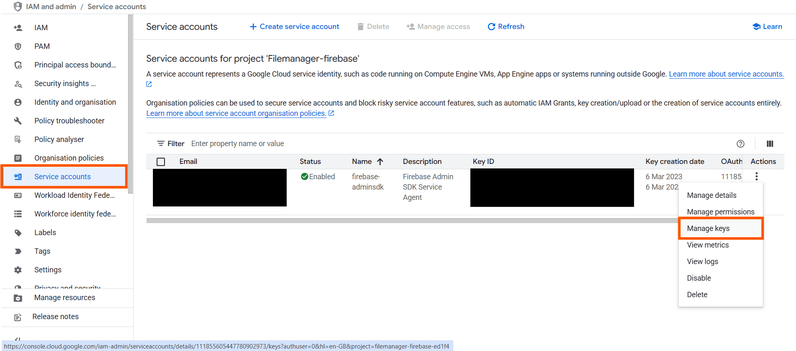
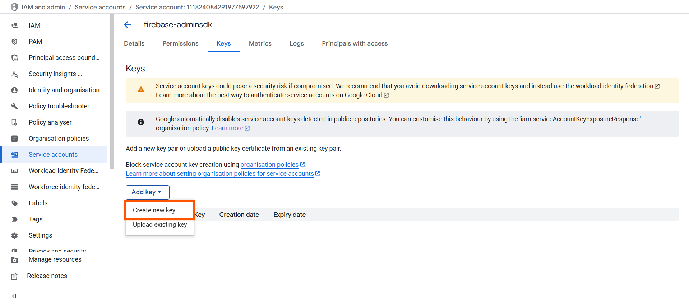
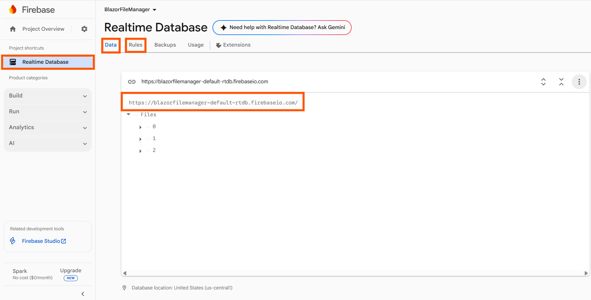

# Firebase file system provider

To get started with the Firebase file system provider, ensure that you have a Firebase project, Firebase Realtime Database created, and a service account key (JSON) generated from the Firebase console.

The [Firebase Realtime Database](https://firebase.google.com/) file system provider in **ASP.NET Core** provides an efficient way to store the File Manager file system in a cloud database as a JSON representation.

### Generate a service account key

Follow these steps to generate and download the service account key:

* Visit the [Firebase Console](https://console.firebase.google.com/u/0/?pli=1) and open your project.

* Navigate to the **Project Settings > Service Accounts** tab.

* In the new dialog window, click the **All service accounts** option to navigate to the Google service accounts console to generate the secret key.


* Now, open the Firebase service project from the Google service accounts console and generate a key.





* After generating the key, replace the JSON content in the `access_key.json` file in the Firebase Realtime Database provider project to enable authentication for read and write operations.

To integrate with Firebase Realtime Database, create a database under **Firebase Realtime Database** and configure the **read** and **write** permissions by specifying the rules in the **Rules** tab as shown in the following example.

N> By default, Firebase Realtime Database rules are set to `false`. To read and write data, configure the **Rules** as shown in the following snippet in the *Rules* tab.

```json
{
  /* Visit https://firebase.google.com/docs/database/security to learn more about security rules. */
  "rules": {
    ".read": "auth!=null",
    ".write": "auth!=null"
  }
}
```

Then, create a root node and add children to the root node. Refer to the following code snippet for the structure of JSON.

```json
{
  "Files": [
    {
      "dateCreated": "2026-01-01T09:15:32Z",
      "dateModified": "2026-01-15T14:48:10Z",
      "filterPath": "",
      "hasChild": true,
      "id": "0",
      "isFile": false,
      "isRoot": false,
      "name": "Files",
      "size": 0,
      "type": ""
    },
    {
      "dateCreated": "2026-01-10T11:22:45Z",
      "dateModified": "2026-01-22T17:55:12Z",
      "filterPath": "/",
      "hasChild": false,
      "id": "5",
      "isFile": false,
      "isRoot": true,
      "name": "Music",
      "parentId": "0",
      "size": 0,
      "type": "folder"
    },
    {
      "dateCreated": "2026-01-05T13:04:27Z",
      "dateModified": "2026-01-13T12:52:44Z",
      "filterPath": "/",
      "hasChild": false,
      "id": "6",
      "isFile": false,
      "isRoot": true,
      "name": "Videos",
      "parentId": "0",
      "size": 0,
      "type": ""
    }
  ]
}
```

Here, `Files` denotes the `rootNode`, and the array items represent folders/files in the File Manager file system. The first object typically represents the root folder, and child items reference the root using `parentId`.

In the **Data** tab of your Firebase Realtime Database, locate the project's **API URL**. You can use this URL in your backend configuration code. To upload the file structure, create a **.json** file using the format shown above and import it using the **Import JSON** option.



After that, clone the [EJ2.ASP.NET Core Firebase Realtime Database File Provider](https://github.com/SyncfusionExamples/firebase-realtime-database-aspcore-file-provider), open the project in Visual Studio, and restore the NuGet packages.

Register Firebase Realtime Database by assigning the **Firebase Realtime Database REST API URL**, **rootNode**, and **serviceAccountKeyPath** parameters in the `RegisterFirebaseRealtimeDB` method of the `FirebaseRealtimeDBFileProvider` class in the controller part of the ASP.NET Core application, in the `FirebaseProviderController.cs` file.

```csharp
this.operation.RegisterFirebaseRealtimeDB("<---API URL--->", "<---RootNode--->", Path.Combine(hostingEnvironment.ContentRootPath, "FirebaseRealtimeDBHelper", "access_key.json"));
```

**Example:**

```csharp
this.operation.RegisterFirebaseRealtimeDB("https://filemanager-c0f6d.firebaseio.com/", "Files", Path.Combine(hostingEnvironment.ContentRootPath, "FirebaseRealtimeDBHelper", "access_key.json"));
```

In the above code,

* `https://filemanager-c0f6d.firebaseio.com/` denotes the Firebase Realtime Database REST API URL.

* `Files` denotes the root node created in Firebase Realtime Database.

* `access_key.json` is the service account key used to authenticate to Firebase Realtime Database.

After configuring the Firebase Realtime Database service link, build and run the project. The project will be hosted at `http://localhost:{port}`. By mapping the [FileManagerAjaxSettings](https://help.syncfusion.com/cr/blazor/Syncfusion.Blazor.FileManager.FileManagerAjaxSettings.html) property of the File Manager component to the appropriate controller methods, you can manage files in Firebase Realtime Database.

```razor
@*Initializing File Manager with Firebase Realtime Database service*@

@* Replace the hosted port number in the place of "{port}" *@

<SfFileManager TValue="FileManagerDirectoryContent">
    <FileManagerAjaxSettings Url="http://localhost:{port}/api/FirebaseProvider/FirebaseRealtimeFileOperations"
                             UploadUrl="http://localhost:{port}/api/FirebaseProvider/FirebaseRealtimeUpload"
                             DownloadUrl="http://localhost:{port}/api/FirebaseProvider/FirebaseRealtimeDownload"
                             GetImageUrl="http://localhost:{port}/api/FirebaseProvider/FirebaseRealtimeGetImage">
    </FileManagerAjaxSettings>
</SfFileManager>
```

To perform file operations (Read, Create, Rename, Delete, Get file details, Search, Copy, Move, Upload, Download, GetImage) in the Syncfusion<sup style="font-size:70%">&reg;</sup> Blazor File Manager component using the Firebase file system provider, you need to initialize the Firebase file system provider in the controller.

To initialize a local service with the above-mentioned file operations, create a folder named `Controllers` in the server project. Then, create a `.cs` file in the `Controllers` folder and add the required file operation code from [FirebaseProviderController.cs](https://github.com/SyncfusionExamples/firebase-realtime-database-aspcore-file-provider/blob/master/Controllers/FirebaseProviderController.cs).

N> To learn more about the file actions supported by the Firebase file system provider, refer to the [key features](https://github.com/SyncfusionExamples/firebase-realtime-database-aspcore-file-provider#key-features).