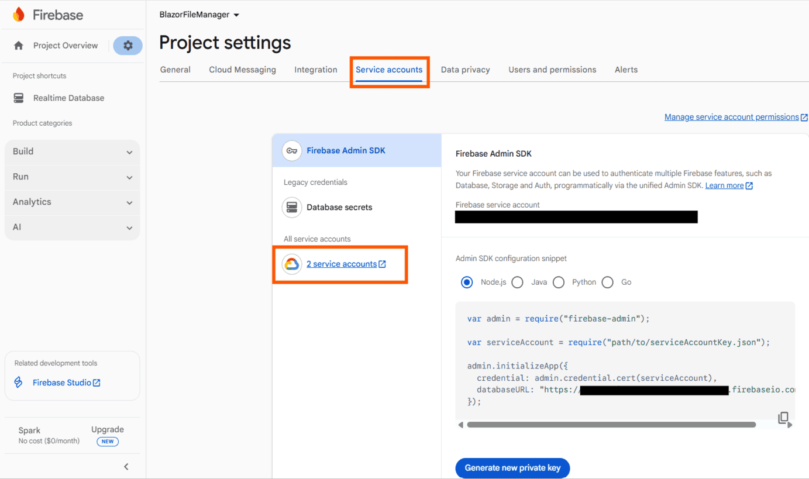
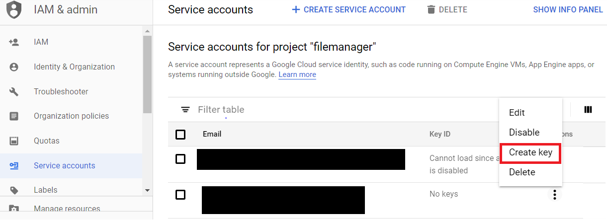

# Firebase Realtime Database Provider

The [Firebase Real time Database](https://firebase.google.com/) file system provider in **ASP.NET Core** provides an efficient way to store the File Manager file system in a cloud database as JSON representation.

### Generate a Secret Access Key from a Service Account

Follow these steps to generate the secret access key:

* Click this [link](https://console.firebase.google.com/u/0/?pli=1) to Firebase console and navigate to the project settings.

* And then, navigate to the **Service Accounts** tab in the window.

* In the new dialog window, click the **Other service account** option to navigate to the Google service accounts console to generate the secret key.



* Open the Firebase service project from the Google services console and generate a Secret key.



* After generating the secret key, replace secret key JSON in the access_key.json file in the Firebase Real time Database provider project to enable authentication for performing read and write operations.

To interact with the Firebase Realtime Database, create a project and enable **read** and **write** permissions by specifying the rules within the authentication tab of the Firebase project, as shown in the following code snippet.

N> By default, rules of a Firebase project will be **false**. To read and write the data, configure the **Rules** as given in the following code snippet in the *Rules* tab in the Firebase Real time Database project.

```json

{
  /* Visit https://firebase.google.com/docs/database/security to learn more about security rules. */
  "rules": {
    ".read": "auth!=null",
    ".write": "auth!=null"
  }
}

```

Then, create a root node and add children to the root node. Refer to the following code snippet for the structure of JSON.

```json

{
  "Files" : [ {
    "caseSensitive" : false,
    "dateCreated" : "8/22/2019 5:17:55 PM",
    "dateModified" : "8/22/2019 5:17:55 PM",
    "filterId" : "0/",
    "filterPath" : "/",
    "hasChild" : false,
    "id" : "5",
    "isFile" : false,
    "isRoot" : true,
    "name" : "Music",
    "parentId" : "0",
    "selected" : false,
    "showHiddenItems" : false,
    "size" : 0,
    "type" : "folder"
  },
   {
    "caseSensitive" : false,
    "dateCreated" : "8/22/2019 5:18:03 PM",
    "dateModified" : "8/22/2019 5:18:03 PM",
    "filterId" : "0/",
    "filterPath" : "/",
    "hasChild" : false,
    "id" : "6",
    "isFile" : false,
    "isRoot" : true,
    "name" : "videos",
    "parentId" : "0",
    "selected" : false,
    "showHiddenItems" : false,
    "size" : 0,
    "type" : ""
  }]
 }

```

Here, the `Files` denotes the `rootNode` and the subsequent object refers to the children of the root node. `rootNode` will be taken as the root folder of the file system loaded in the File Manager component.

After that, clone the [EJ2.ASP.NET Core Firebase Real Time Database File Provider](https://github.com/SyncfusionExamples/ej2-firebase-realtime-database-aspcore-file-provider) and just open the project in Visual Studio and restore the NuGet package.

Register the Firebase Real time Database by assigning *Firebase Real time Database REST API link*, *rootNode*, and *serviceAccountKeyPath* parameters in the `RegisterFirebaseRealtimeDB` method of class `FirebaseRealtimeDBFileProvider` in controller part of the ASP.NET Core application.

```

void RegisterFirebaseRealtimeDB(string apiUrl, string rootNode, string serviceAccountKeyPath)

```

**Example:**

```

void RegisterFirebaseRealtimeDB("https://filemanager-c0f6d.firebaseio.com/", "Files", "{give the service account key path}");

```

In the above code,

* `https://filemanager-c0f6d.firebaseio.com/` denotes Firebase Real time Database REST API link.

* `Files` denotes newly created root node in Firebase Real time Database.

* `{give the service account key path}` denotes service account key path which has authentication key for the Firebase Real time Database data.

After configuring the Firebase Realtime Database service link, build and run the project. The application will be hosted at `http://localhost:{port}`. Map the **ajaxSettings** property of the File Manager component to the appropriate controller methods to manage the files in the Firebase Realtime Database.

```cshtml

@*Initializing File Manager with Firebase Realtime Database service*@

@* Replace the hosted port number in the place of "{port}" *@

<SfFileManager TValue="FileManagerDirectoryContent">
    <FileManagerAjaxSettings Url="http://localhost:{port}/api/FirebaseProvider/FirebaseRealtimeFileOperations"
                             UploadUrl="http://localhost:{port}/api/FirebaseProvider/FirebaseRealtimeUpload"
                             DownloadUrl="http://localhost:{port}/api/FirebaseProvider/FirebaseRealtimeDownload"
                             GetImageUrl="http://localhost:{port}/api/FirebaseProvider/FirebaseRealtimeGetImage">
    </FileManagerAjaxSettings>
</SfFileManager>


```

To perform file operations (Read, Create, Rename, Delete, Get file details, Search, Copy, Move, Upload, Download, GetImage) in the Syncfusion<sup style="font-size:70%">&reg;</sup> Blazor File Manager component using the Firebase file system provider, initialize the Firebase file system provider in the controller.

To initialize a local service with the above-mentioned file operations, create a new folder named `Controllers` inside the server part of the project. Then, create a new file with the extension `.cs` inside the Controllers folder and add the necessary file operations code available in the `FirebaseProviderController.cs` found at this [link](https://github.com/SyncfusionExamples/firebase-realtime-database-aspcore-file-provider/blob/master/Controllers/FirebaseProviderController.cs). Additionally, you can check out all the necessary file operation method details for this provider in the same GitHub repository.

N> To learn more about file actions that can be performed with Firebase file system provider, refer to this [link](https://github.com/SyncfusionExamples/firebase-realtime-database-aspcore-file-provider#key-features)