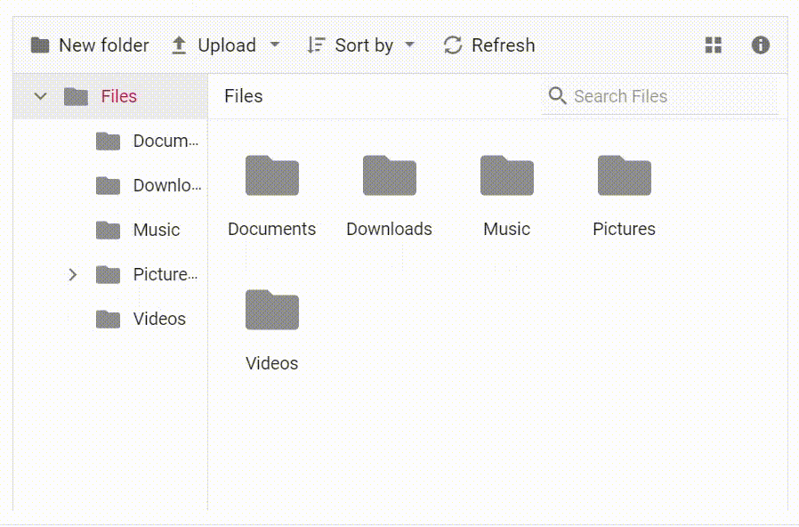

# Data Binding in Blazor File Manager Component

The File Manager uses [SfFileManager](https://help.syncfusion.com/cr/blazor/Syncfusion.Blazor.FileManager.SfFileManager-1.html), which supports both RESTful JSON data services binding and IEnumerable binding. Data can be loaded using the [AjaxSettings](https://help.syncfusion.com/cr/blazor/Syncfusion.Blazor.FileManager.FileManagerAjaxSettings.html) property or by providing a list of objects through corresponding events.

Supported data binding method:
* AjaxSettings
* List objects

N> When using [AjaxSettings](https://help.syncfusion.com/cr/blazor/Syncfusion.Blazor.FileManager.FileManagerAjaxSettings.html), component will be load data from its Ajax URL. When using list of object, component will be load data by providing the response within the corresponding events.

## AjaxSettings

To initialize a local service, create a folder named `Controllers` in the server project. Add a new file `SampleDataController.cs` inside the `Controllers` folder and include the following code:




<SfFileManager TValue="FileManagerDirectoryContent">
    <FileManagerAjaxSettings Url="/api/SampleData/FileOperations">
    </FileManagerAjaxSettings>
</SfFileManager>







using Microsoft.AspNetCore.Mvc;
using System;
using System.Collections.Generic;
using Microsoft.AspNetCore.Hosting;
using Microsoft.AspNetCore.Http;
using Microsoft.AspNetCore.Http.Features;
//File Manager's base functions are available in the below namespace.
using Syncfusion.EJ2.FileManager.Base;
//File Manager's operations are available in the below namespace.
using Syncfusion.EJ2.FileManager.PhysicalFileProvider;
using Newtonsoft.Json;
using System.Linq;
using System.Threading.Tasks;

namespace filemanager.Server.Controllers
{
    [Route("api/[controller]")]
    public class SampleDataController : Controller
    {
        public PhysicalFileProvider operation;
        public string basePath;
        string root = "wwwroot\\Files";
        [Obsolete]
        public SampleDataController(IHostingEnvironment hostingEnvironment)
        {
            this.basePath = hostingEnvironment.ContentRootPath;
            this.operation = new PhysicalFileProvider();
            this.operation.RootFolder(this.basePath + "\\" + this.root); // It denotes in which files and folders are available.
        }

        // Processing the File Manager operations.
        [Route("FileOperations")]
        public object FileOperations([FromBody] FileManagerDirectoryContent args)
        {
            switch (args.Action)
            {
                // Add your custom action here.
                case "read":
                    // Path - Current path; ShowHiddenItems - Boolean value to show/hide hidden items.
                    return this.operation.ToCamelCase(this.operation.GetFiles(args.Path, args.ShowHiddenItems));
                case "delete":
                    // Path - Current path where the folder to be deleted; Names - Name of the files to be deleted
                    return this.operation.ToCamelCase(this.operation.Delete(args.Path, args.Names));
                case "copy":
                    //  Path - Path from where the file was copied; TargetPath - Path where the file/folder is to be copied; RenameFiles - Files with same name in the copied location that is confirmed for renaming; TargetData - Data of the copied file
                    return this.operation.ToCamelCase(this.operation.Copy(args.Path, args.TargetPath, args.Names, args.RenameFiles, args.TargetData));
                case "move":
                    // Path - Path from where the file was cut; TargetPath - Path where the file/folder is to be moved; RenameFiles - Files with same name in the moved location that is confirmed for renaming; TargetData - Data of the moved file
                    return this.operation.ToCamelCase(this.operation.Move(args.Path, args.TargetPath, args.Names, args.RenameFiles, args.TargetData));
                case "details":
                    // Path - Current path where details of file/folder is requested; Name - Names of the requested folders
                    return this.operation.ToCamelCase(this.operation.Details(args.Path, args.Names));
                case "create":
                    // Path - Current path where the folder is to be created; Name - Name of the new folder
                    return this.operation.ToCamelCase(this.operation.Create(args.Path, args.Name));
                case "search":
                    // Path - Current path where the search is performed; SearchString - String typed in the searchbox; CaseSensitive - Boolean value which specifies whether the search must be casesensitive
                    return this.operation.ToCamelCase(this.operation.Search(args.Path, args.SearchString, args.ShowHiddenItems, args.CaseSensitive));
                case "rename":
                    // Path - Current path of the renamed file; Name - Old file name; NewName - New file name
                    return this.operation.ToCamelCase(this.operation.Rename(args.Path, args.Name, args.NewName));
            }
            return null;
        }
    }
}




To access the above File Operations, you need some model class files that have file operations methods. So, create `Models` folder in `server` part of the application and download the `PhysicalFileProvider.cs` and `Base` folder from the [this](https://github.com/SyncfusionExamples/ej2-aspcore-file-provider/tree/master/Models) link in the Models folder.

Add files and folders under the `wwwroot\Files` directory.

* Press <kbd>Ctrl</kbd>+<kbd>F5</kbd> (Windows) or <kbd>⌘</kbd>+<kbd>F5</kbd> (macOS) to launch the application. This will render the Syncfusion<sup style="font-size:70%">&reg;</sup> Blazor File Manager component in the default web browser.


N> [View Sample in GitHub](https://github.com/SyncfusionExamples/Blazor-Getting-Started-Examples/tree/main/FileManager).

### File Download

To enable file download operation, initialize the [DownloadUrl](https://help.syncfusion.com/cr/blazor/Syncfusion.Blazor.FileManager.FileManagerAjaxSettings.html#Syncfusion_Blazor_FileManager_FileManagerAjaxSettings_DownloadUrl) property in a FileManagerAjaxSettings.




<SfFileManager TValue="FileManagerDirectoryContent">
    <FileManagerAjaxSettings Url="/api/SampleData/FileOperations"
                                DownloadUrl="/api/SampleData/Download">
    </FileManagerAjaxSettings>
</SfFileManager>




Initialize the `Download` FileOperation in Controller part with the following code snippet.




namespace filemanager.Server.Controllers
{
    [Route("api/[controller]")]
    public class SampleDataController : Controller
    {
        // Processing the Download operation.
        [Route("Download")]
        public IActionResult Download(string downloadInput)
        {
            //Invoking download operation with the required parameters.
            // path - Current path where the file is downloaded; Names - Files to be downloaded;
            FileManagerDirectoryContent args = JsonConvert.DeserializeObject<FileManagerDirectoryContent>(downloadInput);
            return operation.Download(args.Path, args.Names);
        }
    }
}




### File Upload

To perform the upload operation, initialize the [UploadUrl](https://help.syncfusion.com/cr/blazor/Syncfusion.Blazor.FileManager.FileManagerAjaxSettings.html#Syncfusion_Blazor_FileManager_FileManagerAjaxSettings_UploadUrl) property in a FileManagerAjaxSettings.




<SfFileManager TValue="FileManagerDirectoryContent">
    <FileManagerAjaxSettings Url="/api/SampleData/FileOperations"
                                UploadUrl="/api/SampleData/Upload">
    </FileManagerAjaxSettings>
</SfFileManager>




Initialize the `Upload` File Operation in Controller part with the following code snippet.




namespace filemanager.Server.Controllers
{
    [Route("api/[controller]")]
    public class SampleDataController : Controller
    {
        // Processing the Upload operation.
        [Route("Upload")]
        public IActionResult Upload(string path, IList<IFormFile> uploadFiles, string action)
        {
            //Invoking upload operation with the required parameters.
            // path - Current path where the file is to uploaded; uploadFiles - Files to be uploaded; action - name of the operation(upload)
            FileManagerResponse uploadResponse;
            uploadResponse = operation.Upload(path, uploadFiles, action, null);
            if (uploadResponse.Error != null)
            {
                Response.Clear();
                Response.ContentType = "application/json; charset=utf-8";
                Response.StatusCode = Convert.ToInt32(uploadResponse.Error.Code);
                Response.HttpContext.Features.Get<IHttpResponseFeature>().ReasonPhrase = uploadResponse.Error.Message;
            }
            return Content("");
        }
    }
}




### Folder Upload

To enable directory upload, set [DirectoryUpload](https://help.syncfusion.com/cr/blazor/Syncfusion.Blazor.FileManager.FileManagerUploadSettings.html#Syncfusion_Blazor_FileManager_FileManagerUploadSettings_DirectoryUpload) to true in FileManagerUploadSettings. Directory upload is supported for physical, Azure, NodeJS, and Amazon file service providers.

In this example, you can enable or disable the ability to upload directories by selecting an option from the DropDownButton. The DropDownButton is created using the Template feature in FileManagerCustomToolbarItems. 




@using Syncfusion.Blazor.FileManager
@using Syncfusion.Blazor.SplitButtons

<SfFileManager TValue="FileManagerDirectoryContent">
    <FileManagerAjaxSettings  Url="/api/SampleData/FileOperations"
                                UploadUrl="/api/SampleData/Upload"
                                DownloadUrl="/api/SampleData/Download"
                                GetImageUrl="/api/SampleData/GetImage">
    </FileManagerAjaxSettings>
    <FileManagerUploadSettings DirectoryUpload="@IsDirectoryUpload"></FileManagerUploadSettings>
    <FileManagerEvents TValue="FileManagerDirectoryContent" ToolbarItemClicked="ItemClicked"></FileManagerEvents>
    <FileManagerToolbarSettings ToolbarItems="@Items">
        <FileManagerCustomToolbarItems>
            <FileManagerCustomToolbarItem Name="Upload">
                <Template>
                    <SfDropDownButton IconCss="e-icons e-fe-upload" CssClass=" e-tbar-btn e-tbtn-txt  e-fe-popup" @attributes="@(new Dictionary<string, object> { {"tabindex", -1 } })">
                            <span class="e-tbar-btn-text e-tbar-ddb-text">Upload</span>
                            <DropDownButtonEvents ItemSelected="@ItemSelected"></DropDownButtonEvents>
                            <DropDownMenuItems>
                                <DropDownMenuItem Id="Folder" Text="Folder"></DropDownMenuItem>
                                <DropDownMenuItem Id="Files" Text="Files"></DropDownMenuItem>
                            </DropDownMenuItems>
                    </SfDropDownButton>
                </Template>
            </FileManagerCustomToolbarItem>
        </FileManagerCustomToolbarItems>
    </FileManagerToolbarSettings>
</SfFileManager>
@code{
    private List<ToolBarItemModel> Items = new List<ToolBarItemModel>()
    {
        new ToolBarItemModel() { Name="NewFolder" },
        new ToolBarItemModel() { Name = "Upload" },
        new ToolBarItemModel() { Name = "Cut" },
        new ToolBarItemModel() { Name = "Copy" },
        new ToolBarItemModel() { Name = "Paste" },
        new ToolBarItemModel() { Name = "Delete" },
        new ToolBarItemModel() { Name = "Download" },
        new ToolBarItemModel() { Name = "Rename" },
        new ToolBarItemModel() { Name = "SortBy" },
        new ToolBarItemModel() { Name = "Refresh",PrefixIcon="fa fa-refresh"},
        new ToolBarItemModel() { Name = "Selection" },
        new ToolBarItemModel() { Name = "View" ,Disabled=true },
        new ToolBarItemModel() { Name = "Details" },
    };
    public bool IsDirectoryUpload = true;
    public async void ItemSelected(MenuEventArgs args)
    {
        if (args.Item.Id == "Folder")
        {
            IsDirectoryUpload = true;
        }
        else
        {
            IsDirectoryUpload = false;
        }
        await Task.Delay(100);
        await JSRuntime.InvokeVoidAsync("uploadClick");
    }
    public void ItemClicked(ToolbarClickEventArgs<FileManagerDirectoryContent> args)
    {
        if (args.Item.Text == "Upload")
        {
            args.Cancel = true;
        }
    }
}






#### Physical file service provider

To achieve the directory upload in the physical file service provider, use the below code snippet in `IActionResult Upload` method in the `Controllers/FileManagerController.cs` file.

```typescript
[Route("Upload")]
        public IActionResult Upload(string path, IList<IFormFile> uploadFiles, string action)
        {
            FileManagerResponse uploadResponse;
            foreach (var file in uploadFiles)
            {
                var folders = (file.FileName).Split('/');
                // checking the folder upload
                if (folders.Length > 1)
                {
                    for (var i = 0; i < folders.Length - 1; i++)
                    {
                        string newDirectoryPath = Path.Combine(this.basePath + path, folders[i]);
                        if (!Directory.Exists(newDirectoryPath))
                        {
                            this.operation.ToCamelCase(this.operation.Create(path, folders[i]));
                        }
                        path += folders[i] + "/";
                    }
                }
            }
            uploadResponse = operation.Upload(path, uploadFiles, action, null);
            if (uploadResponse.Error != null)
            {
               Response.Clear();
               Response.ContentType = "application/json; charset=utf-8";
               Response.StatusCode = Convert.ToInt32(uploadResponse.Error.Code);
               Response.HttpContext.Features.Get<IHttpResponseFeature>().ReasonPhrase = uploadResponse.Error.Message;
            }
            return Content("");
        }
```

Refer to the [GitHub](https://github.com/SyncfusionExamples/ej2-aspcore-file-provider/blob/master/Controllers/FileManagerController.cs#L76) for more details

And also add the below code snippet in `FileManagerResponse Upload` method in `Models/PhysicalFileProvider.cs` file.

```typescript
string[] folders = name.Split('/');
string fileName = folders[folders.Length - 1];
var fullName = Path.Combine((this.contentRootPath + path), fileName);
```

Refer to the [GitHub](https://github.com/SyncfusionExamples/ej2-aspcore-file-provider/blob/master/Models/PhysicalFileProvider.cs#L1185) for more details.

#### Azure file service provider

For Azure file service provider, no customizations are needed for directory upload with server side and this will work with the below default upload method code.

Refer to the [GitHub](https://github.com/SyncfusionExamples/azure-aspcore-file-provider/blob/master/Controllers/AzureProviderController.cs#L94) for more details.

#### NodeJS file service provider

To perform the directory upload in the NodeJS file service provider, use the below code snippet in `app.post` method in the `filesystem-server.js` file.

```typescript
var folders = (req.body.filename).split('/');
var filepath = req.body.path;
var uploadedFileName = folders[folders.length - 1];
// checking the folder upload
if (folders.length > 1)
   {
     for (var i = 0; i < folders.length - 1; i++)
       {
          var newDirectoryPath = path.join(contentRootPath + filepath, folders[i]);
          if (!fs.existsSync(newDirectoryPath)) {
                fs.mkdirSync(newDirectoryPath);
                (async () => {
                           await FileManagerDirectoryContent(req, res, newDirectoryPath).then(data => {
                                response = { files: data };
                                response = JSON.stringify(response);
                           });
                        })();
                    }
                    filepath += folders[i] + "/";
                }
                fs.rename('./' + uploadedFileName, path.join(contentRootPath, filepath + uploadedFileName), function (err) {
                    if (err) {
                        if (err.code != 'EBUSY') {
                            errorValue.message = err.message;
                            errorValue.code = err.code;
                        }
                    }
                });
            }
```

Refer to the [GitHub](https://github.com/SyncfusionExamples/ej2-filemanager-node-filesystem/blob/master/filesystem-server.js#L788) for more details.

#### Amazon file service provider

To perform the directory upload in the Amazon file service provider, use the below code snippet in `IActionResult AmazonS3Upload` method in the `Controllers/AmazonS3ProviderController.cs` file.

```typescript
foreach (var file in uploadFiles)
            {
                var folders = (file.FileName).Split('/');
                // checking the folder upload
                if (folders.Length > 1)
                {
                    for (var i = 0; i < folders.Length - 1; i++)
                    {
                        if (!this.operation.checkFileExist(path, folders[i]))
                        {
                            this.operation.ToCamelCase(this.operation.Create(path, folders[i], dataObject));
                        }
                        path += folders[i] + "/";
                    }
                }
            }
```

Refer to the [GitHub](https://github.com/SyncfusionExamples/amazon-s3-aspcore-file-provider/blob/master/Controllers/AmazonS3ProviderController.cs#L83) for more details.

And also add the below code snippet in `AsyncUpload` method in `Models/AmazonS3FileProvider.cs` file.

```typescript
string[] folders = file.FileName.Split('/');
string name = folders[folders.Length - 1];
```

Refer to the [GitHub](https://github.com/SyncfusionExamples/amazon-s3-aspcore-file-provider/blob/master/Models/AmazonS3FileProvider.cs#L585) for more details.

### Get Image

To perform image preview support in the File Manager component, initialize the [GetImageUrl](https://help.syncfusion.com/cr/blazor/Syncfusion.Blazor.FileManager.FileManagerAjaxSettings.html#Syncfusion_Blazor_FileManager_FileManagerAjaxSettings_GetImageUrl) property in a FileManagerAjaxSettings.




<SfFileManager TValue="FileManagerDirectoryContent">
    <FileManagerAjaxSettings Url="/api/SampleData/FileOperations"
                                GetImageUrl="/api/SampleData/GetImage">
    </FileManagerAjaxSettings>
</SfFileManager>




Initialize the `GetImage` File Operation in Controller part with the following code snippet.




namespace filemanager.Server.Controllers
{
    [Route("api/[controller]")]
    public class SampleDataController : Controller
    {
        // Processing the GetImage operation.
        [Route("GetImage")]
        public IActionResult GetImage(FileManagerDirectoryContent args)
        {
            //Invoking GetImage operation with the required parameters.
            // path - Current path of the image file; Id - Image file id;
            return this.operation.GetImage(args.Path, args.Id, false, null, null);
        }
    }
}





## List Objects

The Blazor File Manager component can load a list of objects by providing the response within corresponding events.

**Event Information**

Event Name | Description
 ---  | ---
[OnRead](https://help.syncfusion.com/cr/blazor/Syncfusion.Blazor.FileManager.FileManagerEvents-1.html#Syncfusion_Blazor_FileManager_FileManagerEvents_1_OnRead) | An event callback that will be invoked when the initial data is set and when the sub folders data are read.
[ItemsDeleting](https://help.syncfusion.com/cr/blazor/Syncfusion.Blazor.FileManager.FileManagerEvents-1.html#Syncfusion_Blazor_FileManager_FileManagerEvents_1_ItemsDeleting) | An event callback that will be invoked before the delete operation takes place.
[ItemsDeleted](https://help.syncfusion.com/cr/blazor/Syncfusion.Blazor.FileManager.FileManagerEvents-1.html#Syncfusion_Blazor_FileManager_FileManagerEvents_1_ItemsDeleted) | An event callback that will be invoked when the file or folder is deleted successfully.
[FolderCreating](https://help.syncfusion.com/cr/blazor/Syncfusion.Blazor.FileManager.FileManagerEvents-1.html#Syncfusion_Blazor_FileManager_FileManagerEvents_1_FolderCreating) | An event callback that will be invoked before the folder is being created.
[FolderCreated](https://help.syncfusion.com/cr/blazor/Syncfusion.Blazor.FileManager.FileManagerEvents-1.html#Syncfusion_Blazor_FileManager_FileManagerEvents_1_FolderCreated) | An event callback that will be invoked when the new folder is created successfully. 
[Searching](https://help.syncfusion.com/cr/blazor/Syncfusion.Blazor.FileManager.FileManagerEvents-1.html#Syncfusion_Blazor_FileManager_FileManagerEvents_1_Searching) | An event callback that will be invoked when the character is entered in input box for searching files or folders.
[Searched](https://help.syncfusion.com/cr/blazor/Syncfusion.Blazor.FileManager.FileManagerEvents-1.html#Syncfusion_Blazor_FileManager_FileManagerEvents_1_Searched) | An event callback that will be invoked when the search action is completed.
[ItemRenaming](https://help.syncfusion.com/cr/blazor/Syncfusion.Blazor.FileManager.FileManagerEvents-1.html#Syncfusion_Blazor_FileManager_FileManagerEvents_1_ItemRenaming) | An event callback that will be invoked when the file or folder is being renamed.
[ItemRenamed](https://help.syncfusion.com/cr/blazor/Syncfusion.Blazor.FileManager.FileManagerEvents-1.html#Syncfusion_Blazor_FileManager_FileManagerEvents_1_ItemRenamed) | An event callback that will be invoked when the file or folder is renamed successfully.
[ItemsMoving](https://help.syncfusion.com/cr/blazor/Syncfusion.Blazor.FileManager.FileManagerEvents-1.html#Syncfusion_Blazor_FileManager_FileManagerEvents_1_ItemsMoving) | An event callback that will be invoked when the file or folder is being cut or copied for the reason to be pasted in another path.
[ItemsMoved](https://help.syncfusion.com/cr/blazor/Syncfusion.Blazor.FileManager.FileManagerEvents-1.html#Syncfusion_Blazor_FileManager_FileManagerEvents_1_ItemsMoved) | An event callback that will be invoked when the file or folder is being pasted to the destination path.
[ItemsUploading](https://help.syncfusion.com/cr/blazor/Syncfusion.Blazor.FileManager.FileManagerEvents-1.html#Syncfusion_Blazor_FileManager_FileManagerEvents_1_ItemsUploading) | An event callback that will be invoked when the file or folder upload begins.
[ItemsUploaded](https://help.syncfusion.com/cr/blazor/Syncfusion.Blazor.FileManager.FileManagerEvents-1.html#Syncfusion_Blazor_FileManager_FileManagerEvents_1_ItemsUploaded) | An event callback that will be invoked when the file or folder is uploaded.
[BeforeImageLoad](https://help.syncfusion.com/cr/blazor/Syncfusion.Blazor.FileManager.FileManagerEvents-1.html#Syncfusion_Blazor_FileManager_FileManagerEvents_1_BeforeImageLoad) | An event callback that will be invoked before sending the image request to the server.
[BeforeDownload](https://help.syncfusion.com/cr/blazor/Syncfusion.Blazor.FileManager.FileManagerEvents-1.html#Syncfusion_Blazor_FileManager_FileManagerEvents_1_BeforeDownload)  | An event callback that will be invoked before sending the download request to the server.

Blazor File Manager can be populated with local data that contains the list of objects with [ParentId](https://help.syncfusion.com/cr/blazor/Syncfusion.Blazor.FileManager.FileManagerDirectoryContent.html#Syncfusion_Blazor_FileManager_FileManagerDirectoryContent_ParentId) mapping.

To render the root-level folder, specify the ParentID as null, or there is no need to specify the ParentID in the local list object.




@using Syncfusion.Blazor.FileManager

 <SfFileManager TValue="FileManagerDirectoryContent">
    <FileManagerEvents TValue="FileManagerDirectoryContent" OnRead="OnReadAsync"></FileManagerEvents>
 </SfFileManager>

@code
{
    List<FileManagerDirectoryContent> Data { get; set; }

    protected override void OnInitialized()
    {
        Data = GetData();
    }

    private async Task OnReadAsync(ReadEventArgs<FileManagerDirectoryContent> args)
    {
        string path = args.Path;
        List<FileManagerDirectoryContent> fileDetails = args.Folder;
        FileManagerResponse<FileManagerDirectoryContent> response = new FileManagerResponse<FileManagerDirectoryContent>();
        if (path == "/")
        {
            string ParentId = Data
                .Where(x => string.IsNullOrEmpty(x.ParentId))
                .Select(x => x.Id).First();
            response.CWD = Data
                .Where(x => string.IsNullOrEmpty(x.ParentId)).First();
            response.Files = Data
                .Where(x => x.ParentId == ParentId).ToList();
        }
        else
        {
            var childItem = fileDetails.Count > 0 && fileDetails[0] != null ? fileDetails[0] : Data
                .Where(x => x.FilterPath == path).First();
            response.CWD = childItem;
            response.Files = Data
                .Where(x => x.ParentId == childItem.Id).ToList();
        }
        await Task.Yield();
        args.Response = response;
    }

    private List<FileManagerDirectoryContent> GetData()
    {
        List<FileManagerDirectoryContent> data = new List<FileManagerDirectoryContent>();
        data.Add(new FileManagerDirectoryContent()
        {
            CaseSensitive = false,
            DateCreated = new DateTime(2022, 1, 2),
            DateModified = new DateTime(2022, 2, 3),
            FilterPath = "",
            FilterId = "",
            HasChild = true,
            Id = "0",
            IsFile = false,
            Name = "Files",
            ParentId = null,
            ShowHiddenItems = false,
            Size = 1779448,
            Type = "folder"
        });
        data.Add(new FileManagerDirectoryContent()
        {
            CaseSensitive = false,
            DateCreated = new DateTime(2022, 1, 2),
            DateModified = new DateTime(2022, 2, 3),
            FilterId = "0/",
            FilterPath = "/",
            HasChild = false,
            Id = "1",
            IsFile = false,
            Name = "Documents",
            ParentId = "0",
            ShowHiddenItems = false,
            Size = 680786,
            Type = "folder"
        });
        data.Add(new FileManagerDirectoryContent()
        {
            CaseSensitive = false,
            DateCreated = new DateTime(2022, 1, 2),
            DateModified = new DateTime(2022, 2, 3),
            FilterId = "0/",
            FilterPath = "/",
            HasChild = false,
            Id = "2",
            IsFile = false,
            Name = "Downloads",
            ParentId = "0",
            ShowHiddenItems = false,
            Size = 6172,
            Type = "folder"
        });
        data.Add(new FileManagerDirectoryContent()
        {
            CaseSensitive = false,
            DateCreated = new DateTime(2022, 1, 2),
            DateModified = new DateTime(2022, 2, 3),
            FilterId = "0/1/",
            FilterPath = "/Documents/",
            HasChild = false,
            Id = "5",
            IsFile = true,
            Name = "EJ2 File Manager.docx",
            ParentId = "1",
            ShowHiddenItems = false,
            Size = 12403,
            Type = ".docx"
        });
        data.Add(new FileManagerDirectoryContent()
        {
            CaseSensitive = false,
            DateCreated = new DateTime(2022, 1, 2),
            DateModified = new DateTime(2022, 2, 3),
            FilterId = "0/1/",
            FilterPath = "/Documents/",
            HasChild = false,
            Id = "6",
            IsFile = true,
            Name = "EJ2 File Manager.pdf",
            ParentId = "1",
            ShowHiddenItems = false,
            Size = 90099,
            Type = ".pdf"
        });
        return data;
    }
}




N> [Also see the demo here](https://blazor.syncfusion.com/demos/file-manager/flat-data?theme=fluent).

### Injected Service

Blazor File Manager can also be populated from an injected service, eliminating the need for HTTP client requests and backend URL configuration. This allows integration with services such as physical, Amazon, Azure, etc., through FileManager action events.

These events enable to access essential item details from the event argument. Subsequently, update the File Manager component's result data by incorporating the data returned from the injected service. Assign this returned data to the [Response](https://help.syncfusion.com/cr/blazor/Syncfusion.Blazor.FileManager.ReadEventArgs-1.html#Syncfusion_Blazor_FileManager_ReadEventArgs_1_Response) property of the corresponding event argument.

To set up a locally injected physical service, create a new file with the extension `.cs` within the project, include the following GitHub file code in this file, and then proceed to inject the created service into the `program.cs` file.

This will fetch the details of the static folder from the `wwwroot` directory. Likewise, you can inject your own service.

N> [View FileManagerService.cs in GitHub ](https://github.com/SyncfusionExamples/blazor-filemanager-with-flat-data/blob/master/FileManagerService.cs).




using Flat_Data;
using Flat_Data.Data;
using Syncfusion.Blazor;

...
builder.Services.AddSyncfusionBlazor();
builder.Services.AddSingleton<FileManagerService>();







@using Syncfusion.Blazor.FileManager
@inject FileManagerService FileManagerService

<SfFileManager TValue="FileManagerDirectoryContent">
    <FileManagerEvents TValue="FileManagerDirectoryContent" OnRead="OnReadAsync" ItemsDeleting="ItemsDeletingAsync" FolderCreating="FolderCreatingAsync" Searching="SearchingAsync" ItemRenaming="ItemRenamingAsync" ItemsMoving="ItemsMovingAsync" ItemsUploaded="ItemsUploadedAsync" BeforeDownload="BeforeDownload" BeforeImageLoad="BeforeImageLoadAsync"></FileManagerEvents>
</SfFileManager>

@code{

    public async Task OnReadAsync(ReadEventArgs<FileManagerDirectoryContent> args)
    {
        args.Response = await FileManagerService.GetFiles(args.Path, false, args.Folder.ToArray());
    }

    public async Task ItemsDeletingAsync(ItemsDeleteEventArgs<FileManagerDirectoryContent> args)
    {
        string[] names = args.Files.Select(x => x.Name).ToArray();
        args.Response = await FileManagerService.Delete(args.Path, names, args.Files.ToArray());
    }

    public async Task FolderCreatingAsync(FolderCreateEventArgs<FileManagerDirectoryContent> args)
    {
        args.Response = await FileManagerService.Create(args.Path, args.FolderName, args.ParentFolder);
    }

    public async Task SearchingAsync(SearchEventArgs<FileManagerDirectoryContent> args)
    {
        args.Response = await FileManagerService.Search(args.Path, args.SearchText, false, false);
    }

    public async Task ItemRenamingAsync(ItemRenameEventArgs<FileManagerDirectoryContent> args)
    {
        args.Response = await FileManagerService.Rename(args.Path, args.File.Name, args.NewName, false, args.ShowFileExtension, args.File);
    }

    public async Task ItemsMovingAsync(ItemsMoveEventArgs<FileManagerDirectoryContent> args)
    {
        string[] names = args.Files.Select(x => x.Name).ToArray();
        if (args.IsCopy)
        {
            args.Response = await FileManagerService.Copy(args.Path, args.TargetPath, names, args.TargetData, args.Files.ToArray());
        }
        else
        {
            args.Response = await FileManagerService.Move(args.Path, args.TargetPath, names, args.TargetData, args.Files.ToArray());
        }
    }
}




### File Upload

To perform a upload action in File Manager component with injected service, utilize the [ItemsUploaded](https://help.syncfusion.com/cr/blazor/Syncfusion.Blazor.FileManager.FileManagerEvents-1.html#Syncfusion_Blazor_FileManager_FileManagerEvents_1_ItemsUploaded) event. This event enables users to access details of the file selected in the browser, providing access to metadata such as the file name, size, and content type. To read the contents of the uploaded file, invoke the [OpenReadStream()](https://learn.microsoft.com/en-us/dotnet/api/microsoft.aspnetcore.components.forms.ibrowserfile.openreadstream?view=aspnetcore-8.0) method of the [IBrowserFile](https://learn.microsoft.com/en-us/dotnet/api/microsoft.aspnetcore.components.forms.ibrowserfile?view=aspnetcore-8.0) interface, which returns a stream for reading the file data.




@code{

    public async Task ItemsUploadedAsync(ItemsUploadedEventArgs<FileManagerDirectoryContent> args)
    {
        string currentPath = args.Path;
        try
        {
            foreach (var file in args.Files)
            {
                var folders = (file.FileInfo.Name).Split('/');
                if (folders.Length > 1)
                {
                    for (var i = 0; i < folders.Length - 1; i++)
                    {
                        string newDirectoryPath = Path.Combine(FileManagerService.basePath + currentPath, folders[i]);
                        if (Path.GetFullPath(newDirectoryPath) != (Path.GetDirectoryName(newDirectoryPath) + Path.DirectorySeparatorChar + folders[i]))
                        {
                            throw new UnauthorizedAccessException("Access denied for Directory-traversal");
                        }
                        if (!Directory.Exists(newDirectoryPath))
                        {
                            await FileManagerService.Create(currentPath, folders[i]);
                        }
                        currentPath += folders[i] + "/";
                    }
                }
                var fullName = Path.Combine((FileManagerService.contentRootPath + currentPath), file.File.Name);
                using (var filestream = new FileStream(fullName, FileMode.Create, FileAccess.Write))
                {
                    await file.File.OpenReadStream(long.MaxValue).CopyToAsync(filestream);
                }
            }
        }
        catch (Exception ex)
        {
            Console.WriteLine(ex.Message);
        }
    }
}




### File Download

To perform a download action in File Manager component with injected service, utilize the [BeforeDownload](https://help.syncfusion.com/cr/blazor/Syncfusion.Blazor.FileManager.FileManagerEvents-1.html#Syncfusion_Blazor_FileManager_FileManagerEvents_1_BeforeDownload) event. This will allow users to retrieve necessary Downloaded item details from the event argument. Updating the downloaded file's stream data and name to the event arguments [FileStream](https://help.syncfusion.com/cr/blazor/Syncfusion.Blazor.FileManager.BeforeDownloadEventArgs-1.html#Syncfusion_Blazor_FileManager_BeforeDownloadEventArgs_1_FileStream) and [DownloadFileName](https://help.syncfusion.com/cr/blazor/Syncfusion.Blazor.FileManager.BeforeDownloadEventArgs-1.html#Syncfusion_Blazor_FileManager_BeforeDownloadEventArgs_1_DownloadFileName) respectively completes the download action.




@code{

    public void BeforeDownload(BeforeDownloadEventArgs<FileManagerDirectoryContent> args)
    {
        var downloadData = FileManagerService.Download(args.DownloadData.Path, args.DownloadData.Names, args.DownloadData.DownloadFileDetails.ToArray());
        args.FileStream = downloadData.FileStream;
        args.DownloadFileName = downloadData.FileDownloadName;
    }
}




### Get Image

To load image in File Manager component with injected service, utilize the [BeforeImageLoad](https://help.syncfusion.com/cr/blazor/Syncfusion.Blazor.FileManager.FileManagerEvents-1.html#Syncfusion_Blazor_FileManager_FileManagerEvents_1_BeforeImageLoad) event. This will allow users to retrieve necessary item details from the event argument. Updating the image file's stream data to the event argument [FileStream](https://help.syncfusion.com/cr/blazor/Syncfusion.Blazor.FileManager.BeforeImageLoadEventArgs-1.html#Syncfusion_Blazor_FileManager_BeforeImageLoadEventArgs_1_FileStream) completes the image retrieval operation.




@code{

    public async Task BeforeImageLoadAsync(BeforeImageLoadEventArgs<FileManagerDirectoryContent> args)
    {
        var result = await FileManagerService.GetImage(args.ImageUrl, false, args.FileDetails);
        result.FileStream.Position = 0;
        args.FileStream = result.FileStream;
    }
}




N> [View Sample in GitHub](https://github.com/SyncfusionExamples/blazor-filemanager-with-flat-data).
