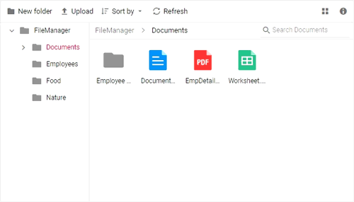

# Drag and Drop in Blazor File Manager Component

The File Manager allows files and folders to be moved within the file system by drag and dropping them. This support can be enabled or disabled using the [AllowDragAndDrop](https://help.syncfusion.com/cr/blazor/Syncfusion.Blazor.FileManager.SfFileManager-1.html#Syncfusion_Blazor_FileManager_SfFileManager_1_AllowDragAndDrop) property of the File Manager.

To disable multiple file selection and enable drag-drop operations in a Blazor File Manager component, check on this video.



```cshtml

@using Syncfusion.Blazor.FileManager

<SfFileManager AllowDragAndDrop="true" TValue="FileManagerDirectoryContent">
    <FileManagerAjaxSettings Url="https://ej2-aspcore-service.azurewebsites.net/api/FileManager/FileOperations"
                             UploadUrl="https://ej2-aspcore-service.azurewebsites.net/api/FileManager/Upload"
                             DownloadUrl="https://ej2-aspcore-service.azurewebsites.net/api/FileManager/Download"
                             GetImageUrl="https://ej2-aspcore-service.azurewebsites.net/api/FileManager/GetImage">
    </FileManagerAjaxSettings>
</SfFileManager>

```
## Output

After successful compilation of the application, simply press `F5` to run the application.



## Events

The File Manager component provides three key events that allow monitoring and controlling the drag and drop workflow. These events fire at different stages of the operation, enabling implementation of custom validation and business logic.

### OnFileDragStart Event

The [`OnFileDragStart`](https://help.syncfusion.com/cr/blazor/Syncfusion.Blazor.FileManager.FileManagerEvents-1.html#Syncfusion_Blazor_FileManager_FileManagerEvents_1_OnFileDragStart) event fires when the user initiates a drag operation on files or folders. This event can be used to validate dragged items or prevent specific files from being dragged by setting the `Cancel` property to **true**.

```cshtml
@using Syncfusion.Blazor.FileManager

<SfFileManager TValue="FileManagerDirectoryContent" AllowDragAndDrop="true">
    <FileManagerAjaxSettings Url="https://ej2-aspcore-service.azurewebsites.net/api/FileManager/FileOperations"
                             UploadUrl="https://ej2-aspcore-service.azurewebsites.net/api/FileManager/Upload"
                             DownloadUrl="https://ej2-aspcore-service.azurewebsites.net/api/FileManager/Download"
                             GetImageUrl="https://ej2-aspcore-service.azurewebsites.net/api/FileManager/GetImage">
    </FileManagerAjaxSettings>
    <FileManagerEvents TValue="FileManagerDirectoryContent" OnFileDragStart="OnFileDragStart">
    </FileManagerEvents>
</SfFileManager>

@code {
    public void OnFileDragStart(FileDragEventArgs<FileManagerDirectoryContent> args)
    {
        // Here, customize the code as needed.
    }
}
```

### OnFileDragStop Event

The [`OnFileDragStop`](https://help.syncfusion.com/cr/blazor/Syncfusion.Blazor.FileManager.FileManagerEvents-1.html#Syncfusion_Blazor_FileManager_FileManagerEvents_1_OnFileDragStop) event fires when the user is about to drop files or folders at the target location. This event allows to validate the target destination and cancel the operation if needed by setting `Cancel` to **true**.

```cshtml
@using Syncfusion.Blazor.FileManager

<SfFileManager TValue="FileManagerDirectoryContent" AllowDragAndDrop="true">
    <FileManagerAjaxSettings Url="https://ej2-aspcore-service.azurewebsites.net/api/FileManager/FileOperations"
                             UploadUrl="https://ej2-aspcore-service.azurewebsites.net/api/FileManager/Upload"
                             DownloadUrl="https://ej2-aspcore-service.azurewebsites.net/api/FileManager/Download"
                             GetImageUrl="https://ej2-aspcore-service.azurewebsites.net/api/FileManager/GetImage">
    </FileManagerAjaxSettings>
    <FileManagerEvents TValue="FileManagerDirectoryContent" OnFileDragStop="OnFileDragStop">
    </FileManagerEvents>
</SfFileManager>

@code {
    public void OnFileDragStop(FileDragEventArgs<FileManagerDirectoryContent> args)
    {
        // Here, customize the code as needed.
    }
}
```

### FileDropped Event

The [`FileDropped`](https://help.syncfusion.com/cr/blazor/Syncfusion.Blazor.FileManager.FileManagerEvents-1.html#Syncfusion_Blazor_FileManager_FileManagerEvents_1_FileDropped) event fires after a successful drag and drop operation. This event allows to execute post-operation actions after files or folders have been successfully moved.

```cshtml
@using Syncfusion.Blazor.FileManager

<SfFileManager TValue="FileManagerDirectoryContent" AllowDragAndDrop="true">
    <FileManagerAjaxSettings Url="https://ej2-aspcore-service.azurewebsites.net/api/FileManager/FileOperations"
                             UploadUrl="https://ej2-aspcore-service.azurewebsites.net/api/FileManager/Upload"
                             DownloadUrl="https://ej2-aspcore-service.azurewebsites.net/api/FileManager/Download"
                             GetImageUrl="https://ej2-aspcore-service.azurewebsites.net/api/FileManager/GetImage">
    </FileManagerAjaxSettings>
    <FileManagerEvents TValue="FileManagerDirectoryContent" FileDropped="FileDropped">
    </FileManagerEvents>
</SfFileManager>

@code {
    public void FileDropped(FileDragEventArgs<FileManagerDirectoryContent> args)
    {
        // Here, customize the code as needed.
    }
}
```
## Drag and Drop with Navigation Pane

The File Manager allows you to drag files and folders from the main layout area and drop them into folders displayed in the navigation pane. This feature provides an efficient way to organize and move files across different directory structures without navigating through multiple levels. When you drag an item from the file layout and hover over a folder in the navigation pane, that folder is highlighted to indicate it is a valid drop target. Release the mouse button to complete the move operation.

## Drag and Drop with Breadcrumb Navigation

The File Manager supports dragging and dropping files directly onto the breadcrumb navigation path. When you drag a file from the layout area and drop it on any folder in the breadcrumb path, the file is immediately moved to that target folder. This feature is particularly useful for moving files up the directory hierarchy or to sibling folders without extensive navigation through multiple directory levels.

For example, if you are currently viewing `~/Documents/Projects/2024`, you can drag a file and drop it directly on the breadcrumb segments like `Documents` or `Projects` to move the file to those locations. After the drop operation completes, the file is automatically placed in the appropriate folder according to your drop target selection. This seamless workflow significantly improves file management efficiency.

## Preventing Drag and Drop in the Drag Start Event

The `OnFileDragStart` event can be used to prevent dragging of specific folders. This is useful when you want to restrict users from moving specific files or folders. By setting the `Cancel` property to **true**, you can prevent the drag operation before it starts.

The following example demonstrates how to prevent dragging of the "Documents" folder:

```cshtml
@using Syncfusion.Blazor.FileManager

<SfFileManager TValue="FileManagerDirectoryContent" AllowDragAndDrop="true">
    <FileManagerAjaxSettings Url="https://ej2-aspcore-service.azurewebsites.net/api/FileManager/FileOperations"
                             UploadUrl="https://ej2-aspcore-service.azurewebsites.net/api/FileManager/Upload"
                             DownloadUrl="https://ej2-aspcore-service.azurewebsites.net/api/FileManager/Download"
                             GetImageUrl="https://ej2-aspcore-service.azurewebsites.net/api/FileManager/GetImage">
    </FileManagerAjaxSettings>
    <FileManagerEvents TValue="FileManagerDirectoryContent" OnFileDragStart="OnFileDragStart">
    </FileManagerEvents>
</SfFileManager>

@code {
    public void OnFileDragStart(FileDragEventArgs<FileManagerDirectoryContent> args)
    {
        if (args.FileDetails[0].Name == "Documents")
        {
            // Prevent dragging from the Documents folder
            args.Cancel = true;
        } 
    }
}
```

## Preventing Drag and Drop Based on Drop Target

The `OnFileDragStop` event fires just before the drop operation completes, allowing you to validate the target destination. This is useful when you want to prevent dropping files into specific folders based on business logic or permission rules. By setting the `Cancel` property to **true** in this event, you can cancel the drop operation at the target location.

The following example demonstrates how to prevent dropping items into the "Music" folder:

```cshtml
@using Syncfusion.Blazor.FileManager

<SfFileManager TValue="FileManagerDirectoryContent" AllowDragAndDrop="true">
    <FileManagerAjaxSettings Url="https://ej2-aspcore-service.azurewebsites.net/api/FileManager/FileOperations"
                             UploadUrl="https://ej2-aspcore-service.azurewebsites.net/api/FileManager/Upload"
                             DownloadUrl="https://ej2-aspcore-service.azurewebsites.net/api/FileManager/Download"
                             GetImageUrl="https://ej2-aspcore-service.azurewebsites.net/api/FileManager/GetImage">
    </FileManagerAjaxSettings>
    <FileManagerEvents TValue="FileManagerDirectoryContent" OnFileDragStop="OnFileDragStop">
    </FileManagerEvents>
</SfFileManager>

@code {
    public void OnFileDragStop(FileDragEventArgs<FileManagerDirectoryContent> args)
    {
        // Check the target folder path where items are being dropped
        if(args.DropTargetDetail.Name == "Music")
        {
            // Prevent dropping into the Music folder
            args.Cancel = true;
        }     
    }
}
```
