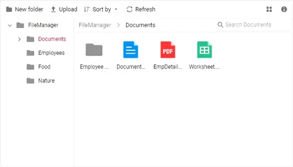

# Drag and Drop in Blazor File Manager

The Blazor File Manager allows files and folders to be moved within the file system by drag and dropping them. This support can be enabled or disabled using the [AllowDragAndDrop](https://help.syncfusion.com/cr/blazor/Syncfusion.Blazor.FileManager.SfFileManager-1.html#Syncfusion_Blazor_FileManager_SfFileManager_1_AllowDragAndDrop) property of the Blazor File Manager.

To disable multiple file selection and enable drag-drop operations in a Blazor File Manager component, you can check on this video.



The events which trigger when using drag and drop functionality are listed below.

* [`OnFileDragStart`](https://help.syncfusion.com/cr/blazor/Syncfusion.Blazor.FileManager.FileManagerEvents-1.html#Syncfusion_Blazor_FileManager_FileManagerEvents_1_OnFileDragStart) - Triggers when the file/folder dragging is started.
* [`OnFileDragStop`](https://help.syncfusion.com/cr/blazor/Syncfusion.Blazor.FileManager.FileManagerEvents-1.html#Syncfusion_Blazor_FileManager_FileManagerEvents_1_OnFileDragStop) - Triggers when the file/folder is about to be dropped at the target.
* [`FileDropped`](https://help.syncfusion.com/cr/blazor/Syncfusion.Blazor.FileManager.FileManagerEvents-1.html#Syncfusion_Blazor_FileManager_FileManagerEvents_1_FileDropped) - Triggers when the file/folder is dropped.

```cshtml

@using Syncfusion.Blazor.FileManager

<SfFileManager AllowDragAndDrop="true" TValue="FileManagerDirectoryContent">
    <FileManagerAjaxSettings  Url="/api/SampleData/FileOperations"
                                UploadUrl="/api/SampleData/Upload"
                                DownloadUrl="/api/SampleData/Download"
                                GetImageUrl="/api/SampleData/GetImage">
    </FileManagerAjaxSettings>
</SfFileManager>

```

## Output

After successful compilation of your application, simply press `F5` to run the application.



