# End User Capabilities in Blazor File Manager Component

The File Manager UI is comprised of several sections like View, Toolbar, Breadcrumb, Context Menu, and so on. The UI of the File Manager is enhanced with  `Details View` for browsing files and folders in a grid, `Navigation Pane` for folder navigation, and `Toolbar` for file operations. The File Manager with all features has the following sections in its UI.

* [Toolbar](#toolbar) (For direct access to file operations)
* [Context Menu](#context-menu) (For accessing file operations)
* [Navigation Pane](#navigation-pane) (For easy navigation between folders)
* [Breadcrumb](#breadcrumb) (For parent folder navigations)
* [Large icons view](#large-icons-view) (For browsing files and folders using large icon view)
* [Details view](#details-view) (For browsing files and folders using  details view)

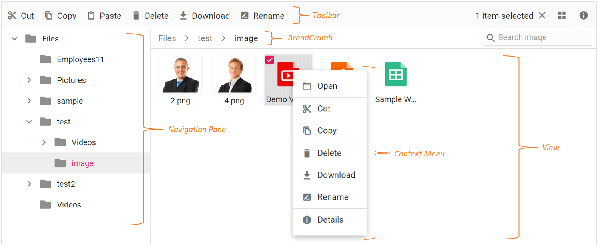

The basic File Manager is a light weight component with all the basic functions. The basic File Manager has the following sections in its UI to browse files and folders and manage them with file operations.

* [Breadcrumb](#breadcrumb) (For parent folder navigations)
* [Large icons view](#large-icons-view) (For browsing files and folders)
* [Context Menu](#context-menu) (For accessing file operations)

## Toolbar

The `Toolbar` provides easy access to the file operations using different buttons and it is presented at the top of the FileManager.

If the Toolbar items exceed the size of the Toolbar, then the exceeding Toolbar size will be moved to Toolbar popup with a dropdown button at the end of Toolbar.

Refer [Toolbar](./file-operations.md#toolbar) section in file operations to know more about the buttons present in Toolbar.

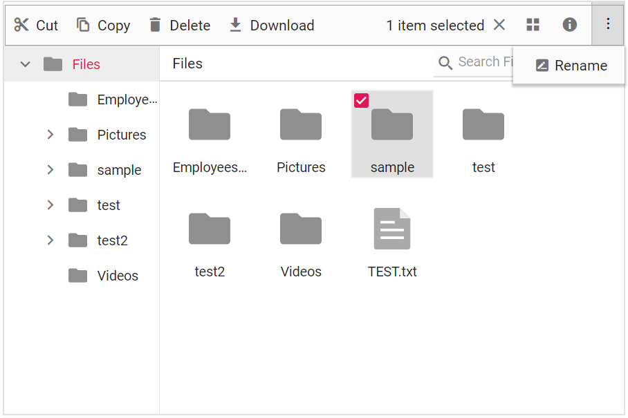

## Context Menu

The Context Menu appears on user interaction such as right-click. The File Manager is provided with Context Menu support to perform list of file operations with the files and folders. Context menu appears with varying menu items based on the targets such as file, folder (including navigation pane folders), and layout (empty area in view).

Context menu can be customized using the [ContextMenuSettings](https://help.syncfusion.com/cr/blazor/Syncfusion.Blazor.FileManager.FileManagerContextMenuSettings.html), [MenuOpened](https://help.syncfusion.com/cr/blazor/Syncfusion.Blazor.FileManager.FileManagerEvents-1.html#Syncfusion_Blazor_FileManager_FileManagerEvents_1_MenuOpened), and [OnMenuClick](https://help.syncfusion.com/cr/blazor/Syncfusion.Blazor.FileManager.FileManagerEvents-1.html#Syncfusion_Blazor_FileManager_FileManagerEvents_1_OnMenuClick) events.

Refer [Context Menu](https://blazor.syncfusion.com/documentation/file-manager/context-menu) section to know more about the menu items present in Context Menu.

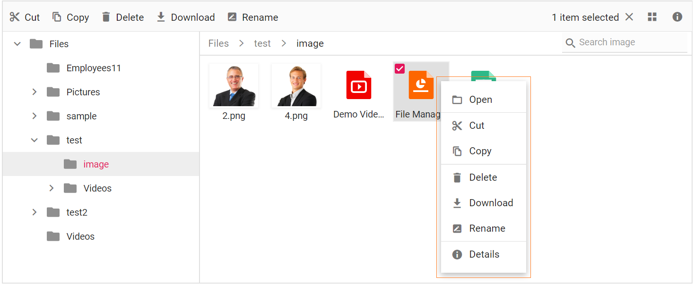

## Files and Folders Navigation

The File Manager provides navigation between files and folders using the following two options.

* [Navigation Pane](#navigation-pane)
* [Breadcrumb](#breadcrumb)

### Navigation Pane

The navigation pane displays the folder hierarchy of the file system and provides easy navigation to the desired folder. Using [NavigationPaneSettings](https://help.syncfusion.com/cr/blazor/Syncfusion.Blazor.FileManager.FileManagerNavigationPaneSettings.html), minimum and maximum width of the navigation pane can be changed. The navigation pane can be shown or hidden using the [Visible](https://help.syncfusion.com/cr/blazor/Syncfusion.Blazor.FileManager.FileManagerNavigationPaneSettings.html#Syncfusion_Blazor_FileManager_FileManagerNavigationPaneSettings_Visible) option in the [NavigationPaneSettings](https://help.syncfusion.com/cr/blazor/Syncfusion.Blazor.FileManager.FileManagerNavigationPaneSettings.html).

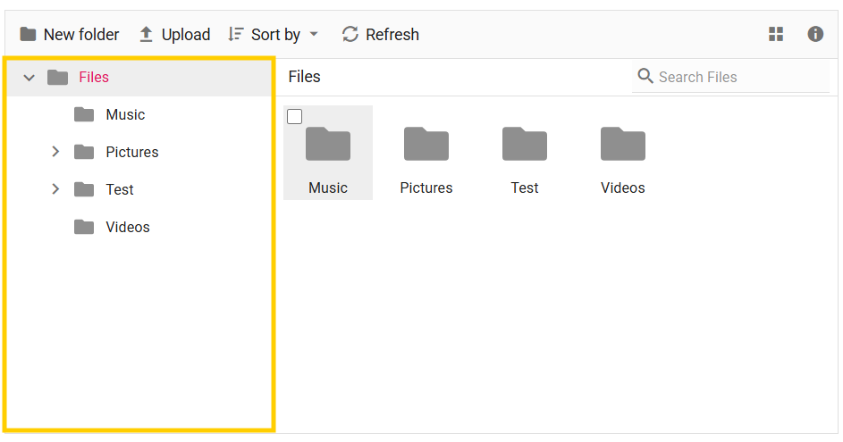

### BreadCrumb

The File Manager provides breadcrumb for navigating to the parent folders. The breadcrumb in the File Manager is responsible for resizing. Whenever the path length exceeds the breadcrumb length, a dropdown button will be added at the starting of the breadcrumb to hold the parent folders adjacent to root.

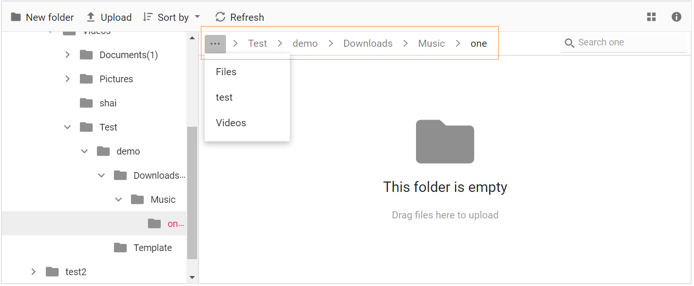

## Large Icons View

The `Large Icons View` is the default starting view in the FileManager. The view can be changed by using the [Toolbar](#toolbar) view button or by using the view menu in [Context Menu](#context-menu). The [View](https://help.syncfusion.com/cr/blazor/Syncfusion.Blazor.FileManager.SfFileManager-1.html#Syncfusion_Blazor_FileManager_SfFileManager_1_View) API can also be used to change the initial view of the FileManager.

In the large icons view, the thumbnail icons will be shown in a larger size, which displays the data in a form that best suits their content. For image and video type files, a **preview** will be displayed. Extension thumbnails will be displayed for other type files.

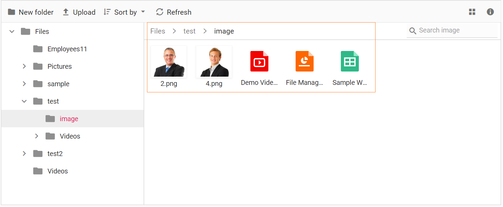

## Details View

In the details view, the files are displayed in a sorted list order. This file list comprises of several columns of information about the files such as **Name**, **Date Modified**, **Type**, and **Size**. Each file has its own small icon representing the file type. Additional columns can be added using [DetailsViewSettings](https://help.syncfusion.com/cr/blazor/Syncfusion.Blazor.FileManager.FileManagerDetailsViewSettings.html) API. The details view allows you to perform sorting using column header.

## File Operations

The Blazor File Manager component is utilized for browsing, managing, and organizing files and folders in a file system through a web application. It offers all essential file operations, including creating new folders, uploading and downloading files, deleting and renaming existing files and folders, as well as previewing image files. 

Moreover, the table below displays the basic operations in the File Manager component and their corresponding functions.

|Operation Name|Function|
|----|----|
|read|Read the details of files or folders available in the given path from the file system, to display the files for the user to browse the content.|
|create|Creates a new folder in the current path of the file system.|
|delete|Removes the file or folder from the file server.|
|rename|Rename the selected file or folder in the file system.|
|search|Searches for items matching the search string in the current and child directories.|
|details|Gets the detail of the selected item(s) from the file server.|
|copy|Copy the selected file or folder in the file system.|
|move|Cut the selected file or folder in the file server.|
|upload|Upload files to the current path or directory in the file system.|
|download|Downloads the file from the server and the multiple files can be downloaded as ZIP files.|

N> The *CreateFolder*, *Remove*, and *Rename* actions will be reflected in the File Manager only after the successful response from the server.

### File and Folder Selection 

In the Blazor File Manager component, you can select files and folders using the mouse click and arrow keys. The File Manager allows you to select multiple files and folders by enabling the [AllowMultiSelection](https://help.syncfusion.com/cr/blazor/Syncfusion.Blazor.FileManager.SfFileManager-1.html#Syncfusion_Blazor_FileManager_SfFileManager_1_AllowMultiSelection) property, which is enabled by default. 

You can perform multiple selections by pressing the Ctrl key or Shift key and selecting the files and folders, or by using the checkbox. To select all files in the current directory, you can use the Ctrl + A shortcut. 

The [FileSelected](https://help.syncfusion.com/cr/blazor/Syncfusion.Blazor.FileManager.FileManagerEvents-1.html#Syncfusion_Blazor_FileManager_FileManagerEvents_1_FileSelected) event will be triggered when an item in the File Manager control is selected or unselected.

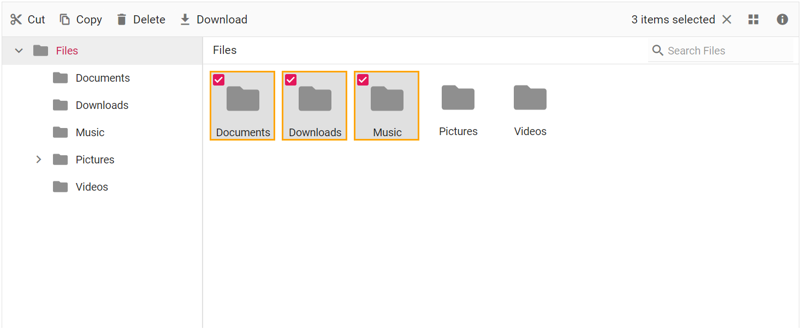

### Create, Rename, Delete a File or Folder

In the Blazor File Manager component, you can perform the [**create**](https://blazor.syncfusion.com/documentation/file-manager/file-operations#creating-files-and-folders), [**rename**](https://blazor.syncfusion.com/documentation/file-manager/file-operations#renaming-files-and-folders), and [**delete**](https://blazor.syncfusion.com/documentation/file-manager/file-operations#deleting-files-and-folders) operation for the files and folder with the help of the Toolbar items button or by using Context Menu items.

Refer to the [Toolbar](./file-operations.md#toolbar) and [Context Menu](./context-menu.md#context-menu-in-blazor-filemanager-component) sections to learn more about the items that are present in the Toolbar and Context Menu.

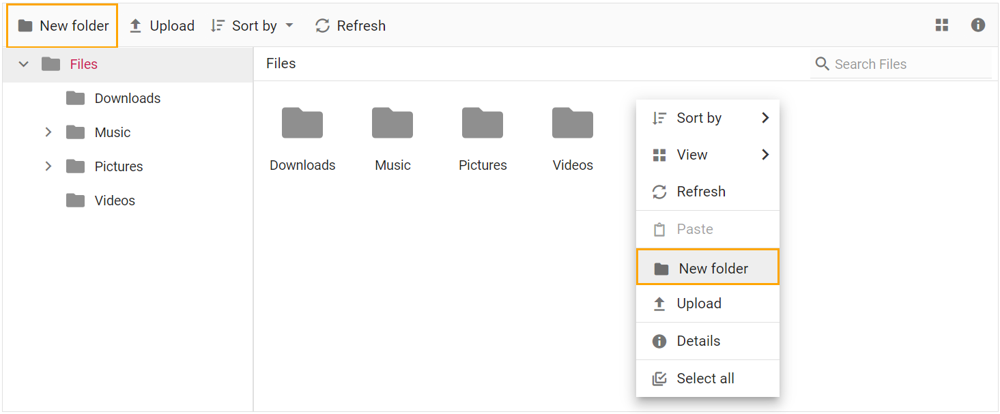

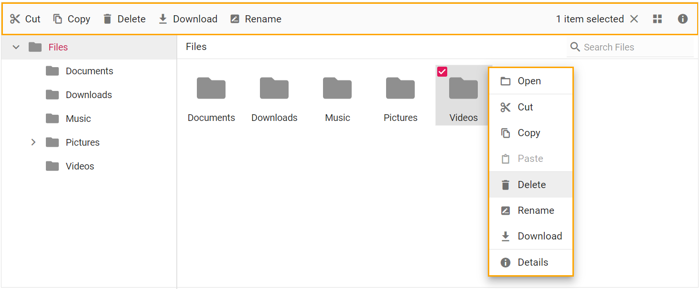

### Moving File or Folder

In the Blazor File Manager component, you can [**move**](https://blazor.syncfusion.com/documentation/file-manager/file-operations#moving-files-and-folders) desired files or folders by using the **cut** or **copy** items button in the Toolbar, or by using the Context Menu. Additionally, you can move files or folders by utilizing the drag and drop functionality, which requires enabling the [AllowDragAndDrop](https://help.syncfusion.com/cr/blazor/Syncfusion.Blazor.FileManager.SfFileManager-1.html#Syncfusion_Blazor_FileManager_SfFileManager_1_AllowDragAndDrop) property to **true**. 

To learn more, you can refer to the [Toolbar](https://blazor.syncfusion.com/documentation/file-manager/toolbar), [Context Menu](https://blazor.syncfusion.com/documentation/file-manager/context-menu), and [Drag and Drop](https://blazor.syncfusion.com/documentation/file-manager/drag-and-drop) sections.

### Upload or Download a File

In the Blazor File Manager component, you can perform the [upload](https://blazor.syncfusion.com/documentation/file-manager/file-operations#uploading-files) or [download](https://blazor.syncfusion.com/documentation/file-manager/file-operations#downloading-files) operations with the help of the Toolbar items button or by using Context Menu items.

Refer to the [Toolbar](https://blazor.syncfusion.com/documentation/file-manager/file-operations#toolbar) and [Context Menu](https://blazor.syncfusion.com/documentation/file-manager/context-menu) sections to learn more about the items that are present in the Toolbar and Context Menu.

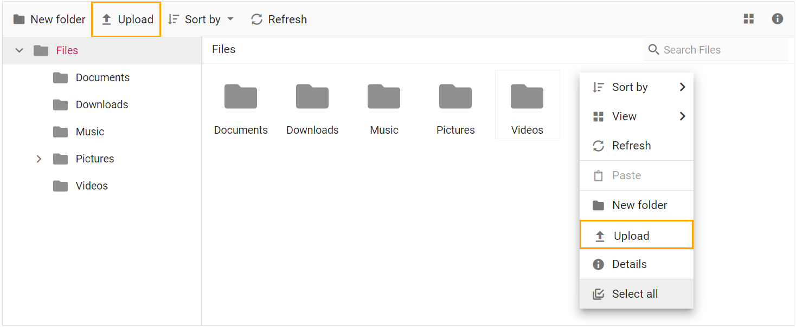

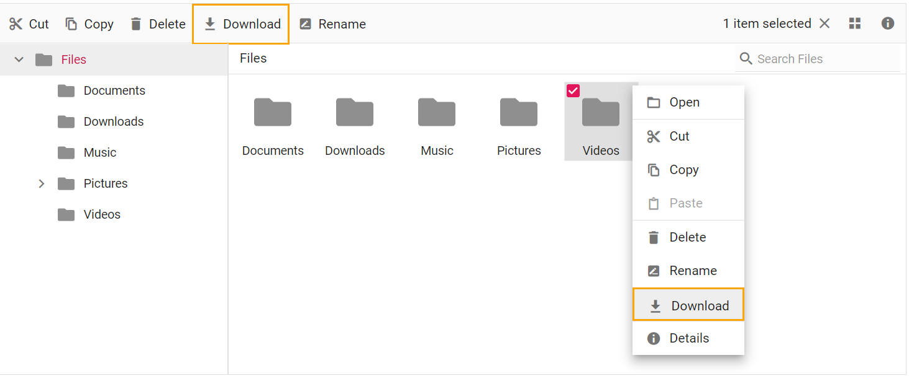

### Searching Files and Folders

In the Blazor File Manager component, you are able to [search](https://blazor.syncfusion.com/documentation/file-manager/file-operations#searching-files-and-folders) for the wanted files and folders using the default input search functionality option.

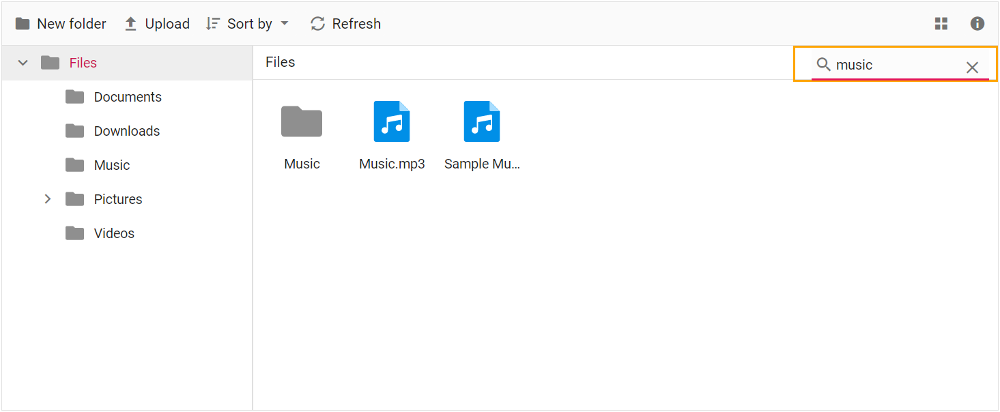

### Cut, Copy, and Paste

You can perform the **cut**, **copy**(https://blazor.syncfusion.com/documentation/file-manager/file-operations#copying-files-and-folders), and **paste** operation for the files and folders in the Blazor File Manager component with the help of the Toolbar items button or by using Context Menu items.

Refer to the [Toolbar](https://blazor.syncfusion.com/documentation/file-manager/file-operations#toolbar)and [Context Menu](https://blazor.syncfusion.com/documentation/file-manager/context-menu) sections to learn more about the items that are present in the Toolbar and Context Menu.

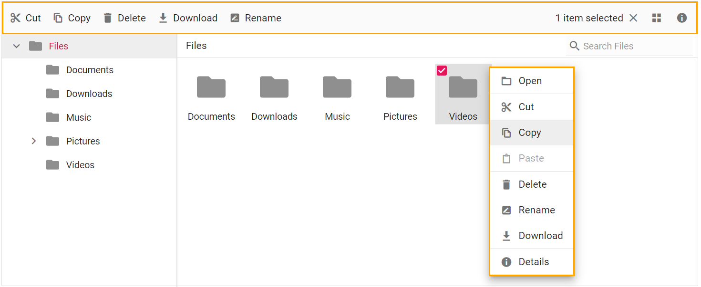