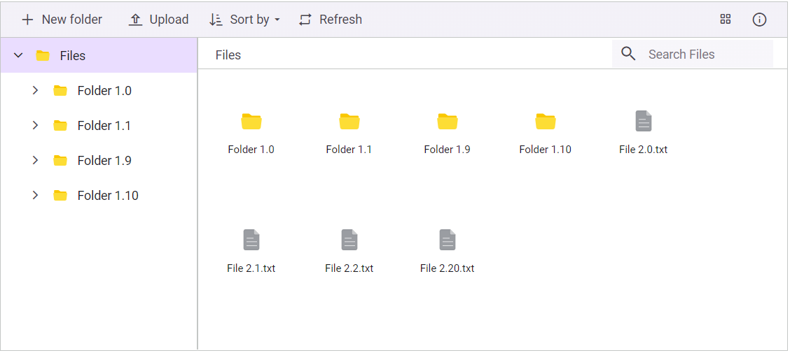

# Create a File Manager Sample in Blazor

Start by following the steps provided in this [link](https://blazor.syncfusion.com/documentation/file-manager/getting-started-with-web-app) to create a simple `File Manager` sample in Blazor. Additionally, to perform the file operations, initialize the `Url` properties in a [FileManagerAjaxSettings](https://help.syncfusion.com/cr/blazor/Syncfusion.Blazor.FileManager.FileManagerAjaxSettings.html#properties) based on the local file provider you are using.

N> To learn more, refer to this [link](https://blazor.syncfusion.com/documentation/file-manager/file-system-provider) to map the appropriate [FileManagerAjaxSettings](https://help.syncfusion.com/cr/blazor/Syncfusion.Blazor.FileManager.FileManagerAjaxSettings.html#properties) `Url`   properties based on the service provider you are using. Additionally, if you are using cloud storage service providers, you can also check out the [link](https://blazor.syncfusion.com/documentation/file-manager/file-system-provider) on how to register and create a storage account based on the provider you are using.

## Request and Response Contents Format in Blazor FileManager component

The following table represents the contents of *data, cwd, and files* in the file manager request and response.

|Parameter|Type|Default|Explanation|
|----|----|----|----|
|name|String|-|File name|
|dateCreated|String|-|Date in which file was created (UTC Date string).|
|dateModified|String|-|Date in which file was last modified (UTC Date string).|
|filterPath|String|-|Relative path to the file or folder.|
|hasChild|Boolean|-|Defines this folder has any child folder or not.|
|isFile|Boolean|-|Say whether the item is file or folder.|
|size|Number|-|File size|
|type|String|-|File extension|

The following table represents the contents of *error* in the file manager request and response.

|Parameter|Type|Default|Explanation|
|----|----|----|----|
|code|String|-|Error code|
|message|String|-|Error message|
|fileExists|String[]|-|List of duplicate file names|

The following table represents the contents of *details* in the file manager request and response.

|Parameter|Type|Default|Explanation|
|----|----|----|----|
|name|String|-|File name|
|dateCreated|String|-|Date in which file was created (UTC Date string).|
|dateModified|String|-|Date in which file was last modified (UTC Date string).|
|filterPath|String|-|Relative path to the file or folder.|
|hasChild|Boolean|-|Defines this folder has any child folder or not.|
|isFile|Boolean|-|Say whether the item is file or folder.|
|size|Number|-|File size|
|type|String|-|File extension|
|multipleFiles|Boolean|-|Say whether the details are about single file or multiple files.|

## Read operation from ASP.NET Core file system provider

To perform a read operation in Syncfusion Blazor File Manager component from ASP.NET Core physical file system provider, you can follow the steps below.


**Step 1:** Initialize the physical service in controller

To initialize a local service with read action, create a new folder name with `Controllers` inside the server part of the project. Then, create a new file with extension `.cs` inside the Controllers folder and add the following code in that file.




using Microsoft.AspNetCore.Mvc;
using System;
using System.Collections.Generic;
using Microsoft.AspNetCore.Hosting;
using Microsoft.AspNetCore.Http;
using Microsoft.AspNetCore.Http.Features;
//File Manager's base functions are available in the below namespace.
using Syncfusion.EJ2.FileManager.Base;
//File Manager's operations are available in the below namespace.
using Syncfusion.EJ2.FileManager.PhysicalFileProvider;
using Newtonsoft.Json;
using System.Linq;
using System.Threading.Tasks;

namespace filemanager.Server.Controllers
{
    [Route("api/[controller]")]
    public class SampleDataController : Controller
    {
        public PhysicalFileProvider operation;
        public string basePath;
        string root = "wwwroot\\Files";
        [Obsolete]
        public SampleDataController(IHostingEnvironment hostingEnvironment)
        {
            this.basePath = hostingEnvironment.ContentRootPath;
            this.operation = new PhysicalFileProvider();
            this.operation.RootFolder(this.basePath + "\\" + this.root); // It denotes in which files and folders are available.
        }

        // Processing the File Manager operations.
        [Route("FileOperations")]
        public object FileOperations([FromBody] FileManagerDirectoryContent args)
        {
            switch (args.Action)
            {
                // Add your custom action here.
                case "read":
                    // Path - Current path; ShowHiddenItems - Boolean value to show/hide hidden items.
                    return this.operation.ToCamelCase(this.operation.GetFiles(args.Path, args.ShowHiddenItems));
                ...
            }
            return null;
        }
    }
}




**Step 2:** Access read response from model

To access the read operation, you need physical model class files that have read operation methods. So, create `Models` folder in `server` part of the application and include the `PhysicalFileProvider.cs` and required base class from the [link](https://github.com/SyncfusionExamples/ej2-aspcore-file-provider/tree/master/Models) in the Models folder.

In the following example, the **Read** operation is handled from physical service.




using System;
using System.Collections.Generic;
using System.IO;
using System.IO.Compression;
using System.Linq;
using System.Text.RegularExpressions;
using Syncfusion.EJ2.FileManager.Base;
using System.Text.Json;
using Microsoft.AspNetCore.Mvc;
using Microsoft.AspNetCore.Http;
using Microsoft.Net.Http.Headers;


namespace Syncfusion.EJ2.FileManager.PhysicalFileProvider
{
    public class PhysicalFileProvider 
    {
        protected string contentRootPath;
        protected string[] allowedExtension = new string[] { "*" };
        AccessDetails AccessDetails = new AccessDetails();
        private string rootName = string.Empty;
        protected string hostPath;
        protected string hostName;
        private string accessMessage = string.Empty;

        public PhysicalFileProvider()
        {
        }

        public void RootFolder(string name)
        {
            this.contentRootPath = name;
            this.hostName = new Uri(contentRootPath).Host;
            if (!string.IsNullOrEmpty(this.hostName))
            {
                this.hostPath = Path.DirectorySeparatorChar + this.hostName + Path.DirectorySeparatorChar + contentRootPath.Substring((contentRootPath.ToLower().IndexOf(this.hostName) + this.hostName.Length + 1));
            }
        }

        public virtual FileManagerResponse GetFiles(string path, bool showHiddenItems, params FileManagerDirectoryContent[] data)
        {
            FileManagerResponse readResponse = new FileManagerResponse();
            try
            {
                if (path == null)
                {
                    path = string.Empty;
                }
                String fullPath = (contentRootPath + path);
                DirectoryInfo directory = new DirectoryInfo(fullPath);
                string[] extensions = this.allowedExtension;
                FileManagerDirectoryContent cwd = new FileManagerDirectoryContent();
                string rootPath = string.IsNullOrEmpty(this.hostPath) ? this.contentRootPath : new DirectoryInfo(this.hostPath).FullName;
                string parentPath = string.IsNullOrEmpty(this.hostPath) ? directory.Parent.FullName : new DirectoryInfo(this.hostPath + (path != "/" ? path : "")).Parent.FullName;
                if(Path.GetFullPath(fullPath)!= GetFilePath(fullPath))
                {
                    throw new UnauthorizedAccessException("Access denied for Directory-traversal");
                }
                cwd.Name = string.IsNullOrEmpty(this.hostPath) ? directory.Name : new DirectoryInfo(this.hostPath + path).Name;
                cwd.Size = 0;
                cwd.IsFile = false;
                cwd.DateModified = directory.LastWriteTime;
                cwd.DateCreated = directory.CreationTime;
                cwd.HasChild = CheckChild(directory.FullName);
                cwd.Type = directory.Extension;
                cwd.FilterPath = GetRelativePath(rootPath, parentPath + Path.DirectorySeparatorChar);
                cwd.Permission = GetPathPermission(path);
                readResponse.CWD = cwd;
                if (!hasAccess(directory.FullName) || (cwd.Permission != null && !cwd.Permission.Read))
                {
                    readResponse.Files = null;
                    accessMessage = cwd.Permission.Message;
                    throw new UnauthorizedAccessException("'" + cwd.Name + "' is not accessible. You need permission to perform the read action.");
                }
                readResponse.Files = ReadDirectories(directory, extensions, showHiddenItems, data);
                readResponse.Files = readResponse.Files.Concat(ReadFiles(directory, extensions, showHiddenItems, data));
                return readResponse;
            }
            catch (Exception e)
            {
                ErrorDetails er = new ErrorDetails();
                er.Message = e.Message.ToString();
                er.Code = er.Message.Contains("is not accessible. You need permission") ? "401" : "417";
                if ((er.Code == "401") && !string.IsNullOrEmpty(accessMessage)) { er.Message = accessMessage; }
                readResponse.Error = er;
                return readResponse;
            }
        }
        ...
    }

}




## Read operation from ASP.NET Core Azure cloud file system provider

To perform a read operation in Syncfusion Blazor File Manager component from the ASP.NET Core Azure cloud file system provider, you can follow the steps below.

**Step 1:** Initialize the Azure cloud file system provider in controller

To initialize a local service with read action, create a new folder name with `Controllers` inside the server part of the project. Then, create a new file with extension `.cs` inside the Controllers folder and add the following code in that file.




using System;
using Microsoft.AspNetCore.Cors;
using Microsoft.AspNetCore.Hosting;
using Microsoft.AspNetCore.Http;
using Microsoft.AspNetCore.Http.Features;
using Microsoft.AspNetCore.Mvc;
using Newtonsoft.Json;
using Newtonsoft.Json.Serialization;
using Syncfusion.EJ2.FileManager.Base;
using Syncfusion.EJ2.FileManager.AzureFileProvider;
using System.Collections.Generic;

namespace EJ2AzureASPCoreFileProvider.Controllers
{
    [Route("api/[controller]")]
    [EnableCors("AllowAllOrigins")]
    public class AzureProviderController : Controller
    {
        public AzureFileProvider operation;
        public string blobPath { get; set; }
        public string filePath { get; set; }
        public AzureProviderController(IWebHostEnvironment hostingEnvironment)
        {
            this.operation = new AzureFileProvider();
            blobPath = "<--blobPath-->";
            filePath = "<--filePath-->";
            blobPath = blobPath.Replace("../", "");
            filePath = filePath.Replace("../", "");
            blobPath = (blobPath.Substring(blobPath.Length - 1) != "/") ? blobPath + "/" : blobPath.TrimEnd(new[] { '/', '\\' }) + "/";
            filePath = (filePath.Substring(filePath.Length - 1) == "/") ? filePath.TrimEnd(new[] { '/', '\\' }) : filePath;
            this.operation.SetBlobContainer(blobPath, filePath);            
            this.operation.RegisterAzure("<--accountName-->", "<--accountKey-->", "<--blobName-->");
            //----------
            //For example 
            //this.operation.setBlobContainer("https://azure_service_account.blob.core.windows.net/files/", "https://azure_service_account.blob.core.windows.net/files/Files");
            //this.operation.RegisterAzure("azure_service_account", "xxxxxxxxxxxxxxxxxxxxxxxxxxxxxxxxxxxxxxxxxxxxxxxxxxxxxxxxxxxx", "files");
            //---------
        }
        [HttpPost("AzureFileOperations")]
        public object AzureFileOperations([FromBody] FileManagerDirectoryContent args)
        {
            ...
            switch (args.Action)
            {
                case "read":
                    // Reads the file(s) or folder(s) from the given path.
                    return this.ToCamelCase(this.operation.GetFiles(args.Path, args.ShowHiddenItems, args.Data));
                ...
            }
            return null;
        }
        ...
    }

}




**Step 2:** Access read response from model

To access the read operation, you need Azure model class files that have read operation methods. So, create `Models` folder in `server` part of the application and include the `AzureFileProvider.cs` and required File Manager's base functions are available in this `using Syncfusion.EJ2.FileManager.Base` namespace.

In the following example, the **Read** operation is handled from the Azure cloud file system provider.




using System;
using System.Collections.Generic;
using System.IO;
using System.IO.Compression;
using System.Net;
using System.Linq;
using System.Text.RegularExpressions;
using System.Threading.Tasks;
using Microsoft.AspNetCore.Http;
using Microsoft.AspNetCore.Mvc;
using Azure.Storage;
using Azure.Storage.Blobs;
using Azure.Storage.Blobs.Models;
using Syncfusion.EJ2.FileManager.Base;
using System.Text;

namespace Syncfusion.EJ2.FileManager.AzureFileProvider
{
    public class AzureFileProvider : IAzureFileProviderBase
    {

        BlobContainerClient container;
        string blobPath;
        string filesPath;
        static string rootPath;
        ...

        // Registering the azure storage 
        public void RegisterAzure(string accountName, string accountKey, string blobName)
        {
            container = new BlobServiceClient(new Uri(blobPath.Substring(0, blobPath.Length - blobName.Length - 1)), new StorageSharedKeyCredential(accountName, accountKey), null).GetBlobContainerClient(blobName);
            
        }

        // Sets blob and file path
        public void SetBlobContainer(string blob_Path, string file_Path)
        {
            blobPath = blob_Path;
            filesPath = file_Path;
            rootPath = filesPath.Replace(blobPath, "");
        }
        ...

        // Reads the storage 
        public FileManagerResponse GetFiles(string path, bool showHiddenItems, FileManagerDirectoryContent[] selectedItems)
        {
            return GetFilesAsync(path, "*.*", selectedItems).GetAwaiter().GetResult();
        }

        // Reads the storage files
        protected async Task<FileManagerResponse> GetFilesAsync(string path, string filter, FileManagerDirectoryContent[] selectedItems)
        {
            FileManagerResponse readResponse = new FileManagerResponse();
            List<string> prefixes = new List<string>() { };
            List<FileManagerDirectoryContent> details = new List<FileManagerDirectoryContent>();
            FileManagerDirectoryContent cwd = new FileManagerDirectoryContent();
            try
            {
                var blobPages = container.GetBlobsAsync(prefix: path).AsPages().GetAsyncEnumerator();
                await blobPages.MoveNextAsync();
                bool directoryExists = blobPages.Current.Values.Count() > 0;
                if (!directoryExists) {
                    ErrorDetails er = new ErrorDetails();
                    er.Message = "Could not find a part of the path " + "'" + path + "'" + ".";
                    er.Code = "417";
                    readResponse.Error = er;
                    return readResponse;
                }
                string[] extensions = ((filter.Replace(" ", "")) ?? "*").Split(",|;".ToCharArray(), StringSplitOptions.RemoveEmptyEntries);
                cwd.Name = selectedItems.Length > 0 ? selectedItems[0].Name : path.TrimEnd('/');
                var sampleDirectory = container.GetBlobClient(path);
                cwd.Type = "File Folder";
                cwd.FilterPath = selectedItems.Length > 0 ? selectedItems[0].FilterPath : "";
                cwd.Size = 0;
                cwd.Permission = GetPathPermission(path, false);
                foreach (Azure.Page<BlobHierarchyItem> page in container.GetBlobsByHierarchy(prefix: path, delimiter: "/").AsPages())
                {
                    foreach (BlobItem item in page.Values.Where(item => item.IsBlob).Select(item => item.Blob))
                    {
                        bool includeItem = true;
                        if (!(extensions[0].Equals("*.*") || extensions[0].Equals("*")))
                        {
                            if (!(Array.IndexOf(extensions, "*." + (item.Name.ToString().Trim().Split('.'))[item.Name.ToString().Trim().Split('.').Length - 1]) >= 0))
                                includeItem = false;
                        }
                        if (includeItem)
                        {
                            FileManagerDirectoryContent entry = new FileManagerDirectoryContent();
                            entry.Name = item.Name.Replace(path, "");
                            entry.Type = System.IO.Path.GetExtension(item.Name.Replace(path, ""));
                            entry.IsFile = true;
                            entry.Size = item.Properties.ContentLength.Value;
                            entry.DateModified = item.Properties.LastModified.Value.LocalDateTime;
                            entry.HasChild = false;
                            entry.FilterPath = selectedItems.Length > 0 ? path.Replace(rootPath, "") : "/";
                            entry.Permission = GetPermission(item.Name.Replace(entry.Name, ""), entry.Name, true);
                            details.Add(entry);
                        }
                    }
                    foreach (string item in page.Values.Where(item => item.IsPrefix).Select(item => item.Prefix))
                    {
                        bool includeItem = true;

                        if (includeItem)
                        {
                            FileManagerDirectoryContent entry = new FileManagerDirectoryContent();
                            string directory = item;
                            entry.Name = directory.Replace(path, "").Replace("/", "");
                            entry.Type = "Directory";
                            entry.IsFile = false;
                            entry.Size = 0;
                            entry.HasChild = await HasChildDirectory(directory);
                            entry.FilterPath = selectedItems.Length > 0 ? path.Replace(rootPath, "") : "/";
                            entry.DateModified = await DirectoryLastModified(directory);
                            entry.Permission = GetPathPermission(directory, false);
                            lastUpdated = prevUpdated = DateTime.MinValue;
                            details.Add(entry);
                        }
                    }
                    prefixes = page.Values.Where(item => item.IsPrefix).Select(item => item.Prefix).ToList();
                }
                cwd.HasChild = prefixes?.Count != 0;
                readResponse.CWD = cwd;
            }
            catch (Exception)
            {
                return readResponse;
            }
            try
            {
                if ((cwd.Permission != null && !cwd.Permission.Read))
                {
                    readResponse.Files = null;
                    accessMessage = cwd.Permission.Message;
                    throw new UnauthorizedAccessException("'" + cwd.Name + "' is not accessible. You need permission to perform the read action.");
                }
            }
            catch (Exception e)
            {
                ErrorDetails er = new ErrorDetails();
                er.Message = e.Message.ToString();
                er.Code = er.Message.Contains("is not accessible. You need permission") ? "401" : "417";
                if ((er.Code == "401") && !string.IsNullOrEmpty(accessMessage)) { er.Message = accessMessage; }
                readResponse.Error = er;
                return readResponse;
            }
            readResponse.Files = details;
            return readResponse;
        }
        ...
    }
}




## Read operation from ASP.NET Core Amazon S3 cloud file provider

To perform a read operation in Syncfusion Blazor File Manager component from the ASP.NET Core Amazon S3 cloud file provider, you can follow the steps below.


**Step 1:** Initialize the Amazon S3 cloud file provider in controller

To initialize a local service with read action, create a new folder name with `Controllers` inside the server part of the project. Then, create a new file with extension `.cs` inside the Controllers folder and add the following code in that file.




using Syncfusion.EJ2.FileManager.AmazonS3FileProvider;
using Microsoft.AspNetCore.Cors;
using Microsoft.AspNetCore.Hosting;
using Microsoft.AspNetCore.Http;
using Microsoft.AspNetCore.Http.Features;
using Microsoft.AspNetCore.Mvc;
using Newtonsoft.Json;
using System;
using System.Collections.Generic;
using Syncfusion.EJ2.FileManager.Base;
using Amazon;

namespace EJ2AmazonS3ASPCoreFileProvider.Controllers
{

    [Route("api/[controller]")]
    [EnableCors("AllowAllOrigins")]
    public class AmazonS3ProviderController : Controller
    {
        public AmazonS3FileProvider operation;
        public string basePath;
        protected RegionEndpoint bucketRegion;
        public AmazonS3ProviderController(IWebHostEnvironment hostingEnvironment)
        {
            this.basePath = hostingEnvironment.ContentRootPath;
            this.basePath = basePath.Replace("../", "");
            this.operation = new AmazonS3FileProvider();
            this.operation.RegisterAmazonS3("<---bucketName--->", "<---awsAccessKeyId--->", "<---awsSecretAccessKey--->", "<---region--->");
        }
        [Route("AmazonS3FileOperations")]
        public object AmazonS3FileOperations([FromBody] FileManagerDirectoryContent args)
        {
            ...
            switch (args.Action)
            {
                case "read":
                    // reads the file(s) or folder(s) from the given path.
                    return this.operation.ToCamelCase(this.operation.GetFiles(args.Path, false, args.Data));
                ...
            }
            return null;
        }
        ...
    }

}




**Step 2:** Access read response from model

To access the read operation, you need Amazon S3 model class files that have read operation methods. So, create `Models` folder in `server` part of the application and include the `AmazonS3FileProvider.cs` and required File Manager's base functions are available in this `using Syncfusion.EJ2.FileManager.Base` namespace.

In the following example, the **Read** operation is handled from the Amazon S3 cloud service.




using System;
using System.Collections.Generic;
using System.IO;
using System.IO.Compression;
using System.Linq;
using System.Text.RegularExpressions;
using Syncfusion.EJ2.FileManager.Base;
using System.Text.Json;
using Microsoft.AspNetCore.Mvc;
using Microsoft.AspNetCore.Http;
using Microsoft.Net.Http.Headers;


namespace Syncfusion.EJ2.FileManager.AmazonS3FileProvider
{
    public class AmazonS3FileProvider : IAmazonS3FileProviderBase
    {
        protected static string bucketName;
        static IAmazonS3 client;
        ...

        // Register the amazon client details
        public void RegisterAmazonS3(string name, string awsAccessKeyId, string awsSecretAccessKey, string region)
        {
            bucketName = name;
            RegionEndpoint bucketRegion = RegionEndpoint.GetBySystemName(region);
            client = new AmazonS3Client(awsAccessKeyId, awsSecretAccessKey, bucketRegion);
            GetBucketList();
        }
        ...

         // Reads the file(s) and folder(s)
        public FileManagerResponse GetFiles(string path, bool showHiddenItems, params FileManagerDirectoryContent[] data)
        {
            FileManagerDirectoryContent cwd = new FileManagerDirectoryContent();
            List<FileManagerDirectoryContent> files = new List<FileManagerDirectoryContent>();
            List<FileManagerDirectoryContent> filesS3 = new List<FileManagerDirectoryContent>();
            FileManagerResponse readResponse = new FileManagerResponse();
            GetBucketList();
            try
            {
                if (path == "/") ListingObjectsAsync("/", RootName , false).Wait(); else ListingObjectsAsync("/", this.RootName.Replace("/", "") + path, false).Wait();
                if (path == "/")
                {
                    FileManagerDirectoryContent[] s = response.S3Objects.Where(x => x.Key == RootName).Select(y => CreateDirectoryContentInstance(y.Key.ToString().Replace("/", ""), false, "Folder", y.Size, y.LastModified, y.LastModified, this.checkChild(y.Key), string.Empty)).ToArray();
                    if (s.Length > 0) cwd = s[0];
                }
                else
                    cwd = CreateDirectoryContentInstance(path.Split("/")[path.Split("/").Length - 2], false, "Folder", 0, DateTime.Now, DateTime.Now, (response.CommonPrefixes.Count > 0) ? true : false, path.Substring(0, path.IndexOf(path.Split("/")[path.Split("/").Length - 2])));
            }
            catch (Exception ex) { throw ex; }
            try
            {
                if (response.CommonPrefixes.Count > 0) {
                    files = response.CommonPrefixes.Select((y, i) => CreateDirectoryContentInstance(getFileName(response.CommonPrefixes[i], path), false, "Folder", 0, DateTime.Now, DateTime.Now, this.checkChild(response.CommonPrefixes[i]), getFilePath(y))).ToList();
                }
            }
            catch (Exception ex) { throw ex; }
            try
            {
                if (path == "/") ListingObjectsAsync("/", RootName, false).Wait(); else ListingObjectsAsync("/", this.RootName.Replace("/", "") + path, false).Wait();
                if (response.S3Objects.Count > 0)
                    filesS3 = response.S3Objects.Where(x => x.Key != RootName.Replace("/", "") + path).Select(y => CreateDirectoryContentInstance(y.Key.ToString().Replace(RootName.Replace("/", "") + path, "").Replace("/", ""), true, Path.GetExtension(y.Key.ToString()), y.Size, y.LastModified, y.LastModified, this.checkChild(y.Key), getFilterPath(y.Key, path))).ToList();
            }
            catch (Exception ex) { throw ex; }
            if (filesS3.Count != 0) files = files.Union(filesS3).ToList();
            readResponse.CWD = cwd;
            try
            {
                if ((cwd.Permission != null && !cwd.Permission.Read))
                {
                    readResponse.Files = null;
                    accessMessage = cwd.Permission.Message;
                    throw new UnauthorizedAccessException("'" + cwd.Name + "' is not accessible. You need permission to perform the read action.");
                }
            }
            catch (Exception e)
            {
                ErrorDetails er = new ErrorDetails();
                er.Message = e.Message.ToString();
                er.Code = er.Message.Contains("is not accessible. You need permission") ? "401" : "417";
                if ((er.Code == "401") && !string.IsNullOrEmpty(accessMessage)) { er.Message = accessMessage; }
                readResponse.Error = er;
                return readResponse;
            }
            readResponse.Files = files;
            return readResponse;
        }
        ...
    }
}




## Read operation from SQL database file system provider

To perform a read operation in Syncfusion Blazor File Manager component from the SQL database file system provider, you can follow the steps below.

**Step 1:** Initialize the SQL database file system provider in controller

To initialize a local service with read action, create a new folder name with `Controllers` inside the server part of the project. Then, create a new file with extension `.cs` inside the Controllers folder and add the following code in that file.




using System;
using System.Collections.Generic;
using System.Text.RegularExpressions;
using Microsoft.AspNetCore.Cors;
using Microsoft.AspNetCore.Http;
using Microsoft.AspNetCore.Http.Features;
using Microsoft.AspNetCore.Mvc;
using Microsoft.Extensions.Configuration;
using Newtonsoft.Json;
using Syncfusion.EJ2.FileManager.Base;
using Syncfusion.EJ2.FileManager.Base.SQLFileProvider;


namespace EJ2APIServices.Controllers
{
    [Route("api/[controller]")]
    [EnableCors("AllowAllOrigins")]
    public class SQLProviderController : Controller
    {
        SQLFileProvider operation;
        public SQLProviderController(IConfiguration configuration)
        {
            operation = new SQLFileProvider(configuration);
            string connectionName = "FileManagerConnection";
            string tableName = "Product";
            string rootFolderID = "0";
            ...
            //To configure the database connection, set the connection name, table name and root folder ID value by passing these values to the SetSQLConnection method.
            operation.SetSQLConnection(connectionName, tableName, rootFolderID);
        }
        [Route("SQLFileOperations")]
        public object SQLFileOperations([FromBody] FileManagerDirectoryContent args)
        {
            ...
            switch (args.Action)
            {
                case "read":
                    // Reads the file(s) or folder(s) from the given path.
                    return operation.ToCamelCase(operation.GetFiles(args.Path, false, args.Data));
                ...
            }
            return null;
        }
        ...
    }

}




**Step 2:** Access read response from model

To access the read operation, you need SQL model class files that have read operation method. So, create `Models` folder in `server` part of the application and include the `SQLFileProvider.cs` and required base class from the [link](https://github.com/SyncfusionExamples/sql-server-database-aspcore-file-provider/tree/master/Models/Base) in the Models folder.

In the following example, the **Read** operation is handled from the SQL database file system provider.




using System;
using System.Collections.Generic;
using System.Data;
using System.Data.SqlClient;
using System.Linq;
using System.IO;
using System.IO.Compression;
using Microsoft.AspNetCore.Http;
using Microsoft.AspNetCore.Mvc;
using Microsoft.Extensions.Configuration;
using Microsoft.Win32;
using Newtonsoft.Json;
using Newtonsoft.Json.Serialization;


namespace Syncfusion.EJ2.FileManager.Base.SQLFileProvider
{
    public class SQLFileProvider : SQLFileProviderBase
    {
        string connectionString;
        string tableName;
        string rootId;
        SqlConnection sqlConnection;
        ...

        // Sets the configuration
        public SQLFileProvider(IConfiguration configuration) { this.configuration = configuration; }
        // Initializes the SqlConnection
        public SqlConnection setSQLDBConnection()
        {
            string[] appPath = (Environment.CurrentDirectory).Split(new string[] { "bin" }, StringSplitOptions.None);
            connectionString = connectionString.Replace("|DataDirectory|", appPath[0]);
            return new SqlConnection(@"" + connectionString);
        }

        // Sets the SQLConnection string, table name and table id
        public void SetSQLConnection(string name, string sqlTableName, string tableID)
        {
            connectionString = configuration.GetConnectionString(name);
            tableName = sqlTableName;
            rootId = tableID;
        }
        ...

        // Reads the files from SQL table
        public FileManagerResponse GetFiles(string path, bool showHiddenItems, params FileManagerDirectoryContent[] data)
        {
            sqlConnection = setSQLDBConnection();
            string parentID = "";
            string isRoot = "";
            sqlConnection.Open();
            FileManagerResponse readResponse = new FileManagerResponse();
            try
            {
                if (path == "/")
                {
                    parentID = this.rootId;
                    try
                    {
                        using (SqlCommand command = new SqlCommand("select ItemID from " + this.tableName + " where ParentID=@ParentID", sqlConnection))
                        {
                            command.Parameters.AddWithValue("@ParentID", rootId);
                            SqlDataReader reader = command.ExecuteReader();
                            while (reader.Read()) { isRoot = reader["ItemID"].ToString(); }
                        }
                    }
                    catch (SqlException ex) { Console.WriteLine(ex.ToString()); }
                    finally { sqlConnection.Close(); }
                }
                else
                {
                    try
                    {
                        using (SqlCommand command = new SqlCommand("select ParentID from " + this.tableName + " where ItemID=@ItemID", sqlConnection))
                        {
                            command.Parameters.AddWithValue("@ItemID", data[0].Id);
                            SqlDataReader reader = command.ExecuteReader();
                            while (reader.Read()) { parentID = reader["ParentID"].ToString(); }
                        }
                    }
                    catch (SqlException ex) { Console.WriteLine(ex.ToString()); }
                    finally { sqlConnection.Close(); }
                }

                FileManagerDirectoryContent cwd = new FileManagerDirectoryContent();
                List<FileManagerDirectoryContent> files = new List<FileManagerDirectoryContent>();
                try
                {

                    SqlConnection sqlConnection = new SqlConnection(this.connectionString);
                    try
                    {
                        sqlConnection.Open();
                        using (SqlCommand command = new SqlCommand("select * from " + this.tableName + " where " + ((data.Length == 0) ? "ParentID=@ParentID" : "ItemID=@ItemID"), sqlConnection))
                        {
                            if (data.Length == 0)
                            {
                                command.Parameters.AddWithValue("@ParentID", parentID);
                            }
                            else
                            {
                                command.Parameters.AddWithValue("@ItemID", data[0].Id);
                            }
                            SqlDataReader reader = command.ExecuteReader();
                            while (reader.Read())
                            {
                                cwd = new FileManagerDirectoryContent
                                {
                                    Name = reader["Name"].ToString().Trim(),
                                    Size = (long)reader["Size"],
                                    IsFile = (bool)reader["IsFile"],
                                    FilterPath = data.Length > 0 ? data[0].FilterPath : "",
                                    DateModified = (DateTime)reader["DateModified"],
                                    DateCreated = (DateTime)reader["DateCreated"],
                                    Type = GetDefaultExtension(reader["MimeType"].ToString()),
                                    Id = reader["ItemID"].ToString(),
                                    HasChild = (bool)reader["HasChild"],
                                    ParentID = reader["ParentID"].ToString(),
                                };
                                string sanitizedName = SanitizeFileName(cwd.Name);
                                AccessPermission permission = GetPermission(cwd.Id, cwd.ParentID, sanitizedName, cwd.IsFile, path);
                                cwd.Permission = permission;
                            }
                        }
                    }
                    catch (SqlException ex) { Console.WriteLine(ex.ToString()); }
                    finally { sqlConnection.Close(); }
                }
                catch (SqlException e) { Console.WriteLine("Error Generated. Details: " + e.ToString()); }
                try
                {
                    sqlConnection.Open();
                    using (SqlCommand command = new SqlCommand("select * from " + this.tableName + " where ParentID = @ParentID", sqlConnection))
                    {
                        command.Parameters.AddWithValue("@ParentID", (path == "/") ? isRoot : data[0].Id);
                        SqlDataReader reader = command.ExecuteReader();
                        while (reader.Read())
                        {
                            var childFiles = new FileManagerDirectoryContent
                            {
                                Name = reader["Name"].ToString().Trim(),
                                Size = (long)reader["Size"],
                                IsFile = (bool)reader["IsFile"],
                                DateModified = (DateTime)reader["DateModified"],
                                DateCreated = (DateTime)reader["DateCreated"],
                                HasChild = (bool)reader["HasChild"],
                                Type = GetDefaultExtension(reader["MimeType"].ToString()),
                                Id = reader["ItemID"].ToString(),
                                ParentID = reader["ParentID"].ToString(),
                            };

                            AccessPermission permission = GetPermission(childFiles.Id, childFiles.ParentID, SanitizeFileName(childFiles.Name), childFiles.IsFile, path);
                            childFiles.Permission = permission;
                            files.Add(childFiles);
                        }
                        reader.Close();
                        cwd.FilterId = GetFilterId(cwd.Id);
                        foreach (var file in files)
                        {
                            file.FilterId = GetFilterId(file.Id);
                            file.FilterPath = data.Length != 0 ? GetFilterPath(file.Id) : "/";
                        }
                    }
                }
                catch (SqlException ex) { Console.WriteLine(ex.ToString()); }
                finally { sqlConnection.Close(); }
                readResponse.Files = files;
                readResponse.CWD = cwd;

                if (cwd.Permission != null && !cwd.Permission.Read)
                {
                    readResponse.Files = null;
                    accessMessage = cwd.Permission.Message;
                    throw new UnauthorizedAccessException("'" + cwd.Name + "' is not accessible. You need permission to perform the read action.");
                }
                return readResponse;
            }
            catch (Exception e)
            {
                ErrorDetails error = new ErrorDetails();
                error.Message = e.Message.ToString();
                error.Code = error.Message.Contains("is not accessible. You need permission") ? "401" : "417";
                if ((error.Code == "401") && !string.IsNullOrEmpty(accessMessage)) { error.Message = accessMessage; }
                readResponse.Error = error;
                return readResponse;
            }
        }
        ...
    }
}




## Create operation from ASP.NET Core file system provider

To perform a create operation in Syncfusion Blazor File Manager component from the ASP.NET Core physical file system provider, you can follow the steps below.

**Step 1:** Initialize the physical service in controller

To initialize a local service with create action, create a new folder name with `Controllers` inside the server part of the project. Then, create a new file with extension `.cs` inside the Controllers folder and add the following code in that file.




using Microsoft.AspNetCore.Mvc;
using System;
using System.Collections.Generic;
using Microsoft.AspNetCore.Hosting;
using Microsoft.AspNetCore.Http;
using Microsoft.AspNetCore.Http.Features;
//File Manager's base functions are available in the below namespace.
using Syncfusion.EJ2.FileManager.Base;
//File Manager's operations are available in the below namespace.
using Syncfusion.EJ2.FileManager.PhysicalFileProvider;
using Newtonsoft.Json;
using System.Linq;
using System.Threading.Tasks;

namespace filemanager.Server.Controllers
{
    [Route("api/[controller]")]
    public class SampleDataController : Controller
    {
        public PhysicalFileProvider operation;
        public string basePath;
        string root = "wwwroot\\Files";
        [Obsolete]
        public SampleDataController(IHostingEnvironment hostingEnvironment)
        {
            this.basePath = hostingEnvironment.ContentRootPath;
            this.operation = new PhysicalFileProvider();
            this.operation.RootFolder(this.basePath + "\\" + this.root); // It denotes in which files and folders are available.
        }

        // Processing the File Manager operations.
        [Route("FileOperations")]
        public object FileOperations([FromBody] FileManagerDirectoryContent args)
        {
            switch (args.Action)
            {
                // Add your custom action here.
                case "read":
                    // Path - Current path; ShowHiddenItems - Boolean value to show/hide hidden items.
                    return this.operation.ToCamelCase(this.operation.GetFiles(args.Path, args.ShowHiddenItems));
                ...
                case "create":
                    // creates a new folder in a given path.
                    return this.operation.ToCamelCase(this.operation.Create(args.Path, args.Name));
                ...
            }
            return null;
        }
    }
}




**Step 2:** Access create response from model

To access the create operation, you need physical model class files that have create operation methods. So, create `Models` folder in `server` part of the application and include the `PhysicalFileProvider.cs` and required base class from the [link](https://github.com/SyncfusionExamples/ej2-aspcore-file-provider/tree/master/Models) in the Models folder.

In the following example, the **Create** operation is handled from the physical service.




using System;
using System.Collections.Generic;
using System.IO;
using System.IO.Compression;
using System.Linq;
using System.Text.RegularExpressions;
using Syncfusion.EJ2.FileManager.Base;
using System.Text.Json;
using Microsoft.AspNetCore.Mvc;
using Microsoft.AspNetCore.Http;
using Microsoft.Net.Http.Headers;


namespace Syncfusion.EJ2.FileManager.PhysicalFileProvider
{
    public class PhysicalFileProvider 
    {
        protected string contentRootPath;
        protected string[] allowedExtension = new string[] { "*" };
        AccessDetails AccessDetails = new AccessDetails();
        private string rootName = string.Empty;
        protected string hostPath;
        protected string hostName;
        private string accessMessage = string.Empty;

        public PhysicalFileProvider()
        {
        }

        public void RootFolder(string name)
        {
            this.contentRootPath = name;
            this.hostName = new Uri(contentRootPath).Host;
            if (!string.IsNullOrEmpty(this.hostName))
            {
                this.hostPath = Path.DirectorySeparatorChar + this.hostName + Path.DirectorySeparatorChar + contentRootPath.Substring((contentRootPath.ToLower().IndexOf(this.hostName) + this.hostName.Length + 1));
            }
        }

        public virtual FileManagerResponse Create(string path, string name, params FileManagerDirectoryContent[] data)
        {
            FileManagerResponse createResponse = new FileManagerResponse();
            try
            {
                string validatePath;
                validatePath = Path.Combine(contentRootPath + path);
                if (Path.GetFullPath(validatePath) != GetFilePath(validatePath))
                {
                    throw new UnauthorizedAccessException("Access denied for Directory-traversal");
                }
                AccessPermission PathPermission = GetPathPermission(path);
                if (PathPermission != null && (!PathPermission.Read || !PathPermission.WriteContents))
                {
                    accessMessage = PathPermission.Message;
                    throw new UnauthorizedAccessException("'" + this.getFileNameFromPath(this.rootName + path) + "' is not accessible. You need permission to perform the writeContents action.");
                }

                string newDirectoryPath = Path.Combine(contentRootPath + path, name);
                if (Path.GetFullPath(newDirectoryPath) != GetFilePath(newDirectoryPath) + Path.GetFileName(newDirectoryPath))
                {
                    throw new UnauthorizedAccessException("Access denied for Directory-traversal");
                }
                bool directoryExist = Directory.Exists(newDirectoryPath);

                if (directoryExist)
                {
                    DirectoryInfo exist = new DirectoryInfo(newDirectoryPath);
                    ErrorDetails er = new ErrorDetails();
                    er.Code = "400";
                    er.Message = "A file or folder with the name " + exist.Name.ToString() + " already exists.";
                    createResponse.Error = er;

                    return createResponse;
                }

                string physicalPath = GetPath(path);
                Directory.CreateDirectory(newDirectoryPath);
                DirectoryInfo directory = new DirectoryInfo(newDirectoryPath);
                FileManagerDirectoryContent CreateData = new FileManagerDirectoryContent();
                CreateData.Name = directory.Name;
                CreateData.IsFile = false;
                CreateData.Size = 0;
                CreateData.DateModified = directory.LastWriteTime;
                CreateData.DateCreated = directory.CreationTime;
                CreateData.HasChild = CheckChild(directory.FullName);
                CreateData.Type = directory.Extension;
                CreateData.Permission = GetPermission(physicalPath, directory.Name, false);
                FileManagerDirectoryContent[] newData = new FileManagerDirectoryContent[] { CreateData };
                createResponse.Files = newData;
                return createResponse;
            }
            catch (Exception e)
            {
                ErrorDetails er = new ErrorDetails();
                er.Message = e.Message.ToString();
                er.Code = er.Message.Contains("is not accessible. You need permission") ? "401" : "417";
                if ((er.Code == "401") && !string.IsNullOrEmpty(accessMessage)) { er.Message = accessMessage; }
                createResponse.Error = er;
                return createResponse;
            }
        }
        ...
    }

}




## Create operation from ASP.NET Core Azure cloud file system provider

To perform a create operation in Syncfusion Blazor File Manager component from the ASP.NET Core Azure cloud file system provider, you can follow the steps below.

**Step 1:** Initialize the Azure cloud file system provider in controller

To initialize a local service with create action, create a new folder name with `Controllers` inside the server part of the project. Then, create a new file with extension `.cs` inside the Controllers folder and add the following code in that file.




using System;
using Microsoft.AspNetCore.Cors;
using Microsoft.AspNetCore.Hosting;
using Microsoft.AspNetCore.Http;
using Microsoft.AspNetCore.Http.Features;
using Microsoft.AspNetCore.Mvc;
using Newtonsoft.Json;
using Newtonsoft.Json.Serialization;
using Syncfusion.EJ2.FileManager.Base;
using Syncfusion.EJ2.FileManager.AzureFileProvider;
using System.Collections.Generic;

namespace EJ2AzureASPCoreFileProvider.Controllers
{
    [Route("api/[controller]")]
    [EnableCors("AllowAllOrigins")]
    public class AzureProviderController : Controller
    {
        public AzureFileProvider operation;
        public string blobPath { get; set; }
        public string filePath { get; set; }
        public AzureProviderController(IWebHostEnvironment hostingEnvironment)
        {
            this.operation = new AzureFileProvider();
            blobPath = "<--blobPath-->";
            filePath = "<--filePath-->";
            blobPath = blobPath.Replace("../", "");
            filePath = filePath.Replace("../", "");
            blobPath = (blobPath.Substring(blobPath.Length - 1) != "/") ? blobPath + "/" : blobPath.TrimEnd(new[] { '/', '\\' }) + "/";
            filePath = (filePath.Substring(filePath.Length - 1) == "/") ? filePath.TrimEnd(new[] { '/', '\\' }) : filePath;
            this.operation.SetBlobContainer(blobPath, filePath);            
            this.operation.RegisterAzure("<--accountName-->", "<--accountKey-->", "<--blobName-->");
            //----------
            //For example 
            //this.operation.setBlobContainer("https://azure_service_account.blob.core.windows.net/files/", "https://azure_service_account.blob.core.windows.net/files/Files");
            //this.operation.RegisterAzure("azure_service_account", "xxxxxxxxxxxxxxxxxxxxxxxxxxxxxxxxxxxxxxxxxxxxxxxxxxxxxxxxxxxx", "files");
            //---------
        }
        [HttpPost("AzureFileOperations")]
        public object AzureFileOperations([FromBody] FileManagerDirectoryContent args)
        {
            ...
            switch (args.Action)
            {
                case "read":
                    // Reads the file(s) or folder(s) from the given path.
                    return this.ToCamelCase(this.operation.GetFiles(args.Path, args.ShowHiddenItems, args.Data));
                ...
                case "create":
                    // Creates a new folder in a given path.
                    return this.ToCamelCase(this.operation.Create(args.Path, args.Name, args.Data));
                ...
            }
            return null;
        }
        ...
    }

}




**Step 2:** Access create response from model

To access the create operation, you need Azure model class files that have create operation methods. So, create `Models` folder in `server` part of the application and include the `AzureFileProvider.cs` and required File Manager's base functions are available in this `using Syncfusion.EJ2.FileManager.Base` namespace.

In the following example, the **Create** operation is handled from the Azure cloud file system provider.




using System;
using System.Collections.Generic;
using System.IO;
using System.IO.Compression;
using System.Net;
using System.Linq;
using System.Text.RegularExpressions;
using System.Threading.Tasks;
using Microsoft.AspNetCore.Http;
using Microsoft.AspNetCore.Mvc;
using Azure.Storage;
using Azure.Storage.Blobs;
using Azure.Storage.Blobs.Models;
using Syncfusion.EJ2.FileManager.Base;
using System.Text;

namespace Syncfusion.EJ2.FileManager.AzureFileProvider
{
    public class AzureFileProvider : IAzureFileProviderBase
    {

        BlobContainerClient container;
        string blobPath;
        string filesPath;
        static string rootPath;
        ...

        // Registering the azure storage 
        public void RegisterAzure(string accountName, string accountKey, string blobName)
        {
            container = new BlobServiceClient(new Uri(blobPath.Substring(0, blobPath.Length - blobName.Length - 1)), new StorageSharedKeyCredential(accountName, accountKey), null).GetBlobContainerClient(blobName);
            
        }

        // Sets blob and file path
        public void SetBlobContainer(string blob_Path, string file_Path)
        {
            blobPath = blob_Path;
            filesPath = file_Path;
            rootPath = filesPath.Replace(blobPath, "");
        }
        ...

        // Creates a new folder
        public FileManagerResponse Create(string path, string name, params FileManagerDirectoryContent[] selectedItems)
        {
            this.isFolderAvailable = false;
            FileManagerResponse createResponse = new FileManagerResponse();
            AccessPermission PathPermission = GetPathPermission(path, false);
            try
            {
                if (PathPermission != null && (!PathPermission.Read || !PathPermission.WriteContents))
                {
                    accessMessage = PathPermission.Message;
                    throw new UnauthorizedAccessException("'" + this.getFileNameFromPath(path) + "' is not accessible. You need permission to perform the writeContents action.");
                }
                CreateFolderAsync(path, name, selectedItems).GetAwaiter().GetResult();
                if (!this.isFolderAvailable)
                {
                    FileManagerDirectoryContent content = new FileManagerDirectoryContent();
                    content.Name = name;
                    FileManagerDirectoryContent[] directories = new[] { content };
                    createResponse.Files = (IEnumerable<FileManagerDirectoryContent>)directories;
                }
                else
                {
                    ErrorDetails error = new ErrorDetails();
                    error.FileExists = existFiles;
                    error.Code = "400";
                    error.Message = "Folder Already Exists";
                    createResponse.Error = error;
                }
                return createResponse;
            }
            catch (Exception e)
            {
                ErrorDetails er = new ErrorDetails();
                er.Message = e.Message.ToString();
                er.Code = er.Message.Contains("is not accessible. You need permission") ? "401" : "417";
                if ((er.Code == "401") && !string.IsNullOrEmpty(accessMessage)) { er.Message = accessMessage; }
                createResponse.Error = er;
                return createResponse;
            }
        }

        // Creates a new folder
        protected async Task CreateFolderAsync(string path, string name, IEnumerable<object> selectedItems = null)
        {
            string checkName = name.Contains(" ") ? name.Replace(" ", "%20") : name;
            foreach (Azure.Page<BlobHierarchyItem> page in container.GetBlobsByHierarchy(prefix: path, delimiter: "/").AsPages())
            {
                List<BlobItem> items = page.Values.Where(item => item.IsBlob).Select(item => item.Blob).ToList();
                if (await IsFolderExists(path + name) || (items.Where(x => x.Name.Split("/").Last().Replace("/", "").ToLower() == checkName.ToLower()).Select(i => i).ToArray().Length > 0))
                {
                    this.isFolderAvailable = true;
                }
                else
                {
                    BlobClient blob = container.GetBlobClient(path + name + "/About.txt");
                    await blob.UploadAsync(new MemoryStream(Encoding.UTF8.GetBytes("This is an auto generated file")), new BlobHttpHeaders() { ContentType = "text/plain" });
                }
            }
        }
        ...
    }
}




## Create operation from ASP.NET Core Amazon S3 cloud file provider.

To perform a create operation in Syncfusion Blazor File Manager component from the ASP.NET Core Amazon S3 cloud file provider, you can follow the steps below.

**Step 1:** Initialize the Amazon S3 cloud file provider in controller

To initialize a local service with create action, create a new folder name with `Controllers` inside the server part of the project. Then, create a new file with extension `.cs` inside the Controllers folder and add the following code in that file.




using Syncfusion.EJ2.FileManager.AmazonS3FileProvider;
using Microsoft.AspNetCore.Cors;
using Microsoft.AspNetCore.Hosting;
using Microsoft.AspNetCore.Http;
using Microsoft.AspNetCore.Http.Features;
using Microsoft.AspNetCore.Mvc;
using Newtonsoft.Json;
using System;
using System.Collections.Generic;
using Syncfusion.EJ2.FileManager.Base;
using Amazon;

namespace EJ2AmazonS3ASPCoreFileProvider.Controllers
{

    [Route("api/[controller]")]
    [EnableCors("AllowAllOrigins")]
    public class AmazonS3ProviderController : Controller
    {
        public AmazonS3FileProvider operation;
        public string basePath;
        protected RegionEndpoint bucketRegion;
        public AmazonS3ProviderController(IWebHostEnvironment hostingEnvironment)
        {
            this.basePath = hostingEnvironment.ContentRootPath;
            this.basePath = basePath.Replace("../", "");
            this.operation = new AmazonS3FileProvider();
            this.operation.RegisterAmazonS3("<---bucketName--->", "<---awsAccessKeyId--->", "<---awsSecretAccessKey--->", "<---region--->");
        }
        [Route("AmazonS3FileOperations")]
        public object AmazonS3FileOperations([FromBody] FileManagerDirectoryContent args)
        {
            ...
            switch (args.Action)
            {
                case "read":
                    // reads the file(s) or folder(s) from the given path.
                    return this.operation.ToCamelCase(this.operation.GetFiles(args.Path, false, args.Data));
                ...
                case "create":
                    // creates a new folder in a given path.
                    return this.operation.ToCamelCase(this.operation.Create(args.Path, args.Name, args.Data));
                ...
            }
            return null;
        }
        ...
    }

}




**Step 2:** Access create response from model

To access the create operation, you need Amazon S3 model class files that have create operation methods. So, create `Models` folder in `server` part of the application and include the `AmazonS3FileProvider.cs` and required File Manager's base functions are available in this `using Syncfusion.EJ2.FileManager.Base` namespace.

In the following example, the **Create** operation is handled from the Amazon S3 service.




using System;
using System.Collections.Generic;
using System.IO;
using System.IO.Compression;
using System.Linq;
using System.Text.RegularExpressions;
using Syncfusion.EJ2.FileManager.Base;
using System.Text.Json;
using Microsoft.AspNetCore.Mvc;
using Microsoft.AspNetCore.Http;
using Microsoft.Net.Http.Headers;


namespace Syncfusion.EJ2.FileManager.AmazonS3FileProvider
{
    public class AmazonS3FileProvider : IAmazonS3FileProviderBase
    {
        protected static string bucketName;
        static IAmazonS3 client;
        ...

        // Register the amazon client details
        public void RegisterAmazonS3(string name, string awsAccessKeyId, string awsSecretAccessKey, string region)
        {
            bucketName = name;
            RegionEndpoint bucketRegion = RegionEndpoint.GetBySystemName(region);
            client = new AmazonS3Client(awsAccessKeyId, awsSecretAccessKey, bucketRegion);
            GetBucketList();
        }
        ...

        // Creates a NewFolder
        public FileManagerResponse Create(string path, string name, params FileManagerDirectoryContent[] data)
        {
            FileManagerResponse createResponse = new FileManagerResponse();
            AccessPermission PathPermission = GetPathPermission(data[0].FilterPath+ data[0].Name, false);
            if (checkFileExist(path, name))
            {
                ErrorDetails er = new ErrorDetails();
                er.Code = "400";
                er.Message = "A file or folder with the name " + name + " already exists.";
                createResponse.Error = er;
                return createResponse;
            }
            else
            {
                try
                {
                    if (PathPermission != null && (!PathPermission.Read || !PathPermission.WriteContents))
                    {
                        accessMessage = PathPermission.Message;
                        throw new UnauthorizedAccessException("'" + name + "' is not accessible. You need permission to perform the writeContents action.");
                    }
                    GetBucketList();
                    FileManagerDirectoryContent CreateData = new FileManagerDirectoryContent();
                    string key = string.Format(@"{0}/", RootName.Replace("/", "") + path + name);
                    PutObjectRequest request = new PutObjectRequest() { Key = key, BucketName = bucketName };
                    request.InputStream = new MemoryStream();
                    client.PutObjectAsync(request);
                    CreateData = CreateDirectoryContentInstance(name, false, "Folder", 0, DateTime.Now, DateTime.Now, false, path);
                    FileManagerDirectoryContent[] newData = new FileManagerDirectoryContent[] { CreateData };
                    createResponse.Files = newData;
                    return createResponse;
                }
                catch (Exception ex) {
                    ErrorDetails er = new ErrorDetails();
                    er.Message = ex.Message.ToString();
                    er.Code = er.Message.Contains("is not accessible. You need permission") ? "401" : "417";
                    if ((er.Code == "401") && !string.IsNullOrEmpty(accessMessage)) { er.Message = accessMessage; }
                    createResponse.Error = er;
                    return createResponse;
                }
            }
        }
        ...
    }
}




## Create operation from SQL database file system provider

To perform a create operation in Syncfusion Blazor File Manager component from the SQL database file system provider, you can follow the steps below.

**Step 1:** Initialize the SQL database file system provider in controller

To initialize a local service with create action, create a new folder name with `Controllers` inside the server part of the project. Then, create a new file with extension `.cs` inside the Controllers folder and add the following code in that file.




using System;
using System.Collections.Generic;
using System.Text.RegularExpressions;
using Microsoft.AspNetCore.Cors;
using Microsoft.AspNetCore.Http;
using Microsoft.AspNetCore.Http.Features;
using Microsoft.AspNetCore.Mvc;
using Microsoft.Extensions.Configuration;
using Newtonsoft.Json;
using Syncfusion.EJ2.FileManager.Base;
using Syncfusion.EJ2.FileManager.Base.SQLFileProvider;


namespace EJ2APIServices.Controllers
{
    [Route("api/[controller]")]
    [EnableCors("AllowAllOrigins")]
    public class SQLProviderController : Controller
    {
        SQLFileProvider operation;
        public SQLProviderController(IConfiguration configuration)
        {
            operation = new SQLFileProvider(configuration);
            string connectionName = "FileManagerConnection";
            string tableName = "Product";
            string rootFolderID = "0";
            ...
            //To configure the database connection, set the connection name, table name and root folder ID value by passing these values to the SetSQLConnection method.
            operation.SetSQLConnection(connectionName, tableName, rootFolderID);
        }
        [Route("SQLFileOperations")]
        public object SQLFileOperations([FromBody] FileManagerDirectoryContent args)
        {
            ...
            switch (args.Action)
            {
                case "read":
                    // Reads the file(s) or folder(s) from the given path.
                    return operation.ToCamelCase(operation.GetFiles(args.Path, false, args.Data));
                ...
                case "create":
                    // Creates a new folder in a given path.
                    return operation.ToCamelCase(operation.Create(args.Path, args.Name, args.Data));
                ...
            }
            return null;
        }

        ...
    }

}




**Step 2:** Access create response from model

To access the create operation, you need SQL model class files that have create operation methods. So, create `Models` folder in `server` part of the application and include the `SQLFileProvider.cs` and required base class from the [link](https://github.com/SyncfusionExamples/sql-server-database-aspcore-file-provider/tree/master/Models/Base) in the Models folder.

In the following example, the **Create** operation is handled from the SQL database file system provider.




using System;
using System.Collections.Generic;
using System.Data;
using System.Data.SqlClient;
using System.Linq;
using System.IO;
using System.IO.Compression;
using Microsoft.AspNetCore.Http;
using Microsoft.AspNetCore.Mvc;
using Microsoft.Extensions.Configuration;
using Microsoft.Win32;
using Newtonsoft.Json;
using Newtonsoft.Json.Serialization;


namespace Syncfusion.EJ2.FileManager.Base.SQLFileProvider
{
    public class SQLFileProvider : SQLFileProviderBase
    {
        string connectionString;
        string tableName;
        string rootId;
        SqlConnection sqlConnection;
        ...

        // Sets the configuration
        public SQLFileProvider(IConfiguration configuration) { this.configuration = configuration; }
        // Initializes the SqlConnection
        public SqlConnection setSQLDBConnection()
        {
            string[] appPath = (Environment.CurrentDirectory).Split(new string[] { "bin" }, StringSplitOptions.None);
            connectionString = connectionString.Replace("|DataDirectory|", appPath[0]);
            return new SqlConnection(@"" + connectionString);
        }

        // Sets the SQLConnection string, table name and table id
        public void SetSQLConnection(string name, string sqlTableName, string tableID)
        {
            connectionString = configuration.GetConnectionString(name);
            tableName = sqlTableName;
            rootId = tableID;
        }
        ...

        // Creates a new folder
        public FileManagerResponse Create(string path, string name, params FileManagerDirectoryContent[] data)
        {
            FileManagerResponse createResponse = new FileManagerResponse();
            try
            {
                FileManagerDirectoryContent createData = new FileManagerDirectoryContent();
                // Validate and sanitize the Name property
                string sanitizedName = SanitizeFileName(data[0].Name);
                AccessPermission createPermission = GetPermission(data[0].Id, data[0].ParentID, sanitizedName, data[0].IsFile, path);
                if (createPermission != null && (!createPermission.Read || !createPermission.WriteContents))
                {
                    accessMessage = createPermission.Message;                       
                    throw new UnauthorizedAccessException("'" + data[0].Name + "' is not accessible. You need permission to perform the writeContents action.");   
                }

                sqlConnection = setSQLDBConnection();
                try
                {
                    sqlConnection.Open();
                    string updateQuery = "UPDATE " + this.tableName + " SET HasChild = @HasChild WHERE ItemID = @ItemID";
                    using (SqlCommand updatecommand = new SqlCommand(updateQuery, sqlConnection))
                    {
                        updatecommand.Parameters.AddWithValue("@HasChild", true);  // Assuming HasChild should be set to true
                        updatecommand.Parameters.AddWithValue("@ItemID", data[0].Id);
                        updatecommand.ExecuteNonQuery();
                    }
                    sqlConnection.Close();
                    sqlConnection.Open();
                    string parentID = null;
                    string selectQuery = "SELECT ParentID FROM " + this.tableName + " WHERE ItemID = @ItemID";
                    using (SqlCommand selectCommand = new SqlCommand(selectQuery, sqlConnection))
                    {
                        selectCommand.Parameters.AddWithValue("@ItemID", data[0].Id);

                        using (SqlDataReader reader = selectCommand.ExecuteReader())
                        {
                            if (reader.Read())
                            {
                                parentID = reader["ParentID"].ToString();
                            }
                        }
                    }
                    sqlConnection.Close();
                    Int32 count;
                    sqlConnection.Open();
                    string checkQuery = "SELECT COUNT(Name) FROM " + this.tableName + " WHERE ParentID = @ParentID AND MimeType = 'folder' AND Name = @Name";
                    using (SqlCommand checkCommand = new SqlCommand(checkQuery, sqlConnection))
                    {
                        checkCommand.Parameters.AddWithValue("@ParentID", data[0].Id);
                        checkCommand.Parameters.AddWithValue("@Name", name.Trim());
                        count = (Int32)checkCommand.ExecuteScalar();
                    }
                    sqlConnection.Close();
                    if (count != 0)
                    {
                        ErrorDetails error = new ErrorDetails();
                        error.Code = "400";
                        error.Message = "A folder with the name " + name.Trim() + " already exists.";
                        createResponse.Error = error;
                        return createResponse;
                    }
                    else
                    {
                        sqlConnection.Open();
                        SqlCommand command = new SqlCommand("INSERT INTO " + tableName + " (Name, ParentID, Size, IsFile, MimeType, DateModified, DateCreated, HasChild, IsRoot, Type) VALUES ( @Name, @ParentID, @Size, @IsFile, @MimeType, @DateModified, @DateCreated, @HasChild, @IsRoot, @Type )", sqlConnection);
                        command.Parameters.Add(new SqlParameter("@Name", name.Trim()));
                        command.Parameters.Add(new SqlParameter("@ParentID", data[0].Id));
                        command.Parameters.Add(new SqlParameter("@Size", 30));
                        command.Parameters.Add(new SqlParameter("@IsFile", false));
                        command.Parameters.Add(new SqlParameter("@MimeType", "Folder"));
                        command.Parameters.Add(new SqlParameter("@DateModified", DateTime.Now));
                        command.Parameters.Add(new SqlParameter("@DateCreated", DateTime.Now));
                        command.Parameters.Add(new SqlParameter("@HasChild", false));
                        command.Parameters.Add(new SqlParameter("@IsRoot", false));
                        command.Parameters.Add(new SqlParameter("@Type", "Folder"));
                        command.ExecuteNonQuery();
                        sqlConnection.Close();
                        sqlConnection.Open();
                        string readQuery = "SELECT * FROM " + tableName + " WHERE ParentID = @ParentID AND MimeType = 'folder' AND Name = @Name";
                        using (SqlCommand readCommand = new SqlCommand(readQuery, sqlConnection))
                        {
                            readCommand.Parameters.AddWithValue("@ParentID", data[0].Id);
                            readCommand.Parameters.AddWithValue("@Name", name.Trim());
                            SqlDataReader reader = readCommand.ExecuteReader();
                            while (reader.Read())
                            {
                                createData = new FileManagerDirectoryContent
                                {
                                    Name = reader["Name"].ToString().Trim(),
                                    Id = reader["ItemId"].ToString().Trim(),
                                    Size = (long)reader["Size"],
                                    IsFile = (bool)reader["IsFile"],
                                    DateModified = (DateTime)reader["DateModified"],
                                    DateCreated = (DateTime)reader["DateCreated"],
                                    Type = "",
                                    HasChild = (bool)reader["HasChild"],
                                    ParentID = reader["ParentID"].ToString().Trim(),
                                };
                                AccessPermission permission = GetPermission(createData.Id, createData.ParentID, SanitizeFileName(createData.Name), createData.IsFile, path);
                                createData.Permission = permission;
                            }
                            reader.Close();
                        }
                    }
                }
                catch (SqlException ex) { Console.WriteLine(ex.ToString()); }
                finally { sqlConnection.Close(); }
                createResponse.Files = new FileManagerDirectoryContent[] { createData };
                return createResponse;
            }
            catch (Exception e)
            {
                ErrorDetails error = new ErrorDetails();
                error.Message = e.Message.ToString();
                error.Code = error.Message.Contains("is not accessible. You need permission") ? "401" : "417";
                if ((error.Code == "401") && !string.IsNullOrEmpty(accessMessage)) { error.Message = accessMessage; }
                createResponse.Error = error;
                return createResponse;
            }
        }
        ...
    }
}




## Rename operation from ASP.NET Core file system provider

To perform a rename operation in Syncfusion Blazor File Manager component from the ASP.NET Core physical file system provider, you can follow the steps below.

**Step 1:** Initialize the physical service in controller

To initialize a local service with rename action, create a new folder name with `Controllers` inside the server part of the project. Then, create a new file with extension `.cs` inside the Controllers folder and add the following code in that file.




using Microsoft.AspNetCore.Mvc;
using System;
using System.Collections.Generic;
using Microsoft.AspNetCore.Hosting;
using Microsoft.AspNetCore.Http;
using Microsoft.AspNetCore.Http.Features;
//File Manager's base functions are available in the below namespace.
using Syncfusion.EJ2.FileManager.Base;
//File Manager's operations are available in the below namespace.
using Syncfusion.EJ2.FileManager.PhysicalFileProvider;
using Newtonsoft.Json;
using System.Linq;
using System.Threading.Tasks;

namespace filemanager.Server.Controllers
{
    [Route("api/[controller]")]
    public class SampleDataController : Controller
    {
        public PhysicalFileProvider operation;
        public string basePath;
        string root = "wwwroot\\Files";
        [Obsolete]
        public SampleDataController(IHostingEnvironment hostingEnvironment)
        {
            this.basePath = hostingEnvironment.ContentRootPath;
            this.operation = new PhysicalFileProvider();
            this.operation.RootFolder(this.basePath + "\\" + this.root); // It denotes in which files and folders are available.
        }

        // Processing the File Manager operations.
        [Route("FileOperations")]
        public object FileOperations([FromBody] FileManagerDirectoryContent args)
        {
            switch (args.Action)
            {
                // Add your custom action here.
                case "read":
                    // Path - Current path; ShowHiddenItems - Boolean value to show/hide hidden items.
                    return this.operation.ToCamelCase(this.operation.GetFiles(args.Path, args.ShowHiddenItems));
                ...
                case "rename":
                    // renames a file or folder.
                    return this.operation.ToCamelCase(this.operation.Rename(args.Path, args.Name, args.NewName, false, args.ShowFileExtension, args.Data));
                ...
            }
            return null;
        }
    }
}




**Step 2:** Access rename response from model

To access the rename operation, you need physical model class files that have rename operation methods. So, create `Models` folder in `server` part of the application and include the `PhysicalFileProvider.cs` and required base class from the [link](https://github.com/SyncfusionExamples/ej2-aspcore-file-provider/tree/master/Models) in the Models folder.

In the following example, the **Rename** operation is handled from the physical service.




using System;
using System.Collections.Generic;
using System.IO;
using System.IO.Compression;
using System.Linq;
using System.Text.RegularExpressions;
using Syncfusion.EJ2.FileManager.Base;
using System.Text.Json;
using Microsoft.AspNetCore.Mvc;
using Microsoft.AspNetCore.Http;
using Microsoft.Net.Http.Headers;


namespace Syncfusion.EJ2.FileManager.PhysicalFileProvider
{
    public class PhysicalFileProvider 
    {
        protected string contentRootPath;
        protected string[] allowedExtension = new string[] { "*" };
        AccessDetails AccessDetails = new AccessDetails();
        private string rootName = string.Empty;
        protected string hostPath;
        protected string hostName;
        private string accessMessage = string.Empty;

        public PhysicalFileProvider()
        {
        }

        public void RootFolder(string name)
        {
            this.contentRootPath = name;
            this.hostName = new Uri(contentRootPath).Host;
            if (!string.IsNullOrEmpty(this.hostName))
            {
                this.hostPath = Path.DirectorySeparatorChar + this.hostName + Path.DirectorySeparatorChar + contentRootPath.Substring((contentRootPath.ToLower().IndexOf(this.hostName) + this.hostName.Length + 1));
            }
        }

        public virtual FileManagerResponse Rename(string path, string name, string newName, bool replace = false, bool showFileExtension = true, params FileManagerDirectoryContent[] data)
        {
            FileManagerResponse renameResponse = new FileManagerResponse();
            try
            {
                string validatePath;
                validatePath = Path.Combine(contentRootPath + path);
                if (Path.GetFullPath(validatePath) != GetFilePath(validatePath))
                {
                    throw new UnauthorizedAccessException("Access denied for Directory-traversal");
                }
                string physicalPath = GetPath(path);
                if (!showFileExtension)
                {
                    name = name + data[0].Type;
                    newName = newName + data[0].Type;
                }
                bool IsFile = !IsDirectory(physicalPath, name);
                AccessPermission permission = GetPermission(physicalPath, name, IsFile);
                if (permission != null && (!permission.Read || !permission.Write))
                {
                    accessMessage = permission.Message;
                    throw new UnauthorizedAccessException();
                }

                string tempPath = (contentRootPath + path);
                string oldPath = Path.Combine(tempPath, name);
                if (Path.GetFullPath(oldPath) != GetFilePath(oldPath) + Path.GetFileName(oldPath))
                {
                    throw new UnauthorizedAccessException("Access denied for Directory-traversal");
                }
                string newPath = Path.Combine(tempPath, newName);
                if (Path.GetFullPath(newPath) != GetFilePath(newPath) + Path.GetFileName(newPath))
                {
                    throw new UnauthorizedAccessException("Access denied for Directory-traversal");
                }
                FileAttributes attr = File.GetAttributes(oldPath);

                FileInfo info = new FileInfo(oldPath);
                bool isFile = (File.GetAttributes(oldPath) & FileAttributes.Directory) != FileAttributes.Directory;
                if (isFile)
                {
                    if (File.Exists(newPath) && !oldPath.Equals(newPath, StringComparison.OrdinalIgnoreCase))
                    {
                        FileInfo exist = new FileInfo(newPath);
                        ErrorDetails er = new ErrorDetails();
                        er.Code = "400";
                        er.Message = "Cannot rename " + exist.Name.ToString() + " to " + newName + ": destination already exists.";
                        renameResponse.Error = er;
                        return renameResponse;
                    }
                    info.MoveTo(newPath);
                }
                else
                {
                    bool directoryExist = Directory.Exists(newPath);
                    if (directoryExist && !oldPath.Equals(newPath, StringComparison.OrdinalIgnoreCase))
                    {
                        DirectoryInfo exist = new DirectoryInfo(newPath);
                        ErrorDetails er = new ErrorDetails();
                        er.Code = "400";
                        er.Message = "Cannot rename " + exist.Name.ToString() + " to " + newName + ": destination already exists.";
                        renameResponse.Error = er;

                        return renameResponse;
                    }
                    else if (oldPath.Equals(newPath, StringComparison.OrdinalIgnoreCase))
                    {
                        tempPath = Path.Combine(tempPath + "Syncfusion_TempFolder");
                        Directory.Move(oldPath, tempPath);
                        Directory.Move(tempPath, newPath);
                    }
                    else
                    {
                        Directory.Move(oldPath, newPath);
                    }
                }
                FileManagerDirectoryContent[] addedData = new[]{
                        GetFileDetails(newPath)
                    };
                renameResponse.Files = addedData;
                return renameResponse;
            }
            catch (Exception e)
            {
                ErrorDetails er = new ErrorDetails();
                er.Message = (e.GetType().Name == "UnauthorizedAccessException") ? "'" + this.getFileNameFromPath(this.rootName + path + name) + "' is not accessible. You need permission to perform the write action." : e.Message.ToString();
                er.Code = er.Message.Contains("is not accessible. You need permission") ? "401" : "417";
                if ((er.Code == "401") && !string.IsNullOrEmpty(accessMessage)) { er.Message = accessMessage; }
                renameResponse.Error = er;
                return renameResponse;
            }
        }
        ...
    }

}




## Rename operation from ASP.NET Core Azure cloud file system provider

To perform a rename operation in Syncfusion Blazor File Manager component from the ASP.NET Core Azure cloud file system provider, you can follow the steps below.

**Step 1:** Initialize the Azure cloud file system provider in controller

To initialize a local service with rename action, create a new folder name with `Controllers` inside the server part of the project. Then, create a new file with extension `.cs` inside the Controllers folder and add the following code in that file.




using System;
using Microsoft.AspNetCore.Cors;
using Microsoft.AspNetCore.Hosting;
using Microsoft.AspNetCore.Http;
using Microsoft.AspNetCore.Http.Features;
using Microsoft.AspNetCore.Mvc;
using Newtonsoft.Json;
using Newtonsoft.Json.Serialization;
using Syncfusion.EJ2.FileManager.Base;
using Syncfusion.EJ2.FileManager.AzureFileProvider;
using System.Collections.Generic;

namespace EJ2AzureASPCoreFileProvider.Controllers
{
    [Route("api/[controller]")]
    [EnableCors("AllowAllOrigins")]
    public class AzureProviderController : Controller
    {
        public AzureFileProvider operation;
        public string blobPath { get; set; }
        public string filePath { get; set; }
        public AzureProviderController(IWebHostEnvironment hostingEnvironment)
        {
            this.operation = new AzureFileProvider();
            blobPath = "<--blobPath-->";
            filePath = "<--filePath-->";
            blobPath = blobPath.Replace("../", "");
            filePath = filePath.Replace("../", "");
            blobPath = (blobPath.Substring(blobPath.Length - 1) != "/") ? blobPath + "/" : blobPath.TrimEnd(new[] { '/', '\\' }) + "/";
            filePath = (filePath.Substring(filePath.Length - 1) == "/") ? filePath.TrimEnd(new[] { '/', '\\' }) : filePath;
            this.operation.SetBlobContainer(blobPath, filePath);            
            this.operation.RegisterAzure("<--accountName-->", "<--accountKey-->", "<--blobName-->");
            //----------
            //For example 
            //this.operation.setBlobContainer("https://azure_service_account.blob.core.windows.net/files/", "https://azure_service_account.blob.core.windows.net/files/Files");
            //this.operation.RegisterAzure("azure_service_account", "xxxxxxxxxxxxxxxxxxxxxxxxxxxxxxxxxxxxxxxxxxxxxxxxxxxxxxxxxxxx", "files");
            //---------
        }
        [HttpPost("AzureFileOperations")]
        public object AzureFileOperations([FromBody] FileManagerDirectoryContent args)
        {
            ...
            switch (args.Action)
            {
                case "read":
                    // Reads the file(s) or folder(s) from the given path.
                    return this.ToCamelCase(this.operation.GetFiles(args.Path, args.ShowHiddenItems, args.Data));
                ...
                case "rename":
                    // Renames a file or folder.
                    return this.ToCamelCase(this.operation.Rename(args.Path, args.Name, args.NewName, false, args.ShowFileExtension, args.Data));
                ...
            }
            return null;
        }
        ...
    }

}




**Step 2:** Access rename response from model

To access the rename operation, you need Azure model class files that have rename operation methods. So, create `Models` folder in `server` part of the application and include the `AzureFileProvider.cs` and required File Manager's base functions are available in this `using Syncfusion.EJ2.FileManager.Base` namespace.

In the following example, the **Rename** operation is handled from the Azure cloud file system provider.




using System;
using System.Collections.Generic;
using System.IO;
using System.IO.Compression;
using System.Net;
using System.Linq;
using System.Text.RegularExpressions;
using System.Threading.Tasks;
using Microsoft.AspNetCore.Http;
using Microsoft.AspNetCore.Mvc;
using Azure.Storage;
using Azure.Storage.Blobs;
using Azure.Storage.Blobs.Models;
using Syncfusion.EJ2.FileManager.Base;
using System.Text;

namespace Syncfusion.EJ2.FileManager.AzureFileProvider
{
    public class AzureFileProvider : IAzureFileProviderBase
    {

        BlobContainerClient container;
        string blobPath;
        string filesPath;
        static string rootPath;
        ...

        // Registering the azure storage 
        public void RegisterAzure(string accountName, string accountKey, string blobName)
        {
            container = new BlobServiceClient(new Uri(blobPath.Substring(0, blobPath.Length - blobName.Length - 1)), new StorageSharedKeyCredential(accountName, accountKey), null).GetBlobContainerClient(blobName);
            
        }

        // Sets blob and file path
        public void SetBlobContainer(string blob_Path, string file_Path)
        {
            blobPath = blob_Path;
            filesPath = file_Path;
            rootPath = filesPath.Replace(blobPath, "");
        }
        ...

        // Renames file(s) or folder(s)
        public FileManagerResponse Rename(string path, string oldName, string newName, bool replace = false, bool showFileExtension = true, params FileManagerDirectoryContent[] data)
        {
            return RenameAsync(path, oldName, newName, showFileExtension, data).GetAwaiter().GetResult();
        }

        // Renames file(s) or folder(s)
        protected async Task<FileManagerResponse> RenameAsync(string path, string oldName, string newName, bool showFileExtension, params FileManagerDirectoryContent[] selectedItems)
        {
            FileManagerResponse renameResponse = new FileManagerResponse();
            List<FileManagerDirectoryContent> details = new List<FileManagerDirectoryContent>();
            FileManagerDirectoryContent entry = new FileManagerDirectoryContent();
            try
            {
                AccessPermission permission = GetPermission(GetPath(path), oldName, selectedItems[0].IsFile);
                if (permission != null && (!permission.Read || !permission.Write))
                {
                    accessMessage = permission.Message;
                    throw new UnauthorizedAccessException();
                }
                bool isAlreadyAvailable = false;
                bool isFile = false;
                foreach (FileManagerDirectoryContent fileItem in selectedItems)
                {
                    FileManagerDirectoryContent directoryContent = fileItem;
                    isFile = directoryContent.IsFile;
                    isAlreadyAvailable = await IsFileExists(path + newName);
                    entry.Name = newName;
                    entry.Type = directoryContent.Type;
                    entry.IsFile = isFile;
                    entry.Size = directoryContent.Size;
                    entry.HasChild = directoryContent.HasChild;
                    entry.FilterPath = directoryContent.FilterPath;
                    details.Add(entry);
                    break;
                }
                if (!isAlreadyAvailable)
                {
                    if (isFile)
                    {
                        BlobClient existBlob = container.GetBlobClient(path + oldName);
                        await (container.GetBlobClient(path + newName)).StartCopyFromUriAsync(existBlob.Uri);
                        await existBlob.DeleteAsync();
                    }
                    else
                    {
                        foreach (Azure.Page<BlobItem> page in container.GetBlobs(prefix: path + oldName + "/").AsPages())
                        {
                            foreach (BlobItem item in page.Values)
                            {
                                string name = Uri.UnescapeDataString(container.GetBlobClient(item.Name).Uri.AbsolutePath.Replace(container.GetBlobClient(path + oldName).Uri.AbsolutePath + "/", "").Replace("%20", " "));
                                await (container.GetBlobClient(path + newName + "/" + name)).StartCopyFromUriAsync(container.GetBlobClient(item.Name).Uri);
                                await container.GetBlobClient(path + oldName + "/" + name).DeleteAsync();
                            }
                        }
                    }
                    renameResponse.Files = details;
                }
                else
                {
                    ErrorDetails error = new ErrorDetails();
                    error.FileExists = existFiles;
                    error.Code = "400";
                    error.Message = "File or Folder Already Exists";
                    renameResponse.Error = error;
                }
                return renameResponse;
            }
            catch (Exception e)
            {
                ErrorDetails er = new ErrorDetails();
                er.Message = (e.GetType().Name == "UnauthorizedAccessException") ? "'" + this.getFileNameFromPath(path + oldName) + "' is not accessible. You need permission to perform the write action." : e.Message.ToString();
                er.Code = er.Message.Contains("is not accessible. You need permission") ? "401" : "417";
                if ((er.Code == "401") && !string.IsNullOrEmpty(accessMessage)) { er.Message = accessMessage; }
                renameResponse.Error = er;
                return renameResponse;
            }
        }
        ...
    }
}




## Rename operation from the ASP.NET Core Amazon S3 cloud file provider

To perform a rename operation in Syncfusion Blazor File Manager component from the ASP.NET Core Amazon S3 cloud file provider, you can follow the steps below.

**Step 1:** Initialize the Amazon S3 cloud file provider in controller

To initialize a local service with rename action, create a new folder name with `Controllers` inside the server part of the project. Then, create a new file with extension `.cs` inside the Controllers folder and add the following code in that file.




using Syncfusion.EJ2.FileManager.AmazonS3FileProvider;
using Microsoft.AspNetCore.Cors;
using Microsoft.AspNetCore.Hosting;
using Microsoft.AspNetCore.Http;
using Microsoft.AspNetCore.Http.Features;
using Microsoft.AspNetCore.Mvc;
using Newtonsoft.Json;
using System;
using System.Collections.Generic;
using Syncfusion.EJ2.FileManager.Base;
using Amazon;

namespace EJ2AmazonS3ASPCoreFileProvider.Controllers
{

    [Route("api/[controller]")]
    [EnableCors("AllowAllOrigins")]
    public class AmazonS3ProviderController : Controller
    {
        public AmazonS3FileProvider operation;
        public string basePath;
        protected RegionEndpoint bucketRegion;
        public AmazonS3ProviderController(IWebHostEnvironment hostingEnvironment)
        {
            this.basePath = hostingEnvironment.ContentRootPath;
            this.basePath = basePath.Replace("../", "");
            this.operation = new AmazonS3FileProvider();
            this.operation.RegisterAmazonS3("<---bucketName--->", "<---awsAccessKeyId--->", "<---awsSecretAccessKey--->", "<---region--->");
        }
        [Route("AmazonS3FileOperations")]
        public object AmazonS3FileOperations([FromBody] FileManagerDirectoryContent args)
        {
            ...
            switch (args.Action)
            {
                case "read":
                    // reads the file(s) or folder(s) from the given path.
                    return this.operation.ToCamelCase(this.operation.GetFiles(args.Path, false, args.Data));
                ...
                case "rename":
                    // renames a file or folder.
                    return this.operation.ToCamelCase(this.operation.Rename(args.Path, args.Name, args.NewName, false, args.ShowFileExtension, args.Data));
                ...
            }
            return null;
        }
        ...
    }

}




**Step 2:** Access rename response from model

To access the rename operation, you need Amazon S3 model class files that have rename operation methods. So, create `Models` folder in `server` part of the application and include the `AmazonS3FileProvider.cs` and required File Manager's base functions are available in this `using Syncfusion.EJ2.FileManager.Base` namespace.

In the following example, the **Rename** operation is handled from the Amazon S3 cloud service.




using System;
using System.Collections.Generic;
using System.IO;
using System.IO.Compression;
using System.Linq;
using System.Text.RegularExpressions;
using Syncfusion.EJ2.FileManager.Base;
using System.Text.Json;
using Microsoft.AspNetCore.Mvc;
using Microsoft.AspNetCore.Http;
using Microsoft.Net.Http.Headers;


namespace Syncfusion.EJ2.FileManager.AmazonS3FileProvider
{
    public class AmazonS3FileProvider : IAmazonS3FileProviderBase
    {
        protected static string bucketName;
        static IAmazonS3 client;
        static ListObjectsResponse response;
        public string RootName;
        ...

        // Register the amazon client details
        public void RegisterAmazonS3(string name, string awsAccessKeyId, string awsSecretAccessKey, string region)
        {
            bucketName = name;
            RegionEndpoint bucketRegion = RegionEndpoint.GetBySystemName(region);
            client = new AmazonS3Client(awsAccessKeyId, awsSecretAccessKey, bucketRegion);
            GetBucketList();
        }
        ...

        // Renames a file or folder
        public FileManagerResponse Rename(string path, string name, string newName, bool replace = false, bool showFileExtension = true, params FileManagerDirectoryContent[] data)
        {
            return AsyncRename(path, name, newName, replace, showFileExtension, data).Result;
        }
        public virtual async Task<FileManagerResponse> AsyncRename(string path, string name, string newName, bool replace, bool showFileExtension, params FileManagerDirectoryContent[] data)
        {
            GetBucketList();
            FileManagerResponse renameResponse = new FileManagerResponse();
            FileManagerDirectoryContent cwd = new FileManagerDirectoryContent();
            AccessPermission PathPermission = GetPathPermission(data[0].FilterPath + data[0].Name, data[0].IsFile);
            List<FileManagerDirectoryContent> files = new List<FileManagerDirectoryContent>();
            if (checkFileExist(data[0].FilterPath, newName))
            {
                ErrorDetails er = new ErrorDetails();
                er.Code = "400";
                er.Message = "Cannot rename " + name + " to " + newName + ": destination already exists.";
                renameResponse.Error = er;
                return renameResponse;
            }
            else
            {
                await MoveDirectoryAsync((RootName.Replace("/", "") + data[0].FilterPath + name + "/"), (RootName.Replace("/", "") + data[0].FilterPath + newName + "/"), data[0].IsFile, true);
                try
                {
                    if (PathPermission != null && (!PathPermission.Read || !PathPermission.Write))
                    {
                        accessMessage = PathPermission.Message;
                        throw new UnauthorizedAccessException();
                    }
                    GetBucketList();
                    FileManagerResponse readResponse = new FileManagerResponse();
                    if (path == "/") ListingObjectsAsync("/", RootName , false).Wait(); else ListingObjectsAsync("/", this.RootName.Replace("/", "") + path, false).Wait();
                    if (path == "/")
                        cwd = response.S3Objects.Where(x => x.Key == RootName).Select(y => CreateDirectoryContentInstance(y.Key.ToString().Replace("/", ""), true, "folder", y.Size, y.LastModified, y.LastModified, false, data[0].FilterPath)).ToArray()[0];
                    else if (response.CommonPrefixes.Count > 0)
                        cwd = CreateDirectoryContentInstance(path.Split("/")[path.Split("/").Length - 2], false, "Folder", 0, DateTime.Now, DateTime.Now, (response.CommonPrefixes.Count > 0) ? true : false, "");
                    GetBucketList();
                    if (data[0].FilterPath == "/") ListingObjectsAsync("/", RootName, false).Wait(); else ListingObjectsAsync("/", this.RootName.Replace("/", "") + data[0].FilterPath, false).Wait();
                    if (response.CommonPrefixes.Count > 1)
                    {
                        foreach (string commonPrefix in response.CommonPrefixes)
                        {
                            if (commonPrefix == this.RootName.Replace("/", "") + path + newName + "/")
                                files.Add(CreateDirectoryContentInstance(commonPrefix.Split("/")[commonPrefix.Split("/").Length - 2], false, "Folder", 0, DateTime.Now, DateTime.Now, false, data[0].FilterPath));
                        }
                    }
                    if (response.S3Objects.Count > 1)
                    {
                        foreach (S3Object S3Object in response.S3Objects)
                        {
                            if (S3Object.Key == this.RootName.Replace("/", "") + data[0].FilterPath + (showFileExtension ? newName : (newName + data[0].Type)))
                                files.Add(CreateDirectoryContentInstance(S3Object.Key.Split("/").Last(), true, Path.GetExtension(S3Object.Key), S3Object.Size, S3Object.LastModified, S3Object.LastModified, false, data[0].FilterPath));
                        }
                    }
                    renameResponse.Files = files;
                    return renameResponse;
                }
                catch (Exception ex) {
                    ErrorDetails er = new ErrorDetails();
                    er.Message = (ex.GetType().Name == "UnauthorizedAccessException") ? "'" + name + "' is not accessible. You need permission to perform the write action." : ex.Message.ToString();
                    er.Code = er.Message.Contains("is not accessible. You need permission") ? "401" : "417";
                    if ((er.Code == "401") && !string.IsNullOrEmpty(accessMessage)) { er.Message = accessMessage; }
                    renameResponse.Error = er;
                    renameResponse.Files = files;
                    return renameResponse;
                }
            }
        }
        ...
    }
}




## Rename operation from SQL database file system provider

To perform a rename operation in Syncfusion Blazor File Manager component from the SQL database file system provider, you can follow the steps below.

**Step 1:** Initialize the SQL database file system provider in controller

To initialize a local service with rename action, create a new folder name with `Controllers` inside the server part of the project. Then, create a new file with extension `.cs` inside the Controllers folder and add the following code in that file.




using System;
using System.Collections.Generic;
using System.Text.RegularExpressions;
using Microsoft.AspNetCore.Cors;
using Microsoft.AspNetCore.Http;
using Microsoft.AspNetCore.Http.Features;
using Microsoft.AspNetCore.Mvc;
using Microsoft.Extensions.Configuration;
using Newtonsoft.Json;
using Syncfusion.EJ2.FileManager.Base;
using Syncfusion.EJ2.FileManager.Base.SQLFileProvider;


namespace EJ2APIServices.Controllers
{
    [Route("api/[controller]")]
    [EnableCors("AllowAllOrigins")]
    public class SQLProviderController : Controller
    {
        SQLFileProvider operation;
        public SQLProviderController(IConfiguration configuration)
        {
            operation = new SQLFileProvider(configuration);
            string connectionName = "FileManagerConnection";
            string tableName = "Product";
            string rootFolderID = "0";
            ...
            //To configure the database connection, set the connection name, table name and root folder ID value by passing these values to the SetSQLConnection method.
            operation.SetSQLConnection(connectionName, tableName, rootFolderID);
        }
        [Route("SQLFileOperations")]
        public object SQLFileOperations([FromBody] FileManagerDirectoryContent args)
        {
            ...

            switch (args.Action)
            {
                case "read":
                    // Reads the file(s) or folder(s) from the given path.
                    return operation.ToCamelCase(operation.GetFiles(args.Path, false, args.Data));
                ...
                case "rename":
                    // Renames a file or folder.
                    return operation.ToCamelCase(operation.Rename(args.Path, args.Name, args.NewName, false, args.Data));
                ...
            }
            return null;
        }

        ...
    }

}




**Step 2:** Access rename response from model

To access the rename operation, you need SQL model class files that have rename operation methods. So, create `Models` folder in `server` part of the application and include the `SQLFileProvider.cs` and required base class from the [link](https://github.com/SyncfusionExamples/sql-server-database-aspcore-file-provider/tree/master/Models/Base) in the Models folder.

In the following example, the **Rename** operation is handled from the SQL database file system provider.




using System;
using System.Collections.Generic;
using System.Data;
using System.Data.SqlClient;
using System.Linq;
using System.IO;
using System.IO.Compression;
using Microsoft.AspNetCore.Http;
using Microsoft.AspNetCore.Mvc;
using Microsoft.Extensions.Configuration;
using Microsoft.Win32;
using Newtonsoft.Json;
using Newtonsoft.Json.Serialization;


namespace Syncfusion.EJ2.FileManager.Base.SQLFileProvider
{
    public class SQLFileProvider : SQLFileProviderBase
    {
        string connectionString;
        string tableName;
        string rootId;
        SqlConnection sqlConnection;
        ...

        // Sets the configuration
        public SQLFileProvider(IConfiguration configuration) { this.configuration = configuration; }
        // Initializes the SqlConnection
        public SqlConnection setSQLDBConnection()
        {
            string[] appPath = (Environment.CurrentDirectory).Split(new string[] { "bin" }, StringSplitOptions.None);
            connectionString = connectionString.Replace("|DataDirectory|", appPath[0]);
            return new SqlConnection(@"" + connectionString);
        }

        // Sets the SQLConnection string, table name and table id
        public void SetSQLConnection(string name, string sqlTableName, string tableID)
        {
            connectionString = configuration.GetConnectionString(name);
            tableName = sqlTableName;
            rootId = tableID;
        }
        ...

        // Renames a file or folder
        public FileManagerResponse Rename(string path, string name, string newName, bool replace = false, params FileManagerDirectoryContent[] data)
        {
            FileManagerResponse renameResponse = new FileManagerResponse();
            try
            {
                string sanitizedName = SanitizeFileName(data[0].Name);
                AccessPermission permission = GetPermission(data[0].Id, data[0].ParentID, sanitizedName, data[0].IsFile, path);
                if (permission != null && (!permission.Read || !permission.Write))
                {
                    accessMessage = permission.Message;
                    throw new UnauthorizedAccessException("'" + data[0].Name + "' is not accessible. You need permission");
                }

                FileManagerDirectoryContent renameData = new FileManagerDirectoryContent();
                sqlConnection = setSQLDBConnection();
                try
                {
                    sqlConnection.Open();
                    string updateQuery = "UPDATE " + this.tableName + " SET Name = @NewName, DateModified = @DateModified WHERE ItemID = @ItemID";
                    SqlCommand updatecommand = new SqlCommand(updateQuery, sqlConnection);
                    updatecommand.Parameters.AddWithValue("@NewName", newName);
                    updatecommand.Parameters.AddWithValue("@DateModified", DateTime.Now);
                    updatecommand.Parameters.AddWithValue("@ItemID", data[0].Id);
                    updatecommand.ExecuteNonQuery();
                    sqlConnection.Close();
                    if (newName.Substring(newName.LastIndexOf(".") + 1) != name.Substring(name.LastIndexOf(".") + 1))
                    {
                        sqlConnection.Open();
                        string fileExtension = Path.GetExtension(newName);
                        string mimeType = "application/unknown";
                        using (Microsoft.Win32.RegistryKey regKey = Microsoft.Win32.Registry.ClassesRoot.OpenSubKey(fileExtension))
                        {
                            if (regKey != null && regKey.GetValue("Content Type") != null)
                            {
                                mimeType = regKey.GetValue("Content Type").ToString();
                            }
                        }
                        string updateTypeQuery = "UPDATE " + this.tableName + " SET MimeType = @MimeType WHERE ItemID = @ItemID";
                        SqlCommand updateTypeCommand = new SqlCommand(updateTypeQuery, sqlConnection);
                        updateTypeCommand.Parameters.AddWithValue("@MimeType", mimeType);
                        updateTypeCommand.Parameters.AddWithValue("@ItemID", data[0].Id);
                        updateTypeCommand.ExecuteNonQuery();
                        sqlConnection.Close();
                    }
                    try
                    {
                        sqlConnection.Open();
                        string selectQuery = "SELECT * FROM " + this.tableName + " WHERE ItemID = @ItemId";
                        SqlCommand selectCommand = new SqlCommand(selectQuery, sqlConnection);
                        selectCommand.Parameters.AddWithValue("@ItemId", data[0].Id);
                        using (SqlDataReader reader = selectCommand.ExecuteReader())
                        {
                            while (reader.Read())
                            {
                                renameData = new FileManagerDirectoryContent
                                {
                                    Name = reader["Name"].ToString().Trim(),
                                    Id = reader["ItemID"].ToString().Trim(),
                                    Size = (long)reader["Size"],
                                    FilterPath = data[0].FilterPath,
                                    IsFile = (bool)reader["IsFile"],
                                    DateModified = (DateTime)reader["DateModified"],
                                    DateCreated = (DateTime)reader["DateCreated"],
                                    Type = "",
                                    HasChild = (bool)reader["HasChild"]
                                };

                            }
                            reader.Close();
                            renameData.FilterId = GetFilterId(renameData.Id);
                        }
                    }
                    catch (SqlException ex) { Console.WriteLine(ex.ToString()); }
                    finally { sqlConnection.Close(); }

                }
                catch (SqlException ex) { Console.WriteLine(ex.ToString()); }
                finally { sqlConnection.Close(); }
                var newData = new FileManagerDirectoryContent[] { renameData };
                renameResponse.Files = newData;
                return renameResponse;
            }
            catch (Exception e)
            {
                ErrorDetails error = new ErrorDetails();
                error.Message = e.Message.ToString();
                error.Code = error.Message.Contains("is not accessible. You need permission") ? "401" : "417";
                if ((error.Code == "401") && !string.IsNullOrEmpty(accessMessage)) { error.Message = accessMessage; }
                renameResponse.Error = error;
                return renameResponse;
            }
        }
        ...
    }
}




## Delete operation from ASP.NET Core file system provider

To perform a delete operation in Syncfusion Blazor File Manager component from the ASP.NET Core physical file system provider, you can follow the steps below.

**Step 1:** Initialize the physical service in controller

To initialize a local service with delete action, create a new folder name with `Controllers` inside the server part of the project. Then, create a new file with extension `.cs` inside the Controllers folder and add the following code in that file.




using Microsoft.AspNetCore.Mvc;
using System;
using System.Collections.Generic;
using Microsoft.AspNetCore.Hosting;
using Microsoft.AspNetCore.Http;
using Microsoft.AspNetCore.Http.Features;
//File Manager's base functions are available in the below namespace.
using Syncfusion.EJ2.FileManager.Base;
//File Manager's operations are available in the below namespace.
using Syncfusion.EJ2.FileManager.PhysicalFileProvider;
using Newtonsoft.Json;
using System.Linq;
using System.Threading.Tasks;

namespace filemanager.Server.Controllers
{
    [Route("api/[controller]")]
    public class SampleDataController : Controller
    {
        public PhysicalFileProvider operation;
        public string basePath;
        string root = "wwwroot\\Files";
        [Obsolete]
        public SampleDataController(IHostingEnvironment hostingEnvironment)
        {
            this.basePath = hostingEnvironment.ContentRootPath;
            this.operation = new PhysicalFileProvider();
            this.operation.RootFolder(this.basePath + "\\" + this.root); // It denotes in which files and folders are available.
        }

        // Processing the File Manager operations.
        [Route("FileOperations")]
        public object FileOperations([FromBody] FileManagerDirectoryContent args)
        {
            switch (args.Action)
            {
                // Add your custom action here.
                case "read":
                    // Path - Current path; ShowHiddenItems - Boolean value to show/hide hidden items.
                    return this.operation.ToCamelCase(this.operation.GetFiles(args.Path, args.ShowHiddenItems));
                case "delete":
                    // deletes the selected file(s) or folder(s) from the given path.
                    return this.operation.ToCamelCase(this.operation.Delete(args.Path, args.Names));
                ...
            }
            return null;
        }
    }
}




**Step 2:** Access delete response from model

To access the delete operation, you need physical model class files that have delete operation methods. So, create `Models` folder in `server` part of the application and include the `PhysicalFileProvider.cs` and required base class from the [link](https://github.com/SyncfusionExamples/ej2-aspcore-file-provider/tree/master/Models) in the Models folder.

In the following example, the **Delete** operation is handled from the physical service.




using System;
using System.Collections.Generic;
using System.IO;
using System.IO.Compression;
using System.Linq;
using System.Text.RegularExpressions;
using Syncfusion.EJ2.FileManager.Base;
using System.Text.Json;
using Microsoft.AspNetCore.Mvc;
using Microsoft.AspNetCore.Http;
using Microsoft.Net.Http.Headers;


namespace Syncfusion.EJ2.FileManager.PhysicalFileProvider
{
    public class PhysicalFileProvider 
    {
        protected string contentRootPath;
        protected string[] allowedExtension = new string[] { "*" };
        AccessDetails AccessDetails = new AccessDetails();
        private string rootName = string.Empty;
        protected string hostPath;
        protected string hostName;
        private string accessMessage = string.Empty;

        public PhysicalFileProvider()
        {
        }

        public void RootFolder(string name)
        {
            this.contentRootPath = name;
            this.hostName = new Uri(contentRootPath).Host;
            if (!string.IsNullOrEmpty(this.hostName))
            {
                this.hostPath = Path.DirectorySeparatorChar + this.hostName + Path.DirectorySeparatorChar + contentRootPath.Substring((contentRootPath.ToLower().IndexOf(this.hostName) + this.hostName.Length + 1));
            }
        }

        public virtual FileManagerResponse Delete(string path, string[] names, params FileManagerDirectoryContent[] data)
        {
            FileManagerResponse DeleteResponse = new FileManagerResponse();
            List<FileManagerDirectoryContent> removedFiles = new List<FileManagerDirectoryContent>();
            string validatePath;
            validatePath = Path.Combine(contentRootPath + path);
            if (Path.GetFullPath(validatePath) != GetFilePath(validatePath))
            {
                throw new UnauthorizedAccessException("Access denied for Directory-traversal");
            }
            try
            {
                string physicalPath = GetPath(path);
                string result = String.Empty;
                for (int i = 0; i < names.Length; i++)
                {
                    bool IsFile = !IsDirectory(physicalPath, names[i]);
                    AccessPermission permission = GetPermission(physicalPath, names[i], IsFile);
                    if (permission != null && (!permission.Read || !permission.Write))
                    {
                        accessMessage = permission.Message;
                        throw new UnauthorizedAccessException("'" + this.getFileNameFromPath(this.rootName + path + names[i]) + "' is not accessible.  you need permission to perform the write action.");
                    }
                }
                FileManagerDirectoryContent removingFile;
                for (int i = 0; i < names.Length; i++)
                {
                    string fullPath = Path.Combine((contentRootPath + path), names[i]);
                    if (Path.GetFullPath(fullPath) != GetFilePath(fullPath) + Path.GetFileName(fullPath))
                    {
                        throw new UnauthorizedAccessException("Access denied for Directory-traversal");
                    }
                    DirectoryInfo directory = new DirectoryInfo(fullPath);
                    if (!string.IsNullOrEmpty(names[i]))
                    {
                        FileAttributes attr = File.GetAttributes(fullPath);
                        removingFile = GetFileDetails(fullPath);
                        //detect whether its a directory or file
                        if ((attr & FileAttributes.Directory) == FileAttributes.Directory)
                        {
                            result = DeleteDirectory(fullPath);
                        }
                        else
                        {
                            try
                            {
                                File.Delete(fullPath);
                            }
                            catch (Exception e)
                            {
                                if (e.GetType().Name == "UnauthorizedAccessException")
                                {
                                    result = fullPath;
                                }
                                else
                                {
                                    throw;
                                }
                            }
                        }
                        if (result != String.Empty)
                        {
                            break;

                        }
                        removedFiles.Add(removingFile);
                    }
                    else
                    {
                        throw new ArgumentNullException("name should not be null");
                    }
                }
                DeleteResponse.Files = removedFiles;
                if (result != String.Empty)
                {
                    string deniedPath = result.Substring(this.contentRootPath.Length);
                    ErrorDetails er = new ErrorDetails();
                    er.Message = "'" + this.getFileNameFromPath(deniedPath) + "' is not accessible.  you need permission to perform the write action.";
                    er.Code = "401";
                    if ((er.Code == "401") && !string.IsNullOrEmpty(accessMessage)) { er.Message = accessMessage; }
                    DeleteResponse.Error = er;
                    return DeleteResponse;
                }
                else
                {
                    return DeleteResponse;
                }
            }
            catch (Exception e)
            {
                ErrorDetails er = new ErrorDetails();
                er.Message = e.Message.ToString();
                er.Code = er.Message.Contains("is not accessible. You need permission") ? "401" : "417";
                if ((er.Code == "401") && !string.IsNullOrEmpty(accessMessage)) { er.Message = accessMessage; }
                DeleteResponse.Error = er;
                return DeleteResponse;
            }
        }
        ...
    }

}




## Delete operation from ASP.NET Core Azure cloud file system provider

To perform a delete operation in Syncfusion Blazor File Manager component from the ASP.NET Core Azure cloud file system provider, you can follow the steps below.

**Step 1:** Initialize the Azure cloud file system provider in controller

To initialize a local service with delete action, create a new folder name with `Controllers` inside the server part of the project. Then, create a new file with extension `.cs` inside the Controllers folder and add the following code in that file.




using System;
using Microsoft.AspNetCore.Cors;
using Microsoft.AspNetCore.Hosting;
using Microsoft.AspNetCore.Http;
using Microsoft.AspNetCore.Http.Features;
using Microsoft.AspNetCore.Mvc;
using Newtonsoft.Json;
using Newtonsoft.Json.Serialization;
using Syncfusion.EJ2.FileManager.Base;
using Syncfusion.EJ2.FileManager.AzureFileProvider;
using System.Collections.Generic;

namespace EJ2AzureASPCoreFileProvider.Controllers
{
    [Route("api/[controller]")]
    [EnableCors("AllowAllOrigins")]
    public class AzureProviderController : Controller
    {
        public AzureFileProvider operation;
        public string blobPath { get; set; }
        public string filePath { get; set; }
        public AzureProviderController(IWebHostEnvironment hostingEnvironment)
        {
            this.operation = new AzureFileProvider();
            blobPath = "<--blobPath-->";
            filePath = "<--filePath-->";
            blobPath = blobPath.Replace("../", "");
            filePath = filePath.Replace("../", "");
            blobPath = (blobPath.Substring(blobPath.Length - 1) != "/") ? blobPath + "/" : blobPath.TrimEnd(new[] { '/', '\\' }) + "/";
            filePath = (filePath.Substring(filePath.Length - 1) == "/") ? filePath.TrimEnd(new[] { '/', '\\' }) : filePath;
            this.operation.SetBlobContainer(blobPath, filePath);            
            this.operation.RegisterAzure("<--accountName-->", "<--accountKey-->", "<--blobName-->");
            //----------
            //For example 
            //this.operation.setBlobContainer("https://azure_service_account.blob.core.windows.net/files/", "https://azure_service_account.blob.core.windows.net/files/Files");
            //this.operation.RegisterAzure("azure_service_account", "xxxxxxxxxxxxxxxxxxxxxxxxxxxxxxxxxxxxxxxxxxxxxxxxxxxxxxxxxxxx", "files");
            //---------
        }
        [HttpPost("AzureFileOperations")]
        public object AzureFileOperations([FromBody] FileManagerDirectoryContent args)
        {
            ...
            switch (args.Action)
            {
                case "read":
                    // Reads the file(s) or folder(s) from the given path.
                    return this.ToCamelCase(this.operation.GetFiles(args.Path, args.ShowHiddenItems, args.Data));
                ...
                case "delete":
                    // Deletes the selected file(s) or folder(s) from the given path.
                    return this.ToCamelCase(this.operation.Delete(args.Path, args.Names, args.Data));
                ...
            }
            return null;
        }
        ...
    }

}




**Step 2:** Access delete response from model

To access the delete operation, you need Azure model class files that have delete operation methods. So, create `Models` folder in `server` part of the application and include the `AzureFileProvider.cs` and required File Manager's base functions are available in this `using Syncfusion.EJ2.FileManager.Base` namespace.

In the following example, the **Delete** operation is handled from the Azure cloud file system provider.




using System;
using System.Collections.Generic;
using System.IO;
using System.IO.Compression;
using System.Net;
using System.Linq;
using System.Text.RegularExpressions;
using System.Threading.Tasks;
using Microsoft.AspNetCore.Http;
using Microsoft.AspNetCore.Mvc;
using Azure.Storage;
using Azure.Storage.Blobs;
using Azure.Storage.Blobs.Models;
using Syncfusion.EJ2.FileManager.Base;
using System.Text;

namespace Syncfusion.EJ2.FileManager.AzureFileProvider
{
    public class AzureFileProvider : IAzureFileProviderBase
    {

        BlobContainerClient container;
        string blobPath;
        string filesPath;
        static string rootPath;
        ...

        // Registering the azure storage 
        public void RegisterAzure(string accountName, string accountKey, string blobName)
        {
            container = new BlobServiceClient(new Uri(blobPath.Substring(0, blobPath.Length - blobName.Length - 1)), new StorageSharedKeyCredential(accountName, accountKey), null).GetBlobContainerClient(blobName);
            
        }

        // Sets blob and file path
        public void SetBlobContainer(string blob_Path, string file_Path)
        {
            blobPath = blob_Path;
            filesPath = file_Path;
            rootPath = filesPath.Replace(blobPath, "");
        }
        ...

        // Deletes file(s) or folder(s)
        public FileManagerResponse Delete(string path, string[] names, params FileManagerDirectoryContent[] data)
        {
            return RemoveAsync(names, path, data).GetAwaiter().GetResult();
        }

        // Deletes file(s) or folder(s)
        protected async Task<FileManagerResponse> RemoveAsync(string[] names, string path, params FileManagerDirectoryContent[] selectedItems)
        {
            FileManagerResponse removeResponse = new FileManagerResponse();
            List<FileManagerDirectoryContent> details = new List<FileManagerDirectoryContent>();
            FileManagerDirectoryContent entry = new FileManagerDirectoryContent();
            try
            {
                foreach (FileManagerDirectoryContent item in selectedItems)
                {
                    AccessPermission permission = GetPermission(path, item.Name, item.IsFile);
                    if (permission != null && (!permission.Read || !permission.Write))
                    {
                        accessMessage = permission.Message;
                        throw new UnauthorizedAccessException("'" + (path + item.Name) + "' is not accessible.  You need permission to perform the write action.");
                    }
                    AccessPermission PathPermission = GetPathPermission(path, item.IsFile);
                    if (PathPermission != null && (!PathPermission.Read || !PathPermission.Write))
                    {
                        accessMessage = permission.Message;
                        throw new UnauthorizedAccessException("'" + this.getFileNameFromPath(path) + "' is not accessible.  You need permission to perform the write action.");
                    }
                }
                foreach (FileManagerDirectoryContent fileItem in selectedItems)
                {
                    if (fileItem.IsFile)
                    {
                        path = filesPath.Replace(blobPath, "") + fileItem.FilterPath;
                        BlobClient currentFile = container.GetBlobClient(path + fileItem.Name);
                        currentFile.DeleteIfExists();
                        string absoluteFilePath = Path.Combine(Path.GetTempPath(), fileItem.Name);
                        DirectoryInfo tempDirectory = new DirectoryInfo(Path.GetTempPath());
                        foreach (string file in Directory.GetFiles(tempDirectory.ToString()))
                        {
                            if (file.ToString() == absoluteFilePath)
                            {
                                File.Delete(file);
                            }
                        }
                        entry.Name = fileItem.Name;
                        entry.Type = fileItem.Type;
                        entry.IsFile = fileItem.IsFile;
                        entry.Size = fileItem.Size;
                        entry.HasChild = fileItem.HasChild;
                        entry.FilterPath = path;
                        details.Add(entry);
                    }
                    else
                    {
                        path = filesPath.Replace(blobPath, "") + fileItem.FilterPath;
                        foreach (Azure.Page<BlobItem> items in container.GetBlobs(prefix: path + fileItem.Name + "/").AsPages())
                        {
                            foreach (BlobItem item in items.Values)
                            {
                                BlobClient currentFile = container.GetBlobClient(item.Name);
                                await currentFile.DeleteAsync();
                            }
                            entry.Name = fileItem.Name;
                            entry.Type = fileItem.Type;
                            entry.IsFile = fileItem.IsFile;
                            entry.Size = fileItem.Size;
                            entry.HasChild = fileItem.HasChild;
                            entry.FilterPath = path;
                            details.Add(entry);
                        }
                    }
                }
            }
            catch (Exception e)
            {
                ErrorDetails er = new ErrorDetails();
                er.Message = e.Message.ToString();
                er.Code = er.Message.Contains(" is not accessible.  You need permission") ? "401" : "417";
                if ((er.Code == "401") && !string.IsNullOrEmpty(accessMessage)) { er.Message = accessMessage; }
                removeResponse.Error = er;
                return removeResponse;
            }
            removeResponse.Files = details;
            return removeResponse;
        }
        ...
    }
}




## Delete operation from ASP.NET Core Amazon S3 cloud file provider

To perform a delete operation in Syncfusion Blazor File Manager component from the ASP.NET Core Amazon S3 cloud file provider, you can follow the steps below.

**Step 1:** Initialize the Amazon S3 cloud file provider in controller

To initialize a local service with delete action, create a new folder name with `Controllers` inside the server part of the project. Then, create a new file with extension `.cs` inside the Controllers folder and add the following code in that file.




using Syncfusion.EJ2.FileManager.AmazonS3FileProvider;
using Microsoft.AspNetCore.Cors;
using Microsoft.AspNetCore.Hosting;
using Microsoft.AspNetCore.Http;
using Microsoft.AspNetCore.Http.Features;
using Microsoft.AspNetCore.Mvc;
using Newtonsoft.Json;
using System;
using System.Collections.Generic;
using Syncfusion.EJ2.FileManager.Base;
using Amazon;

namespace EJ2AmazonS3ASPCoreFileProvider.Controllers
{

    [Route("api/[controller]")]
    [EnableCors("AllowAllOrigins")]
    public class AmazonS3ProviderController : Controller
    {
        public AmazonS3FileProvider operation;
        public string basePath;
        protected RegionEndpoint bucketRegion;
        public AmazonS3ProviderController(IWebHostEnvironment hostingEnvironment)
        {
            this.basePath = hostingEnvironment.ContentRootPath;
            this.basePath = basePath.Replace("../", "");
            this.operation = new AmazonS3FileProvider();
            this.operation.RegisterAmazonS3("<---bucketName--->", "<---awsAccessKeyId--->", "<---awsSecretAccessKey--->", "<---region--->");
        }
        [Route("AmazonS3FileOperations")]
        public object AmazonS3FileOperations([FromBody] FileManagerDirectoryContent args)
        {
            ...
            switch (args.Action)
            {
                case "read":
                    // reads the file(s) or folder(s) from the given path.
                    return this.operation.ToCamelCase(this.operation.GetFiles(args.Path, false, args.Data));
                ...
                case "delete":
                    // deletes the selected file(s) or folder(s) from the given path.
                    return this.operation.ToCamelCase(this.operation.Delete(args.Path, args.Names, args.Data));
                ...
            }
            return null;
        }
        ...
    }

}




**Step 2:** Access delete response from model

To access the delete operation, you need Amazon S3 model class files that have delete operation methods. So, create `Models` folder in `server` part of the application and include the `AmazonS3FileProvider.cs` and required File Manager's base functions are available in this `using Syncfusion.EJ2.FileManager.Base` namespace.

In the following example, the **Delete** operation is handled from the Amazon S3 cloud service.




using System;
using System.Collections.Generic;
using System.IO;
using System.IO.Compression;
using System.Linq;
using System.Text.RegularExpressions;
using Syncfusion.EJ2.FileManager.Base;
using System.Text.Json;
using Microsoft.AspNetCore.Mvc;
using Microsoft.AspNetCore.Http;
using Microsoft.Net.Http.Headers;


namespace Syncfusion.EJ2.FileManager.AmazonS3FileProvider
{
    public class AmazonS3FileProvider : IAmazonS3FileProviderBase
    {
        protected static string bucketName;
        static IAmazonS3 client;
        static ListObjectsResponse response;
        public string RootName;
        ...

        // Register the amazon client details
        public void RegisterAmazonS3(string name, string awsAccessKeyId, string awsSecretAccessKey, string region)
        {
            bucketName = name;
            RegionEndpoint bucketRegion = RegionEndpoint.GetBySystemName(region);
            client = new AmazonS3Client(awsAccessKeyId, awsSecretAccessKey, bucketRegion);
            GetBucketList();
        }
        ...

        // Deletes file(s) or folder(s)
        public FileManagerResponse Delete(string path, string[] names, params FileManagerDirectoryContent[] data)
        {
            return AsyncDelete(path, names, data).Result;
        }

        // Delete aync method
        public virtual async Task<FileManagerResponse> AsyncDelete(string path, string[] names, params FileManagerDirectoryContent[] data)
        {
            FileManagerResponse removeResponse = new FileManagerResponse();
            try
            {
                List<FileManagerDirectoryContent> files = new List<FileManagerDirectoryContent>();
                GetBucketList();
                if (path == "/") ListingObjectsAsync("/", RootName , false).Wait(); else ListingObjectsAsync("/", this.RootName.Replace("/", "") + path, false).Wait();
                foreach (string name in names)
                {
                    foreach (FileManagerDirectoryContent item in data) {
                        AccessPermission PathPermission = GetPathPermission(item.FilterPath + item.Name, data[0].IsFile);
                        if (PathPermission != null && (!PathPermission.Read || !PathPermission.Write))
                        {
                            accessMessage = PathPermission.Message;
                            throw new UnauthorizedAccessException("'" + name + "' is not accessible.  You need permission to perform the write action.");
                        }
                    }
                    if (response.CommonPrefixes.Count > 1)
                    {
                        foreach (string commonPrefix in response.CommonPrefixes)
                        {
                            if (commonPrefix == this.RootName.Replace("/", "") + path + name)
                                files.Add(CreateDirectoryContentInstance(commonPrefix.Split("/")[commonPrefix.Split("/").Length - 2], false, "Folder", 0, DateTime.Now, DateTime.Now, false, ""));
                        }
                    }
                    if (response.S3Objects.Count > 1)
                    {
                        foreach (S3Object S3Object in response.S3Objects)
                        {
                            if (S3Object.Key == this.RootName.Replace("/", "") + path + name)
                                files.Add(CreateDirectoryContentInstance(S3Object.Key.Split("/").Last(), true, Path.GetExtension(S3Object.Key), S3Object.Size, S3Object.LastModified, S3Object.LastModified, false, ""));
                        }
                    }
                }
                await DeleteDirectory(path, names);
                removeResponse.Files = files;
                return removeResponse;
            }
            catch (Exception ex) {
                ErrorDetails er = new ErrorDetails();
                er.Message = ex.Message.ToString();
                er.Code = er.Message.Contains(" is not accessible.  You need permission") ? "401" : "417";
                if ((er.Code == "401") && !string.IsNullOrEmpty(accessMessage)) { er.Message = accessMessage; }
                removeResponse.Error = er;
                return removeResponse;
            }
        }
        ...
    }
}




## Delete operation from SQL database file system provider

To perform a delete operation in Syncfusion Blazor File Manager component from the SQL database file system provider, you can follow the steps below.

**Step 1:** Initialize the SQL database file system provider in controller

To initialize a local service with delete action, create a new folder name with `Controllers` inside the server part of the project. Then, create a new file with extension `.cs` inside the Controllers folder and add the following code in that file.




using System;
using System.Collections.Generic;
using System.Text.RegularExpressions;
using Microsoft.AspNetCore.Cors;
using Microsoft.AspNetCore.Http;
using Microsoft.AspNetCore.Http.Features;
using Microsoft.AspNetCore.Mvc;
using Microsoft.Extensions.Configuration;
using Newtonsoft.Json;
using Syncfusion.EJ2.FileManager.Base;
using Syncfusion.EJ2.FileManager.Base.SQLFileProvider;


namespace EJ2APIServices.Controllers
{
    [Route("api/[controller]")]
    [EnableCors("AllowAllOrigins")]
    public class SQLProviderController : Controller
    {
        SQLFileProvider operation;
        public SQLProviderController(IConfiguration configuration)
        {
            operation = new SQLFileProvider(configuration);
            string connectionName = "FileManagerConnection";
            string tableName = "Product";
            string rootFolderID = "0";
            ...
            //To configure the database connection, set the connection name, table name and root folder ID value by passing these values to the SetSQLConnection method.
            operation.SetSQLConnection(connectionName, tableName, rootFolderID);
        }
        [Route("SQLFileOperations")]
        public object SQLFileOperations([FromBody] FileManagerDirectoryContent args)
        {
            ...

            switch (args.Action)
            {
                case "read":
                    // Reads the file(s) or folder(s) from the given path.
                    return operation.ToCamelCase(operation.GetFiles(args.Path, false, args.Data));
                case "delete":
                    // Deletes the selected file(s) or folder(s) from the given path.
                    return operation.ToCamelCase(operation.Delete(args.Path, args.Names, args.Data));
                ...
            }
            return null;
        }

        ...
    }

}




**Step 2:** Access delete response from model

To access the delete operation, you need SQL model class files that have delete operation methods. So, create `Models` folder in `server` part of the application and include the `SQLFileProvider.cs` and required base class from the [link](https://github.com/SyncfusionExamples/sql-server-database-aspcore-file-provider/tree/master/Models/Base) in the Models folder.

In the following example, the **Delete** operation is handled from the SQL database file system provider.




using System;
using System.Collections.Generic;
using System.Data;
using System.Data.SqlClient;
using System.Linq;
using System.IO;
using System.IO.Compression;
using Microsoft.AspNetCore.Http;
using Microsoft.AspNetCore.Mvc;
using Microsoft.Extensions.Configuration;
using Microsoft.Win32;
using Newtonsoft.Json;
using Newtonsoft.Json.Serialization;


namespace Syncfusion.EJ2.FileManager.Base.SQLFileProvider
{
    public class SQLFileProvider : SQLFileProviderBase
    {
        string connectionString;
        string tableName;
        string rootId;
        SqlConnection sqlConnection;
        ...

        // Sets the configuration
        public SQLFileProvider(IConfiguration configuration) { this.configuration = configuration; }
        // Initializes the SqlConnection
        public SqlConnection setSQLDBConnection()
        {
            string[] appPath = (Environment.CurrentDirectory).Split(new string[] { "bin" }, StringSplitOptions.None);
            connectionString = connectionString.Replace("|DataDirectory|", appPath[0]);
            return new SqlConnection(@"" + connectionString);
        }

        // Sets the SQLConnection string, table name and table id
        public void SetSQLConnection(string name, string sqlTableName, string tableID)
        {
            connectionString = configuration.GetConnectionString(name);
            tableName = sqlTableName;
            rootId = tableID;
        }
        ...

        // Deletes the file(s) or folder(s)
        public FileManagerResponse Delete(string path, string[] names, params FileManagerDirectoryContent[] data)
        {
            FileManagerResponse remvoeResponse = new FileManagerResponse();
            string ParentID = "";
            try
            {
                FileManagerDirectoryContent deletedData = new FileManagerDirectoryContent();
                List<FileManagerDirectoryContent> newData = new List<FileManagerDirectoryContent>();
                sqlConnection = setSQLDBConnection();
                foreach (FileManagerDirectoryContent file in data)
                {
                    string sanitizedName = SanitizeFileName(file.Name);
                    AccessPermission permission = GetPermission(file.Id, file.ParentID, sanitizedName, file.IsFile, path);
                    if (permission != null && (!permission.Read || !permission.Write))
                    {
                        accessMessage = permission.Message;
                        throw new UnauthorizedAccessException("'" + file.Name + "' is not accessible.  you need permission to perform the write action.");
                    }
                    try
                    {
                        sqlConnection.Open();
                        string query = "SELECT ParentID FROM " + this.tableName + " WHERE ItemID = @FileId";
                        using (SqlCommand idCommand = new SqlCommand(query, sqlConnection))
                        {
                            idCommand.Parameters.AddWithValue("@FileId", file.Id);                               
                            using (SqlDataReader idReader = idCommand.ExecuteReader())
                            {
                                while (idReader.Read())
                                {
                                    ParentID = idReader["ParentID"].ToString();
                                }
                            }
                        }
                    }
                    catch (SqlException ex) { Console.WriteLine(ex.ToString()); }
                    finally { sqlConnection.Close(); }
                    try
                    {
                        int count;
                        sqlConnection.Open();
                        string checkQuery = "SELECT COUNT(*) FROM " + this.tableName + " WHERE ParentID = @ParentID AND MimeType = 'folder' AND Name <> @FileName";

                        using (SqlCommand countCommand = new SqlCommand(checkQuery, sqlConnection))
                        {
                            countCommand.Parameters.AddWithValue("@ParentID", ParentID);
                            countCommand.Parameters.AddWithValue("@FileName", file.Name);

                            count = (int)countCommand.ExecuteScalar();
                        }                        sqlConnection.Close();
                        if (count == 0)
                        {
                            sqlConnection.Open();
                            string updateQuery = "UPDATE " + this.tableName + " SET HasChild = 'False' WHERE ItemId = @ParentID";
                            using (SqlCommand updateCommand = new SqlCommand(updateQuery, sqlConnection))
                            {
                                updateCommand.Parameters.AddWithValue("@ParentID", ParentID);
                                updateCommand.ExecuteNonQuery();
                            }
                            sqlConnection.Close();
                        }
                        sqlConnection.Open();
                        string readerQuery = "SELECT * FROM " + this.tableName + " WHERE ItemID = @FileId";
                        using (SqlCommand command = new SqlCommand(readerQuery, sqlConnection))
                        {
                            command.Parameters.AddWithValue("@FileId", file.Id);

                            using (SqlDataReader reader = command.ExecuteReader())
                            {
                                while (reader.Read())
                                {
                                    deletedData = new FileManagerDirectoryContent
                                    {
                                        Name = reader["Name"].ToString().Trim(),
                                        Size = (long)reader["Size"],
                                        IsFile = (bool)reader["IsFile"],
                                        DateModified = (DateTime)reader["DateModified"],
                                        DateCreated = (DateTime)reader["DateCreated"],
                                        Type = GetDefaultExtension(reader["MimeType"].ToString()),
                                        HasChild = (bool)reader["HasChild"],
                                        Id = reader["ItemID"].ToString()
                                    };
                                }
                                reader.Close();
                            }
                        }
                    }
                    catch (SqlException ex) { Console.WriteLine(ex.ToString()); }
                    finally { sqlConnection.Close(); }
                    try
                    {
                        sqlConnection.Open();
                        string deleteQuery = "DELETE FROM " + this.tableName + " WHERE ItemID = @FileId";
                        using (SqlCommand deleteCommand = new SqlCommand(deleteQuery, sqlConnection))
                        {
                            deleteCommand.Parameters.AddWithValue("@FileId", file.Id);
                            deleteCommand.ExecuteNonQuery();
                        }
                        string absoluteFilePath = Path.Combine(Path.GetTempPath(), file.Name);
                        var tempDirectory = new DirectoryInfo(Path.GetTempPath());
                        foreach (var newFileName in Directory.GetFiles(tempDirectory.ToString()))
                        {
                            if (newFileName.ToString() == absoluteFilePath)
                            {
                                File.Delete(newFileName);
                            }

                        }
                    }
                    catch (SqlException ex) { Console.WriteLine(ex.ToString()); }
                    finally { sqlConnection.Close(); }
                    newData.Add(deletedData);
                    remvoeResponse.Files = newData;
                }
                sqlConnection.Open();
                string removeQuery = "WITH cte AS (SELECT ItemID, Name, ParentID FROM " + this.tableName + " WHERE ParentID = @ParentId " +
                        "UNION ALL SELECT p.ItemID, p.Name, p.ParentID FROM Product p INNER JOIN cte ON p.ParentID = cte.ItemID) SELECT ItemID FROM cte";
                using (SqlCommand removeCommand = new SqlCommand(removeQuery, sqlConnection))
                {
                    removeCommand.Parameters.AddWithValue("@ParentId", data[0].Id);

                    using (SqlDataReader removeCommandReader = removeCommand.ExecuteReader())
                    {
                        while (removeCommandReader.Read())
                        {
                            this.deleteFilesId.Add(removeCommandReader["ItemID"].ToString());
                        }
                    }
                }
                sqlConnection.Close();
                if (this.deleteFilesId.Count > 0)
                {
                    sqlConnection.Open();
                    string deleteQuery = "DELETE FROM " + this.tableName + " WHERE ItemID IN (" + string.Join(", ", deleteFilesId.Select((f, index) => "@ItemId" + index)) + ")";
                    using (SqlCommand deleteCommand = new SqlCommand(deleteQuery, sqlConnection))
                    {
                        for (int index = 0; index < deleteFilesId.Count; index++)
                        {
                            deleteCommand.Parameters.AddWithValue("@ItemId" + index, deleteFilesId[index]);
                        }

                        deleteCommand.ExecuteNonQuery();
                    }
                    sqlConnection.Close();
                }
                this.deleteFilesId = null;
                return remvoeResponse;
            }
            catch (Exception e)
            {
                ErrorDetails error = new ErrorDetails();
                error.Message = e.Message.ToString();
                error.Code = error.Message.Contains("is not accessible. You need permission") ? "401" : "417";
                if ((error.Code == "401") && !string.IsNullOrEmpty(accessMessage)) { error.Message = accessMessage; }
                remvoeResponse.Error = error;
                return remvoeResponse;
            }
        }
        ...
    }
}




## Get File Details from ASP.NET Core file system provider

To perform a details operation in Syncfusion Blazor File Manager component from the ASP.NET Core physical file system provider, you can follow the steps below.

**Step 1:** Initialize the physical service in controller

To initialize a local service with details action, create a new folder name with `Controllers` inside the server part of the project. Then, create a new file with extension `.cs` inside the Controllers folder and add the following code in that file.




using Microsoft.AspNetCore.Mvc;
using System;
using System.Collections.Generic;
using Microsoft.AspNetCore.Hosting;
using Microsoft.AspNetCore.Http;
using Microsoft.AspNetCore.Http.Features;
//File Manager's base functions are available in the below namespace.
using Syncfusion.EJ2.FileManager.Base;
//File Manager's operations are available in the below namespace.
using Syncfusion.EJ2.FileManager.PhysicalFileProvider;
using Newtonsoft.Json;
using System.Linq;
using System.Threading.Tasks;

namespace filemanager.Server.Controllers
{
    [Route("api/[controller]")]
    public class SampleDataController : Controller
    {
        public PhysicalFileProvider operation;
        public string basePath;
        string root = "wwwroot\\Files";
        [Obsolete]
        public SampleDataController(IHostingEnvironment hostingEnvironment)
        {
            this.basePath = hostingEnvironment.ContentRootPath;
            this.operation = new PhysicalFileProvider();
            this.operation.RootFolder(this.basePath + "\\" + this.root); // It denotes in which files and folders are available.
        }

        // Processing the File Manager operations.
        [Route("FileOperations")]
        public object FileOperations([FromBody] FileManagerDirectoryContent args)
        {
            switch (args.Action)
            {
                // Add your custom action here.
                case "read":
                    // Path - Current path; ShowHiddenItems - Boolean value to show/hide hidden items.
                    return this.operation.ToCamelCase(this.operation.GetFiles(args.Path, args.ShowHiddenItems));
                ...
                case "details":
                    // gets the details of the selected file(s) or folder(s).
                    return this.operation.ToCamelCase(this.operation.Details(args.Path, args.Names, args.Data));
                ...
            }
            return null;
        }
    }
}




**Step 2:** Access details response from model

To access the details operation, you need physical model class files that have details operation methods. So, create `Models` folder in `server` part of the application and include the `PhysicalFileProvider.cs` and required base class from the [link](https://github.com/SyncfusionExamples/ej2-aspcore-file-provider/tree/master/Models) in the Models folder.

In the following example, the **Details** operation is handled from the physical service.




using System;
using System.Collections.Generic;
using System.IO;
using System.IO.Compression;
using System.Linq;
using System.Text.RegularExpressions;
using Syncfusion.EJ2.FileManager.Base;
using System.Text.Json;
using Microsoft.AspNetCore.Mvc;
using Microsoft.AspNetCore.Http;
using Microsoft.Net.Http.Headers;


namespace Syncfusion.EJ2.FileManager.PhysicalFileProvider
{
    public class PhysicalFileProvider 
    {
        protected string contentRootPath;
        protected string[] allowedExtension = new string[] { "*" };
        AccessDetails AccessDetails = new AccessDetails();
        private string rootName = string.Empty;
        protected string hostPath;
        protected string hostName;
        private string accessMessage = string.Empty;

        public PhysicalFileProvider()
        {
        }

        public void RootFolder(string name)
        {
            this.contentRootPath = name;
            this.hostName = new Uri(contentRootPath).Host;
            if (!string.IsNullOrEmpty(this.hostName))
            {
                this.hostPath = Path.DirectorySeparatorChar + this.hostName + Path.DirectorySeparatorChar + contentRootPath.Substring((contentRootPath.ToLower().IndexOf(this.hostName) + this.hostName.Length + 1));
            }
        }

        public virtual FileManagerResponse Details(string path, string[] names, params FileManagerDirectoryContent[] data)
        {
            FileManagerResponse getDetailResponse = new FileManagerResponse();
            FileDetails detailFiles = new FileDetails();
            try
            {
                string validatePath;
                validatePath = Path.Combine(contentRootPath + path);
                if (Path.GetFullPath(validatePath) != GetFilePath(validatePath))
                {
                    throw new UnauthorizedAccessException("Access denied for Directory-traversal");
                }
                if (names.Length == 0 || names.Length == 1)
                {
                    if (path == null) { path = string.Empty; };
                    string fullPath = "";
                    if (names.Length == 0)
                    {
                        fullPath = (contentRootPath + path.Substring(0, path.Length - 1));
                    }
                    else if (string.IsNullOrEmpty(names[0]))
                    {
                        fullPath = (contentRootPath + path);
                    }
                    else
                    {
                        fullPath = Path.Combine(contentRootPath + path, names[0]);
                        if (Path.GetFullPath(fullPath) != GetFilePath(fullPath) + Path.GetFileName(fullPath))
                        {
                            throw new UnauthorizedAccessException("Access denied for Directory-traversal");
                        }
                    }
                    string physicalPath = GetPath(path);
                    DirectoryInfo directory = new DirectoryInfo(fullPath);
                    FileInfo info = new FileInfo(fullPath);
                    FileDetails fileDetails = new FileDetails();
                    DirectoryInfo baseDirectory = new DirectoryInfo(string.IsNullOrEmpty(this.hostPath) ? this.contentRootPath : this.hostPath);
                    fileDetails.Name = info.Name == "" ? directory.Name : info.Name;
                    fileDetails.IsFile = (File.GetAttributes(fullPath) & FileAttributes.Directory) != FileAttributes.Directory;
                    fileDetails.Size = (File.GetAttributes(fullPath) & FileAttributes.Directory) != FileAttributes.Directory ? byteConversion(info.Length).ToString() : byteConversion(GetDirectorySize(new DirectoryInfo(fullPath), 0)).ToString();
                    fileDetails.Created = info.CreationTime;
                    fileDetails.Location = GetRelativePath(string.IsNullOrEmpty(this.hostName) ? baseDirectory.Parent.FullName : baseDirectory.Parent.FullName + Path.DirectorySeparatorChar, info.FullName).Substring(1);
                    fileDetails.Modified = info.LastWriteTime;
                    fileDetails.Permission = GetPermission(physicalPath, fileDetails.Name, fileDetails.IsFile);
                    detailFiles = fileDetails;
                }
                else
                {
                    bool isVariousFolders = false;
                    string relativePath = "";
                    string previousPath = "";
                    string previousName = "";
                    FileDetails fileDetails = new FileDetails();
                    fileDetails.Size = "0";
                    DirectoryInfo baseDirectory = new DirectoryInfo(string.IsNullOrEmpty(this.hostPath) ? this.contentRootPath : this.hostPath);
                    string parentPath = baseDirectory.Parent.FullName;
                    string baseDirectoryParentPath = string.IsNullOrEmpty(this.hostName) ? parentPath : parentPath + Path.DirectorySeparatorChar;
                    for (int i = 0; i < names.Length; i++)
                    {
                        string fullPath = "";
                        if (names[i] == null)
                        {
                            fullPath = (contentRootPath + path);
                        }
                        else
                        {
                            fullPath = Path.Combine(contentRootPath + path, names[i]);
                            if (Path.GetFullPath(fullPath) != GetFilePath(fullPath) + Path.GetFileName(fullPath))
                            {
                                throw new UnauthorizedAccessException("Access denied for Directory-traversal");
                            }
                        }
                        FileInfo info = new FileInfo(fullPath);
                        fileDetails.Name = previousName == "" ? previousName = data[i].Name : previousName = previousName + ", " + data[i].Name;
                        fileDetails.Size = (long.Parse(fileDetails.Size) + (((File.GetAttributes(fullPath) & FileAttributes.Directory) != FileAttributes.Directory) ? info.Length : GetDirectorySize(new DirectoryInfo(fullPath), 0))).ToString();
                        relativePath = GetRelativePath(baseDirectoryParentPath, info.Directory.FullName);
                        previousPath = previousPath == "" ? relativePath : previousPath;
                        if (previousPath == relativePath && !isVariousFolders)
                        {
                            previousPath = relativePath;
                        }
                        else
                        {
                            isVariousFolders = true;
                        }
                    }
                    fileDetails.Size = byteConversion(long.Parse(fileDetails.Size)).ToString();
                    fileDetails.MultipleFiles = true;
                    detailFiles = fileDetails;
                }
                getDetailResponse.Details = detailFiles;
                return getDetailResponse;
            }
            catch (Exception e)
            {
                ErrorDetails er = new ErrorDetails();
                er.Message = e.Message.ToString();
                er.Code = er.Message.Contains("is not accessible. You need permission") ? "401" : "417";
                getDetailResponse.Error = er;
                return getDetailResponse;
            }
        }
        ...
    }

}




## Get File Details from ASP.NET Core Azure cloud file system provider

To perform a details operation in Syncfusion Blazor File Manager component from the ASP.NET Core Azure cloud file system provider, you can follow the steps below.

**Step 1:** Initialize the Azure cloud file system provider in controller

To initialize a local service with details action, create a new folder name with `Controllers` inside the server part of the project. Then, create a new file with extension `.cs` inside the Controllers folder and add the following code in that file.




using System;
using Microsoft.AspNetCore.Cors;
using Microsoft.AspNetCore.Hosting;
using Microsoft.AspNetCore.Http;
using Microsoft.AspNetCore.Http.Features;
using Microsoft.AspNetCore.Mvc;
using Newtonsoft.Json;
using Newtonsoft.Json.Serialization;
using Syncfusion.EJ2.FileManager.Base;
using Syncfusion.EJ2.FileManager.AzureFileProvider;
using System.Collections.Generic;

namespace EJ2AzureASPCoreFileProvider.Controllers
{
    [Route("api/[controller]")]
    [EnableCors("AllowAllOrigins")]
    public class AzureProviderController : Controller
    {
        public AzureFileProvider operation;
        public string blobPath { get; set; }
        public string filePath { get; set; }
        public AzureProviderController(IWebHostEnvironment hostingEnvironment)
        {
            this.operation = new AzureFileProvider();
            blobPath = "<--blobPath-->";
            filePath = "<--filePath-->";
            blobPath = blobPath.Replace("../", "");
            filePath = filePath.Replace("../", "");
            blobPath = (blobPath.Substring(blobPath.Length - 1) != "/") ? blobPath + "/" : blobPath.TrimEnd(new[] { '/', '\\' }) + "/";
            filePath = (filePath.Substring(filePath.Length - 1) == "/") ? filePath.TrimEnd(new[] { '/', '\\' }) : filePath;
            this.operation.SetBlobContainer(blobPath, filePath);            
            this.operation.RegisterAzure("<--accountName-->", "<--accountKey-->", "<--blobName-->");
            //----------
            //For example 
            //this.operation.setBlobContainer("https://azure_service_account.blob.core.windows.net/files/", "https://azure_service_account.blob.core.windows.net/files/Files");
            //this.operation.RegisterAzure("azure_service_account", "xxxxxxxxxxxxxxxxxxxxxxxxxxxxxxxxxxxxxxxxxxxxxxxxxxxxxxxxxxxx", "files");
            //---------
        }
        [HttpPost("AzureFileOperations")]
        public object AzureFileOperations([FromBody] FileManagerDirectoryContent args)
        {
            ...
            switch (args.Action)
            {
                case "read":
                    // Reads the file(s) or folder(s) from the given path.
                    return this.ToCamelCase(this.operation.GetFiles(args.Path, args.ShowHiddenItems, args.Data));
                ...
                case "details":
                    // Gets the details of the selected file(s) or folder(s).
                    return this.ToCamelCase(this.operation.Details(args.Path, args.Names, args.Data));
                ...
            }
            return null;
        }
        ...
    }

}




**Step 2:** Access details response from model

To access the details operation, you need Azure model class files that have details operation methods. So, create `Models` folder in `server` part of the application and include the `AzureFileProvider.cs` and required File Manager's base functions are available in this `using Syncfusion.EJ2.FileManager.Base` namespace.

In the following example, the **Details** operation is handled from the Azure cloud file system provider.




using System;
using System.Collections.Generic;
using System.IO;
using System.IO.Compression;
using System.Net;
using System.Linq;
using System.Text.RegularExpressions;
using System.Threading.Tasks;
using Microsoft.AspNetCore.Http;
using Microsoft.AspNetCore.Mvc;
using Azure.Storage;
using Azure.Storage.Blobs;
using Azure.Storage.Blobs.Models;
using Syncfusion.EJ2.FileManager.Base;
using System.Text;

namespace Syncfusion.EJ2.FileManager.AzureFileProvider
{
    public class AzureFileProvider : IAzureFileProviderBase
    {

        BlobContainerClient container;
        string blobPath;
        string filesPath;
        static string rootPath;
        ...

        // Registering the azure storage 
        public void RegisterAzure(string accountName, string accountKey, string blobName)
        {
            container = new BlobServiceClient(new Uri(blobPath.Substring(0, blobPath.Length - blobName.Length - 1)), new StorageSharedKeyCredential(accountName, accountKey), null).GetBlobContainerClient(blobName);
            
        }

        // Sets blob and file path
        public void SetBlobContainer(string blob_Path, string file_Path)
        {
            blobPath = blob_Path;
            filesPath = file_Path;
            rootPath = filesPath.Replace(blobPath, "");
        }
        ...

        // Gets details of the files
        public FileManagerResponse Details(string path, string[] names, params FileManagerDirectoryContent[] data)
        {
            return GetDetailsAsync(path, names, data).GetAwaiter().GetResult();
        }

        // Gets the details
        protected async Task<FileManagerResponse> GetDetailsAsync(string path, string[] names, IEnumerable<object> selectedItems = null)
        {
            bool isVariousFolders = false;
            string previousPath = "";
            string previousName = "";
            FileManagerResponse detailsResponse = new FileManagerResponse();
            try
            {
                bool isFile = false;
                bool namesAvailable = names.Length > 0;
                if (names.Length == 0 && selectedItems != null)
                {
                    List<string> values = new List<string>();
                    foreach (FileManagerDirectoryContent item in selectedItems)
                    {
                        values.Add(item.Name);
                    }
                    names = values.ToArray();
                }
                FileDetails fileDetails = new FileDetails();
                long multipleSize = 0;
                if (selectedItems != null)
                {
                    foreach (FileManagerDirectoryContent fileItem in selectedItems)
                    {
                        if (names.Length == 1)
                        {
                            if (fileItem.IsFile)
                            {
                                BlobClient blob = container.GetBlobClient(rootPath + fileItem.FilterPath + fileItem.Name);
                                BlobProperties properties = await blob.GetPropertiesAsync();
                                isFile = fileItem.IsFile;
                                fileDetails.IsFile = isFile;
                                fileDetails.Name = fileItem.Name;
                                fileDetails.Location = (namesAvailable ? (rootPath + fileItem.FilterPath + fileItem.Name) : path.TrimEnd('/')).Replace("/", @"\");
                                fileDetails.Size = ByteConversion(properties.ContentLength); fileDetails.Modified = properties.LastModified.LocalDateTime; detailsResponse.Details = fileDetails;
                            }
                            else
                            {
                                long sizeValue = GetSizeValue((namesAvailable ? rootPath + fileItem.FilterPath + fileItem.Name : path.TrimEnd('/'))).Result;
                                isFile = false;
                                fileDetails.Name = fileItem.Name;
                                fileDetails.Location = (namesAvailable ? rootPath + fileItem.FilterPath + fileItem.Name : path.Substring(0, path.Length - 1)).Replace("/", @"\");
                                fileDetails.Size = ByteConversion(sizeValue); fileDetails.Modified = await DirectoryLastModified(path); detailsResponse.Details = fileDetails;
                            }
                        }
                        else
                        {
                            multipleSize += (fileItem.IsFile ? fileItem.Size : GetSizeValue(namesAvailable ? rootPath + fileItem.FilterPath + fileItem.Name : path).Result);
                            size = 0;
                            fileDetails.Name = previousName == "" ? previousName = fileItem.Name : previousName + ", " + fileItem.Name;
                            previousPath = previousPath == "" ? rootPath + fileItem.FilterPath : previousPath;
                            if (previousPath == rootPath + fileItem.FilterPath && !isVariousFolders)
                            {
                                previousPath = rootPath + fileItem.FilterPath;
                                fileDetails.Location = ((rootPath + fileItem.FilterPath).Replace("/", @"\")).Substring(0, (rootPath + fileItem.FilterPath).Replace(" / ", @"\").Length - 1);
                            }
                            else
                            {
                                isVariousFolders = true;
                                fileDetails.Location = "Various Folders";
                            }
                            fileDetails.Size = ByteConversion(multipleSize); fileDetails.MultipleFiles = true; detailsResponse.Details = fileDetails;
                        }
                    }
                }
                return await Task.Run(() => {
                    size = 0;
                    return detailsResponse;
                });
            }
            catch (Exception)
            {
                throw;
            }
        }
        ...
    }
}




## Get File Details from ASP.NET Core Amazon S3 cloud file provider

To perform a details operation in Syncfusion Blazor File Manager component from the ASP.NET Core Amazon S3 cloud file provider, you can follow the steps below.

**Step 1:** Initialize the Amazon S3 cloud file provider in controller

To initialize a local service with details action, create a new folder name with `Controllers` inside the server part of the project. Then, create a new file with extension `.cs` inside the Controllers folder and add the following code in that file.




using Syncfusion.EJ2.FileManager.AmazonS3FileProvider;
using Microsoft.AspNetCore.Cors;
using Microsoft.AspNetCore.Hosting;
using Microsoft.AspNetCore.Http;
using Microsoft.AspNetCore.Http.Features;
using Microsoft.AspNetCore.Mvc;
using Newtonsoft.Json;
using System;
using System.Collections.Generic;
using Syncfusion.EJ2.FileManager.Base;
using Amazon;

namespace EJ2AmazonS3ASPCoreFileProvider.Controllers
{

    [Route("api/[controller]")]
    [EnableCors("AllowAllOrigins")]
    public class AmazonS3ProviderController : Controller
    {
        public AmazonS3FileProvider operation;
        public string basePath;
        protected RegionEndpoint bucketRegion;
        public AmazonS3ProviderController(IWebHostEnvironment hostingEnvironment)
        {
            this.basePath = hostingEnvironment.ContentRootPath;
            this.basePath = basePath.Replace("../", "");
            this.operation = new AmazonS3FileProvider();
            this.operation.RegisterAmazonS3("<---bucketName--->", "<---awsAccessKeyId--->", "<---awsSecretAccessKey--->", "<---region--->");
        }
        [Route("AmazonS3FileOperations")]
        public object AmazonS3FileOperations([FromBody] FileManagerDirectoryContent args)
        {
            ...
            switch (args.Action)
            {
                case "read":
                    // reads the file(s) or folder(s) from the given path.
                    return this.operation.ToCamelCase(this.operation.GetFiles(args.Path, false, args.Data));
                ...
                case "details":
                    // gets the details of the selected file(s) or folder(s).
                    return this.operation.ToCamelCase(this.operation.Details(args.Path, args.Names, args.Data));
                ...
            }
            return null;
        }
        ...
    }

}




**Step 2:** Access details response from model

To access the details operation, you need Amazon S3 model class files that have details operation method. So, create `Models` folder in `server` part of the application and include the `AmazonS3FileProvider.cs` and required File Manager's base functions are available in this `using Syncfusion.EJ2.FileManager.Base` namespace.

In the following example, the **Details** operation is handled from the Amazon S3 cloud service.




using System;
using System.Collections.Generic;
using System.IO;
using System.IO.Compression;
using System.Linq;
using System.Text.RegularExpressions;
using Syncfusion.EJ2.FileManager.Base;
using System.Text.Json;
using Microsoft.AspNetCore.Mvc;
using Microsoft.AspNetCore.Http;
using Microsoft.Net.Http.Headers;


namespace Syncfusion.EJ2.FileManager.AmazonS3FileProvider
{
    public class AmazonS3FileProvider : IAmazonS3FileProviderBase
    {
        protected static string bucketName;
        static IAmazonS3 client;
        static ListObjectsResponse response;
        public string RootName;
        ...

        // Register the amazon client details
        public void RegisterAmazonS3(string name, string awsAccessKeyId, string awsSecretAccessKey, string region)
        {
            bucketName = name;
            RegionEndpoint bucketRegion = RegionEndpoint.GetBySystemName(region);
            client = new AmazonS3Client(awsAccessKeyId, awsSecretAccessKey, bucketRegion);
            GetBucketList();
        }
        ...

        //Gets the details of the file(s) or folder(s)
        public FileManagerResponse Details(string path, string[] names, params FileManagerDirectoryContent[] data)
        {
            FileManagerResponse getDetailResponse = new FileManagerResponse();
            try
            {
                GetBucketList();
                int i = names.Length;
                string location = "";
                if (names.Length > 0 && names[0].Contains("/"))
                    ListingObjectsAsync("/", RootName + names[0], false).Wait();
                else
                    ListingObjectsAsync("/", RootName.Replace("/", "") + (names.Length < 1 ? path.Substring(0, path.Length - 1) : path + data[0].Name), false).Wait();
                if (data.Length == 1)
                {
                    if (names.Length == 0 || data[i - 1].Type == "Folder")
                    {
                        if (response.CommonPrefixes.Count > 0)
                            location = response.CommonPrefixes[0].Substring(0, response.CommonPrefixes[0].Length - 1);
                    }
                    else if (response.S3Objects.Count > 0)
                        location = response.S3Objects[0].Key;
                }
                string previousLocation = "";
                foreach (string name in names)
                {
                    ListingObjectsAsync("/", RootName.Replace("/", "") + path + name + ((data[i - 1].Type == "Folder") ? "/" : ""), false).Wait();
                    i--;
                    string exactName = name.IndexOf("/") > 0 ? name.Substring(name.LastIndexOf("/")) : name;
                    int indexValue = exactName == name ? response.Prefix.LastIndexOf(exactName) - 1 : response.Prefix.LastIndexOf(exactName);
                    if (previousLocation != "")
                    {   
                        if (response.Prefix.Substring(0, indexValue) != previousLocation)
                        {
                            location = "Various Folders";
                        }
                    }
                    else
                    {
                        location = previousLocation = response.Prefix.Substring(0, indexValue);
                    }
                    foreach (S3Object key in response.S3Objects) { sizeValue = sizeValue + key.Size; }
                    if (response.CommonPrefixes.Count > 0) this.getChildObjects(response.CommonPrefixes, true, "");
                }
                if (names.Length < 1) this.getChildObjects(response.CommonPrefixes, true, "");
                FileDetails detailFiles = new FileDetails();
                detailFiles = new FileDetails
                {
                    Name = data.Length == 1 ? (String.IsNullOrEmpty(data[0].Name) ? path.Split("/")[path.Split("/").Length - 2] : data[0].Name) : string.Join(", ", data.Select(x => x.Name).ToArray()),
                    IsFile = data[0].IsFile,
                    Size = byteConversion(sizeValue).ToString(),
                    Modified = data.Length == 1 && data[0].IsFile ? data[0].DateModified : DateTime.Now,
                    Created = data.Length == 1 && data[0].IsFile ? data[0].DateCreated : DateTime.Now,
                    MultipleFiles = data.Length == 1 ? false : true,
                    Location = location,
                };
                ListObjectsResponse res = response;
                getDetailResponse.Details = detailFiles;
            }
            catch (Exception ex) { throw ex; }
            return getDetailResponse;
        }
        ...
    }
}




## Get File Details from SQL database file system provider

To perform a details operation in Syncfusion Blazor File Manager component from the SQL database file system provider, you can follow the steps below.

**Step 1:** Initialize the SQL database file system provider in controller

To initialize a local service with details action, create a new folder name with `Controllers` inside the server part of the project. Then, create a new file with extension `.cs` inside the Controllers folder and add the following code in that file.




using System;
using System.Collections.Generic;
using System.Text.RegularExpressions;
using Microsoft.AspNetCore.Cors;
using Microsoft.AspNetCore.Http;
using Microsoft.AspNetCore.Http.Features;
using Microsoft.AspNetCore.Mvc;
using Microsoft.Extensions.Configuration;
using Newtonsoft.Json;
using Syncfusion.EJ2.FileManager.Base;
using Syncfusion.EJ2.FileManager.Base.SQLFileProvider;


namespace EJ2APIServices.Controllers
{
    [Route("api/[controller]")]
    [EnableCors("AllowAllOrigins")]
    public class SQLProviderController : Controller
    {
        SQLFileProvider operation;
        public SQLProviderController(IConfiguration configuration)
        {
            operation = new SQLFileProvider(configuration);
            string connectionName = "FileManagerConnection";
            string tableName = "Product";
            string rootFolderID = "0";
            ...
            //To configure the database connection, set the connection name, table name and root folder ID value by passing these values to the SetSQLConnection method.
            operation.SetSQLConnection(connectionName, tableName, rootFolderID);
        }
        [Route("SQLFileOperations")]
        public object SQLFileOperations([FromBody] FileManagerDirectoryContent args)
        {
            ...

            switch (args.Action)
            {
                case "read":
                    // Reads the file(s) or folder(s) from the given path.
                    return operation.ToCamelCase(operation.GetFiles(args.Path, false, args.Data));
                ...
                case "details":
                    // Gets the details of the selected file(s) or folder(s).
                    return operation.ToCamelCase(operation.Details(args.Path, args.Names, args.Data));
                ...
            }
            return null;
        }

        ...
    }

}




**Step 2:** Access details response from model

To access the details operation, you need SQL model class files that have details operation methods. So, create `Models` folder in `server` part of the application and include the `SQLFileProvider.cs` and required base class from the [link](https://github.com/SyncfusionExamples/sql-server-database-aspcore-file-provider/tree/master/Models/Base) in the Models folder.

In the following example, the **Details** operation is handled from the SQL database file system provider.




using System;
using System.Collections.Generic;
using System.Data;
using System.Data.SqlClient;
using System.Linq;
using System.IO;
using System.IO.Compression;
using Microsoft.AspNetCore.Http;
using Microsoft.AspNetCore.Mvc;
using Microsoft.Extensions.Configuration;
using Microsoft.Win32;
using Newtonsoft.Json;
using Newtonsoft.Json.Serialization;


namespace Syncfusion.EJ2.FileManager.Base.SQLFileProvider
{
    public class SQLFileProvider : SQLFileProviderBase
    {
        string connectionString;
        string tableName;
        string rootId;
        SqlConnection sqlConnection;
        ...

        // Sets the configuration
        public SQLFileProvider(IConfiguration configuration) { this.configuration = configuration; }
        // Initializes the SqlConnection
        public SqlConnection setSQLDBConnection()
        {
            string[] appPath = (Environment.CurrentDirectory).Split(new string[] { "bin" }, StringSplitOptions.None);
            connectionString = connectionString.Replace("|DataDirectory|", appPath[0]);
            return new SqlConnection(@"" + connectionString);
        }

        // Sets the SQLConnection string, table name and table id
        public void SetSQLConnection(string name, string sqlTableName, string tableID)
        {
            connectionString = configuration.GetConnectionString(name);
            tableName = sqlTableName;
            rootId = tableID;
        }
        ...

        // Gets the details of the file(s) or folder(s)
        public FileManagerResponse Details(string path, string[] names, params FileManagerDirectoryContent[] data)
        {
            sqlConnection = setSQLDBConnection();
            string rootDirectory = "";
            bool isVariousFolders = false;
            string previousPath = "";
            string previousName = "";
            FileManagerResponse getDetailResponse = new FileManagerResponse();
            FileDetails detailFiles = new FileDetails();
            try
            {
                string queryString = "SELECT * FROM " + this.tableName + " WHERE ItemID = @ItemId";
                string itemId = data[0].Id == null ? this.rootId : data[0].Id;
                bool isNamesAvailable = names.Length > 0 ? true : false;
                try
                {
                    string sizeValue = "";
                    var listOfStrings = new List<string>();
                    long size = 0;
                    long folderValue = 0;
                    if (names.Length == 0 && data.Length != 0)
                    {
                        List<string> values = new List<string>();
                        foreach (var item in data) { values.Add(item.Name); }
                        names = values.ToArray();
                    }
                    if (!data[0].IsFile && names.Length == 1)
                        sizeValue = ByteConversion(GetFolderSize(new string[] { data[0].Id }));
                    else
                    {
                        foreach (var item in data)
                        {
                            if (!item.IsFile)
                                listOfStrings.Add(item.Id);
                        }
                        folderValue = listOfStrings.Count > 0 ? GetFolderSize(listOfStrings.ToArray()) : 0;
                    }
                    sqlConnection.Open();
                    string rootQuery = "select * from " + this.tableName + " where ParentId='" + this.rootId + "'";
                    SqlDataReader rootQueryReader = (new SqlCommand(rootQuery, sqlConnection)).ExecuteReader();
                    while (rootQueryReader.Read()) { rootDirectory = rootQueryReader["Name"].ToString().Trim(); }
                    sqlConnection.Close();
                    sqlConnection.Open();
                    using (SqlCommand command = new SqlCommand(queryString, sqlConnection))
                    {
                        command.Parameters.AddWithValue("@ItemId", itemId);

                        using (SqlDataReader reader = command.ExecuteReader())
                        {
                            if (names.Length == 1)
                            {
                                string detailsID = "";
                                string detailsParentId = "";
                                string absoluteFilePath = Path.Combine(Path.GetTempPath(), names[0]);
                                while (reader.Read())
                                {
                                    detailFiles = new FileDetails
                                    {
                                        Name = reader["Name"].ToString().Trim(),
                                        IsFile = (bool)reader["IsFile"],
                                        Size = (bool)reader["IsFile"] ? ByteConversion(long.Parse((reader["Size"]).ToString())) : sizeValue,
                                        Modified = (DateTime)reader["DateModified"],
                                        Created = (DateTime)reader["DateCreated"]
                                    };
                                    detailsID = reader["ItemID"].ToString().Trim();
                                    detailsParentId = reader["ParentID"].ToString().Trim();
                                    string sanitizedName = SanitizeFileName(detailFiles.Name);
                                    AccessPermission permission = GetPermission(detailsID, detailsParentId, sanitizedName, detailFiles.IsFile, path);
                                    detailFiles.Permission = permission;
                                }
                                reader.Close();
                                detailFiles.Location = (rootDirectory != detailFiles.Name) ? (rootDirectory + GetFilterPath(detailsID) + detailFiles.Name).Replace("/", @"\") : rootDirectory;
                            }
                            else
                            {
                                detailFiles = new FileDetails();
                                foreach (var item in data)
                                {
                                    detailFiles.Name = previousName == "" ? previousName = item.Name : previousName = previousName + ", " + item.Name;
                                    previousPath = previousPath == "" ? rootDirectory + item.FilterPath : previousPath;
                                    if (previousPath == rootDirectory + item.FilterPath && !isVariousFolders)
                                    {
                                        previousPath = rootDirectory + item.FilterPath;
                                        detailFiles.Location = (rootDirectory + (item.FilterPath).Replace("/", @"\")).Substring(0, (previousPath.Length - 1));
                                    }
                                    else
                                    {
                                        isVariousFolders = true;
                                        detailFiles.Location = "Various Folders";
                                    }
                                    if (item.IsFile) size = size + item.Size;
                                }
                                detailFiles.Size = ByteConversion((long)(size + folderValue));
                                detailFiles.MultipleFiles = true;
                            }
                        }
                    }
                }
                catch (SqlException ex) { Console.WriteLine(ex.ToString()); }
                finally { sqlConnection.Close(); }
                getDetailResponse.Details = detailFiles;
                return getDetailResponse;
            }
            catch (Exception e)
            {
                ErrorDetails error = new ErrorDetails();
                error.Message = e.Message.ToString();
                error.Code = error.Message.Contains("is not accessible. You need permission") ? "401" : "417";
                getDetailResponse.Error = error;
                return getDetailResponse;
            }
        }
        ...
    }
}




## Search operation from ASP.NET Core file system provider

To perform a search operation in Syncfusion Blazor File Manager component from the ASP.NET Core physical file system provider, you can follow the steps below.

**Step 1:** Initialize the physical service in controller

To initialize a local service with search action, create a new folder name with `Controllers` inside the server part of the project. Then, create a new file with extension `.cs` inside the Controllers folder and add the following code in that file.




using Microsoft.AspNetCore.Mvc;
using System;
using System.Collections.Generic;
using Microsoft.AspNetCore.Hosting;
using Microsoft.AspNetCore.Http;
using Microsoft.AspNetCore.Http.Features;
//File Manager's base functions are available in the below namespace.
using Syncfusion.EJ2.FileManager.Base;
//File Manager's operations are available in the below namespace.
using Syncfusion.EJ2.FileManager.PhysicalFileProvider;
using Newtonsoft.Json;
using System.Linq;
using System.Threading.Tasks;

namespace filemanager.Server.Controllers
{
    [Route("api/[controller]")]
    public class SampleDataController : Controller
    {
        public PhysicalFileProvider operation;
        public string basePath;
        string root = "wwwroot\\Files";
        [Obsolete]
        public SampleDataController(IHostingEnvironment hostingEnvironment)
        {
            this.basePath = hostingEnvironment.ContentRootPath;
            this.operation = new PhysicalFileProvider();
            this.operation.RootFolder(this.basePath + "\\" + this.root); // It denotes in which files and folders are available.
        }

        // Processing the File Manager operations.
        [Route("FileOperations")]
        public object FileOperations([FromBody] FileManagerDirectoryContent args)
        {
            switch (args.Action)
            {
                // Add your custom action here.
                case "read":
                    // Path - Current path; ShowHiddenItems - Boolean value to show/hide hidden items.
                    return this.operation.ToCamelCase(this.operation.GetFiles(args.Path, args.ShowHiddenItems));
                ...
                case "search":
                    // gets the list of file(s) or folder(s) from a given path based on the searched key string.
                    return this.operation.ToCamelCase(this.operation.Search(args.Path, args.SearchString, args.ShowHiddenItems, args.CaseSensitive));
                ...
            }
            return null;
        }
    }
}




**Step 2:** Access search response from model

To access the search operation, you need physical model class files that have search operation methods. So, create `Models` folder in `server` part of the application and include the `PhysicalFileProvider.cs` and required base class from the [link](https://github.com/SyncfusionExamples/ej2-aspcore-file-provider/tree/master/Models) in the Models folder.

In the following example, the **Search** operation is handled from physical service.




using System;
using System.Collections.Generic;
using System.IO;
using System.IO.Compression;
using System.Linq;
using System.Text.RegularExpressions;
using Syncfusion.EJ2.FileManager.Base;
using System.Text.Json;
using Microsoft.AspNetCore.Mvc;
using Microsoft.AspNetCore.Http;
using Microsoft.Net.Http.Headers;


namespace Syncfusion.EJ2.FileManager.PhysicalFileProvider
{
    public class PhysicalFileProvider 
    {
        protected string contentRootPath;
        protected string[] allowedExtension = new string[] { "*" };
        AccessDetails AccessDetails = new AccessDetails();
        private string rootName = string.Empty;
        protected string hostPath;
        protected string hostName;
        private string accessMessage = string.Empty;

        public PhysicalFileProvider()
        {
        }

        public void RootFolder(string name)
        {
            this.contentRootPath = name;
            this.hostName = new Uri(contentRootPath).Host;
            if (!string.IsNullOrEmpty(this.hostName))
            {
                this.hostPath = Path.DirectorySeparatorChar + this.hostName + Path.DirectorySeparatorChar + contentRootPath.Substring((contentRootPath.ToLower().IndexOf(this.hostName) + this.hostName.Length + 1));
            }
        }

        public virtual FileManagerResponse Search(string path, string searchString, bool showHiddenItems = false, bool caseSensitive = false, params FileManagerDirectoryContent[] data)
        {
            FileManagerResponse searchResponse = new FileManagerResponse();
            try
            {
                if (path == null) { path = string.Empty; };
                string searchWord = searchString;
                string searchPath = (this.contentRootPath + path);
                if (Path.GetFullPath(searchPath) != GetFilePath(searchPath))
                {
                    throw new UnauthorizedAccessException("Access denied for Directory-traversal");
                }
                DirectoryInfo directory = new DirectoryInfo(this.contentRootPath + path);
                FileManagerDirectoryContent cwd = new FileManagerDirectoryContent();
                cwd.Name = directory.Name;
                cwd.Size = 0;
                cwd.IsFile = false;
                cwd.DateModified = directory.LastWriteTime;
                cwd.DateCreated = directory.CreationTime;
                string rootPath = string.IsNullOrEmpty(this.hostPath) ? this.contentRootPath : new DirectoryInfo(this.hostPath).FullName;
                string parentPath = string.IsNullOrEmpty(this.hostPath) ? directory.Parent.FullName : new DirectoryInfo(this.hostPath + (path != "/" ? path : "")).Parent.FullName;
                cwd.HasChild = CheckChild(directory.FullName);
                cwd.Type = directory.Extension;
                cwd.FilterPath = GetRelativePath(rootPath, parentPath + Path.DirectorySeparatorChar);
                cwd.Permission = GetPathPermission(path);
                if (cwd.Permission != null && !cwd.Permission.Read)
                {
                    accessMessage = cwd.Permission.Message;
                    throw new UnauthorizedAccessException("'" + this.getFileNameFromPath(this.rootName + path) + "' is not accessible. You need permission to perform the read action.");
                }
                searchResponse.CWD = cwd;

                List<FileManagerDirectoryContent> foundedFiles = new List<FileManagerDirectoryContent>();
                string[] extensions = this.allowedExtension;
                DirectoryInfo searchDirectory = new DirectoryInfo(searchPath);
                List<FileInfo> files = new List<FileInfo>();
                List<DirectoryInfo> directories = new List<DirectoryInfo>();
                if (showHiddenItems)
                {
                    IEnumerable<FileInfo> filteredFileList = GetDirectoryFiles(searchDirectory, files).
                        Where(item => new Regex(WildcardToRegex(searchString), (caseSensitive ? RegexOptions.None : RegexOptions.IgnoreCase)).IsMatch(item.Name));
                    IEnumerable<DirectoryInfo> filteredDirectoryList = GetDirectoryFolders(searchDirectory, directories).
                        Where(item => new Regex(WildcardToRegex(searchString), (caseSensitive ? RegexOptions.None : RegexOptions.IgnoreCase)).IsMatch(item.Name));
                    foreach (FileInfo file in filteredFileList)
                    {
                        FileManagerDirectoryContent fileDetails = GetFileDetails(Path.Combine(this.contentRootPath, file.DirectoryName, file.Name));
                        bool hasPermission = parentsHavePermission(fileDetails);
                        if (hasPermission)
                        {
                            foundedFiles.Add(fileDetails);
                        }
                    }
                    foreach (DirectoryInfo dir in filteredDirectoryList)
                    {
                        FileManagerDirectoryContent dirDetails = GetFileDetails(Path.Combine(this.contentRootPath, dir.FullName));
                        bool hasPermission = parentsHavePermission(dirDetails);
                        if (hasPermission)
                        {
                            foundedFiles.Add(dirDetails);
                        }
                    }
                }
                else
                {
                    IEnumerable<FileInfo> filteredFileList = GetDirectoryFiles(searchDirectory, files).
                       Where(item => new Regex(WildcardToRegex(searchString), (caseSensitive ? RegexOptions.None : RegexOptions.IgnoreCase)).IsMatch(item.Name) && (item.Attributes & FileAttributes.Hidden) == 0);
                    IEnumerable<DirectoryInfo> filteredDirectoryList = GetDirectoryFolders(searchDirectory, directories).
                        Where(item => new Regex(WildcardToRegex(searchString), (caseSensitive ? RegexOptions.None : RegexOptions.IgnoreCase)).IsMatch(item.Name) && (item.Attributes & FileAttributes.Hidden) == 0);
                    foreach (FileInfo file in filteredFileList)
                    {
                        FileManagerDirectoryContent fileDetails = GetFileDetails(Path.Combine(this.contentRootPath, file.DirectoryName, file.Name));
                        bool hasPermission = parentsHavePermission(fileDetails);
                        if (hasPermission)
                        {
                            foundedFiles.Add(fileDetails);
                        }
                    }
                    foreach (DirectoryInfo dir in filteredDirectoryList)
                    {
                        FileManagerDirectoryContent dirDetails = GetFileDetails(Path.Combine(this.contentRootPath, dir.FullName));
                        bool hasPermission = parentsHavePermission(dirDetails);
                        if (hasPermission)
                        {
                            foundedFiles.Add(dirDetails);
                        }
                    }
                }
                searchResponse.Files = (IEnumerable<FileManagerDirectoryContent>)foundedFiles;
                return searchResponse;
            }
            catch (Exception e)
            {
                ErrorDetails er = new ErrorDetails();
                er.Message = e.Message.ToString();
                er.Code = er.Message.Contains("is not accessible. You need permission") ? "401" : "417";
                if ((er.Code == "401") && !string.IsNullOrEmpty(accessMessage)) { er.Message = accessMessage; }
                searchResponse.Error = er;
                return searchResponse;
            }
        }
        ...
    }

}




## Search operation from ASP.NET Core Azure cloud file system provider

To perform a search operation in Syncfusion Blazor File Manager component from the ASP.NET Core Azure cloud file system provider, you can follow the steps below.

**Step 1:** Initialize the Azure cloud file system provider in controller

To initialize a local service with search action, create a new folder name with `Controllers` inside the server part of the project. Then, create a new file with extension `.cs` inside the Controllers folder and add the following code in that file.




using System;
using Microsoft.AspNetCore.Cors;
using Microsoft.AspNetCore.Hosting;
using Microsoft.AspNetCore.Http;
using Microsoft.AspNetCore.Http.Features;
using Microsoft.AspNetCore.Mvc;
using Newtonsoft.Json;
using Newtonsoft.Json.Serialization;
using Syncfusion.EJ2.FileManager.Base;
using Syncfusion.EJ2.FileManager.AzureFileProvider;
using System.Collections.Generic;

namespace EJ2AzureASPCoreFileProvider.Controllers
{
    [Route("api/[controller]")]
    [EnableCors("AllowAllOrigins")]
    public class AzureProviderController : Controller
    {
        public AzureFileProvider operation;
        public string blobPath { get; set; }
        public string filePath { get; set; }
        public AzureProviderController(IWebHostEnvironment hostingEnvironment)
        {
            this.operation = new AzureFileProvider();
            blobPath = "<--blobPath-->";
            filePath = "<--filePath-->";
            blobPath = blobPath.Replace("../", "");
            filePath = filePath.Replace("../", "");
            blobPath = (blobPath.Substring(blobPath.Length - 1) != "/") ? blobPath + "/" : blobPath.TrimEnd(new[] { '/', '\\' }) + "/";
            filePath = (filePath.Substring(filePath.Length - 1) == "/") ? filePath.TrimEnd(new[] { '/', '\\' }) : filePath;
            this.operation.SetBlobContainer(blobPath, filePath);            
            this.operation.RegisterAzure("<--accountName-->", "<--accountKey-->", "<--blobName-->");
            //----------
            //For example 
            //this.operation.setBlobContainer("https://azure_service_account.blob.core.windows.net/files/", "https://azure_service_account.blob.core.windows.net/files/Files");
            //this.operation.RegisterAzure("azure_service_account", "xxxxxxxxxxxxxxxxxxxxxxxxxxxxxxxxxxxxxxxxxxxxxxxxxxxxxxxxxxxx", "files");
            //---------
        }
        [HttpPost("AzureFileOperations")]
        public object AzureFileOperations([FromBody] FileManagerDirectoryContent args)
        {
            ...
            switch (args.Action)
            {
                case "read":
                    // Reads the file(s) or folder(s) from the given path.
                    return this.ToCamelCase(this.operation.GetFiles(args.Path, args.ShowHiddenItems, args.Data));
                ...
                case "search":
                    // Gets the list of file(s) or folder(s) from a given path based on the searched key string.
                    return this.ToCamelCase(this.operation.Search(args.Path, args.SearchString, args.ShowHiddenItems, args.CaseSensitive, args.Data));
                ...
            }
            return null;
        }
        ...
    }

}




**Step 2:** Access search response from model

To access the search operation, you need Azure model class files that have search operation method. So, create `Models` folder in `server` part of the application and include the `AzureFileProvider.cs` and required File Manager's base functions are available in this `using Syncfusion.EJ2.FileManager.Base` namespace.

In the following example, the **Search** operation is handled from the Azure cloud file system provider.




using System;
using System.Collections.Generic;
using System.IO;
using System.IO.Compression;
using System.Net;
using System.Linq;
using System.Text.RegularExpressions;
using System.Threading.Tasks;
using Microsoft.AspNetCore.Http;
using Microsoft.AspNetCore.Mvc;
using Azure.Storage;
using Azure.Storage.Blobs;
using Azure.Storage.Blobs.Models;
using Syncfusion.EJ2.FileManager.Base;
using System.Text;

namespace Syncfusion.EJ2.FileManager.AzureFileProvider
{
    public class AzureFileProvider : IAzureFileProviderBase
    {

        BlobContainerClient container;
        string blobPath;
        string filesPath;
        static string rootPath;
        ...

        // Registering the azure storage 
        public void RegisterAzure(string accountName, string accountKey, string blobName)
        {
            container = new BlobServiceClient(new Uri(blobPath.Substring(0, blobPath.Length - blobName.Length - 1)), new StorageSharedKeyCredential(accountName, accountKey), null).GetBlobContainerClient(blobName);
            
        }

        // Sets blob and file path
        public void SetBlobContainer(string blob_Path, string file_Path)
        {
            blobPath = blob_Path;
            filesPath = file_Path;
            rootPath = filesPath.Replace(blobPath, "");
        }
        ...

        // Search for file(s) or folders
        public FileManagerResponse Search(string path, string searchString, bool showHiddenItems, bool caseSensitive, params FileManagerDirectoryContent[] data)
        {
            directoryContentItems.Clear();
            FileManagerResponse searchResponse = GetFiles(path, true, data);
            directoryContentItems.AddRange(searchResponse.Files);
            GetAllFiles(path, searchResponse);
            searchResponse.Files = directoryContentItems.Where(item => new Regex(WildcardToRegex(searchString), (caseSensitive ? RegexOptions.None : RegexOptions.IgnoreCase)).IsMatch(item.Name));
            return searchResponse;
        }
        ...
    }
}




## Search operation from ASP.NET Core Amazon S3 cloud file provider

To perform a search operation in Syncfusion Blazor File Manager component from the ASP.NET Core Amazon S3 cloud file provider, you can follow the steps below.

**Step 1:** Initialize the Amazon S3 cloud file provider in controller

To initialize a local service with search action, create a new folder name with `Controllers` inside the server part of the project. Then, create a new file with extension `.cs` inside the Controllers folder and add the following code in that file.




using Syncfusion.EJ2.FileManager.AmazonS3FileProvider;
using Microsoft.AspNetCore.Cors;
using Microsoft.AspNetCore.Hosting;
using Microsoft.AspNetCore.Http;
using Microsoft.AspNetCore.Http.Features;
using Microsoft.AspNetCore.Mvc;
using Newtonsoft.Json;
using System;
using System.Collections.Generic;
using Syncfusion.EJ2.FileManager.Base;
using Amazon;

namespace EJ2AmazonS3ASPCoreFileProvider.Controllers
{

    [Route("api/[controller]")]
    [EnableCors("AllowAllOrigins")]
    public class AmazonS3ProviderController : Controller
    {
        public AmazonS3FileProvider operation;
        public string basePath;
        protected RegionEndpoint bucketRegion;
        public AmazonS3ProviderController(IWebHostEnvironment hostingEnvironment)
        {
            this.basePath = hostingEnvironment.ContentRootPath;
            this.basePath = basePath.Replace("../", "");
            this.operation = new AmazonS3FileProvider();
            this.operation.RegisterAmazonS3("<---bucketName--->", "<---awsAccessKeyId--->", "<---awsSecretAccessKey--->", "<---region--->");
        }
        [Route("AmazonS3FileOperations")]
        public object AmazonS3FileOperations([FromBody] FileManagerDirectoryContent args)
        {
            ...
            switch (args.Action)
            {
                case "read":
                    // reads the file(s) or folder(s) from the given path.
                    return this.operation.ToCamelCase(this.operation.GetFiles(args.Path, false, args.Data));
                ...
                case "search":
                    // gets the list of file(s) or folder(s) from a given path based on the searched key string.
                    return this.operation.ToCamelCase(this.operation.Search(args.Path, args.SearchString, args.ShowHiddenItems, args.CaseSensitive, args.Data));
                ...
            }
            return null;
        }
        ...
    }

}




**Step 2:** Access search response from model

To access the search operation, you need Amazon S3 model class files that have search operation methods. So, create `Models` folder in `server` part of the application and include the `AmazonS3FileProvider.cs` and required File Manager's base functions are available in this `using Syncfusion.EJ2.FileManager.Base` namespace.

In the following example, the **Search** operation is handled from the Amazon S3 cloud service.




using System;
using System.Collections.Generic;
using System.IO;
using System.IO.Compression;
using System.Linq;
using System.Text.RegularExpressions;
using Syncfusion.EJ2.FileManager.Base;
using System.Text.Json;
using Microsoft.AspNetCore.Mvc;
using Microsoft.AspNetCore.Http;
using Microsoft.Net.Http.Headers;


namespace Syncfusion.EJ2.FileManager.AmazonS3FileProvider
{
    public class AmazonS3FileProvider : IAmazonS3FileProviderBase
    {
        protected static string bucketName;
        static IAmazonS3 client;
        static ListObjectsResponse response;
        public string RootName;
        ...

        // Register the amazon client details
        public void RegisterAmazonS3(string name, string awsAccessKeyId, string awsSecretAccessKey, string region)
        {
            bucketName = name;
            RegionEndpoint bucketRegion = RegionEndpoint.GetBySystemName(region);
            client = new AmazonS3Client(awsAccessKeyId, awsSecretAccessKey, bucketRegion);
            GetBucketList();
        }
        ...

        // Search for file(s) or folder(s)
        public FileManagerResponse Search(string path, string searchString, bool showHiddenItems, bool caseSensitive, params FileManagerDirectoryContent[] data)
        {
            Task.Delay(2000).Wait();
            FileManagerResponse searchResponse = new FileManagerResponse();
            try
            {
                GetBucketList();
                if (path == "/") ListingObjectsAsync("/", RootName, false).Wait(); else ListingObjectsAsync("/", this.RootName.Replace("/", "") + path, false).Wait();
                List<FileManagerDirectoryContent> files = new List<FileManagerDirectoryContent>();
                List<FileManagerDirectoryContent> filesS3 = new List<FileManagerDirectoryContent>();
                char[] j = new Char[] { '*' };
                if (response.CommonPrefixes.Count > 0)
                    files = response.CommonPrefixes.Where(x => x.Split("/")[x.Split("/").Length - 2].ToLower().Contains(searchString.TrimStart(j).TrimEnd(j).ToLower())).Select(x => CreateDirectoryContentInstance(x.Split("/")[x.Split("/").Length - 2], false, "Folder", 0, DateTime.Now, DateTime.Now, this.checkChild(x), x.Substring(0, x.Length - x.Split("/")[x.Split("/").Length - 2].Length - 1).Substring(RootName.Length - 1))).ToList();
                if (response.S3Objects.Count > 1)
                { // Ensure HasChild property
                    filesS3 = response.S3Objects.Where(x => (x.Key != RootName && x.Key.Split("/")[x.Key.Split("/").Length - 1].ToLower().Contains(searchString.TrimStart(j).TrimEnd(j).ToLower()))).Select(y =>
                    CreateDirectoryContentInstance(y.Key.Split("/").Last(), true, Path.GetExtension(y.Key.ToString()), y.Size, y.LastModified, y.LastModified, false, y.Key.Substring(0, y.Key.Length - y.Key.Split("/")[y.Key.Split("/").Length - 1].Length).Substring(RootName.Length - 1))).ToList();
                }
                if (response.CommonPrefixes.Count > 0) getChildObjects(response.CommonPrefixes, false, searchString);
                if (filesS3.Count != 0) files = files.Union(filesS3).ToList();
                if (s3ObjectFiles.Count != 0) files = files.Union(s3ObjectFiles).ToList();
                searchResponse.Files = files;
            }
            catch (Exception ex) { throw ex; }
            searchResponse.CWD = data[0];
            return searchResponse;
        }
        ...
    }
}




## Search operation from SQL database file system provider

To perform a search operation in Syncfusion Blazor File Manager component from the SQL database file system provider, you can follow the steps below.

**Step 1:** Initialize the SQL database file system provider in controller

To initialize a local service with search action, create a new folder name with `Controllers` inside the server part of the project. Then, create a new file with extension `.cs` inside the Controllers folder and add the following code in that file.




using System;
using System.Collections.Generic;
using System.Text.RegularExpressions;
using Microsoft.AspNetCore.Cors;
using Microsoft.AspNetCore.Http;
using Microsoft.AspNetCore.Http.Features;
using Microsoft.AspNetCore.Mvc;
using Microsoft.Extensions.Configuration;
using Newtonsoft.Json;
using Syncfusion.EJ2.FileManager.Base;
using Syncfusion.EJ2.FileManager.Base.SQLFileProvider;


namespace EJ2APIServices.Controllers
{
    [Route("api/[controller]")]
    [EnableCors("AllowAllOrigins")]
    public class SQLProviderController : Controller
    {
        SQLFileProvider operation;
        public SQLProviderController(IConfiguration configuration)
        {
            operation = new SQLFileProvider(configuration);
            string connectionName = "FileManagerConnection";
            string tableName = "Product";
            string rootFolderID = "0";
            ...
            //To configure the database connection, set the connection name, table name and root folder ID value by passing these values to the SetSQLConnection method.
            operation.SetSQLConnection(connectionName, tableName, rootFolderID);
        }
        [Route("SQLFileOperations")]
        public object SQLFileOperations([FromBody] FileManagerDirectoryContent args)
        {
            ...

            switch (args.Action)
            {
                case "read":
                    // Reads the file(s) or folder(s) from the given path.
                    return operation.ToCamelCase(operation.GetFiles(args.Path, false, args.Data));
                ...
                case "search":
                    // Gets the list of file(s) or folder(s) from a given path based on the searched key string.
                    return operation.ToCamelCase(operation.Search(args.Path, args.SearchString, args.ShowHiddenItems, args.CaseSensitive, args.Data));
                ...
            }
            return null;
        }

        ...
    }

}




**Step 2:** Access search response from model

To access the search operation, you need SQL model class files that have search operation methods. So, create `Models` folder in `server` part of the application and include the the `SQLFileProvider.cs` and required base class from the [link](https://github.com/SyncfusionExamples/sql-server-database-aspcore-file-provider/tree/master/Models/Base) in the Models folder.

In the following example, the **Search** operation is handled from the SQL database file system provider.




using System;
using System.Collections.Generic;
using System.Data;
using System.Data.SqlClient;
using System.Linq;
using System.IO;
using System.IO.Compression;
using Microsoft.AspNetCore.Http;
using Microsoft.AspNetCore.Mvc;
using Microsoft.Extensions.Configuration;
using Microsoft.Win32;
using Newtonsoft.Json;
using Newtonsoft.Json.Serialization;


namespace Syncfusion.EJ2.FileManager.Base.SQLFileProvider
{
    public class SQLFileProvider : SQLFileProviderBase
    {
        string connectionString;
        string tableName;
        string rootId;
        SqlConnection sqlConnection;
        ...

        // Sets the configuration
        public SQLFileProvider(IConfiguration configuration) { this.configuration = configuration; }
        // Initializes the SqlConnection
        public SqlConnection setSQLDBConnection()
        {
            string[] appPath = (Environment.CurrentDirectory).Split(new string[] { "bin" }, StringSplitOptions.None);
            connectionString = connectionString.Replace("|DataDirectory|", appPath[0]);
            return new SqlConnection(@"" + connectionString);
        }

        // Sets the SQLConnection string, table name and table id
        public void SetSQLConnection(string name, string sqlTableName, string tableID)
        {
            connectionString = configuration.GetConnectionString(name);
            tableName = sqlTableName;
            rootId = tableID;
        }
        ...

        // Search for file(s) or folder(s)
        public FileManagerResponse Search(string path, string searchString, bool showHiddenItems, bool caseSensitive, params FileManagerDirectoryContent[] data)
        {
            sqlConnection = setSQLDBConnection();
            FileManagerResponse searchResponse = new FileManagerResponse();
            try
            {
                if (path == null) { path = string.Empty; };
                var searchWord = searchString;
                bool hasPermission = true;
                FileManagerDirectoryContent searchData;
                FileManagerDirectoryContent cwd = data[0];
                sqlConnection.Close();
                string sanitizedName = SanitizeFileName(cwd.Name);
                AccessPermission permission = GetPermission(data[0].Id, data[0].ParentID, sanitizedName, cwd.IsFile, path);
                cwd.Permission = permission;
                if (cwd.Permission != null && !cwd.Permission.Read)
                {
                    accessMessage = cwd.Permission.Message;
                    throw new UnauthorizedAccessException("'" + cwd.Name + "' is not accessible. You need permission to perform the read action.");
                }
                searchResponse.CWD = cwd;
                List<FileManagerDirectoryContent> foundFiles = new List<FileManagerDirectoryContent>();
                List<string> availableFiles = new List<string>();
                sqlConnection.Open();
                string removeQuery = @"
                    WITH cte AS (
                        SELECT ItemID, Name, ParentID
                        FROM " + this.tableName + " WHERE ParentID = @ParentId" + @"
                        UNION ALL
                        SELECT p.ItemID, p.Name, p.ParentID
                        FROM " + this.tableName + @" p
                        INNER JOIN cte ON p.ParentID = cte.ItemID
                    )
                    SELECT ItemID FROM cte";
                SqlCommand childCommand = new SqlCommand(removeQuery, sqlConnection);
                childCommand.Parameters.AddWithValue("@ParentId", data[0].Id);
                using (SqlDataReader childCommandReader = childCommand.ExecuteReader())
                {
                    while (childCommandReader.Read())
                    {
                        availableFiles.Add(childCommandReader["ItemID"].ToString());
                    }
                }
                sqlConnection.Close();
                if (availableFiles.Count > 0)
                {
                    sqlConnection.Open();
                    string query = @"
                    SELECT * 
                    FROM " + this.tableName + @"
                    WHERE Name LIKE @SearchString AND ItemID IN (" + string.Join(",", availableFiles.Select((f, index) => $"@FileId{index}")) + ")";
                    SqlCommand command = new SqlCommand(query, sqlConnection);
                    command.Parameters.AddWithValue("@SearchString", searchString.Replace("*", "%"));
                    for (int i = 0; i < availableFiles.Count; i++)
                    {
                        command.Parameters.AddWithValue($"@FileId{i}", availableFiles[i]);
                    }
                    using (SqlDataReader reader = command.ExecuteReader())
                    {
                        while (reader.Read())
                        {
                            searchData = new FileManagerDirectoryContent
                            {
                                Name = reader["Name"].ToString().Trim(),
                                Size = (long)reader["Size"],
                                IsFile = (bool)reader["IsFile"],
                                DateModified = (DateTime)reader["DateModified"],
                                DateCreated = (DateTime)reader["DateCreated"],
                                Type = GetDefaultExtension(reader["MimeType"].ToString()),
                                HasChild = (bool)reader["HasChild"],
                                Id = reader["ItemId"].ToString().Trim(),
                                ParentID = reader["ParentID"].ToString().Trim(),
                            };
                            AccessPermission searchPermission = GetPermission(searchData.Id, searchData.ParentID, SanitizeFileName(searchData.Name), searchData.IsFile, path);
                            searchData.Permission = searchPermission;
                            if (searchData.Name != "Products") foundFiles.Add(searchData);
                        }
                        reader.Close();
                    }   
                    for (int i = foundFiles.Count - 1; i >= 0; i--)
                    {
                        foundFiles[i].FilterPath = GetFilterPath(foundFiles[i].Id);
                        foundFiles[i].FilterId = GetFilterId(foundFiles[i].Id);
                        hasPermission = parentsHavePermission(foundFiles[i]);
                        if (!hasPermission)
                        {
                            foundFiles.Remove(foundFiles[i]);
                        }
                    }
                }
                searchResponse.Files = (IEnumerable<FileManagerDirectoryContent>)foundFiles;
                return searchResponse;
            }
            catch (Exception e)
            {
                ErrorDetails error = new ErrorDetails();
                error.Message = e.Message.ToString();
                error.Code = error.Message.Contains("is not accessible. You need permission") ? "401" : "417";
                if ((error.Code == "401") && !string.IsNullOrEmpty(accessMessage)) { error.Message = accessMessage; }
                searchResponse.Error = error;
                return searchResponse;
            }
            finally { sqlConnection.Close(); }
        }
        ...
    }
}




## Copy operation from ASP.NET Core file system provider

To perform a copy operation in Syncfusion Blazor File Manager component from the ASP.NET Core physical file system provider, you can follow the steps below.

**Step 1:** Initialize the physical service in controller

To initialize a local service with copy action, create a new folder name with `Controllers` inside the server part of the project. Then, create a new file with extension `.cs` inside the Controllers folder and add the following code in that file.




using Microsoft.AspNetCore.Mvc;
using System;
using System.Collections.Generic;
using Microsoft.AspNetCore.Hosting;
using Microsoft.AspNetCore.Http;
using Microsoft.AspNetCore.Http.Features;
//File Manager's base functions are available in the below namespace.
using Syncfusion.EJ2.FileManager.Base;
//File Manager's operations are available in the below namespace.
using Syncfusion.EJ2.FileManager.PhysicalFileProvider;
using Newtonsoft.Json;
using System.Linq;
using System.Threading.Tasks;

namespace filemanager.Server.Controllers
{
    [Route("api/[controller]")]
    public class SampleDataController : Controller
    {
        public PhysicalFileProvider operation;
        public string basePath;
        string root = "wwwroot\\Files";
        [Obsolete]
        public SampleDataController(IHostingEnvironment hostingEnvironment)
        {
            this.basePath = hostingEnvironment.ContentRootPath;
            this.operation = new PhysicalFileProvider();
            this.operation.RootFolder(this.basePath + "\\" + this.root); // It denotes in which files and folders are available.
        }

        // Processing the File Manager operations.
        [Route("FileOperations")]
        public object FileOperations([FromBody] FileManagerDirectoryContent args)
        {
            switch (args.Action)
            {
                // Add your custom action here.
                case "read":
                    // Path - Current path; ShowHiddenItems - Boolean value to show/hide hidden items.
                    return this.operation.ToCamelCase(this.operation.GetFiles(args.Path, args.ShowHiddenItems));
                ...
                case "copy":
                    // copies the selected file(s) or folder(s) from a path and then pastes them into a given target path.
                    return this.operation.ToCamelCase(this.operation.Copy(args.Path, args.TargetPath, args.Names, args.RenameFiles, args.TargetData));
                ...
            }
            return null;
        }
    }
}




**Step 2:** Access copy response from model

To access the copy operation, you need physical model class files that have copy operation methods. So, create `Models` folder in `server` part of the application and include the `PhysicalFileProvider.cs` and required base class from the [link](https://github.com/SyncfusionExamples/ej2-aspcore-file-provider/tree/master/Models) in the Models folder.

In the following example, the **Copy** operation is handled from the physical service.




using System;
using System.Collections.Generic;
using System.IO;
using System.IO.Compression;
using System.Linq;
using System.Text.RegularExpressions;
using Syncfusion.EJ2.FileManager.Base;
using System.Text.Json;
using Microsoft.AspNetCore.Mvc;
using Microsoft.AspNetCore.Http;
using Microsoft.Net.Http.Headers;


namespace Syncfusion.EJ2.FileManager.PhysicalFileProvider
{
    public class PhysicalFileProvider 
    {
        protected string contentRootPath;
        protected string[] allowedExtension = new string[] { "*" };
        AccessDetails AccessDetails = new AccessDetails();
        private string rootName = string.Empty;
        protected string hostPath;
        protected string hostName;
        private string accessMessage = string.Empty;

        public PhysicalFileProvider()
        {
        }

        public void RootFolder(string name)
        {
            this.contentRootPath = name;
            this.hostName = new Uri(contentRootPath).Host;
            if (!string.IsNullOrEmpty(this.hostName))
            {
                this.hostPath = Path.DirectorySeparatorChar + this.hostName + Path.DirectorySeparatorChar + contentRootPath.Substring((contentRootPath.ToLower().IndexOf(this.hostName) + this.hostName.Length + 1));
            }
        }

        public virtual FileManagerResponse Copy(string path, string targetPath, string[] names, string[] renameFiles, FileManagerDirectoryContent targetData, params FileManagerDirectoryContent[] data)
        {
            FileManagerResponse copyResponse = new FileManagerResponse();
            try
            {
                string validatePath;
                validatePath = Path.Combine(contentRootPath + path);
                if (Path.GetFullPath(validatePath) != GetFilePath(validatePath))
                {
                    throw new UnauthorizedAccessException("Access denied for Directory-traversal");
                }
                string result = String.Empty;
                if (renameFiles == null)
                {
                    renameFiles = new string[0];
                }
                string physicalPath = GetPath(path);
                for (int i = 0; i < names.Length; i++)
                {
                    bool IsFile = !IsDirectory(physicalPath, names[i]);
                    AccessPermission permission = GetPermission(physicalPath, names[i], IsFile);
                    if (permission != null && (!permission.Read || !permission.Copy))
                    {
                        accessMessage = permission.Message;
                        throw new UnauthorizedAccessException("'" + this.getFileNameFromPath(this.rootName + path + names[i]) + "' is not accessible. You need permission to perform the copy action.");
                    }
                }
                AccessPermission PathPermission = GetPathPermission(targetPath);
                if (PathPermission != null && (!PathPermission.Read || !PathPermission.WriteContents))
                {
                    accessMessage = PathPermission.Message;
                    throw new UnauthorizedAccessException("'" + this.getFileNameFromPath(this.rootName + targetPath) + "' is not accessible. You need permission to perform the writeContents action.");
                }


                List<string> existFiles = new List<string>();
                List<string> missingFiles = new List<string>();
                List<FileManagerDirectoryContent> copiedFiles = new List<FileManagerDirectoryContent>();
                string tempPath = path;
                for (int i = 0; i < names.Length; i++)
                {
                    string fullname = names[i];
                    int name = names[i].LastIndexOf("/");
                    if (name >= 0)
                    {
                        path = tempPath + names[i].Substring(0, name + 1);
                        names[i] = names[i].Substring(name + 1);
                    }
                    else
                    {
                        path = tempPath;
                    }
                    string itemPath = Path.Combine(contentRootPath + path, names[i]);
                    if (Path.GetFullPath(itemPath) != GetFilePath(itemPath) + Path.GetFileName(itemPath))
                    {
                        throw new UnauthorizedAccessException("Access denied for Directory-traversal");
                    }
                    if (Directory.Exists(itemPath) || File.Exists(itemPath))
                    {
                        if ((File.GetAttributes(itemPath) & FileAttributes.Directory) == FileAttributes.Directory)
                        {
                            string directoryName = names[i];
                            string oldPath = Path.Combine(contentRootPath + path, directoryName);
                            if (Path.GetFullPath(oldPath) != GetFilePath(oldPath) + Path.GetFileName(oldPath))
                            {
                                throw new UnauthorizedAccessException("Access denied for Directory-traversal");
                            }
                            string newPath = Path.Combine(contentRootPath + targetPath, directoryName);
                            if (Path.GetFullPath(newPath) != GetFilePath(newPath) + Path.GetFileName(newPath))
                            {
                                throw new UnauthorizedAccessException("Access denied for Directory-traversal");
                            }
                            bool exist = Directory.Exists(newPath);
                            if (exist)
                            {
                                int index = -1;
                                if (renameFiles.Length > 0)
                                {
                                    index = Array.FindIndex(renameFiles, row => row.Contains(directoryName));
                                }
                                if ((newPath == oldPath) || (index != -1))
                                {
                                    newPath = DirectoryRename(newPath);
                                    result = DirectoryCopy(oldPath, newPath);
                                    if (result != String.Empty) { break; }
                                    FileManagerDirectoryContent detail = GetFileDetails(newPath);
                                    detail.PreviousName = names[i];
                                    copiedFiles.Add(detail);
                                }
                                else
                                {
                                    existFiles.Add(fullname);
                                }
                            }
                            else
                            {
                                result = DirectoryCopy(oldPath, newPath);
                                if (result != String.Empty) { break; }
                                FileManagerDirectoryContent detail = GetFileDetails(newPath);
                                detail.PreviousName = names[i];
                                copiedFiles.Add(detail);
                            }
                        }
                        else
                        {
                            string fileName = names[i];
                            string oldPath = Path.Combine(contentRootPath + path, fileName);
                            if (Path.GetFullPath(oldPath) != GetFilePath(oldPath) + Path.GetFileName(oldPath))
                            {
                                throw new UnauthorizedAccessException("Access denied for Directory-traversal");
                            }
                            string newPath = Path.Combine(contentRootPath + targetPath, fileName);
                            if (Path.GetFullPath(newPath) != GetFilePath(newPath) + Path.GetFileName(newPath))
                            {
                                throw new UnauthorizedAccessException("Access denied for Directory-traversal");
                            }
                            bool fileExist = System.IO.File.Exists(newPath);
                            try
                            {

                                if (fileExist)
                                {
                                    int index = -1;
                                    if (renameFiles.Length > 0)
                                    {
                                        index = Array.FindIndex(renameFiles, row => row.Contains(fileName));
                                    }
                                    if ((newPath == oldPath) || (index != -1))
                                    {
                                        newPath = FileRename(newPath, fileName);
                                        File.Copy(oldPath, newPath);
                                        FileManagerDirectoryContent detail = GetFileDetails(newPath);
                                        detail.PreviousName = names[i];
                                        copiedFiles.Add(detail);
                                    }
                                    else
                                    {
                                        existFiles.Add(fullname);
                                    }
                                }
                                else
                                {
                                    if (renameFiles.Length > 0)
                                    {
                                        File.Delete(newPath);
                                    }
                                    File.Copy(oldPath, newPath);
                                    FileManagerDirectoryContent detail = GetFileDetails(newPath);
                                    detail.PreviousName = names[i];
                                    copiedFiles.Add(detail);
                                }
                            }
                            catch (Exception e)
                            {
                                if (e.GetType().Name == "UnauthorizedAccessException")
                                {
                                    result = newPath;
                                    break;
                                }
                                else
                                {
                                    throw;
                                }
                            }
                        }
                    }
                    else
                    {
                        missingFiles.Add(names[i]);
                    }
                }
                copyResponse.Files = copiedFiles;
                if (result != String.Empty)
                {
                    string deniedPath = result.Substring(this.contentRootPath.Length);
                    ErrorDetails er = new ErrorDetails();
                    er.Message = "'" + this.getFileNameFromPath(deniedPath) + "' is not accessible. You need permission to perform the copy action.";
                    er.Code = "401";
                    copyResponse.Error = er;
                    return copyResponse;
                }

                if (existFiles.Count > 0)
                {
                    ErrorDetails er = new ErrorDetails();
                    er.FileExists = existFiles;
                    er.Code = "400";
                    er.Message = "File Already Exists";
                    copyResponse.Error = er;
                }
                if (missingFiles.Count == 0)
                {
                    return copyResponse;
                }
                else
                {
                    string namelist = missingFiles[0];
                    for (int k = 1; k < missingFiles.Count; k++)
                    {
                        namelist = namelist + ", " + missingFiles[k];
                    }
                    throw new FileNotFoundException(namelist + " not found in given location.");
                }
            }
            catch (Exception e)
            {
                ErrorDetails er = new ErrorDetails();
                er.Message = e.Message.ToString();
                er.Code = er.Message.Contains("is not accessible. You need permission") ? "401" : "417";
                if ((er.Code == "401") && !string.IsNullOrEmpty(accessMessage)) { er.Message = accessMessage; }
                er.FileExists = copyResponse.Error?.FileExists;
                copyResponse.Error = er;
                return copyResponse;
            }
        }
        ...
    }

}




## Copy operation from ASP.NET Core Azure cloud file system Provider

To perform a copy operation in Syncfusion Blazor File Manager component from the ASP.NET Core Azure cloud file system Provider, you can follow the steps below.

**Step 1:** Initialize the Azure cloud file system provider in controller

To initialize a local service with copy action, create a new folder name with `Controllers` inside the server part of the project. Then, create a new file with extension `.cs` inside the Controllers folder and add the following code in that file.




using System;
using Microsoft.AspNetCore.Cors;
using Microsoft.AspNetCore.Hosting;
using Microsoft.AspNetCore.Http;
using Microsoft.AspNetCore.Http.Features;
using Microsoft.AspNetCore.Mvc;
using Newtonsoft.Json;
using Newtonsoft.Json.Serialization;
using Syncfusion.EJ2.FileManager.Base;
using Syncfusion.EJ2.FileManager.AzureFileProvider;
using System.Collections.Generic;

namespace EJ2AzureASPCoreFileProvider.Controllers
{
    [Route("api/[controller]")]
    [EnableCors("AllowAllOrigins")]
    public class AzureProviderController : Controller
    {
        public AzureFileProvider operation;
        public string blobPath { get; set; }
        public string filePath { get; set; }
        public AzureProviderController(IWebHostEnvironment hostingEnvironment)
        {
            this.operation = new AzureFileProvider();
            blobPath = "<--blobPath-->";
            filePath = "<--filePath-->";
            blobPath = blobPath.Replace("../", "");
            filePath = filePath.Replace("../", "");
            blobPath = (blobPath.Substring(blobPath.Length - 1) != "/") ? blobPath + "/" : blobPath.TrimEnd(new[] { '/', '\\' }) + "/";
            filePath = (filePath.Substring(filePath.Length - 1) == "/") ? filePath.TrimEnd(new[] { '/', '\\' }) : filePath;
            this.operation.SetBlobContainer(blobPath, filePath);            
            this.operation.RegisterAzure("<--accountName-->", "<--accountKey-->", "<--blobName-->");
            //----------
            //For example 
            //this.operation.setBlobContainer("https://azure_service_account.blob.core.windows.net/files/", "https://azure_service_account.blob.core.windows.net/files/Files");
            //this.operation.RegisterAzure("azure_service_account", "xxxxxxxxxxxxxxxxxxxxxxxxxxxxxxxxxxxxxxxxxxxxxxxxxxxxxxxxxxxx", "files");
            //---------
        }
        [HttpPost("AzureFileOperations")]
        public object AzureFileOperations([FromBody] FileManagerDirectoryContent args)
        {
            ...
            switch (args.Action)
            {
                case "read":
                    // Reads the file(s) or folder(s) from the given path.
                    return this.ToCamelCase(this.operation.GetFiles(args.Path, args.ShowHiddenItems, args.Data));
                ...
                case "copy":
                    // Copies the selected file(s) or folder(s) from a path and then pastes them into a given target path.
                    return this.ToCamelCase(this.operation.Copy(args.Path, args.TargetPath, args.Names, args.RenameFiles, args.TargetData, args.Data));
                ...
            }
            return null;
        }
        ...
    }

}




**Step 2:** Access copy response from model

To access the copy operation, you need Azure model class files that have copy operation methods. So, create `Models` folder in `server` part of the application and include the `AzureFileProvider.cs` and required File Manager's base functions are available in this `using Syncfusion.EJ2.FileManager.Base` namespace.

In the following example, the **Copy** operation is handled from the Azure cloud file system provider.




using System;
using System.Collections.Generic;
using System.IO;
using System.IO.Compression;
using System.Net;
using System.Linq;
using System.Text.RegularExpressions;
using System.Threading.Tasks;
using Microsoft.AspNetCore.Http;
using Microsoft.AspNetCore.Mvc;
using Azure.Storage;
using Azure.Storage.Blobs;
using Azure.Storage.Blobs.Models;
using Syncfusion.EJ2.FileManager.Base;
using System.Text;

namespace Syncfusion.EJ2.FileManager.AzureFileProvider
{
    public class AzureFileProvider : IAzureFileProviderBase
    {

        BlobContainerClient container;
        string blobPath;
        string filesPath;
        static string rootPath;
        ...

        // Registering the azure storage 
        public void RegisterAzure(string accountName, string accountKey, string blobName)
        {
            container = new BlobServiceClient(new Uri(blobPath.Substring(0, blobPath.Length - blobName.Length - 1)), new StorageSharedKeyCredential(accountName, accountKey), null).GetBlobContainerClient(blobName);
            
        }

        // Sets blob and file path
        public void SetBlobContainer(string blob_Path, string file_Path)
        {
            blobPath = blob_Path;
            filesPath = file_Path;
            rootPath = filesPath.Replace(blobPath, "");
        }
        ...

        // Copies file(s) or folders
        public FileManagerResponse Copy(string path, string targetPath, string[] names, string[] renameFiles, FileManagerDirectoryContent targetData, params FileManagerDirectoryContent[] data)
        {
            return CopyToAsync(path, targetPath, names, renameFiles, data).GetAwaiter().GetResult();
        }

        private async Task<FileManagerResponse> CopyToAsync(string path, string targetPath, string[] names, string[] renamedFiles = null, params FileManagerDirectoryContent[] data)
        {
            FileManagerResponse copyResponse = new FileManagerResponse();
            try
            {
                renamedFiles = renamedFiles ?? Array.Empty<string>();
                foreach (FileManagerDirectoryContent item in data)
                {
                    AccessPermission permission = GetPathPermission(path, item.IsFile);
                    if (permission != null && (!permission.Read || !permission.Copy))
                    {
                        accessMessage = permission.Message;
                        throw new UnauthorizedAccessException("'" + this.getFileNameFromPath(path) + "' is not accessible. You need permission to perform the copy action.");
                    }
                    AccessPermission pathPermission = GetPermission(path, item.Name, item.IsFile);
                    if (pathPermission != null && (!pathPermission.Read || !pathPermission.Copy))
                    {
                        accessMessage = permission.Message;
                        throw new UnauthorizedAccessException("'" + path + item.Name + "' is not accessible. You need permission to perform the copy action.");
                    }
                    if (item.IsFile)
                    {
                        if (await IsFileExists(targetPath + item.Name))
                        {
                            int index = -1;
                            if (renamedFiles.Length > 0)
                            {
                                index = Array.FindIndex(renamedFiles, Items => Items.Contains(item.Name));
                            }
                            if ((path == targetPath) || (index != -1))
                            {
                                string newName = await FileRename(targetPath, item.Name);
                                CopyItems(rootPath + item.FilterPath, targetPath, item.Name, newName);
                                copiedFiles.Add(GetFileDetails(targetPath, item));
                            }
                            else
                            {
                                this.existFiles.Add(item.Name);
                            }
                        }
                        else
                        {
                            CopyItems(rootPath + item.FilterPath, targetPath, item.Name, null);
                            copiedFiles.Add(GetFileDetails(targetPath, item));
                        }
                    }
                    else
                    {
                        if (!await IsFolderExists((rootPath + item.FilterPath + item.Name)))
                        {
                            missingFiles.Add(item.Name);
                        }
                        else if (await IsFolderExists(targetPath + item.Name))
                        {
                            int index = -1;
                            if (renamedFiles.Length > 0)
                            {
                                index = Array.FindIndex(renamedFiles, Items => Items.Contains(item.Name));
                            }
                            if ((path == targetPath) || (index != -1))
                            {
                                item.Path = rootPath + item.FilterPath + item.Name;
                                item.Name = await FileRename(targetPath, item.Name);
                                CopySubFolder(item, targetPath);
                                copiedFiles.Add(GetFileDetails(targetPath, item));
                            }
                            else
                            {
                                existFiles.Add(item.Name);
                            }
                        }
                        else
                        {
                            item.Path = rootPath + item.FilterPath + item.Name;
                            CopySubFolder(item, targetPath);
                            copiedFiles.Add(GetFileDetails(targetPath, item));
                        }
                    }

                }
                copyResponse.Files = copiedFiles;
                if (existFiles.Count > 0)
                {
                    ErrorDetails error = new ErrorDetails();
                    error.FileExists = existFiles;
                    error.Code = "400";
                    error.Message = "File Already Exists";
                    copyResponse.Error = error;
                }
                if (missingFiles.Count > 0)
                {
                    string missingFilesList = missingFiles[0];
                    for (int k = 1; k < missingFiles.Count; k++)
                    {
                        missingFilesList = missingFilesList + ", " + missingFiles[k];
                    }
                    throw new FileNotFoundException(missingFilesList + " not found in given location.");
                }
                return copyResponse;
            }
            catch (Exception e)
            {
                ErrorDetails error = new ErrorDetails();
                error.Message = e.Message.ToString();
                error.Code = error.Message.Contains("is not accessible. You need permission") ? "401" : "404";
                if ((error.Code == "401") && !string.IsNullOrEmpty(accessMessage)) { error.Message = accessMessage; }
                error.FileExists = copyResponse.Error?.FileExists;
                copyResponse.Error = error;
                return copyResponse;
            }
        }

        // To iterate and copy subfolder
        private void CopySubFolder(FileManagerDirectoryContent subFolder, string targetPath)
        {
            targetPath = targetPath + subFolder.Name + "/";
            foreach (Azure.Page<BlobHierarchyItem> page in container.GetBlobsByHierarchy(prefix: subFolder.Path + "/", delimiter: "/").AsPages())
            {
                foreach (BlobItem item in page.Values.Where(item => item.IsBlob).Select(item => item.Blob))
                {
                    string name = item.Name.Replace(subFolder.Path + "/", "");
                    string sourcePath = item.Name.Replace(name, "");
                    CopyItems(sourcePath, targetPath, name, null);
                }
                foreach (string item in page.Values.Where(item => item.IsPrefix).Select(item => item.Prefix))
                {
                    FileManagerDirectoryContent itemDetail = new FileManagerDirectoryContent();
                    itemDetail.Name = item.Replace(subFolder.Path, "").Replace("/", "");
                    itemDetail.Path = subFolder.Path + "/" + itemDetail.Name;
                    CopySubFolder(itemDetail, targetPath);
                }
            }
        }

        // To iterate and copy files
        private void CopyItems(string sourcePath, string targetPath, string name, string newName)
        {
            if (newName == null)
            {
                newName = name;
            }
            BlobClient existBlob = container.GetBlobClient(sourcePath + name);
            BlobClient newBlob = container.GetBlobClient(targetPath + newName);
            newBlob.StartCopyFromUri(existBlob.Uri);
        }
        ...
    }
}




## Copy operation from ASP.NET Core Amazon S3 cloud file provider

To perform a copy operation in Syncfusion Blazor File Manager component from the ASP.NET Core Amazon S3 cloud file provider, you can follow the steps below.

**Step 1:** Initialize the Amazon S3 cloud file provider in controller

To initialize a local service with copy action, create a new folder name with `Controllers` inside the server part of the project. Then, create a new file with extension `.cs` inside the Controllers folder and add the following code in that file.




using Syncfusion.EJ2.FileManager.AmazonS3FileProvider;
using Microsoft.AspNetCore.Cors;
using Microsoft.AspNetCore.Hosting;
using Microsoft.AspNetCore.Http;
using Microsoft.AspNetCore.Http.Features;
using Microsoft.AspNetCore.Mvc;
using Newtonsoft.Json;
using System;
using System.Collections.Generic;
using Syncfusion.EJ2.FileManager.Base;
using Amazon;

namespace EJ2AmazonS3ASPCoreFileProvider.Controllers
{

    [Route("api/[controller]")]
    [EnableCors("AllowAllOrigins")]
    public class AmazonS3ProviderController : Controller
    {
        public AmazonS3FileProvider operation;
        public string basePath;
        protected RegionEndpoint bucketRegion;
        public AmazonS3ProviderController(IWebHostEnvironment hostingEnvironment)
        {
            this.basePath = hostingEnvironment.ContentRootPath;
            this.basePath = basePath.Replace("../", "");
            this.operation = new AmazonS3FileProvider();
            this.operation.RegisterAmazonS3("<---bucketName--->", "<---awsAccessKeyId--->", "<---awsSecretAccessKey--->", "<---region--->");
        }
        [Route("AmazonS3FileOperations")]
        public object AmazonS3FileOperations([FromBody] FileManagerDirectoryContent args)
        {
            ...
            switch (args.Action)
            {
                case "read":
                    // reads the file(s) or folder(s) from the given path.
                    return this.operation.ToCamelCase(this.operation.GetFiles(args.Path, false, args.Data));
                ...
                case "copy":
                    // copies the selected file(s) or folder(s) from a path and then pastes them into a given target path.
                    return this.operation.ToCamelCase(this.operation.Copy(args.Path, args.TargetPath, args.Names, args.RenameFiles, args.TargetData, args.Data));
                ...
            }
            return null;
        }
        ...
    }

}




**Step 2:** Access copy response from model

To access the copy operation, you need Amazon S3 model class files that have copy operation methods. So, create `Models` folder in `server` part of the application and include the `AmazonS3FileProvider.cs` and required File Manager's base functions are available in this `using Syncfusion.EJ2.FileManager.Base` namespace.

In the following example, the **Copy** operation is handled from the Amazon S3 cloud service.




using System;
using System.Collections.Generic;
using System.IO;
using System.IO.Compression;
using System.Linq;
using System.Text.RegularExpressions;
using Syncfusion.EJ2.FileManager.Base;
using System.Text.Json;
using Microsoft.AspNetCore.Mvc;
using Microsoft.AspNetCore.Http;
using Microsoft.Net.Http.Headers;


namespace Syncfusion.EJ2.FileManager.AmazonS3FileProvider
{
    public class AmazonS3FileProvider : IAmazonS3FileProviderBase
    {
        protected static string bucketName;
        static IAmazonS3 client;
        static ListObjectsResponse response;
        public string RootName;
        ...

        // Register the amazon client details
        public void RegisterAmazonS3(string name, string awsAccessKeyId, string awsSecretAccessKey, string region)
        {
            bucketName = name;
            RegionEndpoint bucketRegion = RegionEndpoint.GetBySystemName(region);
            client = new AmazonS3Client(awsAccessKeyId, awsSecretAccessKey, bucketRegion);
            GetBucketList();
        }
        ...

        // Copy the file(s) or folder(s) from a source directory and pastes in given target directory
        public FileManagerResponse Copy(string path, string targetPath, string[] names, string[] replacedItemNames, FileManagerDirectoryContent TargetData, params FileManagerDirectoryContent[] data)
        {
            return this.TransferItems(path, targetPath, names, replacedItemNames, false, TargetData, data);
        }

        // Copy the file(s) or folder(s) from a source directory and pastes in given target directory
        public FileManagerResponse TransferItems(string path, string targetPath, string[] names, string[] replacedItemNames, bool isCutRequest, FileManagerDirectoryContent TargetData, params FileManagerDirectoryContent[] data)
        {
            FileManagerResponse moveResponse = new FileManagerResponse();
            FileManagerDirectoryContent cwd = new FileManagerDirectoryContent();
            List<FileManagerDirectoryContent> files = new List<FileManagerDirectoryContent>();
            List<FileManagerDirectoryContent> otherFiles = new List<FileManagerDirectoryContent>();
            List<string> existFiles = new List<string>();
            try
            {
                GetBucketList();
                AccessPermission PathPermission = GetPathPermission(data[0].FilterPath + data[0].Name, false);
                if(isCutRequest) { 
                    if (PathPermission != null && (!PathPermission.Read || !PathPermission.Write))
                    {
                        accessMessage = PathPermission.Message;
                        throw new UnauthorizedAccessException("'" + data[0].Name + "' is not accessible. You need permission to perform the Write action.");
                    }
                }
                else
                {
                    if (PathPermission != null && (!PathPermission.Read || !PathPermission.Copy))
                    {
                        accessMessage = PathPermission.Message;
                        throw new UnauthorizedAccessException("'" + data[0].Name + "' is not accessible. You need permission to perform the copy action.");
                    }
                }
                FileManagerResponse readResponse = new FileManagerResponse();
                if (targetPath == "/") ListingObjectsAsync("/", RootName, false).Wait(); else ListingObjectsAsync("/", this.RootName.Replace("/", "") + targetPath, false).Wait();
                if (targetPath == "/")
                    cwd = response.S3Objects.Where(x => x.Key == RootName).Select(y => CreateDirectoryContentInstance(y.Key.ToString().Replace("/", ""), true, "folder", y.Size, y.LastModified, y.LastModified, false, "")).ToArray()[0];
                else if (response.CommonPrefixes.Count > 0)
                    cwd = CreateDirectoryContentInstance(names[0].Contains("/") ? names[0].Split("/")[names[0].Split("/").Length - 2] : (path == "/" ? "Files" : path.Split("/")[path.Split("/").Length - 2]), false, "Folder", 0, DateTime.Now, DateTime.Now, (response.CommonPrefixes.Count > 0) ? true : false, TargetData.FilterPath);
                GetBucketList();
                if (names[0].Contains("/"))
                {
                    foreach (string name in names)
                    {
                        path = "/" + name.Substring(0, name.Length - name.Split("/")[name.Split("/").Length - (name.EndsWith("/") ? 0 : 1)].Length);
                        string n = "";
                        n = name.EndsWith("/") ? name.Split("/")[name.Split("/").Length - 2] : name.Split("/").Last();
                        if (path == "/") ListingObjectsAsync("/", RootName , false).Wait(); else ListingObjectsAsync("/", this.RootName.Replace("/", "") + path, false).Wait();
                        if (response.CommonPrefixes.Count > 0)
                        {
                            foreach (string commonPrefix in response.CommonPrefixes)
                            {
                                if (commonPrefix == this.RootName + name + "/")
                                {
                                    bool hasChild = data[response.CommonPrefixes.IndexOf(commonPrefix)].HasChild;
                                    files.Add(CreateDirectoryContentInstance(commonPrefix, false, "Folder", 0, DateTime.Now, DateTime.Now, hasChild, (TargetData.FilterPath + TargetData.Name + "/")));
                                }
                            }
                        }
                        if (response.S3Objects.Count > 0)
                        {
                            foreach (S3Object S3Object in response.S3Objects)
                            {
                                if (S3Object.Key == this.RootName.Replace("/", "") + path + n)
                                    files.Add(CreateDirectoryContentInstance(S3Object.Key, true, Path.GetExtension(S3Object.Key), S3Object.Size, S3Object.LastModified, S3Object.LastModified, false, (TargetData.FilterPath + TargetData.Name + "/")));
                            }
                        }
                    }
                }
                else
                {
                    if (path == "/") ListingObjectsAsync("/", RootName , false).Wait(); else ListingObjectsAsync("/", this.RootName.Replace("/", "") + path, false).Wait();
                    if (response.CommonPrefixes.Count > 0)
                    {
                        foreach (string commonPrefix in response.CommonPrefixes)
                        {
                            foreach (string n in names)
                            {
                                if (commonPrefix == this.RootName.Replace("/", "") + path + n + "/")
                                {
                                    bool hasChild = data[Array.IndexOf(names, n)].HasChild;
                                    files.Add(CreateDirectoryContentInstance(commonPrefix.Split("/")[commonPrefix.Split("/").Length - 2], false, "Folder", 0, DateTime.Now, DateTime.Now, hasChild, (TargetData.FilterPath + TargetData.Name + "/")));
                                }
                            }
                        }
                    }
                    if (response.S3Objects.Count > 1)
                    {
                        foreach (S3Object S3Object in response.S3Objects)
                        {
                            foreach (string n in names)
                            {
                                if (S3Object.Key == this.RootName.Replace("/", "") + path + n)
                                {
                                    files.Add(CreateDirectoryContentInstance(S3Object.Key.Split("/").Last(), true, Path.GetExtension(S3Object.Key), S3Object.Size, S3Object.LastModified, S3Object.LastModified, false, (TargetData.FilterPath + TargetData.Name + "/")));
                                }
                            }
                        }
                    }
                }
                foreach (FileManagerDirectoryContent file in files)
                {
                    if (file.Type == "Folder")
                    {
                        int directoryCount = 0;
                        string fName = (names[0].Contains("/")) ? file.Name.Split("/")[file.Name.Split("/").Length - 2] : file.Name;
                        while (this.checkFileExist(targetPath, fName + (directoryCount > 0 ? "(" + directoryCount.ToString() + ")" : ""))) { directoryCount++; }
                        if (directoryCount > 0) existFiles.Add(file.Name); else otherFiles.Add(file);
                        file.Name = file.Name + (directoryCount > 0 ? "(" + directoryCount.ToString() + ")" : "");
                    }
                    else
                    {
                        string fileName = file.Name.Substring(0, file.Name.Length - file.Type.Length);
                        int directoryCount = 0;
                        string fName = (names[0].Contains("/")) ? file.Name.Split("/").Last() : file.Name;
                        while (this.checkFileExist(targetPath, fName.Substring(0, fName.Length - file.Type.Length) + (directoryCount > 0 ? "(" + directoryCount.ToString() + ")" : "") + file.Type)) { directoryCount++; }
                        if (directoryCount > 0) existFiles.Add(file.Name); else otherFiles.Add(file);
                        file.Name = fileName + (directoryCount > 0 ? "(" + directoryCount.ToString() + ")" : "") + file.Type;
                    }
                }
            }
            catch (Exception ex) {
                ErrorDetails error = new ErrorDetails();
                error.Message = ex.Message.ToString();
                error.Code = error.Message.Contains("is not accessible. You need permission") ? "401" : "404";
                if ((error.Code == "401") && !string.IsNullOrEmpty(accessMessage)) { error.Message = accessMessage; }
                error.FileExists = moveResponse.Error?.FileExists;
                moveResponse.Error = error;
                return moveResponse;
            }
            if (names[0].Contains("/"))
            {
                foreach (var x in names.Select((name, index) => new { name, index }))
                {
                    string nameValue = "";
                    string checkRoot = x.name;
                    path = "/" + x.name.Substring(0, x.name.Length - x.name.Split("/")[x.name.Split("/").Length - (x.name.EndsWith("/") ? 0 : 1)].Length);
                    string n = x.name.Split("/")[x.name.Split("/").Length - (x.name.EndsWith("/") ? 0 : 1)];
                    if (Path.GetExtension(x.name) == "Folder")
                    {
                        int directoryCount = 0;
                        while (this.checkFileExist(targetPath, n + (directoryCount > 0 ? "(" + directoryCount.ToString() + ")" : ""))) { directoryCount++; }
                        nameValue = n + (directoryCount > 0 ? "(" + directoryCount.ToString() + ")" : "");
                    }
                    else
                    {
                        string fileName = n.Substring(0, n.Length - Path.GetExtension(x.name).Length);
                        int directoryCount = 0;
                        while (this.checkFileExist(targetPath, fileName + (directoryCount > 0 ? "(" + directoryCount.ToString() + ")" : "") + Path.GetExtension(x.name))) { directoryCount++; }
                        nameValue = fileName + (directoryCount > 0 ? "(" + directoryCount.ToString() + ")" : "") + Path.GetExtension(x.name);
                    }
                    if (existFiles.Count == 0) { MoveDirectoryAsync((RootName + checkRoot + "/"), (RootName.Replace("/", "") + targetPath + nameValue + "/"), Path.GetExtension(x.name) != "Folder", isCutRequest); }
                    else if (replacedItemNames.Length != 0)
                    {
                        foreach (string exFile in existFiles)
                        {
                            if (x.name != exFile || replacedItemNames.Length > 0)
                                MoveDirectoryAsync((RootName + checkRoot + "/"), (RootName.Replace("/", "") + targetPath + nameValue + "/"), Path.GetExtension(x.name) != "Folder", isCutRequest);
                        }
                    }
                    else
                    {
                        foreach (FileManagerDirectoryContent otherFile in otherFiles)
                        {
                            if (existFiles.Where(p => p == x.name).Select(p => p).ToArray().Length < 1)
                                MoveDirectoryAsync((RootName + checkRoot + "/"), (RootName.Replace("/", "") + targetPath + nameValue + "/"), Path.GetExtension(x.name) != "Folder", isCutRequest);
                        }
                    }
                }
            }
            else
            {
                foreach (var x in names.Select((name, index) => new { name, index }))
                {
                    string nameValue = "";
                    if (data[x.index].Type == "Folder")
                    {
                        int directoryCount = 0;
                        while (this.checkFileExist(targetPath, x.name + (directoryCount > 0 ? "(" + directoryCount.ToString() + ")" : ""))) { directoryCount++; }
                        nameValue = x.name + (directoryCount > 0 ? "(" + directoryCount.ToString() + ")" : "");
                    }
                    else
                    {
                        string fileName = x.name.Substring(0, x.name.Length - data[x.index].Type.Length);
                        int directoryCount = 0;
                        while (this.checkFileExist(targetPath, fileName + (directoryCount > 0 ? "(" + directoryCount.ToString() + ")" : "") + data[x.index].Type)) { directoryCount++; }
                        nameValue = fileName + (directoryCount > 0 ? "(" + directoryCount.ToString() + ")" : "") + data[x.index].Type;
                    }
                    if (existFiles.Count == 0)
                        MoveDirectoryAsync((RootName.Replace("/", "") + path + x.name + "/"), (RootName.Replace("/", "") + targetPath + nameValue + "/"), data[x.index].IsFile, isCutRequest);
                    else if (replacedItemNames.Length != 0)
                    {
                        foreach (string existFile in existFiles)
                        {
                            if (x.name != existFile || replacedItemNames.Length > 0)
                                MoveDirectoryAsync((RootName.Replace("/", "") + path + x.name + "/"), (RootName.Replace("/", "") + targetPath + nameValue + "/"), data[x.index].IsFile, isCutRequest);
                        }
                    }
                    else
                    {
                        foreach (FileManagerDirectoryContent otherFile in otherFiles)
                        {
                            if (existFiles.Where(p => p == x.name).Select(p => p).ToArray().Length < 1)
                                MoveDirectoryAsync((RootName.Replace("/", "") + path + x.name + "/"), (RootName.Replace("/", "") + targetPath + nameValue + "/"), data[x.index].IsFile, isCutRequest);
                        }
                    }
                }
            }
            if (replacedItemNames.Length == 0 && existFiles.Count > 0)
            {
                ErrorDetails er = new ErrorDetails();
                er.FileExists = existFiles;
                er.Code = "400";
                er.Message = "File Already Exists";
                moveResponse.Files = otherFiles;
                moveResponse.Error = er;
                return moveResponse;
            }
            else
            {
                Task.Delay(6000).Wait();
                moveResponse.CWD = cwd;
                moveResponse.Files = files;
                return moveResponse;
            }
        }

        
    }
}




## Copy operation from SQL database file system provider

To perform a copy operation in Syncfusion Blazor File Manager component from the SQL database file system provider, you can follow the steps below.

**Step 1:** Initialize the SQL database file system provider in controller

To initialize a local service with copy action, create a new folder name with `Controllers` inside the server part of the project. Then, create a new file with extension `.cs` inside the Controllers folder and add the following code in that file.




using System;
using System.Collections.Generic;
using System.Text.RegularExpressions;
using Microsoft.AspNetCore.Cors;
using Microsoft.AspNetCore.Http;
using Microsoft.AspNetCore.Http.Features;
using Microsoft.AspNetCore.Mvc;
using Microsoft.Extensions.Configuration;
using Newtonsoft.Json;
using Syncfusion.EJ2.FileManager.Base;
using Syncfusion.EJ2.FileManager.Base.SQLFileProvider;


namespace EJ2APIServices.Controllers
{
    [Route("api/[controller]")]
    [EnableCors("AllowAllOrigins")]
    public class SQLProviderController : Controller
    {
        SQLFileProvider operation;
        public SQLProviderController(IConfiguration configuration)
        {
            operation = new SQLFileProvider(configuration);
            string connectionName = "FileManagerConnection";
            string tableName = "Product";
            string rootFolderID = "0";
            ...
            //To configure the database connection, set the connection name, table name and root folder ID value by passing these values to the SetSQLConnection method.
            operation.SetSQLConnection(connectionName, tableName, rootFolderID);
        }
        [Route("SQLFileOperations")]
        public object SQLFileOperations([FromBody] FileManagerDirectoryContent args)
        {
            ...

            switch (args.Action)
            {
                case "read":
                    // Reads the file(s) or folder(s) from the given path.
                    return operation.ToCamelCase(operation.GetFiles(args.Path, false, args.Data));
                ...
                case "copy":
                    // Copies the selected file(s) or folder(s) from a path and then pastes them into a given target path.
                    return operation.ToCamelCase(operation.Copy(args.Path, args.TargetPath, args.Names, args.RenameFiles, args.TargetData, args.Data));
            }
            return null;
        }

        ...
    }

}




**Step 2:** Access copy response from model

To access the copy operation, you need SQL model class files that have copy operation methods. So, create `Models` folder in `server` part of the application and include the `SQLFileProvider.cs` and required base class from the [link](https://github.com/SyncfusionExamples/sql-server-database-aspcore-file-provider/tree/master/Models/Base) in the Models folder.

In the following example, the **Copy** operation is handled from the SQL database file system provider.




using System;
using System.Collections.Generic;
using System.Data;
using System.Data.SqlClient;
using System.Linq;
using System.IO;
using System.IO.Compression;
using Microsoft.AspNetCore.Http;
using Microsoft.AspNetCore.Mvc;
using Microsoft.Extensions.Configuration;
using Microsoft.Win32;
using Newtonsoft.Json;
using Newtonsoft.Json.Serialization;


namespace Syncfusion.EJ2.FileManager.Base.SQLFileProvider
{
    public class SQLFileProvider : SQLFileProviderBase
    {
        string connectionString;
        string tableName;
        string rootId;
        SqlConnection sqlConnection;
        ...

        // Sets the configuration
        public SQLFileProvider(IConfiguration configuration) { this.configuration = configuration; }
        // Initializes the SqlConnection
        public SqlConnection setSQLDBConnection()
        {
            string[] appPath = (Environment.CurrentDirectory).Split(new string[] { "bin" }, StringSplitOptions.None);
            connectionString = connectionString.Replace("|DataDirectory|", appPath[0]);
            return new SqlConnection(@"" + connectionString);
        }

        // Sets the SQLConnection string, table name and table id
        public void SetSQLConnection(string name, string sqlTableName, string tableID)
        {
            connectionString = configuration.GetConnectionString(name);
            tableName = sqlTableName;
            rootId = tableID;
        }
        ...

        // Copies the selected file(s) or folder(s)
        public FileManagerResponse Copy(string path, string targetPath, string[] names, string[] replacedItemNames, FileManagerDirectoryContent targetData, params FileManagerDirectoryContent[] data)
        {
            List<FileManagerDirectoryContent> files = new List<FileManagerDirectoryContent>();
            List<string> checkingId = new List<string>();
            sqlConnection = setSQLDBConnection();
            FileManagerResponse copyResponse = new FileManagerResponse();
            try
            {
                sqlConnection.Open();
                string checkingQuery = @"
                    WITH cte AS (
                        SELECT ItemID, Name, ParentID
                        FROM " + this.tableName + " WHERE ParentID = @ParentId" + @"
                        UNION ALL
                        SELECT p.ItemID, p.Name, p.ParentID
                        FROM " + this.tableName + @" p
                        INNER JOIN cte ON p.ParentID = cte.ItemID
                    )
                    SELECT ItemID FROM cte";
                SqlCommand copyCheckCommand = new SqlCommand(checkingQuery, sqlConnection);
                copyCheckCommand.Parameters.AddWithValue("@ParentId", data[0].Id);
                using (SqlDataReader copyCheckCommandReader = copyCheckCommand.ExecuteReader())
                {
                    while (copyCheckCommandReader.Read())
                    {
                        checkingId.Add(copyCheckCommandReader["ItemID"].ToString());
                    }
                }
                sqlConnection.Close();

                string sanitizedName = SanitizeFileName(data[0].Name);
                AccessPermission permission = GetPermission(data[0].Id, data[0].ParentID, sanitizedName, data[0].IsFile, path);
                if (permission != null && (!permission.Read || !permission.WriteContents))
                {
                    accessMessage = permission.Message;
                    throw new UnauthorizedAccessException("'" + data[0].Name + "' is not accessible. You need permission to perform the copy action.");
                }
                if (checkingId.IndexOf(targetData.Id) != -1)
                {
                    ErrorDetails error = new ErrorDetails();
                    error.Code = "400";
                    error.Message = "The destination folder is the subfolder of the source folder.";
                    copyResponse.Error = error;
                    return copyResponse;
                }
                foreach (var item in data)
                {
                    try
                    {
                        sqlConnection.Open();
                        List<string> foldersId = new List<String>();
                        List<string> lastInsertedItemId = new List<String>();
                        string lastId = "";
                        string copyQuery = @"
                            INSERT INTO " + tableName + @" (Name, ParentID, Size, isFile, MimeType, Content, DateModified, DateCreated, HasChild, IsRoot, Type, FilterPath)
                            SELECT Name, @TargetId, Size, isFile, MimeType, Content, DateModified, DateCreated, HasChild, IsRoot, Type, FilterPath
                            FROM " + tableName + @" WHERE ItemID = @ItemId";
                        SqlCommand copyQuerycommand = new SqlCommand(copyQuery, sqlConnection);
                        copyQuerycommand.Parameters.AddWithValue("@TargetId", targetData.Id);
                        copyQuerycommand.Parameters.AddWithValue("@ItemId", item.Id);
                        copyQuerycommand.ExecuteNonQuery();
                        lastId = GetLastInsertedValue();
                        sqlConnection.Close();
                        sqlConnection.Open();
                        string query = "SELECT * FROM " + this.tableName + " WHERE ItemID = @LastId";
                        SqlCommand command = new SqlCommand(query, sqlConnection);
                        command.Parameters.AddWithValue("@LastId", lastId);

                        SqlDataReader reader = command.ExecuteReader();
                        while (reader.Read())
                        {
                            var copyFiles = new FileManagerDirectoryContent
                            {
                                Name = reader["Name"].ToString().Trim(),
                                Size = (long)reader["Size"],
                                IsFile = (bool)reader["IsFile"],
                                DateModified = DateTime.Now,
                                DateCreated = DateTime.Now,
                                HasChild = (bool)reader["HasChild"],
                                FilterPath = targetData.FilterPath + "/" + targetData.Name + "/",
                                Type = GetDefaultExtension(reader["MimeType"].ToString()),
                                Id = reader["ItemID"].ToString()
                            };
                            if (!copyFiles.IsFile)
                            {
                                foldersId.Add(copyFiles.Id);
                                lastInsertedItemId.Add(lastId);
                            }
                            files.Add(copyFiles);
                        }
                        reader.Close();
                        foreach (var file in files) { file.FilterId = GetFilterId(file.Id); }
                        if (foldersId.Count > 0)
                            CopyFolderFiles(foldersId.ToArray(), lastInsertedItemId.ToArray(), sqlConnection);
                    }
                    catch (Exception e)
                    {
                        throw e;
                    }
                    finally { sqlConnection.Close(); }
                }
                copyResponse.Files = files;
                return copyResponse;
            }
            catch (Exception e)
            {
                ErrorDetails error = new ErrorDetails();
                error.Message = e.Message.ToString();
                error.Code = error.Message.Contains("is not accessible. You need permission") ? "401" : "417";
                if ((error.Code == "401") && !string.IsNullOrEmpty(accessMessage)) { error.Message = accessMessage; }
                copyResponse.Error = error;
                return copyResponse;
            }
        }
        ...
    }
}




## Move operation from ASP.NET Core file system provider

To perform a move operation in Syncfusion Blazor File Manager component from the ASP.NET Core physical file system provider, you can follow the steps below.

**Step 1:** Initialize the physical service in controller

To initialize a local service with move action, create a new folder name with `Controllers` inside the server part of the project. Then, create a new file with extension `.cs` inside the Controllers folder and add the following code in that file.




using Microsoft.AspNetCore.Mvc;
using System;
using System.Collections.Generic;
using Microsoft.AspNetCore.Hosting;
using Microsoft.AspNetCore.Http;
using Microsoft.AspNetCore.Http.Features;
//File Manager's base functions are available in the below namespace.
using Syncfusion.EJ2.FileManager.Base;
//File Manager's operations are available in the below namespace.
using Syncfusion.EJ2.FileManager.PhysicalFileProvider;
using Newtonsoft.Json;
using System.Linq;
using System.Threading.Tasks;

namespace filemanager.Server.Controllers
{
    [Route("api/[controller]")]
    public class SampleDataController : Controller
    {
        public PhysicalFileProvider operation;
        public string basePath;
        string root = "wwwroot\\Files";
        [Obsolete]
        public SampleDataController(IHostingEnvironment hostingEnvironment)
        {
            this.basePath = hostingEnvironment.ContentRootPath;
            this.operation = new PhysicalFileProvider();
            this.operation.RootFolder(this.basePath + "\\" + this.root); // It denotes in which files and folders are available.
        }

        // Processing the File Manager operations.
        [Route("FileOperations")]
        public object FileOperations([FromBody] FileManagerDirectoryContent args)
        {
            switch (args.Action)
            {
                // Add your custom action here.
                case "read":
                    // Path - Current path; ShowHiddenItems - Boolean value to show/hide hidden items.
                    return this.operation.ToCamelCase(this.operation.GetFiles(args.Path, args.ShowHiddenItems));
                ...
                case "move":
                    // cuts the selected file(s) or folder(s) from a path and then pastes them into a given target path.
                    return this.operation.ToCamelCase(this.operation.Move(args.Path, args.TargetPath, args.Names, args.RenameFiles, args.TargetData));
                ...
            }
            return null;
        }
    }
}




**Step 2:** Access move response from model

To access the move operation, you need physical model class files that have move operation methods. So, create `Models` folder in `server` part of the application and include the `PhysicalFileProvider.cs` and required base class from the [link](https://github.com/SyncfusionExamples/ej2-aspcore-file-provider/tree/master/Models) in the Models folder.

In the following example, the **Move** operation is handled from the physical service.




using System;
using System.Collections.Generic;
using System.IO;
using System.IO.Compression;
using System.Linq;
using System.Text.RegularExpressions;
using Syncfusion.EJ2.FileManager.Base;
using System.Text.Json;
using Microsoft.AspNetCore.Mvc;
using Microsoft.AspNetCore.Http;
using Microsoft.Net.Http.Headers;


namespace Syncfusion.EJ2.FileManager.PhysicalFileProvider
{
    public class PhysicalFileProvider 
    {
        protected string contentRootPath;
        protected string[] allowedExtension = new string[] { "*" };
        AccessDetails AccessDetails = new AccessDetails();
        private string rootName = string.Empty;
        protected string hostPath;
        protected string hostName;
        private string accessMessage = string.Empty;

        public PhysicalFileProvider()
        {
        }

        public void RootFolder(string name)
        {
            this.contentRootPath = name;
            this.hostName = new Uri(contentRootPath).Host;
            if (!string.IsNullOrEmpty(this.hostName))
            {
                this.hostPath = Path.DirectorySeparatorChar + this.hostName + Path.DirectorySeparatorChar + contentRootPath.Substring((contentRootPath.ToLower().IndexOf(this.hostName) + this.hostName.Length + 1));
            }
        }

        public virtual FileManagerResponse Move(string path, string targetPath, string[] names, string[] renameFiles, FileManagerDirectoryContent targetData, params FileManagerDirectoryContent[] data)
        {
            FileManagerResponse moveResponse = new FileManagerResponse();
            try
            {
                string validatePath;
                validatePath = Path.Combine(contentRootPath + path);
                if (Path.GetFullPath(validatePath) != GetFilePath(validatePath))
                {
                    throw new UnauthorizedAccessException("Access denied for Directory-traversal");
                }
                string result = String.Empty;
                if (renameFiles == null)
                {
                    renameFiles = new string[0];
                }
                string physicalPath = GetPath(path);
                for (int i = 0; i < names.Length; i++)
                {
                    bool IsFile = !IsDirectory(physicalPath, names[i]);
                    AccessPermission permission = GetPermission(physicalPath, names[i], IsFile);
                    if (permission != null && (!permission.Read || !permission.Write))
                    {
                        accessMessage = permission.Message;
                        throw new UnauthorizedAccessException("'" + this.getFileNameFromPath(this.rootName + path + names[i]) + "' is not accessible. You need permission to perform the write action.");
                    }
                }
                AccessPermission PathPermission = GetPathPermission(targetPath);
                if (PathPermission != null && (!PathPermission.Read || !PathPermission.WriteContents))
                {
                    accessMessage = PathPermission.Message;
                    throw new UnauthorizedAccessException("'" + this.getFileNameFromPath(this.rootName + targetPath) + "' is not accessible. You need permission to perform the writeContents action.");
                }

                List<string> existFiles = new List<string>();
                List<string> missingFiles = new List<string>();
                List<FileManagerDirectoryContent> movedFiles = new List<FileManagerDirectoryContent>();
                string tempPath = path;
                for (int i = 0; i < names.Length; i++)
                {
                    string fullName = names[i];
                    int name = names[i].LastIndexOf("/");
                    if (name >= 0)
                    {
                        path = tempPath + names[i].Substring(0, name + 1);
                        names[i] = names[i].Substring(name + 1);
                    }
                    else
                    {
                        path = tempPath;
                    }
                    string itemPath = Path.Combine(contentRootPath + path, names[i]);
                    if (Path.GetFullPath(itemPath) != GetFilePath(itemPath) + Path.GetFileName(itemPath))
                    {
                        throw new UnauthorizedAccessException("Access denied for Directory-traversal");
                    }
                    if (Directory.Exists(itemPath) || File.Exists(itemPath))
                    {
                        if ((File.GetAttributes(itemPath) & FileAttributes.Directory) == FileAttributes.Directory)
                        {
                            string directoryName = names[i];
                            string oldPath = Path.Combine(contentRootPath + path, directoryName);
                            if (Path.GetFullPath(oldPath) != GetFilePath(oldPath) + Path.GetFileName(oldPath))
                            {
                                throw new UnauthorizedAccessException("Access denied for Directory-traversal");
                            }
                            string newPath = Path.Combine(contentRootPath + targetPath, directoryName);
                            if (Path.GetFullPath(newPath) != GetFilePath(newPath) + Path.GetFileName(newPath))
                            {
                                throw new UnauthorizedAccessException("Access denied for Directory-traversal");
                            }
                            bool exist = Directory.Exists(newPath);
                            if (exist)
                            {
                                int index = -1;
                                if (renameFiles.Length > 0)
                                {
                                    index = Array.FindIndex(renameFiles, row => row.Contains(directoryName));
                                }
                                if ((newPath == oldPath) || (index != -1))
                                {
                                    newPath = DirectoryRename(newPath);
                                    result = DirectoryCopy(oldPath, newPath);
                                    if (result != String.Empty) { break; }
                                    bool isExist = Directory.Exists(oldPath);
                                    if (isExist)
                                    {
                                        result = DeleteDirectory(oldPath);
                                        if (result != String.Empty) { break; }
                                    }
                                    FileManagerDirectoryContent detail = GetFileDetails(newPath);
                                    detail.PreviousName = names[i];
                                    movedFiles.Add(detail);
                                }
                                else
                                {
                                    existFiles.Add(fullName);
                                }
                            }
                            else
                            {
                                result = DirectoryCopy(oldPath, newPath);
                                if (result != String.Empty) { break; }
                                bool isExist = Directory.Exists(oldPath);
                                if (isExist)
                                {
                                    result = DeleteDirectory(oldPath);
                                    if (result != String.Empty) { break; }
                                }
                                FileManagerDirectoryContent detail = GetFileDetails(newPath);
                                detail.PreviousName = names[i];
                                movedFiles.Add(detail);
                            }
                        }
                        else
                        {
                            string fileName = names[i];
                            string oldPath = Path.Combine(contentRootPath + path, fileName);
                            if (Path.GetFullPath(oldPath) != GetFilePath(oldPath) + Path.GetFileName(oldPath))
                            {
                                throw new UnauthorizedAccessException("Access denied for Directory-traversal");
                            }
                            string newPath = Path.Combine(contentRootPath + targetPath, fileName);
                            if (Path.GetFullPath(newPath) != GetFilePath(newPath) + Path.GetFileName(newPath))
                            {
                                throw new UnauthorizedAccessException("Access denied for Directory-traversal");
                            }
                            bool fileExist = File.Exists(newPath);
                            try
                            {

                                if (fileExist)
                                {
                                    int index = -1;
                                    if (renameFiles.Length > 0)
                                    {
                                        index = Array.FindIndex(renameFiles, row => row.Contains(fileName));
                                    }
                                    if ((newPath == oldPath) || (index != -1))
                                    {
                                        newPath = FileRename(newPath, fileName);
                                        File.Copy(oldPath, newPath);
                                        bool isExist = File.Exists(oldPath);
                                        if (isExist)
                                        {
                                            File.Delete(oldPath);
                                        }
                                        FileManagerDirectoryContent detail = GetFileDetails(newPath);
                                        detail.PreviousName = names[i];
                                        movedFiles.Add(detail);
                                    }
                                    else
                                    {
                                        existFiles.Add(fullName);
                                    }
                                }
                                else
                                {
                                    File.Copy(oldPath, newPath);
                                    bool isExist = File.Exists(oldPath);
                                    if (isExist)
                                    {
                                        File.Delete(oldPath);
                                    }
                                    FileManagerDirectoryContent detail = GetFileDetails(newPath);
                                    detail.PreviousName = names[i];
                                    movedFiles.Add(detail);
                                }

                            }
                            catch (Exception e)
                            {
                                if (e.GetType().Name == "UnauthorizedAccessException")
                                {
                                    result = newPath;
                                    break;
                                }
                                else
                                {
                                    throw;
                                }
                            }
                        }
                    }
                    else
                    {
                        missingFiles.Add(names[i]);
                    }
                }
                moveResponse.Files = movedFiles;
                if (result != String.Empty)
                {
                    string deniedPath = result.Substring(this.contentRootPath.Length);
                    ErrorDetails er = new ErrorDetails();
                    er.Message = "'" + this.getFileNameFromPath(deniedPath) + "' is not accessible. You need permission to perform this action.";
                    er.Code = "401";
                    moveResponse.Error = er;
                    return moveResponse;
                }
                if (existFiles.Count > 0)
                {
                    ErrorDetails er = new ErrorDetails();
                    er.FileExists = existFiles;
                    er.Code = "400";
                    er.Message = "File Already Exists";
                    moveResponse.Error = er;
                }
                if (missingFiles.Count == 0)
                {
                    return moveResponse;
                }
                else
                {
                    string namelist = missingFiles[0];
                    for (int k = 1; k < missingFiles.Count; k++)
                    {
                        namelist = namelist + ", " + missingFiles[k];
                    }
                    throw new FileNotFoundException(namelist + " not found in given location.");
                }
            }
            catch (Exception e)
            {
                ErrorDetails er = new ErrorDetails
                {
                    Message = e.Message.ToString(),
                    Code = e.Message.ToString().Contains("is not accessible. You need permission") ? "401" : "417",
                    FileExists = moveResponse.Error?.FileExists
                };
                if ((er.Code == "401") && !string.IsNullOrEmpty(accessMessage)) { er.Message = accessMessage; }
                moveResponse.Error = er;
                return moveResponse;
            }
        }
        ...
    }

}




## Move operation from ASP.NET Core Azure cloud file system provider

To perform a move operation in Syncfusion Blazor File Manager component from the the ASP.NET Core Azure cloud file system provider, you can follow the steps below.

**Step 1:** Initialize the Azure cloud file system provider in controller

To initialize a local service with move action, create a new folder name with `Controllers` inside the server part of the project. Then, create a new file with extension `.cs` inside the Controllers folder and add the following code in that file.




using System;
using Microsoft.AspNetCore.Cors;
using Microsoft.AspNetCore.Hosting;
using Microsoft.AspNetCore.Http;
using Microsoft.AspNetCore.Http.Features;
using Microsoft.AspNetCore.Mvc;
using Newtonsoft.Json;
using Newtonsoft.Json.Serialization;
using Syncfusion.EJ2.FileManager.Base;
using Syncfusion.EJ2.FileManager.AzureFileProvider;
using System.Collections.Generic;

namespace EJ2AzureASPCoreFileProvider.Controllers
{
    [Route("api/[controller]")]
    [EnableCors("AllowAllOrigins")]
    public class AzureProviderController : Controller
    {
        public AzureFileProvider operation;
        public string blobPath { get; set; }
        public string filePath { get; set; }
        public AzureProviderController(IWebHostEnvironment hostingEnvironment)
        {
            this.operation = new AzureFileProvider();
            blobPath = "<--blobPath-->";
            filePath = "<--filePath-->";
            blobPath = blobPath.Replace("../", "");
            filePath = filePath.Replace("../", "");
            blobPath = (blobPath.Substring(blobPath.Length - 1) != "/") ? blobPath + "/" : blobPath.TrimEnd(new[] { '/', '\\' }) + "/";
            filePath = (filePath.Substring(filePath.Length - 1) == "/") ? filePath.TrimEnd(new[] { '/', '\\' }) : filePath;
            this.operation.SetBlobContainer(blobPath, filePath);            
            this.operation.RegisterAzure("<--accountName-->", "<--accountKey-->", "<--blobName-->");
            //----------
            //For example 
            //this.operation.setBlobContainer("https://azure_service_account.blob.core.windows.net/files/", "https://azure_service_account.blob.core.windows.net/files/Files");
            //this.operation.RegisterAzure("azure_service_account", "xxxxxxxxxxxxxxxxxxxxxxxxxxxxxxxxxxxxxxxxxxxxxxxxxxxxxxxxxxxx", "files");
            //---------
        }
        [HttpPost("AzureFileOperations")]
        public object AzureFileOperations([FromBody] FileManagerDirectoryContent args)
        {
            ...
            switch (args.Action)
            {
                case "read":
                    // Reads the file(s) or folder(s) from the given path.
                    return this.ToCamelCase(this.operation.GetFiles(args.Path, args.ShowHiddenItems, args.Data));
                ...
                case "move":
                    // Cuts the selected file(s) or folder(s) from a path and then pastes them into a given target path.
                    return this.ToCamelCase(this.operation.Move(args.Path, args.TargetPath, args.Names, args.RenameFiles, args.TargetData, args.Data));
                ...
            }
            return null;
        }
        ...
    }

}




**Step 2:** Access move response from model

To access the move operation, you need Azure model class files that have move operation methods. So, create `Models` folder in `server` part of the application and include the `AzureFileProvider.cs` and required File Manager's base functions are available in this `using Syncfusion.EJ2.FileManager.Base` namespace.

In the following example, the **Move** operation is handled from the Azure cloud file system provider.




using System;
using System.Collections.Generic;
using System.IO;
using System.IO.Compression;
using System.Net;
using System.Linq;
using System.Text.RegularExpressions;
using System.Threading.Tasks;
using Microsoft.AspNetCore.Http;
using Microsoft.AspNetCore.Mvc;
using Azure.Storage;
using Azure.Storage.Blobs;
using Azure.Storage.Blobs.Models;
using Syncfusion.EJ2.FileManager.Base;
using System.Text;

namespace Syncfusion.EJ2.FileManager.AzureFileProvider
{
    public class AzureFileProvider : IAzureFileProviderBase
    {

        BlobContainerClient container;
        string blobPath;
        string filesPath;
        static string rootPath;
        ...

        // Registering the azure storage 
        public void RegisterAzure(string accountName, string accountKey, string blobName)
        {
            container = new BlobServiceClient(new Uri(blobPath.Substring(0, blobPath.Length - blobName.Length - 1)), new StorageSharedKeyCredential(accountName, accountKey), null).GetBlobContainerClient(blobName);
            
        }

        // Sets blob and file path
        public void SetBlobContainer(string blob_Path, string file_Path)
        {
            blobPath = blob_Path;
            filesPath = file_Path;
            rootPath = filesPath.Replace(blobPath, "");
        }
        ...

        // Moves file(s) or folders
        public FileManagerResponse Move(string path, string targetPath, string[] names, string[] renameFiles, FileManagerDirectoryContent targetData, params FileManagerDirectoryContent[] data)
        {
            return MoveToAsync(path, targetPath, names, renameFiles, data).GetAwaiter().GetResult();
        }

        private async Task<FileManagerResponse> MoveToAsync(string path, string targetPath, string[] names, string[] renamedFiles = null, params FileManagerDirectoryContent[] data)
        {
            FileManagerResponse moveResponse = new FileManagerResponse();
            try
            {
                renamedFiles = renamedFiles ?? Array.Empty<string>();
                foreach (FileManagerDirectoryContent item in data)
                {
                    AccessPermission permission = GetPermission(path, item.Name, item.IsFile);
                    if (permission != null && (!permission.Read || !permission.Write))
                    {
                        accessMessage = permission.Message;
                        throw new UnauthorizedAccessException("'" + (path + item.Name) + "' is not accessible. You need permission to perform the write action.");
                    }
                    AccessPermission PathPermission = GetPathPermission(path, item.IsFile);
                    if (PathPermission != null && (!PathPermission.Read || !PathPermission.WriteContents))
                    {
                        accessMessage = PathPermission.Message;
                        throw new UnauthorizedAccessException("'" + this.getFileNameFromPath(path) + "' is not accessible. You need permission to perform the write action.");
                    }
                    if (item.IsFile)
                    {
                        if (await IsFileExists(targetPath + item.Name))
                        {
                            int index = -1;
                            if (renamedFiles.Length > 0)
                            {
                                index = Array.FindIndex(renamedFiles, Items => Items.Contains(item.Name));
                            }
                            if ((path == targetPath) || (index != -1))
                            {
                                string newName = await FileRename(targetPath, item.Name);
                                await MoveItems(rootPath + item.FilterPath, targetPath, item.Name, newName);
                                copiedFiles.Add(GetFileDetails(targetPath, item));
                            }
                            else
                            {
                                this.existFiles.Add(item.Name);
                            }
                        }
                        else
                        {
                            await MoveItems(rootPath + item.FilterPath, targetPath, item.Name, null);
                            copiedFiles.Add(GetFileDetails(targetPath, item));
                        }
                    }
                    else
                    {
                        if (!await IsFolderExists(rootPath + item.FilterPath + item.Name))
                        {
                            missingFiles.Add(item.Name);
                        }
                        else if (await IsFolderExists(targetPath + item.Name))
                        {
                            int index = -1;
                            if (renamedFiles.Length > 0)
                            {
                                index = Array.FindIndex(renamedFiles, Items => Items.Contains(item.Name));
                            }
                            if ((path == targetPath) || (index != -1))
                            {
                                item.Path = rootPath + item.FilterPath + item.Name;
                                item.Name = await FileRename(targetPath, item.Name);
                                MoveSubFolder(item, targetPath);
                                copiedFiles.Add(GetFileDetails(targetPath, item));
                            }
                            else
                            {
                                existFiles.Add(item.Name);
                            }
                        }
                        else
                        {
                            item.Path = rootPath + item.FilterPath + item.Name;
                            MoveSubFolder(item, targetPath);
                            copiedFiles.Add(GetFileDetails(targetPath, item));
                        }
                    }
                }
                moveResponse.Files = copiedFiles;
                if (existFiles.Count > 0)
                {
                    ErrorDetails error = new ErrorDetails();
                    error.FileExists = existFiles;
                    error.Code = "400";
                    error.Message = "File Already Exists";
                    moveResponse.Error = error;
                }
                if (missingFiles.Count > 0)
                {
                    string nameList = missingFiles[0];
                    for (int k = 1; k < missingFiles.Count; k++)
                    {
                        nameList = nameList + ", " + missingFiles[k];
                    }
                    throw new FileNotFoundException(nameList + " not found in given location.");
                }
                return moveResponse;
            }
            catch (Exception e)
            {
                ErrorDetails error = new ErrorDetails();
                error.Message = e.Message.ToString();
                error.Code = error.Message.Contains("is not accessible. You need permission") ? "401" : "404";
                if ((error.Code == "401") && !string.IsNullOrEmpty(accessMessage)) { error.Message = accessMessage; }
                error.FileExists = moveResponse.Error?.FileExists;
                moveResponse.Error = error;
                return moveResponse;
            }
        }
        ...
    }
}




## Move operation from ASP.NET Core Amazon S3 cloud file provider

To perform a move operation in Syncfusion Blazor File Manager component from the the ASP.NET Core Amazon S3 cloud file provider, you can follow the steps below.

**Step 1:** Initialize the Amazon S3 cloud file provider in controller

To initialize a local service with move action, create a new folder name with `Controllers` inside the server part of the project. Then, create a new file with extension `.cs` inside the Controllers folder and add the following code in that file.




using Syncfusion.EJ2.FileManager.AmazonS3FileProvider;
using Microsoft.AspNetCore.Cors;
using Microsoft.AspNetCore.Hosting;
using Microsoft.AspNetCore.Http;
using Microsoft.AspNetCore.Http.Features;
using Microsoft.AspNetCore.Mvc;
using Newtonsoft.Json;
using System;
using System.Collections.Generic;
using Syncfusion.EJ2.FileManager.Base;
using Amazon;

namespace EJ2AmazonS3ASPCoreFileProvider.Controllers
{

    [Route("api/[controller]")]
    [EnableCors("AllowAllOrigins")]
    public class AmazonS3ProviderController : Controller
    {
        public AmazonS3FileProvider operation;
        public string basePath;
        protected RegionEndpoint bucketRegion;
        public AmazonS3ProviderController(IWebHostEnvironment hostingEnvironment)
        {
            this.basePath = hostingEnvironment.ContentRootPath;
            this.basePath = basePath.Replace("../", "");
            this.operation = new AmazonS3FileProvider();
            this.operation.RegisterAmazonS3("<---bucketName--->", "<---awsAccessKeyId--->", "<---awsSecretAccessKey--->", "<---region--->");
        }
        [Route("AmazonS3FileOperations")]
        public object AmazonS3FileOperations([FromBody] FileManagerDirectoryContent args)
        {
            ...
            switch (args.Action)
            {
                case "read":
                    // reads the file(s) or folder(s) from the given path.
                    return this.operation.ToCamelCase(this.operation.GetFiles(args.Path, false, args.Data));
                ...
                case "move":
                    // cuts the selected file(s) or folder(s) from a path and then pastes them into a given target path.
                    return this.operation.ToCamelCase(this.operation.Move(args.Path, args.TargetPath, args.Names, args.RenameFiles, args.TargetData, args.Data));
                ...
            }
            return null;
        }
        ...
    }

}




**Step 2:** Access move response from model

To access the move operation, you need Amazon S3 model class files that have move operation methods. So, create `Models` folder in `server` part of the application and include the the `AmazonS3FileProvider.cs` and required File Manager's base functions are available in this `using Syncfusion.EJ2.FileManager.Base` namespace.

In the following example, the **Move** operation is handled from the Amazon S3 cloud service.




using System;
using System.Collections.Generic;
using System.IO;
using System.IO.Compression;
using System.Linq;
using System.Text.RegularExpressions;
using Syncfusion.EJ2.FileManager.Base;
using System.Text.Json;
using Microsoft.AspNetCore.Mvc;
using Microsoft.AspNetCore.Http;
using Microsoft.Net.Http.Headers;


namespace Syncfusion.EJ2.FileManager.AmazonS3FileProvider
{
    public class AmazonS3FileProvider : IAmazonS3FileProviderBase
    {
        protected static string bucketName;
        static IAmazonS3 client;
        static ListObjectsResponse response;
        public string RootName;
        ...

        // Register the amazon client details
        public void RegisterAmazonS3(string name, string awsAccessKeyId, string awsSecretAccessKey, string region)
        {
            bucketName = name;
            RegionEndpoint bucketRegion = RegionEndpoint.GetBySystemName(region);
            client = new AmazonS3Client(awsAccessKeyId, awsSecretAccessKey, bucketRegion);
            GetBucketList();
        }
        ...

        // Cut the file(s) or folder(s) from a source directory and pastes in given target directory
        public FileManagerResponse Move(string path, string targetPath, string[] names, string[] replacedItemNames, FileManagerDirectoryContent TargetData, params FileManagerDirectoryContent[] data)
        {
            return this.TransferItems(path, targetPath, names, replacedItemNames, true, TargetData, data);
        }

        // Copy the file(s) or folder(s) from a source directory and pastes in given target directory
        public FileManagerResponse TransferItems(string path, string targetPath, string[] names, string[] replacedItemNames, bool isCutRequest, FileManagerDirectoryContent TargetData, params FileManagerDirectoryContent[] data)
        {
            FileManagerResponse moveResponse = new FileManagerResponse();
            FileManagerDirectoryContent cwd = new FileManagerDirectoryContent();
            List<FileManagerDirectoryContent> files = new List<FileManagerDirectoryContent>();
            List<FileManagerDirectoryContent> otherFiles = new List<FileManagerDirectoryContent>();
            List<string> existFiles = new List<string>();
            try
            {
                GetBucketList();
                AccessPermission PathPermission = GetPathPermission(data[0].FilterPath + data[0].Name, false);
                if(isCutRequest) { 
                    if (PathPermission != null && (!PathPermission.Read || !PathPermission.Write))
                    {
                        accessMessage = PathPermission.Message;
                        throw new UnauthorizedAccessException("'" + data[0].Name + "' is not accessible. You need permission to perform the Write action.");
                    }
                }
                else
                {
                    if (PathPermission != null && (!PathPermission.Read || !PathPermission.Copy))
                    {
                        accessMessage = PathPermission.Message;
                        throw new UnauthorizedAccessException("'" + data[0].Name + "' is not accessible. You need permission to perform the copy action.");
                    }
                }
                FileManagerResponse readResponse = new FileManagerResponse();
                if (targetPath == "/") ListingObjectsAsync("/", RootName, false).Wait(); else ListingObjectsAsync("/", this.RootName.Replace("/", "") + targetPath, false).Wait();
                if (targetPath == "/")
                    cwd = response.S3Objects.Where(x => x.Key == RootName).Select(y => CreateDirectoryContentInstance(y.Key.ToString().Replace("/", ""), true, "folder", y.Size, y.LastModified, y.LastModified, false, "")).ToArray()[0];
                else if (response.CommonPrefixes.Count > 0)
                    cwd = CreateDirectoryContentInstance(names[0].Contains("/") ? names[0].Split("/")[names[0].Split("/").Length - 2] : (path == "/" ? "Files" : path.Split("/")[path.Split("/").Length - 2]), false, "Folder", 0, DateTime.Now, DateTime.Now, (response.CommonPrefixes.Count > 0) ? true : false, TargetData.FilterPath);
                GetBucketList();
                if (names[0].Contains("/"))
                {
                    foreach (string name in names)
                    {
                        path = "/" + name.Substring(0, name.Length - name.Split("/")[name.Split("/").Length - (name.EndsWith("/") ? 0 : 1)].Length);
                        string n = "";
                        n = name.EndsWith("/") ? name.Split("/")[name.Split("/").Length - 2] : name.Split("/").Last();
                        if (path == "/") ListingObjectsAsync("/", RootName , false).Wait(); else ListingObjectsAsync("/", this.RootName.Replace("/", "") + path, false).Wait();
                        if (response.CommonPrefixes.Count > 0)
                        {
                            foreach (string commonPrefix in response.CommonPrefixes)
                            {
                                if (commonPrefix == this.RootName + name + "/")
                                {
                                    bool hasChild = data[response.CommonPrefixes.IndexOf(commonPrefix)].HasChild;
                                    files.Add(CreateDirectoryContentInstance(commonPrefix, false, "Folder", 0, DateTime.Now, DateTime.Now, hasChild, (TargetData.FilterPath + TargetData.Name + "/")));
                                }
                            }
                        }
                        if (response.S3Objects.Count > 0)
                        {
                            foreach (S3Object S3Object in response.S3Objects)
                            {
                                if (S3Object.Key == this.RootName.Replace("/", "") + path + n)
                                    files.Add(CreateDirectoryContentInstance(S3Object.Key, true, Path.GetExtension(S3Object.Key), S3Object.Size, S3Object.LastModified, S3Object.LastModified, false, (TargetData.FilterPath + TargetData.Name + "/")));
                            }
                        }
                    }
                }
                else
                {
                    if (path == "/") ListingObjectsAsync("/", RootName , false).Wait(); else ListingObjectsAsync("/", this.RootName.Replace("/", "") + path, false).Wait();
                    if (response.CommonPrefixes.Count > 0)
                    {
                        foreach (string commonPrefix in response.CommonPrefixes)
                        {
                            foreach (string n in names)
                            {
                                if (commonPrefix == this.RootName.Replace("/", "") + path + n + "/")
                                {
                                    bool hasChild = data[Array.IndexOf(names, n)].HasChild;
                                    files.Add(CreateDirectoryContentInstance(commonPrefix.Split("/")[commonPrefix.Split("/").Length - 2], false, "Folder", 0, DateTime.Now, DateTime.Now, hasChild, (TargetData.FilterPath + TargetData.Name + "/")));
                                }
                            }
                        }
                    }
                    if (response.S3Objects.Count > 1)
                    {
                        foreach (S3Object S3Object in response.S3Objects)
                        {
                            foreach (string n in names)
                            {
                                if (S3Object.Key == this.RootName.Replace("/", "") + path + n)
                                {
                                    files.Add(CreateDirectoryContentInstance(S3Object.Key.Split("/").Last(), true, Path.GetExtension(S3Object.Key), S3Object.Size, S3Object.LastModified, S3Object.LastModified, false, (TargetData.FilterPath + TargetData.Name + "/")));
                                }
                            }
                        }
                    }
                }
                foreach (FileManagerDirectoryContent file in files)
                {
                    if (file.Type == "Folder")
                    {
                        int directoryCount = 0;
                        string fName = (names[0].Contains("/")) ? file.Name.Split("/")[file.Name.Split("/").Length - 2] : file.Name;
                        while (this.checkFileExist(targetPath, fName + (directoryCount > 0 ? "(" + directoryCount.ToString() + ")" : ""))) { directoryCount++; }
                        if (directoryCount > 0) existFiles.Add(file.Name); else otherFiles.Add(file);
                        file.Name = file.Name + (directoryCount > 0 ? "(" + directoryCount.ToString() + ")" : "");
                    }
                    else
                    {
                        string fileName = file.Name.Substring(0, file.Name.Length - file.Type.Length);
                        int directoryCount = 0;
                        string fName = (names[0].Contains("/")) ? file.Name.Split("/").Last() : file.Name;
                        while (this.checkFileExist(targetPath, fName.Substring(0, fName.Length - file.Type.Length) + (directoryCount > 0 ? "(" + directoryCount.ToString() + ")" : "") + file.Type)) { directoryCount++; }
                        if (directoryCount > 0) existFiles.Add(file.Name); else otherFiles.Add(file);
                        file.Name = fileName + (directoryCount > 0 ? "(" + directoryCount.ToString() + ")" : "") + file.Type;
                    }
                }
            }
            catch (Exception ex) {
                ErrorDetails error = new ErrorDetails();
                error.Message = ex.Message.ToString();
                error.Code = error.Message.Contains("is not accessible. You need permission") ? "401" : "404";
                if ((error.Code == "401") && !string.IsNullOrEmpty(accessMessage)) { error.Message = accessMessage; }
                error.FileExists = moveResponse.Error?.FileExists;
                moveResponse.Error = error;
                return moveResponse;
            }
            if (names[0].Contains("/"))
            {
                foreach (var x in names.Select((name, index) => new { name, index }))
                {
                    string nameValue = "";
                    string checkRoot = x.name;
                    path = "/" + x.name.Substring(0, x.name.Length - x.name.Split("/")[x.name.Split("/").Length - (x.name.EndsWith("/") ? 0 : 1)].Length);
                    string n = x.name.Split("/")[x.name.Split("/").Length - (x.name.EndsWith("/") ? 0 : 1)];
                    if (Path.GetExtension(x.name) == "Folder")
                    {
                        int directoryCount = 0;
                        while (this.checkFileExist(targetPath, n + (directoryCount > 0 ? "(" + directoryCount.ToString() + ")" : ""))) { directoryCount++; }
                        nameValue = n + (directoryCount > 0 ? "(" + directoryCount.ToString() + ")" : "");
                    }
                    else
                    {
                        string fileName = n.Substring(0, n.Length - Path.GetExtension(x.name).Length);
                        int directoryCount = 0;
                        while (this.checkFileExist(targetPath, fileName + (directoryCount > 0 ? "(" + directoryCount.ToString() + ")" : "") + Path.GetExtension(x.name))) { directoryCount++; }
                        nameValue = fileName + (directoryCount > 0 ? "(" + directoryCount.ToString() + ")" : "") + Path.GetExtension(x.name);
                    }
                    if (existFiles.Count == 0) { MoveDirectoryAsync((RootName + checkRoot + "/"), (RootName.Replace("/", "") + targetPath + nameValue + "/"), Path.GetExtension(x.name) != "Folder", isCutRequest); }
                    else if (replacedItemNames.Length != 0)
                    {
                        foreach (string exFile in existFiles)
                        {
                            if (x.name != exFile || replacedItemNames.Length > 0)
                                MoveDirectoryAsync((RootName + checkRoot + "/"), (RootName.Replace("/", "") + targetPath + nameValue + "/"), Path.GetExtension(x.name) != "Folder", isCutRequest);
                        }
                    }
                    else
                    {
                        foreach (FileManagerDirectoryContent otherFile in otherFiles)
                        {
                            if (existFiles.Where(p => p == x.name).Select(p => p).ToArray().Length < 1)
                                MoveDirectoryAsync((RootName + checkRoot + "/"), (RootName.Replace("/", "") + targetPath + nameValue + "/"), Path.GetExtension(x.name) != "Folder", isCutRequest);
                        }
                    }
                }
            }
            else
            {
                foreach (var x in names.Select((name, index) => new { name, index }))
                {
                    string nameValue = "";
                    if (data[x.index].Type == "Folder")
                    {
                        int directoryCount = 0;
                        while (this.checkFileExist(targetPath, x.name + (directoryCount > 0 ? "(" + directoryCount.ToString() + ")" : ""))) { directoryCount++; }
                        nameValue = x.name + (directoryCount > 0 ? "(" + directoryCount.ToString() + ")" : "");
                    }
                    else
                    {
                        string fileName = x.name.Substring(0, x.name.Length - data[x.index].Type.Length);
                        int directoryCount = 0;
                        while (this.checkFileExist(targetPath, fileName + (directoryCount > 0 ? "(" + directoryCount.ToString() + ")" : "") + data[x.index].Type)) { directoryCount++; }
                        nameValue = fileName + (directoryCount > 0 ? "(" + directoryCount.ToString() + ")" : "") + data[x.index].Type;
                    }
                    if (existFiles.Count == 0)
                        MoveDirectoryAsync((RootName.Replace("/", "") + path + x.name + "/"), (RootName.Replace("/", "") + targetPath + nameValue + "/"), data[x.index].IsFile, isCutRequest);
                    else if (replacedItemNames.Length != 0)
                    {
                        foreach (string existFile in existFiles)
                        {
                            if (x.name != existFile || replacedItemNames.Length > 0)
                                MoveDirectoryAsync((RootName.Replace("/", "") + path + x.name + "/"), (RootName.Replace("/", "") + targetPath + nameValue + "/"), data[x.index].IsFile, isCutRequest);
                        }
                    }
                    else
                    {
                        foreach (FileManagerDirectoryContent otherFile in otherFiles)
                        {
                            if (existFiles.Where(p => p == x.name).Select(p => p).ToArray().Length < 1)
                                MoveDirectoryAsync((RootName.Replace("/", "") + path + x.name + "/"), (RootName.Replace("/", "") + targetPath + nameValue + "/"), data[x.index].IsFile, isCutRequest);
                        }
                    }
                }
            }
            if (replacedItemNames.Length == 0 && existFiles.Count > 0)
            {
                ErrorDetails er = new ErrorDetails();
                er.FileExists = existFiles;
                er.Code = "400";
                er.Message = "File Already Exists";
                moveResponse.Files = otherFiles;
                moveResponse.Error = er;
                return moveResponse;
            }
            else
            {
                Task.Delay(6000).Wait();
                moveResponse.CWD = cwd;
                moveResponse.Files = files;
                return moveResponse;
            }
        }

        
    }
}




## Move operation from SQL database file system provider

To perform a move operation in Syncfusion Blazor File Manager component from the SQL database file system provider, you can follow the steps below.

**Step 1:** Initialize the SQL database file system provider in controller

To initialize a local service with move action, create a new folder name with `Controllers` inside the server part of the project. Then, create a new file with extension `.cs` inside the Controllers folder and add the following code in that file.




using System;
using System.Collections.Generic;
using System.Text.RegularExpressions;
using Microsoft.AspNetCore.Cors;
using Microsoft.AspNetCore.Http;
using Microsoft.AspNetCore.Http.Features;
using Microsoft.AspNetCore.Mvc;
using Microsoft.Extensions.Configuration;
using Newtonsoft.Json;
using Syncfusion.EJ2.FileManager.Base;
using Syncfusion.EJ2.FileManager.Base.SQLFileProvider;


namespace EJ2APIServices.Controllers
{
    [Route("api/[controller]")]
    [EnableCors("AllowAllOrigins")]
    public class SQLProviderController : Controller
    {
        SQLFileProvider operation;
        public SQLProviderController(IConfiguration configuration)
        {
            operation = new SQLFileProvider(configuration);
            string connectionName = "FileManagerConnection";
            string tableName = "Product";
            string rootFolderID = "0";
            ...
            //To configure the database connection, set the connection name, table name and root folder ID value by passing these values to the SetSQLConnection method.
            operation.SetSQLConnection(connectionName, tableName, rootFolderID);
        }
        [Route("SQLFileOperations")]
        public object SQLFileOperations([FromBody] FileManagerDirectoryContent args)
        {
            ...

            switch (args.Action)
            {
                case "read":
                    // Reads the file(s) or folder(s) from the given path.
                    return operation.ToCamelCase(operation.GetFiles(args.Path, false, args.Data));
                ...
                case "move":
                    // Cuts the selected file(s) or folder(s) from a path and then pastes them into a given target path.
                    return operation.ToCamelCase(operation.Move(args.Path, args.TargetPath, args.Names, args.RenameFiles, args.TargetData, args.Data));
                ...
            }
            return null;
        }

        ...
    }

}




**Step 2:** Access move response from model

To access the move operation, you need SQL model class files that have move operation methods. So, create `Models` folder in `server` part of the application and include the `SQLFileProvider.cs` and required base class from the [link](https://github.com/SyncfusionExamples/sql-server-database-aspcore-file-provider/tree/master/Models/Base) in the Models folder.

In the following example, the **Move** operation is handled from the SQL database file system provider.




using System;
using System.Collections.Generic;
using System.Data;
using System.Data.SqlClient;
using System.Linq;
using System.IO;
using System.IO.Compression;
using Microsoft.AspNetCore.Http;
using Microsoft.AspNetCore.Mvc;
using Microsoft.Extensions.Configuration;
using Microsoft.Win32;
using Newtonsoft.Json;
using Newtonsoft.Json.Serialization;


namespace Syncfusion.EJ2.FileManager.Base.SQLFileProvider
{
    public class SQLFileProvider : SQLFileProviderBase
    {
        string connectionString;
        string tableName;
        string rootId;
        SqlConnection sqlConnection;
        ...

        // Sets the configuration
        public SQLFileProvider(IConfiguration configuration) { this.configuration = configuration; }
        // Initializes the SqlConnection
        public SqlConnection setSQLDBConnection()
        {
            string[] appPath = (Environment.CurrentDirectory).Split(new string[] { "bin" }, StringSplitOptions.None);
            connectionString = connectionString.Replace("|DataDirectory|", appPath[0]);
            return new SqlConnection(@"" + connectionString);
        }

        // Sets the SQLConnection string, table name and table id
        public void SetSQLConnection(string name, string sqlTableName, string tableID)
        {
            connectionString = configuration.GetConnectionString(name);
            tableName = sqlTableName;
            rootId = tableID;
        }
        ...

        // Moves the selected file(s) or folder(s) to target path
        public FileManagerResponse Move(string path, string targetPath, string[] names, string[] replacedItemNames, FileManagerDirectoryContent targetData, params FileManagerDirectoryContent[] data)
        {
            List<FileManagerDirectoryContent> files = new List<FileManagerDirectoryContent>();
            sqlConnection = setSQLDBConnection();
            FileManagerResponse moveResponse = new FileManagerResponse();
            try
            {
                List<string> checkingId = new List<string>();
                sqlConnection.Open();
                string checkingQuery = @"
                        WITH cte AS (
                            SELECT ItemID, Name, ParentID
                            FROM " + this.tableName + " WHERE ParentID = @ParentId" + @"
                            UNION ALL
                            SELECT p.ItemID, p.Name, p.ParentID
                            FROM " + this.tableName + @" p
                            INNER JOIN cte ON p.ParentID = cte.ItemID
                        )
                        SELECT ItemID FROM cte";
                    SqlCommand moveCheckCommand = new SqlCommand(checkingQuery, sqlConnection);
                    moveCheckCommand.Parameters.AddWithValue("@ParentId", data[0].Id);
                    using (SqlDataReader moveCheckCommandReader = moveCheckCommand.ExecuteReader())
                    {
                        while (moveCheckCommandReader.Read())
                        {
                            checkingId.Add(moveCheckCommandReader["ItemID"].ToString());
                        }
                    }
                sqlConnection.Close();
                string sanitizedName = SanitizeFileName(data[0].Name);
                AccessPermission permission = GetPermission(data[0].Id, data[0].ParentID, sanitizedName, data[0].IsFile, path);
                if (permission != null && (!permission.Read || !permission.WriteContents))
                {
                    accessMessage = permission.Message;
                    throw new UnauthorizedAccessException("'" + data[0].Name + "' is not accessible. You need permission to perform the write action.");
                }

                if (checkingId.IndexOf(targetData.Id) != -1)
                {
                    ErrorDetails error = new ErrorDetails();
                    error.Code = "400";
                    error.Message = "The destination folder is the subfolder of the source folder.";
                    moveResponse.Error = error;
                    return moveResponse;
                }
                foreach (var item in data)
                {
                    sqlConnection.Open();
                    try
                    {
                        string moveQuery = "UPDATE " + tableName + " SET ParentID = @TargetId WHERE ItemID = @ItemId";
                        SqlCommand moveQuerycommand = new SqlCommand(moveQuery, sqlConnection);
                        moveQuerycommand.Parameters.AddWithValue("@TargetId", targetData.Id);
                        moveQuerycommand.Parameters.AddWithValue("@ItemId", item.Id);
                        moveQuerycommand.ExecuteNonQuery();
                        sqlConnection.Close();
                        sqlConnection.Open();
                        string detailsQuery = "SELECT * FROM " + tableName + " WHERE ItemID = @ItemId";
                        SqlCommand detailQuerycommand = new SqlCommand(detailsQuery, sqlConnection);
                        detailQuerycommand.Parameters.AddWithValue("@ItemId", item.Id);
                        SqlDataReader reader = detailQuerycommand.ExecuteReader();
                        while (reader.Read())
                        {
                            var moveFiles = new FileManagerDirectoryContent
                            {
                                Name = reader["Name"].ToString().Trim(),
                                Size = (long)reader["Size"],
                                IsFile = (bool)reader["IsFile"],
                                DateModified = DateTime.Now,
                                DateCreated = DateTime.Now,
                                HasChild = (bool)reader["HasChild"],
                                FilterPath = targetData.FilterPath + "/" + targetData.Name + "/",
                                Type = GetDefaultExtension(reader["MimeType"].ToString()),
                                Id = reader["ItemID"].ToString()
                            };
                            files.Add(moveFiles);
                        }
                        reader.Close();
                        foreach (var file in files) { file.FilterId = GetFilterId(file.Id); }
                    }
                    catch (Exception e) { throw e; }
                    finally { sqlConnection.Close(); }
                }
                moveResponse.Files = files;
                return moveResponse;
            }
            catch (Exception e)
            {
                ErrorDetails error = new ErrorDetails();
                error.Message = e.Message.ToString();
                error.Code = e.Message.ToString().Contains("is not accessible. You need permission") ? "401" : "417";
                if ((error.Code == "401") && !string.IsNullOrEmpty(accessMessage)) { error.Message = accessMessage; }
                moveResponse.Error = error;
                return moveResponse;
            }
        }
        ...
    }
}




## Sorting Files and Folders 

In the Blazor File Manager component, you can perform sorting operations for both folders and files using the [SortBy](https://help.syncfusion.com/cr/blazor/Syncfusion.Blazor.FileManager.SfFileManager-1.html#Syncfusion_Blazor_FileManager_SfFileManager_1_SortBy) and [SortOrder](https://help.syncfusion.com/cr/blazor/Syncfusion.Blazor.FileManager.SfFileManager-1.html#Syncfusion_Blazor_FileManager_SfFileManager_1_SortOrder) properties. Additionally, you can use the **Sort by** toolbar button available in the FileManager component to perform sorting operations.

**SortBy** - A field name used to sort the folders and files in the File Manager component. The default value is Name.
**SortOrder** - sort order for the files and folders in the File Manager component.

The available options for the sort order are:

* [None](https://help.syncfusion.com/cr/blazor/Syncfusion.Blazor.FileManager.SortOrder.html#Syncfusion_Blazor_FileManager_SortOrder_None): The folders and files are not sorted.
* [Ascending](https://help.syncfusion.com/cr/blazor/Syncfusion.Blazor.FileManager.SortOrder.html#Syncfusion_Blazor_FileManager_SortOrder_Ascending): The folders and files are sorted in ascending order.
* [Descending](https://help.syncfusion.com/cr/blazor/Syncfusion.Blazor.FileManager.SortOrder.html#Syncfusion_Blazor_FileManager_SortOrder_Descending): The folders and files are sorted in descending order.

```cshtml

@using Syncfusion.Blazor.FileManager

<SfFileManager TValue="FileManagerDirectoryContent" SortBy="Size" SortOrder="SortOrder.Descending">
    <FileManagerAjaxSettings Url="https://ej2-aspcore-service.azurewebsites.net/api/FileManager/FileOperations"
                             UploadUrl="https://ej2-aspcore-service.azurewebsites.net/api/FileManager/Upload"
                             DownloadUrl="https://ej2-aspcore-service.azurewebsites.net/api/FileManager/Download"
                             GetImageUrl="https://ej2-aspcore-service.azurewebsites.net/api/FileManager/GetImage">
    </FileManagerAjaxSettings>
</SfFileManager>

```

## Custom sorting

The File Manager component provides a way to customize the default sort action for the LargeIconsView by defining the [`SortComparer`](https://help.syncfusion.com/cr/blazor/Syncfusion.Blazor.FileManager.SfFileManager-1.html#Syncfusion_Blazor_FileManager_SfFileManager_1_SortComparer) property and for sorting individual columns in the DetailsView by defining the `SortComparer` property in the [`FileManagerColumn`](https://help.syncfusion.com/cr/blazor/Syncfusion.Blazor.FileManager.FileManagerColumn.html) class.The `SortComparer` class should implement the [IComparer](https://learn.microsoft.com/en-us/dotnet/api/system.collections.generic.icomparer-1?view=net-8.0) interface.

The following example demonstrates how to define custom sort comparer function to achieve natural sorting behavior for the Name column in both DetailsView and LargeIconsView.




@using Syncfusion.Blazor.FileManager
@using System.Text.RegularExpressions;
@using FileManager.Data

@* SfFileManager component with a custom sorting SortComparer property *@
<SfFileManager TValue="FileManagerDirectoryContent" SortComparer="new NaturalSortComparer()">
    <FileManagerEvents TValue="FileManagerDirectoryContent" OnRead="OnReadAsync"></FileManagerEvents>
    @* FileManagerDetailsViewSettings component for configuring the details view of the file manager *@
    <FileManagerDetailsViewSettings>
        <FileManagerColumns>
            @* FileManagerColumn for the 'Name' field with a custom sorting SortComparer property *@
            <FileManagerColumn Field="Name" HeaderText="Name" SortComparer="new NaturalSortComparer()"></FileManagerColumn>
            <FileManagerColumn Field="DateModified" Format="MM/dd/yyyy h:mm tt" HeaderText="Modified"></FileManagerColumn>
            <FileManagerColumn Field="Size" HeaderText="Size">
            </FileManagerColumn>
        </FileManagerColumns>
    </FileManagerDetailsViewSettings>
</SfFileManager>

@code {
    public FileManagerService FileService = new FileManagerService();

    public async Task OnReadAsync(ReadEventArgs<FileManagerDirectoryContent> args)
    {
        args.Response = await FileService.ReadAsync(args.Path, args.Folder);
    }

    public class NaturalSortComparer : IComparer<Object>
    {
        public int Compare(Object XRowDataToCompare, Object YRowDataToCompare)
        {
            FileManagerDirectoryContent XRowDataToCompare1 = (FileManagerDirectoryContent)XRowDataToCompare;
            FileManagerDirectoryContent YRowDataToCompare1 = (FileManagerDirectoryContent)YRowDataToCompare;
			// Assuming Value property holds the value of the column
            dynamic reference = XRowDataToCompare1.GetType().GetProperty("Name").GetValue(XRowDataToCompare1, null);
			// Assuming Value property holds the value of the column
            dynamic comparer = YRowDataToCompare1.GetType().GetProperty("Name").GetValue(YRowDataToCompare1, null);
            bool referenceIsFile = XRowDataToCompare1.IsFile;
            bool comparerIsFile = YRowDataToCompare1.IsFile;

            if (referenceIsFile && !comparerIsFile) return 1;
            if (!referenceIsFile && comparerIsFile) return -1;

            var referenceParts = new List<(double, string)>();
            var comparerParts = new List<(double, string)>();

            Regex.Replace(reference, @"(\d+)|(\D+)", (MatchEvaluator)(m => { referenceParts.Add((m.Groups[1].Success ? double.Parse(m.Groups[1].Value) : double.PositiveInfinity, m.Groups[2].Value)); return ""; }));
            Regex.Replace(comparer, @"(\d+)|(\D+)", (MatchEvaluator)(m => { comparerParts.Add((m.Groups[1].Success ? double.Parse(m.Groups[1].Value) : double.PositiveInfinity, m.Groups[2].Value)); return ""; }));
            for (int i = 0; i < referenceParts.Count && i < comparerParts.Count; i++)
            {
                var referencePart = referenceParts[i];
                var comparerPart = comparerParts[i];
                int comparisonResult;
                if (referencePart.Item1 != double.PositiveInfinity && comparerPart.Item1 != double.PositiveInfinity)
                {
                    comparisonResult = referencePart.Item1.CompareTo(comparerPart.Item1);
                }
                else
                {
                    comparisonResult = String.Compare(referencePart.Item2, comparerPart.Item2);
                }
                if (comparisonResult != 0)
                {
                    return comparisonResult;
                }
            }

            return referenceParts.Count - comparerParts.Count;
        }
    }
}







using System.IO.Compression;
using Syncfusion.Blazor.FileManager;
using System.Collections.Generic;
using System.Linq;
using System;
using System.Threading.Tasks;
using System.Text;

namespace FileManager.Data
{
    public class FileManagerService
    {
        List<FileManagerDirectoryContent> CopyFiles = new List<FileManagerDirectoryContent>();
        List<FileManagerDirectoryContent> Data = new List<FileManagerDirectoryContent>();
        public FileManagerService()
        {
            this.GetData();
        }
        private void GetData()
        {
            Data.Add(new FileManagerDirectoryContent()
            {
                CaseSensitive = false,
                DateCreated = new DateTime(2022, 1, 2),
                DateModified = new DateTime(2022, 2, 3),
                FilterPath = "",
                FilterId = "",
                HasChild = true,
                Id = "0",
                IsFile = false,
                Name = "Files",
                ParentId = null,
                ShowHiddenItems = false,
                Size = 1779448,
                Type = "folder"
            });
            Data.Add(new FileManagerDirectoryContent()
            {
                CaseSensitive = false,
                DateCreated = new DateTime(2022, 1, 2),
                DateModified = new DateTime(2022, 2, 3),
                FilterId = "0/",
                FilterPath = "/",
                HasChild = true,
                Id = "1",
                IsFile = false,
                Name = "Folder 1.0",
                ParentId = "0",
                ShowHiddenItems = false,
                Size = 680786,
                Type = "folder"
            });
            Data.Add(new FileManagerDirectoryContent()
            {
                CaseSensitive = false,
                DateCreated = new DateTime(2022, 1, 2),
                DateModified = new DateTime(2022, 2, 3),
                FilterId = "0/",
                FilterPath = "/",
                HasChild = true,
                Id = "2",
                IsFile = false,
                Name = "Folder 1.1",
                ParentId = "0",
                ShowHiddenItems = false,
                Size = 6172,
                Type = "folder"
            });
            Data.Add(new FileManagerDirectoryContent()
            {
                CaseSensitive = false,
                DateCreated = new DateTime(2022, 1, 2),
                DateModified = new DateTime(2022, 2, 3),
                FilterId = "0/",
                FilterPath = "/",
                HasChild = true,
                Id = "3",
                IsFile = false,
                Name = "Folder 1.9",
                ParentId = "0",
                ShowHiddenItems = false,
                Size = 20,
                Type = "folder"
            });
            Data.Add(new FileManagerDirectoryContent()
            {
                CaseSensitive = false,
                DateCreated = new DateTime(2022, 1, 2),
                DateModified = new DateTime(2022, 2, 3),
                FilterId = "0/",
                FilterPath = "/",
                HasChild = true,
                Id = "4",
                IsFile = false,
                Name = "Folder 1.10",
                ParentId = "0",
                ShowHiddenItems = false,
                Size = 20,
                Type = "folder"
            });
            Data.Add(new FileManagerDirectoryContent()
            {
                CaseSensitive = false,
                DateCreated = new DateTime(2022, 1, 2),
                DateModified = new DateTime(2022, 2, 3),
                FilterId = "0/1/",
                FilterPath = "/Folder 1.0/",
                HasChild = false,
                Id = "5",
                IsFile = true,
                Name = "EJ2 File Manager.docx",
                ParentId = "1",
                ShowHiddenItems = false,
                Size = 12403,
                Type = ".docx"
            });
            Data.Add(new FileManagerDirectoryContent()
            {
                CaseSensitive = false,
                DateCreated = new DateTime(2022, 1, 2),
                DateModified = new DateTime(2022, 2, 3),
                FilterId = "0/2/",
                FilterPath = "/Folder 1.1/",
                HasChild = false,
                Id = "6",
                IsFile = true,
                Name = "EJ2 File Manager.pdf",
                ParentId = "2",
                ShowHiddenItems = false,
                Size = 90099,
                Type = ".pdf"
            });
            Data.Add(new FileManagerDirectoryContent()
            {
                CaseSensitive = false,
                DateCreated = new DateTime(2022, 1, 2),
                DateModified = new DateTime(2022, 2, 3),
                FilterId = "0/3/",
                FilterPath = "/Folder 1.9/",
                HasChild = false,
                Id = "7",
                IsFile = true,
                Name = "File Manager PPT.pptx",
                ParentId = "3",
                ShowHiddenItems = false,
                Size = 578010,
                Type = ".pptx"
            });
            Data.Add(new FileManagerDirectoryContent()
            {
                CaseSensitive = false,
                DateCreated = new DateTime(2022, 1, 2),
                DateModified = new DateTime(2022, 2, 3),
                FilterId = "0/4/",
                FilterPath = "/Folder 1.10/",
                HasChild = false,
                Id = "7",
                IsFile = true,
                Name = "File Manager PPT.pptx",
                ParentId = "4",
                ShowHiddenItems = false,
                Size = 578010,
                Type = ".pptx"
            });
            Data.Add(new FileManagerDirectoryContent()
            {
                CaseSensitive = false,
                DateCreated = new DateTime(2022, 1, 2),
                DateModified = new DateTime(2022, 2, 3),
                FilterId = "0/",
                FilterPath = "/",
                HasChild = false,
                Id = "8",
                IsFile = true,
                Name = "File 2.0.txt",
                ParentId = "0",
                ShowHiddenItems = false,
                Size = 274,
                Type = ".txt"
            });
            Data.Add(new FileManagerDirectoryContent()
            {
                CaseSensitive = false,
                DateCreated = new DateTime(2022, 1, 2),
                DateModified = new DateTime(2022, 2, 3),
                FilterId = "0/",
                FilterPath = "/",
                HasChild = false,
                Id = "9",
                IsFile = true,
                Name = "File 2.1.txt",
                ParentId = "0",
                ShowHiddenItems = false,
                Size = 6172,
                Type = ".txt"
            });
            Data.Add(new FileManagerDirectoryContent()
            {
                CaseSensitive = false,
                DateCreated = new DateTime(2022, 1, 2),
                DateModified = new DateTime(2022, 2, 3),
                FilterId = "0/",
                FilterPath = "/",
                HasChild = false,
                Id = "10",
                IsFile = true,
                Name = "File 2.2txt",
                ParentId = "0",
                ShowHiddenItems = false,
                Size = 10,
                Type = ".txt"
            });
            Data.Add(new FileManagerDirectoryContent()
            {
                CaseSensitive = false,
                DateCreated = new DateTime(2022, 1, 2),
                DateModified = new DateTime(2022, 2, 3),
                FilterId = "0/",
                FilterPath = "/",
                HasChild = false,
                Id = "11",
                IsFile = true,
                Name = "File 2.20.txt",
                ParentId = "0",
                ShowHiddenItems = false,
                Size = 10,
                Type = ".txt"
            });
        }
        public async Task<FileManagerResponse<FileManagerDirectoryContent>> ReadAsync(string path, List<FileManagerDirectoryContent> fileDetails)
        {
            FileManagerResponse<FileManagerDirectoryContent> response = new FileManagerResponse<FileManagerDirectoryContent>();
            if (path == "/")
            {
                string ParentId = Data
                    .Where(x => x.FilterPath == string.Empty)
                    .Select(x => x.Id).First();
                response.CWD = Data
                    .Where(x => x.FilterPath == string.Empty).First();
                response.Files = Data
                    .Where(x => x.ParentId == ParentId).ToList();
            }
            else
            {
                var id = fileDetails.Count > 0 && fileDetails[0] != null ? fileDetails[0].Id : Data
                    .Where(x => x.FilterPath == path)
                    .Select(x => x.ParentId).First();
                response.CWD = Data
                    .Where(x => x.Id == (fileDetails.Count > 0 && fileDetails[0] != null ? fileDetails[0].Id : id)).First();
                response.Files = Data
                    .Where(x => x.ParentId == (fileDetails.Count > 0 && fileDetails[0] != null ? fileDetails[0].Id : id)).ToList();
            }
            await Task.Yield();
            return await Task.FromResult(response);
        }
    }
}







## Upload operation from ASP.NET Core file system provider

To perform a upload operation in Syncfusion Blazor File Manager component from the ASP.NET Core physical file system provider, you can follow the steps below.

**Step 1:** Initialize the physical service in controller

To initialize a local service with upload action, create a new folder name with `Controllers` inside the server part of the project. Then, create a new file with extension `.cs` inside the Controllers folder and add the following code in that file.




using Microsoft.AspNetCore.Mvc;
using System;
using System.Collections.Generic;
using Microsoft.AspNetCore.Hosting;
using Microsoft.AspNetCore.Http;
using Microsoft.AspNetCore.Http.Features;
//File Manager's base functions are available in the below namespace.
using Syncfusion.EJ2.FileManager.Base;
//File Manager's operations are available in the below namespace.
using Syncfusion.EJ2.FileManager.PhysicalFileProvider;
using Newtonsoft.Json;
using System.Linq;
using System.Threading.Tasks;

namespace filemanager.Server.Controllers
{
    [Route("api/[controller]")]
    public class SampleDataController : Controller
    {
        public PhysicalFileProvider operation;
        public string basePath;
        string root = "wwwroot\\Files";
        [Obsolete]
        public SampleDataController(IHostingEnvironment hostingEnvironment)
        {
            this.basePath = hostingEnvironment.ContentRootPath;
            this.operation = new PhysicalFileProvider();
            this.operation.RootFolder(this.basePath + "\\" + this.root); // It denotes in which files and folders are available.
        }

        // uploads the file(s) into a specified path
        [Route("Upload")]
        public IActionResult Upload(string path, IList<IFormFile> uploadFiles, string action)
        {
            try
            {
                FileManagerResponse uploadResponse;
                foreach (var file in uploadFiles)
                {
                    var folders = (file.FileName).Split('/');
                    // checking the folder upload
                    if (folders.Length > 1)
                    {
                        for (var i = 0; i < folders.Length - 1; i++)
                        {
                            string newDirectoryPath = Path.Combine(this.basePath + path, folders[i]);
                            if (Path.GetFullPath(newDirectoryPath) != (Path.GetDirectoryName(newDirectoryPath) + Path.DirectorySeparatorChar + folders[i]))
                            {
                                throw new UnauthorizedAccessException("Access denied for Directory-traversal");
                            }
                            if (!Directory.Exists(newDirectoryPath))
                            {
                                this.operation.ToCamelCase(this.operation.Create(path, folders[i]));
                            }
                            path += folders[i] + "/";
                        }
                    }
                }
                uploadResponse = operation.Upload(path, uploadFiles, action, null);
                if (uploadResponse.Error != null)
                {
                    Response.Clear();
                    Response.ContentType = "application/json; charset=utf-8";
                    Response.StatusCode = Convert.ToInt32(uploadResponse.Error.Code);
                    Response.HttpContext.Features.Get<IHttpResponseFeature>().ReasonPhrase = uploadResponse.Error.Message;
                }
            }
            catch (Exception e)
            {
                ErrorDetails er = new ErrorDetails();
                er.Message = e.Message.ToString();
                er.Code = "417";
                er.Message = "Access denied for Directory-traversal";
                Response.Clear();
                Response.ContentType = "application/json; charset=utf-8";
                Response.StatusCode = Convert.ToInt32(er.Code);
                Response.HttpContext.Features.Get<IHttpResponseFeature>().ReasonPhrase = er.Message;
                return Content("");
            }
            return Content("");
        }
    }
}




**Step 2:** Access upload response from model

To access the upload operation, you need physical model class files that have upload operation methods. So, create `Models` folder in `server` part of the application and include the `PhysicalFileProvider.cs` and required base class from the [link](https://github.com/SyncfusionExamples/ej2-aspcore-file-provider/tree/master/Models) in the Models folder.

In the following example, the **Upload** operation is handled from the physical service.




using System;
using System.Collections.Generic;
using System.IO;
using System.IO.Compression;
using System.Linq;
using System.Text.RegularExpressions;
using Syncfusion.EJ2.FileManager.Base;
using System.Text.Json;
using Microsoft.AspNetCore.Mvc;
using Microsoft.AspNetCore.Http;
using Microsoft.Net.Http.Headers;


namespace Syncfusion.EJ2.FileManager.PhysicalFileProvider
{
    public class PhysicalFileProvider 
    {
        protected string contentRootPath;
        protected string[] allowedExtension = new string[] { "*" };
        AccessDetails AccessDetails = new AccessDetails();
        private string rootName = string.Empty;
        protected string hostPath;
        protected string hostName;
        private string accessMessage = string.Empty;

        public PhysicalFileProvider()
        {
        }

        public void RootFolder(string name)
        {
            this.contentRootPath = name;
            this.hostName = new Uri(contentRootPath).Host;
            if (!string.IsNullOrEmpty(this.hostName))
            {
                this.hostPath = Path.DirectorySeparatorChar + this.hostName + Path.DirectorySeparatorChar + contentRootPath.Substring((contentRootPath.ToLower().IndexOf(this.hostName) + this.hostName.Length + 1));
            }
        }

        public virtual FileManagerResponse Upload(string path, IList<IFormFile> uploadFiles, string action, params FileManagerDirectoryContent[] data)
        {
            FileManagerResponse uploadResponse = new FileManagerResponse();
            try
            {
                string validatePath;
                validatePath = Path.Combine(contentRootPath + path);
                if (Path.GetFullPath(validatePath) != GetFilePath(validatePath))
                {
                    throw new UnauthorizedAccessException("Access denied for Directory-traversal");
                }
                AccessPermission PathPermission = GetPathPermission(path);
                if (PathPermission != null && (!PathPermission.Read || !PathPermission.Upload))
                {
                    accessMessage = PathPermission.Message;
                    throw new UnauthorizedAccessException("'" + this.getFileNameFromPath(this.rootName + path) + "' is not accessible. You need permission to perform the upload action.");
                }

                List<string> existFiles = new List<string>();
                foreach (IFormFile file in uploadFiles)
                {
                    if (uploadFiles != null)
                    {
                        var name = ContentDispositionHeaderValue.Parse(file.ContentDisposition).FileName.Trim().ToString();
                        string[] folders = name.Split('/');
                        string fileName = folders[folders.Length - 1];
                        var fullName = Path.Combine((this.contentRootPath + path), fileName);
                        if (Path.GetFullPath(fullName) != GetFilePath(fullName) + Path.GetFileName(fullName))
                        {
                            throw new UnauthorizedAccessException("Access denied for Directory-traversal");
                        }
                        if (action == "save")
                        {
                            if (!System.IO.File.Exists(fullName))
                            {
                                using (FileStream fs = System.IO.File.Create(fullName))
                                {
                                    file.CopyTo(fs);
                                    fs.Flush();
                                }
                            }
                            else
                            {
                                existFiles.Add(fullName);
                            }
                        }
                        else if (action == "remove")
                        {
                            if (System.IO.File.Exists(fullName))
                            {
                                System.IO.File.Delete(fullName);
                            }
                            else
                            {
                                ErrorDetails er = new ErrorDetails();
                                er.Code = "404";
                                er.Message = "File not found.";
                                uploadResponse.Error = er;
                            }
                        }
                        else if (action == "replace")
                        {
                            if (System.IO.File.Exists(fullName))
                            {
                                System.IO.File.Delete(fullName);
                            }
                            using (FileStream fs = System.IO.File.Create(fullName))
                            {
                                file.CopyTo(fs);
                                fs.Flush();
                            }
                        }
                        else if (action == "keepboth")
                        {
                            string newName = fullName;
                            int index = newName.LastIndexOf(".");
                            if (index >= 0)
                                newName = newName.Substring(0, index);
                            int fileCount = 0;
                            while (System.IO.File.Exists(newName + (fileCount > 0 ? "(" + fileCount.ToString() + ")" + Path.GetExtension(name) : Path.GetExtension(name))))
                            {
                                fileCount++;
                            }
                            newName = newName + (fileCount > 0 ? "(" + fileCount.ToString() + ")" : "") + Path.GetExtension(name);
                            using (FileStream fs = System.IO.File.Create(newName))
                            {
                                file.CopyTo(fs);
                                fs.Flush();
                            }
                        }
                    }
                }
                if (existFiles.Count != 0)
                {
                    ErrorDetails er = new ErrorDetails();
                    er.Code = "400";
                    er.Message = "File already exists.";
                    er.FileExists = existFiles;
                    uploadResponse.Error = er;
                }
                return uploadResponse;
            }
            catch (Exception e)
            {
                ErrorDetails er = new ErrorDetails();

                er.Message = (e.GetType().Name == "UnauthorizedAccessException") ? "'" + this.getFileNameFromPath(path) + "' is not accessible. You need permission to perform the upload action." : e.Message.ToString();
                er.Code = er.Message.Contains("is not accessible. You need permission") ? "401" : "417";
                if ((er.Code == "401") && !string.IsNullOrEmpty(accessMessage)) { er.Message = accessMessage; }
                uploadResponse.Error = er;
                return uploadResponse;
            }
        }
        ...
   }
}




## Upload operation from ASP.NET Core Azure cloud file system provider

To perform a upload operation in Syncfusion Blazor File Manager component from the ASP.NET Core Azure cloud file system provider, you can follow the steps below.

**Step 1:** Initialize the Azure cloud file system provider in controller

To initialize a local service with upload action, create a new folder name with `Controllers` inside the server part of the project. Then, create a new file with extension `.cs` inside the Controllers folder and add the following code in that file.




using System;
using Microsoft.AspNetCore.Cors;
using Microsoft.AspNetCore.Hosting;
using Microsoft.AspNetCore.Http;
using Microsoft.AspNetCore.Http.Features;
using Microsoft.AspNetCore.Mvc;
using Newtonsoft.Json;
using Newtonsoft.Json.Serialization;
using Syncfusion.EJ2.FileManager.Base;
using Syncfusion.EJ2.FileManager.AzureFileProvider;
using System.Collections.Generic;

namespace EJ2AzureASPCoreFileProvider.Controllers
{
    [Route("api/[controller]")]
    [EnableCors("AllowAllOrigins")]
    public class AzureProviderController : Controller
    {
        public AzureFileProvider operation;
        public string blobPath { get; set; }
        public string filePath { get; set; }
        public AzureProviderController(IWebHostEnvironment hostingEnvironment)
        {
            this.operation = new AzureFileProvider();
            blobPath = "<--blobPath-->";
            filePath = "<--filePath-->";
            blobPath = blobPath.Replace("../", "");
            filePath = filePath.Replace("../", "");
            blobPath = (blobPath.Substring(blobPath.Length - 1) != "/") ? blobPath + "/" : blobPath.TrimEnd(new[] { '/', '\\' }) + "/";
            filePath = (filePath.Substring(filePath.Length - 1) == "/") ? filePath.TrimEnd(new[] { '/', '\\' }) : filePath;
            this.operation.SetBlobContainer(blobPath, filePath);            
            this.operation.RegisterAzure("<--accountName-->", "<--accountKey-->", "<--blobName-->");
            //----------
            //For example 
            //this.operation.setBlobContainer("https://azure_service_account.blob.core.windows.net/files/", "https://azure_service_account.blob.core.windows.net/files/Files");
            //this.operation.RegisterAzure("azure_service_account", "xxxxxxxxxxxxxxxxxxxxxxxxxxxxxxxxxxxxxxxxxxxxxxxxxxxxxxxxxxxx", "files");
            //---------
        }
        ...

        // Uploads the file(s) into a specified path
        [HttpPost("AzureUpload")]
        public ActionResult AzureUpload(FileManagerDirectoryContent args)
        {
            if (args.Path != "")
            {
                string startPath = blobPath;
                string originalPath = (filePath).Replace(startPath, "");
                args.Path = (originalPath + args.Path).Replace("//", "/");
                //----------------------
                //For example
                //string startPath = "https://azure_service_account.blob.core.windows.net/files/";
                //string originalPath = ("https://azure_service_account.blob.core.windows.net/files/Files").Replace(startPath, "");
                //args.Path = (originalPath + args.Path).Replace("//", "/");
                //----------------------
            }
            FileManagerResponse uploadResponse = operation.Upload(args.Path, args.UploadFiles, args.Action, args.Data);
            if (uploadResponse.Error != null)
            {
                Response.Clear();
                Response.ContentType = "application/json; charset=utf-8";
                Response.StatusCode = Convert.ToInt32(uploadResponse.Error.Code);
                Response.HttpContext.Features.Get<IHttpResponseFeature>().ReasonPhrase = uploadResponse.Error.Message;
            }
            return Json("");
        }
        ...
    }

}




**Step 2:** Access upload response from model

To access the upload operation, you need Azure model class files that have upload operation methods. So, create `Models` folder in `server` part of the application and include the `AzureFileProvider.cs` and required File Manager's base functions are available in this `using Syncfusion.EJ2.FileManager.Base` namespace.

In the following example, the **Upload** operation is handled from the Azure cloud file system provider.




using System;
using System.Collections.Generic;
using System.IO;
using System.IO.Compression;
using System.Net;
using System.Linq;
using System.Text.RegularExpressions;
using System.Threading.Tasks;
using Microsoft.AspNetCore.Http;
using Microsoft.AspNetCore.Mvc;
using Azure.Storage;
using Azure.Storage.Blobs;
using Azure.Storage.Blobs.Models;
using Syncfusion.EJ2.FileManager.Base;
using System.Text;

namespace Syncfusion.EJ2.FileManager.AzureFileProvider
{
    public class AzureFileProvider : IAzureFileProviderBase
    {

        BlobContainerClient container;
        string blobPath;
        string filesPath;
        static string rootPath;
        ...

        // Registering the azure storage 
        public void RegisterAzure(string accountName, string accountKey, string blobName)
        {
            container = new BlobServiceClient(new Uri(blobPath.Substring(0, blobPath.Length - blobName.Length - 1)), new StorageSharedKeyCredential(accountName, accountKey), null).GetBlobContainerClient(blobName);
            
        }

        // Sets blob and file path
        public void SetBlobContainer(string blob_Path, string file_Path)
        {
            blobPath = blob_Path;
            filesPath = file_Path;
            rootPath = filesPath.Replace(blobPath, "");
        }
        ...

        // Upload file(s) to the storage
        public FileManagerResponse Upload(string path, IList<IFormFile> files, string action, params FileManagerDirectoryContent[] data)
        {
            return UploadAsync(files, action, path, data).GetAwaiter().GetResult();
        }

        // Upload file(s) to the storage
        protected async Task<FileManagerResponse> UploadAsync(IEnumerable<IFormFile> files, string action, string path, IEnumerable<object> selectedItems = null)
        {
            FileManagerResponse uploadResponse = new FileManagerResponse();
            try
            {
                AccessPermission PathPermission = GetPathPermission(path, false);
                if (PathPermission != null && (!PathPermission.Read || !PathPermission.Upload))
                {
                    accessMessage = PathPermission.Message;
                    throw new UnauthorizedAccessException("'" + this.getFileNameFromPath(path) + "' is not accessible. You need permission to perform the upload action.");
                }
                foreach (IFormFile file in files)
                {
                    if (files != null)
                    {
                        BlobClient blockBlob = container.GetBlobClient(path.Replace(blobPath, "") + file.FileName);
                        string fileName = file.FileName;
                        string absoluteFilePath = Path.Combine(path, fileName);
                        if (action == "save")
                        {
                            if (!await IsFileExists(absoluteFilePath))
                            {
                                await blockBlob.UploadAsync(file.OpenReadStream());
                            }
                            else
                            {
                                existFiles.Add(fileName);
                            }
                        }
                        else if (action == "replace")
                        {
                            if (await IsFileExists(absoluteFilePath))
                            {
                                await blockBlob.DeleteAsync();
                            }
                            await blockBlob.UploadAsync(file.OpenReadStream());
                        }
                        else if (action == "keepboth")
                        {
                            string newAbsoluteFilePath = absoluteFilePath;
                            string newFileName = file.FileName;
                            int index = absoluteFilePath.LastIndexOf(".");
                            int indexValue = newFileName.LastIndexOf(".");
                            if (index >= 0)
                            {
                                newAbsoluteFilePath = absoluteFilePath.Substring(0, index);
                                newFileName = newFileName.Substring(0, indexValue);
                            }
                            int fileCount = 0;
                            while (await IsFileExists(newAbsoluteFilePath + (fileCount > 0 ? "(" + fileCount.ToString() + ")" + Path.GetExtension(fileName) : Path.GetExtension(fileName))))
                            {
                                fileCount++;
                            }
                            newAbsoluteFilePath = newFileName + (fileCount > 0 ? "(" + fileCount.ToString() + ")" : "") + Path.GetExtension(fileName);
                            BlobClient newBlob = container.GetBlobClient(path.Replace(blobPath, "") + newAbsoluteFilePath);
                            await newBlob.UploadAsync(file.OpenReadStream());
                        }
                    }
                }
                if (existFiles.Count != 0)
                {
                    ErrorDetails error = new ErrorDetails();
                    error.FileExists = existFiles;
                    error.Code = "400";
                    error.Message = "File Already Exists";
                    uploadResponse.Error = error;
                }
            }
            catch (Exception e)
            {
                ErrorDetails er = new ErrorDetails();

                er.Message = (e.GetType().Name == "UnauthorizedAccessException") ? "'" + this.getFileNameFromPath(path) + "' is not accessible. You need permission to perform the upload action." : e.Message.ToString();
                er.Code = er.Message.Contains("is not accessible. You need permission") ? "401" : "417";
                if ((er.Code == "401") && !string.IsNullOrEmpty(accessMessage)) { er.Message = accessMessage; }
                uploadResponse.Error = er;
                return uploadResponse;
            }
            return uploadResponse;
        }
        ...
    }
}




## Upload operation from ASP.NET Core Amazon S3 cloud file provider

To perform a upload operation in Syncfusion Blazor FileManager component from the ASP.NET Core Amazon S3 cloud file provider, you can follow the steps below.

**Step 1:** Initialize the Amazon S3 cloud file provider in controller

To initialize a local service with upload action, create a new folder name with `Controllers` inside the server part of the project. Then, create a new file with extension `.cs` inside the Controllers folder and add the following code in that file.




using Syncfusion.EJ2.FileManager.AmazonS3FileProvider;
using Microsoft.AspNetCore.Cors;
using Microsoft.AspNetCore.Hosting;
using Microsoft.AspNetCore.Http;
using Microsoft.AspNetCore.Http.Features;
using Microsoft.AspNetCore.Mvc;
using Newtonsoft.Json;
using System;
using System.Collections.Generic;
using Syncfusion.EJ2.FileManager.Base;
using Amazon;

namespace EJ2AmazonS3ASPCoreFileProvider.Controllers
{

    [Route("api/[controller]")]
    [EnableCors("AllowAllOrigins")]
    public class AmazonS3ProviderController : Controller
    {
        public AmazonS3FileProvider operation;
        public string basePath;
        protected RegionEndpoint bucketRegion;
        public AmazonS3ProviderController(IWebHostEnvironment hostingEnvironment)
        {
            this.basePath = hostingEnvironment.ContentRootPath;
            this.basePath = basePath.Replace("../", "");
            this.operation = new AmazonS3FileProvider();
            this.operation.RegisterAmazonS3("<---bucketName--->", "<---awsAccessKeyId--->", "<---awsSecretAccessKey--->", "<---region--->");
        }
        ...
        // uploads the file(s) into a specified path
        [Route("AmazonS3Upload")]
        public IActionResult AmazonS3Upload(string path, IList<IFormFile> uploadFiles, string action, string data)
        {
            FileManagerResponse uploadResponse;
            FileManagerDirectoryContent[] dataObject = new FileManagerDirectoryContent[1];
            dataObject[0] = JsonConvert.DeserializeObject<FileManagerDirectoryContent>(data);
            foreach (var file in uploadFiles)
            {
                var folders = (file.FileName).Split('/');
                // checking the folder upload
                if (folders.Length > 1)
                {
                    for (var i = 0; i < folders.Length - 1; i++)
                    {
                        if (!this.operation.checkFileExist(path, folders[i]))
                        {
                            this.operation.ToCamelCase(this.operation.Create(path, folders[i], dataObject));
                        }
                        path += folders[i] + "/";
                    }
                }
            }
            uploadResponse = operation.Upload(path, uploadFiles, action, dataObject);
            if (uploadResponse.Error != null)
            {
                Response.Clear();
                Response.ContentType = "application/json; charset=utf-8";
                Response.StatusCode = Convert.ToInt32(uploadResponse.Error.Code);
                Response.HttpContext.Features.Get<IHttpResponseFeature>().ReasonPhrase = uploadResponse.Error.Message;
            }
            return Content("");
        }
        ...
    }

}




**Step 2:** Access upload response from model

To access the upload operation, you need Amazon S3 model class files that have upload operation methods. So, create `Models` folder in `server` part of the application and include the `AmazonS3FileProvider.cs` and required File Manager's base functions are available in this `using Syncfusion.EJ2.FileManager.Base` namespace.

In the following example, the **Upload** operation is handled from the Amazon S3 cloud service.




using System;
using System.Collections.Generic;
using System.IO;
using System.IO.Compression;
using System.Linq;
using System.Text.RegularExpressions;
using Syncfusion.EJ2.FileManager.Base;
using System.Text.Json;
using Microsoft.AspNetCore.Mvc;
using Microsoft.AspNetCore.Http;
using Microsoft.Net.Http.Headers;





using System;
using System.Collections.Generic;
using System.IO;
using System.IO.Compression;
using System.Linq;
using System.Text.RegularExpressions;
using Syncfusion.EJ2.FileManager.Base;
using System.Text.Json;
using Microsoft.AspNetCore.Mvc;
using Microsoft.AspNetCore.Http;
using Microsoft.Net.Http.Headers;


namespace Syncfusion.EJ2.FileManager.AmazonS3FileProvider
{
    public class AmazonS3FileProvider : IAmazonS3FileProviderBase
    {
        protected static string bucketName;
        static IAmazonS3 client;
        ...

        // Register the amazon client details
        public void RegisterAmazonS3(string name, string awsAccessKeyId, string awsSecretAccessKey, string region)
        {
            bucketName = name;
            RegionEndpoint bucketRegion = RegionEndpoint.GetBySystemName(region);
            client = new AmazonS3Client(awsAccessKeyId, awsSecretAccessKey, bucketRegion);
            GetBucketList();
        }
        ...

        public FileManagerResponse Upload(string path, IList<IFormFile> uploadFiles, string action, FileManagerDirectoryContent[] data)
        {
            return AsyncUpload(path, uploadFiles, action, data).Result;
        }

        // Uploads the file(s)
        public virtual async Task<FileManagerResponse> AsyncUpload(string path, IList<IFormFile> uploadFiles, string action, FileManagerDirectoryContent[] data)
        {
            FileManagerResponse uploadResponse = new FileManagerResponse();
            AccessPermission PathPermission = GetPathPermission(data[0].FilterPath + data[0].Name, false);
            try
            {
                if (PathPermission != null && (!PathPermission.Read || !PathPermission.Upload))
                {
                    accessMessage = PathPermission.Message;
                    throw new UnauthorizedAccessException("'" + data[0].Name + "' is not accessible. You need permission to perform the upload action.");
                }
                string fileName = Path.GetFileName(uploadFiles[0].FileName);
                fileName = fileName.Replace("../", "");
                GetBucketList();
                List<string> existFiles = new List<string>();
                foreach (IFormFile file in uploadFiles)
                {
                    string[] folders = file.FileName.Split('/');
                    string name = folders[folders.Length - 1];
                    string fullName = Path.Combine(Path.GetTempPath(), name);
                    fullName = fullName.Replace("../", "");
                    if (uploadFiles != null)
                    {
                        if (action == "save")
                        {
                            if (!System.IO.File.Exists(fullName))
                            {
                                using (FileStream fsSource = new FileStream(Path.Combine(Path.GetTempPath(), fileName), FileMode.Create))
                                {
                                    file.CopyTo(fsSource);
                                    fsSource.Close();
                                }
                                using (FileStream fileToUpload = new FileStream(Path.Combine(Path.GetTempPath(), fileName), FileMode.Open, FileAccess.Read))
                                {
                                    await fileTransferUtility.UploadAsync(fileToUpload, bucketName, RootName.Replace("/", "") + path + fileName);
                                }
                            }
                            else
                            {
                                existFiles.Add(name);
                            }

                        }
                        else if (action == "replace")
                        {
                            if (System.IO.File.Exists(fullName))
                            {
                                System.IO.File.Delete(fullName);
                            }
                            using (FileStream fsSource = new FileStream(Path.Combine(Path.GetTempPath(), fileName), FileMode.Create))
                            {
                                file.CopyTo(fsSource);
                                fsSource.Close();
                            }
                            using (FileStream fileToUpload = new FileStream(Path.Combine(Path.GetTempPath(), fileName), FileMode.Open, FileAccess.Read))
                            {
                                await fileTransferUtility.UploadAsync(fileToUpload, bucketName, RootName.Replace("/", "") + path + file.FileName);
                            }

                        }
                        else if (action == "keepboth")
                        {
                            string newName = fullName;
                            string newFileName = file.FileName;
                            int index = fullName.LastIndexOf(".");
                            int indexValue = newFileName.LastIndexOf(".");
                            if (index >= 0)
                            {
                                newName = fullName.Substring(0, index);
                                newFileName = newFileName.Substring(0, indexValue);
                            }
                            int fileCount = 0;
                            while (System.IO.File.Exists(newName + (fileCount > 0 ? "(" + fileCount.ToString() + ")" + Path.GetExtension(name) : Path.GetExtension(name))))
                            {
                                fileCount++;
                            }
                            newName = newFileName + (fileCount > 0 ? "(" + fileCount.ToString() + ")" : "") + Path.GetExtension(name);
                            GetBucketList();
                            using (FileStream fsSource = new FileStream(Path.Combine(Path.GetTempPath(), newName), FileMode.Create))
                            {
                                file.CopyTo(fsSource);
                                fsSource.Close();
                            }
                            using (FileStream fileToUpload = new FileStream(Path.Combine(Path.GetTempPath(), newName), FileMode.Open, FileAccess.Read))
                            {
                                await fileTransferUtility.UploadAsync(fileToUpload, bucketName, RootName.Replace("/", "") + path + newName);
                            }
                        }
                        else if (action == "remove")
                        {
                            if (System.IO.File.Exists(fullName))
                            {
                                System.IO.File.Delete(fullName);
                            }
                            else
                            {
                                ErrorDetails er = new ErrorDetails();
                                er.Code = "404";
                                er.Message = "File not found.";
                                uploadResponse.Error = er;
                            }
                        }
                    }
                }
                if (existFiles.Count != 0)
                {
                    ErrorDetails er = new ErrorDetails();
                    er.FileExists = existFiles;
                    er.Code = "400";
                    er.Message = "File Already Exists";
                    uploadResponse.Error = er;
                }
                return uploadResponse;
            }
            catch (Exception ex) {
                ErrorDetails er = new ErrorDetails();
                er.Message = (ex.GetType().Name == "UnauthorizedAccessException") ? "'" + data[0].Name + "' is not accessible. You need permission to perform the upload action." : ex.Message.ToString();
                er.Code = er.Message.Contains("is not accessible. You need permission") ? "401" : "417";
                if ((er.Code == "401") && !string.IsNullOrEmpty(accessMessage)) { er.Message = accessMessage; }
                uploadResponse.Error = er;
                return uploadResponse;
            }
        }
        ...
    }
}




## Upload operation from SQL database file system provider

To perform a upload operation in Syncfusion Blazor File Manager component from the SQL database file system provider, you can follow the steps below.

**Step 1:** Initialize the SQL database file system provider in controller

To initialize a local service with upload action, create a new folder name with `Controllers` inside the server part of the project. Then, create a new file with extension `.cs` inside the Controllers folder and add the following code in that file.




using System;
using System.Collections.Generic;
using System.Text.RegularExpressions;
using Microsoft.AspNetCore.Cors;
using Microsoft.AspNetCore.Http;
using Microsoft.AspNetCore.Http.Features;
using Microsoft.AspNetCore.Mvc;
using Microsoft.Extensions.Configuration;
using Newtonsoft.Json;
using Syncfusion.EJ2.FileManager.Base;
using Syncfusion.EJ2.FileManager.Base.SQLFileProvider;


namespace EJ2APIServices.Controllers
{
    [Route("api/[controller]")]
    [EnableCors("AllowAllOrigins")]
    public class SQLProviderController : Controller
    {
        SQLFileProvider operation;
        public SQLProviderController(IConfiguration configuration)
        {
            operation = new SQLFileProvider(configuration);
            string connectionName = "FileManagerConnection";
            string tableName = "Product";
            string rootFolderID = "0";
            ...
            //To configure the database connection, set the connection name, table name and root folder ID value by passing these values to the SetSQLConnection method.
            operation.SetSQLConnection(connectionName, tableName, rootFolderID);
        }
        ...
        // Uploads the file(s) into a specified path
        [Route("SQLUpload")]
        public IActionResult SQLUpload(string path, IList<IFormFile> uploadFiles, string action, string data)
        {
            FileManagerResponse uploadResponse;
            FileManagerDirectoryContent[] dataObject = new FileManagerDirectoryContent[1];
            dataObject[0] = JsonConvert.DeserializeObject<FileManagerDirectoryContent>(data);
            uploadResponse = operation.Upload(path, uploadFiles, action, dataObject);
            if (uploadResponse.Error != null)
            {
                Response.Clear();
                Response.ContentType = "application/json; charset=utf-8";
                Response.StatusCode = Convert.ToInt32(uploadResponse.Error.Code);
                Response.HttpContext.Features.Get<IHttpResponseFeature>().ReasonPhrase = uploadResponse.Error.Message;
            }
            return Content("");
        }
        ...
    }

}




**Step 2:** Access upload response from model

To access the upload operation, you need SQL model class files that have upload operation methods. So, create `Models` folder in `server` part of the application and include the `SQLFileProvider.cs` and required base class from the [link](https://github.com/SyncfusionExamples/sql-server-database-aspcore-file-provider/tree/master/Models/Base) in the Models folder.

In the following example, the **Upload** operation is handled from the SQL database file system provider.




using System;
using System.Collections.Generic;
using System.Data;
using System.Data.SqlClient;
using System.Linq;
using System.IO;
using System.IO.Compression;
using Microsoft.AspNetCore.Http;
using Microsoft.AspNetCore.Mvc;
using Microsoft.Extensions.Configuration;
using Microsoft.Win32;
using Newtonsoft.Json;
using Newtonsoft.Json.Serialization;


namespace Syncfusion.EJ2.FileManager.Base.SQLFileProvider
{
    public class SQLFileProvider : SQLFileProviderBase
    {
        string connectionString;
        string tableName;
        string rootId;
        SqlConnection sqlConnection;
        ...

        // Sets the configuration
        public SQLFileProvider(IConfiguration configuration) { this.configuration = configuration; }
        // Initializes the SqlConnection
        public SqlConnection setSQLDBConnection()
        {
            string[] appPath = (Environment.CurrentDirectory).Split(new string[] { "bin" }, StringSplitOptions.None);
            connectionString = connectionString.Replace("|DataDirectory|", appPath[0]);
            return new SqlConnection(@"" + connectionString);
        }

        // Sets the SQLConnection string, table name and table id
        public void SetSQLConnection(string name, string sqlTableName, string tableID)
        {
            connectionString = configuration.GetConnectionString(name);
            tableName = sqlTableName;
            rootId = tableID;
        }
        ...

        // Uploads the files
        public virtual FileManagerResponse Upload(string path, IList<IFormFile> uploadFiles, string action, params FileManagerDirectoryContent[] data)
        {
            FileManagerResponse uploadResponse = new FileManagerResponse();

            try
            {
                string sanitizedName = SanitizeFileName(data[0].Name);
                AccessPermission permission = GetPermission(data[0].Id, data[0].ParentID, sanitizedName, data[0].IsFile, path);
                if (permission != null && (!permission.Read || !permission.Upload))
                {
                    accessMessage = permission.Message;
                    throw new UnauthorizedAccessException("'" + data[0].Name + "' is not accessible. You need permission to perform the upload action.");
                }
                List<string> existFiles = new List<string>();
                foreach (IFormFile file in uploadFiles)
                {
                    if (uploadFiles != null)
                    {
                        string fileName = Path.GetFileName(file.FileName);
                        string absoluteFilePath = Path.Combine(Path.GetTempPath(), fileName);
                        string contentType = file.ContentType;
                        if (action == "save")
                        {
                            if (!IsFileExist(data[0].Id, fileName))
                            {
                                using (FileStream fsSource = new FileStream(absoluteFilePath, FileMode.Create))
                                {
                                    file.CopyTo(fsSource);
                                    fsSource.Close();
                                }
                                using (FileStream fsSource = new FileStream(absoluteFilePath, FileMode.Open, FileAccess.Read))
                                {
                                    BinaryReader binaryReader = new BinaryReader(fsSource);
                                    long numBytes = new FileInfo(absoluteFilePath).Length;
                                    byte[] bytes = binaryReader.ReadBytes((int)numBytes);
                                    UploadQuery(fileName, contentType, bytes, data[0].Id);
                                }
                            }
                            else
                            {
                                existFiles.Add(fileName);
                            }
                        }
                        else if (action == "replace")
                        {
                            FileManagerResponse detailsResponse = this.GetFiles(path, false, data);                         
                            if (System.IO.File.Exists(absoluteFilePath))
                            {
                                System.IO.File.Delete(absoluteFilePath);

                                foreach (FileManagerDirectoryContent newData in detailsResponse.Files)
                                {
                                    string existingFileName = newData.Name.ToString();
                                    if (existingFileName == fileName)
                                    {
                                        this.Delete(path, null, newData);
                                    }
                                }
                            }
                            using (FileStream fsSource = new FileStream(absoluteFilePath, FileMode.Create))
                            {
                                file.CopyTo(fsSource);
                                fsSource.Close();
                            }
                            using (FileStream fsSource = new FileStream(absoluteFilePath, FileMode.Open, FileAccess.Read))
                            {
                                BinaryReader binaryReader = new BinaryReader(fsSource);
                                long numBytes = new FileInfo(absoluteFilePath).Length;
                                byte[] bytes = binaryReader.ReadBytes((int)numBytes);
                                UploadQuery(fileName, contentType, bytes, data[0].Id);
                            }
                        }
                        else if (action == "keepboth")
                        {
                            string newAbsoluteFilePath = absoluteFilePath;
                            int index = newAbsoluteFilePath.LastIndexOf(".");
                            if (index >= 0)
                            {
                                newAbsoluteFilePath = newAbsoluteFilePath.Substring(0, index);
                            }
                            int fileCount = 0;
                            while (System.IO.File.Exists(newAbsoluteFilePath + (fileCount > 0 ? "(" + fileCount.ToString() + ")" + Path.GetExtension(fileName) : Path.GetExtension(fileName))))
                            {
                                fileCount++;
                            }

                            newAbsoluteFilePath = newAbsoluteFilePath + (fileCount > 0 ? "(" + fileCount.ToString() + ")" : "") + Path.GetExtension(fileName);
                            string newFileName = Path.GetFileName(newAbsoluteFilePath);
                            using (FileStream fsSource = new FileStream(newAbsoluteFilePath, FileMode.Create))
                            {
                                file.CopyTo(fsSource);
                                fsSource.Close();
                            }
                            using (FileStream fsSource = new FileStream(newAbsoluteFilePath, FileMode.Open, FileAccess.Read))
                            {
                                BinaryReader binaryReader = new BinaryReader(fsSource);
                                long numBytes = new FileInfo(newAbsoluteFilePath).Length;
                                byte[] bytes = binaryReader.ReadBytes((int)numBytes);
                                UploadQuery(newFileName, contentType, bytes, data[0].Id);
                            }
                        }
                    }
                }
                if (existFiles.Count != 0)
                {
                    ErrorDetails error = new ErrorDetails();
                    error.FileExists = existFiles;
                    error.Code = "400";
                    error.Message = "File Already Exists";
                    uploadResponse.Error = error;
                }
                return uploadResponse;
            }
            catch (Exception e) 
            {
                ErrorDetails error = new ErrorDetails();
                error.Message = e.Message.ToString();
                error.Code = error.Message.Contains("is not accessible. You need permission") ? "401" : "417";
                if ((error.Code == "401") && !string.IsNullOrEmpty(accessMessage)) { error.Message = accessMessage; }
                uploadResponse.Error = error;
                return uploadResponse;
            }
            
        }
        // Updates the data table after uploading the file
        public void UploadQuery(string fileName, string contentType, byte[] bytes, string parentId)
        {
            sqlConnection = setSQLDBConnection();
            sqlConnection.Open();
            SqlCommand command = new SqlCommand("INSERT INTO " + tableName + " (Name, ParentID, Size, IsFile, MimeType, Content, DateModified, DateCreated, HasChild, IsRoot, Type) VALUES ( @Name, @ParentID, @Size, @IsFile, @MimeType, @Content, @DateModified, @DateCreated, @HasChild, @IsRoot, @Type )", sqlConnection);
            command.Parameters.Add(new SqlParameter("@Name", fileName));
            command.Parameters.Add(new SqlParameter("@IsFile", true));
            command.Parameters.Add(new SqlParameter("@Size", bytes.Length));
            command.Parameters.Add(new SqlParameter("@ParentId", parentId));
            command.Parameters.Add(new SqlParameter("@MimeType", contentType));
            command.Parameters.Add("@Content", SqlDbType.VarBinary).Value = bytes;
            command.Parameters.Add(new SqlParameter("@DateModified", DateTime.Now));
            command.Parameters.Add(new SqlParameter("@DateCreated", DateTime.Now));
            command.Parameters.Add(new SqlParameter("@HasChild", false));
            command.Parameters.Add(new SqlParameter("@IsRoot", false));
            command.Parameters.Add(new SqlParameter("@Type", "File"));
            command.ExecuteNonQuery();
        }
        ...
    }
}




## Download operation from ASP.NET Core file system provider

To perform a download operation in Syncfusion Blazor File Manager component from the ASP.NET Core physical file system provider, you can follow the steps below.

**Step 1:** Initialize the physical service in controller

To initialize a local service with download action, create a new folder name with `Controllers` inside the server part of the project. Then, create a new file with extension `.cs` inside the Controllers folder and add the following code in that file.




using Microsoft.AspNetCore.Mvc;
using System;
using System.Collections.Generic;
using Microsoft.AspNetCore.Hosting;
using Microsoft.AspNetCore.Http;
using Microsoft.AspNetCore.Http.Features;
//File Manager's base functions are available in the below namespace.
using Syncfusion.EJ2.FileManager.Base;
//File Manager's operations are available in the below namespace.
using Syncfusion.EJ2.FileManager.PhysicalFileProvider;
using Newtonsoft.Json;
using System.Linq;
using System.Threading.Tasks;

namespace filemanager.Server.Controllers
{
    [Route("api/[controller]")]
    public class SampleDataController : Controller
    {
        public PhysicalFileProvider operation;
        public string basePath;
        string root = "wwwroot\\Files";
        [Obsolete]
        public SampleDataController(IHostingEnvironment hostingEnvironment)
        {
            this.basePath = hostingEnvironment.ContentRootPath;
            this.operation = new PhysicalFileProvider();
            this.operation.RootFolder(this.basePath + "\\" + this.root); // It denotes in which files and folders are available.
        }
        ...
        // downloads the selected file(s) and folder(s)
        [Route("Download")]
        public IActionResult Download(string downloadInput)
        {
            FileManagerDirectoryContent args = JsonConvert.DeserializeObject<FileManagerDirectoryContent>(downloadInput);
            return operation.Download(args.Path, args.Names, args.Data);
        }
        ...
    }
}




**Step 2:** Access download response from model

To access the download operation, you need physical model class files that have download operation methods. So, create `Models` folder in `server` part of the application and include the `PhysicalFileProvider.cs` and required base class from the [link](https://github.com/SyncfusionExamples/ej2-aspcore-file-provider/tree/master/Models) in the Models folder.

In the following example, the **Download** operation is handled from the physical service.




using System;
using System.Collections.Generic;
using System.IO;
using System.IO.Compression;
using System.Linq;
using System.Text.RegularExpressions;
using Syncfusion.EJ2.FileManager.Base;
using System.Text.Json;
using Microsoft.AspNetCore.Mvc;
using Microsoft.AspNetCore.Http;
using Microsoft.Net.Http.Headers;


namespace Syncfusion.EJ2.FileManager.PhysicalFileProvider
{
    public class PhysicalFileProvider 
    {
        protected string contentRootPath;
        protected string[] allowedExtension = new string[] { "*" };
        AccessDetails AccessDetails = new AccessDetails();
        private string rootName = string.Empty;
        protected string hostPath;
        protected string hostName;
        private string accessMessage = string.Empty;

        public PhysicalFileProvider()
        {
        }

        public void RootFolder(string name)
        {
            this.contentRootPath = name;
            this.hostName = new Uri(contentRootPath).Host;
            if (!string.IsNullOrEmpty(this.hostName))
            {
                this.hostPath = Path.DirectorySeparatorChar + this.hostName + Path.DirectorySeparatorChar + contentRootPath.Substring((contentRootPath.ToLower().IndexOf(this.hostName) + this.hostName.Length + 1));
            }
        }

        public virtual FileStreamResult Download(string path, string[] names, params FileManagerDirectoryContent[] data)
        {
            try
            {
                string validatePath;
                string physicalPath = GetPath(path);
                String fullPath;
                int count = 0;
                validatePath = Path.Combine(contentRootPath + path);
                if (Path.GetFullPath(validatePath) != GetFilePath(validatePath))
                {
                    throw new UnauthorizedAccessException("Access denied for Directory-traversal");
                }
                for (int i = 0; i < names.Length; i++)
                {
                    bool IsFile = !IsDirectory(physicalPath, names[i]);
                    AccessPermission FilePermission = GetPermission(physicalPath, names[i], IsFile);
                    if (FilePermission != null && (!FilePermission.Read || !FilePermission.Download))
                    {
                        throw new UnauthorizedAccessException("'" + this.rootName + path + names[i] + "' is not accessible. Access is denied.");
                    }
                    fullPath = Path.Combine(contentRootPath + path, names[i]);
                    if (Path.GetFullPath(fullPath) != GetFilePath(fullPath) + Path.GetFileName(fullPath))
                    {
                        throw new UnauthorizedAccessException("Access denied for Directory-traversal");
                    }
                    if (File.Exists(fullPath) && (File.GetAttributes(fullPath) & FileAttributes.Directory) != FileAttributes.Directory)
                    {
                        count++;
                    }
                }
                if (count == names.Length)
                {
                    return DownloadFile(path, names);
                }
                else
                {
                    return DownloadFolder(path, names, count);
                }
            }
            catch (Exception)
            {
                throw;
            }
        }
        ...
    }
}




## Download operation from ASP.NET Core Azure cloud file system provider

To perform a download operation in Syncfusion Blazor File Manager component from the ASP.NET Core Azure cloud file system provider, you can follow the steps below.

**Step 1:** Initialize the Azure cloud file system provider in controller

To initialize a local service with download action, create a new folder name with `Controllers` inside the server part of the project. Then, create a new file with extension `.cs` inside the Controllers folder and add the following code in that file.




using System;
using Microsoft.AspNetCore.Cors;
using Microsoft.AspNetCore.Hosting;
using Microsoft.AspNetCore.Http;
using Microsoft.AspNetCore.Http.Features;
using Microsoft.AspNetCore.Mvc;
using Newtonsoft.Json;
using Newtonsoft.Json.Serialization;
using Syncfusion.EJ2.FileManager.Base;
using Syncfusion.EJ2.FileManager.AzureFileProvider;
using System.Collections.Generic;

namespace EJ2AzureASPCoreFileProvider.Controllers
{
    [Route("api/[controller]")]
    [EnableCors("AllowAllOrigins")]
    public class AzureProviderController : Controller
    {
        public AzureFileProvider operation;
        public string blobPath { get; set; }
        public string filePath { get; set; }
        public AzureProviderController(IWebHostEnvironment hostingEnvironment)
        {
            this.operation = new AzureFileProvider();
            blobPath = "<--blobPath-->";
            filePath = "<--filePath-->";
            blobPath = blobPath.Replace("../", "");
            filePath = filePath.Replace("../", "");
            blobPath = (blobPath.Substring(blobPath.Length - 1) != "/") ? blobPath + "/" : blobPath.TrimEnd(new[] { '/', '\\' }) + "/";
            filePath = (filePath.Substring(filePath.Length - 1) == "/") ? filePath.TrimEnd(new[] { '/', '\\' }) : filePath;
            this.operation.SetBlobContainer(blobPath, filePath);            
            this.operation.RegisterAzure("<--accountName-->", "<--accountKey-->", "<--blobName-->");
            //----------
            //For example 
            //this.operation.setBlobContainer("https://azure_service_account.blob.core.windows.net/files/", "https://azure_service_account.blob.core.windows.net/files/Files");
            //this.operation.RegisterAzure("azure_service_account", "xxxxxxxxxxxxxxxxxxxxxxxxxxxxxxxxxxxxxxxxxxxxxxxxxxxxxxxxxxxx", "files");
            //---------
        }
        ...

        // Downloads the selected file(s) and folder(s)
        [HttpPost("AzureDownload")]
        public object AzureDownload(string downloadInput)
        {
            FileManagerDirectoryContent args = JsonConvert.DeserializeObject<FileManagerDirectoryContent>(downloadInput);
            return operation.Download(args.Path, args.Names, args.Data);
        }
        ...
    }

}




**Step 2:** Access download response from model

To access the download operation, you need Azure model class files that have download operation methods. So, create `Models` folder in `server` part of the application and include the `AzureFileProvider.cs` and required File Manager's base functions are available in this `using Syncfusion.EJ2.FileManager.Base` namespace.

In the following example, the **Download** operation is handled from the Azure cloud file system provider.




using System;
using System.Collections.Generic;
using System.IO;
using System.IO.Compression;
using System.Net;
using System.Linq;
using System.Text.RegularExpressions;
using System.Threading.Tasks;
using Microsoft.AspNetCore.Http;
using Microsoft.AspNetCore.Mvc;
using Azure.Storage;
using Azure.Storage.Blobs;
using Azure.Storage.Blobs.Models;
using Syncfusion.EJ2.FileManager.Base;
using System.Text;

namespace Syncfusion.EJ2.FileManager.AzureFileProvider
{
    public class AzureFileProvider : IAzureFileProviderBase
    {

        BlobContainerClient container;
        string blobPath;
        string filesPath;
        static string rootPath;
        ...

        // Registering the azure storage 
        public void RegisterAzure(string accountName, string accountKey, string blobName)
        {
            container = new BlobServiceClient(new Uri(blobPath.Substring(0, blobPath.Length - blobName.Length - 1)), new StorageSharedKeyCredential(accountName, accountKey), null).GetBlobContainerClient(blobName);
            
        }

        // Sets blob and file path
        public void SetBlobContainer(string blob_Path, string file_Path)
        {
            blobPath = blob_Path;
            filesPath = file_Path;
            rootPath = filesPath.Replace(blobPath, "");
        }
        ...

        // Download file(s) from the storage
        public virtual FileStreamResult Download(string path, string[] names = null, params FileManagerDirectoryContent[] selectedItems)
        {
            return DownloadAsync(filesPath + path + "", names, selectedItems).GetAwaiter().GetResult();
        }

        // Download file(s) from the storage
        protected async Task<FileStreamResult> DownloadAsync(string path, string[] names = null, params FileManagerDirectoryContent[] selectedItems)
        {
            try
            {
                foreach (FileManagerDirectoryContent file in selectedItems)
                {
                    AccessPermission FilePermission = GetPermission(path.Replace(this.blobPath, ""), file.Name, file.IsFile);
                    if (FilePermission != null && (!FilePermission.Read || !FilePermission.Download))
                    {
                        throw new UnauthorizedAccessException("'" + this.rootName + path + file.Name + "' is not accessible. Access is denied.");
                    }
                    AccessPermission FolderPermission = GetPathPermission(path.Replace(this.blobPath, ""), file.IsFile);
                    if (FolderPermission != null && (!FolderPermission.Read || !FolderPermission.Download))
                    {
                        throw new UnauthorizedAccessException("'" + this.rootName + path + file.Name + "' is not accessible. Access is denied.");
                    }
                    if (file.IsFile && selectedItems.Length == 1)
                    {
                        string relativeFilePath = filesPath + selectedItems[0].FilterPath;
                        relativeFilePath = relativeFilePath.Replace(blobPath, "");
                        // Initialize BlobClient object with the container, relative file path, and the name of the selected item in Azure Blob Storage.
                        BlobClient blockBlob = container.GetBlobClient(relativeFilePath + selectedItems[0].Name);
                        string absoluteFilePath = Path.GetTempPath() + selectedItems[0].Name;
                        // Copy file from Azure Blob Storage to a temporary location using the CopyFileToTemp method.
                        await CopyFileToTemp(absoluteFilePath, blockBlob);
                        FileStream fileStreamInput = new FileStream(absoluteFilePath, FileMode.Open, FileAccess.Read, FileShare.Delete);
                        FileStreamResult fileStreamResult = new FileStreamResult(fileStreamInput, "APPLICATION/octet-stream");
                        fileStreamResult.FileDownloadName = selectedItems[0].Name;
                        return fileStreamResult;
                    }
                    else
                    {
                        ZipArchiveEntry zipEntry = null;
                        ZipArchive archive;
                        string tempPath = Path.Combine(Path.GetTempPath(), "temp.zip");
                        using (archive = ZipFile.Open(tempPath, ZipArchiveMode.Update))
                        {
                            foreach (FileManagerDirectoryContent files in selectedItems)
                            {
                                if (String.IsNullOrEmpty(files.FilterPath))
                                {
                                    files.FilterPath = "/";
                                }
                                string relativeFilePath = filesPath + files.FilterPath;
                                relativeFilePath = relativeFilePath.Replace(blobPath, "");
                                currentFolderName = files.Name;
                                if (files.IsFile)
                                {
                                    BlobClient blockBlob = container.GetBlobClient(relativeFilePath + files.Name);
                                    if (File.Exists(Path.Combine(Path.GetTempPath(), files.Name)))
                                    {
                                        File.Delete(Path.Combine(Path.GetTempPath(), files.Name));
                                    }
                                    string absoluteFilePath = Path.GetTempPath() + files.Name;
                                    await CopyFileToTemp(absoluteFilePath, blockBlob);
                                    zipEntry = archive.CreateEntryFromFile(absoluteFilePath, files.Name, CompressionLevel.Fastest);
                                    if (File.Exists(Path.Combine(Path.GetTempPath(), files.Name)))
                                    {
                                        File.Delete(Path.Combine(Path.GetTempPath(), files.Name));
                                    }
                                }
                                else
                                {
                                    relativeFilePath = relativeFilePath.Replace(blobPath, "");
                                    pathValue = relativeFilePath == files.Name + files.FilterPath ? relativeFilePath : relativeFilePath + files.Name + "/";
                                    previousFolderName = relativeFilePath == files.Name + files.FilterPath ? "" : relativeFilePath;
                                    await DownloadFolder(relativeFilePath, files.Name, zipEntry, archive);
                                }
                            }
                        }
                        archive.Dispose();
                        FileStream fileStreamInput = new FileStream(tempPath, FileMode.Open, FileAccess.Read, FileShare.Delete);
                        FileStreamResult fileStreamResult = new FileStreamResult(fileStreamInput, "APPLICATION/octet-stream");
                        fileStreamResult.FileDownloadName = selectedItems.Length == 1 && selectedItems[0].Name != "" ? selectedItems[0].Name + ".zip" : "Files.zip";
                        if (File.Exists(Path.Combine(Path.GetTempPath(), "temp.zip")))
                        {
                            File.Delete(Path.Combine(Path.GetTempPath(), "temp.zip"));
                        }
                        return fileStreamResult;
                    }
                }
            }
            catch (Exception)
            {
                return null;
            }
            return null;
        }

        // Download folder(s) from the storage
        private async Task DownloadFolder(string path, string folderName, ZipArchiveEntry zipEntry, ZipArchive archive)
        {
            zipEntry = archive.CreateEntry(currentFolderName + "/");
            foreach (Azure.Page<BlobHierarchyItem> page in container.GetBlobsByHierarchy(prefix: pathValue, delimiter: "/").AsPages())
            {
                foreach (BlobItem item in page.Values.Where(item => item.IsBlob).Select(item => item.Blob))
                {
                    BlobClient blob = container.GetBlobClient(item.Name);
                    int index = blob.Name.LastIndexOf("/");
                    string fileName = blob.Name.Substring(index + 1);
                    string absoluteFilePath = Path.GetTempPath() + blob.Name.Split("/").Last();
                    if (File.Exists(absoluteFilePath))
                    {
                        File.Delete(absoluteFilePath);
                    }
                    await CopyFileToTemp(absoluteFilePath, blob);
                    zipEntry = archive.CreateEntryFromFile(absoluteFilePath, currentFolderName + "\\" + fileName, CompressionLevel.Fastest);
                    if (File.Exists(absoluteFilePath))
                    {
                        File.Delete(absoluteFilePath);
                    }
                }
                foreach (string item in page.Values.Where(item => item.IsPrefix).Select(item => item.Prefix))
                {
                    string absoluteFilePath = item.Replace(blobPath, ""); // <-- Change your download target path here
                    pathValue = absoluteFilePath;
                    string targetPath = item.Replace(filesPath + "/", "");
                    string folderPath = new DirectoryInfo(targetPath).Name;
                    currentFolderName = previousFolderName.Length > 1 ? item.Replace(previousFolderName, "").Trim('/') : item.Trim('/');
                    await DownloadFolder(absoluteFilePath, folderPath, zipEntry, archive);
                }
            }
        }
        ...
    }
}




## Download operation from ASP.NET Core Amazon S3 cloud file provider

To perform a download operation in Syncfusion Blazor File Manager component from the ASP.NET Core Amazon S3 cloud file provider, you can follow the steps below.

**Step 1:** Initialize the Amazon S3 cloud file provider in controller

To initialize a local service with download action, create a new folder name with `Controllers` inside the server part of the project. Then, create a new file with extension `.cs` inside the Controllers folder and add the following code in that file.




using Syncfusion.EJ2.FileManager.AmazonS3FileProvider;
using Microsoft.AspNetCore.Cors;
using Microsoft.AspNetCore.Hosting;
using Microsoft.AspNetCore.Http;
using Microsoft.AspNetCore.Http.Features;
using Microsoft.AspNetCore.Mvc;
using Newtonsoft.Json;
using System;
using System.Collections.Generic;
using Syncfusion.EJ2.FileManager.Base;
using Amazon;

namespace EJ2AmazonS3ASPCoreFileProvider.Controllers
{

    [Route("api/[controller]")]
    [EnableCors("AllowAllOrigins")]
    public class AmazonS3ProviderController : Controller
    {
        public AmazonS3FileProvider operation;
        public string basePath;
        protected RegionEndpoint bucketRegion;
        public AmazonS3ProviderController(IWebHostEnvironment hostingEnvironment)
        {
            this.basePath = hostingEnvironment.ContentRootPath;
            this.basePath = basePath.Replace("../", "");
            this.operation = new AmazonS3FileProvider();
            this.operation.RegisterAmazonS3("<---bucketName--->", "<---awsAccessKeyId--->", "<---awsSecretAccessKey--->", "<---region--->");
        }
        ...
        // downloads the selected file(s) and folder(s)
        [Route("AmazonS3Download")]
        public IActionResult AmazonS3Download(string downloadInput)
        {
            FileManagerDirectoryContent args = JsonConvert.DeserializeObject<FileManagerDirectoryContent>(downloadInput);
            return operation.Download(args.Path, args.Names);
        }
        ...
    }

}




**Step 2:** Access download response from model

To access the download operation, you need Amazon S3 model class files that have download operation methods. So, create `Models` folder in `server` part of the application and include the `AmazonS3FileProvider.cs` and required File Manager's base functions are available in this `using Syncfusion.EJ2.FileManager.Base` namespace.

In the following example, the **Download** operation is handled from the Amazon S3 cloud service.




using System;
using System.Collections.Generic;
using System.IO;
using System.IO.Compression;
using System.Linq;
using System.Text.RegularExpressions;
using Syncfusion.EJ2.FileManager.Base;
using System.Text.Json;
using Microsoft.AspNetCore.Mvc;
using Microsoft.AspNetCore.Http;
using Microsoft.Net.Http.Headers;


namespace Syncfusion.EJ2.FileManager.AmazonS3FileProvider
{
    public class AmazonS3FileProvider : IAmazonS3FileProviderBase
    {
        protected static string bucketName;
        static IAmazonS3 client;
        static ListObjectsResponse response;
        public string RootName;
        ...

        // Register the amazon client details
        public void RegisterAmazonS3(string name, string awsAccessKeyId, string awsSecretAccessKey, string region)
        {
            bucketName = name;
            RegionEndpoint bucketRegion = RegionEndpoint.GetBySystemName(region);
            client = new AmazonS3Client(awsAccessKeyId, awsSecretAccessKey, bucketRegion);
            GetBucketList();
        }
        ...
        // Download file(s) or folder(s)
        public virtual FileStreamResult Download(string path, string[] Names, params FileManagerDirectoryContent[] data)
        {
            return DownloadAsync(path, Names, data).GetAwaiter().GetResult();
        }

        public virtual async Task<FileStreamResult> DownloadAsync(string path, string[] names, params FileManagerDirectoryContent[] data)
        {
            GetBucketList();
            FileStreamResult fileStreamResult = null;

            if (names.Length == 1)
            {
                GetBucketList();
                await ListingObjectsAsync("/", RootName.Replace("/", "") + path + names[0], false);
            }

            if (names.Length == 1 && response.CommonPrefixes.Count == 0)
            {
                try
                {
                    AccessPermission pathPermission = GetPathPermission(path + names[0], true);
                    if (pathPermission != null && (!pathPermission.Read || !pathPermission.Download))
                    {
                        throw new UnauthorizedAccessException("'" + names[0] + "' is not accessible. Access is denied.");
                    }

                    GetBucketList();
                    await ListingObjectsAsync("/", RootName.Replace("/", "") + path, false);

                    Stream stream = await fileTransferUtility.OpenStreamAsync(bucketName, RootName.Replace("/", "") + path + names[0]);

                    fileStreamResult = new FileStreamResult(stream, "APPLICATION/octet-stream");
                    fileStreamResult.FileDownloadName = names[0].Contains("/") ? names[0].Split("/").Last() : names[0];

                    return fileStreamResult;
                }
                catch (AmazonS3Exception amazonS3Exception)
                {
                    throw amazonS3Exception;
                }
            }
            else
            {
                try
                {
                    var memoryStream = new MemoryStream();

                    using (var archive = new ZipArchive(memoryStream, ZipArchiveMode.Create, true))
                    {
                        foreach (string folderName in names)
                        {
                            AccessPermission pathPermission = GetPathPermission(path + folderName, Path.GetExtension(folderName) == "" ? false : true);
                            if (pathPermission != null && (!pathPermission.Read || !pathPermission.Download))
                            {
                                throw new UnauthorizedAccessException("'" + folderName + "' is not accessible. Access is denied.");
                            }

                            var initialResponse = await GetRecursiveResponse("/", RootName.Replace("/", "") + path + folderName, false);
                            await DownloadSubdirectories(archive, folderName, path + folderName, RootName.Replace("/", "") + path + folderName, initialResponse);
                        }
                    }

                    memoryStream.Seek(0, SeekOrigin.Begin);

                    fileStreamResult = new FileStreamResult(memoryStream, "APPLICATION/octet-stream");
                    fileStreamResult.FileDownloadName = "Files.zip";

                    return fileStreamResult;
                }
                catch (AmazonS3Exception amazonS3Exception)
                {
                    throw amazonS3Exception;
                }
            }
        }

        private async Task DownloadSubdirectories(ZipArchive archive, string folderName, string folderPath, string s3FolderPath, ListObjectsResponse response)
        {
            foreach (var item in response.S3Objects)
            {
                string filePath = item.Key.Substring(item.Key.IndexOf(folderName));
                string s3FilePath = s3FolderPath;

                Stream fileStream = await fileTransferUtility.OpenStreamAsync(bucketName, s3FilePath);
                var entry = archive.CreateEntry(filePath, CompressionLevel.Optimal);

                using (var entryStream = entry.Open())
                {
                    await fileStream.CopyToAsync(entryStream);
                }
            }
            foreach (var subdirectory in response.CommonPrefixes)
            {
                string subdirectoryName = subdirectory.Replace(s3FolderPath, "");
                var subdirectoryResponse = await GetRecursiveResponse("/", s3FolderPath + subdirectoryName, false);
                await DownloadSubdirectories(archive, folderName, folderName + subdirectoryName, s3FolderPath + subdirectoryName, subdirectoryResponse);
            }
        }
    }
}




## Download operation from SQL database file system provider

To perform a download operation in Syncfusion Blazor File Manager component from the SQL database file system provider, you can follow the steps below.

**Step 1:** Initialize the SQL database file system provider in controller

To initialize a local service with download action, create a new folder name with `Controllers` inside the server part of the project. Then, create a new file with extension `.cs` inside the Controllers folder and add the following code in that file.




using System;
using System.Collections.Generic;
using System.Text.RegularExpressions;
using Microsoft.AspNetCore.Cors;
using Microsoft.AspNetCore.Http;
using Microsoft.AspNetCore.Http.Features;
using Microsoft.AspNetCore.Mvc;
using Microsoft.Extensions.Configuration;
using Newtonsoft.Json;
using Syncfusion.EJ2.FileManager.Base;
using Syncfusion.EJ2.FileManager.Base.SQLFileProvider;


namespace EJ2APIServices.Controllers
{
    [Route("api/[controller]")]
    [EnableCors("AllowAllOrigins")]
    public class SQLProviderController : Controller
    {
        SQLFileProvider operation;
        public SQLProviderController(IConfiguration configuration)
        {
            operation = new SQLFileProvider(configuration);
            string connectionName = "FileManagerConnection";
            string tableName = "Product";
            string rootFolderID = "0";
            ...
            //To configure the database connection, set the connection name, table name and root folder ID value by passing these values to the SetSQLConnection method.
            operation.SetSQLConnection(connectionName, tableName, rootFolderID);
        }
        ...
        // Downloads the selected file(s) and folder(s)
        [Route("SQLDownload")]
        public IActionResult SQLDownload(string downloadInput)
        {
            FileManagerDirectoryContent args = JsonConvert.DeserializeObject<FileManagerDirectoryContent>(downloadInput);
            args.Path = (args.Path);
            return operation.Download(args.Path, args.Names, args.Data);
        }
        ...
    }

}




**Step 2:** Access download response from model

To access the download operation, you need SQL model class files that have download operation methods. So, create `Models` folder in `server` part of the application and include the `SQLFileProvider.cs` and required base class from the [link](https://github.com/SyncfusionExamples/sql-server-database-aspcore-file-provider/tree/master/Models/Base) in the Models folder.

In the following example, the **Download** operation is handled from the SQL database file system provider.




using System;
using System.Collections.Generic;
using System.Data;
using System.Data.SqlClient;
using System.Linq;
using System.IO;
using System.IO.Compression;
using Microsoft.AspNetCore.Http;
using Microsoft.AspNetCore.Mvc;
using Microsoft.Extensions.Configuration;
using Microsoft.Win32;
using Newtonsoft.Json;
using Newtonsoft.Json.Serialization;


namespace Syncfusion.EJ2.FileManager.Base.SQLFileProvider
{
    public class SQLFileProvider : SQLFileProviderBase
    {
        string connectionString;
        string tableName;
        string rootId;
        SqlConnection sqlConnection;
        ...

        // Sets the configuration
        public SQLFileProvider(IConfiguration configuration) { this.configuration = configuration; }
        // Initializes the SqlConnection
        public SqlConnection setSQLDBConnection()
        {
            string[] appPath = (Environment.CurrentDirectory).Split(new string[] { "bin" }, StringSplitOptions.None);
            connectionString = connectionString.Replace("|DataDirectory|", appPath[0]);
            return new SqlConnection(@"" + connectionString);
        }

        // Sets the SQLConnection string, table name and table id
        public void SetSQLConnection(string name, string sqlTableName, string tableID)
        {
            connectionString = configuration.GetConnectionString(name);
            tableName = sqlTableName;
            rootId = tableID;
        }
        ...

        // Downloads file(s) and folder(s)
        public FileStreamResult Download(string path, string[] names, params FileManagerDirectoryContent[] data)
        {
            try
            {
                FileStreamResult fileStreamResult = null;
                if (data != null)
                {
                    sqlConnection = setSQLDBConnection();
                    sqlConnection.Open();
                    foreach (FileManagerDirectoryContent item in data)
                    {
                        bool isFile = item.IsFile;
                        string sanitizedName = SanitizeFileName(item.Name);
                        AccessPermission permission = GetPermission(item.Id, item.ParentID, sanitizedName, isFile, path);
                        if (permission != null && (!permission.Read || !permission.Download))
                        {
                            throw new UnauthorizedAccessException("'" + item.Name + "' is not accessible. Access is denied.");
                        }
                        try
                        {
                            using (SqlCommand sqlCommand = new SqlCommand("SELECT * FROM " + tableName + " WHERE ItemId = @ItemId", sqlConnection))
                            {
                                sqlCommand.Parameters.AddWithValue("@ItemId", item.Id);

                                SqlDataReader myReader = sqlCommand.ExecuteReader();
                                while (myReader.Read())
                                {

                                    if (File.Exists(Path.Combine(Path.GetTempPath(), item.Name)))
                                        File.Delete(Path.Combine(Path.GetTempPath(), item.Name));
                                    if (item.IsFile)
                                    {
                                        using (Stream file = File.OpenWrite(Path.Combine(Path.GetTempPath(), item.Name)))
                                        {
                                            file.Write(((byte[])myReader["Content"]), 0, ((byte[])myReader["Content"]).Length);
                                            if (files.IndexOf(item.Name) == -1) files.Add(item.Name);
                                        }
                                    }
                                    else if (files.IndexOf(item.Name) == -1) files.Add(item.Name);
                                }
                                myReader.Close();
                            }
                        }
                        catch (Exception ex) { throw ex; }
                    }
                    sqlConnection.Close();
                    if (files.Count == 1 && data[0].IsFile)
                    {
                        try
                        {
                            fileStreamResult = new FileStreamResult((new FileStream(Path.Combine(Path.GetTempPath(), files[0]), FileMode.Open, FileAccess.Read)), "APPLICATION/octet-stream");
                            fileStreamResult.FileDownloadName = files[0];
                        }
                        catch (Exception ex) { throw ex; }
                    }
                    else
                    {
                        ZipArchiveEntry zipEntry;
                        ZipArchive archive;
                        var tempPath = Path.Combine(Path.GetTempPath(), "temp.zip");
                        try
                        {
                            using (archive = ZipFile.Open(tempPath, ZipArchiveMode.Update))
                            {
                                for (var i = 0; i < files.Count; i++)
                                {
                                    bool isFile = false;
                                    using (SqlCommand downloadCommand = new SqlCommand("SELECT * FROM " + tableName + " WHERE Name = @FileName", sqlConnection))
                                    {
                                        downloadCommand.Parameters.AddWithValue("@FileName", files[i]);
                                        sqlConnection.Open();

                                        using (SqlDataReader downloadCommandReader = downloadCommand.ExecuteReader())
                                        {
                                            while (downloadCommandReader.Read())
                                            {
                                                isFile = (bool)downloadCommandReader["IsFile"];
                                            }
                                        }
                                    }
                                    sqlConnection.Close();
                                    if (isFile)
                                        zipEntry = archive.CreateEntryFromFile(Path.GetTempPath() + files[i], files[i], CompressionLevel.Fastest);
                                    else
                                    {
                                        sqlConnection.Open();
                                        this.folderEntryName = files[i];
                                        this.initEntry = files[i];
                                        DownloadFolder(archive, files[i], sqlConnection);
                                        sqlConnection.Close();
                                    }
                                }
                                archive.Dispose();
                                fileStreamResult = new FileStreamResult((new FileStream(tempPath, FileMode.Open, FileAccess.Read, FileShare.Delete)), "APPLICATION/octet-stream");
                                fileStreamResult.FileDownloadName = files.Count == 1 ? data[0].Name + ".zip" : "Files.zip";
                                if (File.Exists(Path.Combine(Path.GetTempPath(), "temp.zip")))
                                    File.Delete(Path.Combine(Path.GetTempPath(), "temp.zip"));
                            }
                        }
                        catch (Exception ex) { throw ex; }
                    }
                }
                return fileStreamResult;
            }
            catch (Exception)
            {
                return null;
            }
        }

        public void DownloadFolder(ZipArchive archive, string subFolderName, SqlConnection sqlConnection)
        {
            LinkedList<string> subFolders = new LinkedList<string>();
            subFolders.AddLast(subFolderName);

            LinkedList<string> folderPath = new LinkedList<string>();
            folderPath.AddLast(subFolderName);

            while (subFolders.Any())
            {
                subFolderName = subFolders.First();
                subFolders.RemoveFirst();
                string folderName = folderPath.First();
                folderPath.RemoveFirst();
                ZipArchiveEntry zipEntry;
                byte[] fileContent = null;
                string parentID = "";
                string fileName = "";
                bool isFile = false;
                zipEntry = archive.CreateEntry(folderName + "/");
                SqlCommand readCommand = new SqlCommand("SELECT * FROM " + tableName + " WHERE Name = @SubFolderName", sqlConnection);
                readCommand.Parameters.AddWithValue("@SubFolderName", subFolderName);
                SqlDataReader readCommandReader = readCommand.ExecuteReader();
                while (readCommandReader.Read())
                {
                    parentID = readCommandReader["ItemID"].ToString().Trim();
                }
                readCommandReader.Close();
                SqlCommand downloadReadCommand = new SqlCommand("SELECT * FROM " + tableName + " WHERE ParentID = @ParentID", sqlConnection);
                downloadReadCommand.Parameters.AddWithValue("@ParentID", parentID);
                SqlDataReader downloadReadCommandReader = downloadReadCommand.ExecuteReader();
                while (downloadReadCommandReader.Read())
                {
                    fileName = downloadReadCommandReader["Name"].ToString().Trim();
                    isFile = (bool)downloadReadCommandReader["IsFile"];
                    if (isFile) fileContent = (byte[])downloadReadCommandReader["Content"];
                    if (isFile)
                    {
                        if (System.IO.File.Exists(Path.Combine(Path.GetTempPath(), fileName)))
                            System.IO.File.Delete(Path.Combine(Path.GetTempPath(), fileName));
                        using (var file = System.IO.File.OpenWrite(Path.Combine(Path.GetTempPath(), fileName)))
                        {
                            file.Write(fileContent, 0, fileContent.Length);
                            file.Close();
                            zipEntry = archive.CreateEntryFromFile(Path.Combine(Path.GetTempPath(), fileName), folderName + "\\" + fileName, CompressionLevel.Fastest);
                        }
                        if (System.IO.File.Exists(Path.Combine(Path.GetTempPath(), fileName)))
                            System.IO.File.Delete(Path.Combine(Path.GetTempPath(), fileName));
                    }
                    else { folderPath.AddLast(folderName + "/" + fileName); subFolders.AddLast(fileName); }
                }
                downloadReadCommandReader.Close();
            }

        }
        ...
    }
}




## Getting Images from ASP.NET Core file system provider

To perform a get image operation in Syncfusion Blazor File Manager component from the ASP.NET Core physical file system provider, you can follow the steps below

**Step 1:** Initialize the physical service in controller

To initialize a local service with get image action, create a new folder name with `Controllers` inside the server part of the project. Then, create a new file with extension `.cs` inside the Controllers folder and add the following code in that file.




using Microsoft.AspNetCore.Mvc;
using System;
using System.Collections.Generic;
using Microsoft.AspNetCore.Hosting;
using Microsoft.AspNetCore.Http;
using Microsoft.AspNetCore.Http.Features;
//File Manager's base functions are available in the below namespace.
using Syncfusion.EJ2.FileManager.Base;
//File Manager's operations are available in the below namespace.
using Syncfusion.EJ2.FileManager.PhysicalFileProvider;
using Newtonsoft.Json;
using System.Linq;
using System.Threading.Tasks;

namespace filemanager.Server.Controllers
{
    [Route("api/[controller]")]
    public class SampleDataController : Controller
    {
        public PhysicalFileProvider operation;
        public string basePath;
        string root = "wwwroot\\Files";
        [Obsolete]
        public SampleDataController(IHostingEnvironment hostingEnvironment)
        {
            this.basePath = hostingEnvironment.ContentRootPath;
            this.operation = new PhysicalFileProvider();
            this.operation.RootFolder(this.basePath + "\\" + this.root); // It denotes in which files and folders are available.
        }
        ...
        // gets the image(s) from the given path
        [Route("GetImage")]
        public IActionResult GetImage(FileManagerDirectoryContent args)
        {
            return this.operation.GetImage(args.Path, args.Id,false,null, null);
        }
    }
}




**Step 2:** Access get image response from model

To access the get image operation, you need physical model class files that have get image operation methods. So, create `Models` folder in `server` part of the application and include the `PhysicalFileProvider.cs` and required base class from the [link](https://github.com/SyncfusionExamples/ej2-aspcore-file-provider/tree/master/Models) in the Models folder.

In the following example, the **GetImage** operation is handled from the physical service.




using System;
using System.Collections.Generic;
using System.IO;
using System.IO.Compression;
using System.Linq;
using System.Text.RegularExpressions;
using Syncfusion.EJ2.FileManager.Base;
using System.Text.Json;
using Microsoft.AspNetCore.Mvc;
using Microsoft.AspNetCore.Http;
using Microsoft.Net.Http.Headers;


namespace Syncfusion.EJ2.FileManager.PhysicalFileProvider
{
    public class PhysicalFileProvider 
    {
        protected string contentRootPath;
        protected string[] allowedExtension = new string[] { "*" };
        AccessDetails AccessDetails = new AccessDetails();
        private string rootName = string.Empty;
        protected string hostPath;
        protected string hostName;
        private string accessMessage = string.Empty;

        public PhysicalFileProvider()
        {
        }

        public void RootFolder(string name)
        {
            this.contentRootPath = name;
            this.hostName = new Uri(contentRootPath).Host;
            if (!string.IsNullOrEmpty(this.hostName))
            {
                this.hostPath = Path.DirectorySeparatorChar + this.hostName + Path.DirectorySeparatorChar + contentRootPath.Substring((contentRootPath.ToLower().IndexOf(this.hostName) + this.hostName.Length + 1));
            }
        }

        public virtual FileStreamResult GetImage(string path, string id, bool allowCompress, ImageSize size, params FileManagerDirectoryContent[] data)
        {
            try
            {
                AccessPermission PathPermission = GetFilePermission(path);
                if (PathPermission != null && !PathPermission.Read)
                    return null;
                String fullPath = (contentRootPath + path);
                if (Path.GetFullPath(fullPath) != GetFilePath(fullPath) + this.getFileNameFromPath(fullPath))
                {
                    throw new UnauthorizedAccessException("Access denied for Directory-traversal");
                }

                FileStream fileStreamInput = new FileStream(fullPath, FileMode.Open, FileAccess.Read);
                FileStreamResult fileStreamResult = new FileStreamResult(fileStreamInput, "APPLICATION/octet-stream");
                return fileStreamResult;
            }
            catch (Exception)
            {
                return null;
            }
        }
        ...
    }
}




## Getting Images from ASP.NET Core Azure cloud file system provider

To perform a get image operation in Syncfusion Blazor File Manager component from the ASP.NET Core Azure cloud file system provider, you can follow the steps below

**Step 1:** Initialize the Azure cloud file system provider in controller

To initialize a local service with get image action, create a new folder name with `Controllers` inside the server part of the project. Then, create a new file with extension `.cs` inside the Controllers folder and add the following code in that file.




using System;
using Microsoft.AspNetCore.Cors;
using Microsoft.AspNetCore.Hosting;
using Microsoft.AspNetCore.Http;
using Microsoft.AspNetCore.Http.Features;
using Microsoft.AspNetCore.Mvc;
using Newtonsoft.Json;
using Newtonsoft.Json.Serialization;
using Syncfusion.EJ2.FileManager.Base;
using Syncfusion.EJ2.FileManager.AzureFileProvider;
using System.Collections.Generic;

namespace EJ2AzureASPCoreFileProvider.Controllers
{
    [Route("api/[controller]")]
    [EnableCors("AllowAllOrigins")]
    public class AzureProviderController : Controller
    {
        public AzureFileProvider operation;
        public string blobPath { get; set; }
        public string filePath { get; set; }
        public AzureProviderController(IWebHostEnvironment hostingEnvironment)
        {
            this.operation = new AzureFileProvider();
            blobPath = "<--blobPath-->";
            filePath = "<--filePath-->";
            blobPath = blobPath.Replace("../", "");
            filePath = filePath.Replace("../", "");
            blobPath = (blobPath.Substring(blobPath.Length - 1) != "/") ? blobPath + "/" : blobPath.TrimEnd(new[] { '/', '\\' }) + "/";
            filePath = (filePath.Substring(filePath.Length - 1) == "/") ? filePath.TrimEnd(new[] { '/', '\\' }) : filePath;
            this.operation.SetBlobContainer(blobPath, filePath);            
            this.operation.RegisterAzure("<--accountName-->", "<--accountKey-->", "<--blobName-->");
            //----------
            //For example 
            //this.operation.setBlobContainer("https://azure_service_account.blob.core.windows.net/files/", "https://azure_service_account.blob.core.windows.net/files/Files");
            //this.operation.RegisterAzure("azure_service_account", "xxxxxxxxxxxxxxxxxxxxxxxxxxxxxxxxxxxxxxxxxxxxxxxxxxxxxxxxxxxx", "files");
            //---------
        }
        ...
        // Gets the image(s) from the given path
        [HttpGet("AzureGetImage")]
        public IActionResult AzureGetImage(FileManagerDirectoryContent args)
        {
            return this.operation.GetImage(args.Path, args.Id, true, null, args.Data);
        }
    }

}




**Step 2:** Access get image response from model

To access the get image operation, you need Azure model class files that have get image operation methods. So, create `Models` folder in `server` part of the application and include the `AzureFileProvider.cs` and required File Manager's base functions are available in this `using Syncfusion.EJ2.FileManager.Base` namespace.

In the following example, the **GetImage** operation is handled from the Azure cloud file system provider.




using System;
using System.Collections.Generic;
using System.IO;
using System.IO.Compression;
using System.Net;
using System.Linq;
using System.Text.RegularExpressions;
using System.Threading.Tasks;
using Microsoft.AspNetCore.Http;
using Microsoft.AspNetCore.Mvc;
using Azure.Storage;
using Azure.Storage.Blobs;
using Azure.Storage.Blobs.Models;
using Syncfusion.EJ2.FileManager.Base;
using System.Text;

namespace Syncfusion.EJ2.FileManager.AzureFileProvider
{
    public class AzureFileProvider : IAzureFileProviderBase
    {

        BlobContainerClient container;
        string blobPath;
        string filesPath;
        static string rootPath;
        ...

        // Registering the azure storage 
        public void RegisterAzure(string accountName, string accountKey, string blobName)
        {
            container = new BlobServiceClient(new Uri(blobPath.Substring(0, blobPath.Length - blobName.Length - 1)), new StorageSharedKeyCredential(accountName, accountKey), null).GetBlobContainerClient(blobName);
            
        }

        // Sets blob and file path
        public void SetBlobContainer(string blob_Path, string file_Path)
        {
            blobPath = blob_Path;
            filesPath = file_Path;
            rootPath = filesPath.Replace(blobPath, "");
        }
        ...

        // Returns the image 
        public FileStreamResult GetImage(string path, string id, bool allowCompress, ImageSize size, params FileManagerDirectoryContent[] data)
        {
            AccessPermission PathPermission = GetFilePermission("Files" + path);
            if (PathPermission != null && !PathPermission.Read)
            {
                return null;
            }
            return new FileStreamResult((new MemoryStream(new WebClient().DownloadData(filesPath + path))), "APPLICATION/octet-stream");
        }
        ...
    }
}




## Getting Images from ASP.NET Core Amazon S3 cloud file provider

To perform a get image operation in Syncfusion Blazor File Manager component from the ASP.NET Core Amazon S3 cloud file provider, you can follow the steps below

**Step 1:** Initialize the Amazon S3 cloud file provider in controller

To initialize a local service with get image action, create a new folder name with `Controllers` inside the server part of the project. Then, create a new file with extension `.cs` inside the Controllers folder and add the following code in that file.




using Syncfusion.EJ2.FileManager.AmazonS3FileProvider;
using Microsoft.AspNetCore.Cors;
using Microsoft.AspNetCore.Hosting;
using Microsoft.AspNetCore.Http;
using Microsoft.AspNetCore.Http.Features;
using Microsoft.AspNetCore.Mvc;
using Newtonsoft.Json;
using System;
using System.Collections.Generic;
using Syncfusion.EJ2.FileManager.Base;
using Amazon;

namespace EJ2AmazonS3ASPCoreFileProvider.Controllers
{

    [Route("api/[controller]")]
    [EnableCors("AllowAllOrigins")]
    public class AmazonS3ProviderController : Controller
    {
        public AmazonS3FileProvider operation;
        public string basePath;
        protected RegionEndpoint bucketRegion;
        public AmazonS3ProviderController(IWebHostEnvironment hostingEnvironment)
        {
            this.basePath = hostingEnvironment.ContentRootPath;
            this.basePath = basePath.Replace("../", "");
            this.operation = new AmazonS3FileProvider();
            this.operation.RegisterAmazonS3("<---bucketName--->", "<---awsAccessKeyId--->", "<---awsSecretAccessKey--->", "<---region--->");
        }
        ...
        // gets the image(s) from the given path
        [Route("AmazonS3GetImage")]
        public IActionResult AmazonS3GetImage(FileManagerDirectoryContent args)
        {
            return operation.GetImage(args.Path, args.Id, false, null, args.Data);
        }
    }

}




**Step 2:** Access get image response from model

To access the get image operation, you need Amazon S3 model class files that have get image operation methods. So, create `Models` folder in `server` part of the application and include the `AmazonS3FileProvider.cs` and required File Manager's base functions are available in this `using Syncfusion.EJ2.FileManager.Base` namespace.

In the following example, the **GetImage** operation is handled from the Amazon S3 cloud service.




using System;
using System.Collections.Generic;
using System.IO;
using System.IO.Compression;
using System.Linq;
using System.Text.RegularExpressions;
using Syncfusion.EJ2.FileManager.Base;
using System.Text.Json;
using Microsoft.AspNetCore.Mvc;
using Microsoft.AspNetCore.Http;
using Microsoft.Net.Http.Headers;


namespace Syncfusion.EJ2.FileManager.AmazonS3FileProvider
{
    public class AmazonS3FileProvider : IAmazonS3FileProviderBase
    {
        protected static string bucketName;
        static IAmazonS3 client;
        static ListObjectsResponse response;
        public string RootName;
        ...

        // Register the amazon client details
        public void RegisterAmazonS3(string name, string awsAccessKeyId, string awsSecretAccessKey, string region)
        {
            bucketName = name;
            RegionEndpoint bucketRegion = RegionEndpoint.GetBySystemName(region);
            client = new AmazonS3Client(awsAccessKeyId, awsSecretAccessKey, bucketRegion);
            GetBucketList();
        }
        ...
        // Returns the image
        public virtual FileStreamResult GetImage(string path, string id, bool allowCompress, ImageSize size, params FileManagerDirectoryContent[] data)
        {
            try
            {
                AccessPermission PathPermission = GetPathPermission(path, false);
                if (PathPermission != null && !PathPermission.Read)
                {
                    return null;
                }
                GetBucketList();
                ListingObjectsAsync("/", RootName.Replace("/", "") + path, false).Wait();
                string fileName = path.ToString().Split("/").Last();
                fileName = fileName.Replace("../", "");
                Stream stream = fileTransferUtility.OpenStream(bucketName, RootName.Replace("/", "") + path);
                return new FileStreamResult(stream, "APPLICATION/octet-stream");
            }
            catch (Exception ex) { throw ex; }
        }
        ...
    }
}




## Getting Images from SQL database file system provider

To perform a get image operation in Syncfusion Blazor File Manager component from the SQL database file system provider, you can follow the steps below

**Step 1:** Initialize the SQL database file system provider in controller

To initialize a local service with get image action, create a new folder name with `Controllers` inside the server part of the project. Then, create a new file with extension `.cs` inside the Controllers folder and add the following code in that file.




using System;
using System.Collections.Generic;
using System.Text.RegularExpressions;
using Microsoft.AspNetCore.Cors;
using Microsoft.AspNetCore.Http;
using Microsoft.AspNetCore.Http.Features;
using Microsoft.AspNetCore.Mvc;
using Microsoft.Extensions.Configuration;
using Newtonsoft.Json;
using Syncfusion.EJ2.FileManager.Base;
using Syncfusion.EJ2.FileManager.Base.SQLFileProvider;


namespace EJ2APIServices.Controllers
{
    [Route("api/[controller]")]
    [EnableCors("AllowAllOrigins")]
    public class SQLProviderController : Controller
    {
        SQLFileProvider operation;
        public SQLProviderController(IConfiguration configuration)
        {
            operation = new SQLFileProvider(configuration);
            string connectionName = "FileManagerConnection";
            string tableName = "Product";
            string rootFolderID = "0";
            ...
            //To configure the database connection, set the connection name, table name and root folder ID value by passing these values to the SetSQLConnection method.
            operation.SetSQLConnection(connectionName, tableName, rootFolderID);
        }
        ...
        // Gets the image(s) from the given path
        [Route("SQLGetImage")]
        public IActionResult SQLGetImage(FileManagerDirectoryContent args)
        {
            return operation.GetImage(args.Path, args.ParentID, args.Id, true, null, args.Data);
        }
    }

}




**Step 2:** Access get image response from model

To access the get image operation, you need SQL model class files that have get image operation methods. So, create `Models` folder in `server` part of the application and include the `SQLFileProvider.cs` and required base class from the [link](https://github.com/SyncfusionExamples/sql-server-database-aspcore-file-provider/tree/master/Models/Base) in the Models folder.

In the following example, the **GetImage** operation is handled from the SQL database file system provider.




using System;
using System.Collections.Generic;
using System.Data;
using System.Data.SqlClient;
using System.Linq;
using System.IO;
using System.IO.Compression;
using Microsoft.AspNetCore.Http;
using Microsoft.AspNetCore.Mvc;
using Microsoft.Extensions.Configuration;
using Microsoft.Win32;
using Newtonsoft.Json;
using Newtonsoft.Json.Serialization;


namespace Syncfusion.EJ2.FileManager.Base.SQLFileProvider
{
    public class SQLFileProvider : SQLFileProviderBase
    {
        string connectionString;
        string tableName;
        string rootId;
        SqlConnection sqlConnection;
        ...

        // Sets the configuration
        public SQLFileProvider(IConfiguration configuration) { this.configuration = configuration; }
        // Initializes the SqlConnection
        public SqlConnection setSQLDBConnection()
        {
            string[] appPath = (Environment.CurrentDirectory).Split(new string[] { "bin" }, StringSplitOptions.None);
            connectionString = connectionString.Replace("|DataDirectory|", appPath[0]);
            return new SqlConnection(@"" + connectionString);
        }

        // Sets the SQLConnection string, table name and table id
        public void SetSQLConnection(string name, string sqlTableName, string tableID)
        {
            connectionString = configuration.GetConnectionString(name);
            tableName = sqlTableName;
            rootId = tableID;
        }
        ...

        // Returns the image
        public FileStreamResult GetImage(string path, string parentId, string id, bool allowCompress, ImageSize size, params FileManagerDirectoryContent[] data)
        {
            try
            {
                AccessPermission permission = GetFilePermission(id, parentId, path);
                if (permission != null && !permission.Read)
                {
                    return null;
                }
                sqlConnection = setSQLDBConnection();
                sqlConnection.Open();
                string query = "SELECT * FROM " + tableName + " WHERE ItemID = @ItemId";
                using (SqlCommand myCommand = new SqlCommand(query, sqlConnection))
                {
                    myCommand.Parameters.AddWithValue("@ItemId", id);
                    
                    using (SqlDataReader myReader = myCommand.ExecuteReader())
                    {
                        while (myReader.Read())
                        {
                            try
                            {
                                return new FileStreamResult(new MemoryStream((byte[])myReader["Content"]), "APPLICATION/octet-stream"); ;
                            }
                            catch (Exception ex) { throw ex; }
                        }
                    }
                }
                sqlConnection.Close();
                return null;
            }
            catch (Exception)
            {
                return null;
            }
        }
        ...
    }
}



