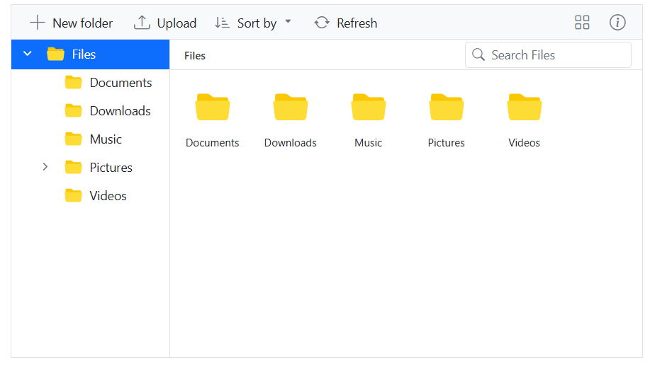

# File Operations in Blazor File Manager Component

The File Manager component is used to browse, manage, and organize the files and folders in a file system through a web application. All basic file operations like creating a new folder, uploading and downloading of files in the file system, and deleting and renaming of existing files and folders are available in the File Manager component.  Additionally, previewing of image files is also provided in the File Manager component.

The following table represents the basic operations available in the File Manager and their corresponding functions.

|Operation Name|Function|
|----|----|
|read|Read the details of files or folders available in the given path from the file system, to display the files for the user to browse the content.|
|create|Creates a new folder in the current path of the file system.|
|delete|Removes the file or folder from the file server.|
|rename|Rename the selected file or folder in the file system.|
|search|Searches for items matching the search string in the current and child directories.|
|details|Gets the detail of the selected item(s) from the file server.|
|copy|Copy the selected file or folder in the file system.|
|move|Cut the selected file or folder in the file server.|
|upload|Upload files to the current path or directory in the file system.|
|download|Downloads the file from the server and the multiple files can be downloaded as ZIP files.|

N> The *CreateFolder*, *Remove*, and *Rename* actions will be reflected in the File Manager only after the successful response from the server.

## Request and Response Contents Format in Blazor File Manager component

The following table represents the contents of *data, cwd, and files* in the File Manager request and response.

|Parameter|Type|Default|Explanation|
|----|----|----|----|
|name|String|-|File name|
|dateCreated|String|-|Date in which file was created (UTC Date string).|
|dateModified|String|-|Date in which file was last modified (UTC Date string).|
|filterPath|String|-|Relative path to the file or folder.|
|hasChild|Boolean|-|Defines this folder has any child folder or not.|
|isFile|Boolean|-|Say whether the item is file or folder.|
|size|Number|-|File size|
|type|String|-|File extension|

The following table represents the contents of *error* in the File Manager request and response.

|Parameter|Type|Default|Explanation|
|----|----|----|----|
|code|String|-|Error code|
|message|String|-|Error message|
|fileExists|String[]|-|List of duplicate file names|

The following table represents the contents of *details* in the File Manager request and response.

|Parameter|Type|Default|Explanation|
|----|----|----|----|
|name|String|-|File name|
|dateCreated|String|-|Date in which file was created (UTC Date string).|
|dateModified|String|-|Date in which file was last modified (UTC Date string).|
|filterPath|String|-|Relative path to the file or folder.|
|hasChild|Boolean|-|Defines this folder has any child folder or not.|
|isFile|Boolean|-|Say whether the item is file or folder.|
|size|Number|-|File size|
|type|String|-|File extension|
|multipleFiles|Boolean|-|Say whether the details are about single file or multiple files.|

## Reading Files and Folders

The following table represents the request parameters of *read* operations.

|Parameter|Type|Default|Explanation|
|----|----|----|----|
|action|String|read|Name of the file operation.|
|path|String|-|Relative path from which the data has to be read.|
|showHiddenItems|Boolean|-|Defines show or hide the hidden items.|
|data|FileManagerDirectoryContent|-|Details about the current path (directory).|

*Refer [File request and response contents](#file-request-and-response-contents) for the contents of data*.

*Example:*

```csharp
{
    action: "read",
    path: "/",
    showHiddenItems: false,
    data: []
}
```

The following table represents the response parameters of *read* operations.

|Parameter|Type|Default|Explanation|
|----|----|----|----|
|cwd|FileManagerDirectoryContent|-|Path (Current Working Directory) details.|
|files|FileManagerDirectoryContent[]|-|Details of files and folders present in given path or directory.|
|error|ErrorDetails|-|Error Details|

*Refer [File request and response contents](#file-request-and-response-contents) for the contents of cwd, files, and error*.

*Example:*

```csharp
{
    cwd:
    {
        name:"Download",
        size:0,
        dateModified:"2019-02-28T03:48:19.8319708+00:00",
        dateCreated:"2019-02-27T17:36:15.812193+00:00",
        hasChild:false,
        isFile:false,
        type:"",
        filterPath:"\\Download\\"
    },
    files:[
        {
            name:"Sample Work Sheet.xlsx",
            size:6172,
            dateModified:"2019-02-27T17:23:50.9651206+00:00",
            dateCreated:"2019-02-27T17:36:15.8151955+00:00",
            hasChild:false,
            isFile:true,
            type:".xlsx",
            filterPath:"\\Download\\"
        }
    ],
    error:null,
    details:null
}
```

Read operation triggers on the server side and find the related code details.

```csharp

case "read":
    // reads the file(s) or folder(s) from the given path.
    return this.operation.ToCamelCase(this.operation.GetFiles(args.Path, args.howHiddenItems));

```

## Creating Files and Folders

The following table represents the request parameters of *create* operations.

|Parameter|Type|Default|Explanation|
|----|----|----|----|
|action|String|create|Name of the file operation.|
|path|String|-|Relative path in which the folder has to be created.|
|name|String|-|Name of the folder to be created.|
|data|FileManagerDirectoryContent|-|Details about the current path (directory).|

*Refer [File request and response contents](#file-request-and-response-contents) for the contents of data*

*Example:*

```csharp
{
    action: "create",
    data: [
        {
            dateCreated: "2019-02-27T17:36:15.6571949+00:00",
            dateModified: "2019-03-12T10:17:31.8505975+00:00",
            filterPath: "\",
            hasChild: true,
            isFile: false,
            name: files,
            nodeId: "fe_tree",
            size: 0,
            type: ""
        }
    ],
    name: "Hello",
    path: "/"
}
```

The following table represents the response parameters of *create* operations.

|Parameter|Type|Default|Explanation|
|----|----|----|----|
|files|FileManagerDirectoryContent[]|-|Details of the created folder|
|error|ErrorDetails|-|Error Details|

*Refer [File request and response contents](#file-request-and-response-contents) for the contents of files and error*.

*Example:*

```csharp
{
    cwd: null,
    files: [
        {
            dateCreated: "2019-03-15T10:25:05.3596171+00:00",
            dateModified: "2019-03-15T10:25:05.3596171+00:00",
            filterPath: null,
            hasChild: false,
            isFile: false,
            name: "New",
            size: 0,
            type: ""
        }
    ],
    details: null,
    error: null
}
```

Create operation triggers on the server side and find the related code details.

```csharp

case "create":
    // creates a new folder in a given path.
    return this.operation.ToCamelCase(this.operation.Create(args.Path, args.Name));

```

## Renaming Files and Folders

The following table represents the request parameters of *rename* operations.

|Parameter|Type|Default|Explanation|
|----|----|----|----|
|action|String|rename|Name of the file operation.|
|path|String|-|Relative path in which the item is located.|
|name|String|-|Current name of the item to be renamed.|
|NewName|String|-|New name for the item.|
|data|FileManagerDirectoryContent|-|Details of the item to be renamed.|

*Refer [File request and response contents](#file-request-and-response-contents) for the contents of data*.

*Example:*

```csharp
{
    action: "rename",
    data: [
        {
            dateCreated: "2019-03-20T05:22:34.621Z",
            dateModified: "2019-03-20T08:45:56.000Z",
            filterPath: "\Pictures\Nature\",
            hasChild: false,
            iconClass: "e-fe-image",
            isFile: true,
            name: "seaviews.jpg",
            size: 95866,
            type: ".jpg"
        }
    ],
    newname: "seaview.jpg",
    name: "seaviews.jpg",
    path: "/Pictures/Nature/"
}
```

The following table represents the response parameters of *rename* operations.

|Parameter|Type|Default|Explanation|
|----|----|----|----|
|files|FileManagerDirectoryContent[]|-|Details of the renamed item.|
|error|ErrorDetails|-|Error Details|

*Refer [File request and response contents](#file-request-and-response-contents) for the contents of files and error*.

*Example:*

```csharp
{
    cwd:null,
    files:[
        {
            name:"seaview.jpg",
            size:95866,
            dateModified:"2019-03-20T08:45:56+00:00",
            dateCreated:"2019-03-20T05:22:34.6214847+00:00",
            hasChild:false,
            isFile:true,
            type:".jpg",
            filterPath:"\\Pictures\\Nature\\seaview.jpg"
        }
    ],
    error:null,
    details:null
}
```

Rename operation triggers on the server side and find the related code details.

```csharp

case "rename":
    // renames a file or folder.
    return this.operation.ToCamelCase(this.operation.Rename(args.Path, args.Name, 
    args.newName, false, args.ShowFileExtension, args.Data));

```

## Deleting Files and Folders

The following table represents the request parameters of *delete* operations.

|Parameter|Type|Default|Explanation|
|----|----|----|----|
|action|String|delete|Name of the file operation.|
|path|String|-|Relative path where the items to be deleted are located.|
|names|String[]|-|List of the items to be deleted.|
|data|FileManagerDirectoryContent|-|Details of the item to be deleted.|

*Refer [File request and response contents](#file-request-and-response-contents) for the contents of data*.

*Example:*

```csharp
{
    action: "delete",
    path: "/Hello/",
    names: ["New"],
    data: []
}
```

The following table represents the response parameters of *delete* operations.

|Parameter|Type|Default|Explanation|
|----|----|----|----|
|files|FileManagerDirectoryContent[]|-|Details about the deleted item(s).|
|error|ErrorDetails|-|Error Details|

*Refer [File request and response contents](#file-request-and-response-contents) for the contents of files and error*.

*Example:*

```csharp
{
    cwd: null,
    details: null,
    error: null,
    files: [
        {
            dateCreated: "2019-03-15T10:13:30.346309+00:00",
            dateModified: "2019-03-15T10:13:30.346309+00:00",
            filterPath: "\Hello\folder",
            hasChild: true,
            isFile: false,
            name: "folder",
            size: 0,
            type: ""
        }
    ]
}
```

Delete operation triggers on the server side and find the related code details.

```csharp

    case "delete":
        // deletes the selected file(s) or folder(s) from the given path.
        return this.operation.ToCamelCase(this.operation.Delete(args.Path, args.Names));

```

## Getting File Details

The following table represents the request parameters of *details* operations.

|Parameter|Type|Default|Explanation|
|----|----|----|----|
|action|String|details|Name of the file operation.|
|path|String|-|Relative path where the items are located.|
|names|String[]|-|List of the items to get details.|
|data|FileManagerDirectoryContent|-|Details of the selected item.|

*Refer [File request and response contents](#file-request-and-response-contents) for the contents of data*.

*Example:*

```csharp
{
    action: "details",
    path: "/FileContents/",
    names: ["All Files"],
    data: []
}
```

The following table represents the response parameters of *details* operations.

|Parameter|Type|Default|Explanation|
|----|----|----|----|
|details|FileManagerDirectoryContent|-|Details of the requested item(s).|
|error|ErrorDetails|-|Error Details|

*Refer [File request and response contents](#file-request-and-response-contents) for the contents of details and error*.

*Example:*

```csharp
{
    cwd:null,
    files:null,
    error:null,
    details:
    {
        name:"All Files",
        location:"\\Files\\FileContents\\All Files",
        isFile:false,
        size:"679.8 KB",
        created:"3/8/2019 10:18:37 AM",
        modified:"3/8/2019 10:18:39 AM",
        multipleFiles:false
    }
}
```

Details operation triggers on the server side and find the related code details.

```csharp

    case "details":
        // gets the details of the selected file(s) or folder(s).
        return this.operation.ToCamelCase(this.operation.Details(args.Path, args.Names, 
        args.Data));

```

## Searching Files and Folders

The following table represents the request parameters of *search* operations.

|Parameter|Type|Default|Explanation|
|----|----|----|----|
|action|String|search|Name of the file operation.|
|path|String|-|Relative path to the directory where the files should be searched.|
|showHiddenItems|Boolean|-|Defines show or hide the hidden items.|
|caseSensitive|Boolean|-|Defines search is case sensitive or not.|
|searchString|String|-|String to be searched in the directory.|
|data|FileManagerDirectoryContent|-|Details of the searched item.|

*Example:*

```csharp
{
    action: "search",
    path: "/",
    searchString: "*nature*",
    showHiddenItems: false,
    caseSensitive: false,
    data: []
}
```

The following table represents the response parameters of *search* operations.

|Parameter|Type|Default|Explanation|
|----|----|----|----|
|cwd|FileManagerDirectoryContent|-|Path (Current Working Directory) details.|
|files|FileManagerDirectoryContent[]|-|Files and folders in the searched directory that matches the search input.|
|error|ErrorDetails|-|Error Details|

*Refer [File request and response contents](#file-request-and-response-contents) for the contents of cwd, files and error.*

*Example:*

```csharp
{
    cwd:
    {
        name:files,
        size:0,
        dateModified:"2019-03-15T10:07:00.8658158+00:00",
        dateCreated:"2019-02-27T17:36:15.6571949+00:00",
        hasChild:true,
        isFile:false,
        type:"",
        filterPath:"\\"
    },
    files:[
        {
            name:"Nature",
            size:0,
            dateModified:"2019-03-08T10:18:42.9937708+00:00",
            dateCreated:"2019-03-08T10:18:42.5907729+00:00",
            hasChild:true,
            isFile:false,
            type:"",
            filterPath:"\\FileContents\\Nature"
        }
    ],
    error:null,
    details:null
}
```

Searching operation triggers on the server side and find the related code details.

```csharp

case "search":
    // gets the list of file(s) or folder(s) from a given path based on the searched key string
    return this.operation.ToCamelCase(this.operation.Search(args.Path, args.SearchString, 
    args.ShowHiddenItems, args.CaseSensitive));

```

## Copying Files and Folders

The following table represents the request parameters of *copy* operations.

|Parameter|Type|Default|Explanation|
|----|----|----|----|
|action|String|copy|Name of the file operation.|
|path|String|-|Relative path to the directory where the files should be copied.|
|names|String[] |-|List of files to be copied.|
|targetPath|String|-|Relative path where the items to be pasted are located.|
|data|FileManagerDirectoryContent|-|Details of the copied item.|
|renameFiles|String[]|-|Details of the renamed item.|

*Example:*

```csharp
{
    action: "copy",
    path: "/",
    names: ["6.png"],
    renameFiles: ["6.png"],
    targetPath: "/Videos/"
}
```

The following table represents the response parameters of *copy* operations.

|Parameter|Type|Default|Explanation|
|----|----|----|----|
|cwd|FileManagerDirectoryContent|-|Path (Current Working Directory) details.|
|files|FileManagerDirectoryContent[]|-|Details of copied files or folders|
|error|ErrorDetails|-|Error Details|

*Refer [File request and response contents](#file-request-and-response-contents) for the contents of cwd, files and error.*

*Example:*

```csharp
{
    cwd:null,
    files:[
        {
            path:null,
            action:null,
            newName:null,
            names:null,
            name:"justin.mp4",
            size:0,
            previousName:"album.mp4",
            dateModified:"2019-06-21T06:58:32+00:00",
            dateCreated:"2019-06-24T04:22:14.6245618+00:00",
            hasChild:false,
            isFile:true,
            type:".mp4",
            id:null,
            filterPath:"\\"
        }
    ],
    error:null,
    details:null
}
```

Copy operation triggers on the server side and find the related code details.

```csharp

    case "copy":
        // copies the selected file(s) or folder(s) from a path and then pastes them into a given target path.
        return this.operation.ToCamelCase(this.operation.Copy(args.Path, args.TargetPath, 
        args.Names, args.RenameFiles, args.TargetData));

```

## Moving Files and Folders

The following table represents the request parameters of *move* operations.

|Parameter|Type|Default|Explanation|
|----|----|----|----|
|action|String|move|Name of the file operation.|
|path|String|-|Relative path to the directory where the files should be copied.|
|names|String[] |-|List of files to be moved.|
|targetPath|String|-|Relative path where the items to be pasted are located.|
|data|FileManagerDirectoryContent|-|Details of the moved item.|
|renameFiles|String[]|-|Details of the renamed item.|

*Example:*

```csharp
{
    action: "move",
    path: "/",
    names: ["6.png"],
    renameFiles: ["6.png"],
    targetPath: "/Videos/"
}
```

The following table represents the response parameters of *copy* operations.

|Parameter|Type|Default|Explanation|
|----|----|----|----|
|cwd|FileManagerDirectoryContent|-|Path (Current Working Directory) details.|
|files|FileManagerDirectoryContent[]|-|Details of cut files or folders|
|error|ErrorDetails|-|Error Details|

*Refer [File request and response contents](#file-request-and-response-contents) for the contents of cwd, files and error.*

*Example:*

```csharp
{
    cwd:null,
    files:[
        {
            path:null,
            action:null,
            newName:null,
            names:null,
            name:"justin biber.mp4",
            size:0,
            previousName:"justin biber.mp4",
            dateModified:"2019-06-21T06:58:32+00:00",
            dateCreated:"2019-06-24T04:26:49.2690476+00:00",
            hasChild:false,
            isFile:true,
            type:".mp4",
            id:null,
            filterPath:"\\Videos\\"
        }
    ],
    error:null,
    details:null
}
```

Move operation triggers on the server side and find the related code details.

```csharp

    case "move":
        // cuts the selected file(s) or folder(s) from a path and then pastes them into a given target path.
        return this.operation.ToCamelCase(this.operation.Move(args.Path, args.TargetPath, 
        args.Names, args.RenameFiles, args.TargetData));

```

## Sorting Files and Folders 

Sort files and folders using the [SortBy](https://help.syncfusion.com/cr/blazor/Syncfusion.Blazor.FileManager.SfFileManager-1.html#Syncfusion_Blazor_FileManager_SfFileManager_1_SortBy) and [SortOrder](https://help.syncfusion.com/cr/blazor/Syncfusion.Blazor.FileManager.SfFileManager-1.html#Syncfusion_Blazor_FileManager_SfFileManager_1_SortOrder) properties, or the Sort By toolbar button available in the File Manager component to perform sorting operations.

**SortBy** - A field name used to sort the folders and files in the File Manager component. The default value is Name.
**SortOrder** - sort order for the files and folders in the File Manager component.

The available options for the sort order are:

* [None](https://help.syncfusion.com/cr/blazor/Syncfusion.Blazor.FileManager.SortOrder.html#Syncfusion_Blazor_FileManager_SortOrder_None): The folders and files are not sorted.
* [Ascending](https://help.syncfusion.com/cr/blazor/Syncfusion.Blazor.FileManager.SortOrder.html#Syncfusion_Blazor_FileManager_SortOrder_Ascending): The folders and files are sorted in ascending order.
* [Descending](https://help.syncfusion.com/cr/blazor/Syncfusion.Blazor.FileManager.SortOrder.html#Syncfusion_Blazor_FileManager_SortOrder_Descending): The folders and files are sorted in descending order.

```cshtml

@using Syncfusion.Blazor.FileManager

<SfFileManager TValue="FileManagerDirectoryContent" SortBy="Size" SortOrder="SortOrder.Descending">
    <FileManagerAjaxSettings Url="https://ej2-aspcore-service.azurewebsites.net/api/FileManager/FileOperations"
                             UploadUrl="https://ej2-aspcore-service.azurewebsites.net/api/FileManager/Upload"
                             DownloadUrl="https://ej2-aspcore-service.azurewebsites.net/api/FileManager/Download"
                             GetImageUrl="https://ej2-aspcore-service.azurewebsites.net/api/FileManager/GetImage">
    </FileManagerAjaxSettings>
</SfFileManager>

```




## Custom Sorting

The File Manager component provides a way to customize the default sort action for the LargeIconsView by defining the [`SortComparer`](https://help.syncfusion.com/cr/blazor/Syncfusion.Blazor.FileManager.SfFileManager-1.html#Syncfusion_Blazor_FileManager_SfFileManager_1_SortComparer) property and for sorting individual columns in the DetailsView by defining the `SortComparer` property in the [`FileManagerColumn`](https://help.syncfusion.com/cr/blazor/Syncfusion.Blazor.FileManager.FileManagerColumn.html) class.The `SortComparer` class should implement the [IComparer](https://learn.microsoft.com/en-us/dotnet/api/system.collections.generic.icomparer-1?view=net-8.0) interface.

The following example demonstrates how to define custom sort comparer function to achieve natural sorting behavior for the Name column in both DetailsView and LargeIconsView.




@using Syncfusion.Blazor.FileManager
@using System.Text.RegularExpressions;
@using FileManager.Data

@* SfFileManager component with a custom sorting SortComparer property *@
<SfFileManager TValue="FileManagerDirectoryContent" SortComparer="new NaturalSortComparer()">
    <FileManagerEvents TValue="FileManagerDirectoryContent" OnRead="OnReadAsync"></FileManagerEvents>
    @* FileManagerDetailsViewSettings component for configuring the details view of the File Manager *@
    <FileManagerDetailsViewSettings>
        <FileManagerColumns>
            @* FileManagerColumn for the 'Name' field with a custom sorting SortComparer property *@
            <FileManagerColumn Field="Name" HeaderText="Name" SortComparer="new NaturalSortComparer()"></FileManagerColumn>
            <FileManagerColumn Field="DateModified" Format="MM/dd/yyyy h:mm tt" HeaderText="Modified"></FileManagerColumn>
            <FileManagerColumn Field="Size" HeaderText="Size">
            </FileManagerColumn>
        </FileManagerColumns>
    </FileManagerDetailsViewSettings>
</SfFileManager>

@code {
    public FileManagerService FileService = new FileManagerService();

    public async Task OnReadAsync(ReadEventArgs<FileManagerDirectoryContent> args)
    {
        args.Response = await FileService.ReadAsync(args.Path, args.Folder);
    }

    public class NaturalSortComparer : IComparer<Object>
    {
        public int Compare(Object XRowDataToCompare, Object YRowDataToCompare)
        {
            FileManagerDirectoryContent XRowDataToCompare1 = (FileManagerDirectoryContent)XRowDataToCompare;
            FileManagerDirectoryContent YRowDataToCompare1 = (FileManagerDirectoryContent)YRowDataToCompare;
			// Assuming Value property holds the value of the column
            dynamic reference = XRowDataToCompare1.GetType().GetProperty("Name").GetValue(XRowDataToCompare1, null);
			// Assuming Value property holds the value of the column
            dynamic comparer = YRowDataToCompare1.GetType().GetProperty("Name").GetValue(YRowDataToCompare1, null);
            bool referenceIsFile = XRowDataToCompare1.IsFile;
            bool comparerIsFile = YRowDataToCompare1.IsFile;

            if (referenceIsFile && !comparerIsFile) return 1;
            if (!referenceIsFile && comparerIsFile) return -1;

            var referenceParts = new List<(double, string)>();
            var comparerParts = new List<(double, string)>();

            Regex.Replace(reference, @"(\d+)|(\D+)", (MatchEvaluator)(m => { referenceParts.Add((m.Groups[1].Success ? double.Parse(m.Groups[1].Value) : double.PositiveInfinity, m.Groups[2].Value)); return ""; }));
            Regex.Replace(comparer, @"(\d+)|(\D+)", (MatchEvaluator)(m => { comparerParts.Add((m.Groups[1].Success ? double.Parse(m.Groups[1].Value) : double.PositiveInfinity, m.Groups[2].Value)); return ""; }));
            for (int i = 0; i < referenceParts.Count && i < comparerParts.Count; i++)
            {
                var referencePart = referenceParts[i];
                var comparerPart = comparerParts[i];
                int comparisonResult;
                if (referencePart.Item1 != double.PositiveInfinity && comparerPart.Item1 != double.PositiveInfinity)
                {
                    comparisonResult = referencePart.Item1.CompareTo(comparerPart.Item1);
                }
                else
                {
                    comparisonResult = String.Compare(referencePart.Item2, comparerPart.Item2);
                }
                if (comparisonResult != 0)
                {
                    return comparisonResult;
                }
            }

            return referenceParts.Count - comparerParts.Count;
        }
    }
}




To set up a local data, create a new file with the extension `.cs` within the project, include the following code in this file.

This will fetch the details of the static folder from the `wwwroot` directory. Likewise, you can inject your own service.




using System.IO.Compression;
using Syncfusion.Blazor.FileManager;
using System.Collections.Generic;
using System.Linq;
using System;
using System.Threading.Tasks;
using System.Text;

namespace FileManager.Data
{
    public class FileManagerService
    {
        List<FileManagerDirectoryContent> CopyFiles = new List<FileManagerDirectoryContent>();
        List<FileManagerDirectoryContent> Data = new List<FileManagerDirectoryContent>();
        public FileManagerService()
        {
            this.GetData();
        }
        private void GetData()
        {
            Data.Add(new FileManagerDirectoryContent()
            {
                CaseSensitive = false,
                DateCreated = new DateTime(2022, 1, 2),
                DateModified = new DateTime(2022, 2, 3),
                FilterPath = "",
                FilterId = "",
                HasChild = true,
                Id = "0",
                IsFile = false,
                Name = "Files",
                ParentId = null,
                ShowHiddenItems = false,
                Size = 1779448,
                Type = "folder"
            });
            Data.Add(new FileManagerDirectoryContent()
            {
                CaseSensitive = false,
                DateCreated = new DateTime(2022, 1, 2),
                DateModified = new DateTime(2022, 2, 3),
                FilterId = "0/",
                FilterPath = "/",
                HasChild = true,
                Id = "1",
                IsFile = false,
                Name = "Folder 1.0",
                ParentId = "0",
                ShowHiddenItems = false,
                Size = 680786,
                Type = "folder"
            });
            Data.Add(new FileManagerDirectoryContent()
            {
                CaseSensitive = false,
                DateCreated = new DateTime(2022, 1, 2),
                DateModified = new DateTime(2022, 2, 3),
                FilterId = "0/",
                FilterPath = "/",
                HasChild = true,
                Id = "2",
                IsFile = false,
                Name = "Folder 1.1",
                ParentId = "0",
                ShowHiddenItems = false,
                Size = 6172,
                Type = "folder"
            });
            Data.Add(new FileManagerDirectoryContent()
            {
                CaseSensitive = false,
                DateCreated = new DateTime(2022, 1, 2),
                DateModified = new DateTime(2022, 2, 3),
                FilterId = "0/",
                FilterPath = "/",
                HasChild = true,
                Id = "3",
                IsFile = false,
                Name = "Folder 1.9",
                ParentId = "0",
                ShowHiddenItems = false,
                Size = 20,
                Type = "folder"
            });
            Data.Add(new FileManagerDirectoryContent()
            {
                CaseSensitive = false,
                DateCreated = new DateTime(2022, 1, 2),
                DateModified = new DateTime(2022, 2, 3),
                FilterId = "0/",
                FilterPath = "/",
                HasChild = true,
                Id = "4",
                IsFile = false,
                Name = "Folder 1.10",
                ParentId = "0",
                ShowHiddenItems = false,
                Size = 20,
                Type = "folder"
            });
            Data.Add(new FileManagerDirectoryContent()
            {
                CaseSensitive = false,
                DateCreated = new DateTime(2022, 1, 2),
                DateModified = new DateTime(2022, 2, 3),
                FilterId = "0/1/",
                FilterPath = "/Folder 1.0/",
                HasChild = false,
                Id = "5",
                IsFile = true,
                Name = "EJ2 File Manager.docx",
                ParentId = "1",
                ShowHiddenItems = false,
                Size = 12403,
                Type = ".docx"
            });
            Data.Add(new FileManagerDirectoryContent()
            {
                CaseSensitive = false,
                DateCreated = new DateTime(2022, 1, 2),
                DateModified = new DateTime(2022, 2, 3),
                FilterId = "0/2/",
                FilterPath = "/Folder 1.1/",
                HasChild = false,
                Id = "6",
                IsFile = true,
                Name = "EJ2 File Manager.pdf",
                ParentId = "2",
                ShowHiddenItems = false,
                Size = 90099,
                Type = ".pdf"
            });
            Data.Add(new FileManagerDirectoryContent()
            {
                CaseSensitive = false,
                DateCreated = new DateTime(2022, 1, 2),
                DateModified = new DateTime(2022, 2, 3),
                FilterId = "0/3/",
                FilterPath = "/Folder 1.9/",
                HasChild = false,
                Id = "7",
                IsFile = true,
                Name = "File Manager PPT.pptx",
                ParentId = "3",
                ShowHiddenItems = false,
                Size = 578010,
                Type = ".pptx"
            });
            Data.Add(new FileManagerDirectoryContent()
            {
                CaseSensitive = false,
                DateCreated = new DateTime(2022, 1, 2),
                DateModified = new DateTime(2022, 2, 3),
                FilterId = "0/4/",
                FilterPath = "/Folder 1.10/",
                HasChild = false,
                Id = "7",
                IsFile = true,
                Name = "File Manager PPT.pptx",
                ParentId = "4",
                ShowHiddenItems = false,
                Size = 578010,
                Type = ".pptx"
            });
            Data.Add(new FileManagerDirectoryContent()
            {
                CaseSensitive = false,
                DateCreated = new DateTime(2022, 1, 2),
                DateModified = new DateTime(2022, 2, 3),
                FilterId = "0/",
                FilterPath = "/",
                HasChild = false,
                Id = "8",
                IsFile = true,
                Name = "File 2.0.txt",
                ParentId = "0",
                ShowHiddenItems = false,
                Size = 274,
                Type = ".txt"
            });
            Data.Add(new FileManagerDirectoryContent()
            {
                CaseSensitive = false,
                DateCreated = new DateTime(2022, 1, 2),
                DateModified = new DateTime(2022, 2, 3),
                FilterId = "0/",
                FilterPath = "/",
                HasChild = false,
                Id = "9",
                IsFile = true,
                Name = "File 2.1.txt",
                ParentId = "0",
                ShowHiddenItems = false,
                Size = 6172,
                Type = ".txt"
            });
            Data.Add(new FileManagerDirectoryContent()
            {
                CaseSensitive = false,
                DateCreated = new DateTime(2022, 1, 2),
                DateModified = new DateTime(2022, 2, 3),
                FilterId = "0/",
                FilterPath = "/",
                HasChild = false,
                Id = "10",
                IsFile = true,
                Name = "File 2.2txt",
                ParentId = "0",
                ShowHiddenItems = false,
                Size = 10,
                Type = ".txt"
            });
            Data.Add(new FileManagerDirectoryContent()
            {
                CaseSensitive = false,
                DateCreated = new DateTime(2022, 1, 2),
                DateModified = new DateTime(2022, 2, 3),
                FilterId = "0/",
                FilterPath = "/",
                HasChild = false,
                Id = "11",
                IsFile = true,
                Name = "File 2.20.txt",
                ParentId = "0",
                ShowHiddenItems = false,
                Size = 10,
                Type = ".txt"
            });
        }
        public async Task<FileManagerResponse<FileManagerDirectoryContent>> ReadAsync(string path, List<FileManagerDirectoryContent> fileDetails)
        {
            FileManagerResponse<FileManagerDirectoryContent> response = new FileManagerResponse<FileManagerDirectoryContent>();
            if (path == "/")
            {
                string ParentId = Data
                    .Where(x => x.FilterPath == string.Empty)
                    .Select(x => x.Id).First();
                response.CWD = Data
                    .Where(x => x.FilterPath == string.Empty).First();
                response.Files = Data
                    .Where(x => x.ParentId == ParentId).ToList();
            }
            else
            {
                var id = fileDetails.Count > 0 && fileDetails[0] != null ? fileDetails[0].Id : Data
                    .Where(x => x.FilterPath == path)
                    .Select(x => x.ParentId).First();
                response.CWD = Data
                    .Where(x => x.Id == (fileDetails.Count > 0 && fileDetails[0] != null ? fileDetails[0].Id : id)).First();
                response.Files = Data
                    .Where(x => x.ParentId == (fileDetails.Count > 0 && fileDetails[0] != null ? fileDetails[0].Id : id)).ToList();
            }
            await Task.Yield();
            return await Task.FromResult(response);
        }
    }
}





## Uploading Files

The following table represents the request parameters of *Upload* operations.

|Parameter|Type|Default|Explanation|
|----|----|----|----|
|action|String|Save|Name of the file operation.|
|path|String|-|Relative path to the location where the file has to be uploaded.|
|uploadFiles|`IList<IFormFile>`|-|File that are uploaded.|

*Example:*

```csharp
uploadFiles: (binary),
path: /,
action: Save,
data: {
    path:null,
    action:null,
    newName:null,
    names:null,
    name:"Downloads",
    size:0,
    previousName:null,
    dateModified:"2019-07-22T11:23:46.7153977 00:00",
    dateCreated:"2019-07-22T11:26:13.9047229 00:00",
    hasChild:false,
    isFile:false,
    type:"",
    id:null,
    filterPath:"\\",
    targetPath:null,
    renameFiles:null,
    uploadFiles:null,
    caseSensitive:false,
    searchString:null,
    showHiddenItems:false,
    _fm_iconClass:null,
    _fm_id:"fe_tree_1",
    _fm_pId:null,
    _fm_selected:false,
    _fm_icon:null,
    data:null,
    targetData:null,
    permission:null
}
```

The upload response is an empty string.

The upload operation triggers on the server side and find the related code details.

```csharp

    // uploads the file(s) into a specified path
    [Route("Upload")]
    public IActionResult Upload(string path, IList<IFormFile> uploadFiles, string action)
    {
        try
        {
            FileManagerResponse uploadResponse;
            foreach (var file in uploadFiles)
            {
                var folders = (file.FileName).Split('/');
                // checking the folder upload
                if (folders.Length > 1)
                {
                    for (var i = 0; i < folders.Length - 1; i++)
                    {
                        string newDirectoryPath = Path.Combine(this.basePath + path, folders[i]);
                        // checking the directory traversal
                        if (Path.GetFullPath(newDirectoryPath) != (Path.GetDirectoryName(newDirectoryPath) + Path.DirectorySeparatorChar + folders[i]))
                        {
                            throw new UnauthorizedAccessException("Access denied for Directory-traversal");
                        }
                        if (!Directory.Exists(newDirectoryPath))
                        {
                            this.operation.ToCamelCase(this.operation.Create(path, folders[i]));
                        }
                        path += folders[i] + "/";
                    }
                }
            }
            uploadResponse = operation.Upload(path, uploadFiles, action, size, null);
            if (uploadResponse.Error != null)
            {
                Response.Clear();
                Response.ContentType = "application/json; charset=utf-8";
                Response.StatusCode = Convert.ToInt32(uploadResponse.Error.Code);
                Response.HttpContext.Features.Get<IHttpResponseFeature>().ReasonPhrase = uploadResponse.Error.Message;
            }
        }
        catch (Exception e)
        {
            ErrorDetails er = new ErrorDetails();
            er.Message = e.Message.ToString();
            er.Code = "417";
            er.Message = "Access denied for Directory-traversal";
            Response.Clear();
            Response.ContentType = "application/json; charset=utf-8";
            Response.StatusCode = Convert.ToInt32(er.Code);
            Response.HttpContext.Features.Get<IHttpResponseFeature>().ReasonPhrase = er.Message;
            return Content("");
        }
        return Content("");
    }

```

## Downloading Files

The following table represents the request parameters of *download* operations.

|Parameter|Type|Default|Explanation|
|----|----|----|----|
|action|String|download|Name of the file operation|
|path|String|-|Relative path to location where the files to download are present.|
|names|String[]|-|Name list of the items to be downloaded.|
|data|FileManagerDirectoryContent|-|Details of the download item.|

*Example:*




{
    action:"download",
    path:"/",
    names:["1.png"],
    data:[
        {
            path:null,
            action:null,
            newName:null,
            names:null,
            name:"1.png",
            size:49792,
            previousName:null,
            dateModified:"2019-07-22T12:15:45.0972405+00:00",
            dateCreated:"2019-07-22T12:15:45.0816042+00:00",
            hasChild:false,
            isFile:true,
            type:".png",
            id:null,
            filterPath:"\\",
            targetPath:null,
            renameFiles:null,
            uploadFiles:null,
            caseSensitive:false,
            searchString:null,
            showHiddenItems:false,
            _fm_iconClass:"e-fe-image",
            _fm_id:null,
            _fm_pId:null,
            _fm_selected:false,
            _fm_icon:null,
            data:null,
            targetData:null,
            permission:null,
            _fm_created:"2019-07-22T12:15:45.081Z",
            _fm_modified:"2019-07-22T12:15:45.097Z",
            _fm_imageUrl:"https://ej2-aspcore-service.azurewebsites.net/api/FileManager/GetImage?path=/1.png",
            _fm_imageAttr:
            {
                alt:"1.png"
            },
            _fm_htmlAttr:
            {
                class:"e-large-icon",
                title:"1.png"
            }
        }
    ]
}



Downloads the requested items from the file server in response.

Download operation triggers on the server side and find the related code details.

```csharp

    // downloads the selected file(s) and folder(s)
    [Route("Download")]
    public IActionResult Download(string downloadInput)
    {
        FileManagerDirectoryContent args = JsonConvert.DeserializeObject<FileManagerDirectoryContent>(downloadInput);
        return operation.Download(args.Path, args.Names, args.Data);
    }

```

You can also download selected files dynamically using [DownloadFilesAsync](https://help.syncfusion.com/cr/blazor/Syncfusion.Blazor.FileManager.SfFileManager-1.html#Syncfusion_Blazor_FileManager_SfFileManager_1_DownloadFilesAsync_System_String___) method instead of our default download toolbar button.

To use this method, need to pass the selected files or folders as parameters.

```cshtml

@using Syncfusion.Blazor.FileManager
@using Syncfusion.Blazor.Buttons

<SfButton OnClick="DownloadFiles">ClickToDownload</SfButton>
<SfFileManager @ref="FileManager" TValue="FileManagerDirectoryContent">
    <FileManagerAjaxSettings Url="https://ej2-aspcore-service.azurewebsites.net/api/FileManager/FileOperations"
                             UploadUrl="https://ej2-aspcore-service.azurewebsites.net/api/FileManager/Upload"
                             DownloadUrl="https://ej2-aspcore-service.azurewebsites.net/api/FileManager/Download"
                             GetImageUrl="https://ej2-aspcore-service.azurewebsites.net/api/FileManager/GetImage">
    </FileManagerAjaxSettings>
</SfFileManager>

@code {
    SfFileManager<FileManagerDirectoryContent>? FileManager;
    public void DownloadFiles()
    {
        this.FileManager.DownloadFilesAsync(FileManager.SelectedItems);
    }

}

```

### Prevent Downloading File

Prevent download actions for specific files or folders by setting the [Cancel](https://help.syncfusion.com/cr/blazor/Syncfusion.Blazor.FileManager.BeforeDownloadEventArgs-1.html#Syncfusion_Blazor_FileManager_BeforeDownloadEventArgs_1_Cancel) argument to **true** in the [BeforeDownload](https://help.syncfusion.com/cr/blazor/Syncfusion.Blazor.FileManager.FileManagerEvents-1.html#Syncfusion_Blazor_FileManager_FileManagerEvents_1_BeforeDownload) event.

The following example demonstrates how to prevent the download actions for all types of files in the Blazor File Manager component.

```cshtml

@using Syncfusion.Blazor.FileManager

<SfFileManager TValue="FileManagerDirectoryContent">
    <FileManagerAjaxSettings Url="https://ej2-aspcore-service.azurewebsites.net/api/FileManager/FileOperations"
                                UploadUrl="https://ej2-aspcore-service.azurewebsites.net/api/FileManager/Upload"
                                DownloadUrl="https://ej2-aspcore-service.azurewebsites.net/api/FileManager/Download"
                                GetImageUrl="https://ej2-aspcore-service.azurewebsites.net/api/FileManager/GetImage">
    </FileManagerAjaxSettings>
    <FileManagerEvents TValue="FileManagerDirectoryContent" BeforeDownload="BeforeDownload">
    </FileManagerEvents>
</SfFileManager>

@code {
    public void BeforeDownload(BeforeDownloadEventArgs<FileManagerDirectoryContent>args)
    {
        for(int i=0; i < args.DownloadData.DownloadFileDetails.Count(); i++)
        {
            if (args.DownloadData.DownloadFileDetails[i].IsFile)
            {
                args.Cancel = true;
            }
        }
    }

}

```

## Getting Images

The following table represents the request parameters of *GetImage* operations.

|Parameter|Type|Default|Explanation|
|----|----|----|----|
|action|String|GetImage|Name of the file operation|
|path|String|-|Relative path to the image file|

Return the image as a file stream in response.

The request from the File Manager can be customized using the `OnSend` event. Additional information can be passed to the File Manager in file operation response and can be used in customization.

GetImage operation triggers on the server side and find the related code details.

```csharp

    // gets the image(s) from the given path
    [Route("GetImage")]
    public IActionResult GetImage(FileManagerDirectoryContent args)
    {
        return this.operation.GetImage(args.Path, args.Id,false,null, null);
    }

```

N> Refer to the [Providers](https://blazor.syncfusion.com/documentation/file-manager/file-system-provider) for more details.

## Request and Response Contents Format

The following table represents the contents of *data, cwd, and files* in the File Manager request and response.

|Parameter|Type|Default|Explanation|
|----|----|----|----|
|name|String|-|File name|
|dateCreated|String|-|Date in which file was created (UTC Date string).|
|dateModified|String|-|Date in which file was last modified (UTC Date string).|
|filterPath|String|-|Relative path to the file or folder.|
|hasChild|Boolean|-|Defines this folder has any child folder or not.|
|isFile|Boolean|-|Say whether the item is file or folder.|
|size|Number|-|File size|
|type|String|-|File extension|

The following table represents the contents of *error* in the File Manager request and response.

|Parameter|Type|Default|Explanation|
|----|----|----|----|
|code|String|-|Error code|
|message|String|-|Error message|
|fileExists|String[]|-|List of duplicate file names|

The following table represents the contents of *details* in the File Manager request and response.

|Parameter|Type|Default|Explanation|
|----|----|----|----|
|name|String|-|File name|
|dateCreated|String|-|Date in which file was created (UTC Date string).|
|dateModified|String|-|Date in which file was last modified (UTC Date string).|
|filterPath|String|-|Relative path to the file or folder.|
|hasChild|Boolean|-|Defines this folder has any child folder or not.|
|isFile|Boolean|-|Say whether the item is file or folder.|
|size|Number|-|File size|
|type|String|-|File extension|
|multipleFiles|Boolean|-|Say whether the details are about single file or multiple files.|

## Events 

The Blazor File Manager component has a list of events that can be triggered for certain actions. These events can be bound to the File Manager using the **FileManagerEvents**, which requires the **TValue** to be provided.

N> All the events should be provided in a single **FileManagerEvents** component.

### BeforeDownload

The [BeforeDownload](https://help.syncfusion.com/cr/blazor/Syncfusion.Blazor.FileManager.FileManagerEvents-1.html#Syncfusion_Blazor_FileManager_FileManagerEvents_1_BeforeDownload) event of the Blazor File Manager component is triggered before sending the download request to the server.

```cshtml

@using Syncfusion.Blazor.FileManager

<SfFileManager TValue="FileManagerDirectoryContent">
    <FileManagerAjaxSettings Url="https://ej2-aspcore-service.azurewebsites.net/api/FileManager/FileOperations"
                             UploadUrl="https://ej2-aspcore-service.azurewebsites.net/api/FileManager/Upload"
                             DownloadUrl="https://ej2-aspcore-service.azurewebsites.net/api/FileManager/Download"
                             GetImageUrl="https://ej2-aspcore-service.azurewebsites.net/api/FileManager/GetImage">
    </FileManagerAjaxSettings>
    <FileManagerEvents TValue="FileManagerDirectoryContent" BeforeDownload="BeforeDownload">
    </FileManagerEvents>
</SfFileManager>

@code {
    public void BeforeDownload(BeforeDownloadEventArgs<FileManagerDirectoryContent> args)
    {
        // Here, you can customize your code.
    }
}

```

### BeforeImageLoad

The [BeforeImageLoad](https://help.syncfusion.com/cr/blazor/Syncfusion.Blazor.FileManager.FileManagerEvents-1.html#Syncfusion_Blazor_FileManager_FileManagerEvents_1_BeforeImageLoad) event of the Blazor File Manager component is triggered before sending the image request to the server.

```cshtml

@using Syncfusion.Blazor.FileManager

<SfFileManager TValue="FileManagerDirectoryContent">
    <FileManagerAjaxSettings Url="https://ej2-aspcore-service.azurewebsites.net/api/FileManager/FileOperations"
                             UploadUrl="https://ej2-aspcore-service.azurewebsites.net/api/FileManager/Upload"
                             DownloadUrl="https://ej2-aspcore-service.azurewebsites.net/api/FileManager/Download"
                             GetImageUrl="https://ej2-aspcore-service.azurewebsites.net/api/FileManager/GetImage">
    </FileManagerAjaxSettings>
    <FileManagerEvents TValue="FileManagerDirectoryContent" BeforeImageLoad="BeforeImageLoad">
    </FileManagerEvents>
</SfFileManager>

@code {
    public void BeforeImageLoad(BeforeImageLoadEventArgs<FileManagerDirectoryContent> args)
    {
        // Here, you can customize your code.
    }
}

```

### BeforePopupClose

The [BeforePopupClose](https://help.syncfusion.com/cr/blazor/Syncfusion.Blazor.FileManager.FileManagerEvents-1.html#Syncfusion_Blazor_FileManager_FileManagerEvents_1_BeforePopupClose) event of the Blazor File Manager component is triggered before the dialog is closed.

```cshtml

@using Syncfusion.Blazor.FileManager

<SfFileManager TValue="FileManagerDirectoryContent">
    <FileManagerAjaxSettings Url="https://ej2-aspcore-service.azurewebsites.net/api/FileManager/FileOperations"
                             UploadUrl="https://ej2-aspcore-service.azurewebsites.net/api/FileManager/Upload"
                             DownloadUrl="https://ej2-aspcore-service.azurewebsites.net/api/FileManager/Download"
                             GetImageUrl="https://ej2-aspcore-service.azurewebsites.net/api/FileManager/GetImage">
    </FileManagerAjaxSettings>
    <FileManagerEvents TValue="FileManagerDirectoryContent" BeforePopupClose="BeforePopupClose">
    </FileManagerEvents>
</SfFileManager>

@code {
    public void BeforePopupClose(BeforePopupOpenCloseEventArgs args)
    {
        // Here, you can customize your code.
    }
}

```

### BeforePopupOpen

The [BeforePopupOpen](https://help.syncfusion.com/cr/blazor/Syncfusion.Blazor.FileManager.FileManagerEvents-1.html#Syncfusion_Blazor_FileManager_FileManagerEvents_1_BeforePopupOpen) event of the Blazor File Manager component is triggered before the dialog is opened.

```cshtml

@using Syncfusion.Blazor.FileManager

<SfFileManager TValue="FileManagerDirectoryContent">
    <FileManagerAjaxSettings Url="https://ej2-aspcore-service.azurewebsites.net/api/FileManager/FileOperations"
                             UploadUrl="https://ej2-aspcore-service.azurewebsites.net/api/FileManager/Upload"
                             DownloadUrl="https://ej2-aspcore-service.azurewebsites.net/api/FileManager/Download"
                             GetImageUrl="https://ej2-aspcore-service.azurewebsites.net/api/FileManager/GetImage">
    </FileManagerAjaxSettings>
    <FileManagerEvents TValue="FileManagerDirectoryContent" BeforePopupOpen="BeforePopupOpen">
    </FileManagerEvents>
</SfFileManager>

@code {
    public void BeforePopupOpen(BeforePopupOpenCloseEventArgs args)
    {
        // Here, you can customize your code.
    }
}

```

### Created

The [Created](https://help.syncfusion.com/cr/blazor/Syncfusion.Blazor.FileManager.FileManagerEvents-1.html#Syncfusion_Blazor_FileManager_FileManagerEvents_1_Created) event of the Blazor File Manager component is triggered when the File Manager component is created.

```cshtml

@using Syncfusion.Blazor.FileManager

<SfFileManager TValue="FileManagerDirectoryContent">
    <FileManagerAjaxSettings Url="https://ej2-aspcore-service.azurewebsites.net/api/FileManager/FileOperations"
                             UploadUrl="https://ej2-aspcore-service.azurewebsites.net/api/FileManager/Upload"
                             DownloadUrl="https://ej2-aspcore-service.azurewebsites.net/api/FileManager/Download"
                             GetImageUrl="https://ej2-aspcore-service.azurewebsites.net/api/FileManager/GetImage">
    </FileManagerAjaxSettings>
    <FileManagerEvents TValue="FileManagerDirectoryContent" Created="Created">
    </FileManagerEvents>
</SfFileManager>

@code {
    public void Created()
    {
        // Here, you can customize your code.
    }
}

```

### Destroyed

The [Destroyed](https://help.syncfusion.com/cr/blazor/Syncfusion.Blazor.FileManager.FileManagerEvents-1.html#Syncfusion_Blazor_FileManager_FileManagerEvents_1_Destroyed) event of the Blazor File Manager component is triggered when the File Manager component is destroyed.

```cshtml

@using Syncfusion.Blazor.FileManager

<SfFileManager TValue="FileManagerDirectoryContent">
    <FileManagerAjaxSettings Url="https://ej2-aspcore-service.azurewebsites.net/api/FileManager/FileOperations"
                             UploadUrl="https://ej2-aspcore-service.azurewebsites.net/api/FileManager/Upload"
                             DownloadUrl="https://ej2-aspcore-service.azurewebsites.net/api/FileManager/Download"
                             GetImageUrl="https://ej2-aspcore-service.azurewebsites.net/api/FileManager/GetImage">
    </FileManagerAjaxSettings>
    <FileManagerEvents TValue="FileManagerDirectoryContent" Destroyed="Destroyed">
    </FileManagerEvents>
</SfFileManager>

@code {
    public void Destroyed()
    {
        // Here, you can customize your code.
    }
}

```

### OnError

The [OnError](https://help.syncfusion.com/cr/blazor/Syncfusion.Blazor.FileManager.FileManagerEvents-1.html#Syncfusion_Blazor_FileManager_FileManagerEvents_1_OnError) event of the Blazor File Manager component is triggered when the AJAX request fails.

```cshtml

@using Syncfusion.Blazor.FileManager

<SfFileManager TValue="FileManagerDirectoryContent">
    <FileManagerAjaxSettings Url="https://ej2-aspcore-service.azurewebsites.net/api/FileManager/FileOperations"
                             UploadUrl="https://ej2-aspcore-service.azurewebsites.net/api/FileManager/Upload"
                             DownloadUrl="https://ej2-aspcore-service.azurewebsites.net/api/FileManager/Download"
                             GetImageUrl="https://ej2-aspcore-service.azurewebsites.net/api/FileManager/GetImage">
    </FileManagerAjaxSettings>
    <FileManagerEvents TValue="FileManagerDirectoryContent" OnError="OnError">
    </FileManagerEvents>
</SfFileManager>

@code {
    public void OnError(FailureEventArgs args)
    {
        // Here, you can customize your code.
    }
}

```

### OnFileLoad

The [OnFileLoad](https://help.syncfusion.com/cr/blazor/Syncfusion.Blazor.FileManager.FileManagerEvents-1.html#Syncfusion_Blazor_FileManager_FileManagerEvents_1_OnFileLoad) event of the Blazor File Manager component is triggered before the file or folder is rendered.

```cshtml

@using Syncfusion.Blazor.FileManager

<SfFileManager TValue="FileManagerDirectoryContent">
    <FileManagerAjaxSettings Url="https://ej2-aspcore-service.azurewebsites.net/api/FileManager/FileOperations"
                             UploadUrl="https://ej2-aspcore-service.azurewebsites.net/api/FileManager/Upload"
                             DownloadUrl="https://ej2-aspcore-service.azurewebsites.net/api/FileManager/Download"
                             GetImageUrl="https://ej2-aspcore-service.azurewebsites.net/api/FileManager/GetImage">
    </FileManagerAjaxSettings>
    <FileManagerEvents TValue="FileManagerDirectoryContent" OnFileLoad="OnFileLoad">
    </FileManagerEvents>
</SfFileManager>

@code {
    public void OnFileLoad(FileLoadEventArgs<FileManagerDirectoryContent> args)
    {
        // Here, you can customize your code.
    }
}

```

### OnFileOpen

The [OnFileOpen](https://help.syncfusion.com/cr/blazor/Syncfusion.Blazor.FileManager.FileManagerEvents-1.html#Syncfusion_Blazor_FileManager_FileManagerEvents_1_OnFileOpen) event of the Blazor File Manager component is triggered before the file or folder is opened.

```cshtml

@using Syncfusion.Blazor.FileManager

<SfFileManager TValue="FileManagerDirectoryContent">
    <FileManagerAjaxSettings Url="https://ej2-aspcore-service.azurewebsites.net/api/FileManager/FileOperations"
                             UploadUrl="https://ej2-aspcore-service.azurewebsites.net/api/FileManager/Upload"
                             DownloadUrl="https://ej2-aspcore-service.azurewebsites.net/api/FileManager/Download"
                             GetImageUrl="https://ej2-aspcore-service.azurewebsites.net/api/FileManager/GetImage">
    </FileManagerAjaxSettings>
    <FileManagerEvents TValue="FileManagerDirectoryContent" OnFileOpen="OnFileOpen">
    </FileManagerEvents>
</SfFileManager>

@code {
    public void OnFileOpen(FileOpenEventArgs<FileManagerDirectoryContent> args)
    {
        // Here, you can customize your code.
    }
}

```

### OnSend

The [OnSend](https://help.syncfusion.com/cr/blazor/Syncfusion.Blazor.FileManager.FileManagerEvents-1.html#Syncfusion_Blazor_FileManager_FileManagerEvents_1_OnSend) event of the Blazor File Manager component is triggered before sending the HttpClient request to the server.

```cshtml

@using Syncfusion.Blazor.FileManager

<SfFileManager TValue="FileManagerDirectoryContent">
    <FileManagerAjaxSettings Url="https://ej2-aspcore-service.azurewebsites.net/api/FileManager/FileOperations"
                             UploadUrl="https://ej2-aspcore-service.azurewebsites.net/api/FileManager/Upload"
                             DownloadUrl="https://ej2-aspcore-service.azurewebsites.net/api/FileManager/Download"
                             GetImageUrl="https://ej2-aspcore-service.azurewebsites.net/api/FileManager/GetImage">
    </FileManagerAjaxSettings>
    <FileManagerEvents TValue="FileManagerDirectoryContent" OnSend="OnSend">
    </FileManagerEvents>
</SfFileManager>

@code {
    public void OnSend(BeforeSendEventArgs args)
    {
        // Here, you can customize your code.
    }
}

```

### OnSuccess

The [OnSuccess](https://help.syncfusion.com/cr/blazor/Syncfusion.Blazor.FileManager.FileManagerEvents-1.html#Syncfusion_Blazor_FileManager_FileManagerEvents_1_OnSuccess) event of the Blazor File Manager component is triggered when the HttpClient request is successful.

```cshtml

@using Syncfusion.Blazor.FileManager

<SfFileManager TValue="FileManagerDirectoryContent">
    <FileManagerAjaxSettings Url="https://ej2-aspcore-service.azurewebsites.net/api/FileManager/FileOperations"
                             UploadUrl="https://ej2-aspcore-service.azurewebsites.net/api/FileManager/Upload"
                             DownloadUrl="https://ej2-aspcore-service.azurewebsites.net/api/FileManager/Download"
                             GetImageUrl="https://ej2-aspcore-service.azurewebsites.net/api/FileManager/GetImage">
    </FileManagerAjaxSettings>
    <FileManagerEvents TValue="FileManagerDirectoryContent" OnSuccess="OnSuccess">
    </FileManagerEvents>
</SfFileManager>

@code {
    public void OnSuccess(SuccessEventArgs<FileManagerDirectoryContent> args)
    {
        // Here, you can customize your code.
    }
}

```

### PopupClosed

The [PopupClosed](https://help.syncfusion.com/cr/blazor/Syncfusion.Blazor.FileManager.FileManagerEvents-1.html#Syncfusion_Blazor_FileManager_FileManagerEvents_1_PopupClosed) event of the Blazor File Manager component is triggered when the dialog is closed.

```cshtml

@using Syncfusion.Blazor.FileManager

<SfFileManager TValue="FileManagerDirectoryContent">
    <FileManagerAjaxSettings Url="https://ej2-aspcore-service.azurewebsites.net/api/FileManager/FileOperations"
                             UploadUrl="https://ej2-aspcore-service.azurewebsites.net/api/FileManager/Upload"
                             DownloadUrl="https://ej2-aspcore-service.azurewebsites.net/api/FileManager/Download"
                             GetImageUrl="https://ej2-aspcore-service.azurewebsites.net/api/FileManager/GetImage">
    </FileManagerAjaxSettings>
    <FileManagerEvents TValue="FileManagerDirectoryContent" PopupClosed="PopupClosed">
    </FileManagerEvents>
</SfFileManager>

@code {
    public void PopupClosed(PopupOpenCloseEventArgs args)
    {
        // Here, you can customize your code.
    }
}

```

### PopupOpened

The [PopupOpened](https://help.syncfusion.com/cr/blazor/Syncfusion.Blazor.FileManager.FileManagerEvents-1.html#Syncfusion_Blazor_FileManager_FileManagerEvents_1_PopupOpened) event of the Blazor File Manager component is triggered when the dialog is opened.

```cshtml

@using Syncfusion.Blazor.FileManager

<SfFileManager TValue="FileManagerDirectoryContent">
    <FileManagerAjaxSettings Url="https://ej2-aspcore-service.azurewebsites.net/api/FileManager/FileOperations"
                             UploadUrl="https://ej2-aspcore-service.azurewebsites.net/api/FileManager/Upload"
                             DownloadUrl="https://ej2-aspcore-service.azurewebsites.net/api/FileManager/Download"
                             GetImageUrl="https://ej2-aspcore-service.azurewebsites.net/api/FileManager/GetImage">
    </FileManagerAjaxSettings>
    <FileManagerEvents TValue="FileManagerDirectoryContent" PopupOpened="PopupOpened">
    </FileManagerEvents>
</SfFileManager>

@code {
    public void PopupOpened(PopupOpenCloseEventArgs args)
    {
        // Here, you can customize your code.
    }
}

```

### UploadListCreated

The [UploadListCreated](https://help.syncfusion.com/cr/blazor/Syncfusion.Blazor.FileManager.FileManagerEvents-1.html#Syncfusion_Blazor_FileManager_FileManagerEvents_1_UploadListCreated) event of the Blazor File Manager component is triggered before rendering each file item in the upload dialog box.

```cshtml

@using Syncfusion.Blazor.FileManager

<SfFileManager TValue="FileManagerDirectoryContent">
    <FileManagerAjaxSettings Url="https://ej2-aspcore-service.azurewebsites.net/api/FileManager/FileOperations"
                             UploadUrl="https://ej2-aspcore-service.azurewebsites.net/api/FileManager/Upload"
                             DownloadUrl="https://ej2-aspcore-service.azurewebsites.net/api/FileManager/Download"
                             GetImageUrl="https://ej2-aspcore-service.azurewebsites.net/api/FileManager/GetImage">
    </FileManagerAjaxSettings>
    <FileManagerEvents TValue="FileManagerDirectoryContent" UploadListCreated="UploadListCreated">
    </FileManagerEvents>
</SfFileManager>

@code {
    public void UploadListCreated(UploadListCreateArgs args)
    {
        // Here, you can customize your code.
    }
}

```
## Action buttons

The File Manager has several menu buttons to access the file operations. The list of menu buttons available in the File Manager is given in the following table.

|Menu Button|Behavior|
|----|----|
|SortBy| Opens the sub menu to choose the sorting order and sorting parameter.|
|View| Opens the sub menu to choose the View.|
|Open| Navigates to the selected folder. Opens the preview for image files.|
|Refresh| Initiates the read operation for the current directory and displays the updated directory content.|
|NewFolder| Opens the new folder dialog box to receive the name for the new folder.|
|Rename| Opens the rename dialog box to receive the new name for the selected item.|
|Delete| Opens the delete dialog box to confirm the removal of the selected items from the file system.|
|Upload| Opens the upload box to select the items to upload to the file system.|
|Download| Downloads the selected item(s).|
|Details| Get details about the selected items and display them in details dialog box.|
|SelectAll| Selects all the files and folders displayed in the view section.|

The action menu buttons are present in the toolbar and context menu. The toolbar contains the buttons based on the selected items count, while the context menu will appear with a list based on the target.

### Toolbar

The toolbar can be divided into two sections as right and left. Whenever the toolbar buttons exceed the size, the buttons present in the left section of the toolbar will be moved to the toolbar popup.

The following table provides the toolbar buttons that appear based on the selection.

<!-- markdownlint-disable MD033 -->
<table border="1">
    <tr>
        <th>Selected Items Count</th>
        <th>Left section</th>
        <th>Right section</th>
    </tr>
    <tr>
        <td>`0` (none of the items)</td>
        <td>
            <ul>
                <li>SortBy</li>
                <li>Refresh</li>
                <li>NewFolder</li>
                <li>Upload</li>
            </ul>
        </td>
        <td>
            <ul>
                <li>View</li>
                <li>Details</li>
            </ul>
        </td>
    </tr>
    <tr>
        <td>`1` (single item selected)</td>
        <td>
            <ul>
                <li>Delete</li>
                <li>Download</li>
                <li>Rename</li>
            </ul>
        </td>
        <td>
            <ul>
                <li>Selected items count</li>
                <li>View</li>
                <li>Details</li>
            </ul>
        </td>
    </tr>
    <tr>
        <td>`>1` (multiple selection)</td>
        <td>
            <ul>
                <li>Delete</li>
                <li>Download</li>
            </ul>
        </td>
        <td>
            <ul>
                <li>Selected items count</li>
                <li>View</li>
                <li>Details</li>
            </ul>
        </td>
    </tr>
</table>
