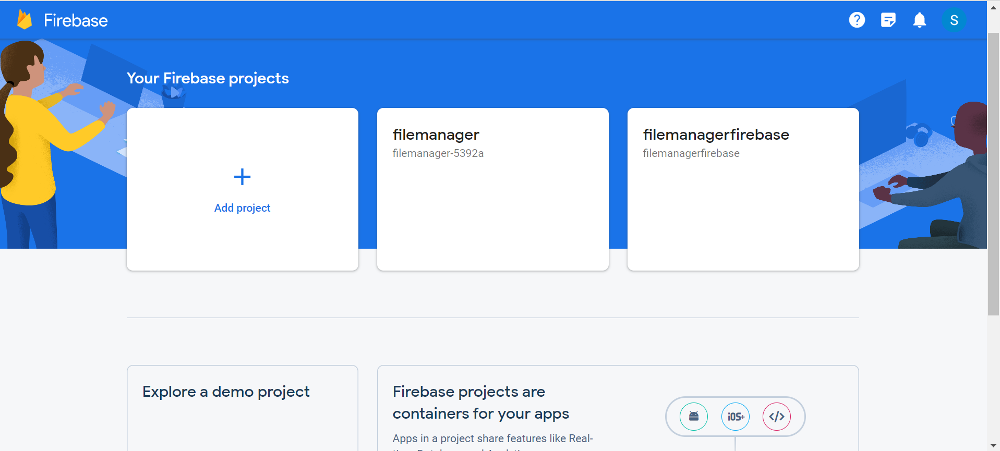
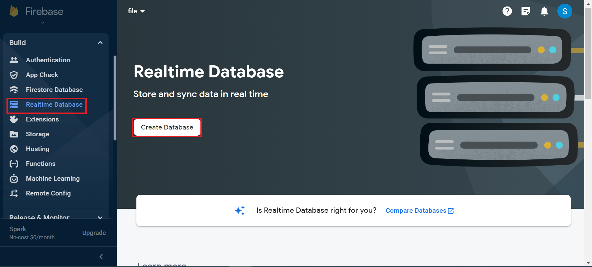
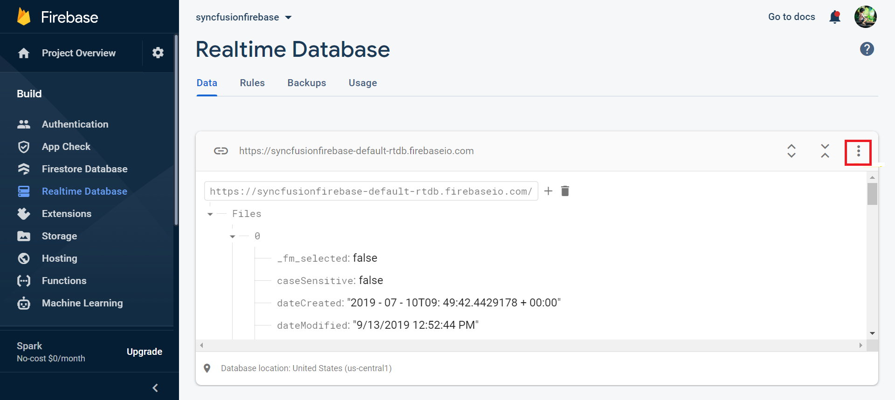
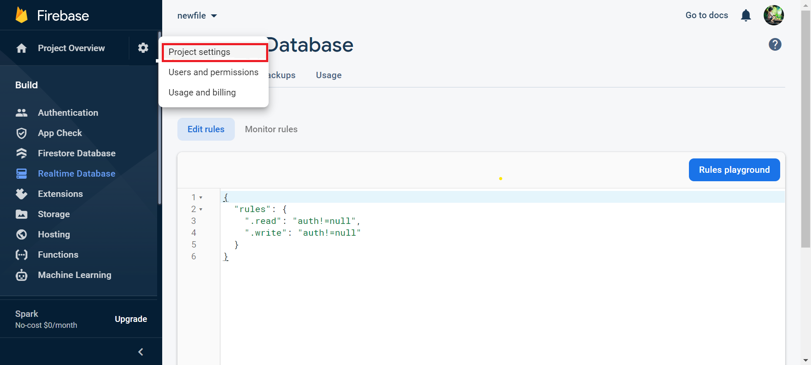
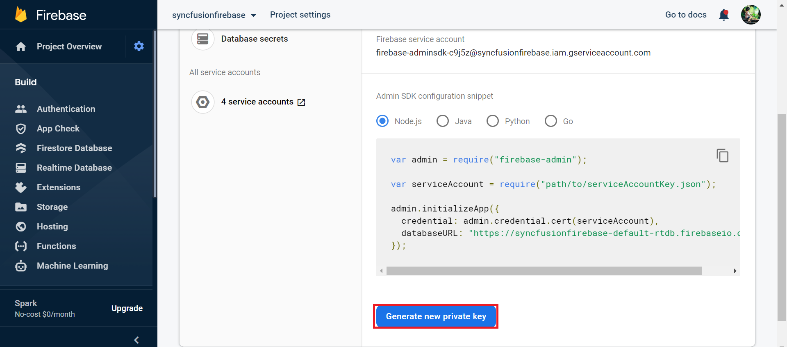
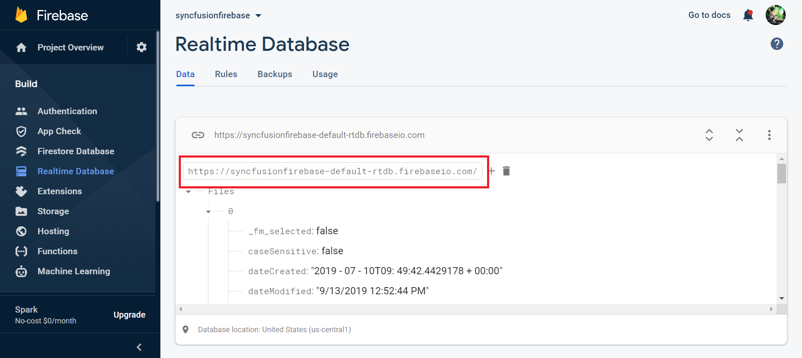

# File System Providers in Blazor FileManager Component

The file system provider allows the File Manager component to manage the files and folders in a physical or cloud-based file system. It provides the methods for performing various file actions like creating a new folder, copying and moving of files or folders, deleting, uploading, and downloading the files or folders in the file system.

The following file providers are added in Syncfusion Blazor File Manager component.

* [ASP.NET Core file system provider](#aspnet-core-file-system-provider)
* [ASP.NET MVC 5 file system provider](#aspnet-mvc-5-file-system-provider)
* [ASP.NET Core Azure cloud file system Provider](#aspnet-core-azure-cloud-file-system-provider)
* [ASP.NET Core MVC 5 Azure cloud file system Provider](#aspnet-mvc-5-azure-cloud-file-system-provider)
* [ASP.NET Core Amazon S3 cloud file provider](#aspnet-core-amazon-s3-cloud-file-provider)
* [ASP.NET MVC Amazon S3 cloud file provider](#aspnet-mvc-amazon-s3-cloud-file-provider)
* [File Transfer Protocol file system provider](#file-transfer-protocol-file-system-provider)
* [SQL database file system provider](#sql-database-server-file-system-provider)
* [NodeJS file system provider](#nodejs-file-system-provider)
* [Google Drive file system provider](#google-drive-file-system-provider)
* [Firebase Real time Database file system provider](#firebase-realtime-database-file-system-provider)

## ASP.NET Core file system provider

The ASP.NET Core file system provider allows the users to access and manage the physical file system. To get started, clone the [EJ2.ASP.NET Core File Provider](https://github.com/SyncfusionExamples/ej2-aspcore-file-provider) using the following command.

```

git clone https://github.com/SyncfusionExamples/ej2-aspcore-file-provider  ej2-aspcore-file-provider

cd ej2-aspcore-file-provider

```

After cloning, just open the project in Visual Studio and restore the NuGet packages. Now, you need to set the root directory of the physical file system in the FileManager controller.

After setting the root directory of the file system, just build and run the project. Now, the project will be hosted in `http://localhost:{port}` and just mapping the ajaxSettings property of the FileManager component to the appropriate controller methods allows to manage the files in the physical file system.

```cshtml

@* Initializing File Manager with ASP.NET Core service *@

@* Replace the hosted port number in the place of "{port}" *@

<SfFileManager TValue="FileManagerDirectoryContent">
    <FileManagerAjaxSettings Url="http://localhost:{port}/api/FileManager/FileOperations"
                             UploadUrl="http://localhost:{port}/api/FileManager/Upload"
                             DownloadUrl="http://localhost:{port}/api/FileManager/Download"
                             GetImageUrl="http://localhost:{port}/api/FileManager/GetImage">
    </FileManagerAjaxSettings>
</SfFileManager>

```

N> To learn more about file actions that can be performed with ASP.NET Core file system provider, refer to this [link](https://github.com/SyncfusionExamples/ej2-aspcore-file-provider#key-features)

## ASP.NET MVC 5 file system provider

The ASP.NET MVC5 file system provider allows the users to access and manage the physical file system. To get started, clone the [EJ2.ASP.NET MVC File Provider](https://github.com/SyncfusionExamples/ej2-aspmvc-file-provider) using the following command.

```csharp

git clone https://github.com/SyncfusionExamples/ej2-aspmvc-file-provider ej2-aspmvc-file-provider

cd ej2-aspmvc-file-provider

```

After cloning, just open the project in Visual Studio and restore the NuGet packages. Now, you need to set the root directory of the physical file system in the FileManager controller using the Root Folder method.

After setting the root directory of the file system, just build and run the project. Now, the project will be hosted in `http://localhost:{port}` and just mapping the ajaxSettings property of the FileManager component to the appropriate controller methods allows to manage the files in the physical file system.

```cshtml

@*Initializing File Manager with ASP.NET MVC service*@

@* Replace the hosted port number in the place of "{port}" *@

<SfFileManager TValue="FileManagerDirectoryContent">
    <FileManagerAjaxSettings Url="http://localhost:{port}/FileManager/FileOperations"
                             UploadUrl="http://localhost:{port}/FileManager/Upload"
                             DownloadUrl="http://localhost:{port}/FileManager/Download"
                             GetImageUrl="http://localhost:{port}/FileManager/GetImage">
    </FileManagerAjaxSettings>
</SfFileManager>


```

N> To learn more about file actions that can be performed with ASP.NET MVC 5 file system provider, refer to this [link](https://github.com/SyncfusionExamples/ej2-aspmvc-file-provider#key-features)

## ASP.NET Core Azure cloud file system provider

The Azure file system provider allows the users to access and manage the blobs in the Azure blob storage. To get started, clone the [EJ2.ASP.NET Core Azure File Provider](https://github.com/SyncfusionExamples/ej2-azure-aspcore-file-provider) using the following command.

```

git clone https://github.com/SyncfusionExamples/ej2-azure-aspcore-file-provider  ej2-azure-aspcore-file-provider

```

After cloning, just open the project in Visual Studio and restore the NuGet packages. Now, you need to register the Azure storage by passing details like name, password, and blob name to the Register Azure method in the FileManager controller.

```csharp

this.operation.RegisterAzure("<--accountName-->", "<--accountKey-->", "<--blobName-->");

 ```

Then, set the blob container and the root blob directory by passing the corresponding URLs as parameters in the setBlobContainer method as shown below.

```csharp

public AzureProviderController(IHostingEnvironment hostingEnvironment)
    {
        this.operation = new AzureFileProvider();
        blobPath = "<--blobPath-->";
        filePath = "<--filePath-->";
        ...
        this.operation.SetBlobContainer(blobPath, filePath);            
    }

```

N> Also, **blobPath** is a container path in Azure Blob Storage, and **filePath** is the file location path. For example, create a **files** container in the mentioned Azure blob storage. Inside that container, create a new folder, **Files** which includes all files and folders that need to be viewed in FileManager. Check out the below path for an example.

```csharp

public AzureProviderController(IHostingEnvironment hostingEnvironment)
    {
        this.operation = new AzureFileProvider();
        blobPath = "https://azure_service_account.blob.core.windows.net/files/";
        filePath = "https://azure_service_account.blob.core.windows.net/files/Files";

``` 

After setting the blob container references, just build and run the project. Now, the project will be hosted in `http://localhost:{port}:{port}` and just mapping the **ajaxSettings** property of the FileManager component to the appropriate controller methods allows to manage the Azure blob storage.

```cshtml

@*Initializing File Manager with Azure service.*@

@* Replace the hosted port number in the place of "{port}" *@

<SfFileManager TValue="FileManagerDirectoryContent">
    <FileManagerAjaxSettings Url="http://localhost:{port}/api/AzureProvider/AzureFileOperations"
                             UploadUrl="http://localhost:{port}/api/AzureProvider/AzureUpload"
                             DownloadUrl="http://localhost:{port}/api/AzureProvider/AzureDownload"
                             GetImageUrl="http://localhost:{port}/api/AzureProvider/AzureGetImage">
    </FileManagerAjaxSettings>
</SfFileManager>

```

N> **NuGet:** Additionally, a [NuGet](https://www.nuget.org/packages/Syncfusion.EJ2.FileManager.AzureFileProvider.AspNet.Core) package of **ASP.NET Core Azure file system provider** has been created.

Use the following command to install the NuGet package in an application.

```

 dotnet add package Syncfusion.EJ2.FileManager.AzureFileProvider.AspNet.Core

```

N> To learn more about file actions that can be performed with ASP.NET Core Azure cloud file system provider, refer to this [link](https://github.com/SyncfusionExamples/ej2-azure-aspcore-file-provider#key-features)

## ASP.NET MVC 5 Azure cloud file system provider

In ASP.NET MVC, Azure file system provider allows the users to access and manage the blobs in the Azure blob storage. To get started, clone the [EJ2.ASP.NET MVC Azure File Provider](https://github.com/SyncfusionExamples/ej2-azure-aspmvc-file-provider) using the following command.

```

git clone https://github.com/SyncfusionExamples/ej2-azure-aspmvc-file-provider  ej2-azure-aspmvc-file-provider

```

After cloning, just open the project in Visual Studio and restore the NuGet packages. Now, you need to register the Azure storage by passing details like name, password, and blob name to the Register Azure method in the FileManager controller.

```csharp

 void RegisterAzure(string accountName, string accountKey, string blobName)

 ```

Then, set the blob container and the root blob directory by passing the corresponding URLs as parameters in the setBlobContainer method as shown below.

```csharp

void setBlobContainer(string blobPath, string filePath)

```

N> Also, assign the same *blobPath URL* and *filePath URL* in [AzureFileOperations and AzureUpload](https://github.com/SyncfusionExamples/ej2-azure-aspmvc-file-provider/blob/master/Controllers/AzureProviderController.cs) methods in the FileManager controller to determine the original path of the Azure blob.

After setting the blob container references, just build and run the project. Now, the project will be hosted in `http://localhost:{port}:{port}` and just mapping the **ajaxSettings** property of the FileManager component to the appropriate controller methods allows to manage the Azure blob storage.

```cshtml

@*Initializing File Manager with Azure service.*@

@* Replace the hosted port number in the place of "{port}" *@

<SfFileManager TValue="FileManagerDirectoryContent">
    <FileManagerAjaxSettings Url="http://localhost:{port}/AzureProvider/AzureFileOperations"
                             UploadUrl="http://localhost:{port}/AzureProvider/AzureUpload"
                             DownloadUrl="http://localhost:{port}/AzureProvider/AzureDownload"
                             GetImageUrl="http://localhost:{port}/AzureProvider/AzureGetImage">
    </FileManagerAjaxSettings>
</SfFileManager>

```

N> To learn more about file actions that can be performed with ASP.NET MVC Azure cloud file system provider, refer to this [link](https://github.com/SyncfusionExamples/ej2-azure-aspmvc-file-provider#key-features)

## ASP.NET Core Amazon S3 cloud file provider

In ASP.NET Core, Amazon ***S3*** (*Simple Storage Service*) cloud file provider allows the users to access and manage a server hosted file system as collection of objects stored in the Amazon S3 Bucket. To get started, clone the [EJ2.ASP.NET Core Amazon S3 File Provider](https://github.com/SyncfusionExamples/ej2-amazon-s3-aspcore-file-provider) using the following command

```

git clone https://github.com/SyncfusionExamples/ej2-amazon-s3-aspcore-file-provider.git  ej2-amazon-s3-aspcore-file-provider.git

```

N> To learn more about creating and configuring an Amazon S3 bucket, refer to this [link](https://docs.aws.amazon.com/AmazonS3/latest/userguide/creating-buckets-s3.html).

After cloning, open the project in Visual Studio and restore the NuGet packages. Now, register Amazon S3 client account details like *awsAccessKeyId*, *awsSecretKeyId* and *awsRegion* details in **RegisterAmazonS3** method in the FileManager controller to perform the file operations.

```csharp

 void RegisterAmazonS3(string bucketName, string awsAccessKeyId, string awsSecretAccessKey, string bucketRegion)

```

After registering the Amazon client account details, just build and run the project. Now, the project will be hosted in `http://localhost:{port}:{port}` and just mapping the **ajaxSettings** property of the FileManager component to the appropriate controller methods allows to manage the Amazon ***S3*** (*Simple Storage Service*) bucket's objects storage.

```cshtml

@*Initializing File Manager with ASP.NET Core Amazon service*@

@* Replace the hosted port number in the place of "{port}" *@

<SfFileManager TValue="FileManagerDirectoryContent">
    <FileManagerAjaxSettings Url="http://localhost:{port}/api/AmazonS3Provider/AmazonS3FileOperations"
                             UploadUrl="http://localhost:{port}/api/AmazonS3Provider/AmazonS3Upload"
                             DownloadUrl="http://localhost:{port}/api/AmazonS3Provider/AmazonS3Download"
                             GetImageUrl="http://localhost:{port}/api/AmazonS3Provider/AmazonS3GetImage">
    </FileManagerAjaxSettings>
</SfFileManager>

```

N> To learn more about the file actions that can be performed with Amazon S3 Cloud File provider, refer to this [link](https://github.com/SyncfusionExamples/ej2-amazon-s3-aspcore-file-provider.git#key-features)

## ASP.NET MVC Amazon S3 cloud file provider

In ASP.NET MVC, Amazon ***S3*** (*Simple Storage Service*) cloud file provider allows the users to access and manage a server hosted files as collection of objects stored in the Amazon S3 Bucket. To get started, clone the [EJ2.ASP.NET MVC File Provider](https://github.com/SyncfusionExamples/ej2-amazon-s3-aspmvc-file-provider) using the following command.

```

git clone https://github.com/SyncfusionExamples/ej2-amazon-s3-aspmvc-file-provider.git  ej2-amazon-s3-aspmvc-file-provider.git

```

N> To learn more about creating and configuring an Amazon S3 bucket, refer to this [link](https://docs.aws.amazon.com/AmazonS3/latest/userguide/creating-buckets-s3.html).

After cloning, open the project in Visual Studio and restore the NuGet packages. Now, register Amazon S3 client account details like *awsAccessKeyId*, *awsSecretKeyId* and *awsRegion* details in **RegisterAmazonS3** method in the FileManager controller to perform the file operations.

```csharp

 void RegisterAmazonS3(string bucketName, string awsAccessKeyId, string awsSecretAccessKey, string bucketRegion)

```

After registering the Amazon client account details, just build and run the project. Now, the project will be hosted in `http://localhost:{port}` and just mapping the **ajaxSettings** property of the FileManager component to the appropriate controller methods allows to manage the Amazon ***S3*** (*Simple Storage Service*) bucket's objects storage.

```cshtml

@*Initializing File Manager with ASP.NET MVC Amazon service*@

@* Replace the hosted port number in the place of "{port}" *@

<SfFileManager>
    <FileManagerAjaxSettings Url="http://localhost:{port}/FileManager/FileOperations"
                             UploadUrl="http://localhost:{port}/FileManager/Upload"
                             DownloadUrl="http://localhost:{port}/FileManager/Download"
                             GetImageUrl="http://localhost:{port}/FileManager/GetImage">
    </FileManagerAjaxSettings>
</SfFileManager>

```

N> To learn more about the file actions that can be performed with ASP.NET MVC Amazon S3 Cloud File Provider, refer to this [link](https://github.com/SyncfusionExamples/ej2-amazon-s3-aspmvc-file-provider.git#key-features)

## File Transfer Protocol file system provider

In ASP.NET Core, File Transfer Protocol file system provider allows the users to access to the hosted file system as collection of objects stored in the file storage using File Transfer Protocol. To get started, clone the [EJ2.ASP.NET Core FTP File Provider](https://github.com/SyncfusionExamples/ej2-ftp-aspcore-file-provider) using the following command

```

git clone https://github.com/SyncfusionExamples/ej2-ftp-aspcore-file-provider.git  ej2-ftp-aspcore-file-provider.git

```

After cloning, open the project in Visual Studio and restore the NuGet packages. Now, register File Transfer Protocol details like *hostName*, *userName* and *password* in **SetFTPConnection** method in the FileManager controller to perform the file operations.

```csharp

 void SetFTPConnection(string hostName, string userName, string password)

```

After registering the File Transfer Protocol details, just build and run the project. Now, the project will be hosted in `http://localhost:{port}` and just mapping the **ajaxSettings** property of the FileManager component to the appropriate controller methods allows you to manage the FTP’s objects storage.

```cshtml

@*Initializing File Manager with File Transfer Protocol service*@

@* Replace the hosted port number in the place of "{port}" *@

<SfFileManager TValue="FileManagerDirectoryContent">
    <FileManagerAjaxSettings Url="http://localhost:{port}/api/FTPProvider/FTPFileOperations"
                             UploadUrl="http://localhost:{port}/api/FTPProvider/FTPUpload"
                             DownloadUrl="http://localhost:{port}/api/FTPProvider/FTPDownload"
                             GetImageUrl="http://localhost:{port}/api/FTPProvider/FTPGetImage">
    </FileManagerAjaxSettings>
</SfFileManager>

```

N> To learn more about the file actions that can be performed with File Transfer Protocol file system provider, refer to this [link](https://github.com/SyncfusionExamples/ej2-ftp-aspcore-file-provider.git#key-features)

## SQL database file system provider

The SQL database file system provider allows the users to manage the file system being maintained in a SQL database table. Unlike the other file system providers, the SQL database file system provider works on ID basis. Here, each file and folder have a unique ID based on which all the file operations will be performed. To get started, clone the [EJ2.ASP.NET Core SQL Server Database File Provider](https://github.com/SyncfusionExamples/ej2-sql-server-database-aspcore-file-provider) using the following command.

```json

<add name="FileExplorerConnection" connectionString="Data Source=(LocalDB)\v11.0;AttachDbFilename=|DataDirectory|\FileManager.mdf;Integrated Security=True;Trusted_Connection=true" />

```

After cloning, just open the project in Visual Studio and restore the NuGet packages. To establish the SQL server connection with the database file (for eg: FileManager.mdf), you need to specify the connection string in the web config file as shown below.

```json

<add name="FileExplorerConnection" connectionString="Data Source=(LocalDB)\v11.0;AttachDbFilename=|DataDirectory|\FileManager.mdf;Integrated Security=True;Trusted_Connection=true" />

```

Then, make an entry for the connection string in `appsettings.json` file as shown below.

```json

"ConnectionStrings": {
    "FileManagerConnection": "Data Source=(LocalDB)\\MSSQLLocalDB;AttachDbFilename=|DataDirectory|\\App_Data\\FileManager.mdf;Integrated Security=True;Connect Timeout=30"
  }

```

Now, to configure the database connection, you need to set the connection name, table name and root folder ID value by passing these values to the SetSQLConnection method.

```csharp

void SetSQLConnection(string name, string tableName, string tableID)\

```

N> Refer to this [FileManager.mdf](https://github.com/SyncfusionExamples/ej2-sql-server-database-aspcore-file-provider/blob/master/App_Data/FileManager.mdf) to learn about the pre-defined file system SQL database for the Blazor File Manager.

After configuring the connection, just build and run the project. Now, the project will be hosted in `http://localhost:{port}` and just mapping the ajaxSettings property of the FileManager component to the appropriate controller methods allows to manage the files in the SQL database table.

```cshtml

@*Initializing File Manager with SQL database file system service*@

@* Replace the hosted port number in the place of "{port}" *@

<SfFileManager TValue="FileManagerDirectoryContent">
    <FileManagerAjaxSettings Url="http://localhost:{port}/api/SQLProvider/SQLFileOperations"
                             UploadUrl="http://localhost:{port}/api/SQLProvider/SQLUpload"
                             DownloadUrl="http://localhost:{port}/api/SQLProvider/SQLDownload"
                             GetImageUrl="http://localhost:{port}/api/SQLProvider/SQLGetImage">
    </FileManagerAjaxSettings>
</SfFileManager>

```

N> To learn more about file actions that can be performed with SQL database file system provider, refer to this [link](https://github.com/SyncfusionExamples/ej2-sql-server-database-aspcore-file-provider#key-features)

## Google Drive file system provider

The Google Drive file system provider allows the users to manage the files and folders in a Google Drive account. The Google Drive file system provider works on id basis where each file and folder have a unique ID. To get started, clone the [EJ2.ASP.NET Core Google Drive File Provider](https://github.com/SyncfusionExamples/ej2-google-drive-aspcore-file-provider) using the following command.

```

git clone https://github.com/SyncfusionExamples/ej2-google-drive-aspcore-file-provider  ej2-google-drive-aspcore-file-provider

cd ej2-google-drive-aspcore-file-provider

```

Google Drive file system provider use the [Google Drive APIs](https://developers.google.com/drive/api/v3/reference/) to read the file in the file system and uses the [OAuth 2.0](https://developers.google.com/identity/protocols/OAuth2) protocol for authentication and authorization. To authenticate from the client end, have to obtain OAuth 2.0 client credentials from the `Google API Console`. To learn more about generating the client credentials from the from Google API Console, refer to this [link](https://developers.google.com/identity/protocols/OAuth2UserAgent).

After generating the client secret data, copy the JSON data to the following specified JSON files in the cloned location.

* EJ2FileManagerService > credentials > client_secret.json
* GoogleOAuth2.0Base > credentials > client_secret.json

After updating the credentials, just build and run the project. Now, the project will be hosted in `http://localhost:{port}`, and it will ask to log on to the Gmail account for which created the client secret credentials. Then, provide permission to access the Google Drive files by clicking the allow access button in the page. Now, just mapping the ajaxSettings property of the FileManager component to the appropriate controller methods will allow to manage the files from the Google Drive.

```cshtml

@*Initializing File Manager with Google Drive file system service.*@

@* Replace the hosted port number in the place of "{port}" *@

<SfFileManager TValue="FileManagerDirectoryContent">
    <FileManagerAjaxSettings Url="http://localhost:{port}/api/GoogleDriveProvider/GoogleDriveFileOperations"
                             UploadUrl="http://localhost:{port}/api/GoogleDriveProvider/GoogleDriveUpload"
                             DownloadUrl="http://localhost:{port}/api/GoogleDriveProvider/GoogleDriveDownload"
                             GetImageUrl="http://localhost:{port}/api/GoogleDriveProvider/GoogleDriveGetImage">
    </FileManagerAjaxSettings>
</SfFileManager>

```

N> To learn more about file actions that can be performed with Google drive file system provider, refer to this [link](https://github.com/SyncfusionExamples/ej2-google-drive-aspcore-file-provider#key-features)

## Node.js file system provider

The Node.js file system provider allows the users to manage the files and folders in a physical file system. It provides methods for performing all basic file operations like creating a folder, copy, move, delete, and download files and folders in the file system. You can use the Node.js file system provider either by installing the [EJ2 FileManager node file system](https://www.npmjs.com/package/@syncfusion/ej2-filemanager-node-filesystem) package or by cloning the [file system provider](https://github.com/SyncfusionExamples/ej2-filemanager-node-filesystem) from the GitHub.

### Using EJ2 FileManager node filesystem package

* Install the EJ2 FileManager node filesystem package by running the following command.

 ```

npm install @syncfusion/ej2-filemanager-node-filesystem

 ```

* After installing the package, navigate to the EJ2 FileManager node filesystem package folder within the node-modules.
* Run the command **npm install** command.

### Cloning the EJ2 FileManager node-filesystem from GitHub

* Clone the EJ2 FileManager node filesystem using the following command.

```

git clone  https://github.com/SyncfusionExamples/ej2-filemanager-node-filesystem.git node-filesystem-provider

```

* After cloning, open the root folder and run the command **npm install** command.

After installing the packages, set the root folder directory of the physical file system in the package JSON under scripts sections as shown below.

```
"start": "node filesystem-server.js -d D:/Projects"
```

N> By default, the root directory will be configured to set `C:/Users` as the root directory.

To set the port in which the project to be hosted and the root directory of the file system. Run the following command.

```

set PORT=3000 && node filesystem-server.js -d D:/Projects

```

N> By default, the service will run `8090` port.

Now, just mapping the ajaxSettings property of the FileManager component to the appropriate file operation methods in the filesystem-server.js file will allow to manage the physical file system with Node.js file system provider.

```cshtml

@*Initializing File Manager with NodeJS service *@

@* Replace the hosted port number in the place of "{port}" *@

<SfFileManager TValue="FileManagerDirectoryContent">
    <FileManagerAjaxSettings Url="http://localhost:{port}/"
                             UploadUrl="http://localhost:{port}/Upload"
                             DownloadUrl="http://localhost:{port}/Download"
                             GetImageUrl="http://localhost:{port}/GetImage">
    </FileManagerAjaxSettings>
</SfFileManager>

```

N> To learn more about file actions that can be performed with Node.js file system provider, refer to this [link](https://github.com/SyncfusionExamples/ej2-filemanager-node-filesystem#key-features)

## Firebase Realtime Database file system provider

The [Firebase Realtime Database](https://firebase.google.com/) file system provider in **ASP.NET Core** provides the efficient way to store the File Manager file system in a cloud database as JSON representation.

### Generate Secret access key from service account

Follow the given steps to generate the secret access key:

* To access the Firebase console, please click on this [link](https://console.firebase.google.com/). Once you have accessed the console, you can create a new project by filling in the necessary fields and clicking on the relevant buttons.



* Within the Firebase console, navigate to the **Build** tab. Under this tab, select the option for **Realtime Database**. From there, you can create a new database by clicking on the **Create Database** button.



* To get started, create a root node and add any desired children to it. Please refer to the following code snippet for guidance on the structure of the JSON:

```json

{
  "Files" : [ {
    "caseSensitive" : false,
    "dateCreated" : "8/22/2019 5:17:55 PM",
    "dateModified" : "8/22/2019 5:17:55 PM",
    "filterId" : "0/",
    "filterPath" : "/",
    "hasChild" : false,
    "id" : "5",
    "isFile" : false,
    "isRoot" : true,
    "name" : "Music",
    "parentId" : "0",
    "selected" : false,
    "showHiddenItems" : false,
    "size" : 0,
    "type" : "folder"
  },
   {
    "caseSensitive" : false,
    "dateCreated" : "8/22/2019 5:18:03 PM",
    "dateModified" : "8/22/2019 5:18:03 PM",
    "filterId" : "0/",
    "filterPath" : "/",
    "hasChild" : false,
    "id" : "6",
    "isFile" : false,
    "isRoot" : true,
    "name" : "videos",
    "parentId" : "0",
    "selected" : false,
    "showHiddenItems" : false,
    "size" : 0,
    "type" : ""
  }]
 }

```

Here, the `Files` denotes the `rootNode` and the subsequent object refers to the children of the root node. `rootNode` will be taken as the root folder of the file system loaded which will be loaded in File Manager component.

* To import a JSON file into the Firebase Realtime Database, navigate to the **Data** tab and click on the action icon shown in the accompanying image. From there, select the **Import JSON** option and upload the JSON file that was created using the code provided above.



* To interact with the Firebase Realtime Database through your application, it is necessary to grant read and write permissions by defining appropriate rules in the Firebase project's **Rules tab**, as shown in the following code snippet. Once you have specified the rules, you can publish them by clicking the **Publish** button to enable the necessary authentication.

```json

{
  /* Visit https://firebase.google.com/docs/database/security to learn more about security rules. */
  "rules": {
    ".read": "auth!=null",
    ".write": "auth!=null"
  }
}

```

> **Note:** By default, rules of a Firebase project will be **false**. To read and write the data, configure the  **Rules** as given in the following code snippet in the *Rules* tab in the Firebase Realtime Database project.

* Navigate to the project settings as instructed and then click on the **Service Account** tab.



* To obtain the access key JSON file, simply click on the `Generate new private key` button and then confirm by clicking the `Generate key` button in the pop-up window that appears.



* Next, you will need to clone the [`firebase-realtime-database-apscore-file-provider`](https://github.com/SyncfusionExamples/firebase-realtime-database-aspcore-file-provider) repository. Once cloned, simply open the project in Visual Studio and restore the NuGet package.

* Once you have generated the secret key, you will need to replace the JSON in the `access_key.json` file in the Firebase Realtime Database provider project with the newly generated key. This will enable authentication and allow you to perform read and write operations.

* In the **Data** tab, locate the project API URL and then paste it into the below mentioned section.



Register the Firebase Realtime Database by assigning *Firebase Realtime Database REST API link*, *rootNode*, and *serviceAccountKeyPath* parameters in the `RegisterFirebaseRealtimeDB` method of class `FirebaseRealtimeDBFileProvider` in the controller part of the ASP.NET Core application.

```json

this.operation.RegisterFirebaseRealtimeDB(string apiUrl, string rootNode, string serviceAccountKeyPath)

```

**Example:**

```json

this.operation.RegisterFirebaseRealtimeDB("{copy your API URL here}", "Files", hostingEnvironment.ContentRootPath + \\FirebaseRealtimeDBHelper\\access_key.json);

```

In the above code,

* `{copy your API URL here}` denotes Firebase Realtime Database REST API link.

* `Files` denotes newly created root node in Firebase Realtime  Database.

* `hostingEnvironment.ContentRootPath + \\FirebaseRealtimeDBHelper\\access_key.json` denotes service account key path which has authentication key for the Firebase Realtime Database data.

After configuring the Firebase Realtime Database service link, build and run the project. Now, the project will be hosted in `http://localhost:{port}` and just mapping the **ajaxSettings** property of the File Manager component to the appropriate controller methods allows to manage the files in the Firebase Realtime Database.


```cshtml

@*Initializing File Manager with Firebase Realtime Database service*@

@* Replace the hosted port number in the place of "{port}" *@

<SfFileManager TValue="FileManagerDirectoryContent">
    <FileManagerAjaxSettings Url="http://localhost:{port}/api/FirebaseProvider/FirebaseRealtimeFileOperations"
                             UploadUrl="http://localhost:{port}/api/FirebaseProvider/FirebaseRealtimeUpload"
                             DownloadUrl="http://localhost:{port}/api/FirebaseProvider/FirebaseRealtimeDownload"
                             GetImageUrl="http://localhost:{port}/api/FirebaseProvider/FirebaseRealtimeGetImage">
    </FileManagerAjaxSettings>
</SfFileManager>


```