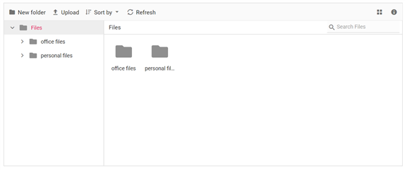
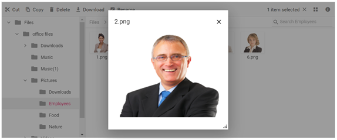

<!-- markdownlint-disable MD024 -->

# Getting Started with Blazor File Manager Component in Server App

This section briefly explains about how to include [Syncfusion<sup style="font-size:70%">&reg;</sup> Blazor FileManager](https://www.syncfusion.com/blazor-components/blazor-file-manager) component in your Blazor Server App using [Visual Studio](https://visualstudio.microsoft.com/vs/), [Visual Studio Code](https://code.visualstudio.com/), and the [.NET CLI](https://learn.microsoft.com/en-us/dotnet/core/tools/).





## Prerequisites

* [System requirements for Blazor components](https://blazor.syncfusion.com/documentation/system-requirements)

## Create a new Blazor App in Visual Studio

Create a **Blazor Server App** by using the **Blazor Web App** template in Visual Studio via [Microsoft Templates](https://learn.microsoft.com/en-us/aspnet/core/blazor/tooling?view=aspnetcore-10.0&pivots=vs) or the [Syncfusion<sup style="font-size:70%">&reg;</sup> Blazor Extension](https://blazor.syncfusion.com/documentation/visual-studio-integration/template-studio). For detailed instructions, refer to the [Blazor Server App Getting Started](https://blazor.syncfusion.com/documentation/getting-started/blazor-server-side-visual-studio) documentation.





## Prerequisites

* [System requirements for Blazor components](https://blazor.syncfusion.com/documentation/system-requirements)

## Create a new Blazor App in Visual Studio Code

Create a **Blazor Server App** using Visual Studio Code via [Microsoft Templates](https://learn.microsoft.com/en-us/aspnet/core/blazor/tooling?view=aspnetcore-10.0&pivots=vsc) or the [Syncfusion<sup style="font-size:70%">&reg;</sup> Blazor Extension](https://blazor.syncfusion.com/documentation/visual-studio-code-integration/create-project). For detailed instructions, refer to the [Blazor Server App Getting Started](https://blazor.syncfusion.com/documentation/getting-started/blazor-server-side-visual-studio?tabcontent=visual-studio-code) documentation.

Alternatively, create a Server application by using the following command in the integrated terminal (<kbd>Ctrl</kbd>+<kbd>`</kbd>).





dotnet new blazor -o BlazorApp -int Server
cd BlazorApp









## Prerequisites

Install the latest version of [.NET SDK](https://dotnet.microsoft.com/en-us/download). If the .NET SDK is already installed, determine the installed version by running the following command in a command prompt (Windows), terminal (macOS), or command shell (Linux).




dotnet --version




## Create a Blazor Server App using .NET CLI

Run the following command to create a new Blazor Server App in a command prompt (Windows) or terminal (macOS) or command shell (Linux). For detailed instructions, refer to the [Blazor Server App Getting Started](https://blazor.syncfusion.com/documentation/getting-started/blazor-server-side-visual-studio?tabcontent=.net-cli) documentation.




dotnet new blazor -o BlazorApp -int Server
cd BlazorApp








N> Configure the appropriate [Interactive render mode](https://learn.microsoft.com/en-us/aspnet/core/blazor/components/render-modes?view=aspnetcore-10.0#render-modes) and [Interactivity location](https://learn.microsoft.com/en-us/aspnet/core/blazor/tooling?view=aspnetcore-10.0&pivots=vs) while creating a Blazor Server App. For detailed information, refer to the [interactive render mode documentation](https://blazor.syncfusion.com/documentation/common/interactive-render-mode).

## Install Syncfusion<sup style="font-size:70%">&reg;</sup> Blazor packages

Install [Syncfusion.Blazor.FileManager](https://www.nuget.org/packages/Syncfusion.Blazor.FileManager/) and [Syncfusion.Blazor.Themes](https://www.nuget.org/packages/Syncfusion.Blazor.Themes/) NuGet packages in your project using the NuGet Package Manager in Visual Studio (*Tools → NuGet Package Manager → Manage NuGet Packages for Solution*), or the integrated terminal in Visual Studio Code (`dotnet add package`), or the .NET CLI.

Alternatively, run the following commands in the Package Manager Console to achieve the same.




Install-Package Syncfusion.Blazor.FileManager -Version {{ site.releaseversion }}
Install-Package Syncfusion.Blazor.Themes -Version {{ site.releaseversion }}




N> All Syncfusion Blazor packages are available on [nuget.org](https://www.nuget.org/packages?q=syncfusion.blazor). See the [NuGet packages](https://blazor.syncfusion.com/documentation/nuget-packages) topic for details.

## Add import namespaces

After the packages are installed, open the **~/_Imports.razor** file and import the `Syncfusion.Blazor` and `Syncfusion.Blazor.FileManager` namespaces.




@using Syncfusion.Blazor
@using Syncfusion.Blazor.FileManager




## Register Syncfusion<sup style="font-size:70%">&reg;</sup> Blazor service

Register the Syncfusion<sup style="font-size:70%">&reg;</sup> Blazor service in the **Program.cs** file of your Blazor Server App.




....
using Syncfusion.Blazor;
....
builder.Services.AddSyncfusionBlazor();
....




## Add stylesheet and script resources

The theme stylesheet and script can be accessed from NuGet through [Static Web Assets](https://blazor.syncfusion.com/documentation/appearance/themes#static-web-assets). Include the stylesheet and script references in the **~/Components/App.razor** file.

```html

<link href="_content/Syncfusion.Blazor.Themes/fluent2.css" rel="stylesheet" />
....
<script src="_content/Syncfusion.Blazor.Core/scripts/syncfusion-blazor.min.js" type="text/javascript"></script>

```

N> Check out the [Blazor Themes](https://blazor.syncfusion.com/documentation/appearance/themes) topic to discover various methods ([Static Web Assets](https://blazor.syncfusion.com/documentation/appearance/themes#static-web-assets), [CDN](https://blazor.syncfusion.com/documentation/appearance/themes#cdn-reference), and [CRG](https://blazor.syncfusion.com/documentation/common/custom-resource-generator)) for referencing themes in Blazor application. Also, check out the [Adding Script Reference](https://blazor.syncfusion.com/documentation/common/adding-script-references) topic to learn different approaches for adding script references in Blazor application.

## Add Syncfusion<sup style="font-size:70%">&reg;</sup> Blazor FileManager component

Add the Syncfusion<sup style="font-size:70%">&reg;</sup> Blazor FileManager component in the **~/Components/Pages/Home.razor** file. If the interactivity location is set to `Per page/component`, define a render mode at the top of the `~Pages/Home.razor` file.

N> If the Interactivity Location is set to `Global`, the render mode is automatically configured in the `App.razor` file by default.




@* desired render mode define here *@
@rendermode InteractiveServer







@using Syncfusion.Blazor.FileManager

<SfFileManager TValue="FileManagerDirectoryContent">
    <FileManagerAjaxSettings Url="https://ej2-aspcore-service.azurewebsites.net/api/FileManager/FileOperations"
                             UploadUrl="https://ej2-aspcore-service.azurewebsites.net/api/FileManager/Upload"
                             DownloadUrl="https://ej2-aspcore-service.azurewebsites.net/api/FileManager/Download"
                             GetImageUrl="https://ej2-aspcore-service.azurewebsites.net/api/FileManager/GetImage">
    </FileManagerAjaxSettings>
</SfFileManager>




## Create Models

Create a new folder named `Models` in the server project. Add the necessary model files to this folder for handling file operations. Download the `PhysicalFileProvider.cs` and `Base` folder from this [repository](https://github.com/SyncfusionExamples/ej2-aspcore-file-provider/tree/master/Models) and place them in the Models folder.

## Create a new folder controller

To initialize a local service, create a new folder name with `Controllers` inside the server part of the project. Then, create a new file `FileManagerController` with extension `.cs` inside the `Controllers` folder.

Make sure your controller `FileManagerController.cs` uses the model classes you've created. Import the model namespace at the top of your controller file

File Manager's base functions are available in the below namespace.
```cshtml
using Syncfusion.EJ2.FileManager.Base;
````
File Manager's operations are available in the below namespace.
````cshtml
using Syncfusion.EJ2.FileManager.PhysicalFileProvider;
````

## Initialize the service in controller

File Manager supports the basic file actions like Read, Delete, Copy, Move, Get Details, Search, Rename, and Create New Folder.

To initialize a local service, create a new folder name with `Controllers` inside the server part of the project. Then, create a new file `FileManagerController` with extension `.cs` inside the `Controllers` folder and add the following code in that file.




using Microsoft.AspNetCore.Mvc;
using System;
using System.Collections.Generic;
using Microsoft.AspNetCore.Hosting;
using Microsoft.AspNetCore.Http;
using Microsoft.AspNetCore.Http.Features;
//File Manager's base functions are available in the below namespace.
using Syncfusion.EJ2.FileManager.Base;
//File Manager's operations are available in the below namespace.
using Syncfusion.EJ2.FileManager.PhysicalFileProvider;
using System.IO;
using System.Linq;
using System.Threading.Tasks;

namespace filemanager.Server.Controllers
{
    [Route("api/[controller]")]
    public class FileManagerController : Controller
    {
        public PhysicalFileProvider operation;
        public string basePath;
        string root = "wwwroot\\Files";
        [Obsolete]
        public FileManagerController(IWebHostEnvironment hostingEnvironment)
        {
            this.basePath = hostingEnvironment.ContentRootPath;
            this.operation = new PhysicalFileProvider();
            this.operation.RootFolder(this.basePath + "\\" + this.root); // It denotes in which files and folders are available.
        }

        // Processing the File Manager operations.
        [Route("FileOperations")]
        public object FileOperations([FromBody] FileManagerDirectoryContent args)
        {
            switch (args.Action)
            {
                // Add your custom action here.
                case "read":
                    // Path - Current path; ShowHiddenItems - Boolean value to show/hide hidden items.
                    return this.operation.ToCamelCase(this.operation.GetFiles(args.Path, args.ShowHiddenItems));
                case "delete":
                    // Path - Current path where the folder to be deleted; Names - Name of the files to be deleted
                    return this.operation.ToCamelCase(this.operation.Delete(args.Path, args.Names));
                case "copy":
                    //  Path - Path from where the file was copied; TargetPath - Path where the file/folder is to be copied; RenameFiles - Files with same name in the copied location that is confirmed for renaming; TargetData - Data of the copied file
                    return this.operation.ToCamelCase(this.operation.Copy(args.Path, args.TargetPath, args.Names, args.RenameFiles, args.TargetData));
                case "move":
                    // Path - Path from where the file was cut; TargetPath - Path where the file/folder is to be moved; RenameFiles - Files with same name in the moved location that is confirmed for renaming; TargetData - Data of the moved file
                    return this.operation.ToCamelCase(this.operation.Move(args.Path, args.TargetPath, args.Names, args.RenameFiles, args.TargetData));
                case "details":
                    // Path - Current path where details of file/folder is requested; Name - Names of the requested folders
                    return this.operation.ToCamelCase(this.operation.Details(args.Path, args.Names));
                case "create":
                    // Path - Current path where the folder is to be created; Name - Name of the new folder
                    return this.operation.ToCamelCase(this.operation.Create(args.Path, args.Name));
                case "search":
                    // Path - Current path where the search is performed; SearchString - String typed in the searchbox; CaseSensitive - Boolean value which specifies whether the search must be casesensitive
                    return this.operation.ToCamelCase(this.operation.Search(args.Path, args.SearchString, args.ShowHiddenItems, args.CaseSensitive));
                case "rename":
                    // Path - Current path of the renamed file; Name - Old file name; NewName - New file name
                    return this.operation.ToCamelCase(this.operation.Rename(args.Path, args.Name, args.NewName));
            }
            return null;
        }
    }
}




To configure and map the controller, open the `~/Program.cs` file of the server part of the application. Add the following code to configure the service for the controller and map the controller after `app.UseRouting()`:

```cshtml
builder.Services.AddControllers();
...
app.UseRouting();
app.MapControllers();
```

This will configure and map the controller in your Blazor App.

## Create Web Server App

Add the Syncfusion<sup style="font-size:70%">&reg;</sup> Blazor File Manager component in `~/Pages/Home.razor` file.




@using Syncfusion.Blazor.FileManager

<SfFileManager TValue="FileManagerDirectoryContent">
    <FileManagerAjaxSettings Url="/api/FileManager/FileOperations"
                             UploadUrl="/api/FileManager/Upload"
                             DownloadUrl="/api/FileManager/Download"
                             GetImageUrl="/api/FileManager/GetImage">
    </FileManagerAjaxSettings>
</SfFileManager>




Add your required files and folders under the `wwwroot\Files` directory.
* In your  project, the `wwwroot` directory is where static files are served from. It is typically found at the root level of your server project.
* Inside the `wwwroot` directory, create a new folder named `Files`. This will be used to store static files like images, documents, or other resources that you want to serve directly.
* Press <kbd>Ctrl</kbd>+<kbd>F5</kbd> (Windows) or <kbd>⌘</kbd>+<kbd>F5</kbd> (macOS) to launch the application. This will render the Syncfusion<sup style="font-size:70%">&reg;</sup> Blazor File Manager component in your default web browser.



N> [View Sample in GitHub](https://github.com/SyncfusionExamples/Blazor-Getting-Started-Examples/tree/main/FileManager).

## File download support

To perform the download operation, initialize the [DownloadUrl](https://help.syncfusion.com/cr/blazor/Syncfusion.Blazor.FileManager.FileManagerAjaxSettings.html#Syncfusion_Blazor_FileManager_FileManagerAjaxSettings_DownloadUrl) property in a FileManagerAjaxSettings.




@using Syncfusion.Blazor.FileManager

<SfFileManager TValue="FileManagerDirectoryContent">
    <FileManagerAjaxSettings Url="/api/FileManager/FileOperations"
                                DownloadUrl="/api/FileManager/Download">
    </FileManagerAjaxSettings>
</SfFileManager>




Initialize the `Download` FileOperation in Controller part with the following code snippet.




namespace filemanager.Server.Controllers
{
    [Route("api/[controller]")]
    public class FileManagerController : Controller
    {
        // Processing the Download operation.
        [Route("Download")]
        public IActionResult Download(string downloadInput)
        {
            var options = new JsonSerializerOptions
            {
                PropertyNamingPolicy = JsonNamingPolicy.CamelCase,
            };
            FileManagerDirectoryContent args = JsonSerializer.Deserialize<FileManagerDirectoryContent>(downloadInput, options);
            return operation.Download(args.Path, args.Names, args.Data);
        }
    }
}




## File upload support

To perform the upload operation, initialize the [UploadUrl](https://help.syncfusion.com/cr/blazor/Syncfusion.Blazor.FileManager.FileManagerAjaxSettings.html#Syncfusion_Blazor_FileManager_FileManagerAjaxSettings_UploadUrl) property in a FileManagerAjaxSettings.




@using Syncfusion.Blazor.FileManager

<SfFileManager TValue="FileManagerDirectoryContent">
    <FileManagerAjaxSettings Url="/api/FileManager/FileOperations"
                                UploadUrl="/api/FileManager/Upload">
    </FileManagerAjaxSettings>
</SfFileManager>




Initialize the `Upload` File Operation in Controller part with the following code snippet.




namespace filemanager.Server.Controllers
{
    [Route("api/[controller]")]
    public class FileManagerController : Controller
    {
        // Processing the Upload operation.
        [Route("Upload")]
        [DisableRequestSizeLimit]
        public IActionResult Upload(string path, long size, IList<IFormFile> uploadFiles, string action)
        {
            try
            {
                FileManagerResponse uploadResponse;
                foreach (var file in uploadFiles)
                {
                    var folders = (file.FileName).Split('/');
                    // checking the folder upload
                    if (folders.Length > 1)
                    {
                        for (var i = 0; i < folders.Length - 1; i++)
                        {
                            string newDirectoryPath = Path.Combine(this.basePath + path, folders[i]);
                            if (Path.GetFullPath(newDirectoryPath) != (Path.GetDirectoryName(newDirectoryPath) + Path.DirectorySeparatorChar + folders[i]))
                            {
                                throw new UnauthorizedAccessException("Access denied for Directory-traversal");
                            }
                            if (!Directory.Exists(newDirectoryPath))
                            {
                                this.operation.ToCamelCase(this.operation.Create(path, folders[i]));
                            }
                            path += folders[i] + "/";
                        }
                    }
                }
                uploadResponse = operation.Upload(path, uploadFiles, action, size, null);
                if (uploadResponse.Error != null)
                {
                    Response.Clear();
                    Response.ContentType = "application/json; charset=utf-8";
                    Response.StatusCode = Convert.ToInt32(uploadResponse.Error.Code);
                    Response.HttpContext.Features.Get<IHttpResponseFeature>().ReasonPhrase = uploadResponse.Error.Message;
                }
            }
            catch (Exception e)
            {
                ErrorDetails er = new ErrorDetails();
                er.Message = e.Message.ToString();
                er.Code = "417";
                er.Message = "Access denied for Directory-traversal";
                Response.Clear();
                Response.ContentType = "application/json; charset=utf-8";
                Response.StatusCode = Convert.ToInt32(er.Code);
                Response.HttpContext.Features.Get<IHttpResponseFeature>().ReasonPhrase = er.Message;
                return Content("");
            }
            return Content("");
        }
    }
}




## Image preview support

To perform image preview support in the File Manager component, initialize the [GetImageUrl](https://help.syncfusion.com/cr/blazor/Syncfusion.Blazor.FileManager.FileManagerAjaxSettings.html#Syncfusion_Blazor_FileManager_FileManagerAjaxSettings_GetImageUrl) property in a FileManagerAjaxSettings.




@using Syncfusion.Blazor.FileManager

<SfFileManager TValue="FileManagerDirectoryContent">
    <FileManagerAjaxSettings Url="/api/FileManager/FileOperations"
                                GetImageUrl="/api/FileManager/GetImage">
    </FileManagerAjaxSettings>
</SfFileManager>




Initialize the `GetImage` File Operation in Controller part with the following code snippet.




namespace filemanager.Server.Controllers
{
    [Route("api/[controller]")]
    public class FileManagerController : Controller
    {
        // Processing the GetImage operation.
        [Route("GetImage")]
        public IActionResult GetImage(FileManagerDirectoryContent args)
        {
            return this.operation.GetImage(args.Path, args.Id,false,null, null);
        }
    }
}






## See Also

[Getting Started with Syncfusion<sup style="font-size:70%">&reg;</sup> Blazor for Client-Side in .NET Core CLI](https://blazor.syncfusion.com/documentation/getting-started/blazor-webassembly-dotnet-cli)

[Getting Started with Syncfusion<sup style="font-size:70%">&reg;</sup> Blazor for Client-Side in Visual Studio](https://blazor.syncfusion.com/documentation/getting-started/blazor-webassembly-visual-studio)

[Getting Started with Syncfusion<sup style="font-size:70%">&reg;</sup> Blazor for Server-Side in .NET Core CLI](https://blazor.syncfusion.com/documentation/getting-started/blazor-server-side-dotnet-cli)
