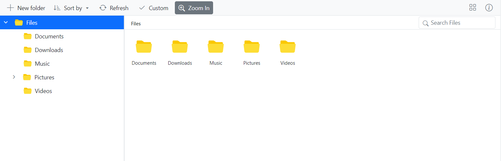

# Adding Custom Item to Toolbar in Blazor FileManager Component

The toolbar items can be customized using the `ToolbarSettings` API and `ToolbarCreated` events.

The following example shows adding a custom item in the toolbar. The new toolbar button is added using `ToolbarSettings`. The `ToolbarCreated` event is used to add an extra properties for the new toolbar button.

```cshtml

@using Syncfusion.Blazor.FileManager

    <SfFileManager TValue="FileManagerDirectoryContent">
        <FileManagerAjaxSettings Url="/api/SampleData/FileOperations"
                                 UploadUrl="/api/SampleData/Upload"
                                 DownloadUrl="/api/SampleData/Download"
                                 GetImageUrl="/api/SampleData/GetImage">
        </FileManagerAjaxSettings>
        <FileManagerToolbarSettings Items="@Items"></FileManagerToolbarSettings>
    </SfFileManager>

@code {
    public string[] Items =  new string[] {"NewFolder", "Upload", "Custom", "Delete", "Download", "Rename", "SortBy", "Refresh", "Selection", "View", "Details"};

    public void toolbarCreate( ToolbarCreateEventArgs args) {
        args.Items.Add(new ToolBarItemModel()
            {
                Text = "Custom",
                PrefixIcon = "e-icons e-fe-tick",
                TooltipText = "Test Tooltip"
            });
    }
}

```

## Run the application

After successful compilation of your application, simply press `F5` to run the application.


