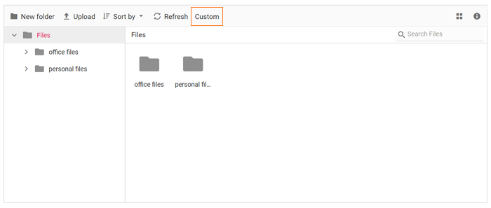

# How to add custom button in toolbar

The toolbar items can be customized using the `ToolbarSettings` API and `ToolbarItemClicked` events.

The following example shows adding a custom item in the toolbar.

The new toolbar button is added using `ToolbarSettings`. The  event is used to add an `ToolbarItemClicked` event handler to the new toolbar button.

```csharp

@using Syncfusion.Blazor.FileManager

    <SfFileManager TValue="FileManagerDirectoryContent">
        <FileManagerAjaxSettings Url="/api/SampleData/FileOperations"
                                 UploadUrl="/api/SampleData/Upload"
                                 DownloadUrl="/api/SampleData/Download"
                                 GetImageUrl="/api/SampleData/GetImage">
        </FileManagerAjaxSettings>
        <FileManagerToolbarSettings Items="@Items"></FileManagerToolbarSettings>
    </SfFileManager>

@code {
    public string[] Items =  new string[] {"NewFolder", "Upload", "Delete", "Download", "Rename", "SortBy", "Refresh", "Selection", "View", "Details", "Custom"};
}

```

## Run the application

After successful compilation of your application, simply press `F5` to run the application.

Output be like the below.

