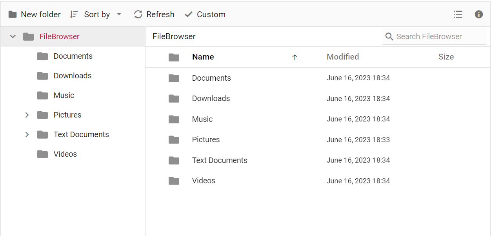
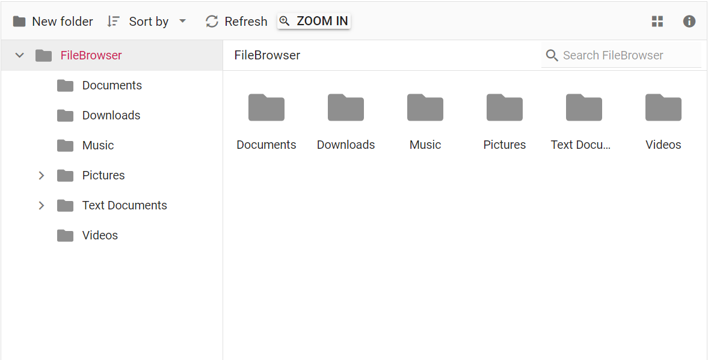

# Adding Custom Item to Toolbar in Blazor File Manager Component

To enhance the customization of toolbar items, the [FileManagerToolbarSettings](https://help.syncfusion.com/cr/blazor/Syncfusion.Blazor.FileManager.FileManagerToolbarSettings.html) tag and [FileManagerCustomToolbarItem](https://help.syncfusion.com/cr/blazor/Syncfusion.Blazor.FileManager.FileManagerCustomToolbarItem.html) property can be utilized. These features allow for easy addition, appearance, modification of custom toolbar items.

**Case 1**: To introduce the `Custom` item to the toolbar using the list of items and customize using icon and tooltip attributes, you can refer to the below code example.


```cshtml

@using Syncfusion.Blazor.FileManager

    <SfFileManager TValue="FileManagerDirectoryContent">
        <FileManagerAjaxSettings Url="/api/SampleData/FileOperations"
                                 UploadUrl="/api/SampleData/Upload"
                                 DownloadUrl="/api/SampleData/Download"
                                 GetImageUrl="/api/SampleData/GetImage">
        </FileManagerAjaxSettings>
        <FileManagerToolbarSettings ToolbarItems="@Items"></FileManagerToolbarSettings>
    </SfFileManager>

@code {
    public List<ToolBarItemModel> Items = new List<ToolBarItemModel>(){
        new ToolBarItemModel() { Name = "NewFolder" },
        new ToolBarItemModel() { Name = "Cut" },
        new ToolBarItemModel() { Name = "Copy" },
        new ToolBarItemModel() { Name = "Paste" },
        new ToolBarItemModel() { Name = "Delete" },
        new ToolBarItemModel() { Name = "Download" },
        new ToolBarItemModel() { Name = "Rename" },
        new ToolBarItemModel() { Name = "SortBy" },
        new ToolBarItemModel() { Name = "Refresh" },
        new ToolBarItemModel() { Name = "Custom", Text="Custom", TooltipText="Test Tooltip", PrefixIcon="e-icons e-check" },
        new ToolBarItemModel() { Name = "Selection" },
        new ToolBarItemModel() { Name = "View" },
        new ToolBarItemModel() { Name = "Details" },
    };
}

```




**Case 2**: To include Blazor components in the File Manager toolbar, you can use the template tag. This enables you to seamlessly render additional components within the toolbar. By assigning the same `Name` property in the toolbar items list, you can determine the desired position of the template item within the toolbar.

```cshtml

@using Syncfusion.Blazor.FileManager
@using Syncfusion.Blazor.Buttons

    <SfFileManager TValue="FileManagerDirectoryContent">
        <FileManagerAjaxSettings Url="/api/SampleData/FileOperations"
                                 UploadUrl="/api/SampleData/Upload"
                                 DownloadUrl="/api/SampleData/Download"
                                 GetImageUrl="/api/SampleData/GetImage">
        </FileManagerAjaxSettings>
        <FileManagerToolbarSettings ToolbarItems="@Items"> 
            <FileManagerCustomToolbarItems> 
                <FileManagerCustomToolbarItem Name="Zoomin">
                    <Template>
                        <SfButton CssClass="e-tbar-btn-text e-tbar-ddb-text " Content="Zoom In" IconCss="e-icons e-zoom-in"></SfButton>
                    </Template>
                </FileManagerCustomToolbarItem>
            </FileManagerCustomToolbarItems> 
        </FileManagerToolbarSettings>
    </SfFileManager>

@code {
    public List<ToolBarItemModel> Items = new List<ToolBarItemModel>(){
        new ToolBarItemModel() { Name = "NewFolder" },
        new ToolBarItemModel() { Name = "Cut" },
        new ToolBarItemModel() { Name = "Copy" },
        new ToolBarItemModel() { Name = "Paste" },
        new ToolBarItemModel() { Name = "Delete" },
        new ToolBarItemModel() { Name = "Download" },
        new ToolBarItemModel() { Name = "Rename" },
        new ToolBarItemModel() { Name = "SortBy" },
        new ToolBarItemModel() { Name = "Refresh" },
        new ToolBarItemModel() { Name = "Zoomin" , TooltipText ="Click to zoom in" },
        new ToolBarItemModel() { Name = "Selection" },
        new ToolBarItemModel() { Name = "View" },
        new ToolBarItemModel() { Name = "Details" },
    };
}

```



