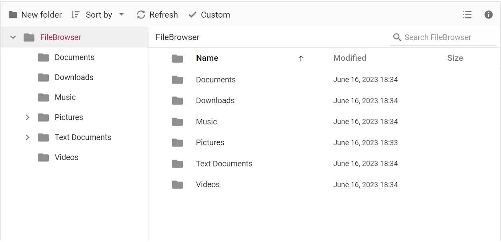
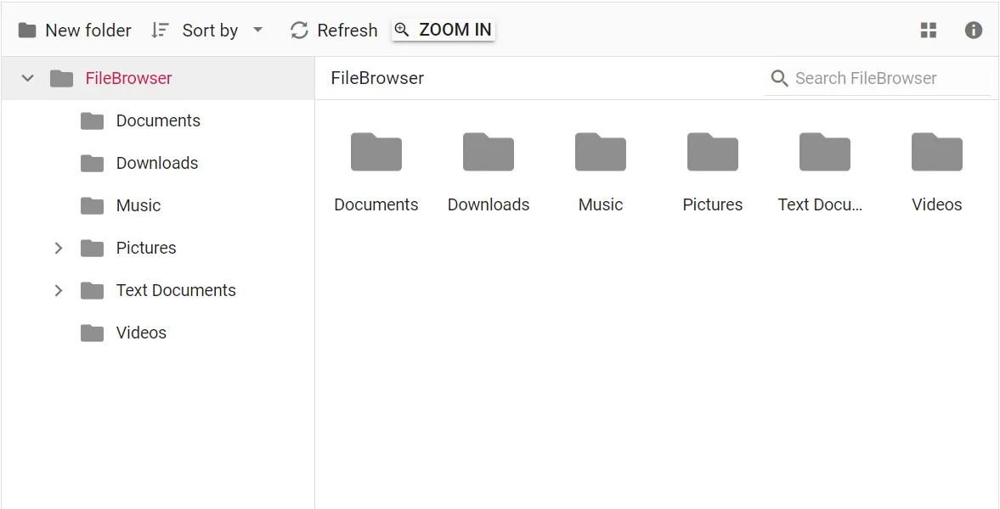

# Adding Custom Item to Toolbar in Blazor File Manager Component

Use the [FileManagerToolbarSettings](https://help.syncfusion.com/cr/blazor/Syncfusion.Blazor.FileManager.FileManagerToolbarSettings.html) component to configure toolbar items. To render a custom Blazor component in the toolbar, use the [FileManagerCustomToolbarItem](https://help.syncfusion.com/cr/blazor/Syncfusion.Blazor.FileManager.FileManagerCustomToolbarItem.html) component inside `FileManagerCustomToolbarItems`.

The examples use `/api/SampleData` backend endpoints. To configure these endpoints, see the [Data Binding](https://blazor.syncfusion.com/documentation/file-manager/data-binding) guide.

**Case 1**: Add a `Custom` item to the toolbar and customize its icon and tooltip as shown in the following example.


```cshtml

@using Syncfusion.Blazor.FileManager

    <SfFileManager TValue="FileManagerDirectoryContent">
        <FileManagerAjaxSettings Url="/api/SampleData/FileOperations"
                                 UploadUrl="/api/SampleData/Upload"
                                 DownloadUrl="/api/SampleData/Download"
                                 GetImageUrl="/api/SampleData/GetImage">
        </FileManagerAjaxSettings>
        <FileManagerToolbarSettings ToolbarItems="@Items"></FileManagerToolbarSettings>
    </SfFileManager>

@code {
    public List<ToolBarItemModel> Items = new List<ToolBarItemModel>(){
        new ToolBarItemModel() { Name = "NewFolder" },
        new ToolBarItemModel() { Name = "Cut" },
        new ToolBarItemModel() { Name = "Copy" },
        new ToolBarItemModel() { Name = "Paste" },
        new ToolBarItemModel() { Name = "Delete" },
        new ToolBarItemModel() { Name = "Download" },
        new ToolBarItemModel() { Name = "Rename" },
        new ToolBarItemModel() { Name = "SortBy" },
        new ToolBarItemModel() { Name = "Refresh" },
        new ToolBarItemModel() { Name = "Custom", Text="Custom", TooltipText="Test Tooltip", PrefixIcon="e-icons e-check" },
        new ToolBarItemModel() { Name = "Selection" },
        new ToolBarItemModel() { Name = "View" },
        new ToolBarItemModel() { Name = "Details" },
    };
}

```




**Case 2**: To include Blazor components in the File Manager toolbar, use the `Template` tag. Set the `Name` property to match the corresponding item in the toolbar list to control its position. This example renders a button and logs its click; replace the handler with your application's zoom logic.

```cshtml

@using Syncfusion.Blazor.FileManager
@using Syncfusion.Blazor.Buttons

    <SfFileManager TValue="FileManagerDirectoryContent">
        <FileManagerAjaxSettings Url="/api/SampleData/FileOperations"
                                 UploadUrl="/api/SampleData/Upload"
                                 DownloadUrl="/api/SampleData/Download"
                                 GetImageUrl="/api/SampleData/GetImage">
        </FileManagerAjaxSettings>
        <FileManagerToolbarSettings ToolbarItems="@Items"> 
            <FileManagerCustomToolbarItems>
                <FileManagerCustomToolbarItem Name="Zoomin">
                    <Template>
                        <SfButton CssClass="e-tbar-btn-text e-tbar-ddb-text " Content="Zoom In" IconCss="e-icons e-zoom-in"></SfButton>
                    </Template>
                </FileManagerCustomToolbarItem>
            </FileManagerCustomToolbarItems>
        </FileManagerToolbarSettings>
    </SfFileManager>

@code {
    public List<ToolBarItemModel> Items = new List<ToolBarItemModel>(){
        new ToolBarItemModel() { Name = "NewFolder" },
        new ToolBarItemModel() { Name = "Cut" },
        new ToolBarItemModel() { Name = "Copy" },
        new ToolBarItemModel() { Name = "Paste" },
        new ToolBarItemModel() { Name = "Delete" },
        new ToolBarItemModel() { Name = "Download" },
        new ToolBarItemModel() { Name = "Rename" },
        new ToolBarItemModel() { Name = "SortBy" },
        new ToolBarItemModel() { Name = "Refresh" },
        new ToolBarItemModel() { Name = "Zoomin" , TooltipText ="Click to zoom in" },
        new ToolBarItemModel() { Name = "Selection" },
        new ToolBarItemModel() { Name = "View" },
        new ToolBarItemModel() { Name = "Details" },
    };
}

```



